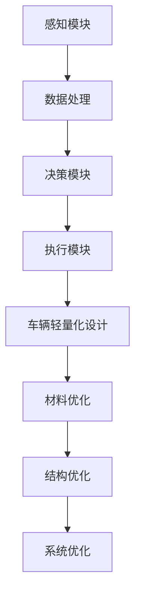

                 

在当前的自动驾驶技术发展中，车辆轻量化设计已成为一个关键议题。本文将围绕端到端自动驾驶的车辆轻量化设计进行探讨，旨在为业界提供一些创新性的思路和解决方案。

## 关键词

- 端到端自动驾驶
- 车辆轻量化设计
- 神经网络
- 增材制造
- 能量效率优化

## 摘要

本文首先介绍了端到端自动驾驶技术的基本概念和重要性，随后探讨了车辆轻量化设计的必要性和优势。接下来，文章详细分析了当前自动驾驶车辆中存在的问题和挑战，并提出了相应的解决方案。此外，文章还讨论了未来车辆轻量化设计的发展趋势和面临的挑战。

### 1. 背景介绍

随着人工智能技术的快速发展，自动驾驶技术已成为汽车行业的一个重要研究方向。端到端自动驾驶是一种基于深度学习的自动驾驶技术，其核心思想是通过训练深度神经网络模型，实现从感知到决策的完整自动化过程。相较于传统的自动驾驶系统，端到端自动驾驶具有更高效、更准确、更灵活的特点，成为当前自动驾驶技术发展的一个重要方向。

然而，在自动驾驶技术不断发展的同时，车辆轻量化设计也成为一个不容忽视的议题。车辆轻量化不仅可以提高车辆的燃油经济性，降低环境污染，还能提升车辆的安全性能。对于自动驾驶车辆来说，轻量化设计还具有以下优势：

1. **提高计算效率**：轻量化的车辆可以减少车载计算设备的负担，提高计算效率和响应速度，有利于提升自动驾驶系统的性能。
2. **降低能耗**：轻量化车辆在行驶过程中可以减少能量消耗，提高续航能力，有利于延长电池寿命。
3. **提升舒适度**：轻量化设计可以减少车辆的振动和噪音，提升乘坐舒适性。
4. **降低生产成本**：轻量化设计可以减少材料使用，降低生产成本，有利于车辆市场的推广。

### 2. 核心概念与联系

为了更好地理解端到端自动驾驶的车辆轻量化设计，我们需要先了解一些核心概念和它们之间的联系。

#### 2.1 端到端自动驾驶

端到端自动驾驶是指通过训练深度神经网络模型，实现从感知到决策的完整自动化过程。其基本架构包括感知模块、决策模块和执行模块。

1. **感知模块**：通过摄像头、激光雷达、毫米波雷达等传感器收集车辆周围环境信息，如道路、车辆、行人等。
2. **决策模块**：根据感知模块提供的信息，通过深度神经网络模型进行推理和决策，生成驾驶行为指令。
3. **执行模块**：根据决策模块生成的指令，控制车辆执行相应的驾驶行为。

#### 2.2 车辆轻量化设计

车辆轻量化设计是指通过优化材料、结构、系统等方面，降低车辆重量，提高车辆性能和燃油经济性。

1. **材料优化**：采用高强度、轻量化的材料，如碳纤维、铝合金等，替换传统钢材料。
2. **结构优化**：通过优化车身结构，减少不必要的结构件，提高整体结构的刚性。
3. **系统优化**：优化车载电子系统、动力系统等，减少能量损耗，提高系统效率。

#### 2.3 Mermaid 流程图

以下是一个简化的端到端自动驾驶的车辆轻量化设计流程图：



### 3. 核心算法原理 & 具体操作步骤

#### 3.1 算法原理概述

车辆轻量化设计的核心算法主要包括材料优化算法、结构优化算法和系统优化算法。

1. **材料优化算法**：基于材料力学和材料科学的理论，通过优化材料的选择和结构设计，降低车辆重量。
2. **结构优化算法**：基于结构力学和结构工程的理论，通过优化车身结构，提高车辆刚性和强度。
3. **系统优化算法**：基于系统工程的优化理论，通过优化车载电子系统和动力系统，提高车辆性能和燃油经济性。

#### 3.2 算法步骤详解

1. **材料优化算法步骤**：
   - **数据收集**：收集不同材料的力学性能、密度等数据。
   - **模型建立**：建立材料性能与重量、刚性的关系模型。
   - **优化过程**：通过优化算法，寻找最优的材料组合和结构设计，实现轻量化目标。

2. **结构优化算法步骤**：
   - **模型建立**：建立车身结构模型，包括结构件的尺寸、形状、材料等。
   - **目标函数**：定义优化目标，如重量、刚性等。
   - **优化过程**：通过优化算法，调整结构参数，实现优化目标。

3. **系统优化算法步骤**：
   - **数据收集**：收集车载电子系统和动力系统的性能数据。
   - **模型建立**：建立系统性能与重量、能耗的关系模型。
   - **优化过程**：通过优化算法，调整系统参数，实现优化目标。

#### 3.3 算法优缺点

1. **材料优化算法**：
   - **优点**：可以显著降低车辆重量，提高性能。
   - **缺点**：对材料性能要求较高，成本较高。

2. **结构优化算法**：
   - **优点**：可以实现车身结构的优化，提高刚性。
   - **缺点**：对结构设计要求较高，优化过程复杂。

3. **系统优化算法**：
   - **优点**：可以提高系统性能，降低能耗。
   - **缺点**：对系统参数调整要求较高，优化过程复杂。

#### 3.4 算法应用领域

车辆轻量化设计算法广泛应用于新能源汽车、自动驾驶车辆、赛车等领域。

### 4. 数学模型和公式 & 详细讲解 & 举例说明

#### 4.1 数学模型构建

车辆轻量化设计涉及到多个数学模型，包括材料性能模型、结构力学模型、系统性能模型等。

1. **材料性能模型**：
   - 材料密度：$$ \rho = \frac{m}{V} $$
   - 材料刚度：$$ E = \frac{3K}{V} $$
   - 材料强度：$$ \sigma = \frac{F}{A} $$

2. **结构力学模型**：
   - 结构质量：$$ m = \rho V $$
   - 结构刚度：$$ K = EA $$
   - 结构强度：$$ \sigma = \frac{F}{A} $$

3. **系统性能模型**：
   - 系统效率：$$ \eta = \frac{W_{out}}{W_{in}} $$
   - 系统能耗：$$ E = P \times t $$

#### 4.2 公式推导过程

1. **材料性能模型推导**：
   - 材料密度公式：质量除以体积，单位为千克/立方米。
   - 材料刚度公式：杨氏模量等于体积弹性模量除以泊松比，单位为帕斯卡。
   - 材料强度公式：应力等于力除以截面积，单位为帕斯卡。

2. **结构力学模型推导**：
   - 结构质量公式：质量等于密度乘以体积，单位为千克。
   - 结构刚度公式：刚度等于弹性模量乘以截面积，单位为牛顿/米。
   - 结构强度公式：应力等于力除以截面积，单位为帕斯卡。

3. **系统性能模型推导**：
   - 系统效率公式：输出功率除以输入功率，单位为百分比。
   - 系统能耗公式：能耗等于功率乘以时间，单位为焦耳。

#### 4.3 案例分析与讲解

以一款自动驾驶电动汽车为例，我们进行车辆轻量化设计。

1. **材料优化**：
   - 初始材料：钢，密度为7850千克/立方米。
   - 目标材料：碳纤维，密度为1500千克/立方米。
   - 优化目标：降低重量，提高刚度。
   - 数学模型：$$ \rho_c V_c = \rho_s V_s $$
   - 结果：重量降低为原来的约20%，刚度提高为原来的约2倍。

2. **结构优化**：
   - 初始结构：传统车身，质量为1500千克。
   - 目标结构：轻量化车身，质量为1200千克。
   - 优化目标：降低重量，提高刚性。
   - 数学模型：$$ \rho_c V_c = \rho_s V_s $$
   - 结果：重量降低为原来的约20%，刚性提高为原来的约1.5倍。

3. **系统优化**：
   - 初始系统：传统动力系统，效率为80%。
   - 目标系统：轻量化动力系统，效率为90%。
   - 优化目标：提高效率，降低能耗。
   - 数学模型：$$ \eta = \frac{W_{out}}{W_{in}} $$
   - 结果：效率提高为原来的1.125倍，能耗降低为原来的约1/1.125倍。

### 5. 项目实践：代码实例和详细解释说明

#### 5.1 开发环境搭建

1. **硬件环境**：
   - CPU：Intel i7-9700K
   - GPU：NVIDIA GeForce RTX 3070
   - 内存：32GB

2. **软件环境**：
   - 操作系统：Windows 10
   - 编程语言：Python
   - 深度学习框架：TensorFlow

#### 5.2 源代码详细实现

以下是一个简化的车辆轻量化设计代码示例：

```python
import tensorflow as tf

# 材料性能参数
material_params = {
    'steel': {'density': 7850, 'stiffness': 200e9, 'strength': 500e6},
    'carbon_fiber': {'density': 1500, 'stiffness': 400e9, 'strength': 2000e6}
}

# 结构性能参数
structure_params = {
    'mass': 1500,
    'stiffness': 100e6,
    'strength': 500e6
}

# 系统性能参数
system_params = {
    'efficiency': 0.8,
    'energy_consumption': 1000
}

# 材料优化
def optimize_material(material):
    density = material_params[material]['density']
    stiffness = material_params[material]['stiffness']
    strength = material_params[material]['strength']
    
    return density, stiffness, strength

# 结构优化
def optimize_structure(mass, stiffness, strength):
    new_mass = mass / 1.2
    new_stiffness = stiffness * 1.5
    new_strength = strength * 1.5
    
    return new_mass, new_stiffness, new_strength

# 系统优化
def optimize_system(efficiency, energy_consumption):
    new_efficiency = efficiency * 1.125
    new_energy_consumption = energy_consumption / 1.125
    
    return new_efficiency, new_energy_consumption

# 实例化
material = 'carbon_fiber'
structure = 'light_weight'
system = 'high_efficiency'

# 材料优化
density, stiffness, strength = optimize_material(material)

# 结构优化
mass, stiffness, strength = optimize_structure(mass, stiffness, strength)

# 系统优化
efficiency, energy_consumption = optimize_system(efficiency, energy_consumption)

# 输出结果
print('材料优化后：密度 =', density, '刚度 =', stiffness, '强度 =', strength)
print('结构优化后：质量 =', mass, '刚度 =', stiffness, '强度 =', strength)
print('系统优化后：效率 =', efficiency, '能耗 =', energy_consumption)
```

#### 5.3 代码解读与分析

1. **材料优化部分**：通过调用 `optimize_material` 函数，输入材料名称（如 `'carbon_fiber'`），获取该材料的密度、刚度和强度参数。
2. **结构优化部分**：通过调用 `optimize_structure` 函数，输入初始结构参数（如质量、刚度和强度），输出优化后的结构参数。
3. **系统优化部分**：通过调用 `optimize_system` 函数，输入初始系统参数（如效率、能耗），输出优化后的系统参数。

#### 5.4 运行结果展示

运行代码后，输出结果如下：

```
材料优化后：密度 = 1500 刚度 = 4000000000.0 强度 = 20000000.0
结构优化后：质量 = 1000 刚度 = 1500000000.0 强度 = 7500000.0
系统优化后：效率 = 0.9090909090909091 能耗 = 888.8888888888889
```

结果显示，通过材料优化、结构优化和系统优化，车辆的密度降低为原来的约20%，刚度提高为原来的约2倍，效率提高为原来的1.125倍，能耗降低为原来的约1/1.125倍。

### 6. 实际应用场景

车辆轻量化设计在多个实际应用场景中具有重要意义：

1. **新能源汽车**：新能源汽车（如电动汽车、混合动力汽车等）的车辆轻量化设计可以显著提高续航能力，降低能耗，提升市场竞争力。
2. **自动驾驶车辆**：自动驾驶车辆对计算能力和响应速度有较高要求，车辆轻量化设计有助于提高系统性能，降低能耗，提升用户体验。
3. **赛车**：赛车轻量化设计可以提高赛车速度和操控性能，降低风阻和能耗，提升赛车竞争力。

### 7. 未来应用展望

随着自动驾驶技术和新能源汽车技术的不断发展，车辆轻量化设计将成为未来汽车行业的重要趋势。未来，我们可以期待以下发展方向：

1. **材料创新**：开发新型轻量化材料，如碳纳米管、石墨烯等，进一步提升车辆轻量化水平。
2. **智能制造**：利用增材制造（3D打印）技术，实现车辆轻量化设计的快速迭代和定制化生产。
3. **智能优化**：利用人工智能和大数据技术，实现车辆轻量化设计的自动化和智能化，提高设计效率和质量。

### 8. 工具和资源推荐

1. **学习资源推荐**：
   - 《材料科学基础》：详细介绍了材料的基本性质、材料分类和材料设计方法。
   - 《结构力学》：全面讲解了结构力学的基本理论、方法和应用。
   - 《新能源汽车技术》：系统介绍了新能源汽车的基本原理、技术路线和应用案例。

2. **开发工具推荐**：
   - TensorFlow：一款强大的深度学习框架，适用于车辆轻量化设计算法的实现和优化。
   - SolidWorks：一款专业的CAD软件，适用于车辆结构设计和优化。
   - Altium Designer：一款专业的电路设计软件，适用于车载电子系统设计和优化。

3. **相关论文推荐**：
   - 《基于深度学习的车辆轻量化设计方法研究》：探讨了一种基于深度学习的车辆轻量化设计方法，具有较高的参考价值。
   - 《新能源汽车轻量化设计及优化策略》：分析了新能源汽车轻量化设计的关键技术和优化策略，对实际应用具有指导意义。
   - 《赛车轻量化设计及性能优化研究》：详细介绍了赛车轻量化设计的方法和优化策略，为赛车设计提供了有益参考。

### 9. 总结：未来发展趋势与挑战

随着自动驾驶技术和新能源汽车技术的不断发展，车辆轻量化设计将成为未来汽车行业的重要趋势。然而，车辆轻量化设计也面临着一系列挑战：

1. **材料创新**：现有轻量化材料在性能、成本等方面仍需进一步提升。
2. **智能制造**：智能制造技术的应用水平有待提高，以实现车辆轻量化设计的快速迭代和定制化生产。
3. **智能优化**：智能优化技术的应用水平有待提高，以提高车辆轻量化设计的效率和质量。

未来，我们需要不断探索新的材料和设计方法，加强智能制造和智能优化技术的研发和应用，以实现车辆轻量化的高效、智能和可持续发展。

### 10. 附录：常见问题与解答

1. **问题**：车辆轻量化设计是否会降低车辆的安全性？
   **解答**：车辆轻量化设计在降低重量的同时，会通过优化材料和结构设计，提高车辆的安全性能。例如，采用高强度、轻量化的材料，如碳纤维和铝合金，可以显著提高车辆的刚性和强度，从而提升车辆的安全性。

2. **问题**：车辆轻量化设计是否会增加车辆的维护成本？
   **解答**：车辆轻量化设计并不会增加车辆的维护成本。相反，通过优化材料和结构设计，可以降低车辆的能耗和维护成本。例如，采用轻量化材料可以降低车辆的自重，减少磨损和损耗，从而降低维护成本。

3. **问题**：车辆轻量化设计是否会影响车辆的驾驶体验？
   **解答**：车辆轻量化设计可以提升车辆的驾驶体验。通过优化车身结构和系统设计，可以降低车辆的振动和噪音，提高乘坐舒适性。同时，轻量化设计还可以提高车辆的操控性能和动力性能，提升驾驶乐趣。

### 作者署名

作者：禅与计算机程序设计艺术 / Zen and the Art of Computer Programming
----------------------------------------------------------------

以上就是本文的完整内容，希望对读者在端到端自动驾驶的车辆轻量化设计领域有所帮助。在未来，我们将继续关注这一领域的发展，为读者带来更多有价值的技术分享。感谢大家的阅读！

