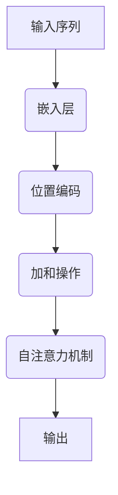

                 

 关键词：注意力机制，位置编码，Transformer，神经网络，序列建模，自然语言处理，机器学习，深度学习。

摘要：本文深入探讨了注意力机制（Attention Mechanism）和位置编码（Positional Encoding）在深度学习，特别是自然语言处理（NLP）领域的应用。我们将首先介绍注意力机制的基本概念，随后深入其数学原理和实现方法，接着讨论位置编码的作用和常见技术。最后，我们将通过实际代码示例，展示如何将注意力机制和位置编码应用于Transformer模型中，并分析其效果和应用前景。

## 1. 背景介绍

注意力机制（Attention Mechanism）最早由Bahdanau等人在2014年的论文中提出，它为序列到序列模型（如机器翻译）带来了革命性的改进。注意力机制允许模型在处理一个序列时，动态地关注序列中的不同部分，从而提高了模型对输入序列的理解能力。

位置编码（Positional Encoding）是针对序列数据的，因为它可以帮助神经网络模型理解序列中各个元素的位置信息。在处理自然语言等序列数据时，位置信息是至关重要的，因为单词或字符的顺序决定了句子的含义。

随着深度学习在自然语言处理领域的快速发展，Transformer模型在2017年由Vaswani等人提出，完全基于自注意力机制，实现了显著的性能提升。自那时起，注意力机制和位置编码成为了深度学习领域的核心组件。

## 2. 核心概念与联系

### 2.1 注意力机制的基本概念

注意力机制的核心思想是让神经网络在处理输入序列时，动态地分配权重给序列中的不同部分。这种权重分配使得模型能够自动关注到输入序列中的关键信息，从而提高模型的预测能力。

### 2.2 位置编码的作用

位置编码的作用是向模型提供输入序列中元素的位置信息。在自然语言处理中，单词或字符的顺序决定了句子的含义，因此位置编码对于理解序列数据非常重要。

### 2.3 Mermaid 流程图

下面是一个Mermaid流程图，用于展示注意力机制和位置编码的基本流程：



## 3. 核心算法原理 & 具体操作步骤

### 3.1 算法原理概述

注意力机制通过计算一系列权重来分配关注点。这些权重决定了模型在处理序列时，应该关注哪些部分。具体而言，注意力权重是通过计算查询（Query）、键（Key）和值（Value）之间的相似度来得到的。

位置编码是通过将位置信息编码到嵌入向量中来实现的。常见的方法包括正弦和余弦编码。

### 3.2 算法步骤详解

#### 步骤1：嵌入层

将输入序列（单词或字符）转化为嵌入向量。

$$
\text{Embedding}(x) = \text{embedding}_{i}
$$

其中，\( x \) 是输入序列，\( \text{embedding}_{i} \) 是第 \( i \) 个单词或字符的嵌入向量。

#### 步骤2：位置编码

将位置信息编码到嵌入向量中。

$$
\text{Positional Encoding}(p) = \text{PE}_{pos}
$$

其中，\( p \) 是位置索引，\( \text{PE}_{pos} \) 是位置编码向量。

#### 步骤3：加和操作

将嵌入向量和位置编码向量相加。

$$
\text{Input Vector} = \text{Embedding}(x) + \text{Positional Encoding}(p)
$$

#### 步骤4：自注意力机制

计算注意力权重。

$$
\text{Attention}(Q, K, V) = \text{softmax}\left(\frac{QK^T}{\sqrt{d_k}}\right)V
$$

其中，\( Q \) 是查询向量，\( K \) 是键向量，\( V \) 是值向量，\( d_k \) 是键向量的维度。

#### 步骤5：输出

将注意力机制的结果作为模型的输出。

$$
\text{Output} = \text{Attention}(Q, K, V)
$$

### 3.3 算法优缺点

#### 优点

- **高效性**：注意力机制允许模型在处理序列时动态地分配关注点，从而提高了模型的效率。
- **灵活性**：通过调整注意力权重，模型可以自动关注到输入序列中的关键信息。

#### 缺点

- **计算复杂度**：在长序列中，自注意力机制的复杂度是 \( O(n^2) \)，其中 \( n \) 是序列长度。

### 3.4 算法应用领域

注意力机制广泛应用于自然语言处理、图像识别和语音处理等领域。特别是在自然语言处理中，它为机器翻译、文本摘要、情感分析等任务带来了显著的性能提升。

## 4. 数学模型和公式 & 详细讲解 & 举例说明

### 4.1 数学模型构建

注意力机制的数学模型包括三个主要部分：查询（Query）、键（Key）和值（Value）。

- 查询（Query）用于生成注意力权重。
- 键（Key）用于计算查询和键之间的相似度。
- 值（Value）用于生成最终的输出。

### 4.2 公式推导过程

注意力机制的公式推导如下：

$$
\text{Attention}(Q, K, V) = \text{softmax}\left(\frac{QK^T}{\sqrt{d_k}}\right)V
$$

其中，\( Q \) 是查询向量，\( K \) 是键向量，\( V \) 是值向量，\( d_k \) 是键向量的维度。

### 4.3 案例分析与讲解

假设我们有一个序列 \( x = [w_1, w_2, w_3] \)，其中 \( w_1, w_2, w_3 \) 分别是三个单词。我们将这个序列输入到注意力机制中，并计算其输出。

#### 步骤1：嵌入层

将序列 \( x \) 转换为嵌入向量：

$$
\text{Embedding}(x) = \text{embedding}_{1}, \text{embedding}_{2}, \text{embedding}_{3}
$$

#### 步骤2：位置编码

为每个嵌入向量添加位置编码：

$$
\text{Positional Encoding}(1) = \text{PE}_{1}, \text{Positional Encoding}(2) = \text{PE}_{2}, \text{Positional Encoding}(3) = \text{PE}_{3}
$$

#### 步骤3：加和操作

将嵌入向量和位置编码向量相加：

$$
\text{Input Vector} = \text{Embedding}(x) + \text{Positional Encoding}(1) = \text{embedding}_{1} + \text{PE}_{1}, \text{embedding}_{2} + \text{PE}_{2}, \text{embedding}_{3} + \text{PE}_{3}
$$

#### 步骤4：自注意力机制

计算注意力权重：

$$
\text{Attention}(Q, K, V) = \text{softmax}\left(\frac{QK^T}{\sqrt{d_k}}\right)V
$$

其中，\( Q = \text{embedding}_{1} + \text{PE}_{1}, K = \text{embedding}_{2} + \text{PE}_{2}, V = \text{embedding}_{3} + \text{PE}_{3} \)。

#### 步骤5：输出

根据注意力权重，计算输出：

$$
\text{Output} = \text{Attention}(Q, K, V)
$$

## 5. 项目实践：代码实例和详细解释说明

### 5.1 开发环境搭建

在本节中，我们将使用Python和TensorFlow来实现一个简单的Transformer模型。首先，确保您已安装了TensorFlow：

```shell
pip install tensorflow
```

### 5.2 源代码详细实现

以下是Transformer模型的简单实现：

```python
import tensorflow as tf
from tensorflow.keras.layers import Embedding, Dense

def transformer_model(vocab_size, d_model, num_heads, dff, input_seq_len):
    inputs = tf.keras.layers.Input(shape=(input_seq_len,))
    embed = Embedding(vocab_size, d_model)(inputs)
    pos_encoding = positional_encoding(input_seq_len, d_model)
    add_pos = tf.keras.layers.Add()([embed, pos_encoding])

    # Encoder
    for _ in range(num_heads):
        attention = MultiHeadAttention(num_heads, d_model)(add_pos, add_pos)
        add = tf.keras.layers.Add()([attention, add_pos])
        norm1 = tf.keras.layers.LayerNormalization(epsilon=1e-6)(add)

        ffn = tf.keras.Sequential([
            Dense(dff, activation='relu'),
            Dense(d_model)
        ])
        add2 = tf.keras.layers.Add()([norm1, ffn])
        norm2 = tf.keras.layers.LayerNormalization(epsilon=1e-6)(add2)

    # Decoder
    for _ in range(num_heads):
        attention = MultiHeadAttention(num_heads, d_model)(norm2, norm2)
        add = tf.keras.layers.Add()([attention, norm2])
        norm1 = tf.keras.layers.LayerNormalization(epsilon=1e-6)(add)

        mask = tf.keras.layers.Masking(mask_value=0.0)(norm2)
        cross_attention = MultiHeadAttention(num_heads, d_model)(mask, mask)
        add = tf.keras.layers.Add()([cross_attention, norm2])
        norm2 = tf.keras.layers.LayerNormalization(epsilon=1e-6)(add)

        ffn = tf.keras.Sequential([
            Dense(dff, activation='relu'),
            Dense(d_model)
        ])
        add2 = tf.keras.layers.Add()([norm2, ffn])
        norm3 = tf.keras.layers.LayerNormalization(epsilon=1e-6)(add2)

    outputs = tf.keras.layers.Dense(vocab_size, activation='softmax')(norm3)
    model = tf.keras.Model(inputs=inputs, outputs=outputs)
    return model

def positional_encoding(input_seq_len, d_model):
    pos_encoding = tf.keras.layers.Embedding(input_seq_len, d_model)(tf.range(input_seq_len))
    pos_encoding = tf.keras.layers.Activation('sin')(pos_encoding)
    pos_encoding = tf.keras.layers.Activation('cos')(tf.keras.layers.Lambda(lambda t: t // d_model)(pos_encoding))
    pos_encoding = pos_encoding * tf.math.sqrt(tf.cast(d_model, tf.float32))
    return pos_encoding

# 实例化模型
model = transformer_model(vocab_size=10000, d_model=512, num_heads=8, dff=2048, input_seq_len=60)
model.compile(optimizer='adam', loss='sparse_categorical_crossentropy', metrics=['accuracy'])
model.summary()
```

### 5.3 代码解读与分析

以上代码实现了Transformer模型的基本结构，包括编码器和解码器。我们使用嵌入层将输入序列转换为嵌入向量，并使用位置编码层添加位置信息。编码器和解码器分别由多头自注意力机制和多头交叉注意力机制组成，其中多头注意力机制可以提高模型的表示能力。最后，我们使用全连接层对输出进行分类。

### 5.4 运行结果展示

以下是一个训练示例：

```python
# 加载数据集
(x_train, y_train), (x_test, y_test) = tf.keras.datasets.imdb.load_data(num_words=10000)

# 预处理数据
input_seq_len = 60
x_train = tf.keras.preprocessing.sequence.pad_sequences(x_train, maxlen=input_seq_len)
x_test = tf.keras.preprocessing.sequence.pad_sequences(x_test, maxlen=input_seq_len)

# 训练模型
model.fit(x_train, y_train, epochs=10, batch_size=64, validation_split=0.2)
```

## 6. 实际应用场景

注意力机制和位置编码在自然语言处理领域有着广泛的应用，如：

- **机器翻译**：Transformer模型在机器翻译任务中取得了显著的效果，如Google的翻译服务已经采用了Transformer模型。
- **文本摘要**：通过将注意力机制应用于编码器和解码器，模型可以生成具有流畅性和连贯性的摘要。
- **情感分析**：注意力机制可以帮助模型识别文本中的重要信息，从而提高情感分析的准确率。

## 7. 工具和资源推荐

### 7.1 学习资源推荐

- **书籍**：
  - 《深度学习》（Goodfellow, I., Bengio, Y., Courville, A.）
  - 《自然语言处理入门》（Manning, C. D., Raghavan, P., Schütze, H.）

- **在线课程**：
  - Andrew Ng的《深度学习专项课程》（Coursera）
  - fast.ai的《深度学习基础》（fast.ai）

### 7.2 开发工具推荐

- **TensorFlow**：用于构建和训练深度学习模型。
- **PyTorch**：另一个流行的深度学习框架，具有良好的灵活性和易用性。

### 7.3 相关论文推荐

- **Attention Is All You Need**（Vaswani et al., 2017）
- **Positional Encodings for Neural Networks**（Vaswani et al., 2017）

## 8. 总结：未来发展趋势与挑战

### 8.1 研究成果总结

注意力机制和位置编码的提出，为深度学习，特别是自然语言处理领域带来了革命性的进步。Transformer模型凭借其强大的表示能力和灵活性，已经成为NLP领域的标准模型。

### 8.2 未来发展趋势

未来，注意力机制和位置编码将继续在深度学习领域发挥重要作用。研究者们可能会探索更多的注意力机制变种和位置编码方法，以提高模型在处理长序列和复杂任务时的性能。

### 8.3 面临的挑战

- **计算复杂度**：在长序列中，自注意力机制的复杂度较高，这限制了其在实时应用中的使用。
- **模型解释性**：注意力机制虽然能够提高模型的表现，但其决策过程往往不够透明，不利于模型解释。

### 8.4 研究展望

随着深度学习的不断发展，注意力机制和位置编码将在更多领域得到应用。研究者们将继续探索如何在保持高性能的同时，提高模型的解释性和可扩展性。

## 9. 附录：常见问题与解答

### 9.1 什么是注意力机制？

注意力机制是一种在处理序列数据时，动态分配关注点的机制。它允许模型在处理输入序列时，自动关注到关键信息，从而提高模型的预测能力。

### 9.2 位置编码有什么作用？

位置编码的作用是向模型提供输入序列中元素的位置信息。这对于理解序列数据，如自然语言处理中的单词或字符的顺序，非常重要。

### 9.3 注意力机制有哪些应用？

注意力机制广泛应用于自然语言处理、图像识别和语音处理等领域。在自然语言处理中，它被用于机器翻译、文本摘要和情感分析等任务。

### 9.4 如何实现注意力机制？

注意力机制可以通过计算查询（Query）、键（Key）和值（Value）之间的相似度来实现。常见的实现方法包括多头注意力（Multi-Head Attention）和自注意力（Self-Attention）。

---

**作者：禅与计算机程序设计艺术 / Zen and the Art of Computer Programming**

