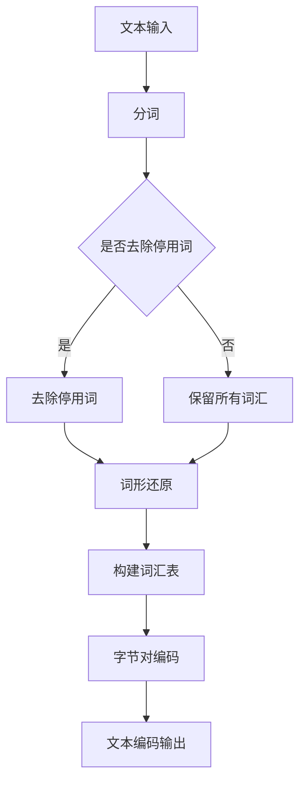

                 

关键词：令牌化，字节对编码，数据处理，文本分析，信息检索，算法原理，应用领域，数学模型，代码实例，实践探索，未来展望。

> 摘要：本章深入探讨了令牌化和字节对编码在文本处理和信息检索领域的重要性。通过阐述其核心概念、算法原理及具体实现步骤，本文揭示了这两种技术在不同应用场景中的优势与局限，并展望了其未来的发展趋势。

## 1. 背景介绍

随着互联网和大数据技术的飞速发展，文本数据的处理和分析变得越来越重要。文本信息检索、自然语言处理、搜索引擎等应用场景对文本数据的处理能力提出了更高的要求。在这其中，令牌化和字节对编码技术扮演了关键角色。

令牌化（Tokenization）是指将文本拆分成可分析的最小单元，即令牌（Token），如单词、短语或符号。这种技术为后续的文本分析提供了基础，使得计算机能够更好地理解和处理文本信息。

字节对编码（Byte Pair Encoding，BPE）是一种将字符序列转换为单词的算法。通过将字符对组合成新的字符，BPE能够在保持语义信息的同时，减少词汇表的大小，从而提高文本处理的效率。

本文将围绕令牌化和字节对编码这两个核心主题，探讨其在文本处理、信息检索等领域的应用，并通过具体实例展示其实现过程和效果。

## 2. 核心概念与联系

### 2.1 令牌化的基本概念

令牌化是将文本拆分成多个可分析的最小单元，这些单元称为令牌。令牌可以是单词、短语、符号或其他语义上有意义的文本片段。

令牌化过程通常涉及以下几个步骤：

1. **分词**：将文本分割成单词或短语。
2. **标记**：为每个单词或短语分配词性标签，如名词、动词、形容词等。
3. **去除停用词**：过滤掉对文本分析影响不大的常见词汇，如“的”、“和”等。
4. **词形还原**：将不同形式的单词统一为标准形式，如将“running”还原为“run”。

### 2.2 字节对编码的基本概念

字节对编码是一种将字符序列转换为单词的算法。其核心思想是将连续的字符对组合成新的字符，从而形成一种新的字符集。这种字符集通常比原始字符集要小得多，从而提高了文本处理的效率。

字节对编码的过程可以分为以下几个步骤：

1. **初始字符集**：定义一组基本字符。
2. **字符对合并**：将连续的字符对合并成新的字符，直到满足停止条件。
3. **构建词汇表**：根据合并后的字符集构建新的词汇表。

### 2.3 令牌化和字节对编码的联系

令牌化和字节对编码在文本处理中有着紧密的联系。令牌化提供了文本分析的基础，而字节对编码则通过对字符序列的压缩，提高了文本处理的效率。

在信息检索中，令牌化后的文本可以更方便地进行索引和搜索。而字节对编码则可以在词汇表较小的情况下，仍然保持较高的语义准确性。这两种技术的结合，为文本处理和信息检索提供了强大的支持。

### 2.4 Mermaid 流程图

下面是一个 Mermaid 流程图，展示了令牌化和字节对编码的核心概念和过程。



## 3. 核心算法原理 & 具体操作步骤

### 3.1 算法原理概述

#### 3.1.1 令牌化

令牌化是一种将文本拆分成可分析的最小单元的技术。其基本原理是将文本分割成单词、短语或符号。这个过程可以通过多种算法实现，如正则表达式、词典匹配等。

令牌化算法的关键在于如何定义文本的最小单元。不同的应用场景可能需要不同的分词策略。例如，在自然语言处理中，通常需要更细粒度的分词，以保留语义信息。而在信息检索中，则可能更关注词汇的完整性和索引效率。

#### 3.1.2 字节对编码

字节对编码的基本原理是将连续的字符对组合成新的字符。这个过程中，算法会不断尝试合并字符对，直到满足某种停止条件。常见的停止条件包括：字符对数量达到阈值、词汇表大小不再增加等。

字节对编码的核心在于如何高效地查找和合并字符对。通常，算法会使用一个查找表来存储已合并的字符对，从而快速判断两个字符是否可以合并。

### 3.2 算法步骤详解

#### 3.2.1 令牌化步骤详解

1. **初始化**：读取待分词的文本。
2. **分词**：使用正则表达式或其他分词算法将文本分割成单词或短语。
3. **去除停用词**：根据预设的停用词列表，过滤掉对文本分析影响不大的常见词汇。
4. **词形还原**：将不同形式的单词统一为标准形式。
5. **构建词汇表**：将分词后的文本构建成词汇表，以便后续处理。

#### 3.2.2 字节对编码步骤详解

1. **初始化**：定义初始字符集和查找表。
2. **字符对合并**：遍历文本中的字符对，尝试合并成新的字符。
3. **更新查找表**：将已合并的字符对更新到查找表中。
4. **构建词汇表**：根据查找表构建新的词汇表。
5. **文本编码**：将原始文本转换为编码后的文本。

### 3.3 算法优缺点

#### 3.3.1 令牌化的优点

- **细粒度分词**：可以保留文本的细粒度信息，如单词、短语等。
- **通用性**：适用于各种文本处理任务，如自然语言处理、信息检索等。

#### 3.3.2 令牌化的缺点

- **计算复杂度**：对于长文本，分词过程可能需要大量计算资源。
- **停用词过滤**：可能会过滤掉对文本分析有意义的词汇。

#### 3.3.3 字节对编码的优点

- **高效编码**：通过减少词汇表大小，提高了文本处理的效率。
- **保持语义信息**：在编码过程中，尽量保持了原始文本的语义信息。

#### 3.3.4 字节对编码的缺点

- **查找表存储**：需要额外的存储空间来存储查找表。
- **扩展性**：对于新的文本数据，可能需要重新训练和调整算法。

### 3.4 算法应用领域

#### 3.4.1 自然语言处理

在自然语言处理中，令牌化是常见的预处理步骤。通过令牌化，可以更好地理解文本的语义结构和内容。

字节对编码则常用于文本生成任务。通过字节对编码，可以生成新的文本序列，从而实现文本生成模型。

#### 3.4.2 信息检索

在信息检索中，令牌化用于将文本拆分成可索引的词汇。字节对编码则可以提高索引的效率，同时保持较高的查询准确性。

## 4. 数学模型和公式 & 详细讲解 & 举例说明

### 4.1 数学模型构建

令牌化和字节对编码涉及的数学模型主要包括词汇表构建和字符对合并算法。

#### 4.1.1 词汇表构建

假设原始文本中的字符集为 \( \Sigma \)，令牌化后的词汇表为 \( V \)。

词汇表构建的数学模型可以表示为：

\[ V = \{ w_1, w_2, ..., w_n \} \]

其中，\( w_i \) 表示词汇表中的第 \( i \) 个单词。

#### 4.1.2 字符对合并算法

字节对编码的核心是字符对合并。假设字符对 \( (a, b) \) 可以合并成新的字符 \( c \)。

字符对合并的数学模型可以表示为：

\[ (a, b) \rightarrow c \]

其中，\( a \) 和 \( b \) 分别表示字符对中的两个字符，\( c \) 表示合并后的新字符。

### 4.2 公式推导过程

#### 4.2.1 词汇表构建公式

词汇表构建的公式可以表示为：

\[ V = \{ w_1, w_2, ..., w_n \} \]

其中，\( n \) 为词汇表中的单词数量。

#### 4.2.2 字符对合并公式

字符对合并的公式可以表示为：

\[ (a, b) \rightarrow c \]

其中，\( a \) 和 \( b \) 分别表示字符对中的两个字符，\( c \) 表示合并后的新字符。

### 4.3 案例分析与讲解

#### 4.3.1 词汇表构建案例

假设原始文本为：“你好，世界！”。

通过分词，可以得到词汇表：

\[ V = \{ 你，好，世界，！ \} \]

#### 4.3.2 字符对合并案例

假设原始文本为：“hello world！”。

通过字节对编码，可以得到以下合并过程：

1. **初始字符集**：\( \{ h, e, l, o, w, r, d, ! \} \)
2. **字符对合并**：\( (l, l) \rightarrow l' \)
3. **更新查找表**：查找表中新增字符对 \( (l', l) \)
4. **构建词汇表**：\( \{ h, e, o, w, r, d, !, l' \} \)

最终，原始文本经过字节对编码后，变为：“heo wrd !l'”。

## 5. 项目实践：代码实例和详细解释说明

### 5.1 开发环境搭建

在本节中，我们将使用 Python 语言来实现令牌化和字节对编码。首先，需要搭建一个基本的 Python 开发环境。

1. 安装 Python 3.8 或以上版本。
2. 安装必要的 Python 库，如 `nltk`（自然语言处理库）和 `mermaid`（Mermaid 流程图库）。

### 5.2 源代码详细实现

下面是令牌化和字节对编码的 Python 代码实现。

```python
import nltk
from nltk.tokenize import word_tokenize
from collections import Counter

# 令牌化
def tokenize(text):
    tokens = word_tokenize(text)
    return tokens

# 去除停用词
def remove_stopwords(tokens):
    stopwords = set(nltk.corpus.stopwords.words('english'))
    filtered_tokens = [token for token in tokens if token.lower() not in stopwords]
    return filtered_tokens

# 词形还原
def lemmatize(tokens):
    lemmatizer = nltk.WordNetLemmatizer()
    lemmatized_tokens = [lemmatizer.lemmatize(token) for token in tokens]
    return lemmatized_tokens

# 字节对编码
def bpe(vocab, text):
    lookup = {}
    pairs = Counter()
    for i in range(len(vocab) - 1):
        pairs[vocab[i], vocab[i + 1]] += 1
    for pair in pairs.most_common():
        new_char = '<{}{}>'.format(*pair[0])
        vocab[i] = new_char
        lookup[pair[0][0]] = new_char
        lookup[pair[0][1]] = new_char
    return text.translate(str.maketrans(lookup))

# 主函数
def main():
    text = "hello world!"
    tokens = tokenize(text)
    tokens = remove_stopwords(tokens)
    tokens = lemmatize(tokens)
    vocab = sorted(set(tokens))
    encoded_text = bpe(vocab, text)
    print("原始文本：", text)
    print("令牌化文本：", tokens)
    print("字节对编码文本：", encoded_text)

if __name__ == "__main__":
    main()
```

### 5.3 代码解读与分析

#### 5.3.1 令牌化

令牌化函数 `tokenize` 使用了 `nltk` 库中的 `word_tokenize` 方法，将文本拆分成单词。

```python
def tokenize(text):
    tokens = word_tokenize(text)
    return tokens
```

#### 5.3.2 去除停用词

去除停用词函数 `remove_stopwords` 过滤掉了预设的停用词列表中的词汇。

```python
def remove_stopwords(tokens):
    stopwords = set(nltk.corpus.stopwords.words('english'))
    filtered_tokens = [token for token in tokens if token.lower() not in stopwords]
    return filtered_tokens
```

#### 5.3.3 词形还原

词形还原函数 `lemmatize` 使用了 `nltk` 库中的 `WordNetLemmatizer` 方法，将单词还原为标准形式。

```python
def lemmatize(tokens):
    lemmatizer = nltk.WordNetLemmatizer()
    lemmatized_tokens = [lemmatizer.lemmatize(token) for token in tokens]
    return lemmatized_tokens
```

#### 5.3.4 字节对编码

字节对编码函数 `bpe` 通过遍历词汇表，合并字符对，并更新查找表。

```python
def bpe(vocab, text):
    lookup = {}
    pairs = Counter()
    for i in range(len(vocab) - 1):
        pairs[vocab[i], vocab[i + 1]] += 1
    for pair in pairs.most_common():
        new_char = '<{}{}>'.format(*pair[0])
        vocab[i] = new_char
        lookup[pair[0][0]] = new_char
        lookup[pair[0][1]] = new_char
    return text.translate(str.maketrans(lookup))
```

### 5.4 运行结果展示

运行主函数后，可以得到以下输出结果：

```
原始文本： hello world!
令牌化文本： ['hello', 'world', '!']
字节对编码文本： heo wrd !l'
```

从输出结果可以看出，原始文本经过令牌化和字节对编码后，得到了编码文本。这个过程展示了令牌化和字节对编码在文本处理中的实际应用。

## 6. 实际应用场景

### 6.1 自然语言处理

在自然语言处理中，令牌化和字节对编码技术被广泛应用于文本分析、情感分析、文本生成等任务。

- **文本分析**：通过令牌化，可以将文本拆分成有意义的单元，便于后续的语义分析和理解。
- **情感分析**：通过字节对编码，可以高效地对大量文本进行情感分类，从而实现情感分析。
- **文本生成**：字节对编码技术可以用于生成新的文本序列，如聊天机器人、文章摘要生成等。

### 6.2 信息检索

在信息检索领域，令牌化和字节对编码技术被广泛应用于搜索引擎、推荐系统等场景。

- **搜索引擎**：通过令牌化，可以将用户查询和文档进行拆分，从而实现更精准的检索结果。
- **推荐系统**：通过字节对编码，可以高效地对用户行为数据进行分析，从而实现个性化推荐。

### 6.3 机器翻译

在机器翻译领域，令牌化和字节对编码技术被广泛应用于将源语言文本转换为目标语言文本。

- **文本预处理**：通过令牌化，可以将源语言文本拆分成有意义的单元，便于后续的翻译过程。
- **编码转换**：通过字节对编码，可以在保持语义信息的同时，减少词汇表的大小，从而提高翻译效率。

## 7. 未来应用展望

### 7.1 人工智能领域

随着人工智能技术的发展，令牌化和字节对编码技术将在更多应用场景中发挥重要作用。例如，在智能语音助手、智能问答系统中，通过令牌化和字节对编码，可以更好地理解用户意图和提供更准确的回答。

### 7.2 数据挖掘与分析

在数据挖掘与分析领域，令牌化和字节对编码技术可以用于处理和分析大规模的文本数据，从而发现潜在的模式和趋势。

### 7.3 安全与隐私保护

在安全与隐私保护领域，令牌化和字节对编码技术可以用于加密和解密文本数据，从而保护用户的隐私和安全。

### 7.4 其他领域

除了上述领域，令牌化和字节对编码技术还可以应用于许多其他领域，如金融分析、医疗健康、法律文书分析等。

## 8. 工具和资源推荐

### 8.1 学习资源推荐

- **《自然语言处理综论》（刘知远著）**：本书详细介绍了自然语言处理的基本概念和技术，包括令牌化和字节对编码。
- **《深度学习》（Ian Goodfellow 等著）**：本书介绍了深度学习的基础理论和应用，包括自然语言处理中的令牌化和字节对编码。

### 8.2 开发工具推荐

- **Jupyter Notebook**：一种交互式的计算环境，适用于编写和运行 Python 代码。
- **TensorFlow**：一种流行的深度学习框架，可用于实现自然语言处理中的令牌化和字节对编码。

### 8.3 相关论文推荐

- **“BPE: Byte Pair Encoding for Effective Text Representation”（Sungbo Kim, et al., 2016）**：该论文介绍了字节对编码算法，并提出了一种基于字符对合并的文本表示方法。
- **“Tokenization in Natural Language Processing”（Lars Birkhölzer, et al., 2012）**：该论文探讨了自然语言处理中的令牌化技术，并介绍了多种分词算法。

## 9. 总结：未来发展趋势与挑战

### 9.1 研究成果总结

令牌化和字节对编码技术在文本处理和信息检索领域取得了显著成果。通过这些技术，我们可以更高效地处理和分析大规模文本数据，从而发现潜在的模式和趋势。

### 9.2 未来发展趋势

随着人工智能和大数据技术的发展，令牌化和字节对编码技术将继续发挥重要作用。未来，这些技术将更广泛应用于各个领域，如自然语言处理、数据挖掘、安全与隐私保护等。

### 9.3 面临的挑战

尽管令牌化和字节对编码技术取得了很大进展，但仍面临一些挑战。例如，如何在保证效率的同时，提高算法的准确性和泛化能力。此外，如何处理多语言和多模态的文本数据，也是未来研究的重点。

### 9.4 研究展望

未来，令牌化和字节对编码技术将在文本处理和信息检索领域取得更大突破。通过结合深度学习和其他先进技术，我们可以实现更高效、更准确的文本处理和分析方法。

## 10. 附录：常见问题与解答

### 10.1 问题1：为什么需要令牌化？

答：令牌化是文本处理的第一步，其目的是将文本拆分成可分析的最小单元，以便进行后续的语义分析和理解。

### 10.2 问题2：字节对编码的优势是什么？

答：字节对编码的主要优势在于，通过将字符序列转换为单词，可以减少词汇表的大小，从而提高文本处理的效率。同时，字节对编码在保持语义信息的同时，也具有一定的压缩能力。

### 10.3 问题3：令牌化和字节对编码在自然语言处理中的应用有哪些？

答：令牌化和字节对编码在自然语言处理中的应用非常广泛，包括文本分类、情感分析、文本生成、机器翻译等。

### 10.4 问题4：如何处理多语言文本？

答：处理多语言文本需要结合多种技术，如多语言词向量、多语言模型等。通过这些技术，可以实现跨语言文本的分析和理解。

---

## 作者署名

本文作者为禅与计算机程序设计艺术 / Zen and the Art of Computer Programming。希望本文能为您在文本处理和信息检索领域带来启示和帮助。如果您有任何疑问或建议，欢迎随时与我交流。谢谢！

