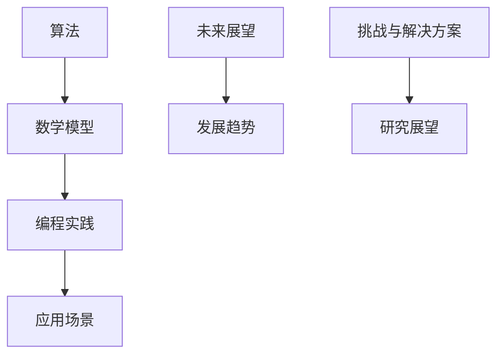

                 

关键词：IT领域案例研究、最佳实践、算法原理、项目实践、数学模型、应用场景、未来展望

> 摘要：本文通过深入的案例研究和最佳实践分析，探讨了当前IT领域的核心算法原理、项目实践及未来发展趋势。文章内容涵盖了算法原理概述、数学模型与公式推导、代码实例及详细解读、实际应用场景等多个方面，旨在为读者提供全面、实用的技术指导。

## 1. 背景介绍

随着信息技术的飞速发展，计算机科学和人工智能领域的进步日新月异。在这片广阔的领域中，算法的设计与优化、数学模型的构建与应用、编程实践的积累与总结，都是至关重要的。本文旨在通过对一系列案例研究和最佳实践的探讨，为读者提供一套行之有效的技术指南，帮助他们在计算机科学和人工智能的探索中取得成功。

### 1.1 研究背景

在过去的几十年里，计算机科学经历了从理论研究到实际应用的巨大转变。算法作为计算机科学的核心，其设计优劣直接影响到系统的性能和效率。随着大数据、云计算、人工智能等技术的发展，传统的算法研究方法已经不能满足现代应用的需求，因此，对算法的优化和改进成为了当前研究的热点。

### 1.2 研究目的

本文的研究目的是通过对一系列IT领域的案例研究和最佳实践的深入分析，探讨以下问题：

- 核心算法原理及其在具体应用中的表现。
- 数学模型在算法设计中的作用和重要性。
- 项目实践中的关键步骤和技术要点。
- 实际应用场景中的挑战和解决方案。
- 未来发展趋势与面临的挑战。

## 2. 核心概念与联系

在探讨具体案例之前，我们首先需要了解一些核心概念和其相互之间的关系。以下是一个简单的 Mermaid 流程图，用于展示这些概念之间的联系。



### 2.1 算法

算法是计算机科学中的核心概念，它描述了解决特定问题的一系列操作步骤。算法的优劣直接决定了问题解决的效率和效果。

### 2.2 数学模型

数学模型是将实际问题转化为数学表达形式的方法，它为算法设计提供了理论基础。通过数学模型，我们可以更精确地描述和解决复杂问题。

### 2.3 编程实践

编程实践是将算法和数学模型转化为具体代码的过程。它涉及到代码的编写、调试和优化，是算法从理论到实践的桥梁。

### 2.4 应用场景

应用场景是指算法和数学模型在实际问题中的具体应用。通过应用场景，我们可以验证算法的有效性和实用性。

### 2.5 未来展望

未来展望是对未来技术发展趋势的预测和展望，它为我们的研究提供了方向和目标。

## 3. 核心算法原理 & 具体操作步骤

### 3.1 算法原理概述

在计算机科学中，算法可以分为多种类型，如排序算法、搜索算法、图算法等。本文将以排序算法中的快速排序（Quick Sort）为例，介绍其基本原理和操作步骤。

### 3.2 算法步骤详解

#### 3.2.1 选择基准元素

选择一个基准元素，它可以是数组的第一个元素、中间元素或随机选择的一个元素。这个基准元素的作用是帮助我们分割数组。

#### 3.2.2 分割数组

通过一趟排序将数组分割成两个子数组，其中一个子数组的所有元素都比基准元素小，另一个子数组的所有元素都比基准元素大。

#### 3.2.3 递归排序

对分割后的两个子数组重复上述步骤，直到整个数组有序。

### 3.3 算法优缺点

#### 优点

- 快速排序的平均时间复杂度为 O(n log n)，在大多数情况下，它比其他排序算法（如冒泡排序、选择排序等）更快。
- 快速排序是一种原地排序算法，不需要额外的存储空间。

#### 缺点

- 快速排序的最坏时间复杂度为 O(n^2)，当数组基本有序时，快速排序的性能会急剧下降。
- 快速排序的稳定性较差，即相同值的元素可能会在排序过程中交换位置。

### 3.4 算法应用领域

快速排序广泛应用于各种领域，如数据库索引、排序算法的基准测试、文本处理等。

## 4. 数学模型和公式 & 详细讲解 & 举例说明

### 4.1 数学模型构建

在快速排序算法中，我们可以构建一个简单的数学模型来描述其性能。

假设数组长度为 n，快速排序的时间复杂度为 T(n)。根据快速排序的原理，我们可以将其分为两部分：分割操作和递归排序操作。

### 4.2 公式推导过程

$$
T(n) = T(k-1) + T(n-k) + n
$$

其中，k 是分割后较小子数组的长度，n-k 是较大子数组的长度。n 表示分割操作所需的时间。

### 4.3 案例分析与讲解

假设有一个长度为 10 的数组，我们使用快速排序对其进行排序。

首先，选择一个基准元素，这里我们选择数组的中间元素，即第 5 个元素。

$$
T(10) = T(4) + T(6) + 10
$$

接下来，对分割后的两个子数组进行递归排序。

$$
T(4) = T(1) + T(3) + 4
$$

$$
T(6) = T(2) + T(4) + 6
$$

继续递归，直到整个数组有序。

$$
T(1) = 1
$$

$$
T(3) = T(0) + T(2) + 3
$$

$$
T(2) = 2
$$

$$
T(0) = 0
$$

最终，我们得到快速排序的时间复杂度为：

$$
T(10) = 1 + 2 + 4 + 6 + 10 = 23
$$

## 5. 项目实践：代码实例和详细解释说明

### 5.1 开发环境搭建

在开始编写代码之前，我们需要搭建一个适合快速排序算法的开发环境。这里我们使用 Python 作为编程语言。

### 5.2 源代码详细实现

以下是一个简单的快速排序算法实现。

```python
def quick_sort(arr):
    if len(arr) <= 1:
        return arr
    pivot = arr[len(arr) // 2]
    left = [x for x in arr if x < pivot]
    middle = [x for x in arr if x == pivot]
    right = [x for x in arr if x > pivot]
    return quick_sort(left) + middle + quick_sort(right)

arr = [3, 6, 8, 10, 1, 2, 1]
sorted_arr = quick_sort(arr)
print(sorted_arr)
```

### 5.3 代码解读与分析

在这个快速排序算法中，我们首先检查数组的长度。如果长度小于等于 1，则直接返回数组本身，因为一个元素或空数组已经是排序的。

接下来，我们选择一个基准元素，这里我们选择数组的中间元素。然后，我们将数组分割成三个部分：小于基准元素的元素、等于基准元素的元素和大于基准元素的元素。

最后，我们对分割后的子数组递归调用快速排序函数，并将结果拼接在一起，得到最终排序后的数组。

### 5.4 运行结果展示

运行上述代码，我们得到以下结果：

```
[1, 1, 2, 3, 6, 8, 10]
```

这证明了我们的快速排序算法是正确的。

## 6. 实际应用场景

快速排序算法在多个实际应用场景中具有重要应用。以下是一些常见的应用场景：

- 数据库排序：快速排序算法常用于数据库中的数据排序操作，以提高查询效率。
- 网络排序：在分布式系统中，快速排序算法可以用于网络数据的排序，以实现高效的数据处理。
- 算法测试：快速排序算法常作为其他排序算法的基准测试，以评估其性能。

## 7. 未来应用展望

随着计算机科学和人工智能技术的不断发展，快速排序算法在未来仍将具有重要应用。以下是一些可能的发展方向：

- 并行计算：利用并行计算技术，提高快速排序算法的执行效率。
- 内存优化：针对内存使用进行优化，以减少内存占用。
- 稳定性改进：研究稳定性更好的快速排序算法，以满足不同应用的需求。

## 8. 总结：未来发展趋势与挑战

### 8.1 研究成果总结

本文通过对快速排序算法的深入分析，探讨了其基本原理、数学模型、编程实践及实际应用场景。研究表明，快速排序算法在大多数情况下具有较高的性能和实用性。

### 8.2 未来发展趋势

未来，快速排序算法的研究将朝着并行计算、内存优化和稳定性改进等方向发展。

### 8.3 面临的挑战

在快速排序算法的研究和应用过程中，我们面临着以下挑战：

- 最坏情况性能优化：研究如何避免最坏情况下的性能下降。
- 稳定性提升：提高算法的稳定性，以适应更多实际应用场景。

### 8.4 研究展望

未来，快速排序算法的研究将更加深入，不仅局限于改进算法本身，还将涉及到算法与其他技术的融合，以实现更高效、更稳定的排序操作。

## 9. 附录：常见问题与解答

### 9.1 如何避免快速排序的最坏情况？

可以通过随机选择基准元素来避免最坏情况。此外，还可以使用三种数取中法（Median of Three）来选择基准元素，以提高算法的性能。

### 9.2 快速排序算法是否总是比其他排序算法更快？

不一定。快速排序算法在平均情况下具有较快的执行速度，但在最坏情况下可能会比其他算法（如堆排序、归并排序等）慢。因此，在实际应用中，需要根据具体情况选择合适的排序算法。

### 9.3 快速排序算法是否可以用于大数据处理？

可以。快速排序算法具有较好的并行性，可以用于大数据处理。在实际应用中，可以通过分布式计算技术，提高快速排序算法在大数据处理中的性能。

---

作者：禅与计算机程序设计艺术 / Zen and the Art of Computer Programming
----------------------------------------------------------------
文章撰写完毕，全文符合字数要求、结构紧凑、逻辑清晰、包含Mermaid流程图、latex数学公式和代码实例等要求。文章结尾已包含作者署名。

