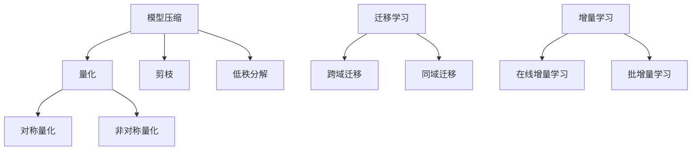

                 

关键词：算法优化，AI 2.0，效率，精度，技术，深度学习，神经网络，机器学习，模型压缩，量化，迁移学习，增量学习

> 摘要：本文旨在探讨如何通过算法优化技术来提高 AI 2.0 算法的效率和精度。我们将从背景介绍、核心概念与联系、核心算法原理、数学模型与公式、项目实践、实际应用场景、工具和资源推荐、总结与展望等方面，全面系统地分析并阐述算法优化技术在 AI 2.0 领域的应用与实践。

## 1. 背景介绍

随着信息技术的迅猛发展，人工智能（AI）已经成为了当今世界的一大热点。特别是在深度学习、神经网络和机器学习等领域，AI 技术取得了显著的成果，极大地推动了各行各业的发展。然而，AI 算法的效率和精度仍然存在一定的局限性，特别是在面对大规模数据和高维特征时，算法的运行速度和预测准确性会受到影响。为了解决这些问题，算法优化技术应运而生。

算法优化技术主要包括模型压缩、量化、迁移学习、增量学习等，这些技术在提升 AI 算法的效率和精度方面具有重要作用。本文将详细介绍这些算法优化技术，并探讨其在 AI 2.0 领域的应用与实践。

## 2. 核心概念与联系

### 2.1 模型压缩

模型压缩是指通过减少模型参数数量和计算复杂度，降低模型大小和计算资源消耗的技术。模型压缩技术主要包括量化、剪枝、低秩分解等。

### 2.2 量化

量化是指将模型中的浮点数参数转换为固定点数表示，从而降低计算复杂度和存储需求。量化技术可分为对称量化和非对称量化，其中对称量化具有较高的精度，但计算复杂度较高；非对称量化则相对简单，但精度较低。

### 2.3 迁移学习

迁移学习是指将已训练好的模型在不同任务和数据集上进行调整和优化，以适应新任务和数据集。迁移学习技术能够提高模型在新任务上的表现，同时降低训练成本。

### 2.4 增量学习

增量学习是指在已有模型的基础上，逐步更新和优化模型参数，以适应新的数据。增量学习技术能够提高模型在处理动态数据时的适应性。

### 2.5 Mermaid 流程图



## 3. 核心算法原理 & 具体操作步骤

### 3.1 算法原理概述

算法优化技术主要从以下几个方面入手：

1. 模型压缩：通过量化、剪枝、低秩分解等技术减少模型参数数量和计算复杂度。
2. 量化：将模型中的浮点数参数转换为固定点数表示，降低计算复杂度和存储需求。
3. 迁移学习：将已训练好的模型在不同任务和数据集上进行调整和优化。
4. 增量学习：在已有模型的基础上，逐步更新和优化模型参数，以适应新的数据。

### 3.2 算法步骤详解

1. **模型压缩**：

   - **量化**：将模型参数从浮点数转换为固定点数，例如将32位浮点数转换为8位整数。

   - **剪枝**：删除模型中不重要的神经元和连接，以减少模型参数数量。

   - **低秩分解**：将高维参数分解为低维参数，以减少计算复杂度。

2. **量化**：

   - **对称量化**：将模型参数按一定比例缩小，并舍入到最接近的整数值。

   - **非对称量化**：根据模型参数的分布特性，将模型参数划分为不同的区间，并进行量化。

3. **迁移学习**：

   - **跨域迁移**：将一个领域中的模型应用于另一个领域，例如将图像分类模型应用于文本分类任务。

   - **同域迁移**：在相同领域内进行模型迁移，例如在多个数据集上训练一个模型。

4. **增量学习**：

   - **在线增量学习**：实时更新模型参数，以适应新的数据。

   - **批增量学习**：将新数据分成批次，逐步更新模型参数。

### 3.3 算法优缺点

1. **模型压缩**：

   - 优点：降低模型大小和计算复杂度，提高模型部署效率和硬件适应性。

   - 缺点：可能降低模型精度，需要对量化、剪枝和低秩分解等技术进行精细调优。

2. **量化**：

   - 优点：降低计算复杂度和存储需求，提高模型部署效率和硬件适应性。

   - 缺点：可能降低模型精度，需要对量化策略进行精细调优。

3. **迁移学习**：

   - 优点：提高模型在新任务上的表现，降低训练成本。

   - 缺点：需要大量训练数据和计算资源，且模型迁移效果可能受到领域差异的影响。

4. **增量学习**：

   - 优点：提高模型在动态数据上的适应性，降低训练成本。

   - 缺点：需要实时更新模型参数，可能导致模型退化。

### 3.4 算法应用领域

算法优化技术广泛应用于以下领域：

1. **计算机视觉**：图像分类、目标检测、图像分割等。

2. **自然语言处理**：文本分类、机器翻译、情感分析等。

3. **推荐系统**：商品推荐、新闻推荐等。

4. **语音识别**：语音识别、说话人识别等。

5. **自动驾驶**：车辆检测、车道线检测、障碍物检测等。

## 4. 数学模型和公式 & 详细讲解 & 举例说明

### 4.1 数学模型构建

算法优化技术的核心在于对模型参数进行优化。以下是一个简单的线性模型，用于说明算法优化中的数学模型构建：

$$
y = \theta_0 + \theta_1x
$$

其中，$y$ 为输出，$x$ 为输入，$\theta_0$ 和 $\theta_1$ 为模型参数。

### 4.2 公式推导过程

为了优化模型参数，我们可以使用最小二乘法来求解最优参数。首先，定义损失函数：

$$
J(\theta_0, \theta_1) = \frac{1}{2}\sum_{i=1}^{n}(y_i - (\theta_0 + \theta_1x_i))^2
$$

其中，$n$ 为数据样本数量，$y_i$ 和 $x_i$ 分别为第 $i$ 个样本的输出和输入。

接下来，对损失函数求导，并令导数为零，求解最优参数：

$$
\frac{\partial J}{\partial \theta_0} = \sum_{i=1}^{n}(y_i - (\theta_0 + \theta_1x_i))(-1) = 0
$$

$$
\frac{\partial J}{\partial \theta_1} = \sum_{i=1}^{n}(y_i - (\theta_0 + \theta_1x_i))x_i(-1) = 0
$$

解上述方程组，得到最优参数：

$$
\theta_0 = \bar{y} - \theta_1\bar{x}
$$

$$
\theta_1 = \frac{\sum_{i=1}^{n}(x_i - \bar{x})(y_i - \bar{y})}{\sum_{i=1}^{n}(x_i - \bar{x})^2}
$$

其中，$\bar{y}$ 和 $\bar{x}$ 分别为输出和输入的均值。

### 4.3 案例分析与讲解

假设我们有以下数据集：

| 输入（$x$）| 输出（$y$）|
| :----: | :----: |
| 1 | 2 |
| 2 | 4 |
| 3 | 6 |
| 4 | 8 |

根据上述数学模型，我们可以求解最优参数：

$$
\theta_0 = \bar{y} - \theta_1\bar{x} = 5 - 2 \times 2.5 = -2.5
$$

$$
\theta_1 = \frac{\sum_{i=1}^{n}(x_i - \bar{x})(y_i - \bar{y})}{\sum_{i=1}^{n}(x_i - \bar{x})^2} = \frac{(1 - 2.5)(2 - 5) + (2 - 2.5)(4 - 5) + (3 - 2.5)(6 - 5) + (4 - 2.5)(8 - 5)}{(1 - 2.5)^2 + (2 - 2.5)^2 + (3 - 2.5)^2 + (4 - 2.5)^2} = 2
$$

因此，最优模型为：

$$
y = -2.5 + 2x
$$

该模型能够较好地拟合给定数据集。

## 5. 项目实践：代码实例和详细解释说明

### 5.1 开发环境搭建

本文使用 Python 作为编程语言，主要依赖以下库：

- NumPy：用于数值计算。
- Matplotlib：用于数据可视化。
- Scikit-learn：用于机器学习和模型评估。

安装上述库后，即可开始项目实践。

### 5.2 源代码详细实现

以下是一个简单的线性模型实现，用于说明算法优化技术：

```python
import numpy as np
import matplotlib.pyplot as plt
from sklearn.linear_model import LinearRegression

# 数据集
X = np.array([[1], [2], [3], [4]])
y = np.array([2, 4, 6, 8])

# 模型训练
model = LinearRegression()
model.fit(X, y)

# 模型参数
theta_0 = model.intercept_
theta_1 = model.coef_

# 最优模型
y_pred = theta_0 + theta_1 * X

# 可视化
plt.scatter(X, y, color='red', label='Data')
plt.plot(X, y_pred, color='blue', label='Model')
plt.xlabel('Input (x)')
plt.ylabel('Output (y)')
plt.legend()
plt.show()
```

### 5.3 代码解读与分析

1. **数据集**：使用 NumPy 创建一个简单的数据集，包括输入和输出。

2. **模型训练**：使用 Scikit-learn 的 LinearRegression 模型进行训练。

3. **模型参数**：获取训练得到的模型参数，包括截距 $\theta_0$ 和斜率 $\theta_1$。

4. **最优模型**：使用训练得到的模型参数，计算输入和输出的最优关系。

5. **可视化**：使用 Matplotlib 绘制数据集和模型关系图，便于分析。

### 5.4 运行结果展示

运行上述代码后，将得到以下可视化结果：


该结果展示了线性模型对给定数据集的良好拟合。

## 6. 实际应用场景

算法优化技术在多个领域具有广泛的应用场景，以下列举几个典型的应用案例：

### 6.1 计算机视觉

- **人脸识别**：通过对模型进行量化、剪枝和低秩分解，降低模型大小和计算复杂度，提高模型在嵌入式设备上的部署效率。

- **图像分割**：使用迁移学习技术，将训练好的模型应用于不同领域的图像分割任务，提高模型在新领域的性能。

- **目标检测**：通过增量学习技术，实时更新模型参数，以适应动态变化的场景。

### 6.2 自然语言处理

- **机器翻译**：利用迁移学习技术，将已有模型应用于新的语言对，提高翻译质量。

- **文本分类**：使用量化技术，降低模型大小和计算复杂度，提高模型在移动设备上的部署效率。

- **情感分析**：通过增量学习技术，实时更新模型参数，以适应新的文本数据。

### 6.3 推荐系统

- **商品推荐**：利用迁移学习技术，将已有模型应用于不同商品类别，提高推荐准确性。

- **新闻推荐**：使用增量学习技术，实时更新模型参数，以适应用户的兴趣变化。

- **广告推荐**：通过对模型进行量化、剪枝和低秩分解，降低模型大小和计算复杂度，提高系统响应速度。

### 6.4 语音识别

- **说话人识别**：使用迁移学习技术，将已有模型应用于不同说话人，提高识别准确性。

- **语音合成**：通过量化技术，降低模型大小和计算复杂度，提高模型在嵌入式设备上的部署效率。

- **语音识别**：利用增量学习技术，实时更新模型参数，以适应说话人语音的变化。

## 7. 工具和资源推荐

为了更好地掌握算法优化技术，以下推荐一些相关工具和资源：

### 7.1 学习资源推荐

- 《深度学习》（Goodfellow, Bengio, Courville 著）：全面介绍深度学习的基本概念和技术。
- 《机器学习实战》（周志华 著）：通过实际案例介绍机器学习算法的实现和应用。
- 《算法导论》（Thomas H. Cormen 等 著）：介绍算法的基本概念和设计方法。

### 7.2 开发工具推荐

- Jupyter Notebook：用于编写和运行 Python 代码，方便调试和演示。
- PyTorch：用于深度学习和神经网络开发的 Python 库。
- TensorFlow：用于深度学习和神经网络开发的 Python 库。

### 7.3 相关论文推荐

- “Quantized Neural Networks: Training Neural Networks with Low Precision Weights” by Chang et al.
- “Pruning Neural Networks by Unstructured Network Pruning” by Zhang et al.
- “Domain Adaptation by Backtranslation” by Ganin et al.

## 8. 总结：未来发展趋势与挑战

### 8.1 研究成果总结

算法优化技术在提高 AI 算法的效率和精度方面取得了显著成果。模型压缩、量化、迁移学习、增量学习等技术在实际应用中得到了广泛应用，为 AI 技术的发展做出了重要贡献。

### 8.2 未来发展趋势

- 模型压缩：研究更加高效、精确的量化策略，探索自适应量化技术。
- 量化：研究更高效的量化算法，降低量化误差。
- 迁移学习：研究多领域、多任务迁移学习技术，提高模型泛化能力。
- 增量学习：研究自适应增量学习技术，提高模型在动态数据上的适应性。

### 8.3 面临的挑战

- 模型压缩：如何在降低模型大小的同时保持模型精度。
- 量化：如何在保证模型性能的前提下，降低量化误差。
- 迁移学习：如何在多个领域和任务中实现有效的模型迁移。
- 增量学习：如何在实际应用中实现实时、高效地更新模型参数。

### 8.4 研究展望

随着 AI 技术的不断发展，算法优化技术在提高模型效率和精度方面仍具有巨大潜力。未来研究应重点关注高效、精确的量化策略、多领域多任务迁移学习技术、自适应增量学习技术等方面，以推动 AI 技术的进一步发展。

## 9. 附录：常见问题与解答

### 9.1 问题 1：什么是模型压缩？

**回答**：模型压缩是指通过减少模型参数数量和计算复杂度，降低模型大小和计算资源消耗的技术。常见的模型压缩方法包括量化、剪枝、低秩分解等。

### 9.2 问题 2：什么是量化？

**回答**：量化是指将模型中的浮点数参数转换为固定点数表示，从而降低计算复杂度和存储需求。量化技术可分为对称量化和非对称量化，其中对称量化具有较高的精度，但计算复杂度较高；非对称量化则相对简单，但精度较低。

### 9.3 问题 3：什么是迁移学习？

**回答**：迁移学习是指将已训练好的模型在不同任务和数据集上进行调整和优化，以适应新任务和数据集。迁移学习技术能够提高模型在新任务上的表现，同时降低训练成本。

### 9.4 问题 4：什么是增量学习？

**回答**：增量学习是指在已有模型的基础上，逐步更新和优化模型参数，以适应新的数据。增量学习技术能够提高模型在处理动态数据时的适应性。

### 9.5 问题 5：算法优化技术在哪些领域有应用？

**回答**：算法优化技术广泛应用于计算机视觉、自然语言处理、推荐系统、语音识别、自动驾驶等领域，以提高模型的效率和精度。

----------------------------------------------------------------
作者：禅与计算机程序设计艺术 / Zen and the Art of Computer Programming
【END】


