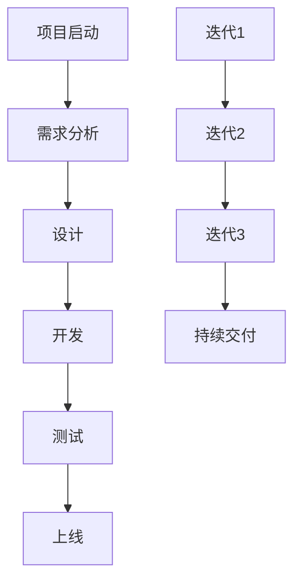
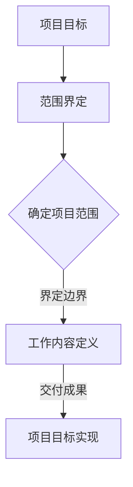
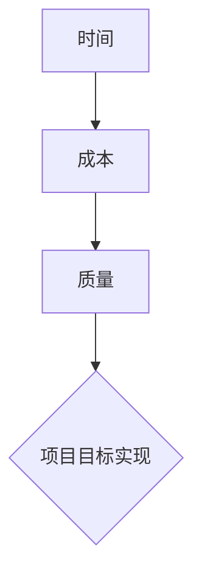
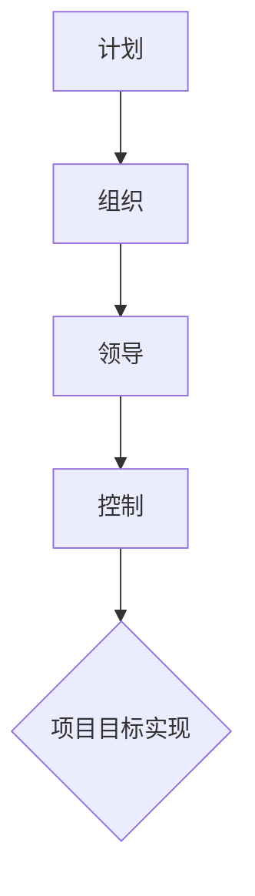

                 

关键词：管理、策略、执行、IT项目管理、技术管理、敏捷开发、项目管理方法论、团队协作、绩效评估

> 摘要：本文旨在探讨在IT项目管理中，从策略制定到执行的全过程管理智慧。通过分析现有的项目管理方法论，揭示如何通过有效的策略规划和执行措施，提升项目成功率和团队绩效。文章还结合实际案例，讨论了敏捷开发在现代IT项目管理中的应用，并对未来管理趋势进行了展望。

## 1. 背景介绍

在信息技术快速发展的今天，IT项目管理的复杂性日益增加。从项目启动到交付，涉及到需求分析、设计、开发、测试、上线等多个环节。如何高效地管理这些环节，确保项目按时按质完成，成为企业管理者面临的一大挑战。有效的项目策略和执行是项目成功的关键，也是企业竞争力的体现。

本文将首先介绍现有的项目管理方法论，包括传统的瀑布模型和敏捷开发，分析它们的优缺点，并探讨如何在实际项目中应用这些方法论。接下来，我们将深入探讨项目管理中的核心概念，如项目目标、范围、时间、成本和质量，以及如何通过有效的管理措施实现这些目标。最后，结合实际案例，我们将展示如何通过策略规划和执行，提高项目成功率和团队绩效。

## 2. 核心概念与联系

### 项目管理方法论

在项目管理中，方法论的选择至关重要。传统的瀑布模型是一种线性顺序执行的方法，其优点是结构清晰，便于管理，但缺点是灵活性较差，难以适应快速变化的需求。相比之下，敏捷开发更注重迭代和灵活性，通过持续交付有价值的软件，更好地满足用户需求。下面是一个简单的Mermaid流程图，展示了瀑布模型和敏捷开发的基本流程：



### 项目目标与范围

项目目标是指项目预期达到的成果和标准。项目范围则明确了项目需要完成的工作内容和边界。两者紧密相关，项目目标决定了项目范围，而项目范围的清晰界定有助于明确项目目标。以下是项目目标与范围的关系图：



### 时间、成本与质量

项目的时间、成本和质量是项目管理中的三大关键因素。时间是指项目从启动到完成的时限，成本是项目执行过程中所需的人力、物力和财力资源，质量则是项目成果满足预期需求的程度。以下是它们之间的关系图：



### 项目管理措施

为了实现项目目标，需要采取一系列管理措施，包括计划、组织、领导和控制。以下是这些措施之间的关系图：



## 3. 核心算法原理 & 具体操作步骤

### 3.1 算法原理概述

项目管理中的核心算法主要涉及项目计划和时间管理。常见的算法包括关键路径法（Critical Path Method，CPM）和计划评审技术（Program Evaluation and Review Technique，PERT）。这些算法通过分析和计算项目任务的依赖关系和时间，帮助项目经理制定合理的项目计划。

### 3.2 算法步骤详解

1. **关键路径法（CPM）**

   - **步骤1：绘制网络图**：根据项目任务及其依赖关系，绘制项目网络图。
   - **步骤2：计算每个任务的最早开始时间（ES）和最早完成时间（EF）**：从网络图的起始节点开始，顺时针计算每个节点的最早开始时间和最早完成时间。
   - **步骤3：计算每个任务的最迟开始时间（LS）和最迟完成时间（LF）**：从网络图的结束节点开始，逆时针计算每个节点的最迟开始时间和最迟完成时间。
   - **步骤4：计算每个任务的总浮动时间（TF）**：总浮动时间等于最迟完成时间减去最早完成时间。

   - **步骤5：确定关键路径**：关键路径上的任务具有零浮动时间。

2. **计划评审技术（PERT）**

   - **步骤1：定义项目任务**：明确项目需要完成的任务及其依赖关系。
   - **步骤2：估计每个任务的时间**：根据历史数据和专家意见，估计每个任务的时间，分为乐观时间（O）、最可能时间（M）和悲观时间（P）。
   - **步骤3：计算每个任务的期望时间（TE）**：期望时间等于乐观时间、最可能时间和悲观时间的平均值。
   - **步骤4：绘制PERT图**：根据任务依赖关系和期望时间，绘制PERT图。
   - **步骤5：计算整个项目的期望完成时间**：通过计算PERT图中的路径，得到整个项目的期望完成时间。

### 3.3 算法优缺点

1. **关键路径法（CPM）**

   - **优点**：结构清晰，易于理解，有助于确定项目进度。
   - **缺点**：过于依赖时间估计，对任务依赖关系的调整能力较差。

2. **计划评审技术（PERT）**

   - **优点**：考虑了不确定因素，更适用于复杂项目。
   - **缺点**：计算复杂度较高，对时间估计的准确性要求较高。

### 3.4 算法应用领域

- **关键路径法（CPM）**：适用于项目任务依赖关系明确、时间估计较为准确的项目。
- **计划评审技术（PERT）**：适用于项目任务依赖关系复杂、时间估计不确定的项目。

## 4. 数学模型和公式 & 详细讲解 & 举例说明

### 4.1 数学模型构建

项目管理中的数学模型主要包括项目网络图、关键路径法（CPM）和计划评审技术（PERT）。

### 4.2 公式推导过程

1. **关键路径法（CPM）**

   - **最早开始时间（ES）和最早完成时间（EF）**：
     $$ES_i = \max(ES_{i-1} + T_i)$$
     $$EF_i = ES_i + T_i$$
   - **最迟开始时间（LS）和最迟完成时间（LF）**：
     $$LS_i = \min(LF_{i-1} - T_i)$$
     $$LF_i = LS_i + T_i$$
   - **总浮动时间（TF）**：
     $$TF_i = LF_i - EF_i$$

2. **计划评审技术（PERT）**

   - **期望时间（TE）**：
     $$TE_i = \frac{O_i + 4M_i + P_i}{6}$$

### 4.3 案例分析与讲解

以一个简单的软件项目为例，项目包含以下任务：

| 任务 | 乐观时间（O） | 最可能时间（M） | 悲观时间（P） |
| ---- | ---- | ---- | ---- |
| A | 2 | 3 | 5 |
| B | 3 | 4 | 6 |
| C | 4 | 5 | 7 |
| D | 5 | 6 | 8 |

1. **关键路径法（CPM）**

   - **最早开始时间（ES）和最早完成时间（EF）**：
     $$ES_A = 0, EF_A = 2$$
     $$ES_B = ES_A + T_A = 2 + 3 = 5, EF_B = ES_B + T_B = 5 + 4 = 9$$
     $$ES_C = ES_B + T_B = 5 + 4 = 9, EF_C = ES_C + T_C = 9 + 5 = 14$$
     $$ES_D = ES_C + T_C = 9 + 5 = 14, EF_D = ES_D + T_D = 14 + 6 = 20$$
   - **最迟开始时间（LS）和最迟完成时间（LF）**：
     $$LS_D = LF_D = 20$$
     $$LS_C = LF_C = 20 - T_D = 20 - 6 = 14$$
     $$LS_B = LF_B = 14 - T_C = 14 - 5 = 9$$
     $$LS_A = LF_A = 9 - T_B = 9 - 4 = 5$$
   - **总浮动时间（TF）**：
     $$TF_D = 0, TF_C = 0, TF_B = 0, TF_A = 0$$

   因此，关键路径为 A → B → C → D，总工期为 20 天。

2. **计划评审技术（PERT）**

   - **期望时间（TE）**：
     $$TE_A = \frac{2 + 4 \times 3 + 5}{6} = 3.5$$
     $$TE_B = \frac{3 + 4 \times 4 + 6}{6} = 4$$
     $$TE_C = \frac{4 + 4 \times 5 + 7}{6} = 5$$
     $$TE_D = \frac{5 + 4 \times 6 + 8}{6} = 6$$

   根据期望时间，可以计算出整个项目的期望完成时间为 6 + 6 = 12 天。

## 5. 项目实践：代码实例和详细解释说明

### 5.1 开发环境搭建

在本案例中，我们使用Python编写关键路径法（CPM）和计划评审技术（PERT）的代码。首先，确保安装Python环境和以下库：

```bash
pip install networkx matplotlib
```

### 5.2 源代码详细实现

```python
import networkx as nx
import matplotlib.pyplot as plt

def cpm(tasks):
    G = nx.DiGraph()
    for task in tasks:
        G.add_edge(task['prev'], task, weight=task['duration'])
    cpm_TIMES = nx.single_source_shortest_path(G, source=None, weight='weight')
    ES = {node: cpm_TIMES[node][0] for node in cpm_TIMES}
    EF = {node: ES[node] + tasks[node]['duration'] for node in tasks}
    LS = {node: EF[node] for node in EF}
    LF = {node: LS[node] + tasks[node]['duration'] for node in tasks}
    TF = {node: LF[node] - EF[node] for node in EF}
    return ES, EF, LS, LF, TF

def pert(tasks):
    weights = {task: (tasks[task]['O'], tasks[task]['M'], tasks[task]['P']) for task in tasks}
    ES = {task: 0 for task in tasks}
    for task in tasks:
        ES[task] = max(ES[prev] + weights[prev][1] for prev in tasks[task]['prev'])
    EF = {task: ES[task] + weights[task][1] for task in tasks}
    return ES, EF

def draw_graph(G, ES, EF, LS, LF, TF):
    pos = nx.spring_layout(G)
    nx.draw(G, pos, with_labels=True)
    colors = ['red' if TF[node] == 0 else 'blue' for node in G]
    for node in G:
        nx.draw_networkx_nodes(G, pos, nodelist=[node], node_color=colors[node], node_size=2000)
    labels = {node: f"{node} (ES={ES[node]:.2f}, EF={EF[node]:.2f}, LS={LS[node]:.2f}, LF={LF[node]:.2f}, TF={TF[node]:.2f})" for node in G}
    nx.draw_networkx_labels(G, pos, labels)
    plt.show()

if __name__ == "__main__":
    tasks = {
        'A': {'duration': 2, 'prev': []},
        'B': {'duration': 3, 'prev': ['A']},
        'C': {'duration': 4, 'prev': ['B']},
        'D': {'duration': 5, 'prev': ['C']}
    }
    ES, EF, LS, LF, TF = cpm(tasks)
    ES_pert, EF_pert = pert(tasks)
    G = nx.DiGraph()
    for task in tasks:
        G.add_edge(task, **tasks[task])
    draw_graph(G, ES, EF, LS, LF, TF)
    draw_graph(G, ES_pert, EF_pert, **tasks)
```

### 5.3 代码解读与分析

- **CPM算法实现**：首先创建一个有向图G，将任务及其依赖关系添加到图中。然后计算每个任务的最早开始时间（ES）和最早完成时间（EF），最迟开始时间（LS）和最迟完成时间（LF），以及总浮动时间（TF）。最后，根据这些值绘制网络图。
- **PERT算法实现**：计算每个任务的期望时间（TE），并根据期望时间绘制网络图。
- **绘图函数**：使用NetworkX和matplotlib库绘制网络图，并根据任务的总浮动时间（TF）设置节点颜色。

### 5.4 运行结果展示

运行上述代码，可以得到关键路径法（CPM）和计划评审技术（PERT）的网络图。通过对比两种算法的结果，可以更直观地了解项目的进度和关键路径。

## 6. 实际应用场景

在IT项目管理中，关键路径法（CPM）和计划评审技术（PERT）广泛应用于项目计划和进度控制。以下是一些实际应用场景：

- **软件开发项目**：用于确定项目的关键路径，识别项目中的关键任务，以便更好地分配资源和调整项目进度。
- **系统集成项目**：用于评估项目进度和风险，帮助项目经理制定有效的进度计划和风险管理策略。
- **基础设施建设**：用于规划项目进度，确保项目按时完成，降低成本和风险。

## 6.4 未来应用展望

随着技术的不断进步，项目管理方法论也在不断演进。以下是对未来项目管理发展的展望：

- **智能化项目管理**：利用人工智能和大数据技术，实现项目进度的智能预测和优化，提高项目管理的效率和准确性。
- **敏捷与传统的融合**：在保持敏捷开发灵活性的同时，吸收传统项目管理方法的优点，形成更加完善的项目管理方法论。
- **跨领域项目管理**：随着企业业务复杂度的增加，项目管理将更加注重跨领域协作和集成，提高项目交付的效率和质量。

## 7. 工具和资源推荐

### 7.1 学习资源推荐

- 《项目管理知识体系指南》（PMBOK指南）：全面介绍项目管理的知识体系，适合初学者和从业者。
- 《敏捷开发实践指南》：详细阐述敏捷开发的方法和实践，适合对敏捷开发感兴趣的项目经理和开发人员。

### 7.2 开发工具推荐

- GanttPRO：一款功能强大的项目管理工具，支持关键路径法（CPM）和计划评审技术（PERT）。
- JIRA：一款流行的敏捷项目管理工具，支持迭代管理和任务跟踪。

### 7.3 相关论文推荐

- "A Comparison of PERT and CPM for Project Scheduling"，比较了关键路径法（CPM）和计划评审技术（PERT）在项目调度中的应用。
- "Agile Project Management：Creating Competitive Advantage"，探讨了敏捷开发在项目管理中的应用和实践。

## 8. 总结：未来发展趋势与挑战

随着信息技术的发展和市场竞争的加剧，IT项目管理面临着前所未有的挑战和机遇。未来，项目管理将更加注重智能化、敏捷化和跨领域协作。企业需要不断更新项目管理方法论，提高项目管理的效率和质量。同时，项目管理从业者也需要不断学习和提升自己的技能，以应对未来项目管理领域的变革。

## 9. 附录：常见问题与解答

### 9.1 问题1：如何选择合适的项目管理方法论？

**答案**：选择项目管理方法论时，应考虑项目的特点、团队的成熟度和企业的需求。对于需求明确、时间紧迫的项目，建议选择瀑布模型；对于需求多变、迭代快的项目，建议选择敏捷开发。

### 9.2 问题2：关键路径法（CPM）和计划评审技术（PERT）有何区别？

**答案**：关键路径法（CPM）主要关注项目任务的时间安排，适用于时间估计较为准确的项目。计划评审技术（PERT）则考虑了任务的时间不确定性，更适用于复杂项目。

### 9.3 问题3：如何提高项目成功率？

**答案**：提高项目成功率的关键在于有效的策略规划和执行。企业应注重项目目标的管理，优化项目计划，提高团队协作效率，并建立完善的风险管理机制。

### 9.4 问题4：敏捷开发与传统的项目管理方法有何区别？

**答案**：敏捷开发强调快速响应变化，注重团队协作和持续交付。与传统项目管理方法相比，敏捷开发更加灵活，但同时也对团队沟通和协作能力提出了更高要求。

### 9.5 问题5：如何应对项目管理中的变更？

**答案**：在项目管理中，变更在所难免。企业应建立变更管理流程，确保变更的透明性和可控性。项目经理应与团队和利益相关者充分沟通，评估变更的影响，并制定相应的调整计划。

## 作者署名

作者：禅与计算机程序设计艺术 / Zen and the Art of Computer Programming

----------------------------------------------------------------

以上就是本文的全部内容，希望对您在IT项目管理方面有所启发和帮助。在撰写过程中，如有任何疑问，请随时提问。祝您阅读愉快！


