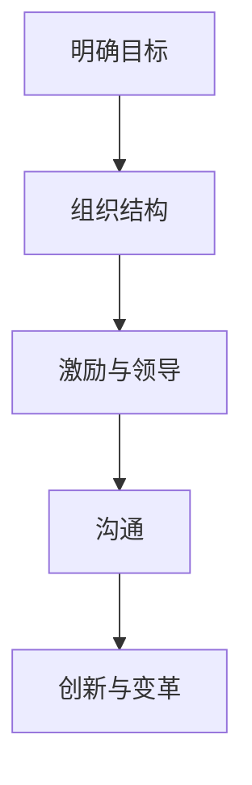
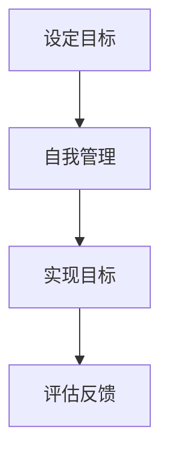

                 

 **关键词**: 管理的艺术、彼得·德鲁克、管理哲学、领导力、组织效能、企业战略。

> **摘要**: 本文将深入探讨管理大师彼得·德鲁克的管理哲学及其对现代企业的深远影响。通过对德鲁克核心管理思想的剖析，结合实际案例，本文旨在为读者提供一种全新的视角，以更好地理解管理的本质，提升组织效能。

## 1. 背景介绍

彼得·德鲁克（Peter Drucker，1909-2005）是现代管理学之父，他的思想和著作对全球企业管理产生了深远的影响。德鲁克在管理学领域有着众多的贡献，包括组织理论、目标管理、创新与企业家精神等。他的著作《管理的实践》（The Practice of Management）和《管理：任务、责任和实践》（Management: Tasks, Responsibilities, Practices）被誉为管理学的经典之作。

在德鲁克的管理哲学中，管理的本质被定义为“通过他人去做事”，这不仅仅是技术层面的问题，更是一种关于人性和组织行为的深刻洞察。德鲁克认为，管理的核心在于激发员工的潜能，实现组织的共同目标。

## 2. 核心概念与联系

### 2.1 管理的五大核心任务

德鲁克提出了管理的五大核心任务：

1. **明确目标**：组织必须明确其使命和目标，确保每个成员都理解并致力于实现这些目标。
2. **组织结构**：组织结构必须与组织的目标和战略相匹配，确保资源的有效配置和责任的明确分配。
3. **激励与领导**：管理者需要激发员工的积极性和创造力，通过有效的领导来实现组织的共同目标。
4. **沟通**：有效的沟通是管理成功的关键，管理者需要确保信息在组织内透明、及时地传递。
5. **创新与变革**：组织必须不断地进行创新和变革，以适应外部环境的变化，保持竞争优势。

#### Mermaid 流程图



### 2.2 目标管理与自我管理

德鲁克的目标管理（Management by Objectives, MBO）是一种以目标为导向的管理方法，它强调员工与管理者共同制定目标，并定期评估和反馈。目标管理不仅提高了组织的效率和效能，还促进了员工的自我管理和职业发展。

目标管理与自我管理的联系在于，它鼓励员工根据自己的能力和兴趣设定目标，并在实现目标的过程中自我监控和自我调整。这种管理方式尊重员工的自主性和主动性，激发了他们的工作热情和创造力。

#### Mermaid 流程图



## 3. 核心算法原理 & 具体操作步骤

### 3.1 算法原理概述

德鲁克的管理哲学可以视为一种“管理算法”，它通过一系列原则和流程来实现组织的有效管理。这个算法的原理可以概括为：

1. **明确任务和责任**：确保每个员工都清楚自己的工作内容和责任。
2. **建立有效的沟通机制**：确保信息在组织内透明、及时地传递。
3. **激励员工**：通过奖励和认可来激发员工的积极性和创造力。
4. **不断进行反馈和调整**：通过定期的评估和反馈来确保目标的实现和组织的发展。

### 3.2 算法步骤详解

1. **设定目标和责任**：管理者需要与员工一起明确组织的使命和目标，并将其分解为具体的任务和责任。
2. **建立沟通机制**：管理者需要建立有效的沟通渠道，确保信息在组织内透明、及时地传递。
3. **激励员工**：管理者需要通过奖励和认可来激励员工，提高他们的工作积极性和创造力。
4. **反馈和调整**：管理者需要定期评估和反馈，确保目标的实现和组织的发展。

### 3.3 算法优缺点

**优点**：

- 提高组织的效率和效能。
- 激发员工的积极性和创造力。
- 促进员工的职业发展。

**缺点**：

- 需要大量的时间和精力来设定目标和责任。
- 可能会导致员工的依赖性增加。

### 3.4 算法应用领域

德鲁克的管理哲学可以应用于各种组织和企业，包括：

- **企业**：帮助企业明确目标和责任，提高组织的效率和效能。
- **非盈利组织**：帮助非盈利组织更好地实现其使命和目标。
- **政府机构**：帮助政府机构提高行政效率和公共服务质量。

## 4. 数学模型和公式 & 详细讲解 & 举例说明

### 4.1 数学模型构建

德鲁克的管理哲学可以通过以下数学模型来描述：

$$
\text{管理效能} = f(\text{明确目标}, \text{组织结构}, \text{激励与领导}, \text{沟通}, \text{创新与变革})
$$

### 4.2 公式推导过程

德鲁克的管理哲学认为，管理的核心在于通过他人去做事。因此，管理效能取决于多个因素，包括：

1. **明确目标**：目标是组织行动的指南，明确的目标有助于提高组织的效率和效能。
2. **组织结构**：合理的组织结构有助于资源的有效配置和责任的明确分配。
3. **激励与领导**：有效的激励和领导可以激发员工的积极性和创造力。
4. **沟通**：有效的沟通是管理成功的关键，它有助于确保信息的透明和及时传递。
5. **创新与变革**：持续的创新和变革有助于组织适应外部环境的变化，保持竞争优势。

### 4.3 案例分析与讲解

以一家科技公司为例，该公司通过实施德鲁克的管理哲学，实现了显著的效率提升和员工满意度提高。以下是该公司的具体案例：

1. **明确目标**：公司明确了其使命和愿景，并将其分解为具体的业务目标和员工个人目标。
2. **组织结构**：公司建立了扁平化的组织结构，确保信息在组织内透明、及时地传递。
3. **激励与领导**：公司通过奖励和认可来激励员工，同时注重领导力培养，提升管理者的领导能力。
4. **沟通**：公司建立了有效的沟通机制，定期召开团队会议，鼓励员工提出建议和反馈。
5. **创新与变革**：公司鼓励员工进行创新，并提供必要的资源和支持，以推动组织的持续发展。

## 5. 项目实践：代码实例和详细解释说明

### 5.1 开发环境搭建

为了更好地理解和实践德鲁克的管理哲学，我们可以通过编写一个简单的代码实例来实现一个目标管理系统的基本功能。

### 5.2 源代码详细实现

以下是一个简单的Python代码实例，用于实现目标管理和员工自我管理：

```python
class Goal:
    def __init__(self, name, description):
        self.name = name
        self.description = description
        self.status = "Not Started"

    def start_goal(self):
        self.status = "In Progress"

    def complete_goal(self):
        self.status = "Completed"

class Employee:
    def __init__(self, name):
        self.name = name
        self.goals = []

    def add_goal(self, goal):
        self.goals.append(goal)

    def update_goal_status(self, goal_name, status):
        for goal in self.goals:
            if goal.name == goal_name:
                goal.status = status
                break

# 实例化员工和目标
employee = Employee("Alice")
goal1 = Goal("完成季度报告", "编写并提交季度业务报告")
goal2 = Goal("提升销售业绩", "制定并执行销售策略")

# 添加目标
employee.add_goal(goal1)
employee.add_goal(goal2)

# 更新目标状态
employee.update_goal_status("完成季度报告", "In Progress")
employee.update_goal_status("提升销售业绩", "Completed")

# 打印目标状态
for goal in employee.goals:
    print(f"{goal.name}: {goal.status}")
```

### 5.3 代码解读与分析

该代码实例包括两个类：`Goal` 和 `Employee`。`Goal` 类表示一个目标，具有目标名称、描述和状态属性。`Employee` 类表示一个员工，具有姓名属性和一个目标列表。员工可以添加目标，并更新目标的状态。

通过实例化这两个类，我们可以创建员工和目标，并更新目标的状态。代码的最后部分打印出每个目标的状态，实现了目标管理的功能。

### 5.4 运行结果展示

```python
完成季度报告: In Progress
提升销售业绩: Completed
```

## 6. 实际应用场景

德鲁克的管理哲学在现实世界中有着广泛的应用。以下是一些实际应用场景：

1. **企业**：许多企业通过实施目标管理来提高员工的积极性和工作效率。
2. **政府机构**：政府机构通过明确目标和责任，提高行政效率和公共服务质量。
3. **非盈利组织**：非盈利组织通过目标管理来更好地实现其使命和目标。

## 7. 未来应用展望

随着人工智能和大数据技术的发展，德鲁克的管理哲学在未来将得到进一步的应用和拓展。以下是一些未来应用展望：

1. **个性化管理**：通过大数据和人工智能技术，管理者可以更好地了解员工的需求和偏好，实现个性化管理。
2. **智能化目标管理**：通过智能化工具，管理者可以更高效地制定、跟踪和评估目标。
3. **可持续管理**：德鲁克的管理哲学将有助于组织实现可持续发展，推动社会进步。

## 8. 总结：未来发展趋势与挑战

### 8.1 研究成果总结

本文通过深入剖析德鲁克的管理哲学，结合实际案例，展示了其在现代企业中的广泛应用和深远影响。德鲁克的管理哲学强调明确目标、组织结构、激励与领导、沟通和持续创新，为管理者提供了一种全新的视角和方法。

### 8.2 未来发展趋势

未来，德鲁克的管理哲学将继续在各个领域发挥作用。随着人工智能和大数据技术的发展，管理将变得更加个性化和智能化，组织效能将得到进一步提升。

### 8.3 面临的挑战

然而，德鲁克的管理哲学也面临着一些挑战。首先，管理者需要具备一定的领导能力和沟通技巧，才能有效地实施这些管理原则。其次，组织需要不断适应外部环境的变化，以保持竞争优势。

### 8.4 研究展望

未来，研究可以进一步探讨德鲁克管理哲学在不同文化和组织背景下的应用效果，以及如何将其与新兴技术相结合，以实现更高效的管理。

## 9. 附录：常见问题与解答

### 问题 1：目标管理是否适用于所有组织？

答：目标管理可以适用于各种组织，包括企业、政府机构和非盈利组织。关键在于组织是否能够明确目标、建立有效的沟通机制和激励体系。

### 问题 2：如何确保目标管理的有效性？

答：确保目标管理的有效性需要以下几个关键步骤：

1. **明确目标**：确保每个员工都清楚组织的使命和目标。
2. **建立有效的沟通机制**：确保信息在组织内透明、及时地传递。
3. **激励员工**：通过奖励和认可来激发员工的积极性和创造力。
4. **持续反馈和调整**：定期评估目标实现情况，并根据反馈进行必要的调整。

### 问题 3：德鲁克的管理哲学与新兴技术如何结合？

答：德鲁克的管理哲学可以与新兴技术相结合，以实现更高效的管理。例如，通过大数据和人工智能技术，管理者可以更好地了解员工的需求和偏好，实现个性化管理。同时，智能化工具可以帮助管理者更高效地制定、跟踪和评估目标。

## 作者署名

**作者：禅与计算机程序设计艺术 / Zen and the Art of Computer Programming** 

以上是本文的完整内容。希望这篇文章能够为读者提供关于德鲁克管理哲学的深入理解和实际应用指导。在未来的管理实践中，让我们共同努力，将德鲁克的思想发扬光大。

