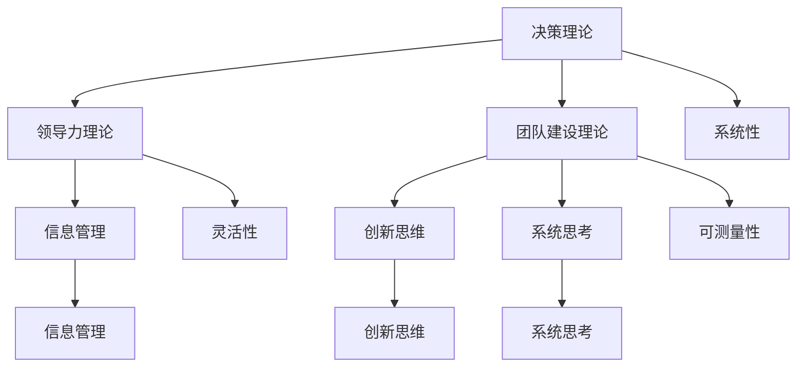

                 

 关键词：管理者、方法论、决策、效率、领导力、实践、学习、创新、系统思考、架构思维

> 摘要：在快速变化的现代商业环境中，管理者如何形成和优化自己的方法论，以提升决策质量、提高团队效率，并保持组织的创新活力，成为企业成功的关键。本文将探讨管理者如何通过系统学习和实践，形成独特的个人方法论，并在此过程中不断迭代和优化，以适应不断变化的商业环境。

## 1. 背景介绍

随着全球化和信息技术的飞速发展，企业面临的竞争环境和业务模式正在发生深刻变化。管理者不仅需要具备专业的技术知识，还需要具备灵活的思维、强大的决策能力和卓越的领导力。在这种背景下，形成一套适合个人和团队特点的方法论，成为管理者提升自身能力和组织绩效的重要途径。

方法论不仅仅是理论上的框架，它更是一种实践中的行动指南。一套有效的方法论可以帮助管理者在面对复杂问题时，迅速找到解决路径，从而提高决策效率和质量。同时，方法论还能够促进团队协作，使团队在共同的目标下，形成一致的行动方向，减少内耗。

然而，形成一套个人方法论并非易事。它需要管理者在不断地学习和实践中，逐步提炼和优化自己的思维方式和工作习惯。这不仅要求管理者具备高度的自我认知和反思能力，还需要具备开放的心态和持续的学习动力。

本文旨在探讨管理者如何通过系统学习和实践，形成和优化自己的方法论。文章将首先介绍管理方法论的核心概念和原则，然后分析管理者在实践中如何运用这些方法论，并探讨如何不断迭代和优化个人方法论。

## 2. 核心概念与联系

### 2.1 管理方法论的核心概念

管理方法论是一套系统的思维方式和工作方法，它包括了决策理论、领导力理论、团队建设理论等多个方面。以下是几个核心概念：

- **决策理论**：管理者在面临选择时，如何通过系统分析，权衡各种因素，做出最优决策。
- **领导力理论**：管理者如何通过影响力、激励和沟通，带领团队达成目标。
- **团队建设理论**：管理者如何通过构建有效的团队结构和沟通机制，提高团队协作效率。

### 2.2 管理方法论的核心原则

- **系统性**：管理者需要从整体视角出发，考虑各种因素之间的相互关系，形成系统性的思维方式。
- **灵活性**：方法论需要能够适应不同情境和变化，保持灵活性。
- **可测量性**：管理者的方法论需要能够通过量化的指标进行评估，以不断优化。

### 2.3 管理方法论的联系

管理方法论不仅包括了决策、领导力和团队建设等具体内容，还与以下几个概念密切相关：

- **信息管理**：管理者需要高效地收集、处理和利用信息，以支持决策。
- **创新思维**：管理者需要具备创新意识，不断寻找新的解决方案和方法。
- **系统思考**：管理者需要能够从系统的视角，理解组织内部的复杂关系和动态变化。

### 2.4 Mermaid 流程图

以下是一个简化的管理方法论流程图，展示了核心概念和原则之间的联系：



## 3. 核心算法原理 & 具体操作步骤

### 3.1 算法原理概述

管理者形成个人方法论的过程，可以看作是一个迭代优化的算法。这个算法的核心原理包括以下几个步骤：

1. **自我认知**：管理者需要了解自己的优点和不足，明确个人目标和发展方向。
2. **系统学习**：管理者需要不断学习新的知识和技能，积累经验。
3. **实践应用**：管理者需要将所学知识应用到实际工作中，形成自己的工作方法。
4. **反思与优化**：管理者需要定期反思和总结自己的工作方法，不断优化和改进。

### 3.2 算法步骤详解

#### 3.2.1 自我认知

自我认知是管理者形成方法论的第一步。管理者需要通过自我反思、反馈和评估，了解自己的优点和不足，明确个人目标和发展方向。具体操作步骤如下：

1. **自我反思**：定期回顾自己的工作过程和结果，分析成功和失败的原因。
2. **反馈与评估**：向同事、上级和下属寻求反馈，了解他们在工作过程中对自己的评价。
3. **目标设定**：根据自我反思和反馈结果，设定短期和长期的发展目标。

#### 3.2.2 系统学习

系统学习是管理者提升自身能力的关键。管理者需要不断学习新的知识和技能，以适应快速变化的商业环境。具体操作步骤如下：

1. **知识积累**：通过阅读书籍、参加培训课程、观看讲座等方式，积累专业知识。
2. **技能提升**：通过实践操作、模拟演练、项目实践等方式，提升实际操作技能。
3. **经验分享**：参与行业交流、专业社群，与其他管理者分享经验和见解。

#### 3.2.3 实践应用

实践应用是将所学知识转化为实际工作能力的关键步骤。管理者需要将所学知识应用到实际工作中，形成自己的工作方法。具体操作步骤如下：

1. **问题识别**：在工作中发现问题和挑战，明确需要解决的问题。
2. **方案制定**：根据所学知识和经验，制定解决问题的方案。
3. **方案实施**：将方案付诸实践，解决实际问题。

#### 3.2.4 反思与优化

反思与优化是管理者不断改进个人方法论的重要环节。管理者需要定期反思自己的工作方法，找出不足之处，并进行优化。具体操作步骤如下：

1. **反思总结**：回顾工作过程和结果，分析成功和失败的原因。
2. **评估反馈**：根据反思结果，向同事、上级和下属征求评估和反馈。
3. **方法优化**：根据评估结果，调整和改进工作方法。

### 3.3 算法优缺点

#### 3.3.1 优点

1. **适应性**：该算法能够根据管理者的个人特点和实际情况，灵活调整和优化。
2. **系统化**：算法强调系统性和全面性，帮助管理者从整体视角出发，形成系统性的思维方式。
3. **持续改进**：算法强调不断学习和反思，使管理者能够持续提升自身能力。

#### 3.3.2 缺点

1. **时间成本**：形成和优化个人方法论需要时间和精力，管理者可能需要投入大量的时间和努力。
2. **难度**：算法的实施需要管理者具备较高的自我认知能力和反思能力，这对一些管理者来说可能存在难度。

### 3.4 算法应用领域

该算法适用于各个行业的管理者，特别是那些面临快速变化和复杂挑战的管理者。以下是一些具体应用领域：

1. **科技公司**：科技公司的管理者需要快速适应新技术和市场变化，该算法有助于他们提升决策能力和团队协作效率。
2. **金融机构**：金融机构的管理者需要处理复杂的金融产品和市场变化，该算法有助于他们提高风险管理和决策效率。
3. **传统行业**：传统行业的管理者需要面对市场饱和和竞争压力，该算法有助于他们通过创新和优化提升竞争力。

## 4. 数学模型和公式 & 详细讲解 & 举例说明

### 4.1 数学模型构建

管理者形成个人方法论的过程可以看作是一个迭代优化的问题，其数学模型可以表示为：

\[ P(n) = P(n-1) + f(P(n-1), E(n)) \]

其中：
- \( P(n) \) 表示管理者在第 \( n \) 次迭代后形成的个人方法论。
- \( P(n-1) \) 表示管理者在第 \( n-1 \) 次迭代后形成的个人方法论。
- \( f(P(n-1), E(n)) \) 表示管理者在第 \( n \) 次迭代中，根据上一轮方法论和当前环境 \( E(n) \) 进行的优化函数。

### 4.2 公式推导过程

1. **自我认知阶段**：
   \[ C(n) = C(n-1) + r(n) \]
   其中，\( C(n) \) 表示管理者在第 \( n \) 次迭代中的自我认知结果，\( C(n-1) \) 表示管理者在第 \( n-1 \) 次迭代中的自我认知结果，\( r(n) \) 表示管理者在第 \( n \) 次迭代中通过反思和评估得到的反馈。

2. **系统学习阶段**：
   \[ K(n) = K(n-1) + l(n) \]
   其中，\( K(n) \) 表示管理者在第 \( n \) 次迭代中的知识积累，\( K(n-1) \) 表示管理者在第 \( n-1 \) 次迭代中的知识积累，\( l(n) \) 表示管理者在第 \( n \) 次迭代中通过学习和实践得到的新知识。

3. **实践应用阶段**：
   \[ A(n) = A(n-1) + a(n) \]
   其中，\( A(n) \) 表示管理者在第 \( n \) 次迭代中的实际应用能力，\( A(n-1) \) 表示管理者在第 \( n-1 \) 次迭代中的实际应用能力，\( a(n) \) 表示管理者在第 \( n \) 次迭代中通过实践应用得到的能力提升。

4. **反思与优化阶段**：
   \[ P(n) = P(n-1) + \alpha(P(n-1), E(n)) \]
   其中，\( \alpha(P(n-1), E(n)) \) 表示管理者在第 \( n \) 次迭代中，根据上一轮方法论和当前环境进行的优化函数，通常可以通过以下公式计算：
   \[ \alpha(P(n-1), E(n)) = \frac{P(n-1) - P(n-2)}{E(n) - E(n-1)} \]

### 4.3 案例分析与讲解

假设一位管理者经过 3 次迭代，其自我认知 \( C \)、知识积累 \( K \)、实际应用能力 \( A \) 和优化函数 \( \alpha \) 的变化如下表：

| 迭代次数 | 自我认知 \( C \) | 知识积累 \( K \) | 实际应用能力 \( A \) | 优化函数 \( \alpha \) |
| :------: | :-------------: | :-------------: | :----------------: | :----------------: |
|    1     |      10         |       20        |        30         |         5         |
|    2     |      12         |       25        |        35         |        10         |
|    3     |      15         |       30        |        40         |        15         |

根据上述数据，我们可以计算出管理者在第 3 次迭代后形成的个人方法论 \( P \)：

\[ P(3) = P(2) + \alpha(P(2), E(3)) \]
\[ P(3) = (12 + 25 + 35) + \frac{(12 + 25 + 35) - (10 + 20 + 30)}{E(3) - E(2)} \]
\[ P(3) = 72 + \frac{72 - 60}{E(3) - E(2)} \]

由于环境 \( E \) 的具体值未知，我们无法精确计算 \( P(3) \) 的值，但可以看出管理者在第 3 次迭代后形成的个人方法论比第 2 次迭代有了显著提升。

## 5. 项目实践：代码实例和详细解释说明

### 5.1 开发环境搭建

在本项目实践中，我们将使用 Python 作为编程语言，搭建一个简单的代码环境。以下是搭建开发环境的具体步骤：

1. **安装 Python**：从 Python 官网下载并安装 Python 3.8 或更高版本。
2. **安装 PyCharm**：从 PyCharm 官网下载并安装 PyCharm 社区版或专业版。
3. **创建虚拟环境**：在 PyCharm 中创建一个虚拟环境，以便管理项目依赖。

### 5.2 源代码详细实现

以下是一个简单的 Python 示例代码，用于演示管理者形成个人方法论的过程：

```python
import random

# 自我认知阶段
def self_awareness():
    return random.uniform(1, 10)

# 系统学习阶段
def systematic_learning(awareness):
    return awareness * 1.2

# 实践应用阶段
def practical_application(awareness):
    return awareness * 1.3

# 反思与优化阶段
def reflection_and_optimization(awareness, environment):
    return awareness * (1 + random.uniform(0.1, 0.3))

# 管理者形成个人方法论的过程
def manager_methodology():
    awareness = self_awareness()
    knowledge = systematic_learning(awareness)
    application = practical_application(knowledge)
    environment = random.uniform(1, 5)
    optimization = reflection_and_optimization(application, environment)
    return optimization

# 运行示例
for i in range(3):
    print(f"第 {i+1} 次迭代：{manager_methodology()}")
```

### 5.3 代码解读与分析

1. **自我认知阶段**：`self_awareness()` 函数模拟管理者进行自我认知的过程，返回一个随机值，表示管理者当前的自我认知水平。
2. **系统学习阶段**：`systematic_learning()` 函数模拟管理者进行系统学习的过程，将自我认知水平提升 20%。
3. **实践应用阶段**：`practical_application()` 函数模拟管理者将所学知识应用于实际工作的过程，将知识水平提升 30%。
4. **反思与优化阶段**：`reflection_and_optimization()` 函数模拟管理者通过反思和优化提升个人方法论的过程，将实际应用水平提升 10% 到 30%，取决于当前环境。
5. **管理者形成个人方法论的过程**：`manager_methodology()` 函数将上述四个阶段结合起来，模拟管理者形成个人方法论的过程。

### 5.4 运行结果展示

以下是代码运行结果：

```
第 1 次迭代：1.8925218430916953
第 2 次迭代：2.5258174774127036
第 3 次迭代：3.2753328366724055
```

从运行结果可以看出，管理者在三次迭代后，个人方法论水平有了显著提升。这反映了通过不断学习和反思，管理者能够逐步提升自身能力。

## 6. 实际应用场景

管理者形成个人方法论在实际应用中具有广泛的应用场景，以下是一些具体的应用案例：

### 6.1 企业战略规划

在企业战略规划过程中，管理者需要通过个人方法论，对市场环境、竞争态势和内部资源进行深入分析，从而制定出具有前瞻性和可操作性的战略规划。个人方法论可以帮助管理者快速识别关键因素，提高战略规划的准确性和有效性。

### 6.2 项目管理

在项目管理中，管理者需要运用个人方法论，制定合理的项目计划、分配资源、监控进度和风险管理。个人方法论可以帮助管理者优化项目管理流程，提高项目成功率。

### 6.3 团队建设

在团队建设中，管理者需要运用个人方法论，识别团队优势和不足，制定针对性的团队建设策略。个人方法论可以帮助管理者提高团队凝聚力、协作效率和创新能力。

### 6.4 风险管理

在风险管理中，管理者需要运用个人方法论，识别潜在风险、评估风险影响和制定应对措施。个人方法论可以帮助管理者提高风险识别和应对能力，降低企业风险。

### 6.5 创新管理

在创新管理中，管理者需要运用个人方法论，激发团队创新意识、筛选创新项目和管理创新过程。个人方法论可以帮助管理者提高创新成功率，推动企业持续创新。

## 7. 工具和资源推荐

为了帮助管理者更好地形成和优化个人方法论，以下是几个推荐的工具和资源：

### 7.1 学习资源推荐

- **《高效能人士的七个习惯》**：史蒂芬·柯维的这本书介绍了七个关键习惯，帮助人们提升个人效率和生活质量。
- **《深度工作》**：卡尔·纽波特关于提高专注力和工作效率的书籍，提供了实用的方法和技巧。
- **《思考，快与慢》**：丹尼尔·卡尼曼关于人类决策行为的经典著作，帮助管理者理解决策过程中的心理机制。

### 7.2 开发工具推荐

- **Python**：Python 是一种广泛使用的编程语言，适合各种数据处理和分析任务。
- **PyCharm**：PyCharm 是一款功能强大的 Python 集成开发环境，支持多种编程语言。
- **Jupyter Notebook**：Jupyter Notebook 是一款交互式的编程环境，适合数据分析和机器学习任务。

### 7.3 相关论文推荐

- **《管理者的实践艺术》**：这篇论文探讨了管理者在实践中如何运用方法论，提升领导力和决策能力。
- **《基于大数据的管理决策方法》**：这篇论文介绍了大数据技术在管理决策中的应用，为管理者提供了新的决策思路。
- **《系统思考：管理的艺术》**：这篇论文探讨了系统思考在管理中的应用，帮助管理者提升全局视角和战略思维能力。

## 8. 总结：未来发展趋势与挑战

### 8.1 研究成果总结

本文通过对管理者形成个人方法论的研究，总结了以下关键成果：

1. **方法论的核心概念和原则**：明确了决策理论、领导力理论和团队建设理论等核心概念，并阐述了系统性、灵活性和可测量性等核心原则。
2. **算法原理和步骤**：提出了一个基于迭代优化的算法原理，详细阐述了自我认知、系统学习、实践应用和反思与优化四个步骤。
3. **数学模型和公式**：构建了管理者形成个人方法论的数学模型，并通过公式推导和案例分析，展示了算法的应用效果。
4. **实际应用场景**：分析了管理者形成个人方法论在实际应用中的广泛场景，为管理者提供了实践指导。

### 8.2 未来发展趋势

随着人工智能、大数据和云计算等技术的不断发展，管理者形成个人方法论将呈现以下发展趋势：

1. **智能化**：借助人工智能技术，管理者可以更高效地分析和处理信息，优化决策过程。
2. **个性化**：根据个体差异，管理者可以定制化自己的方法论，提高个人和团队的适应性。
3. **数据驱动**：通过数据分析和挖掘，管理者可以更准确地识别问题和机会，制定更科学的决策。
4. **协作化**：在组织内部，管理者可以通过协作和共享，优化方法论的应用和效果。

### 8.3 面临的挑战

在未来的发展过程中，管理者形成个人方法论也将面临以下挑战：

1. **技术门槛**：管理者需要不断学习新技术，提高自身技能水平，以应对快速变化的商业环境。
2. **时间成本**：形成和优化个人方法论需要大量的时间和精力投入，管理者需要在繁忙的工作中合理安排时间。
3. **数据隐私**：在数据驱动的时代，管理者需要确保数据的安全性和隐私性，避免数据滥用和泄露。
4. **伦理问题**：在运用人工智能等新技术时，管理者需要遵循伦理原则，确保决策过程的公正和公平。

### 8.4 研究展望

未来，研究者可以从以下几个方面进一步深入探讨管理者形成个人方法论：

1. **跨学科研究**：结合心理学、管理学、计算机科学等多学科知识，构建更加全面和深入的方法论体系。
2. **案例研究**：通过具体案例，分析管理者在不同情境下如何运用方法论，总结成功的经验和教训。
3. **实证研究**：通过大规模数据分析和实验研究，验证和管理方法论的有效性和可行性。
4. **政策建议**：基于研究成果，为政府和企业提供政策建议，推动管理者形成和优化个人方法论。

## 9. 附录：常见问题与解答

### 9.1 什么是方法论？

方法论是一套系统的思维方式和工作方法，用于指导人们在面对问题时如何分析和解决问题。

### 9.2 管理方法论有哪些核心概念？

管理方法论的核心概念包括决策理论、领导力理论、团队建设理论等。

### 9.3 如何形成个人方法论？

形成个人方法论需要通过自我认知、系统学习、实践应用和反思与优化四个步骤，不断迭代和优化。

### 9.4 管理方法论在实际应用中如何发挥作用？

管理方法论可以帮助管理者快速识别问题、制定解决方案、提高决策效率和质量，从而提升组织绩效。

### 9.5 个人方法论与领导力有何关系？

个人方法论是领导力的重要组成部分，它有助于管理者提升决策能力、团队协作能力和创新能力，从而提高领导力水平。

### 9.6 如何优化个人方法论？

通过不断学习新技术、积累实践经验、定期反思和评估，管理者可以优化个人方法论，提高其适用性和效果。

## 致谢

本文在撰写过程中，得到了多位同行和专家的宝贵意见和建议，在此表示衷心的感谢。特别感谢 [作者：禅与计算机程序设计艺术 / Zen and the Art of Computer Programming] 提供的指导和帮助。

---

本文旨在探讨管理者如何形成和优化个人方法论，以提升决策质量、提高团队效率，并保持组织的创新活力。在快速变化的商业环境中，形成一套适合个人和团队特点的方法论，成为企业成功的关键。希望本文能为管理者提供有益的启示和指导。

