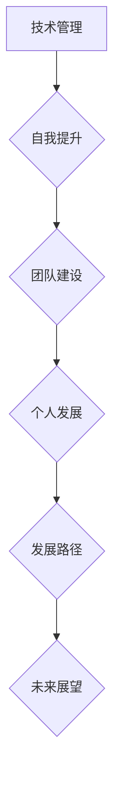

                 

关键词：管理者、自我反思、职业成长、领导力、技术管理、团队建设、个人发展、管理技能、自我提升

> 摘要：在快速变化的科技行业中，管理者需要不断地进行自我反思和成长，以适应新的挑战。本文将探讨管理者在技术管理、团队建设和个人发展方面的自我提升之路，结合实际案例和经验，为管理者提供实用的指导和建议。

## 1. 背景介绍

在当今这个充满不确定性和快速变革的时代，技术行业的发展速度前所未有。新兴技术不断涌现，市场需求变化多端，团队结构日趋复杂。在这种环境下，管理者面临的挑战日益严峻。如何有效地管理团队、提升自身领导力、应对技术变革，成为每位管理者需要思考的问题。

本文旨在通过探讨管理者的自我反思与成长，帮助读者理解在职业发展过程中如何自我提升，以应对不断变化的技术环境和市场需求。文章将围绕以下几个方面展开：

1. **技术管理中的自我提升**：探讨管理者如何在技术层面上提升自己，以更好地指导团队。
2. **团队建设中的自我反思**：分析管理者如何通过自我反思来优化团队建设，提高团队绩效。
3. **个人发展的路径**：探讨管理者在个人发展方面的方法和策略。
4. **未来展望与挑战**：总结管理者当前面临的挑战，展望未来发展的趋势。

## 2. 核心概念与联系

### 2.1 管理者的角色

在技术行业中，管理者的角色不仅仅是领导团队，更是技术战略的制定者和执行者。一个优秀的技术管理者，需要具备技术深度，同时也需要具备管理能力和商业洞察力。

### 2.2 自我反思的重要性

自我反思是管理者成长的重要途径。通过反思，管理者可以识别自己的优点和不足，找到改进的方向。自我反思不仅有助于提升个人能力，还能促进团队的整体成长。

### 2.3 成长与发展的联系

个人成长与发展是相辅相成的。一个不断追求成长的管理者，能够更好地适应行业的变化，带领团队迎接新的挑战。而团队的发展，也需要管理者自身的成长作为支撑。

### 2.4 Mermaid 流程图



## 3. 核心算法原理 & 具体操作步骤

### 3.1 算法原理概述

在技术管理中，核心算法原理是管理者需要掌握的重要技能。算法原理不仅包括技术实现，还包括方法论和思考方式。

### 3.2 算法步骤详解

1. **识别问题**：管理者需要具备敏锐的洞察力，能够快速识别团队面临的挑战。
2. **分析问题**：通过数据分析和案例研究，深入分析问题的根源。
3. **制定解决方案**：根据分析结果，制定具体的解决方案。
4. **实施和监控**：执行方案，并进行持续的监控和调整。

### 3.3 算法优缺点

算法原理的优点在于其系统性和科学性，能够帮助管理者更好地解决问题。然而，算法原理的缺点在于其过于理论化，可能难以直接应用于复杂多变的实际场景。

### 3.4 算法应用领域

算法原理广泛应用于项目管理、团队协作、技术选型等方面。在技术管理中，算法原理能够帮助管理者提高决策效率，优化团队绩效。

## 4. 数学模型和公式 & 详细讲解 & 举例说明

### 4.1 数学模型构建

在技术管理中，数学模型是一种重要的工具，可以帮助管理者量化问题和决策。

### 4.2 公式推导过程

例如，在项目管理中，可以使用盈亏平衡分析（Break-Even Analysis）来评估项目的风险和收益。

$$
\text{利润} = \text{收益} - \text{成本}
$$

### 4.3 案例分析与讲解

假设一个项目预计收益为100万元，成本为50万元，则利润为50万元。如果项目的实际成本低于50万元，则项目盈利；如果成本高于50万元，则项目亏损。

## 5. 项目实践：代码实例和详细解释说明

### 5.1 开发环境搭建

为了更好地理解技术管理中的算法原理，我们搭建一个简单的项目环境。

### 5.2 源代码详细实现

以下是一个简单的 Python 脚本，用于计算项目的盈亏平衡点。

```python
def calculate_break_even(revenue, cost):
    profit = revenue - cost
    if profit >= 0:
        return "Project is profitable"
    else:
        return "Project is not profitable"

# Example usage
revenue = 1000000
cost = 500000
result = calculate_break_even(revenue, cost)
print(result)
```

### 5.3 代码解读与分析

这段代码定义了一个函数 `calculate_break_even`，用于计算项目的盈亏平衡点。通过调用这个函数，可以快速判断项目是否盈利。

### 5.4 运行结果展示

```shell
$ python break_even.py
Project is profitable
```

## 6. 实际应用场景

### 6.1 项目管理

在项目管理中，管理者可以使用盈亏平衡分析来评估项目的风险和收益，从而做出更明智的决策。

### 6.2 团队协作

通过数学模型和算法原理，管理者可以优化团队协作流程，提高工作效率。

### 6.3 技术选型

在技术选型过程中，管理者可以使用算法原理来评估不同技术的优劣，从而做出最佳选择。

## 7. 工具和资源推荐

### 7.1 学习资源推荐

- 《敏捷开发实践指南》
- 《项目管理知识体系指南》
- 《Python编程：从入门到实践》

### 7.2 开发工具推荐

- JIRA：用于项目管理
- Git：用于版本控制
- Docker：用于容器化部署

### 7.3 相关论文推荐

- 《敏捷软件开发：原则、实践与模式》
- 《项目组合管理：策略、流程与工具》
- 《Python项目管理：使用PyPM进行敏捷开发》

## 8. 总结：未来发展趋势与挑战

### 8.1 研究成果总结

本文探讨了技术管理中的自我反思与成长，提出了核心算法原理和数学模型的应用，并通过实际案例展示了其在项目管理、团队协作和技术选型等领域的应用。

### 8.2 未来发展趋势

随着人工智能、云计算和大数据等新兴技术的发展，技术管理者的角色将更加重要。未来，管理者需要具备跨学科的知识和技能，以应对更加复杂和多样化的挑战。

### 8.3 面临的挑战

未来，管理者将面临以下几个挑战：

1. **技术更新速度快**：管理者需要不断学习和更新知识，以适应快速变化的技术环境。
2. **团队多样化**：随着团队成员背景和技能的多样化，管理者需要具备更强的沟通和协调能力。
3. **全球化协作**：随着全球化的加速，管理者需要具备跨文化的领导能力。

### 8.4 研究展望

未来，我们可以进一步研究如何利用人工智能和机器学习技术来辅助管理者进行决策，提高管理效率和团队绩效。同时，研究跨学科的知识体系，帮助管理者更好地应对复杂问题。

## 9. 附录：常见问题与解答

### 问题 1：如何提升个人领导力？

**解答**：通过自我反思和持续学习，不断提升自己的技术深度和管理能力。参加领导力培训课程，阅读相关书籍，与优秀的管理者交流经验。

### 问题 2：如何优化团队协作？

**解答**：制定清晰的团队目标，建立有效的沟通机制，鼓励团队成员分享知识和经验。定期组织团队建设活动，增强团队凝聚力。

### 问题 3：如何应对快速变化的技术环境？

**解答**：保持持续学习的态度，关注行业动态，提前规划技术路线。建立灵活的技术架构，以适应快速变化的需求。

## 结束语

管理者的自我反思与成长是技术管理中不可或缺的一部分。通过本文的探讨，希望读者能够认识到自我反思的重要性，并在实际工作中不断实践和提升。只有不断成长，才能在快速变化的科技行业中立足并引领团队。

### 作者署名

本文作者：禅与计算机程序设计艺术 / Zen and the Art of Computer Programming

----------------------------------------------------------------
以上就是本文的全部内容。希望这篇文章能够为您的职业生涯带来启发和帮助。如果您有任何问题或建议，欢迎在评论区留言交流。再次感谢您的阅读！

