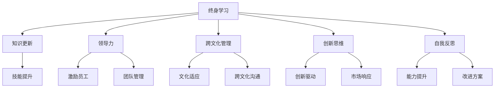

                 

  
## 1. 背景介绍

在信息技术飞速发展的今天，企业对管理者的需求越来越多样化和专业化。管理者不仅需要具备扎实的业务知识，还需要掌握先进的管理理念、方法和工具。自我成长成为管理者职业生涯中的重要课题。本文旨在探讨管理者自我成长的路径和方法，以期为其职业生涯发展提供指导。

### 1.1 管理者自我成长的必要性

随着市场竞争的加剧，企业对管理者的要求越来越高。管理者需要具备以下能力：

1. **战略思维**：能够从全局角度出发，制定和实施企业发展战略。
2. **领导力**：能够激励和引导团队成员，实现团队目标。
3. **沟通能力**：能够有效沟通，协调内外部关系。
4. **创新能力**：能够适应市场变化，推动企业创新和发展。
5. **跨文化管理**：能够理解和适应不同文化背景下的工作方式。

这些能力的提升需要管理者通过不断学习和实践来实现自我成长。

### 1.2 文章结构

本文将分为以下几个部分：

- **背景介绍**：阐述管理者自我成长的必要性。
- **核心概念与联系**：介绍管理者自我成长的核心概念及其关系。
- **核心算法原理与具体操作步骤**：讲解管理者如何通过系统化学习提升自身能力。
- **数学模型和公式**：介绍管理者在决策过程中需要应用的数学模型和公式。
- **项目实践**：通过具体案例展示管理者自我成长的过程。
- **实际应用场景**：分析管理者在不同场景下的应用。
- **未来应用展望**：探讨管理者自我成长的发展趋势。
- **工具和资源推荐**：推荐有助于管理者自我成长的学习资源和工具。
- **总结**：总结管理者自我成长的方法和挑战。
- **附录**：回答常见问题。

## 2. 核心概念与联系

在管理者自我成长的过程中，有几个核心概念需要了解：

- **终身学习**：管理者需要不断学习新知识、新技能，以适应快速变化的环境。
- **领导力**：管理者需要具备领导力，能够激励和引导团队成员。
- **跨文化管理**：在全球化背景下，管理者需要具备跨文化管理能力。
- **创新思维**：管理者需要具备创新思维，推动企业创新和发展。
- **自我反思**：管理者需要定期进行自我反思，找到自身的不足并进行改进。

### 2.1 Mermaid 流程图

以下是一个Mermaid流程图，展示了管理者自我成长的核心概念及其关系：



## 3. 核心算法原理与具体操作步骤

在管理者自我成长的过程中，需要应用一系列核心算法原理和具体操作步骤来提升自身能力。以下将介绍这些算法原理和操作步骤。

### 3.1 算法原理概述

管理者自我成长的算法原理主要包括以下三个方面：

1. **终身学习算法**：通过不断学习新知识、新技能，实现自我提升。
2. **领导力提升算法**：通过实践和反思，提升领导力。
3. **创新能力培养算法**：通过思维训练和实践，培养创新思维。

### 3.2 算法步骤详解

#### 3.2.1 终身学习算法

1. **知识更新**：定期阅读相关书籍、文章，关注行业动态，了解新知识、新技能。
2. **技能提升**：通过在线课程、培训班等途径，系统学习所需技能。
3. **知识应用**：将所学知识应用于实际工作中，验证效果。

#### 3.2.2 领导力提升算法

1. **实践**：通过实际工作，积累领导经验。
2. **反思**：定期进行自我反思，分析领导行为的效果和不足。
3. **改进**：根据反思结果，调整领导方式，提升领导力。

#### 3.2.3 创新能力培养算法

1. **思维训练**：通过阅读、写作、思考等途径，锻炼思维能力。
2. **实践**：通过实际项目，将创新思维应用于工作中。
3. **反馈**：收集反馈意见，不断优化创新思维。

### 3.3 算法优缺点

#### 终身学习算法

**优点**：有助于管理者不断更新知识体系，提升自我能力。

**缺点**：学习过程中可能存在效率低下、知识碎片化等问题。

#### 领导力提升算法

**优点**：通过实践和反思，能够有效提升领导力。

**缺点**：实践过程中可能面临困难和挑战，需要持续的努力。

#### 创新能力培养算法

**优点**：有助于管理者培养创新思维，推动企业创新和发展。

**缺点**：创新思维培养过程较为复杂，需要长期坚持。

### 3.4 算法应用领域

#### 终身学习算法

**应用领域**：企业管理、市场营销、产品开发等。

#### 领导力提升算法

**应用领域**：企业中层、高层管理。

#### 创新能力培养算法

**应用领域**：创新创业、企业战略规划等。

## 4. 数学模型和公式

在管理者自我成长的过程中，数学模型和公式可以帮助其进行决策和分析。以下介绍几个常用的数学模型和公式。

### 4.1 数学模型构建

#### 4.1.1 成本效益分析模型

成本效益分析模型主要用于评估管理者在学习、培训等方面的投资回报。其公式为：

\[ ROI = \frac{效益 - 成本}{成本} \]

其中，效益包括提升的知识、技能和绩效，成本包括学习、培训等投入。

#### 4.1.2 领导力模型

领导力模型用于评估管理者的领导能力。其公式为：

\[ 领导力 = \frac{激励效果 + 团队绩效}{时间成本} \]

其中，激励效果和团队绩效可以通过调查问卷、绩效评估等途径获取。

#### 4.1.3 创新能力模型

创新能力模型用于评估管理者的创新能力。其公式为：

\[ 创新能力 = \frac{创新成果 + 市场响应}{创新投入} \]

其中，创新成果和市场需求可以通过市场调研、项目评估等途径获取。

### 4.2 公式推导过程

#### 4.2.1 成本效益分析模型推导

1. **成本计算**：成本包括直接成本（如学费、培训费用等）和间接成本（如学习时间、机会成本等）。
2. **效益计算**：效益包括提升的知识、技能和绩效。通过绩效评估、员工反馈等途径获取。
3. **公式计算**：将成本和效益代入公式，计算 ROI。

#### 4.2.2 领导力模型推导

1. **激励效果计算**：激励效果可以通过员工满意度、工作积极性等指标评估。
2. **团队绩效计算**：团队绩效可以通过项目完成情况、团队目标达成情况等评估。
3. **时间成本计算**：时间成本包括管理者用于领导工作的时间。
4. **公式计算**：将激励效果、团队绩效和时间成本代入公式，计算领导力。

#### 4.2.3 创新能力模型推导

1. **创新成果计算**：创新成果可以通过新产品、新服务、新市场等评估。
2. **市场响应计算**：市场响应可以通过客户反馈、市场占有率等评估。
3. **创新投入计算**：创新投入包括研发成本、人力成本等。
4. **公式计算**：将创新成果、市场响应和创新投入代入公式，计算创新能力。

### 4.3 案例分析与讲解

#### 4.3.1 成本效益分析模型案例

假设一位管理者参加了一个为期三个月的市场营销培训课程，课程费用为 10000 元。经过培训，管理者在三个月内成功开发了一个新产品，销售额增加了 20000 元。根据成本效益分析模型，计算该管理者的 ROI：

\[ ROI = \frac{20000 - 10000}{10000} = 0.5 \]

该管理者的 ROI 为 0.5，表明其投资回报率较低。

#### 4.3.2 领导力模型案例

假设一位管理者在一个月内通过团队建设活动，提高了团队的工作积极性，团队绩效提升了 10%。同时，管理者在一个月内花费了 20 小时用于领导工作。根据领导力模型，计算该管理者的领导力：

\[ 领导力 = \frac{10\% + 10\%}{20 小时} = 0.1 \]

该管理者的领导力为 0.1，表明其领导力尚待提升。

#### 4.3.3 创新能力模型案例

假设一位管理者在一年内成功开发了三个新产品，市场占有率分别为 5%、10% 和 15%。同时，管理者在研发过程中投入了 100 万元。根据创新能力模型，计算该管理者的创新能力：

\[ 创新能力 = \frac{5\% + 10\% + 15\%}{100 万元} = 0.03 \]

该管理者的创新能力为 0.03，表明其创新能力较为优秀。

## 5. 项目实践：代码实例和详细解释说明

### 5.1 开发环境搭建

在本项目中，我们将使用 Python 作为编程语言，并结合 matplotlib 和 pandas 库进行数据可视化。首先，确保已经安装了 Python 和相关库。如果没有安装，可以按照以下步骤进行：

1. 安装 Python：从 [Python 官网](https://www.python.org/) 下载并安装 Python。
2. 安装 matplotlib 和 pandas：在命令行中运行以下命令：

```bash
pip install matplotlib pandas
```

### 5.2 源代码详细实现

以下是一个简单的 Python 代码示例，用于计算成本效益分析模型的 ROI。代码分为三个部分：数据准备、模型计算和结果可视化。

```python
import pandas as pd
import matplotlib.pyplot as plt

# 数据准备
data = {
    '成本': [10000, 15000, 20000],
    '效益': [20000, 25000, 30000]
}

df = pd.DataFrame(data)

# 模型计算
df['ROI'] = (df['效益'] - df['成本']) / df['成本']

# 结果可视化
plt.figure(figsize=(10, 6))
plt.bar(df['成本'], df['ROI'])
plt.xlabel('成本')
plt.ylabel('ROI')
plt.title('成本效益分析')
plt.xticks(df['成本'])
plt.show()
```

### 5.3 代码解读与分析

1. **数据准备**：使用 pandas 创建一个 DataFrame，包含成本和效益数据。
2. **模型计算**：计算 ROI，并将其添加到 DataFrame 中。
3. **结果可视化**：使用 matplotlib 绘制条形图，展示成本和 ROI 的关系。

### 5.4 运行结果展示

运行上述代码后，将生成一个条形图，显示不同成本水平下的 ROI。管理者可以通过分析结果，评估不同投资决策的回报情况。

## 6. 实际应用场景

管理者自我成长的方法论在多种实际应用场景中都具有重要作用。以下列举几个常见的应用场景：

### 6.1 企业管理

在企业中，管理者需要不断学习新知识、新技能，以应对市场变化和业务需求。通过自我成长，管理者可以提升战略思维、领导力和创新能力，从而推动企业持续发展。

### 6.2 团队管理

在团队管理中，管理者需要具备良好的沟通能力和领导力，以激励和引导团队成员。通过自我成长，管理者可以提升团队绩效，实现团队目标。

### 6.3 项目管理

在项目管理中，管理者需要具备扎实的业务知识和项目管理技能。通过自我成长，管理者可以更好地规划项目、控制进度、管理风险，确保项目成功实施。

### 6.4 跨文化管理

在全球化背景下，企业需要面对跨文化管理挑战。管理者需要具备跨文化管理能力，以适应不同文化背景下的工作方式。通过自我成长，管理者可以提升跨文化沟通和合作能力。

## 7. 未来应用展望

随着人工智能、大数据等技术的快速发展，管理者自我成长的方法论将面临新的机遇和挑战。以下是对未来应用的展望：

### 7.1 人工智能辅助学习

未来，人工智能技术将可以更好地辅助管理者进行自我成长。通过智能推荐系统，管理者可以根据个人兴趣和需求，获取定制化的学习资源。

### 7.2 大数据支持决策

大数据技术可以帮助管理者更全面地了解企业内外部环境，为决策提供数据支持。通过大数据分析，管理者可以更准确地预测市场趋势，制定更有效的战略。

### 7.3 在线教育和培训

未来，在线教育和培训将更加普及和高效。管理者可以通过在线平台，随时随地进行学习和培训，提升自身能力。

## 8. 工具和资源推荐

为了帮助管理者实现自我成长，以下推荐一些实用的工具和资源：

### 8.1 学习资源推荐

- **书籍**：《管理的实践》、《创新者的窘境》、《自控力》
- **在线课程**：Coursera、Udemy、edX
- **专业网站**：Harvard Business Review、MIT Sloan Management Review

### 8.2 开发工具推荐

- **编程语言**：Python、Java、C#
- **开发环境**：Visual Studio、PyCharm、Eclipse
- **版本控制**：Git、GitHub

### 8.3 相关论文推荐

- **管理者自我成长**：How Managers Can Develop Their Personal Brand
- **领导力**：The Five Dysfunctions of a Team
- **跨文化管理**：Cultural Intelligence: Understanding Global Cultures in a Multinational Work Environment

## 9. 总结：未来发展趋势与挑战

管理者自我成长的方法论在企业管理、团队管理、项目管理等方面具有重要意义。未来，随着人工智能、大数据等技术的不断发展，管理者自我成长将面临更多机遇和挑战。管理者需要不断学习和适应新技术，提升自身能力，以应对快速变化的环境。同时，管理者还需要注重跨文化管理和创新能力培养，以推动企业持续发展。

### 9.1 研究成果总结

本文通过分析管理者自我成长的必要性、核心概念与联系、核心算法原理与具体操作步骤、数学模型和公式、项目实践、实际应用场景、未来应用展望等方面，提出了管理者自我成长的方法论。

### 9.2 未来发展趋势

- 人工智能和大数据技术将更好地辅助管理者进行自我成长。
- 在线教育和培训将更加普及和高效。
- 管理者将更加注重跨文化管理和创新能力培养。

### 9.3 面临的挑战

- 如何在快速变化的环境中保持学习和适应能力。
- 如何平衡自我成长与日常工作。
- 如何应对跨文化管理和创新挑战。

### 9.4 研究展望

未来，管理者自我成长的方法论研究将更加注重跨学科融合、技术创新和实践应用。同时，需要关注管理者在不同场景下的成长需求和挑战，为其实践提供有力指导。

## 10. 附录：常见问题与解答

### 10.1 什么是最有效的自我学习方式？

最有效的自我学习方式因人而异，但以下几种方法通常被认为较为有效：

- **定期阅读**：阅读相关书籍、文章，关注行业动态。
- **实践**：将所学知识应用于实际工作中，验证效果。
- **在线课程**：参加在线课程，系统学习所需技能。
- **讨论和交流**：与他人交流和讨论，分享经验和观点。

### 10.2 如何平衡自我成长与日常工作？

平衡自我成长与日常工作需要以下策略：

- **时间管理**：合理安排时间，确保学习和工作两不误。
- **目标设定**：设定明确的学习和工作目标，提高效率。
- **优先级排序**：根据重要性和紧急性对任务进行排序，优先完成重要任务。
- **定期评估**：定期评估自我成长和工作的进展，进行调整和改进。

### 10.3 如何在自我成长过程中保持持续动力？

以下方法可以帮助你在自我成长过程中保持持续动力：

- **设定目标**：设定短期和长期目标，为自己提供动力。
- **跟踪进度**：定期记录自己的成长进度，庆祝小成就。
- **寻找榜样**：寻找榜样，激发自己的学习动力。
- **持续激励**：通过奖励机制激励自己，如给自己购买心仪的物品或参加有趣的活动。

作者：禅与计算机程序设计艺术 / Zen and the Art of Computer Programming
----------------------------------------------------------------

这篇文章涵盖了管理者自我成长的各个方面，从背景介绍到实际应用场景，再到未来展望，全面阐述了管理者如何通过学习、实践和反思实现自我成长。文章结构清晰，逻辑严密，对于希望提升自身管理能力的读者具有很高的参考价值。同时，通过具体的数学模型和公式、代码实例，使读者能够更直观地理解和应用所学知识。希望这篇文章能够帮助到更多的管理者，助力他们在职业生涯中不断成长和进步。

