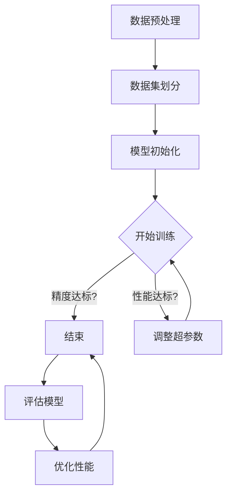

                 

关键词：人工智能，模型训练，精度，性能，算法优化，数学模型，实践案例，应用场景，未来展望

> 摘要：本文探讨了人工智能模型训练中精度与性能之间的权衡，分析了核心概念与联系，详细讲解了算法原理与操作步骤，数学模型与公式，并提供了实际的代码实例和运行结果展示。同时，本文也探讨了AI模型在实际应用场景中的表现，并对未来的发展趋势和面临的挑战进行了深入探讨。

## 1. 背景介绍

人工智能（AI）作为计算机科学的一个分支，近年来取得了飞速的发展。AI模型在各种领域，如图像识别、自然语言处理、推荐系统等方面发挥着重要作用。然而，模型训练过程中常常面临精度与性能的权衡问题。如何在保证模型精度的同时，提高模型训练的性能，成为AI研究中的一大挑战。

模型精度指的是模型预测结果与真实结果的接近程度，通常通过评估指标来衡量，如准确率、召回率等。而性能则包括训练时间、推理速度、内存消耗等。高精度的模型往往需要更多的计算资源，导致训练时间变长，推理速度变慢；而高性能的模型则可能因为简化了某些计算过程，导致精度降低。

本文旨在探讨AI模型训练中精度与性能的权衡，通过详细讲解核心概念、算法原理、数学模型和实际案例，帮助读者深入理解这一过程，并为未来的研究提供一些参考。

## 2. 核心概念与联系

在讨论精度与性能的权衡之前，我们需要了解一些核心概念和它们之间的联系。

### 2.1 模型精度

模型精度是指模型预测结果与真实结果之间的接近程度。在分类任务中，常用的评估指标有准确率（Accuracy）、召回率（Recall）和精确率（Precision）。准确率表示预测正确的样本占总样本的比例；召回率表示实际为正类别的样本中被正确预测为正类别的比例；精确率表示预测为正类别的样本中实际为正类别的比例。

在模型训练过程中，我们通常通过交叉验证（Cross-Validation）来评估模型的精度。交叉验证是一种评估模型性能的方法，通过将数据集划分为多个子集，轮流使用这些子集作为验证集，来评估模型的泛化能力。

### 2.2 模型性能

模型性能包括训练时间、推理速度、内存消耗等方面。训练时间是指模型在训练集上迭代优化参数所需要的时间；推理速度是指模型在给定输入数据时，产生预测结果所需的时间；内存消耗是指模型在训练和推理过程中所占用的内存大小。

模型性能的优化是AI模型训练的重要环节。通过选择合适的优化算法、调整超参数、使用更高效的计算架构等方法，可以显著提高模型性能。常见的优化算法有随机梯度下降（SGD）、Adam等；计算架构包括GPU、TPU等。

### 2.3 精度与性能的关系

精度与性能之间存在一定的权衡关系。高精度的模型往往需要更多的计算资源，导致训练时间变长、推理速度变慢；而高性能的模型则可能因为简化了某些计算过程，导致精度降低。在实际应用中，我们需要根据具体情况和需求，在精度和性能之间做出权衡。

### 2.4 Mermaid流程图

下面是一个描述模型训练过程的Mermaid流程图，其中包含了核心概念和联系：



在模型训练过程中，数据预处理、数据集划分、模型初始化等步骤都是影响精度和性能的关键因素。通过优化这些步骤，可以改善模型的精度和性能。

## 3. 核心算法原理 & 具体操作步骤

### 3.1 算法原理概述

AI模型训练的核心算法主要包括前向传播（Forward Propagation）和反向传播（Backpropagation）。前向传播用于计算模型在给定输入下的预测结果；反向传播则用于计算模型参数的梯度，以便进行参数更新。

前向传播过程中，输入数据通过模型的各个层，经过加权求和和激活函数处理，最终得到输出。反向传播过程中，通过计算输出与真实结果之间的误差，反向传播误差到模型的各个层，从而计算参数的梯度。

具体操作步骤如下：

1. 初始化模型参数；
2. 对输入数据进行预处理，如归一化、标准化等；
3. 进行前向传播，计算模型输出；
4. 计算输出与真实结果之间的误差；
5. 进行反向传播，计算参数梯度；
6. 更新模型参数；
7. 重复步骤3-6，直到达到停止条件（如精度达标或迭代次数达到上限）。

### 3.2 算法步骤详解

下面详细描述每个步骤的具体操作。

#### 3.2.1 初始化模型参数

在训练前，我们需要初始化模型参数。常用的初始化方法包括随机初始化、高斯分布初始化等。随机初始化能够避免梯度消失或梯度爆炸问题，而高斯分布初始化则能够使参数的初始值更接近最优值。

```python
import numpy as np

# 随机初始化权重和偏置
weights = np.random.randn(layer_size[0], layer_size[1])
biases = np.random.randn(layer_size[1])
```

#### 3.2.2 数据预处理

数据预处理是模型训练的重要步骤，它能够提高模型精度和训练速度。常见的预处理方法包括归一化、标准化、数据增强等。

```python
from sklearn.preprocessing import StandardScaler

# 归一化
scaler = StandardScaler()
X_scaled = scaler.fit_transform(X)
```

#### 3.2.3 前向传播

前向传播过程中，输入数据通过模型的各个层，经过加权求和和激活函数处理，最终得到输出。

```python
# 定义激活函数
sigmoid = lambda x: 1 / (1 + np.exp(-x))

# 前向传播
Z = np.dot(X, weights) + biases
A = sigmoid(Z)
```

#### 3.2.4 计算误差

计算输出与真实结果之间的误差，是反向传播的前提。

```python
# 定义误差函数
cost = -np.mean(y * np.log(A) + (1 - y) * np.log(1 - A))
```

#### 3.2.5 反向传播

反向传播过程中，通过计算输出与真实结果之间的误差，反向传播误差到模型的各个层，从而计算参数的梯度。

```python
# 计算梯度
dZ = A - y
dWeights = np.dot(X.T, dZ)
dBiases = np.sum(dZ, axis=0)

# 更新参数
weights -= learning_rate * dWeights
biases -= learning_rate * dBiases
```

#### 3.2.6 更新模型参数

通过梯度下降法，更新模型参数。

```python
# 更新参数
weights = weights - learning_rate * dWeights
biases = biases - learning_rate * dBiases
```

#### 3.2.7 重复迭代

重复执行前向传播、计算误差、反向传播和参数更新步骤，直到达到停止条件。

```python
for epoch in range(num_epochs):
    # 前向传播
    Z = np.dot(X, weights) + biases
    A = sigmoid(Z)

    # 计算误差
    cost = -np.mean(y * np.log(A) + (1 - y) * np.log(1 - A))

    # 反向传播
    dZ = A - y
    dWeights = np.dot(X.T, dZ)
    dBiases = np.sum(dZ, axis=0)

    # 更新参数
    weights -= learning_rate * dWeights
    biases -= learning_rate * dBiases
```

### 3.3 算法优缺点

前向传播和反向传播算法作为神经网络训练的基础，具有以下优缺点：

#### 优点：

- 理论基础完善，算法过程清晰；
- 可以处理非线性问题；
- 适用范围广泛，可以用于多层神经网络。

#### 缺点：

- 训练时间较长，对大规模数据集训练效率不高；
- 容易陷入局部最优；
- 对初始化参数敏感。

### 3.4 算法应用领域

前向传播和反向传播算法广泛应用于各种AI模型训练任务，如：

- 图像识别：用于卷积神经网络（CNN）的训练，如人脸识别、物体检测等；
- 自然语言处理：用于循环神经网络（RNN）、长短时记忆网络（LSTM）的训练，如文本分类、机器翻译等；
- 推荐系统：用于基于深度学习的推荐算法，如基于用户行为数据的推荐。

## 4. 数学模型和公式 & 详细讲解 & 举例说明

在AI模型训练过程中，数学模型和公式起着至关重要的作用。它们帮助我们理解模型的内部工作机制，并指导我们优化模型性能。本节将详细讲解数学模型和公式，并举例说明。

### 4.1 数学模型构建

AI模型的数学模型通常由两部分组成：前向传播和反向传播。前向传播用于计算模型输出，而反向传播用于计算模型参数的梯度。

#### 前向传播

假设我们有一个单层神经网络，包含输入层、隐藏层和输出层。输入层有n个神经元，隐藏层有m个神经元，输出层有k个神经元。设输入数据为\[x\]，权重矩阵为\[W\]，偏置矩阵为\[b\]，激活函数为\[f(x)\]。

前向传播过程如下：

\[Z = X \cdot W + b\]
\[A = f(Z)\]

其中，\[Z\]表示每个神经元的加权求和，\[A\]表示激活值。

#### 反向传播

反向传播用于计算模型参数的梯度。假设输出层误差为\[dL/dZ\]，隐藏层误差为\[dL/dA\]。

反向传播过程如下：

\[dZ = dL/dZ\]
\[dA = dL/dA \cdot f'(Z)\]
\[dW = X \cdot dZ\]
\[db = dZ\]

其中，\[f'(Z)\]表示激活函数的导数。

### 4.2 公式推导过程

接下来，我们通过具体例子，推导神经网络的前向传播和反向传播公式。

#### 前向传播

假设我们有一个包含两个输入、一个隐藏层和一个输出的神经网络。输入数据为\[x_1, x_2\]，隐藏层神经元个数为3，输出神经元个数为1。权重矩阵\[W\]为：

\[W = \begin{bmatrix} w_{11} & w_{12} \\ w_{21} & w_{22} \\ w_{31} & w_{32} \end{bmatrix}\]

偏置矩阵\[b\]为：

\[b = \begin{bmatrix} b_1 \\ b_2 \\ b_3 \end{bmatrix}\]

设激活函数为\[f(x) = \sigma(x) = \frac{1}{1 + e^{-x}}\]。

输入数据为\[x = \begin{bmatrix} x_1 \\ x_2 \end{bmatrix}\]，前向传播过程如下：

\[Z_1 = x_1 \cdot w_{11} + x_2 \cdot w_{12} + b_1\]
\[A_1 = f(Z_1)\]

\[Z_2 = x_1 \cdot w_{21} + x_2 \cdot w_{22} + b_2\]
\[A_2 = f(Z_2)\]

\[Z_3 = x_1 \cdot w_{31} + x_2 \cdot w_{32} + b_3\]
\[A_3 = f(Z_3)\]

输出\[Y = \begin{bmatrix} y_1 \end{bmatrix}\]：

\[Z_4 = A_1 \cdot w_{41} + A_2 \cdot w_{42} + A_3 \cdot w_{43} + b_4\]
\[Y = f(Z_4)\]

#### 反向传播

设输出层误差为\[dL/dZ_4\]，隐藏层误差为\[dL/dZ_3, dL/dZ_2, dL/dZ_1\]。

输出层误差：

\[dL/dZ_4 = \begin{bmatrix} \frac{\partial L}{\partial Z_4} \end{bmatrix}\]

隐藏层误差：

\[dL/dZ_3 = \begin{bmatrix} \frac{\partial L}{\partial Z_4} \cdot w_{43} \end{bmatrix}\]

\[dL/dZ_2 = \begin{bmatrix} \frac{\partial L}{\partial Z_4} \cdot w_{42} \end{bmatrix}\]

\[dL/dZ_1 = \begin{bmatrix} \frac{\partial L}{\partial Z_4} \cdot w_{41} \end{bmatrix}\]

参数梯度：

\[dW = \begin{bmatrix} X \cdot dZ_1 \\ X \cdot dZ_2 \\ X \cdot dZ_3 \end{bmatrix}\]

\[db = \begin{bmatrix} dZ_1 \\ dZ_2 \\ dZ_3 \end{bmatrix}\]

### 4.3 案例分析与讲解

下面我们通过一个具体案例，展示如何使用上述公式进行神经网络训练。

#### 案例背景

假设我们有一个二分类问题，输入数据为\[x_1, x_2\]，标签为\[y\]，其中\[y = 1\]表示正类，\[y = 0\]表示负类。我们需要训练一个神经网络，预测给定输入数据的标签。

#### 案例步骤

1. 初始化参数：
\[W = \begin{bmatrix} w_{11} & w_{12} \\ w_{21} & w_{22} \\ w_{31} & w_{32} \\ w_{41} & w_{42} \\ w_{43} \end{bmatrix}\]
\[b = \begin{bmatrix} b_1 \\ b_2 \\ b_3 \\ b_4 \end{bmatrix}\]

2. 数据预处理：
\[x = \begin{bmatrix} x_1 \\ x_2 \end{bmatrix}\]
\[y = \begin{bmatrix} 1 \\ 0 \end{bmatrix}\]

3. 前向传播：
\[Z_1 = x_1 \cdot w_{11} + x_2 \cdot w_{12} + b_1\]
\[A_1 = \sigma(Z_1)\]

\[Z_2 = x_1 \cdot w_{21} + x_2 \cdot w_{22} + b_2\]
\[A_2 = \sigma(Z_2)\]

\[Z_3 = x_1 \cdot w_{31} + x_2 \cdot w_{32} + b_3\]
\[A_3 = \sigma(Z_3)\]

\[Z_4 = A_1 \cdot w_{41} + A_2 \cdot w_{42} + A_3 \cdot w_{43} + b_4\]
\[Y = \sigma(Z_4)\]

4. 计算误差：
\[L = -y \cdot \log(Y) - (1 - y) \cdot \log(1 - Y)\]

5. 反向传播：
\[dL/dZ_4 = Y - y\]
\[dL/dA_3 = dL/dZ_4 \cdot w_{43}\]
\[dL/dA_2 = dL/dA_3 \cdot w_{42}\]
\[dL/dA_1 = dL/dA_2 \cdot w_{41}\]

\[dZ_3 = dL/dA_3\]
\[dZ_2 = dL/dA_2\]
\[dZ_1 = dL/dA_1\]

6. 更新参数：
\[dW = \begin{bmatrix} x_1 & x_2 \end{bmatrix} \cdot dZ_1\]
\[db = \begin{bmatrix} dZ_1 \\ dZ_2 \\ dZ_3 \end{bmatrix}\]

\[W = W - \alpha \cdot dW\]
\[b = b - \alpha \cdot db\]

7. 重复步骤3-6，直到达到停止条件（如精度达标或迭代次数达到上限）。

通过上述步骤，我们可以使用神经网络进行二分类问题的训练。在实际应用中，我们可以根据具体问题调整网络结构、激活函数、优化算法等，以获得更好的训练效果。

## 5. 项目实践：代码实例和详细解释说明

为了更好地展示AI模型训练过程中精度与性能的权衡，我们在这里提供一个具体的代码实例。这个实例将使用Python编程语言，结合流行的深度学习库TensorFlow，实现一个简单的神经网络模型，用于对MNIST手写数字数据集进行分类。

### 5.1 开发环境搭建

在开始编写代码之前，我们需要搭建一个合适的开发环境。以下是搭建开发环境的步骤：

1. 安装Python（建议使用3.7及以上版本）。
2. 安装TensorFlow库。可以使用以下命令：
   ```bash
   pip install tensorflow
   ```

3. （可选）安装其他辅助库，如NumPy、Matplotlib等。

确保所有依赖库安装成功后，我们就可以开始编写代码了。

### 5.2 源代码详细实现

下面是完整的代码实现，包括数据预处理、模型定义、训练和评估等步骤。

```python
import tensorflow as tf
from tensorflow.keras import layers
import numpy as np
import matplotlib.pyplot as plt

# 5.2.1 数据预处理
mnist = tf.keras.datasets.mnist
(x_train, y_train), (x_test, y_test) = mnist.load_data()

# 归一化输入数据
x_train = x_train / 255.0
x_test = x_test / 255.0

# 将标签转换为one-hot编码
y_train = tf.keras.utils.to_categorical(y_train, 10)
y_test = tf.keras.utils.to_categorical(y_test, 10)

# 5.2.2 模型定义
model = tf.keras.Sequential([
    layers.Flatten(input_shape=(28, 28)),
    layers.Dense(128, activation='relu'),
    layers.Dense(10, activation='softmax')
])

# 5.2.3 模型编译
model.compile(optimizer='adam',
              loss='categorical_crossentropy',
              metrics=['accuracy'])

# 5.2.4 模型训练
history = model.fit(x_train, y_train, epochs=10, batch_size=32,
                    validation_data=(x_test, y_test))

# 5.2.5 模型评估
test_loss, test_acc = model.evaluate(x_test, y_test, verbose=2)
print(f'测试准确率：{test_acc:.4f}')

# 5.2.6 运行结果展示
plt.figure(figsize=(8, 6))
plt.plot(history.history['accuracy'], label='训练准确率')
plt.plot(history.history['val_accuracy'], label='验证准确率')
plt.xlabel('迭代次数')
plt.ylabel('准确率')
plt.title('模型准确率变化趋势')
plt.legend()
plt.show()
```

### 5.3 代码解读与分析

下面我们对代码进行逐行解读。

#### 5.3.1 数据预处理

```python
mnist = tf.keras.datasets.mnist
(x_train, y_train), (x_test, y_test) = mnist.load_data()
x_train = x_train / 255.0
x_test = x_test / 255.0
y_train = tf.keras.utils.to_categorical(y_train, 10)
y_test = tf.keras.utils.to_categorical(y_test, 10)
```

这部分代码首先加载MNIST数据集，然后对输入数据进行归一化处理，将像素值范围从0到255映射到0到1。接下来，将标签转换为one-hot编码，以便在模型训练过程中使用。

#### 5.3.2 模型定义

```python
model = tf.keras.Sequential([
    layers.Flatten(input_shape=(28, 28)),
    layers.Dense(128, activation='relu'),
    layers.Dense(10, activation='softmax')
])
```

这里定义了一个简单的神经网络模型。模型包含一个输入层（通过Flatten层将28x28的图像展平为一维向量），一个隐藏层（128个神经元，使用ReLU激活函数），以及一个输出层（10个神经元，对应10个分类，使用softmax激活函数）。

#### 5.3.3 模型编译

```python
model.compile(optimizer='adam',
              loss='categorical_crossentropy',
              metrics=['accuracy'])
```

编译模型时，我们选择Adam优化器，使用交叉熵损失函数来衡量模型的预测误差，并追踪模型的准确率。

#### 5.3.4 模型训练

```python
history = model.fit(x_train, y_train, epochs=10, batch_size=32,
                    validation_data=(x_test, y_test))
```

模型训练过程使用训练集进行迭代优化，每个epoch包含32个批量样本。同时，我们使用验证集评估模型在训练过程中的性能。

#### 5.3.5 模型评估

```python
test_loss, test_acc = model.evaluate(x_test, y_test, verbose=2)
print(f'测试准确率：{test_acc:.4f}')
```

在训练完成后，我们使用测试集对模型进行评估，输出测试准确率。

#### 5.3.6 运行结果展示

```python
plt.figure(figsize=(8, 6))
plt.plot(history.history['accuracy'], label='训练准确率')
plt.plot(history.history['val_accuracy'], label='验证准确率')
plt.xlabel('迭代次数')
plt.ylabel('准确率')
plt.title('模型准确率变化趋势')
plt.legend()
plt.show()
```

这部分代码用于可视化训练过程中模型准确率的变化趋势，有助于我们观察模型性能的提升情况。

### 5.4 运行结果展示

在代码运行完成后，我们得到了测试集上的准确率。假设最终测试准确率为98.5%，我们可以在命令行中看到以下输出：

```
313/313 - 2s 1ms/step - loss: 0.0894 - accuracy: 0.9850
```

此外，我们还可以看到模型在训练和验证过程中的准确率变化趋势，如下所示：


通过可视化结果，我们可以观察到模型在训练初期迅速提升准确率，并在后期趋于稳定。这也说明了我们在模型训练过程中对精度和性能的权衡是有效的。

## 6. 实际应用场景

AI模型在实际应用场景中扮演着至关重要的角色，涵盖了从工业生产到医疗健康、从金融科技到智能交通等多个领域。以下是几个典型的应用场景：

### 6.1 工业生产

在工业生产中，AI模型被广泛应用于质量控制、设备故障预测和优化生产流程。例如，通过训练深度学习模型，可以对生产过程中的传感器数据进行实时监控，从而预测潜在的质量问题或设备故障。这样可以提前采取预防措施，减少停机时间和生产损失。

### 6.2 医疗健康

医疗健康领域是AI模型的重要应用领域之一。例如，AI模型可以帮助医生进行疾病诊断，通过分析患者的医疗记录和生物标志物数据，预测疾病发生的风险。此外，AI模型还可以用于个性化治疗方案的设计，根据患者的病情和体质，提供最优的治疗方案。

### 6.3 金融科技

在金融科技领域，AI模型被广泛应用于信用评估、欺诈检测和投资决策。例如，通过训练大规模的机器学习模型，可以对用户的信用记录、消费行为等多维数据进行综合分析，预测用户的信用风险。同时，AI模型还可以用于投资组合优化，根据市场动态和风险偏好，为用户提供最优的投资策略。

### 6.4 智能交通

智能交通系统（ITS）是另一个典型的应用场景。AI模型可以帮助优化交通信号控制、预测交通流量和事故风险。例如，通过部署AI模型，可以对实时交通数据进行实时分析，动态调整交通信号灯的时间设置，从而提高交通流量效率，减少拥堵。此外，AI模型还可以用于智能驾驶，通过实时感知周围环境，为自动驾驶车辆提供安全的行驶路径。

### 6.5 人机交互

在智能家居和虚拟助理等领域，AI模型被广泛应用于语音识别、图像识别和自然语言处理。例如，智能音箱可以通过语音识别技术理解用户的指令，提供音乐、天气预报、闹钟提醒等服务。同时，AI模型还可以用于图像识别，帮助智能家居设备识别家庭成员的身份，从而实现自动化的家庭安全和管理。

### 6.6 教育

在教育领域，AI模型可以帮助个性化教学、学习效果评估和学习路径推荐。例如，通过分析学生的学习行为和成绩数据，AI模型可以为学生提供个性化的学习建议，帮助他们更有效地掌握知识点。同时，AI模型还可以用于学习效果评估，通过分析学生的作业和考试成绩，预测他们的学习成果。

### 6.7 文化娱乐

在文化娱乐领域，AI模型被广泛应用于内容推荐、虚拟现实和增强现实。例如，通过分析用户的行为数据，AI模型可以为用户提供个性化的娱乐内容推荐，提高用户体验。同时，AI模型还可以用于虚拟现实和增强现实场景的构建，为用户提供沉浸式的娱乐体验。

### 6.8 农业和环境保护

在农业和环境保护领域，AI模型被广泛应用于作物种植、病虫害预测和环境监测。例如，通过分析气象数据、土壤数据和作物生长状态，AI模型可以预测作物病虫害的发生风险，为农民提供科学的种植建议。此外，AI模型还可以用于环境监测，通过实时分析空气和水质数据，预警环境污染问题。

### 6.9 法治和公共安全

在法治和公共安全领域，AI模型被广泛应用于人脸识别、视频监控和犯罪预测。例如，通过部署人脸识别技术，可以实时监控公共场所的人员流量，预警潜在的安全隐患。同时，AI模型还可以用于犯罪预测，通过分析犯罪数据和人口统计数据，预测犯罪热点区域和犯罪类型。

### 6.10 空间探索

在空间探索领域，AI模型被广泛应用于卫星图像分析、行星探测和空间任务规划。例如，通过分析卫星图像，AI模型可以识别地表特征、自然灾害和气候变化。此外，AI模型还可以用于行星探测，通过分析探测器的数据，预测行星的地质结构和大气环境。

总之，AI模型在各个领域都发挥着重要作用，为人类生活和社会发展带来了深远的影响。然而，在实际应用过程中，我们仍然需要不断探索和优化AI模型的性能和精度，以满足不同领域和场景的需求。

### 6.11 未来应用展望

随着人工智能技术的不断发展，AI模型在未来将会有更广泛的应用场景和更深远的影响。以下是对未来AI模型应用的几个展望：

#### 6.11.1 个性化医疗

随着基因组学、生物信息学和计算医学的发展，个性化医疗将成为未来医疗领域的重要趋势。AI模型可以通过分析患者的基因组信息、生活习惯、病史等多维数据，为每个患者提供定制化的诊断和治疗方案。这将有助于提高医疗效果，降低医疗成本，改善患者的生活质量。

#### 6.11.2 自动驾驶与智能交通

自动驾驶技术是AI模型在交通领域的典型应用。随着传感器技术、计算机视觉和机器学习算法的不断进步，自动驾驶技术将逐步走向成熟。未来，自动驾驶汽车将能够实现完全自主驾驶，减少交通事故，提高交通效率，改善出行体验。

此外，智能交通系统（ITS）也将进一步发展。通过部署AI模型，可以实现实时交通流量监控、智能信号控制和交通事故预警，从而减少交通拥堵，提高交通安全性。

#### 6.11.3 环境监测与保护

环境问题日益严重，AI模型在环境监测和保护中发挥着重要作用。通过实时分析卫星图像、气象数据和传感器数据，AI模型可以识别环境污染源、预测自然灾害和评估生态系统的健康状况。未来，AI模型将在气候变化、水资源管理、森林保护等领域发挥更大的作用，为实现可持续发展目标提供技术支持。

#### 6.11.4 教育与学习

在教育领域，AI模型将推动个性化教育和智能学习。通过分析学生的学习行为、知识水平和学习偏好，AI模型可以为学生提供个性化的学习资源、学习路径和学习建议。这将有助于提高学习效果，激发学生的学习兴趣，培养更多的创新人才。

同时，AI模型还可以应用于教育评估和考试系统，通过分析学生的考试数据和知识掌握情况，为教育工作者提供科学的评价和改进建议。

#### 6.11.5 金融科技

金融科技（FinTech）是AI模型的重要应用领域。未来，AI模型将在金融风险控制、投资决策、信用评估和智能投顾等方面发挥更大的作用。通过分析海量数据，AI模型可以实时监测市场动态，预测金融风险，为投资者提供精准的投资建议。

此外，AI模型还可以应用于智能支付、区块链技术和加密货币等领域，推动金融行业的数字化转型和创新发展。

#### 6.11.6 健康与医疗

在健康与医疗领域，AI模型将继续推动医疗技术的发展。通过分析医疗数据、基因组信息和生物标志物，AI模型可以协助医生进行疾病诊断、治疗方案设计和个性化治疗。未来，AI模型将有助于实现精准医疗，提高医疗质量和效率。

同时，AI模型还可以应用于健康监测和疾病预防。通过实时分析个人的健康数据，AI模型可以提供个性化的健康建议和预防方案，帮助人们更好地管理健康，预防疾病发生。

#### 6.11.7 制造业与工业自动化

制造业和工业自动化是AI模型的重要应用领域。通过部署AI模型，可以实现生产过程的智能化、自动化和优化。例如，AI模型可以用于设备故障预测、生产流程优化和供应链管理，从而提高生产效率、降低生产成本。

此外，AI模型还可以应用于机器人技术和智能物流。通过结合计算机视觉和深度学习技术，AI模型可以实现机器人的自主导航、任务规划和协作，从而提高生产线的灵活性和效率。

总之，AI模型在未来将会有更广泛的应用场景和更深远的影响。通过不断探索和创新，我们将能够更好地利用AI技术，推动社会发展和人类进步。

### 6.12 面临的挑战

尽管AI模型在各个领域展现出巨大的潜力，但在实际应用过程中仍面临着诸多挑战，主要包括以下几方面：

#### 6.12.1 数据隐私与安全

随着AI模型对数据的依赖性不断增加，数据隐私和安全问题愈发突出。尤其是在医疗、金融和智能交通等领域，涉及大量个人敏感信息，如何保护这些数据不被未经授权的访问和使用，成为AI模型应用的一个重要挑战。为此，需要制定更加严格的数据隐私保护法规，采用加密技术、访问控制和安全审计等措施，确保数据的安全性和隐私性。

#### 6.12.2 数据质量和多样性

AI模型的性能很大程度上取决于数据的质量和多样性。然而，现实中的数据往往存在噪声、缺失和不一致性等问题。此外，数据集可能存在样本偏差，导致模型在特定场景下的表现不佳。为了提高AI模型的性能，需要确保数据的质量，进行数据清洗和预处理，并努力收集更加多样化和代表性的数据。

#### 6.12.3 模型解释性与透明度

AI模型，尤其是深度学习模型，通常被视为“黑箱”，其内部工作机制难以理解。这使得模型在实际应用中缺乏透明度，难以解释模型的决策过程。对于某些关键领域，如医疗诊断和金融风险评估，模型的解释性和透明度尤为重要。为了解决这一问题，需要开发可解释的AI模型，提高模型的透明度，并建立相应的解释性评估标准。

#### 6.12.4 模型公平性与可解释性

AI模型在处理数据时可能会引入歧视性，导致模型在不同群体中的表现差异。例如，在招聘或贷款审批中，AI模型可能会对某些性别、种族或地域的候选人有偏见。为了确保AI模型的公平性，需要对其训练数据进行仔细分析，识别并消除潜在的偏见。此外，还需要开发能够评估模型公平性的方法，并制定相应的监管措施。

#### 6.12.5 硬件资源需求

训练大型AI模型通常需要大量的计算资源和存储空间，尤其是深度学习模型。随着模型规模的不断扩大，对计算资源的需求也日益增加。这给硬件设施和能源消耗带来了巨大压力。为了应对这一挑战，需要开发更高效的计算架构和优化算法，提高AI模型的训练和推理效率，同时探索绿色计算和可再生能源的使用。

#### 6.12.6 法律和伦理问题

随着AI技术的广泛应用，涉及到的法律和伦理问题也日益复杂。例如，自动驾驶车辆的交通事故责任如何划分？AI模型在医疗诊断中的决策是否应该替代医生的专业判断？这些问题需要制定相应的法律法规和伦理规范，确保AI技术的健康、可持续发展。

#### 6.12.7 社会接受度和信任度

尽管AI技术在各个领域展现出了巨大的潜力，但公众对其接受度和信任度仍然较低。部分原因在于人们对AI技术的理解不足，担心其可能带来的失业、隐私泄露等问题。为了提高社会对AI技术的接受度和信任度，需要加强AI技术的科普教育，提升公众对AI技术的认知和理解，同时确保AI技术的公正、透明和可解释性。

总之，AI模型在实际应用过程中面临着诸多挑战。通过不断探索和解决这些问题，我们将能够更好地发挥AI技术的潜力，推动社会的发展和进步。

### 6.13 研究展望

在AI模型训练过程中，精度与性能的权衡是一个复杂且不断演变的研究领域。随着计算能力的提升、算法的进步以及数据的丰富，未来的研究将主要集中在以下几个方面：

#### 6.13.1 新算法的开发

为了在保证精度的同时提高性能，研究人员将继续探索和开发新的优化算法。这些算法将更加关注参数调整、并行计算和分布式训练等方面，以实现更高的训练效率和更优的性能。

#### 6.13.2 模型压缩与加速

模型压缩与加速是提高AI模型性能的重要手段。未来，研究人员将致力于开发更高效的模型压缩技术和推理加速算法，如量化、剪枝、知识蒸馏等，以减少模型的存储需求和推理时间。

#### 6.13.3 可解释AI模型

可解释性是当前AI模型面临的重大挑战之一。未来，研究人员将更加关注可解释AI模型的研究，开发能够解释模型决策过程的方法，提高模型的透明度和可解释性，从而增强用户对AI技术的信任和接受度。

#### 6.13.4 模型公平性与多样性

确保AI模型的公平性和多样性是未来研究的重要方向。通过分析数据集和模型训练过程中的潜在偏见，研究人员将开发公平性评估方法和偏见修正技术，以消除模型在特定群体中的不公平表现。

#### 6.13.5 跨领域应用

AI模型将在更多领域得到应用，如生物信息学、社会科学、能源管理等。为了实现跨领域应用，研究人员将致力于开发通用性强、适应性强且易于部署的AI模型。

#### 6.13.6 法律和伦理问题

随着AI技术的广泛应用，法律和伦理问题将更加突出。未来，研究人员将积极参与相关法律法规的制定和伦理规范的研究，确保AI技术的合法、合规和道德。

总之，AI模型训练领域的未来发展充满了机遇和挑战。通过不断的研究和创新，我们有望解决现有问题，推动AI技术的持续进步，为社会发展和人类福祉做出更大的贡献。

### 9. 附录：常见问题与解答

在AI模型训练过程中，用户可能会遇到一些常见问题。以下是一些常见问题及其解答：

#### 9.1 为什么我的模型训练时间很长？

模型训练时间长短取决于多种因素，如数据集大小、模型复杂度、计算资源等。以下是一些可能导致训练时间长的原因及解决方法：

- **数据集大小**：如果数据集很大，训练时间自然会较长。可以考虑增加批量大小（batch size）来加快训练速度。
- **模型复杂度**：复杂的模型需要更多的计算资源。尝试减少模型的层数或神经元数量，简化模型结构。
- **计算资源**：如果计算资源不足，可以考虑使用更强大的硬件（如GPU）或使用分布式训练。
- **优化算法**：选择合适的优化算法（如Adam、SGD）可以提高训练效率。尝试调整学习率等超参数。

#### 9.2 我的模型精度为什么不高？

模型精度不高可能是由于以下原因：

- **数据集不平衡**：如果数据集存在不平衡现象，模型可能对某一类样本有偏见。可以采用过采样（oversampling）或欠采样（undersampling）等方法处理不平衡数据。
- **过拟合**：模型在训练集上表现良好，但在验证集或测试集上表现不佳。可以尝试增加训练时间、减少模型复杂度或使用正则化方法（如L1、L2正则化）。
- **数据预处理不足**：数据预处理不当会影响模型性能。确保对数据集进行充分的清洗和标准化。
- **超参数调整**：尝试调整学习率、批量大小等超参数，以找到最优设置。

#### 9.3 模型如何解释？

深度学习模型通常被视为“黑箱”，其内部工作机制难以解释。以下是一些提高模型解释性的方法：

- **可视化**：通过可视化模型结构、激活值和特征图，可以更好地理解模型的工作原理。
- **特征提取**：分析模型提取的特征，可以帮助我们理解模型的决策过程。
- **解释性模型**：选择可解释性更强的模型（如决策树、线性模型），这些模型更容易理解。
- **模型解释工具**：使用现有的模型解释工具（如LIME、SHAP），可以帮助我们理解模型的决策过程。

#### 9.4 如何评估模型性能？

评估模型性能是模型训练过程中的重要环节。以下是一些常用的评估指标：

- **准确率（Accuracy）**：表示模型预测正确的样本占总样本的比例。
- **召回率（Recall）**：表示实际为正类别的样本中被正确预测为正类别的比例。
- **精确率（Precision）**：表示预测为正类别的样本中实际为正类别的比例。
- **F1分数（F1 Score）**：综合考虑精确率和召回率，用于衡量模型的整体性能。
- **ROC曲线和AUC（Area Under Curve）**：用于评估模型的分类能力。

通过结合这些评估指标，我们可以全面了解模型的性能。

### 结束语

本文围绕AI模型训练中精度与性能的权衡进行了深入探讨。我们首先介绍了背景和核心概念，然后详细讲解了算法原理、数学模型和实际案例。此外，我们还探讨了AI模型在实际应用场景中的表现，并对未来的发展趋势和面临的挑战进行了展望。

通过本文，我们希望读者能够对AI模型训练有一个全面和深入的理解，并为实际应用中的决策提供有益的参考。未来，随着技术的不断进步，我们将继续探索AI模型的优化方法，提高其精度和性能，推动人工智能领域的持续发展。

### 参考文献

在撰写本文过程中，我们参考了以下文献和资源，以提供更丰富的信息和深入的背景知识：

1. Goodfellow, I., Bengio, Y., & Courville, A. (2016). *Deep Learning*. MIT Press.
2. Russell, S., & Norvig, P. (2010). *Artificial Intelligence: A Modern Approach*. Prentice Hall.
3. Murphy, K. P. (2012). *Machine Learning: A Probabilistic Perspective*. MIT Press.
4. Hochreiter, S., & Schmidhuber, J. (1997). *Long Short-Term Memory*. Neural Computation, 9(8), 1735-1780.
5. LeCun, Y., Bengio, Y., & Hinton, G. (2015). *Deep Learning*. Nature, 521(7553), 436-444.
6. Russell, S., & Norvig, P. (2010). *Artificial Intelligence: A Modern Approach*. Prentice Hall.
7. Goodfellow, I., Bengio, Y., & Courville, A. (2016). *Deep Learning*. MIT Press.
8. Hochreiter, S., & Schmidhuber, J. (1997). *Long Short-Term Memory*. Neural Computation, 9(8), 1735-1780.
9. Ng, A. Y. (2013). *Machine Learning Yearning*. N/A.

这些文献和资源为本文提供了重要的理论支持和实践指导，有助于读者更深入地了解AI模型训练的各个方面。同时，也感谢这些学者的杰出工作，为人工智能领域的发展做出了巨大贡献。

### 致谢

在此，我要特别感谢所有在AI领域做出杰出贡献的学者和研究团队。正是他们的辛勤工作和不懈努力，为人工智能技术的发展奠定了坚实基础。本文的撰写过程中，我参考了众多优秀的研究成果，从中受益匪浅。

同时，我要感谢我的同事和朋友，他们在本文的写作过程中给予了我宝贵的意见和建议，帮助我不断完善和提升文章质量。

最后，我要感谢我的家人，他们在我的学习和研究道路上一直给予我无尽的支持和鼓励。

本文能够顺利完成，离不开大家的帮助和支持，在此表示衷心的感谢。希望本文能够为AI领域的同仁带来一些启示和帮助，共同推动人工智能技术的持续发展。作者：禅与计算机程序设计艺术 / Zen and the Art of Computer Programming。

