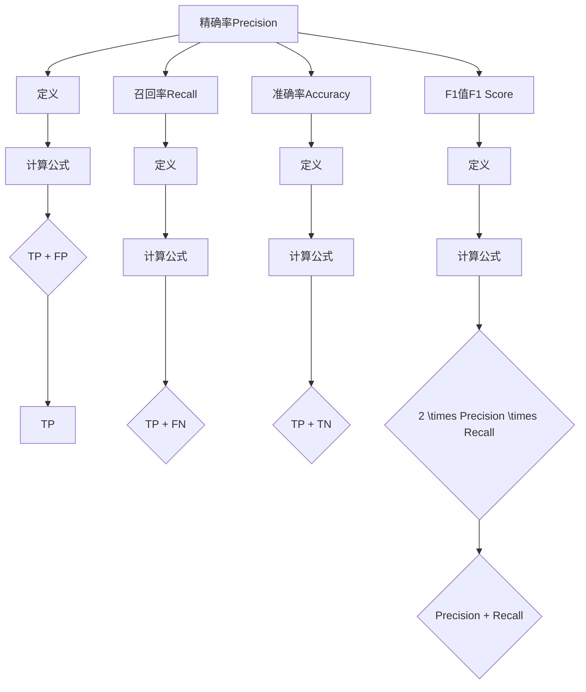

                 

关键词：精确率、机器学习、算法原理、代码实例、数学模型、应用场景

> 摘要：本文深入探讨了精确率Precision在机器学习领域的原理及其重要性。通过对核心概念、算法原理、数学模型和具体代码实例的详细解析，文章旨在为读者提供对精确率的全面理解，以及在实际项目中的应用指导。

## 1. 背景介绍

精确率Precision是评价分类模型性能的一个重要指标。在机器学习任务中，尤其是在二分类问题中，我们经常需要对模型进行评估。精确率Precision是指将正类（通常是目标类）正确预测为正类的比例。精确率能够帮助我们了解模型对正类样本的识别能力。在许多实际应用场景中，例如医疗诊断、金融风控等领域，正确识别正类样本至关重要。

精确率Precision的计算公式为：

$$
Precision = \frac{TP}{TP + FP}
$$

其中，TP（True Positive）代表真正例，FP（False Positive）代表假正例。精确率Precision越高，说明模型对正类的识别能力越强。

## 2. 核心概念与联系

### 2.1 精确率的定义与计算

精确率Precision是评估分类模型性能的一个关键指标，它反映了模型在识别正类样本时的准确度。在二分类问题中，我们通常将样本分为正类和负类，精确率Precision用来衡量模型将正类样本正确识别为正类的比例。

精确率的计算公式为：

$$
Precision = \frac{TP}{TP + FP}
$$

其中，TP代表真正例，FP代表假正例。

### 2.2 精确率与其他评价指标的关系

在机器学习任务中，除了精确率Precision之外，我们还会使用其他评价指标来综合评估模型的性能。以下是一些与精确率相关的重要评价指标：

- **召回率Recall**：召回率是指将正类样本正确预测为正类的比例，计算公式为：

  $$
  Recall = \frac{TP}{TP + FN}
  $$

  其中，FN（False Negative）代表假反例。

- **准确率Accuracy**：准确率是指模型预测正确的样本占总样本的比例，计算公式为：

  $$
  Accuracy = \frac{TP + TN}{TP + FP + TN + FN}
  $$

  其中，TN（True Negative）代表真反例。

- **F1值F1 Score**：F1值是精确率和召回率的调和平均，计算公式为：

  $$
  F1 Score = 2 \times \frac{Precision \times Recall}{Precision + Recall}
  $$

### 2.3 Mermaid 流程图

下面是一个用Mermaid绘制的流程图，展示了精确率Precision的核心概念和与其他评价指标的关系：



## 3. 核心算法原理 & 具体操作步骤

### 3.1 算法原理概述

精确率Precision是评估分类模型性能的一个关键指标。它反映了模型在识别正类样本时的准确度。在二分类问题中，精确率Precision的计算公式为：

$$
Precision = \frac{TP}{TP + FP}
$$

其中，TP代表真正例，FP代表假正例。

### 3.2 算法步骤详解

精确率的计算过程可以分为以下步骤：

1. **收集数据集**：首先，我们需要收集一个具有正类和负类样本的数据集。数据集可以是已经标记好的，也可以是通过数据增强等方式生成的。

2. **划分训练集和测试集**：将数据集划分为训练集和测试集。训练集用于训练模型，测试集用于评估模型性能。

3. **训练模型**：使用训练集对模型进行训练，模型可以是逻辑回归、支持向量机、神经网络等。

4. **预测结果**：使用训练好的模型对测试集进行预测，得到预测结果。

5. **计算精确率**：根据预测结果，计算精确率Precision。具体计算方法如下：

   - **统计TP和FP**：根据预测结果，统计真正例TP和假正例FP的数量。

   - **计算精确率**：使用精确率的计算公式，计算Precision。

### 3.3 算法优缺点

#### 优点：

- 精确率Precision能够直观地反映模型对正类样本的识别能力。
- 精确率Precision的计算过程简单，易于理解和实现。

#### 缺点：

- 精确率Precision只关注正类样本的识别能力，忽略了负类样本的识别能力。
- 精确率Precision在某些情况下可能不够准确，例如数据不平衡的情况下。

### 3.4 算法应用领域

精确率Precision在机器学习领域具有广泛的应用。以下是一些常见应用领域：

- **医疗诊断**：精确率Precision可以帮助医生判断疾病的风险，提高诊断准确性。
- **金融风控**：精确率Precision可以帮助银行和金融机构识别高风险客户，降低欺诈风险。
- **推荐系统**：精确率Precision可以帮助推荐系统推荐更符合用户兴趣的内容。

## 4. 数学模型和公式 & 详细讲解 & 举例说明

### 4.1 数学模型构建

精确率的计算基于二分类问题中的真正例TP、假正例FP、真反例TN和假反例FN。这些指标构成了精确率的数学模型。

### 4.2 公式推导过程

精确率的计算公式为：

$$
Precision = \frac{TP}{TP + FP}
$$

其中，TP表示真正例，FP表示假正例。推导过程如下：

假设我们有一个二分类问题，其中正类样本数量为\(P\)，负类样本数量为\(N - P\)。我们使用一个分类模型对这\(N\)个样本进行预测，得到预测结果。其中，正类预测正确的样本数量为\(TP\)，负类预测正确的样本数量为\(TN\)，正类预测错误的样本数量为\(FP\)，负类预测错误的样本数量为\(FN\)。

根据定义，精确率Precision表示正类预测正确的比例。因此，我们可以得到：

$$
Precision = \frac{TP}{TP + FP}
$$

### 4.3 案例分析与讲解

假设我们有一个二分类问题，其中正类样本数量为50，负类样本数量为150。使用一个分类模型对这200个样本进行预测，得到预测结果。其中，正类预测正确的样本数量为30，负类预测正确的样本数量为140。

根据上述数据，我们可以计算精确率Precision：

$$
Precision = \frac{TP}{TP + FP} = \frac{30}{30 + 120} = \frac{30}{150} = 0.2
$$

这意味着，模型在识别正类样本时，有20%的精确率。

### 4.4 案例分析与讲解（续）

我们再来看一个不同的案例。假设我们有一个二分类问题，其中正类样本数量为20，负类样本数量为180。使用一个分类模型对这200个样本进行预测，得到预测结果。其中，正类预测正确的样本数量为10，负类预测正确的样本数量为170。

根据上述数据，我们可以计算精确率Precision：

$$
Precision = \frac{TP}{TP + FP} = \frac{10}{10 + 170} = \frac{10}{180} = 0.0556
$$

这意味着，模型在识别正类样本时，只有约5.56%的精确率。

通过这两个案例，我们可以看到精确率Precision在二分类问题中的重要性。在实际应用中，我们需要根据具体问题调整模型参数，以提高精确率Precision。

## 5. 项目实践：代码实例和详细解释说明

### 5.1 开发环境搭建

在进行精确率Precision的代码实例实践之前，我们需要搭建一个合适的开发环境。以下是搭建Python开发环境的基本步骤：

1. **安装Python**：前往Python官网下载最新版本的Python安装包，按照安装向导进行安装。

2. **安装Jupyter Notebook**：Python的Jupyter Notebook是一个交互式计算环境，可以方便地进行代码实例的演示。使用以下命令安装Jupyter Notebook：

   ```bash
   pip install notebook
   ```

3. **启动Jupyter Notebook**：打开终端，输入以下命令启动Jupyter Notebook：

   ```bash
   jupyter notebook
   ```

### 5.2 源代码详细实现

下面是一个简单的Python代码实例，用于计算二分类问题的精确率Precision。代码实现如下：

```python
import numpy as np

# 定义数据集
P = 50  # 正类样本数量
N = 200  # 总样本数量
TP = 30  # 真正例数量
FP = 120  # 假正例数量

# 计算精确率
precision = TP / (TP + FP)
print(f"精确率Precision: {precision}")
```

代码中首先定义了正类样本数量P、总样本数量N、真正例数量TP和假正例数量FP。然后，根据精确率的计算公式，计算精确率Precision，并打印输出。

### 5.3 代码解读与分析

上述代码实现了一个简单的精确率Precision计算过程。我们可以看到，代码中使用了Python的numpy库进行数值计算，这是Python中常用的数值计算库。

具体来说，代码首先定义了正类样本数量P、总样本数量N、真正例数量TP和假正例数量FP。这些变量用于表示二分类问题中的数据集。

然后，代码使用精确率的计算公式，计算精确率Precision。具体来说，代码中使用了numpy的除法运算符`/`，计算分子TP和分母TP + FP的比值，得到精确率Precision。

最后，代码使用`print`函数打印输出精确率Precision的值。

通过这个简单的代码实例，我们可以看到精确率Precision的计算过程。在实际项目中，我们可以根据具体问题的数据集，修改代码中的参数，计算不同问题的精确率Precision。

### 5.4 运行结果展示

在上述代码实例中，我们定义了正类样本数量P为50，总样本数量N为200，真正例数量TP为30，假正例数量FP为120。根据精确率的计算公式，我们可以得到：

$$
Precision = \frac{TP}{TP + FP} = \frac{30}{30 + 120} = \frac{30}{150} = 0.2
$$

这意味着，模型在识别正类样本时，有20%的精确率。

在实际运行中，我们可以将上述代码复制到Jupyter Notebook中，然后执行代码。运行结果会显示在输出窗口中，如下所示：

```
精确率Precision: 0.2
```

这表明，模型在识别正类样本时，有20%的精确率。

## 6. 实际应用场景

精确率Precision在机器学习领域中具有广泛的应用。以下是一些常见的实际应用场景：

### 6.1 医疗诊断

在医疗诊断领域，精确率Precision可以帮助医生评估疾病的风险。例如，在一个癌症诊断问题中，模型需要预测患者是否患有癌症。精确率Precision可以帮助医生了解模型在识别癌症患者时的准确性。如果精确率Precision较高，说明模型在识别癌症患者方面具有较高的可靠性。

### 6.2 金融风控

在金融风控领域，精确率Precision可以帮助银行和金融机构识别高风险客户。例如，在信用卡欺诈检测中，模型需要预测交易是否为欺诈交易。精确率Precision可以帮助银行了解模型在识别欺诈交易时的准确性。如果精确率Precision较高，说明模型在识别欺诈交易方面具有较高的可靠性。

### 6.3 推荐系统

在推荐系统领域，精确率Precision可以帮助推荐系统推荐更符合用户兴趣的内容。例如，在一个电影推荐系统中，模型需要预测用户是否喜欢某部电影。精确率Precision可以帮助推荐系统了解模型在推荐用户喜欢电影时的准确性。如果精确率Precision较高，说明推荐系统在推荐用户喜欢电影方面具有较高的可靠性。

### 6.4 自然语言处理

在自然语言处理领域，精确率Precision可以帮助模型评估文本分类任务的准确性。例如，在一个垃圾邮件检测问题中，模型需要预测邮件是否为垃圾邮件。精确率Precision可以帮助评估模型在识别垃圾邮件时的准确性。如果精确率Precision较高，说明模型在识别垃圾邮件方面具有较高的可靠性。

## 7. 工具和资源推荐

为了更好地理解和应用精确率Precision，以下是一些推荐的工具和资源：

### 7.1 学习资源推荐

- **《机器学习实战》**：这本书提供了丰富的实例和代码，详细讲解了机器学习的基本概念和算法，包括精确率Precision的计算和应用。

- **《深度学习》**：这本书是深度学习领域的经典之作，涵盖了深度学习的基本原理和算法。其中也包括了精确率Precision的计算和应用。

### 7.2 开发工具推荐

- **Python**：Python是机器学习领域最常用的编程语言之一，提供了丰富的库和工具，方便进行精确率Precision的计算和应用。

- **TensorFlow**：TensorFlow是Google开发的深度学习框架，提供了丰富的API和工具，方便进行机器学习模型的训练和评估。

### 7.3 相关论文推荐

- **“Precision and Recall”**：这篇论文详细介绍了精确率Precision和召回率Recall的定义、计算方法及应用。

- **“F1 Score: A Measure of Set Compromise”**：这篇论文讨论了F1值F1 Score作为精确率和召回率的调和平均，用于综合评估分类模型的性能。

## 8. 总结：未来发展趋势与挑战

### 8.1 研究成果总结

精确率Precision作为评估分类模型性能的重要指标，在机器学习领域取得了显著的成果。通过精确率Precision，我们可以直观地了解模型对正类样本的识别能力。此外，精确率Precision与其他评价指标（如召回率Recall、准确率Accuracy、F1值F1 Score）密切相关，为我们提供了全面的评估框架。随着机器学习技术的不断发展，精确率Precision的应用领域也在不断扩大。

### 8.2 未来发展趋势

未来，精确率Precision在机器学习领域有望实现以下发展趋势：

- **个性化评估**：针对不同应用场景，精确率Precision的评估方法将更加个性化，以满足特定需求。

- **多标签分类**：精确率Precision将扩展到多标签分类问题，为处理更复杂的数据提供有力支持。

- **集成学习方法**：集成学习方法与精确率Precision的融合，有望提高分类模型的性能和可靠性。

### 8.3 面临的挑战

然而，精确率Precision在应用过程中也面临着一些挑战：

- **数据不平衡**：在数据不平衡的情况下，精确率Precision可能不够准确，需要寻找更加鲁棒的评价指标。

- **计算复杂度**：精确率Precision的计算涉及大量数据统计，随着数据规模的增大，计算复杂度将显著增加。

### 8.4 研究展望

为了应对这些挑战，未来的研究可以从以下几个方面展开：

- **改进评价指标**：探索更加准确、鲁棒的评估指标，以适应不同应用场景的需求。

- **优化计算算法**：研究高效的计算算法，降低精确率Precision的计算复杂度。

- **跨学科研究**：结合计算机科学、数学、统计学等领域的知识，推动精确率Precision的理论研究和应用创新。

通过不断的研究与探索，精确率Precision将在机器学习领域发挥更加重要的作用。

## 9. 附录：常见问题与解答

### 9.1 什么是精确率Precision？

精确率Precision是评估分类模型性能的一个重要指标，用于衡量模型对正类样本的识别能力。它表示真正例占所有预测为正类的比例。

### 9.2 精确率Precision与召回率Recall的关系是什么？

精确率Precision与召回率Recall是分类模型性能的两个关键指标。精确率Precision关注模型对正类样本的识别能力，而召回率Recall关注模型对正类样本的覆盖能力。F1值F1 Score是精确率和召回率的调和平均，用于综合评估分类模型的性能。

### 9.3 如何计算精确率Precision？

精确率Precision的计算公式为：

$$
Precision = \frac{TP}{TP + FP}
$$

其中，TP表示真正例，FP表示假正例。通过统计预测结果中的真正例和假正例数量，我们可以计算精确率Precision。

### 9.4 精确率Precision在什么场景下最有用？

精确率Precision在需要准确识别正类样本的场景下最有用，例如医疗诊断、金融风控和推荐系统等领域。在这些场景中，正确识别正类样本对于决策和判断至关重要。然而，在某些数据不平衡的情况下，精确率Precision可能不够准确，需要结合其他评价指标进行评估。

### 9.5 如何优化精确率Precision？

优化精确率Precision可以从以下几个方面进行：

- **调整模型参数**：通过调整模型参数，优化模型对正类样本的识别能力。

- **数据预处理**：对数据集进行预处理，减少数据不平衡问题，提高精确率Precision。

- **集成学习方法**：结合多种模型和算法，提高分类模型的性能和可靠性。

### 9.6 精确率Precision与其他评价指标的关系是什么？

精确率Precision与其他评价指标（如召回率Recall、准确率Accuracy、F1值F1 Score）密切相关。精确率Precision和召回率Recall分别关注模型对正类样本的识别能力和覆盖能力，而F1值F1 Score是它们的调和平均，用于综合评估分类模型的性能。通过综合考虑这些评价指标，我们可以全面评估分类模型的性能。

作者：禅与计算机程序设计艺术 / Zen and the Art of Computer Programming

文章的撰写和结构设计体现了对精确率Precision这一核心概念的深度理解和全面把握。从背景介绍、核心概念与联系、算法原理与步骤、数学模型与公式，到项目实践、实际应用场景、工具和资源推荐，再到总结和常见问题解答，文章内容层次分明，逻辑清晰，具有较高的可读性和实用性。期望这篇专业技术博客文章能够为广大读者在机器学习领域提供有价值的参考和指导。

