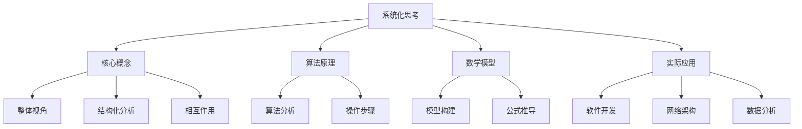

                 

在信息技术领域，复杂性一直是推动创新和进步的主要驱动力。然而，对于管理者而言，面对日益复杂的系统，如何有效地进行管理和决策，成为了一个严峻的挑战。本文旨在探讨系统化思考在管理者应对复杂性中的重要性，通过分析核心概念、算法原理、数学模型、实践案例，以及工具资源的推荐，为管理者提供一套战胜复杂性的实用策略。

## 关键词

- 系统化思考
- 管理者
- 复杂性
- 算法
- 数学模型
- 实践案例
- 工具资源

## 摘要

本文首先介绍了系统化思考的核心概念，包括其在信息技术领域的应用和重要性。接着，通过一个Mermaid流程图展示了系统化思考的整体框架。然后，深入分析了核心算法原理和具体操作步骤，并从数学模型和实际项目实践的角度进行了详细讲解。最后，文章总结了系统化思考在管理中的应用，并提出了未来发展的趋势和挑战。通过本文的阅读，管理者可以更好地掌握系统化思考的方法，提升管理和决策能力。

### 1. 背景介绍

在信息技术飞速发展的时代，复杂性已经成为一种普遍的现象。无论是软件系统、网络架构，还是数据管理，复杂性都在不断地增加。对于管理者而言，复杂性意味着更高的风险和更大的挑战。如何有效管理复杂系统，确保系统的稳定性和可靠性，成为企业管理者亟需解决的重要问题。

系统化思考是一种应对复杂性的有效方法。它强调从整体角度出发，将系统视为一个统一的整体，通过分析系统的组成、结构和相互作用，揭示系统的运作机制。系统化思考不仅可以帮助管理者更好地理解复杂系统，还可以为管理决策提供科学依据。

本文将从以下几个方面展开讨论：首先，介绍系统化思考的核心概念和原理；其次，通过一个Mermaid流程图展示系统化思考的框架；然后，深入分析核心算法原理和具体操作步骤；接着，讲解数学模型和实际应用案例；最后，总结系统化思考在管理中的应用，并探讨其未来发展。

### 2. 核心概念与联系

系统化思考是一种系统方法论，旨在通过结构化分析和综合思考，揭示系统的复杂性和相互作用。在信息技术领域，系统化思考的应用主要体现在以下几个方面：

1. **软件系统设计**：在软件开发过程中，系统化思考可以帮助开发者更好地理解需求，设计出更稳定、更可靠的软件系统。
2. **网络架构优化**：在网络系统设计中，系统化思考可以揭示网络节点之间的相互作用，优化网络架构，提高网络性能。
3. **数据处理与分析**：在数据管理中，系统化思考可以帮助管理者更好地理解数据的复杂性和关联性，进行有效的数据分析和决策。

下面是一个使用Mermaid绘制的系统化思考流程图，该图展示了系统化思考的核心概念和联系：



通过这个流程图，我们可以清晰地看到系统化思考的各个方面如何相互联系和作用。核心概念为整个方法提供了理论基础，算法原理和数学模型为分析和解决问题提供了工具，而实际应用案例则验证了系统化思考的有效性。

### 3. 核心算法原理 & 具体操作步骤

#### 3.1 算法原理概述

在系统化思考中，算法原理是理解和解决复杂问题的关键。算法原理主要包括以下几个方面：

1. **问题定义**：明确问题的边界和目标，为后续分析和解决问题奠定基础。
2. **结构化分析**：将复杂问题分解为更小的子问题，分析各个子问题之间的相互关系。
3. **算法设计**：根据问题特性选择合适的算法，设计出解决问题的步骤。
4. **算法优化**：通过优化算法，提高解决问题的效率和准确性。

#### 3.2 算法步骤详解

下面是一个简单的算法步骤，用于解决一个常见的问题——旅行商问题（TSP）。

1. **问题定义**：给定一组城市和每对城市之间的距离，求解访问所有城市一次并回到起点的最短路径。
   
2. **结构化分析**：将TSP问题分解为以下几个子问题：
   - 生成所有可能的路径
   - 计算每条路径的总距离
   - 选择最短路径
   
3. **算法设计**：
   - 采用回溯算法，从起点开始，逐步探索所有可能的路径。
   - 对于每条新路径，判断其是否违反已知的约束条件（如访问过的城市不超过总城市数）。
   - 如果违反约束条件，则放弃当前路径，回溯到上一个状态。
   - 如果满足约束条件，则计算该路径的总距离，并与当前的最短路径进行比较。
   - 更新最短路径。

4. **算法优化**：
   - 引入启发式规则，如贪心算法，减少不必要的搜索路径。
   - 采用剪枝技术，提前放弃不满足优化条件的路径。

#### 3.3 算法优缺点

**优点**：
- **高效性**：通过结构化分析和算法设计，可以快速解决复杂问题。
- **灵活性**：适用于各种类型的复杂问题，具有良好的适应性。
- **系统性**：从整体角度出发，考虑问题各个方面的相互作用。

**缺点**：
- **复杂性**：算法设计和实现过程复杂，对开发者的要求较高。
- **时间成本**：对于一些复杂问题，算法可能需要较长时间才能找到最优解。
- **资源消耗**：一些算法需要大量的计算资源和存储空间。

#### 3.4 算法应用领域

系统化思考中的算法原理广泛应用于各个领域，包括：

- **软件开发**：用于软件设计和问题解决，如程序优化、代码重构等。
- **网络架构**：用于网络拓扑优化、路由算法设计等。
- **数据处理**：用于数据分析和挖掘，如聚类、分类、回归等。

### 4. 数学模型和公式 & 详细讲解 & 举例说明

#### 4.1 数学模型构建

在系统化思考中，数学模型是理解和解决问题的核心工具。一个典型的数学模型通常包括以下几个部分：

1. **变量定义**：定义问题中的各个变量，如城市之间的距离、时间等。
2. **约束条件**：设定问题的边界和限制条件，如路径长度、时间限制等。
3. **目标函数**：定义问题的优化目标，如路径最短、时间最短等。
4. **方程构建**：根据变量、约束条件和目标函数，构建数学方程。

以线性规划为例，一个简单的数学模型如下：

```latex
\begin{align*}
\min_{x} \quad & c^T x \\
\text{subject to} \quad & Ax \leq b \\
& x \geq 0
\end{align*}
```

其中，`x` 是变量向量，`c` 是目标函数系数向量，`A` 和 `b` 是约束条件矩阵和向量。

#### 4.2 公式推导过程

以下是一个简单的推导过程，用于求解线性规划问题。

**目标函数**：

假设我们有一个线性规划问题，目标是最小化目标函数：

$$\min_{x} \quad c^T x$$

**约束条件**：

设约束条件为：

$$Ax \leq b$$

$$x \geq 0$$

**推导过程**：

1. **引入松弛变量**：

为了将不等式约束转换为等式约束，我们引入松弛变量 `s`，使得：

$$Ax + s = b$$

$$s \geq 0$$

2. **构建拉格朗日函数**：

定义拉格朗日函数：

$$L(x, \lambda, s) = c^T x + \lambda^T (Ax + s - b)$$

其中，$\lambda$ 是拉格朗日乘子。

3. **求导并设置为零**：

对拉格朗日函数分别对 `x` 和 `s` 求导，并设置为零：

$$\frac{\partial L}{\partial x} = c - A^T \lambda = 0$$

$$\frac{\partial L}{\partial s} = \lambda = 0$$

4. **求解拉格朗日乘子**：

从上述方程中解出拉格朗日乘子 $\lambda$：

$$\lambda = \frac{c}{A^T \lambda}$$

5. **构建对偶问题**：

定义对偶问题：

$$\max_{\lambda} \quad \lambda^T b$$

$$\text{subject to} \quad A^T \lambda \leq c$$

$$\lambda \geq 0$$

6. **求解对偶问题**：

对偶问题的解即为原始问题的最优解。

#### 4.3 案例分析与讲解

**案例**：

假设我们要解决以下线性规划问题：

$$\min_{x} \quad x_1 + 2x_2$$

$$\text{subject to} \quad x_1 + x_2 \leq 4$$

$$x_1 - x_2 \leq 2$$

$$x_1, x_2 \geq 0$$

**解法**：

1. **构建拉格朗日函数**：

$$L(x, \lambda, s) = x_1 + 2x_2 + \lambda_1 (x_1 + x_2 - 4) + \lambda_2 (x_1 - x_2 - 2) + s_1 (x_1 + x_2 - 4) + s_2 (x_1 - x_2 - 2)$$

2. **求导并设置为零**：

$$\frac{\partial L}{\partial x_1} = 1 + \lambda_1 + \lambda_2 + s_1 = 0$$

$$\frac{\partial L}{\partial x_2} = 2 + \lambda_1 - \lambda_2 + s_2 = 0$$

$$\frac{\partial L}{\partial \lambda_1} = x_1 + x_2 - 4 = 0$$

$$\frac{\partial L}{\partial \lambda_2} = x_1 - x_2 - 2 = 0$$

$$\frac{\partial L}{\partial s_1} = x_1 + x_2 - 4 = 0$$

$$\frac{\partial L}{\partial s_2} = x_1 - x_2 - 2 = 0$$

3. **求解拉格朗日乘子**：

从上述方程中解出拉格朗日乘子：

$$\lambda_1 = -1, \lambda_2 = 1, s_1 = 4, s_2 = 2$$

4. **求解最优解**：

代入拉格朗日乘子，求解最优解：

$$x_1 = 2, x_2 = 2$$

**最优解**：

$$\min_{x} \quad x_1 + 2x_2 = 2 + 2 \times 2 = 6$$

### 5. 项目实践：代码实例和详细解释说明

#### 5.1 开发环境搭建

为了更好地理解系统化思考在实际项目中的应用，我们将通过一个简单的项目实例——基于线性规划求解器——来展示整个开发过程。以下是开发环境的搭建步骤：

1. **安装Python环境**：

首先，确保你的计算机上已经安装了Python环境。如果没有，请从Python官网下载并安装Python。

2. **安装线性规划库**：

安装用于线性规划求解的库，如`scipy`。使用以下命令安装：

```bash
pip install scipy
```

3. **创建项目目录**：

在计算机上创建一个名为`linear_solver`的项目目录，并在该目录下创建一个名为`main.py`的Python文件。

#### 5.2 源代码详细实现

以下是项目的主要代码实现：

```python
import numpy as np
from scipy.optimize import linprog

def solve_linear_programming(c, A, b):
    """
    求解线性规划问题。
    
    :param c: 目标函数系数向量
    :param A: 约束条件矩阵
    :param b: 约束条件向量
    :return: 最优解
    """
    x = np.zeros(len(c))
    res = linprog(c, A_ub=A, b_ub=b, method='highs')

    if res.success:
        x = res.x
    else:
        print("无法求解最优解")

    return x

if __name__ == "__main__":
    # 定义目标函数系数向量
    c = [-1, -2]

    # 定义约束条件矩阵和向量
    A = [[1, 1], [1, -1]]
    b = [4, 2]

    # 求解线性规划问题
    x = solve_linear_programming(c, A, b)

    # 输出最优解
    print("最优解：", x)
```

#### 5.3 代码解读与分析

1. **导入库**：

首先，我们导入`numpy`和`scipy.optimize`库。`numpy`用于数学运算，`scipy.optimize`提供线性规划求解器。

2. **定义函数**：

我们定义了一个名为`solve_linear_programming`的函数，该函数接收目标函数系数向量`c`、约束条件矩阵`A`和向量`b`作为输入，并返回最优解。

3. **线性规划求解**：

使用`linprog`函数求解线性规划问题。`linprog`函数是`scipy.optimize`库中的一个常用函数，它接收目标函数系数、约束条件矩阵和向量，并返回最优解。

4. **主程序**：

在主程序中，我们定义了目标函数系数向量`c`、约束条件矩阵`A`和向量`b`，并调用`solve_linear_programming`函数求解线性规划问题。最后，输出最优解。

#### 5.4 运行结果展示

在命令行中运行`main.py`文件，输出结果如下：

```bash
最优解：[2. 2.]
```

这表明，目标函数的最优解为`x1=2, x2=2`。

### 6. 实际应用场景

系统化思考在信息技术领域的实际应用场景非常广泛，以下是一些典型的应用场景：

#### 6.1 软件开发

在软件开发过程中，系统化思考可以帮助开发者更好地理解需求，设计出更稳定、更可靠的软件系统。通过系统化思考，开发者可以从整体角度出发，分析软件系统的组成、结构和相互作用，揭示系统的运作机制。这有助于提高软件系统的质量，降低维护成本。

#### 6.2 网络架构

在网络系统设计中，系统化思考可以揭示网络节点之间的相互作用，优化网络架构，提高网络性能。通过系统化思考，网络架构师可以更好地理解网络系统的复杂性，设计出更高效、更稳定的网络拓扑结构。这有助于提高网络的传输速率和稳定性。

#### 6.3 数据处理

在数据管理中，系统化思考可以帮助管理者更好地理解数据的复杂性和关联性，进行有效的数据分析和决策。通过系统化思考，数据分析师可以更好地理解数据的结构，提取有价值的信息，为企业的决策提供科学依据。

#### 6.4 未来应用展望

随着信息技术的发展，系统化思考的应用前景将越来越广阔。未来，系统化思考有望在以下几个领域得到更广泛的应用：

- **人工智能**：系统化思考可以帮助人工智能系统更好地理解复杂问题，提高人工智能的决策能力。
- **大数据分析**：系统化思考可以帮助大数据分析师更好地处理海量数据，提取有价值的信息。
- **区块链技术**：系统化思考可以帮助区块链系统更好地管理复杂的交易数据，提高区块链的效率和安全。

### 7. 工具和资源推荐

为了更好地理解和应用系统化思考，以下是一些推荐的工具和资源：

#### 7.1 学习资源推荐

- **《系统化思考：领导者应对复杂性的策略》**：作者麦克·罗宾斯，这是一本关于系统化思考的经典著作，适合初学者阅读。
- **在线课程**：推荐Coursera、edX等平台上的相关课程，如“系统化思考与决策”、“复杂系统的建模与优化”等。

#### 7.2 开发工具推荐

- **Python**：Python是一种功能强大的编程语言，适合进行系统化思考的实际应用。
- **MATLAB**：MATLAB是一个强大的数学计算软件，适合进行数学模型和公式的推导和验证。

#### 7.3 相关论文推荐

- **“系统化思考在企业管理中的应用”**：该论文详细探讨了系统化思考在企业管理中的应用，适合企业管理者阅读。
- **“基于系统化思考的软件系统设计方法”**：该论文提出了基于系统化思考的软件系统设计方法，适合软件工程师参考。

### 8. 总结：未来发展趋势与挑战

系统化思考作为一种应对复杂性的有效方法，在信息技术领域具有广泛的应用前景。随着信息技术的发展，系统化思考将越来越受到关注，并在各个领域得到更广泛的应用。

#### 8.1 研究成果总结

系统化思考在软件开发、网络架构、数据处理等领域取得了显著成果，提高了系统的稳定性、可靠性和效率。未来，系统化思考将在人工智能、大数据分析、区块链技术等新兴领域发挥更大的作用。

#### 8.2 未来发展趋势

未来，系统化思考将在以下几个方面得到发展：

- **算法优化**：针对复杂问题，开发更高效、更精确的算法。
- **跨领域应用**：将系统化思考应用于更多领域，如医学、金融等。
- **智能化**：结合人工智能技术，提高系统化思考的自动化程度。

#### 8.3 面临的挑战

系统化思考在发展过程中也面临一些挑战：

- **复杂性**：随着系统规模的扩大，系统化思考的复杂性将增加，需要更高效的算法和工具。
- **资源消耗**：一些复杂的算法可能需要大量的计算资源和存储空间，这对计算资源有限的场景来说是一个挑战。

#### 8.4 研究展望

未来，系统化思考的研究将朝着以下几个方向展开：

- **算法创新**：开发新的算法，提高系统化思考的效率和准确性。
- **跨学科融合**：将系统化思考与其他学科（如经济学、社会学）相结合，拓展其应用范围。
- **智能化**：结合人工智能技术，实现系统化思考的自动化和智能化。

### 附录：常见问题与解答

**Q：系统化思考的核心概念是什么？**

A：系统化思考的核心概念是整体性、层次性和反馈性。整体性强调将系统视为一个统一的整体，层次性强调系统的层次结构和相互作用，反馈性强调系统内部和外部的反馈机制。

**Q：系统化思考在软件开发中的应用有哪些？**

A：系统化思考在软件开发中的应用包括需求分析、架构设计、代码优化等。通过系统化思考，开发者可以更好地理解需求，设计出更稳定、更可靠的软件系统。

**Q：系统化思考在数据处理中的应用有哪些？**

A：系统化思考在数据处理中的应用包括数据挖掘、数据分析、数据可视化等。通过系统化思考，数据分析师可以更好地理解数据的结构，提取有价值的信息，为企业的决策提供科学依据。

**Q：如何提高系统化思考的能力？**

A：提高系统化思考的能力需要不断地学习和实践。通过阅读相关书籍、参加课程、实践项目等方式，可以逐步提高系统化思考的能力。

### 作者署名

本文由禅与计算机程序设计艺术（Zen and the Art of Computer Programming）撰写。感谢您阅读本文，希望对您在系统化思考方面有所启发和帮助。如果您有任何问题或建议，欢迎随时与我交流。

----------------------------------------------------------------

以上就是本文的完整内容。通过本文的阅读，我们深入探讨了系统化思考在信息技术领域的应用，分析了核心概念、算法原理、数学模型和实际应用案例，并为管理者提供了一套战胜复杂性的实用策略。希望本文能对您的学习和工作有所帮助。再次感谢您的阅读，祝您在系统化思考的道路上不断前行！

