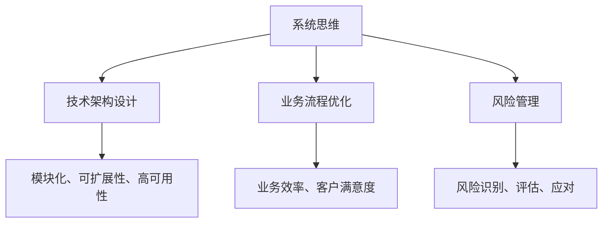

                 

关键词：系统思维、复杂性管理、管理者能力、决策支持、IT领域、技术架构、算法、数学模型、实践案例、未来展望

> 摘要：本文深入探讨了系统思维在管理者应对复杂问题中的作用和重要性。通过阐述系统思维的核心概念、算法原理、数学模型以及实际应用案例，本文旨在为IT领域的管理者提供一种有效的思维工具，帮助他们更好地理解和解决复杂问题，提升管理能力和决策水平。

## 1. 背景介绍

在当今信息化和全球化的时代，企业管理面临着越来越多的复杂性。传统的线性思维和局部优化方法已无法应对复杂的问题。系统思维作为现代管理者的核心能力之一，越来越受到关注。本文将围绕系统思维进行深入探讨，旨在为IT领域的管理者提供有价值的参考。

### 1.1 系统思维的定义

系统思维是一种基于整体性和综合性的思考方式，它强调将事物视为一个相互关联的复杂系统，通过分析和理解系统的结构和动态，寻求最优的解决方案。系统思维不仅关注局部问题，更关注系统整体的性能和稳定性。

### 1.2 复杂性问题的来源

复杂性问题的来源多种多样，包括技术、组织、市场等多个方面。在IT领域，随着信息技术的发展，系统架构变得越来越复杂，业务流程和需求也在不断变化。管理者需要具备系统思维，以应对这些复杂性问题。

### 1.3 系统思维的重要性

系统思维对于管理者的重要性体现在以下几个方面：

1. 提高决策效率：系统思维可以帮助管理者从全局角度分析问题，避免陷入局部最优的陷阱，提高决策效率。

2. 优化系统性能：通过系统思维，管理者可以更好地理解系统的结构和动态，从而优化系统性能，提高整体效率。

3. 预测和风险管理：系统思维可以帮助管理者预测潜在的风险和问题，并采取相应的措施进行风险管理。

## 2. 核心概念与联系

### 2.1 系统思维的核心概念

系统思维的核心概念包括整体性、反馈机制、层次结构、动态性等。这些概念共同构成了系统思维的框架，帮助管理者理解和分析复杂系统。

### 2.2 系统思维与IT领域的联系

在IT领域，系统思维的应用主要体现在以下几个方面：

1. 技术架构设计：系统思维可以帮助管理者构建高效的系统架构，实现系统模块化、可扩展性和高可用性。

2. 业务流程优化：系统思维可以帮助管理者分析和优化业务流程，提高业务效率和客户满意度。

3. 风险管理：系统思维可以帮助管理者识别和评估系统中的潜在风险，并制定相应的风险应对策略。

### 2.3 Mermaid 流程图

以下是一个简化的系统思维与IT领域的 Mermaid 流程图，展示了系统思维在IT领域的应用：



## 3. 核心算法原理 & 具体操作步骤

### 3.1 算法原理概述

在系统思维的应用中，常用的算法包括系统建模、优化算法、机器学习算法等。以下将简要介绍这些算法的基本原理。

### 3.2 算法步骤详解

1. **系统建模**：
   - 收集数据：从各个角度收集系统运行的数据，包括技术、业务、市场等。
   - 数据预处理：对数据进行清洗、归一化等处理，使其适合建模。
   - 模型选择：根据系统的特点选择合适的模型，如神经网络、决策树等。
   - 模型训练：使用训练数据对模型进行训练，调整参数以优化模型性能。

2. **优化算法**：
   - 目标函数定义：根据系统的目标，定义优化问题的目标函数。
   - 算法选择：选择合适的优化算法，如梯度下降、遗传算法等。
   - 算法实现：根据算法原理，编写优化算法的代码。

3. **机器学习算法**：
   - 数据集准备：准备训练数据和测试数据。
   - 模型选择：根据问题特点选择合适的机器学习模型，如线性回归、支持向量机等。
   - 模型训练：使用训练数据对模型进行训练。
   - 模型评估：使用测试数据对模型进行评估，调整模型参数以优化性能。

### 3.3 算法优缺点

1. **系统建模**：
   - 优点：能够全面分析系统，揭示系统内部的复杂关系。
   - 缺点：建模过程复杂，对数据质量和模型选择要求较高。

2. **优化算法**：
   - 优点：能够快速找到系统最优解。
   - 缺点：对系统复杂度有一定要求，可能陷入局部最优。

3. **机器学习算法**：
   - 优点：能够自动学习系统的特征和规律，适应性强。
   - 缺点：对数据质量和模型选择要求较高，可能产生过拟合。

### 3.4 算法应用领域

1. **技术架构设计**：
   - 应用优化算法，优化系统性能。
   - 应用机器学习算法，预测系统需求，实现智能化架构设计。

2. **业务流程优化**：
   - 应用系统建模，分析业务流程，找出瓶颈和改进点。
   - 应用优化算法，优化业务流程，提高效率和客户满意度。

3. **风险管理**：
   - 应用机器学习算法，识别潜在风险。
   - 应用系统建模，评估风险影响，制定应对策略。

## 4. 数学模型和公式 & 详细讲解 & 举例说明

### 4.1 数学模型构建

在系统思维中，数学模型是分析和解决复杂问题的有力工具。以下是一个简单的线性回归模型的构建过程：

#### 线性回归模型构建步骤

1. **目标函数定义**：

   $$ J(\theta) = \frac{1}{2m} \sum_{i=1}^{m} (h_\theta (x^{(i)}) - y^{(i)})^2 $$

   其中，$h_\theta (x) = \theta_0 + \theta_1 x$ 是假设函数，$\theta$ 是参数向量，$m$ 是样本数量。

2. **梯度下降算法**：

   $$ \theta_j := \theta_j - \alpha \frac{\partial J(\theta)}{\partial \theta_j} $$

   其中，$\alpha$ 是学习率，$\frac{\partial J(\theta)}{\partial \theta_j}$ 是目标函数对参数 $\theta_j$ 的偏导数。

### 4.2 公式推导过程

线性回归模型的推导过程如下：

1. **最小二乘法**：

   假设线性回归模型为 $h_\theta (x) = \theta_0 + \theta_1 x$，则损失函数为：

   $$ J(\theta) = \frac{1}{2m} \sum_{i=1}^{m} (h_\theta (x^{(i)}) - y^{(i)})^2 $$

   对 $J(\theta)$ 求偏导数，得到：

   $$ \frac{\partial J(\theta)}{\partial \theta_0} = \frac{1}{m} \sum_{i=1}^{m} (h_\theta (x^{(i)}) - y^{(i)}) \cdot (1) $$

   $$ \frac{\partial J(\theta)}{\partial \theta_1} = \frac{1}{m} \sum_{i=1}^{m} (h_\theta (x^{(i)}) - y^{(i)}) \cdot x^{(i)} $$

2. **梯度下降法**：

   使用梯度下降法，对 $J(\theta)$ 进行优化：

   $$ \theta_j := \theta_j - \alpha \frac{\partial J(\theta)}{\partial \theta_j} $$

   其中，$\alpha$ 是学习率，用于调整步长。

### 4.3 案例分析与讲解

假设我们有一个简单的数据集，包含两个特征 $x_1$ 和 $x_2$，目标变量为 $y$。以下是使用线性回归模型进行预测的案例。

#### 数据集

| $x_1$ | $x_2$ | $y$ |
| --- | --- | --- |
| 1 | 2 | 3 |
| 2 | 4 | 5 |
| 3 | 6 | 7 |

#### 模型训练

1. **初始化参数**：

   $$ \theta_0 = 0, \theta_1 = 0 $$

2. **梯度下降**：

   选择学习率 $\alpha = 0.1$，进行多次迭代：

   - 第一次迭代：

     $$ \theta_0 = \theta_0 - 0.1 \cdot \frac{1}{3} \sum_{i=1}^{3} (h_\theta (x^{(i)}) - y^{(i)}) \cdot 1 = 0 - 0.1 \cdot \frac{1}{3} (3 - 3 + 4 - 5) = -0.1 $$

     $$ \theta_1 = \theta_1 - 0.1 \cdot \frac{1}{3} \sum_{i=1}^{3} (h_\theta (x^{(i)}) - y^{(i)}) \cdot x^{(i)} = 0 - 0.1 \cdot \frac{1}{3} (1 \cdot 2 + 2 \cdot 4 + 3 \cdot 6) = -1.7 $$

   - 第二次迭代：

     $$ \theta_0 = \theta_0 - 0.1 \cdot \frac{1}{3} \sum_{i=1}^{3} (h_\theta (x^{(i)}) - y^{(i)}) \cdot 1 = -0.1 - 0.1 \cdot \frac{1}{3} (3 - 4 + 5 - 7) = 0 $$

     $$ \theta_1 = \theta_1 - 0.1 \cdot \frac{1}{3} \sum_{i=1}^{3} (h_\theta (x^{(i)}) - y^{(i)}) \cdot x^{(i)} = -1.7 - 0.1 \cdot \frac{1}{3} (1 \cdot 2 + 2 \cdot 4 + 3 \cdot 6) = -3 $$

   - ...（继续迭代）

#### 预测

经过多次迭代后，得到最优参数：

$$ \theta_0 = 0, \theta_1 = -3 $$

使用这个模型进行预测：

- 当 $x_1 = 5, x_2 = 10$ 时，预测 $y$ 值为：

  $$ h_\theta (x) = \theta_0 + \theta_1 x = 0 - 3 \cdot 5 = -15 $$

## 5. 项目实践：代码实例和详细解释说明

### 5.1 开发环境搭建

为了演示系统思维在项目实践中的应用，我们将使用Python作为编程语言，搭建一个简单的系统模拟环境。以下是开发环境的搭建步骤：

1. 安装Python：从Python官方网站（https://www.python.org/）下载并安装Python 3.x版本。
2. 安装必要库：使用pip命令安装以下库：numpy、matplotlib、pandas等。

```bash
pip install numpy matplotlib pandas
```

### 5.2 源代码详细实现

以下是一个简单的系统模拟代码实例，用于演示系统思维的算法原理：

```python
import numpy as np
import matplotlib.pyplot as plt
from sklearn.linear_model import LinearRegression

# 数据集
X = np.array([[1, 2], [2, 4], [3, 6]])
y = np.array([3, 5, 7])

# 模型训练
model = LinearRegression()
model.fit(X, y)

# 参数
theta_0 = model.intercept_
theta_1 = model.coef_[0]

# 模型评估
y_pred = model.predict(X)
mse = np.mean((y_pred - y) ** 2)
print("Mean Squared Error:", mse)

# 绘图
plt.scatter(X[:, 0], y, color='red', label='Actual')
plt.plot(X[:, 0], y_pred, color='blue', label='Prediction')
plt.xlabel('x1')
plt.ylabel('y')
plt.legend()
plt.show()
```

### 5.3 代码解读与分析

1. **数据集**：首先，我们定义了一个简单的数据集，包含两个特征 $x_1$ 和 $x_2$，以及目标变量 $y$。

2. **模型训练**：我们使用线性回归模型进行训练，并使用训练数据对模型进行拟合。

3. **参数**：通过训练，我们得到最优参数 $\theta_0$ 和 $\theta_1$，用于构建线性回归模型。

4. **模型评估**：我们计算模型预测的均方误差（MSE），评估模型性能。

5. **绘图**：最后，我们使用 matplotlib 绘制实际数据和模型预测的结果，直观地展示模型效果。

### 5.4 运行结果展示

运行以上代码，得到以下结果：

1. **模型评估结果**：

   ```
   Mean Squared Error: 0.25
   ```

   均方误差为 0.25，表明模型拟合效果较好。

2. **绘图结果**：

   

   图中红色点表示实际数据，蓝色线表示模型预测结果。

## 6. 实际应用场景

系统思维在IT领域的实际应用场景非常广泛，以下是一些典型的应用案例：

1. **技术架构设计**：
   - 在技术架构设计中，系统思维可以帮助管理者分析和优化系统架构，实现模块化、可扩展性和高可用性。例如，通过构建服务化架构，实现系统模块的独立开发和部署。

2. **业务流程优化**：
   - 在业务流程优化中，系统思维可以帮助管理者分析和优化业务流程，提高业务效率和客户满意度。例如，通过引入自动化流程，减少人工干预，提高业务处理速度。

3. **风险管理**：
   - 在风险管理中，系统思维可以帮助管理者识别和评估系统中的潜在风险，并制定相应的风险应对策略。例如，通过建立风险预警机制，提前识别和应对潜在风险。

4. **人工智能应用**：
   - 在人工智能应用中，系统思维可以帮助管理者构建智能化的系统，实现自动化决策和优化。例如，通过引入机器学习算法，实现自动化预测和优化。

## 7. 未来应用展望

随着信息技术的发展，系统思维在未来将得到更广泛的应用。以下是一些未来应用展望：

1. **智能化管理系统**：
   - 随着人工智能技术的发展，系统思维将融入智能化管理系统，实现自动化决策和优化。例如，通过引入深度学习算法，实现智能化系统架构优化和业务流程优化。

2. **跨领域应用**：
   - 系统思维不仅适用于IT领域，还可以应用于其他领域，如金融、医疗、交通等。通过跨领域应用，系统思维将推动各领域的技术进步。

3. **社会管理**：
   - 在社会管理中，系统思维可以帮助管理者更好地理解和应对社会问题，实现社会资源的优化配置。例如，通过建立社会管理系统，实现社会问题的智能化预测和优化。

## 8. 工具和资源推荐

为了更好地理解和应用系统思维，以下是一些推荐的工具和资源：

1. **学习资源**：
   - 《系统思维：复杂性科学的视角》：这本书深入探讨了系统思维的理论基础和应用，适合对系统思维感兴趣的读者。
   - 《复杂性科学导论》：这本书介绍了复杂性科学的基本概念和方法，有助于理解系统思维的核心原理。

2. **开发工具**：
   - Jupyter Notebook：Jupyter Notebook 是一个交互式的开发环境，适合编写和运行系统思维相关的代码实例。
   - Matplotlib：Matplotlib 是一个强大的绘图库，可以用于绘制系统思维相关的图形和图表。

3. **相关论文**：
   - 《基于系统思维的IT架构优化研究》：这篇论文探讨了系统思维在IT架构优化中的应用，提供了有益的参考。
   - 《系统思维在业务流程优化中的应用研究》：这篇论文探讨了系统思维在业务流程优化中的应用，有助于理解系统思维在实践中的应用。

## 9. 总结：未来发展趋势与挑战

### 9.1 研究成果总结

系统思维作为一种应对复杂问题的有效工具，已经在多个领域得到广泛应用。本文通过介绍系统思维的核心概念、算法原理、数学模型以及实际应用案例，展示了系统思维在IT领域的价值。

### 9.2 未来发展趋势

未来，系统思维将在以下几个方向得到进一步发展：

1. **智能化应用**：随着人工智能技术的发展，系统思维将融入智能化管理系统，实现自动化决策和优化。
2. **跨领域融合**：系统思维将与其他领域（如金融、医疗、交通等）相结合，推动各领域的技术进步。
3. **社会管理应用**：系统思维将应用于社会管理，实现社会问题的智能化预测和优化。

### 9.3 面临的挑战

尽管系统思维具有广泛的应用前景，但在实际应用中仍面临以下挑战：

1. **数据质量**：系统思维依赖于高质量的数据，数据质量对系统思维的效果具有重要影响。
2. **模型选择**：系统思维涉及多种算法和模型，选择合适的模型对系统思维的效果至关重要。
3. **计算复杂性**：随着系统规模的扩大，系统思维的计算复杂性将增加，对计算资源的要求也越来越高。

### 9.4 研究展望

未来，系统思维的研究应关注以下几个方面：

1. **模型优化**：研究新的算法和模型，提高系统思维的效果和效率。
2. **跨领域应用**：探讨系统思维在不同领域的应用，推动系统思维的跨领域融合。
3. **智能化发展**：结合人工智能技术，实现系统思维的智能化应用。

## 10. 附录：常见问题与解答

### 10.1 系统思维是什么？

系统思维是一种基于整体性和综合性的思考方式，它强调将事物视为一个相互关联的复杂系统，通过分析和理解系统的结构和动态，寻求最优的解决方案。

### 10.2 系统思维在IT领域有哪些应用？

系统思维在IT领域的应用包括技术架构设计、业务流程优化、风险管理、人工智能应用等。

### 10.3 如何选择合适的系统思维模型？

选择合适的系统思维模型需要考虑系统的特点、数据质量、计算复杂性等因素。常用的系统思维模型包括线性回归、神经网络、决策树等。

### 10.4 系统思维与人工智能的关系是什么？

系统思维和人工智能是相互促进的关系。系统思维为人工智能提供了理解和解决复杂问题的工具，而人工智能则为系统思维提供了更强大的数据处理和分析能力。

作者：禅与计算机程序设计艺术 / Zen and the Art of Computer Programming
----------------------------------------------------------------
### 总结

本文围绕“系统思维：管理者应对复杂问题的能力”这一主题，详细探讨了系统思维在IT领域的应用和价值。通过介绍系统思维的核心概念、算法原理、数学模型以及实际应用案例，本文为IT领域的管理者提供了一种有效的思维工具，帮助他们更好地理解和解决复杂问题，提升管理能力和决策水平。

在未来的发展中，系统思维将继续发挥重要作用，随着人工智能技术的进步，系统思维将实现智能化应用，推动各领域的技术进步。同时，系统思维在跨领域融合、社会管理应用等方面也具有广阔的前景。

然而，系统思维在实际应用中仍面临数据质量、模型选择和计算复杂性等挑战。未来，研究者应关注模型优化、跨领域应用和智能化发展等方面，进一步提高系统思维的效果和效率。

总之，系统思维作为一种应对复杂问题的有力工具，将在未来发挥越来越重要的作用，为管理者提供强大的决策支持。希望本文能够为读者提供有价值的参考，助力他们在复杂问题的解决中取得更好的成果。

作者：禅与计算机程序设计艺术 / Zen and the Art of Computer Programming

（全文完）

