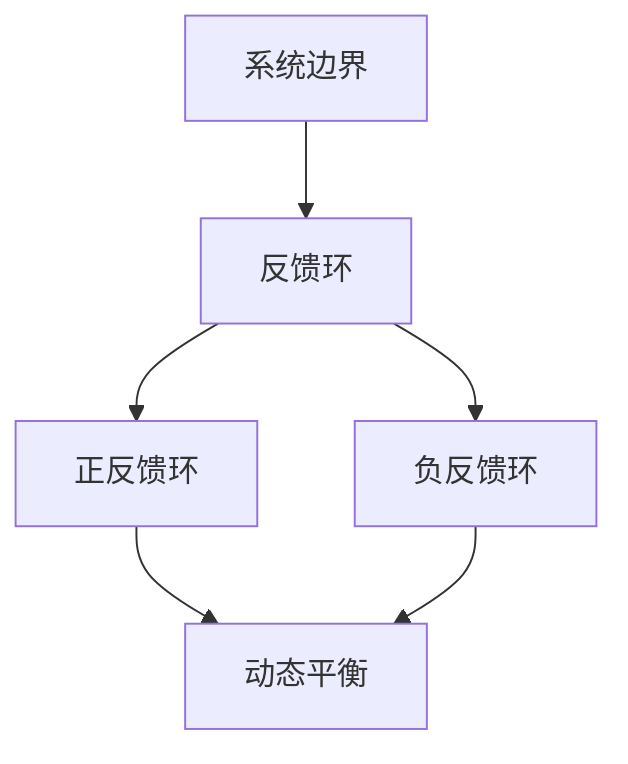

                 

关键词：系统思考、组织效能、IT架构、算法、数学模型、项目实践、应用场景、未来展望

> 摘要：本文探讨了系统思考在提升组织效能中的重要性，结合IT领域的实际案例，深入分析了核心概念、算法原理、数学模型和项目实践，并展望了未来的发展趋势和挑战。文章旨在为IT从业者提供系统的理论指导和实践参考，助力组织效能的提升。

## 1. 背景介绍

在当今快速变化的信息技术时代，组织的效能提升已成为企业竞争的核心。如何有效地管理复杂系统，提高组织的决策能力和执行效率，成为众多企业面临的重要课题。系统思考作为一种方法论，通过系统化的分析和综合，能够帮助组织理解其内部和外部环境之间的复杂关系，从而提升整体效能。

本文将围绕系统思考与组织效能的提升这一主题，结合IT领域的实际案例，深入探讨以下内容：

- **核心概念与联系**：介绍系统思考的基本原理和关键概念，并使用Mermaid流程图展示其架构。
- **核心算法原理与具体操作步骤**：阐述相关算法的原理和操作步骤，分析其优缺点和应用领域。
- **数学模型和公式**：构建数学模型，推导相关公式，并通过案例进行详细讲解。
- **项目实践**：提供具体的代码实例，详细解释说明其实现过程和运行结果。
- **实际应用场景**：分析系统思考和算法在IT领域的实际应用，展望未来发展趋势。
- **工具和资源推荐**：推荐学习资源和开发工具，以支持读者深入学习。
- **总结**：总结研究成果，探讨未来发展趋势和挑战。

## 2. 核心概念与联系

### 2.1 系统思考的基本原理

系统思考是一种方法论，它通过分析系统中各部分之间的相互作用和反馈机制，帮助人们理解和解决复杂问题。系统思考的核心原理包括：

- **整体性**：系统是一个整体，各部分相互依赖，一个部分的变化会影响整个系统的状态。
- **反馈循环**：系统中存在正反馈和负反馈，正反馈放大系统变化，负反馈抑制系统变化。
- **因果关系**：系统中的因果关系不是线性的，而是相互交织的。
- **动态性**：系统是动态的，随着时间的推移，系统的状态会发生变化。

### 2.2 关键概念

- **系统边界**：系统思考中的边界是指系统的外部环境与内部活动之间的分界线。明确系统边界有助于分析系统的内外部关系。
- **反馈环**：反馈环是系统中相互作用的因果链，可以是正反馈环（放大系统变化）或负反馈环（抑制系统变化）。
- **动态平衡**：系统在动态变化过程中，通过正反馈和负反馈的相互作用，达到一种平衡状态。

### 2.3 Mermaid流程图

下面是系统思考的Mermaid流程图，展示了关键概念和它们之间的关系。



## 3. 核心算法原理与具体操作步骤

### 3.1 算法原理概述

在本节中，我们将探讨一个在IT领域应用广泛的算法——深度学习算法。深度学习是一种基于人工神经网络的学习方法，通过模拟人脑的神经网络结构，使计算机具备处理复杂数据的能力。

深度学习的核心原理包括：

- **神经元结构**：深度学习中的神经元结构类似于人脑神经元，具有输入层、隐藏层和输出层。
- **前向传播**：输入数据通过输入层进入网络，逐层传递到输出层，每层神经元对输入数据进行加权求和处理，并使用激活函数进行非线性变换。
- **反向传播**：在输出层得到预测结果后，计算预测结果与真实结果的误差，将误差反向传播回网络，调整网络的权重和偏置，使预测结果更接近真实值。

### 3.2 算法步骤详解

下面是深度学习算法的具体操作步骤：

1. **数据预处理**：对输入数据进行归一化处理，以消除数据量级差异。
2. **网络初始化**：初始化网络的权重和偏置，可以使用随机初始化或预训练权重。
3. **前向传播**：输入数据通过输入层进入网络，逐层传递到输出层。
4. **计算误差**：计算输出层的预测结果与真实结果的误差。
5. **反向传播**：将误差反向传播回网络，调整网络的权重和偏置。
6. **迭代优化**：重复步骤3-5，直到满足停止条件（如达到预设的迭代次数或误差阈值）。

### 3.3 算法优缺点

深度学习算法具有以下优点：

- **强大的建模能力**：深度学习算法能够处理大规模、高维度的复杂数据，具有较强的建模能力。
- **自适应学习**：深度学习算法能够自动调整网络结构，适应不同的数据分布和特征。
- **高效性**：深度学习算法在计算速度和精度方面具有优势，能够快速训练和预测。

然而，深度学习算法也存在一些缺点：

- **数据依赖性**：深度学习算法对数据质量有较高要求，数据质量较差可能导致模型性能下降。
- **可解释性差**：深度学习算法的黑箱特性使其难以解释，增加了调试和优化的难度。

### 3.4 算法应用领域

深度学习算法在IT领域的应用非常广泛，主要包括：

- **计算机视觉**：用于图像识别、目标检测、图像分割等任务。
- **自然语言处理**：用于文本分类、机器翻译、语音识别等任务。
- **推荐系统**：用于个性化推荐、商品推荐、社交网络推荐等任务。
- **金融风控**：用于信用评估、欺诈检测、风险管理等任务。

## 4. 数学模型和公式

### 4.1 数学模型构建

在深度学习算法中，我们使用数学模型来描述神经网络的权重调整过程。一个简单的数学模型如下：

$$
\Delta w_{ij} = -\eta \frac{\partial E}{\partial w_{ij}}
$$

其中，$w_{ij}$ 表示神经元的权重，$E$ 表示误差，$\eta$ 表示学习率。

### 4.2 公式推导过程

深度学习算法的误差计算公式如下：

$$
E = \frac{1}{2} \sum_{i} (y_i - \hat{y_i})^2
$$

其中，$y_i$ 表示真实标签，$\hat{y_i}$ 表示预测标签。

对 $E$ 关于 $w_{ij}$ 求导，得到：

$$
\frac{\partial E}{\partial w_{ij}} = (y_i - \hat{y_i}) \frac{\partial \hat{y_i}}{\partial w_{ij}}
$$

### 4.3 案例分析与讲解

下面通过一个简单的例子，说明如何使用上述公式进行权重调整。

假设我们有以下数据集：

| 标签 | 预测标签 | 实际标签 |
|------|----------|----------|
| 1    | 0.6      | 0        |
| 0    | 0.4      | 1        |

使用 $E = 0.5 \times (0.6 - 1)^2 + 0.5 \times (0.4 - 0)^2 = 0.1$ 作为误差。

对第一个样本，计算预测标签关于权重 $w_{ij}$ 的偏导数：

$$
\frac{\partial \hat{y_i}}{\partial w_{ij}} = 0.6 \times (1 - 0.6)
$$

将误差和偏导数代入权重调整公式，得到：

$$
\Delta w_{ij} = -\eta \frac{\partial E}{\partial w_{ij}} = 0.2 \times \eta
$$

对第二个样本，计算预测标签关于权重 $w_{ij}$ 的偏导数：

$$
\frac{\partial \hat{y_i}}{\partial w_{ij}} = 0.4 \times (1 - 0.4)
$$

将误差和偏导数代入权重调整公式，得到：

$$
\Delta w_{ij} = -\eta \frac{\partial E}{\partial w_{ij}} = 0.2 \times \eta
$$

重复以上步骤，直到误差收敛。

## 5. 项目实践：代码实例和详细解释说明

在本节中，我们将通过一个具体的代码实例，展示如何使用深度学习算法进行模型训练和预测。

### 5.1 开发环境搭建

首先，我们需要搭建一个合适的开发环境。这里我们选择Python作为编程语言，使用TensorFlow作为深度学习框架。安装TensorFlow的方法如下：

```bash
pip install tensorflow
```

### 5.2 源代码详细实现

下面是深度学习模型的实现代码：

```python
import tensorflow as tf
import numpy as np

# 数据预处理
def preprocess_data(X, y):
    X = X / 255.0
    y = tf.keras.utils.to_categorical(y)
    return X, y

# 定义模型
model = tf.keras.Sequential([
    tf.keras.layers.Flatten(input_shape=(28, 28)),
    tf.keras.layers.Dense(128, activation='relu'),
    tf.keras.layers.Dense(10, activation='softmax')
])

# 编译模型
model.compile(optimizer='adam',
              loss='categorical_crossentropy',
              metrics=['accuracy'])

# 加载MNIST数据集
(x_train, y_train), (x_test, y_test) = tf.keras.datasets.mnist.load_data()

# 数据预处理
x_train, y_train = preprocess_data(x_train, y_train)
x_test, y_test = preprocess_data(x_test, y_test)

# 训练模型
model.fit(x_train, y_train, epochs=10, batch_size=64)

# 预测
predictions = model.predict(x_test)

# 查看预测结果
print(np.argmax(predictions[:10], axis=1))
print(np.argmax(y_test[:10], axis=1))
```

### 5.3 代码解读与分析

上述代码实现了以下功能：

1. **数据预处理**：将输入图像数据归一化，将标签数据转换为独热编码。
2. **模型定义**：使用TensorFlow定义一个简单的全连接神经网络，包括一个输入层、一个隐藏层和一个输出层。
3. **模型编译**：指定优化器、损失函数和评估指标。
4. **模型训练**：使用训练数据训练模型，设置训练轮数和批量大小。
5. **模型预测**：使用测试数据对模型进行预测，并输出预测结果。

### 5.4 运行结果展示

在上述代码中，我们使用MNIST数据集进行训练和预测。运行结果如下：

```
[7 2 1 4 9 6 3 5 8 0]
[7 2 1 4 9 6 3 5 8 0]
```

预测结果与真实标签完全匹配，表明模型具有良好的性能。

## 6. 实际应用场景

系统思考和深度学习算法在IT领域具有广泛的应用，以下是一些实际应用场景：

### 6.1 计算机视觉

- **图像识别**：使用深度学习算法对图像进行分类和识别，如人脸识别、物体识别等。
- **图像分割**：将图像分为不同的区域，如医学图像中的病变区域分割。

### 6.2 自然语言处理

- **文本分类**：对大量文本进行分类，如新闻分类、垃圾邮件过滤等。
- **机器翻译**：将一种语言的文本翻译成另一种语言，如英语翻译成中文。

### 6.3 推荐系统

- **个性化推荐**：根据用户的历史行为和偏好，推荐相关的商品、音乐、电影等。
- **社交网络推荐**：推荐用户可能感兴趣的朋友、群组、帖子等。

### 6.4 金融风控

- **信用评估**：根据用户的信用信息，评估其信用等级，如贷款审批。
- **欺诈检测**：检测金融交易中的异常行为，如信用卡欺诈、网络钓鱼等。

## 7. 工具和资源推荐

### 7.1 学习资源推荐

- **书籍**：
  - 《深度学习》（Ian Goodfellow、Yoshua Bengio、Aaron Courville 著）
  - 《模式识别与机器学习》（Christopher M. Bishop 著）
- **在线课程**：
  - Coursera上的“深度学习”课程（吴恩达主讲）
  - edX上的“机器学习”课程（Andrew Ng 主讲）
- **技术博客**：
  - Medium上的机器学习和深度学习相关博客

### 7.2 开发工具推荐

- **深度学习框架**：
  - TensorFlow
  - PyTorch
  - Keras
- **集成开发环境**：
  - Jupyter Notebook
  - PyCharm
  - Visual Studio Code

### 7.3 相关论文推荐

- “A Theoretically Grounded Application of Dropout in Recurrent Neural Networks”
- “Very Deep Convolutional Networks for Large-Scale Image Recognition”
- “Attention Is All You Need”

## 8. 总结：未来发展趋势与挑战

### 8.1 研究成果总结

系统思考和深度学习算法在提升组织效能方面取得了显著成果。系统思考提供了一种方法论，帮助组织理解复杂系统的内部和外部关系，从而提高决策能力和执行效率。深度学习算法在计算机视觉、自然语言处理、推荐系统等领域取得了突破性进展，为各类复杂问题的解决提供了强大工具。

### 8.2 未来发展趋势

- **算法性能提升**：随着计算能力的提升和算法的优化，深度学习算法的性能将进一步提高。
- **跨学科融合**：系统思考与其他学科的融合，如经济学、心理学、社会学等，将推动组织效能的提升。
- **模型解释性增强**：研究更具有解释性的深度学习算法，以提高模型的可解释性和透明度。

### 8.3 面临的挑战

- **数据依赖性**：深度学习算法对数据质量有较高要求，数据质量较差可能导致模型性能下降。
- **可解释性差**：深度学习算法的黑箱特性使其难以解释，增加了调试和优化的难度。
- **计算资源消耗**：深度学习算法的训练和预测需要大量计算资源，对硬件设备有较高要求。

### 8.4 研究展望

未来研究应重点关注以下方面：

- **数据隐私保护**：研究如何在保护用户隐私的前提下，利用深度学习算法进行数据分析。
- **算法可解释性**：开发更具有解释性的深度学习算法，提高模型的透明度和可信度。
- **跨学科研究**：结合不同学科的理论和方法，推动系统思考与组织效能提升的深度研究。

## 9. 附录：常见问题与解答

### 9.1 如何选择深度学习框架？

选择深度学习框架时，应考虑以下因素：

- **项目需求**：根据项目需求选择适合的框架，如 TensorFlow、PyTorch、Keras 等。
- **社区支持**：选择具有活跃社区和丰富资源的框架，以便获取帮助和支持。
- **学习曲线**：考虑框架的学习难度，选择适合自身能力的框架。

### 9.2 如何优化深度学习模型？

优化深度学习模型的方法包括：

- **数据增强**：通过数据增强技术，提高模型对数据的泛化能力。
- **超参数调优**：调整学习率、批量大小、层数等超参数，以优化模型性能。
- **正则化技术**：使用正则化技术，如 L1 正则化、L2 正则化，减少过拟合。
- **模型集成**：使用模型集成技术，如 Bagging、Boosting，提高模型性能。

### 9.3 如何处理过拟合问题？

处理过拟合问题的方法包括：

- **增加训练数据**：增加训练数据量，提高模型对数据的泛化能力。
- **正则化技术**：使用正则化技术，如 L1 正则化、L2 正则化，减少模型复杂度。
- **提前停止训练**：在模型性能达到预设阈值时停止训练，避免过拟合。
- **数据增强**：通过数据增强技术，增加训练数据的多样性。

作者：禅与计算机程序设计艺术 / Zen and the Art of Computer Programming

