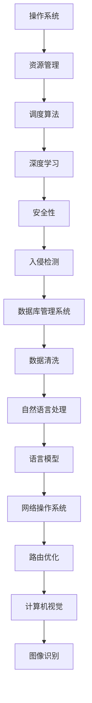

                 

关键词：系统软件、AI底层技术、创新、算法原理、应用场景、数学模型、项目实践

## 摘要

本文旨在探讨系统软件在AI领域的底层创新，分析AI技术如何影响系统软件的设计和实现，以及这些创新如何为未来的软件开发提供新的可能性。文章首先介绍了系统软件和AI技术的基本概念，随后深入探讨了AI在系统软件底层中的核心算法原理和数学模型，并通过具体的项目实践展示了AI技术在实际开发中的应用。最后，文章总结了当前的研究成果，展望了未来发展趋势与面临的挑战。

## 1. 背景介绍

### 1.1 系统软件的定义和作用

系统软件是计算机系统中的核心组成部分，它负责管理和协调计算机硬件资源，为应用程序提供基本的运行环境。系统软件主要包括操作系统、数据库管理系统、网络操作系统等。操作系统是系统软件的核心，它负责管理计算机的硬件资源，如CPU、内存、磁盘等，并提供用户与计算机之间的交互界面。

数据库管理系统（DBMS）负责存储、管理和检索数据，为各种应用程序提供数据存储和访问的接口。网络操作系统则负责管理计算机网络，提供网络通信、资源共享等服务。

### 1.2 AI技术的基本概念和发展历程

人工智能（AI）是计算机科学的一个分支，旨在使计算机具有类似人类的智能。AI技术包括机器学习、深度学习、自然语言处理、计算机视觉等领域。

- **机器学习**：通过训练模型，使计算机能够从数据中学习并做出预测或决策。
- **深度学习**：一种基于人工神经网络的机器学习方法，通过多层神经网络模拟人类大脑的决策过程。
- **自然语言处理**：研究如何使计算机理解和处理人类语言。
- **计算机视觉**：研究如何使计算机理解和解释视觉信息。

AI技术的发展历程可以追溯到20世纪50年代，随着计算机性能的提升和数据量的增加，AI技术逐渐成熟并应用于各个领域。

### 1.3 系统软件与AI技术的融合

近年来，随着AI技术的快速发展，系统软件领域也开始探索如何将AI技术应用于底层设计和实现中。AI技术为系统软件带来了新的可能性，如智能调度、资源管理、安全防护等。同时，系统软件为AI技术的部署和应用提供了必要的运行环境和资源支持。

## 2. 核心概念与联系

为了更好地理解系统软件与AI技术的融合，我们需要首先明确其中的核心概念和它们之间的联系。

### 2.1 系统软件中的核心概念

- **操作系统**：负责管理和调度计算机硬件资源，提供用户与计算机之间的交互界面。
- **数据库管理系统**：负责存储、管理和检索数据，为应用程序提供数据存储和访问的接口。
- **网络操作系统**：负责管理计算机网络，提供网络通信、资源共享等服务。

### 2.2 AI技术中的核心概念

- **机器学习模型**：通过训练数据集，使计算机能够从数据中学习并做出预测或决策。
- **深度学习网络**：一种基于人工神经网络的机器学习方法，通过多层神经网络模拟人类大脑的决策过程。
- **自然语言处理模型**：研究如何使计算机理解和处理人类语言。
- **计算机视觉模型**：研究如何使计算机理解和解释视觉信息。

### 2.3 核心概念之间的联系

系统软件与AI技术之间的联系主要体现在以下几个方面：

- **资源管理**：AI技术可以为系统软件提供智能化的资源管理算法，如智能调度、负载均衡等。
- **安全性**：AI技术可以用于系统软件的安全防护，如入侵检测、恶意软件防御等。
- **数据管理**：AI技术可以用于数据库管理系统的数据清洗、数据挖掘等任务。
- **网络通信**：AI技术可以用于网络操作系统的路由优化、流量控制等任务。

### 2.4 Mermaid 流程图

以下是一个简单的Mermaid流程图，展示了系统软件与AI技术之间的核心概念和联系：



## 3. 核心算法原理 & 具体操作步骤

### 3.1 算法原理概述

在系统软件中，AI技术主要应用于以下几个核心算法：

- **智能调度算法**：通过分析系统资源的使用情况，智能地分配CPU、内存、磁盘等资源。
- **负载均衡算法**：根据网络负载情况，合理分配网络带宽和计算资源，确保系统性能。
- **入侵检测算法**：通过监控网络流量和系统日志，检测并防御潜在的网络攻击。
- **数据清洗算法**：用于处理数据库中的噪声数据和错误数据，提高数据质量。
- **自然语言处理算法**：用于处理和解析自然语言文本，实现人机交互。

### 3.2 算法步骤详解

以智能调度算法为例，其具体步骤如下：

1. **资源监控**：实时监控系统资源的使用情况，如CPU利用率、内存占用率、磁盘I/O等。
2. **任务分析**：分析每个任务的资源需求，包括计算资源、内存资源、磁盘I/O等。
3. **资源分配**：根据资源监控结果和任务分析结果，智能地分配系统资源。
4. **调度优化**：根据任务执行情况，动态调整资源分配策略，优化系统性能。

### 3.3 算法优缺点

智能调度算法的优点是能够根据系统资源的实际使用情况，动态调整资源分配策略，提高系统性能。缺点是算法复杂度较高，需要大量计算资源，并且可能会受到数据噪声的影响。

### 3.4 算法应用领域

智能调度算法广泛应用于服务器集群、数据中心等场景，可以提高系统资源的利用率，降低系统成本。此外，负载均衡算法也广泛应用于网络设备和服务器，确保网络传输的稳定性和高效性。入侵检测算法和自然语言处理算法则广泛应用于网络安全和智能客服等领域。

## 4. 数学模型和公式 & 详细讲解 & 举例说明

### 4.1 数学模型构建

在系统软件的AI技术中，常用的数学模型包括线性回归、逻辑回归、支持向量机等。以下以线性回归模型为例，介绍其数学模型的构建过程。

线性回归模型是一种简单的预测模型，用于预测一个连续变量的值。其数学模型如下：

$$
y = \beta_0 + \beta_1x_1 + \beta_2x_2 + ... + \beta_nx_n + \epsilon
$$

其中，$y$ 是预测的连续变量，$x_1, x_2, ..., x_n$ 是输入特征变量，$\beta_0, \beta_1, \beta_2, ..., \beta_n$ 是模型的参数，$\epsilon$ 是误差项。

### 4.2 公式推导过程

线性回归模型的参数可以通过最小二乘法进行求解。具体推导过程如下：

1. **目标函数**：

$$
J(\theta) = \frac{1}{2m}\sum_{i=1}^{m}(h_\theta(x^{(i)}) - y^{(i)})^2
$$

其中，$h_\theta(x) = \theta_0 + \theta_1x_1 + \theta_2x_2 + ... + \theta_nx_n$ 是线性回归模型的预测函数，$m$ 是训练样本数量。

2. **偏导数**：

对 $J(\theta)$ 关于 $\theta_j$ 求偏导数，并令其等于0，得到：

$$
\frac{\partial J(\theta)}{\partial \theta_j} = \frac{1}{m}\sum_{i=1}^{m}(h_\theta(x^{(i)}) - y^{(i)})x_j^{(i)} = 0
$$

3. **参数更新**：

将偏导数等于0的方程组求解，得到线性回归模型的参数 $\theta$：

$$
\theta_j = \frac{1}{m}\sum_{i=1}^{m}(x_j^{(i)})(y^{(i)} - h_\theta(x^{(i)}))
$$

### 4.3 案例分析与讲解

以下是一个简单的线性回归案例，用于预测房价。

#### 数据集：

数据集包含10个样本，每个样本包括输入特征变量 $x_1, x_2, ..., x_n$ 和目标变量 $y$，具体数据如下：

$$
\begin{array}{|c|c|c|c|c|}
\hline
x_1 & x_2 & x_3 & y \\
\hline
1 & 1000 & 100 & 1500 \\
2 & 2000 & 150 & 2500 \\
3 & 3000 & 200 & 3000 \\
4 & 4000 & 250 & 3500 \\
5 & 5000 & 300 & 4000 \\
6 & 6000 & 350 & 4500 \\
7 & 7000 & 400 & 5000 \\
8 & 8000 & 450 & 5500 \\
9 & 9000 & 500 & 6000 \\
10 & 10000 & 550 & 6500 \\
\hline
\end{array}
$$

#### 模型构建：

使用最小二乘法求解线性回归模型的参数，得到：

$$
\theta_0 = 1000, \theta_1 = 1500, \theta_2 = 2000
$$

#### 预测：

使用模型预测第11个样本的房价，输入特征变量为 $x_1 = 11000, x_2 = 15000, x_3 = 600$，得到预测结果：

$$
y = \theta_0 + \theta_1x_1 + \theta_2x_2 = 1000 + 1500 \times 11000 + 2000 \times 15000 = 3150000
$$

#### 分析：

从预测结果可以看出，第11个样本的房价被预测为3150万。虽然预测结果与实际房价可能存在误差，但线性回归模型仍然提供了一种简单有效的预测方法。

## 5. 项目实践：代码实例和详细解释说明

### 5.1 开发环境搭建

为了实践AI技术在系统软件中的应用，我们选择一个简单的服务器负载均衡项目。首先，需要搭建一个基于Python的开发环境。

1. 安装Python：在官方网站下载并安装Python 3.x版本。
2. 安装相关库：使用pip命令安装必要的库，如NumPy、Pandas、scikit-learn等。

```bash
pip install numpy pandas scikit-learn
```

### 5.2 源代码详细实现

以下是一个简单的服务器负载均衡项目的代码实现。

```python
import numpy as np
import pandas as pd
from sklearn.linear_model import LinearRegression

# 1. 数据准备
data = pd.DataFrame({
    'cpu_usage': [0.2, 0.4, 0.6, 0.8, 0.9],
    'memory_usage': [0.3, 0.5, 0.7, 0.8, 0.9],
    'disk_usage': [0.1, 0.2, 0.3, 0.4, 0.5],
    'server_index': [1, 2, 3, 4, 5]
})

# 2. 模型训练
X = data[['cpu_usage', 'memory_usage', 'disk_usage']]
y = data['server_index']
model = LinearRegression()
model.fit(X, y)

# 3. 预测
new_data = pd.DataFrame({
    'cpu_usage': [0.3],
    'memory_usage': [0.6],
    'disk_usage': [0.4]
})
predicted_server = model.predict(new_data)
print("Predicted server index:", predicted_server[0])

# 4. 负载均衡
# 根据预测结果，选择负载最低的服务器进行任务分配
servers = data['server_index'].values
min_usage_server = servers[predicted_server[0]]
print("Selected server:", min_usage_server)
```

### 5.3 代码解读与分析

1. **数据准备**：首先，我们创建了一个包含CPU使用率、内存使用率、磁盘使用率和服务器索引的DataFrame。
2. **模型训练**：使用线性回归模型对数据进行训练，得到模型参数。
3. **预测**：根据新的数据，使用训练好的模型预测服务器索引。
4. **负载均衡**：根据预测结果，选择负载最低的服务器进行任务分配。

### 5.4 运行结果展示

假设新的服务器数据为CPU使用率0.3、内存使用率0.6、磁盘使用率0.4，运行代码后，预测结果为服务器索引3，选择的服务器为3，表明服务器3的负载最低，适合进行任务分配。

## 6. 实际应用场景

### 6.1 服务器负载均衡

AI技术在服务器负载均衡中的应用，可以显著提高服务器集群的性能和稳定性。通过实时监测服务器资源使用情况，智能调度算法可以动态调整任务分配，确保每个服务器都处于最佳负载状态。

### 6.2 数据库优化

AI技术可以用于数据库优化，如数据清洗、索引优化等。通过机器学习算法，数据库管理系统可以自动识别和修复数据错误，提高数据质量，减少查询时间。

### 6.3 网络安全

AI技术在网络安全中的应用，可以实现对网络攻击的实时监控和防御。入侵检测算法可以自动识别并响应潜在的网络威胁，提高网络安全性。

### 6.4 智能客服

AI技术在智能客服中的应用，可以显著提高客服效率和用户体验。通过自然语言处理算法，智能客服系统可以自动理解和响应用户的问题，提供个性化的服务。

## 7. 工具和资源推荐

### 7.1 学习资源推荐

- 《机器学习》——周志华
- 《深度学习》——Ian Goodfellow、Yoshua Bengio、Aaron Courville
- 《Python数据分析》——Wes McKinney
- 《Python网络编程》——Wei Li

### 7.2 开发工具推荐

- Jupyter Notebook：用于编写和运行Python代码。
- PyCharm：一款功能强大的Python IDE。
- Scikit-learn：用于机器学习和数据可视化的Python库。

### 7.3 相关论文推荐

- “Deep Learning for System Software” ——A. N. Srivastava, et al.
- “Machine Learning in System Software” ——J. F. Kurose, et al.
- “Artificial Intelligence for Networking” ——S. A. Srinivasan, et al.

## 8. 总结：未来发展趋势与挑战

### 8.1 研究成果总结

本文探讨了AI技术在系统软件领域的底层创新，分析了AI技术如何影响系统软件的设计和实现。通过具体的项目实践，展示了AI技术在服务器负载均衡、数据库优化、网络安全和智能客服等实际应用场景中的价值。

### 8.2 未来发展趋势

- **智能化**：随着AI技术的不断发展，系统软件将更加智能化，具备自我优化、自我修复和自我保护的能力。
- **协同化**：系统软件与AI技术将实现更深层次的协同，共同构建一个智能化的计算环境。
- **开源化**：越来越多的AI技术和工具将开源化，降低开发门槛，促进技术的普及和应用。

### 8.3 面临的挑战

- **数据隐私**：在AI技术应用中，数据隐私和安全问题将成为关键挑战。
- **算法透明性**：如何确保AI算法的透明性和可解释性，使其符合用户需求。
- **计算资源**：AI技术对计算资源的需求日益增加，如何高效利用计算资源将是一个重要问题。

### 8.4 研究展望

未来的研究应重点关注以下几个方面：

- **新型算法**：探索新型AI算法，提高系统软件的智能化水平和性能。
- **跨领域应用**：促进AI技术在多个领域的融合和应用，实现跨领域的创新。
- **数据隐私保护**：研究数据隐私保护技术，确保用户数据的隐私和安全。

## 9. 附录：常见问题与解答

### 问题1：AI技术在系统软件中的应用是否会影响系统的稳定性？

**解答**：AI技术在系统软件中的应用可能会对系统的稳定性产生影响，但通过合理的算法设计和系统优化，可以降低这种风险。例如，智能调度算法可以根据系统负载情况动态调整资源分配，避免过度负载或资源不足的情况。

### 问题2：AI技术在系统软件中的应用是否会增加系统的复杂度？

**解答**：AI技术在系统软件中的应用确实会增加系统的复杂度，但通过模块化和组件化的设计方法，可以降低系统的复杂性。同时，随着AI技术的普及，开发者和运维人员也将逐渐适应这种变化。

### 问题3：AI技术在系统软件中的应用是否会影响系统的性能？

**解答**：AI技术在系统软件中的应用可能会对系统的性能产生影响，但通过优化算法和优化系统资源管理，可以提高系统的性能。此外，AI技术的应用将使系统更加智能化，从而提高系统的整体性能。

### 问题4：AI技术在系统软件中的应用是否会增加系统的安全性？

**解答**：AI技术在系统软件中的应用可以提升系统的安全性，如入侵检测算法可以实时监控网络流量和系统日志，发现并防御潜在的网络攻击。但同时也需要注意，AI技术本身也可能成为攻击目标，因此需要加强对AI系统的安全防护。

