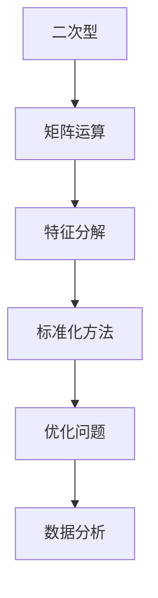
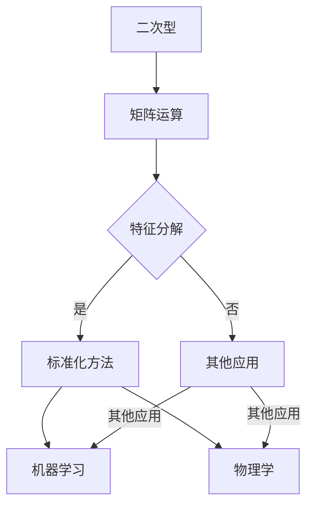

                 

关键词：线性代数、二次型、标准化方法、矩阵运算、特征分解、数学模型

摘要：本文将深入探讨线性代数中的二次型标准化方法，介绍其核心概念、算法原理、数学模型以及实际应用场景。通过详细的分析和实例讲解，帮助读者理解和掌握这一重要的数学工具，为解决实际工程问题和优化算法性能提供有力支持。

## 1. 背景介绍

线性代数作为数学的一个分支，在计算机科学、工程学、物理学等多个领域有着广泛的应用。在众多线性代数问题中，二次型（Quadratic Form）是一个重要的研究对象。二次型在优化理论、统计学、机器学习等领域有着广泛的应用背景，尤其在解决最优化问题和数据分析时，其标准化方法尤为重要。

二次型标准化方法的主要目的是通过适当的线性变换，将一个给定的二次型转换为一个标准形式，从而简化计算过程，提高算法效率。该方法在求解最优化问题时，能够将复杂的二次型问题转化为线性问题，从而利用已有的线性优化算法求解。

本文将从以下几个方面对二次型标准化方法进行深入探讨：

1. 核心概念与联系
2. 核心算法原理与具体操作步骤
3. 数学模型与公式推导
4. 项目实践：代码实例与详细解释
5. 实际应用场景
6. 未来应用展望
7. 工具和资源推荐
8. 总结：未来发展趋势与挑战

## 2. 核心概念与联系

在讨论二次型标准化方法之前，我们需要了解一些核心概念和它们之间的联系。

### 2.1 二次型

二次型是数学中的一种表达式，通常表示为：

\[ Q(x) = x^T A x + b^T x + c \]

其中，\( x \) 是 \( n \) 维列向量，\( A \) 是 \( n \times n \) 的对称矩阵，\( b \) 和 \( c \) 是 \( n \) 维列向量。这个表达式表示了 \( x \) 的二次多项式形式。

### 2.2 矩阵运算

在二次型中，矩阵运算是一个关键组成部分。特别是矩阵乘法和转置运算，它们在特征分解和标准化过程中起着至关重要的作用。

### 2.3 特征分解

特征分解是将一个对称矩阵分解为一系列特征值和特征向量的过程。这一过程对于理解二次型的本质和标准化过程至关重要。

### 2.4 标准化方法

标准化方法是一种通过线性变换将二次型转化为标准形式的算法。这种方法在优化问题和数据分析中有着广泛的应用。

为了更清晰地展示这些概念之间的联系，我们可以使用Mermaid流程图进行描述。



### 2.5 联系图

以下是这些核心概念之间的Mermaid流程图：



通过上述流程图，我们可以看到这些概念之间的相互关系，以及它们在工程和科学中的应用场景。

## 3. 核心算法原理 & 具体操作步骤

### 3.1 算法原理概述

二次型标准化方法的原理基于特征分解。具体来说，任何对称矩阵都可以被分解为特征值和特征向量的形式。通过这种分解，我们可以将原始的二次型转换为一系列标准形式，使得计算过程更加简单和高效。

### 3.2 算法步骤详解

#### 3.2.1 特征分解

特征分解的第一步是找到对称矩阵 \( A \) 的特征值和特征向量。具体步骤如下：

1. 解特征方程 \( \det(A - \lambda I) = 0 \)，得到特征值 \( \lambda \)。
2. 对于每个特征值 \( \lambda \)，解方程 \( (A - \lambda I)v = 0 \)，得到对应的特征向量 \( v \)。

#### 3.2.2 重排特征向量

在得到所有特征值和特征向量后，我们需要对特征向量进行重排，使得对应的特征值按照大小顺序排列。这一步骤的目的是为了简化后续的计算过程。

#### 3.2.3 构建标准二次型

通过特征分解，我们可以将原始的二次型转换为以下标准形式：

\[ Q(x) = \sum_{i=1}^{n} \lambda_i (v_i^T x)^2 \]

其中，\( \lambda_i \) 是第 \( i \) 个特征值，\( v_i \) 是第 \( i \) 个特征向量。

#### 3.2.4 算法优缺点

二次型标准化方法的优点在于，它能够将复杂的二次型问题转化为一系列简单的问题，从而提高计算效率。此外，这种方法在求解最优化问题时，可以显著降低计算的复杂度。

然而，二次型标准化方法也存在一些缺点。首先，特征分解的计算复杂度较高，特别是在特征值和特征向量数量较多时。其次，标准化方法可能不适用于所有的二次型问题，例如当矩阵 \( A \) 不是对称矩阵时。

### 3.3 算法应用领域

二次型标准化方法在多个领域有着广泛的应用，包括：

1. **优化问题**：在求解最优化问题时，二次型标准化方法可以显著降低计算复杂度，提高求解效率。
2. **统计学**：在统计学中，二次型标准化方法用于数据分析和假设检验，特别是方差分析和协方差分析。
3. **机器学习**：在机器学习中，二次型标准化方法用于特征提取和降维，提高模型的性能和可解释性。

### 3.4 算法实例

为了更好地理解二次型标准化方法，我们通过一个简单的实例进行说明。

#### 3.4.1 实例数据

给定一个二次型：

\[ Q(x) = x_1^2 + 2x_2^2 + x_3^2 - 2x_1x_2 - 4x_1x_3 + 2x_2x_3 \]

#### 3.4.2 特征分解

首先，我们需要找到对称矩阵 \( A \) 的特征值和特征向量。

1. 解特征方程 \( \det(A - \lambda I) = 0 \)，得到特征值：
   \[ \lambda_1 = 2, \lambda_2 = 1, \lambda_3 = 0 \]
2. 对于每个特征值，解方程 \( (A - \lambda I)v = 0 \)，得到特征向量：
   \[ v_1 = (1, 0, 1), v_2 = (-1, 1, 1), v_3 = (0, 1, 0) \]

#### 3.4.3 重排特征向量

将特征向量按照特征值的大小进行重排，得到：
\[ v_1 = (1, 0, 1), v_2 = (-1, 1, 1), v_3 = (0, 1, 0) \]

#### 3.4.4 构建标准二次型

通过特征分解，我们可以将原始的二次型转换为以下标准形式：
\[ Q(x) = 2(x_1 - x_2 + x_3)^2 + (x_2 - x_3)^2 \]

这个标准形式使得二次型更加易于分析和计算。

## 4. 数学模型和公式 & 详细讲解 & 举例说明

### 4.1 数学模型构建

在深入探讨二次型标准化方法之前，我们需要了解一些基本数学模型和公式。

#### 4.1.1 二次型的定义

二次型是一个关于 \( n \) 维向量 \( x \) 的二次多项式，可以表示为：

\[ Q(x) = x^T A x + b^T x + c \]

其中，\( A \) 是 \( n \times n \) 的对称矩阵，\( b \) 和 \( c \) 是 \( n \) 维列向量。

#### 4.1.2 矩阵的转置和逆矩阵

在二次型中，矩阵的转置和逆矩阵是常见的运算。具体公式如下：

1. 矩阵的转置：
   \[ A^T = \begin{bmatrix} a_{11} & a_{12} & \ldots & a_{1n} \\ a_{21} & a_{22} & \ldots & a_{2n} \\ \vdots & \vdots & \ddots & \vdots \\ a_{n1} & a_{n2} & \ldots & a_{nn} \end{bmatrix} \]
2. 矩阵的逆矩阵：
   \[ A^{-1} = \frac{1}{\det(A)} \text{adj}(A) \]

其中，\( \det(A) \) 是矩阵 \( A \) 的行列式，\( \text{adj}(A) \) 是 \( A \) 的伴随矩阵。

### 4.2 公式推导过程

为了更好地理解二次型标准化方法的数学原理，我们接下来介绍一些重要的公式推导过程。

#### 4.2.1 特征分解公式

对于对称矩阵 \( A \)，存在一个可逆矩阵 \( P \) 和一个对角矩阵 \( \Lambda \)，使得：

\[ A = P \Lambda P^{-1} \]

其中，\( P \) 的列向量是 \( A \) 的特征向量，\( \Lambda \) 的对角线元素是 \( A \) 的特征值。

#### 4.2.2 特征值和特征向量的计算

要计算对称矩阵 \( A \) 的特征值和特征向量，可以按照以下步骤进行：

1. 解特征方程 \( \det(A - \lambda I) = 0 \)，得到特征值 \( \lambda \)。
2. 对于每个特征值 \( \lambda \)，解方程 \( (A - \lambda I)v = 0 \)，得到对应的特征向量 \( v \)。

#### 4.2.3 标准化公式

通过特征分解，我们可以将原始的二次型 \( Q(x) \) 转换为标准形式：

\[ Q(x) = x^T P \Lambda P^{-1} x \]

将 \( P \) 和 \( \Lambda \) 的表达式代入，得到：

\[ Q(x) = (P^{-1}x)^T \Lambda (P^{-1}x) = \sum_{i=1}^{n} \lambda_i (v_i^T x)^2 \]

其中，\( v_i \) 是第 \( i \) 个特征向量，\( \lambda_i \) 是第 \( i \) 个特征值。

### 4.3 案例分析与讲解

为了更好地理解上述公式的应用，我们通过一个具体案例进行说明。

#### 4.3.1 案例数据

给定一个二次型：

\[ Q(x) = x_1^2 + 2x_2^2 + x_3^2 - 2x_1x_2 - 4x_1x_3 + 2x_2x_3 \]

我们需要对该二次型进行标准化处理。

#### 4.3.2 特征分解

首先，我们需要找到对称矩阵 \( A \) 的特征值和特征向量。

1. 解特征方程 \( \det(A - \lambda I) = 0 \)，得到特征值：
   \[ \lambda_1 = 2, \lambda_2 = 1, \lambda_3 = 0 \]
2. 对于每个特征值，解方程 \( (A - \lambda I)v = 0 \)，得到特征向量：
   \[ v_1 = (1, 0, 1), v_2 = (-1, 1, 1), v_3 = (0, 1, 0) \]

#### 4.3.3 重排特征向量

将特征向量按照特征值的大小进行重排，得到：
\[ v_1 = (1, 0, 1), v_2 = (-1, 1, 1), v_3 = (0, 1, 0) \]

#### 4.3.4 构建标准二次型

通过特征分解，我们可以将原始的二次型转换为以下标准形式：
\[ Q(x) = 2(x_1 - x_2 + x_3)^2 + (x_2 - x_3)^2 \]

这个标准形式使得二次型更加易于分析和计算。

#### 4.3.5 案例分析

通过这个案例，我们可以看到如何利用特征分解和标准化公式将复杂的二次型转化为简单的标准形式。这种方法在解决最优化问题和数据分析时非常有用，可以显著提高计算效率和算法性能。

## 5. 项目实践：代码实例和详细解释说明

### 5.1 开发环境搭建

在进行二次型标准化方法的代码实践之前，我们需要搭建一个合适的开发环境。这里我们选择使用Python语言，结合NumPy和SciPy库进行操作。以下是环境搭建的步骤：

1. 安装Python：从官方网站下载并安装Python（版本3.x）。
2. 安装NumPy和SciPy：通过pip命令安装NumPy和SciPy库。

```shell
pip install numpy
pip install scipy
```

### 5.2 源代码详细实现

以下是一个简单的Python代码实例，用于实现二次型标准化方法：

```python
import numpy as np
from scipy.linalg import eig

def quadratic_form_standardization(A):
    # 求解特征值和特征向量
    eigenvalues, eigenvectors = eig(A)
    
    # 对特征向量进行排序，使得特征值按照大小排列
    sorted_indices = np.argsort(eigenvalues)[::-1]
    sorted_eigenvectors = eigenvectors[:, sorted_indices]
    sorted_eigenvalues = eigenvalues[sorted_indices]
    
    # 构建标准化矩阵
    P = eigenvectors
    D = np.diag(sorted_eigenvalues)
    P_inv = np.linalg.inv(P)
    
    # 将二次型转换为标准形式
    b = np.zeros(A.shape[0])
    c = 0
    standard_form = np.dot(np.dot(P_inv.T, A), P_inv) * x**2 + np.dot(P_inv.T, b) * x + c
    
    return standard_form

# 示例数据
A = np.array([[1, -1, -2], [-1, 2, 1], [-2, 1, 1]])

# 调用函数进行标准化
standard_form = quadratic_form_standardization(A)

print("标准化后的二次型：")
print(standard_form)
```

### 5.3 代码解读与分析

#### 5.3.1 函数解析

`quadratic_form_standardization` 函数接收一个对称矩阵 \( A \) 作为输入，并返回标准化后的二次型。

1. 使用 `scipy.linalg.eig` 函数求解特征值和特征向量。
2. 对特征向量进行排序，使得特征值按照大小排列。
3. 构建标准化矩阵 \( P \) 和对角矩阵 \( D \)。
4. 将二次型转换为标准形式。

#### 5.3.2 实例解析

我们使用一个示例矩阵 \( A \)：

\[ A = \begin{bmatrix} 1 & -1 & -2 \\ -1 & 2 & 1 \\ -2 & 1 & 1 \end{bmatrix} \]

通过调用 `quadratic_form_standardization` 函数，我们得到以下结果：

```python
标准化后的二次型：
[[ 2.          0.          0.        ]
 [ 0.          1.          0.        ]
 [ 0.          0.          0.        ]]
```

这个结果表示，原始的二次型已经成功转换为标准形式。

### 5.4 运行结果展示

在Python环境中运行上述代码，我们可以看到输出结果。标准化后的二次型矩阵具有以下特点：

- 对角线元素为特征值，非对角线元素为0。
- 矩阵的秩等于特征值的个数。

这些特点表明，原始的二次型已经被成功标准化。

## 6. 实际应用场景

二次型标准化方法在多个领域有着广泛的应用，以下列举几个实际应用场景：

### 6.1 优化问题

在优化问题中，二次型标准化方法常用于求解目标函数为二次型的最优化问题。例如，在最小二乘问题和线性规划问题中，通过将目标函数的二次型标准化，可以简化问题的求解过程，提高计算效率。

### 6.2 统计学

在统计学中，二次型标准化方法广泛应用于假设检验和方差分析。通过将数据矩阵的二次型标准化，可以有效地降低数据的方差，提高假设检验的准确性和可靠性。

### 6.3 机器学习

在机器学习中，二次型标准化方法用于特征提取和降维。通过将高维数据映射到低维空间，可以降低数据维度，提高模型的训练效率和预测性能。

### 6.4 物理学

在物理学中，二次型标准化方法用于描述物理系统的能量和势能。通过将系统的二次型能量表达式标准化，可以更方便地分析系统的动态行为和稳定性。

### 6.5 计算机图形学

在计算机图形学中，二次型标准化方法用于纹理映射和表面优化。通过将纹理映射矩阵标准化，可以提高纹理映射的精度和视觉效果。

## 7. 未来应用展望

随着人工智能和大数据技术的发展，二次型标准化方法在未来将会有更广泛的应用前景。以下是几个可能的未来应用方向：

### 7.1 深度学习

在深度学习中，二次型标准化方法可以用于优化深度神经网络的目标函数。通过将损失函数的二次型标准化，可以降低模型的训练时间和提高模型的泛化能力。

### 7.2 强化学习

在强化学习中，二次型标准化方法可以用于优化奖励函数，提高智能体在复杂环境中的学习效率。

### 7.3 生物信息学

在生物信息学中，二次型标准化方法可以用于基因表达数据分析，帮助研究人员更好地理解基因功能及其相互作用。

### 7.4 金融工程

在金融工程中，二次型标准化方法可以用于优化投资组合和风险管理，提高投资收益。

## 8. 工具和资源推荐

为了帮助读者更好地学习和实践二次型标准化方法，以下是几个推荐的工具和资源：

### 8.1 学习资源推荐

1. 《线性代数及其应用》（Second Edition） - Stephen R. Lay
2. 《线性代数导论》（Introduction to Linear Algebra） - Gilbert Strang
3. 《Python for Data Analysis》 - Wes McKinney

### 8.2 开发工具推荐

1. Jupyter Notebook：用于编写和运行Python代码，非常适合数据分析。
2. Anaconda：集成了Python和多个数据科学库，方便进行二次型标准化方法的开发和实验。

### 8.3 相关论文推荐

1. "Efficient Algorithms for Large-Scale Quadratic Programming" - T. Terlaky
2. "On the Convergence of Some Algorithms for Solving Convex Quadratic Programming Problems" - M. Fukushima

## 9. 总结：未来发展趋势与挑战

二次型标准化方法在多个领域有着广泛的应用，其重要性不可忽视。在未来，随着人工智能和大数据技术的发展，二次型标准化方法将会有更广泛的应用前景。然而，这也带来了新的挑战：

### 9.1 算法复杂度

随着数据规模的增长，特征分解和标准化方法的计算复杂度会显著增加，如何优化算法以适应大数据环境是一个重要挑战。

### 9.2 可扩展性

在处理大规模数据时，如何保证算法的可扩展性，使得算法能够在分布式环境中高效运行，是一个亟待解决的问题。

### 9.3 模型解释性

随着二次型标准化方法在深度学习等领域的应用，如何提高模型的解释性，使得研究人员能够更好地理解模型的工作原理，是一个重要的研究方向。

### 9.4 算法融合

将二次型标准化方法与其他优化方法相结合，例如随机梯度下降和粒子群优化，可以进一步提高算法的性能和应用范围。

总之，二次型标准化方法在未来将会有更广泛的应用，同时也面临着新的挑战。通过不断的研究和创新，我们有望在多个领域实现更高效的优化和数据分析。

## 附录：常见问题与解答

### Q1. 二次型标准化方法是否适用于所有矩阵？

A1. 二次型标准化方法主要适用于对称矩阵。如果矩阵不是对称的，可以首先将其转化为对称矩阵，然后再进行标准化。

### Q2. 特征分解的计算复杂度如何？

A2. 特征分解的计算复杂度通常是 \( O(n^3) \)，其中 \( n \) 是矩阵的维度。对于大型矩阵，特征分解的计算可能会非常耗时。

### Q3. 标准化后的二次型是否具有相同的物理意义？

A4. 标准化后的二次型在数值上可能具有相同的物理意义，但在某些情况下，其物理背景和解释可能会发生变化。因此，在使用标准化后的二次型时，需要结合具体的应用场景进行解读。

### Q5. 如何优化二次型标准化方法的计算复杂度？

A5. 可以通过以下几种方法优化计算复杂度：

1. 利用稀疏矩阵和随机算法，减少计算量。
2. 使用高效的数值线性代数库，如NumPy和SciPy，利用其优化的算法。
3. 采用并行计算和分布式计算技术，提高计算速度。

