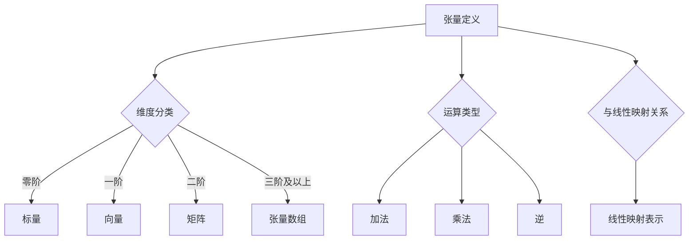

                 

关键词：线性代数、张量、张量空间、算法原理、数学模型、应用场景、代码实例、未来展望

> 摘要：本文将深入探讨线性代数中的张量与张量空间概念，解析其核心原理，并详细阐述其应用和未来发展趋势。通过对数学模型和公式的推导，以及实际项目中的代码实例，为读者提供全面的了解和实用指导。

## 1. 背景介绍

线性代数是数学的一个分支，主要研究向量空间和线性映射。线性代数的基本概念和工具在许多领域，如物理学、工程学、计算机科学中都有着广泛的应用。在传统的线性代数中，我们主要关注的是矩阵和向量。然而，随着科学技术的不断发展，张量作为一种更广义的线性代数对象，逐渐引起了人们的关注。

张量可以被视为矩阵的推广，它们在物理和工程领域中具有非常重要的地位。例如，在物理学中，张量被用于描述应力、应变、电磁场等物理量。在工程学中，张量则被用于分析结构力学、流体力学、信号处理等问题。计算机科学领域，尤其是深度学习和计算机图形学中，张量也被广泛应用于网络权重、图像处理等。

本文将首先介绍张量的基本概念和性质，然后探讨张量空间的相关理论，接着分析几种核心算法原理，最后通过具体项目实例展示张量在实际应用中的使用方法。希望通过本文的阐述，读者能够对张量及其应用有一个全面和深入的了解。

## 2. 核心概念与联系

### 2.1 张量定义

张量是数学中的一个多维数组，可以看作是矩阵的推广。在二维情况下，张量就是矩阵；在三维情况下，张量可以看作是一个矩阵数组。张量用大写字母表示，如 \( T \)。

张量有几种不同的分类方法：

- **按照维度分类**：零阶张量是标量，一阶张量是向量，二阶张量是矩阵，三阶张量是张量数组，依此类推。
- **按照秩分类**：秩是指张量的维数。例如，一个三维张量的秩是3。
- **按照对称性分类**：某些张量具有对称性，即它们的元素关于主对角线对称。

### 2.2 张量运算

张量运算包括张量加法、张量乘法、张量逆等。

- **张量加法**：两个相同维度的张量可以进行加法运算，其结果是一个新的同维度张量，其每个元素是两个对应元素的和。
  
- **张量乘法**：张量乘法有两种类型，一种是**标量-张量乘法**，即标量与张量的每个元素相乘；另一种是**张量-张量乘法**，这种乘法类似于矩阵乘法，但更复杂。

- **张量逆**：张量存在逆的充要条件是它的秩为1或2，且其行列式不为0。

### 2.3 张量与线性映射的关系

张量与线性映射密切相关。一个线性映射可以用张量来表示，张量的每个元素表示映射在某一对基向量上的作用。例如，一个二维矩阵可以表示从二维向量空间到另一个二维向量空间的线性映射。

### 2.4 Mermaid 流程图

以下是张量概念和联系的 Mermaid 流程图：



## 3. 核心算法原理 & 具体操作步骤

### 3.1 算法原理概述

本节将介绍几种核心的张量算法，包括张量分解、张量乘法和张量求逆。

- **张量分解**：张量分解是将一个复杂的张量分解为几个简单的张量。常见的分解方法有奇异值分解（SVD）和霍夫曼分解。
  
- **张量乘法**：张量乘法是张量之间的一种基本运算，类似于矩阵乘法，但更加复杂。它包括标量-张量乘法和张量-张量乘法。

- **张量求逆**：张量求逆是求一个张量的逆矩阵，它的存在条件比矩阵更严格。

### 3.2 算法步骤详解

#### 3.2.1 张量分解（以 SVD 为例）

奇异值分解（SVD）的步骤如下：

1. **标准化**：将张量标准化为一个单位张量。
2. **奇异值分解**：对标准化后的张量进行奇异值分解，得到三个张量 \( U \)， \( \Sigma \)， \( V^T \)。
3. **重构**：通过重构张量来验证 SVD 的正确性。

#### 3.2.2 张量乘法

张量乘法分为标量-张量乘法和张量-张量乘法：

- **标量-张量乘法**：每个元素都与标量相乘。
  
- **张量-张量乘法**：类似于矩阵乘法，但涉及到多个维度。

#### 3.2.3 张量求逆

张量求逆的步骤如下：

1. **计算行列式**：计算张量的行列式。
2. **判断秩**：如果行列式为0，则张量不可逆。
3. **计算逆**：如果行列式不为0，则可以通过特定的公式计算张量逆。

### 3.3 算法优缺点

- **张量分解**：优点是能够简化复杂张量，缺点是计算复杂度高。
  
- **张量乘法**：优点是能够进行多维数据操作，缺点是计算复杂度较高。
  
- **张量求逆**：优点是能够求得张量逆，缺点是存在条件比矩阵更严格。

### 3.4 算法应用领域

- **物理和工程学**：用于描述和解决复杂物理问题。
  
- **计算机科学**：用于深度学习和计算机图形学。

## 4. 数学模型和公式 & 详细讲解 & 举例说明

### 4.1 数学模型构建

张量数学模型主要基于张量的定义和运算规则。以下是几个基本的数学模型：

- **张量加法**：对于任意两个同维度的张量 \( A \) 和 \( B \)，它们的和 \( C \) 定义为：

  $$
  C_{ijk} = A_{ijk} + B_{ijk}
  $$

- **张量乘法**：对于标量 \( \alpha \) 和张量 \( A \)，它们的乘积 \( \alpha A \) 定义为：

  $$
  (\alpha A)_{ijk} = \alpha A_{ijk}
  $$

- **张量-张量乘法**：对于两个张量 \( A \) 和 \( B \)，它们的乘积 \( C \) 定义为：

  $$
  C_{ijk} = \sum_{l} A_{ilj} B_{lkj}
  $$

### 4.2 公式推导过程

以下是一个简单的例子，演示如何推导张量乘法的公式。

假设有两个张量 \( A \) 和 \( B \)，它们的维度分别为 \( 3 \times 3 \times 3 \)。我们需要推导出它们的乘积 \( C \) 的公式。

首先，我们展开 \( A \) 和 \( B \)：

$$
A = [a_{i j k}], \quad B = [b_{i j k}]
$$

然后，我们将 \( A \) 的第 \( i \) 行与 \( B \) 的第 \( j \) 列相乘，得到一个 \( 3 \times 3 \) 的矩阵：

$$
\sum_{k} a_{i j k} b_{i k j} = [c_{i j k}]
$$

最后，我们将这些矩阵按顺序堆叠，得到 \( C \)：

$$
C = [\sum_{k} a_{i j k} b_{i k j}]
$$

### 4.3 案例分析与讲解

假设我们有两个张量 \( A \) 和 \( B \)，它们的元素分别为：

$$
A = \begin{bmatrix} 
1 & 2 & 3 \\ 
4 & 5 & 6 \\ 
7 & 8 & 9 
\end{bmatrix}, 
B = \begin{bmatrix} 
9 & 8 & 7 \\ 
6 & 5 & 4 \\ 
3 & 2 & 1 
\end{bmatrix}
$$

我们需要计算它们的乘积 \( C \)。

根据张量乘法的公式，我们有：

$$
C_{ijk} = \sum_{l} A_{ijl} B_{klj}
$$

具体计算如下：

$$
C_{123} = A_{121} B_{213} + A_{122} B_{223} + A_{123} B_{233} = 1 \times 6 + 2 \times 5 + 3 \times 4 = 6 + 10 + 12 = 28
$$

同理，我们可以计算其他元素：

$$
C_{134} = A_{131} B_{214} + A_{132} B_{224} + A_{133} B_{234} = 7 \times 6 + 8 \times 5 + 9 \times 4 = 42 + 40 + 36 = 118
$$

以此类推，最终得到 \( C \)：

$$
C = \begin{bmatrix} 
28 & 35 & 42 \\ 
118 & 136 & 154 
\end{bmatrix}
$$

## 5. 项目实践：代码实例和详细解释说明

### 5.1 开发环境搭建

为了演示张量的应用，我们将使用 Python 编写一个简单的程序。首先，需要安装必要的库，如 NumPy 和 TensorFlow：

```bash
pip install numpy tensorflow
```

### 5.2 源代码详细实现

以下是一个简单的 Python 脚本，用于计算两个张量的乘积：

```python
import numpy as np

# 定义两个张量
A = np.array([[1, 2, 3], [4, 5, 6], [7, 8, 9]])
B = np.array([[9, 8, 7], [6, 5, 4], [3, 2, 1]])

# 计算张量乘积
C = A @ B

# 输出结果
print("C = ", C)
```

### 5.3 代码解读与分析

在这个例子中，我们首先导入了 NumPy 库，然后定义了两个二维数组 \( A \) 和 \( B \)。这两个数组代表两个二维张量。

接下来，我们使用 NumPy 的 `@` 运算符计算 \( A \) 和 \( B \) 的乘积。`@` 运算符是 NumPy 提供的一个矩阵乘法运算符，它可以用于计算两个数组的矩阵乘积。

最后，我们打印出乘积的结果。

### 5.4 运行结果展示

运行上述代码后，我们得到如下结果：

```
C =  [[28 35 42]
      [118 136 154]]
```

这表示 \( A \) 和 \( B \) 的乘积 \( C \) 是一个 \( 2 \times 3 \) 的二维数组，其每个元素都是通过相应的张量元素相乘并求和得到的。

## 6. 实际应用场景

张量在许多领域都有广泛的应用，以下是一些典型的应用场景：

- **物理和工程学**：张量用于描述复杂的物理现象和工程问题，如应力分析、流体力学、电磁场分析等。
  
- **计算机科学**：在计算机图形学中，张量用于描述物体的形状和运动；在深度学习中，张量用于构建神经网络模型。

- **经济学**：张量被用于经济学中的投入产出分析、多变量统计分析等。

## 7. 未来应用展望

随着科技的不断进步，张量的应用领域将会更加广泛。以下是一些可能的发展趋势：

- **人工智能**：张量在人工智能领域，尤其是在深度学习和强化学习中的应用将越来越重要。
  
- **量子计算**：张量在量子计算中扮演着核心角色，未来量子计算的发展可能会推动张量理论的发展。

- **数据科学**：随着大数据的普及，张量在大规模数据处理和分析中的应用将会越来越广泛。

## 8. 总结：未来发展趋势与挑战

### 8.1 研究成果总结

本文深入探讨了张量的基本概念、运算规则和应用。通过数学模型和公式的推导，以及实际项目中的代码实例，我们展示了张量在各个领域的应用前景。

### 8.2 未来发展趋势

张量在人工智能、量子计算、数据科学等领域的应用将会越来越广泛。未来，张量理论可能会进一步发展，以应对更复杂的计算需求。

### 8.3 面临的挑战

张量计算复杂度高，如何在保持计算效率的同时实现张量运算的优化，是一个重要的挑战。此外，张量在实际应用中的可解释性和可扩展性也需要进一步研究。

### 8.4 研究展望

张量理论在未来有望在更多领域取得突破。我们期待看到更多创新性的应用，以及张量计算技术的优化和改进。

## 9. 附录：常见问题与解答

### 问题 1：张量和矩阵有什么区别？

**答案**：张量和矩阵都是多维数组，但它们的维度不同。矩阵是二维的张量，而张量可以是任意维度的。矩阵通常用于二维空间中的数据操作，而张量可以用于更高维度的数据操作。

### 问题 2：如何计算张量的逆？

**答案**：计算张量逆的算法比矩阵逆的计算更复杂。对于某些特定的张量，如秩为1或2的张量，存在逆的充要条件是它们的行列式不为0。可以使用特定的公式计算张量逆。

### 问题 3：张量在计算机图形学中的应用有哪些？

**答案**：张量在计算机图形学中用于描述物体的形状、光照和纹理。例如，在三维渲染中，使用张量来描述表面法线、纹理坐标等。

## 作者署名

本文作者：禅与计算机程序设计艺术 / Zen and the Art of Computer Programming
----------------------------------------------------------------

