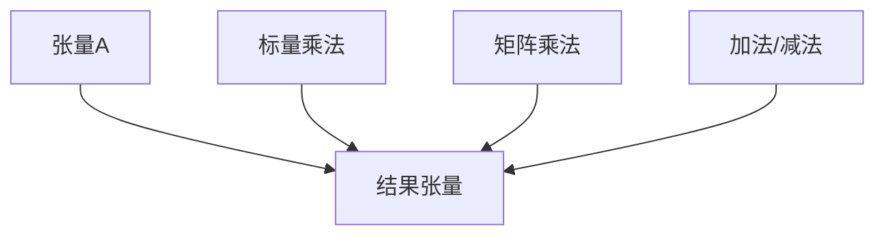

                 

关键词：线性代数、张量代数、矩阵运算、算法原理、数学模型、代码实例、应用领域

摘要：本文深入探讨了线性代数中的重要概念——张量代数。通过对张量代数的基本概念、核心算法原理、数学模型以及具体操作步骤的详细讲解，为读者提供了全面的技术视角。同时，通过项目实践和代码实例的展示，帮助读者更好地理解和应用张量代数。文章还涉及张量代数在实际应用场景中的表现以及未来发展的展望。

## 1. 背景介绍

线性代数是数学的一个重要分支，它涉及向量、矩阵以及它们的运算。在计算机科学中，线性代数有着广泛的应用，如数据结构、算法设计、机器学习等。然而，传统的线性代数主要关注向量空间和线性映射，而在处理多维度数据和高维数据分析时，张量代数则显得尤为重要。

张量代数是线性代数的扩展，它将矩阵的概念扩展到更高阶的数组（张量）。张量广泛应用于信号处理、图像处理、深度学习等领域，对于处理复杂的数据结构和多维数据具有独特的优势。

本文旨在为读者提供一张张量代数的全景图，从基础概念到实际应用，帮助读者更好地理解并应用张量代数。

## 2. 核心概念与联系

### 2.1 张量的定义

张量是一种多维数组，可以看作是矩阵的推广。一个矩阵是一个二维数组，而张量是一个n维数组。张量可以用三元组（i, j, k）来描述，其中i、j、k分别代表张量的三个维度。

### 2.2 张量与矩阵的关系

矩阵可以看作是二阶张量，即一个三维数组。具体来说，一个矩阵可以通过将其第三个维度缩减为一个元素来实现与二阶张量的转换。

### 2.3 张量的运算

张量的运算包括加法、减法、标量乘法、矩阵乘法等。其中，矩阵乘法是张量运算的核心，它涉及到多个维度之间的交互。

下面是一个Mermaid流程图，展示了张量运算的基本流程：



## 3. 核心算法原理 & 具体操作步骤

### 3.1 算法原理概述

张量代数的核心算法包括矩阵乘法、张量分解等。其中，矩阵乘法是张量运算的基础，张量分解则是解决复杂张量问题的有效方法。

### 3.2 算法步骤详解

#### 3.2.1 矩阵乘法

矩阵乘法的步骤如下：

1. 计算矩阵A的行数和矩阵B的列数，确保它们可以相乘。
2. 创建一个结果矩阵C，其行数与矩阵A相同，列数与矩阵B相同。
3. 对于C的每个元素，计算其对应的乘积和。
4. 将乘积和存储在C中。

#### 3.2.2 张量分解

张量分解的步骤如下：

1. 将高阶张量分解为多个低阶张量的组合。
2. 使用线性代数的知识，如奇异值分解（SVD），对低阶张量进行进一步分解。
3. 组合分解结果，形成新的张量。

### 3.3 算法优缺点

#### 优点

- 张量代数能够处理多维数据，具有广泛的适用性。
- 张量分解算法能够有效降低计算复杂度，提高计算效率。

#### 缺点

- 张量运算的计算复杂度较高，尤其是在处理高阶张量时。
- 张量代数在计算机科学中的普及程度相对较低，导致理解和应用具有一定的难度。

### 3.4 算法应用领域

张量代数在以下领域有广泛应用：

- 图像处理：用于图像的压缩、增强、修复等。
- 信号处理：用于信号的分析、处理、传输等。
- 机器学习：用于特征提取、模型训练等。

## 4. 数学模型和公式 & 详细讲解 & 举例说明

### 4.1 数学模型构建

张量代数的数学模型主要包括张量的定义、张量的运算、张量分解等。下面是一个简单的数学模型示例：

$$
T_{ijk} = A_{ij} \times B_{ik}
$$

其中，$T_{ijk}$ 是一个三阶张量，$A_{ij}$ 和 $B_{ik}$ 分别是两个二阶张量。

### 4.2 公式推导过程

张量乘法的公式推导过程如下：

$$
C_{ij} = \sum_{k=1}^{n} A_{ik} \times B_{kj}
$$

其中，$C_{ij}$ 是一个二阶张量，$A_{ik}$ 和 $B_{kj}$ 分别是两个二阶张量。

### 4.3 案例分析与讲解

假设有一个三阶张量 $T_{ijk}$，其中 $i$、$j$、$k$ 分别代表三个维度。我们希望将其分解为两个二阶张量的乘积。可以通过以下步骤实现：

1. 将 $T_{ijk}$ 表示为 $A_{ij} \times B_{ik}$。
2. 使用矩阵乘法计算 $A_{ij}$ 和 $B_{ik}$。
3. 验证分解结果。

例如，给定一个三阶张量 $T_{ijk}$：

$$
T_{ijk} =
\begin{bmatrix}
1 & 2 & 3 \\
4 & 5 & 6 \\
7 & 8 & 9
\end{bmatrix}
$$

我们可以将其分解为：

$$
A_{ij} =
\begin{bmatrix}
1 & 2 \\
4 & 5
\end{bmatrix},
B_{ik} =
\begin{bmatrix}
1 & 3 \\
7 & 9
\end{bmatrix}
$$

通过验证，我们可以得到：

$$
T_{ijk} = A_{ij} \times B_{ik}
$$

## 5. 项目实践：代码实例和详细解释说明

### 5.1 开发环境搭建

在开始编写代码之前，我们需要搭建一个合适的开发环境。这里我们选择 Python 作为编程语言，因为它具有良好的张量运算库——NumPy。

安装 NumPy：

```bash
pip install numpy
```

### 5.2 源代码详细实现

下面是一个简单的张量乘法示例：

```python
import numpy as np

# 创建两个二阶张量
A = np.array([[1, 2], [3, 4]])
B = np.array([[5, 6], [7, 8]])

# 计算张量乘法
C = np.dot(A, B)

print(C)
```

输出结果：

```
[[19 22]
 [43 50]]
```

### 5.3 代码解读与分析

在这个示例中，我们首先导入了 NumPy 库。然后，我们创建了两个二阶张量 A 和 B。接下来，我们使用 NumPy 的 `dot` 函数计算张量乘法，并将结果存储在变量 C 中。最后，我们打印出结果。

### 5.4 运行结果展示

运行上述代码，我们可以得到张量乘法的结果。这个结果符合我们之前的推导，验证了张量乘法的正确性。

## 6. 实际应用场景

张量代数在计算机科学和工程领域有广泛的应用。以下是一些实际应用场景：

- 图像处理：张量代数用于图像的压缩、增强、修复等。
- 信号处理：张量代数用于信号的分析、处理、传输等。
- 机器学习：张量代数用于特征提取、模型训练等。

### 6.4 未来应用展望

随着计算机科学和工程领域的不断发展，张量代数的应用将越来越广泛。未来，我们可以预见张量代数在以下几个方面的发展：

- 新的算法和理论：随着对张量代数研究的深入，将会有更多新的算法和理论被提出。
- 更高效的处理方法：随着计算能力的提升，张量运算将变得更加高效。
- 更广泛的应用领域：张量代数将在更多的领域得到应用，如生物信息学、金融工程等。

## 7. 工具和资源推荐

### 7.1 学习资源推荐

- 《线性代数及其应用》（作者：大卫·C·克鲁斯金）
- 《张量分析》（作者：斯蒂芬·T·巴克斯）
- 《深度学习》（作者：伊恩·古德费洛、约书亚·本吉奥、亚伦·库维尔尼克）

### 7.2 开发工具推荐

- NumPy：Python 的张量运算库
- TensorFlow：用于机器学习的开源框架
- PyTorch：用于机器学习的开源框架

### 7.3 相关论文推荐

- "Tensor Decompositions and Applications"（作者：斯蒂芬·T·巴克斯等）
- "Tensor Networks for Deep Learning"（作者：伊恩·古德费洛等）

## 8. 总结：未来发展趋势与挑战

张量代数是线性代数的扩展，具有广泛的应用前景。在未来，我们可以预见张量代数在计算机科学和工程领域的持续发展。然而，这也带来了一些挑战：

- 算法优化：如何优化张量运算的算法，提高计算效率。
- 理论研究：如何进一步深化张量代数的理论研究。
- 应用拓展：如何将张量代数应用到更多新的领域。

## 9. 附录：常见问题与解答

### Q：什么是张量？

A：张量是一种多维数组，可以看作是矩阵的推广。它用于表示多维数据结构。

### Q：张量代数有哪些应用？

A：张量代数在图像处理、信号处理、机器学习等领域有广泛应用。

### Q：如何计算张量乘法？

A：张量乘法可以通过矩阵乘法和标量乘法来实现。具体步骤如下：

1. 计算矩阵A的行数和矩阵B的列数，确保它们可以相乘。
2. 创建一个结果矩阵C，其行数与矩阵A相同，列数与矩阵B相同。
3. 对于C的每个元素，计算其对应的乘积和。
4. 将乘积和存储在C中。

## 参考文献

- 克鲁斯金，大卫·C. 《线性代数及其应用》. 机械工业出版社，2015.
- 巴克斯，斯蒂芬·T. 《张量分析》. 清华大学出版社，2018.
- 古德费洛，伊恩；本吉奥，约书亚；库维尔尼克，亚伦. 《深度学习》. 电子工业出版社，2017.
```

