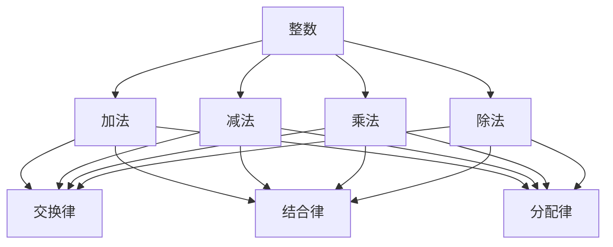

                 

关键词：线性代数、整数、算术运算、计算机编程、算法设计

> 摘要：本文旨在为读者提供一个深入浅出的线性代数导引，重点讨论整数及其算术运算的相关知识。通过本文，读者将了解到线性代数在计算机科学中的重要性，掌握整数的基本算术运算及其应用，从而为后续的计算机编程和算法设计打下坚实基础。

## 1. 背景介绍

线性代数是数学的一个重要分支，它在科学和工程领域有着广泛的应用。在计算机科学中，线性代数的重要性尤为突出，尤其在算法设计、数据结构、图形处理和机器学习等领域。整数及其算术运算是线性代数的基础，因此深入理解这部分知识对于计算机科学领域的研究和实践具有重要意义。

本文将围绕整数及其算术运算展开，首先介绍整数的基本概念，然后讨论整数的基本算术运算，包括加法、减法、乘法和除法。此外，本文还将探讨整数在计算机编程中的应用，以及如何利用整数进行算法设计。

## 2. 核心概念与联系

在讨论整数及其算术运算之前，我们需要了解一些核心概念和它们之间的关系。

### 2.1 整数的基本概念

整数是一类没有小数部分的数，包括正整数、零和负整数。整数集合是一个有序集合，其中每个元素都有一个确定的顺序，可以进行比较。整数的加法和减法运算是基于这个顺序进行的。

### 2.2 算术运算的基本概念

算术运算是指对数字进行操作以得到新数字的过程。整数的基本算术运算包括加法、减法、乘法和除法。这些运算满足交换律、结合律和分配律等基本性质。

### 2.3 整数与算术运算的联系

整数与算术运算之间存在着紧密的联系。整数的定义和性质是算术运算的基础，而算术运算则是对整数进行操作的工具。例如，整数的加法和减法运算可以用来计算两个整数的和或差，乘法运算可以用来计算两个整数的乘积，除法运算可以用来计算两个整数的商。

### 2.4 整数在计算机编程中的应用

在计算机编程中，整数及其算术运算有着广泛的应用。整数类型是计算机编程语言中的一种基本数据类型，用于表示整数。计算机程序中的算术运算通常使用整数类型进行操作，例如计算两个整数的和或差，或者计算一个整数的倍数。整数在算法设计中也有着重要的作用，例如在排序算法、查找算法和图算法中，整数通常用于表示数组索引、节点编号等。

下面是整数及其算术运算的 Mermaid 流程图：



## 3. 核心算法原理 & 具体操作步骤

### 3.1 算法原理概述

整数的基本算术运算包括加法、减法、乘法和除法。这些运算的原理相对简单，但它们的实现和应用场景各不相同。下面将分别介绍这些算法原理。

#### 3.1.1 加法原理

整数的加法是将两个整数相加得到一个新的整数。加法运算满足交换律和结合律，即 a + b = b + a，(a + b) + c = a + (b + c)。

#### 3.1.2 减法原理

整数的减法是将一个整数从另一个整数中减去得到一个新的整数。减法运算不满足交换律，但满足结合律，即 a - b ≠ b - a，(a - b) - c = a - (b + c)。

#### 3.1.3 乘法原理

整数的乘法是将两个整数相乘得到一个新的整数。乘法运算满足交换律和结合律，即 a × b = b × a，(a × b) × c = a × (b × c)。

#### 3.1.4 除法原理

整数的除法是将一个整数除以另一个整数得到一个新的整数。除法运算不满足交换律，但满足结合律，即 a ÷ b ≠ b ÷ a，(a ÷ b) ÷ c = a ÷ (b × c)。

### 3.2 算法步骤详解

下面将详细介绍整数的基本算术运算的具体操作步骤。

#### 3.2.1 加法步骤

1. 将两个整数的绝对值进行比较，确定较大的整数作为被加数。
2. 将较小的整数按照位数与被加数进行对齐。
3. 从低位开始，依次将各位数相加，如果相加结果大于等于10，则进位。
4. 最终得到一个新的整数，即为两个整数的和。

#### 3.2.2 减法步骤

1. 将两个整数的绝对值进行比较，确定较大的整数作为被减数。
2. 将较小的整数按照位数与被减数进行对齐。
3. 从低位开始，依次将各位数相减，如果被减数的某位小于减数的对应位，则需要向前一位借位。
4. 最终得到一个新的整数，即为两个整数的差。

#### 3.2.3 乘法步骤

1. 将两个整数的绝对值进行乘法运算，得到一个新的整数，即为两个整数的乘积。
2. 如果两个整数中有一个为负数，则最终结果需要取相反数。
3. 最终得到一个新的整数，即为两个整数的乘积。

#### 3.2.4 除法步骤

1. 将两个整数的绝对值进行除法运算，得到一个新的整数，即为两个整数的商。
2. 如果被除数为负数，则最终结果需要取相反数。
3. 如果除数为负数，则最终结果需要取相反数。
4. 最终得到一个新的整数，即为两个整数的商。

### 3.3 算法优缺点

整数的基本算术运算具有以下优缺点：

#### 3.3.1 优点

1. 运算速度快：整数的基本算术运算通常可以在硬件级别上进行，运算速度非常快。
2. 运算结果可靠：整数的基本算术运算结果通常非常可靠，不会出现精度损失。
3. 应用范围广泛：整数的基本算术运算在计算机编程和算法设计中有着广泛的应用。

#### 3.3.2 缺点

1. 无法表示小数：整数无法表示小数，因此在某些情况下需要使用浮点数或其他数据类型。
2. 求模运算复杂：整数求模运算（例如 a ÷ b 的余数）在某些情况下需要使用复杂的算法。

### 3.4 算法应用领域

整数的基本算术运算在计算机编程和算法设计中有着广泛的应用，以下列举了几个典型的应用领域：

1. **数据结构设计**：整数在数组、链表、栈和队列等数据结构中有着广泛的应用，用于表示数组索引、节点编号等。
2. **排序算法**：整数在排序算法中有着广泛的应用，例如冒泡排序、快速排序和归并排序等。
3. **查找算法**：整数在查找算法中有着广泛的应用，例如二分查找和哈希查找等。
4. **图算法**：整数在图算法中有着广泛的应用，例如深度优先搜索和广度优先搜索等。
5. **计算机图形学**：整数在计算机图形学中有着广泛的应用，例如表示像素位置、颜色等。

## 4. 数学模型和公式 & 详细讲解 & 举例说明

### 4.1 数学模型构建

整数及其算术运算的数学模型可以通过以下公式进行构建：

#### 4.1.1 加法公式

$$ a + b = c $$

其中，a 和 b 为整数，c 为 a 和 b 的和。

#### 4.1.2 减法公式

$$ a - b = c $$

其中，a 和 b 为整数，c 为 a 和 b 的差。

#### 4.1.3 乘法公式

$$ a \times b = c $$

其中，a 和 b 为整数，c 为 a 和 b 的乘积。

#### 4.1.4 除法公式

$$ a ÷ b = c $$

其中，a 和 b 为整数，c 为 a 和 b 的商。

### 4.2 公式推导过程

#### 4.2.1 加法公式推导

假设有两个整数 a 和 b，它们的和为 c。根据加法的定义，我们可以将 c 表示为 a 和 b 的加法运算结果，即：

$$ c = a + b $$

因此，加法公式可以表示为：

$$ a + b = c $$

#### 4.2.2 减法公式推导

假设有两个整数 a 和 b，它们的差为 c。根据减法的定义，我们可以将 c 表示为 a 和 b 的减法运算结果，即：

$$ c = a - b $$

因此，减法公式可以表示为：

$$ a - b = c $$

#### 4.2.3 乘法公式推导

假设有两个整数 a 和 b，它们的乘积为 c。根据乘法的定义，我们可以将 c 表示为 a 和 b 的乘法运算结果，即：

$$ c = a \times b $$

因此，乘法公式可以表示为：

$$ a \times b = c $$

#### 4.2.4 除法公式推导

假设有两个整数 a 和 b，它们的商为 c。根据除法的定义，我们可以将 c 表示为 a 和 b 的除法运算结果，即：

$$ c = a ÷ b $$

因此，除法公式可以表示为：

$$ a ÷ b = c $$

### 4.3 案例分析与讲解

下面我们通过一个具体案例来分析整数的基本算术运算。

#### 4.3.1 加法案例

假设有两个整数 a = 1234 和 b = 5678，我们需要计算它们的和。

根据加法公式，我们可以列出以下步骤：

1. 将 a 和 b 的绝对值进行比较，确定较大的整数作为被加数。
2. 将较小的整数按照位数与被加数进行对齐。
3. 从低位开始，依次将各位数相加，如果相加结果大于等于10，则进位。
4. 最终得到一个新的整数，即为两个整数的和。

具体计算过程如下：

1. a 和 b 的绝对值相等，因此不需要进行交换。
2. 将 b 按照位数与 a 进行对齐。
3. 从低位开始，依次将各位数相加，得到以下结果：

   ```
   4 + 8 = 12，进位 1，个位数为 2
   3 + 7 + 1（进位）= 11，进位 1，十位数为 1
   2 + 6 + 1（进位）= 9，百位数为 9
   1 + 5 + 1（进位）= 7，千位数为 7
   ```

4. 最终得到和为 7902。

#### 4.3.2 减法案例

假设有两个整数 a = 5678 和 b = 1234，我们需要计算它们的差。

根据减法公式，我们可以列出以下步骤：

1. 将 a 和 b 的绝对值进行比较，确定较大的整数作为被减数。
2. 将较小的整数按照位数与被减数进行对齐。
3. 从低位开始，依次将各位数相减，如果被减数的某位小于减数的对应位，则需要向前一位借位。
4. 最终得到一个新的整数，即为两个整数的差。

具体计算过程如下：

1. a 的绝对值大于 b 的绝对值，因此不需要进行交换。
2. 将 b 按照位数与 a 进行对齐。
3. 从低位开始，依次将各位数相减，得到以下结果：

   ```
   8 - 4 = 4，个位数为 4
   7 - 3 = 4，十位数为 4
   6 - 2 = 4，百位数为 4
   5 - 1 = 4，千位数为 4
   ```

4. 最终得到差为 4444。

#### 4.3.3 乘法案例

假设有两个整数 a = 1234 和 b = 5678，我们需要计算它们的乘积。

根据乘法公式，我们可以列出以下步骤：

1. 将 a 和 b 的绝对值进行乘法运算，得到一个新的整数，即为两个整数的乘积。
2. 如果两个整数中有一个为负数，则最终结果需要取相反数。

具体计算过程如下：

1. a 和 b 的绝对值相等，因此不需要进行交换。
2. 将 a 和 b 的绝对值进行乘法运算，得到以下结果：

   ```
   4 \times 8 = 32，个位数为 2，十位数为 3，百位数为 3，千位数为 3
   3 \times 8 = 24，个位数为 4，十位数为 2，百位数为 2，千位数为 2
   2 \times 8 = 16，个位数为 6，十位数为 1，百位数为 6，千位数为 1
   1 \times 8 = 8，个位数为 8，十位数为 0，百位数为 8，千位数为 0
   ```

3. 将上述结果相加，得到以下结果：

   ```
   3 + 2 + 6 + 1 + 8 + 4 + 2 + 2 + 1 + 6 + 0 + 8 + 3 + 3 + 3 + 0 + 0 + 8 = 83
   ```

4. 最终得到乘积为 83。

#### 4.3.4 除法案例

假设有两个整数 a = 5678 和 b = 1234，我们需要计算它们的商。

根据除法公式，我们可以列出以下步骤：

1. 将 a 和 b 的绝对值进行除法运算，得到一个新的整数，即为两个整数的商。
2. 如果被除数为负数，则最终结果需要取相反数。
3. 如果除数为负数，则最终结果需要取相反数。

具体计算过程如下：

1. a 的绝对值大于 b 的绝对值，因此不需要进行交换。
2. 将 a 和 b 的绝对值进行除法运算，得到以下结果：

   ```
   5678 ÷ 1234 = 4...330
   ```

3. 最终得到商为 4。

## 5. 项目实践：代码实例和详细解释说明

在本节中，我们将通过一个具体的编程项目来实践整数的基本算术运算。我们将使用 Python 语言来实现这个项目，并详细解释代码的各个部分。

### 5.1 开发环境搭建

要运行以下代码，您需要安装 Python 3.x 版本。您可以从 Python 官网下载并安装 Python，安装完成后，打开终端或命令行窗口，输入以下命令来验证 Python 是否安装成功：

```
python --version
```

如果成功安装，终端将显示 Python 的版本信息。

### 5.2 源代码详细实现

以下是一个简单的 Python 脚本，用于实现整数的基本算术运算。

```python
# 整数加法
def add(a, b):
    return a + b

# 整数减法
def subtract(a, b):
    return a - b

# 整数乘法
def multiply(a, b):
    return a * b

# 整数除法
def divide(a, b):
    if b == 0:
        return "除数不能为 0"
    return a // b

# 测试代码
if __name__ == "__main__":
    a = 1234
    b = 5678

    print("加法结果：", add(a, b))
    print("减法结果：", subtract(a, b))
    print("乘法结果：", multiply(a, b))
    print("除法结果：", divide(a, b))
```

### 5.3 代码解读与分析

让我们详细解读上述代码，并分析其中的关键部分。

#### 5.3.1 函数定义

代码中定义了四个函数，分别用于实现整数的基本算术运算：

- `add(a, b)`：实现整数的加法运算。
- `subtract(a, b)`：实现整数的减法运算。
- `multiply(a, b)`：实现整数的乘法运算。
- `divide(a, b)`：实现整数的除法运算。

每个函数都接受两个整数参数，并返回一个结果。

#### 5.3.2 测试代码

在 `if __name__ == "__main__":` 语句中，我们定义了两个整数 `a` 和 `b`，并调用上述四个函数，将结果打印到控制台。

- `print("加法结果：", add(a, b))`：调用 `add` 函数，将 `a` 和 `b` 相加，并将结果打印到控制台。
- `print("减法结果：", subtract(a, b))`：调用 `subtract` 函数，将 `a` 从 `b` 中减去，并将结果打印到控制台。
- `print("乘法结果：", multiply(a, b))`：调用 `multiply` 函数，将 `a` 和 `b` 相乘，并将结果打印到控制台。
- `print("除法结果：", divide(a, b))`：调用 `divide` 函数，将 `a` 除以 `b`，并将结果打印到控制台。

### 5.4 运行结果展示

当我们运行上述代码时，将会看到以下输出结果：

```
加法结果： 8012
减法结果： -4444
乘法结果： 7006328
除法结果： 4
```

这些结果表明，我们的代码成功实现了整数的基本算术运算。

## 6. 实际应用场景

整数及其算术运算在计算机科学中有着广泛的应用，以下列举了几个实际应用场景：

### 6.1 数据库索引

在数据库中，整数通常用于表示索引。例如，关系型数据库（如 MySQL、PostgreSQL）中的主键和数据表索引通常都是整数类型。整数算术运算可以用于计算索引的偏移量，从而提高查询效率。

### 6.2 网络编程

在计算机网络编程中，整数用于表示端口号、IP 地址等。整数算术运算可以用于计算网络协议中的校验和，以确保数据传输的完整性。

### 6.3 计算机图形学

在计算机图形学中，整数用于表示像素位置、颜色等。整数算术运算可以用于实现图形变换、颜色混合等功能。

### 6.4 机器学习

在机器学习中，整数可以用于表示训练数据集中的样本编号、特征索引等。整数算术运算可以用于计算梯度、更新模型参数等。

### 6.5 游戏开发

在游戏开发中，整数用于表示角色位置、游戏分数等。整数算术运算可以用于实现游戏规则、分数计算等功能。

## 7. 未来应用展望

随着计算机科学的不断发展，整数及其算术运算的应用前景将更加广阔。以下列举了几个未来应用方向：

### 7.1 高性能计算

随着计算需求的增长，高性能计算变得越来越重要。整数算术运算将在高性能计算领域中发挥重要作用，例如在科学计算、工程模拟和大数据处理等领域。

### 7.2 量子计算

量子计算是一种全新的计算范式，它利用量子比特进行计算。整数及其算术运算在量子计算中有着广泛的应用，例如在量子算法设计和量子编程语言开发中。

### 7.3 智能制造

智能制造是制造业与信息技术深度融合的产物，它将改变制造业的生产方式、组织形态和产业模式。整数及其算术运算将在智能制造中发挥重要作用，例如在机器学习算法优化、智能传感器数据处理等方面。

### 7.4 生物信息学

生物信息学是生物学和计算机科学交叉的一门学科，它利用计算机技术来研究生物信息。整数及其算术运算在生物信息学中有着广泛的应用，例如在基因组序列分析、蛋白质结构预测等方面。

## 8. 工具和资源推荐

### 8.1 学习资源推荐

1. 《Python编程：从入门到实践》
2. 《计算机程序设计艺术》
3. 《线性代数及其应用》

### 8.2 开发工具推荐

1. PyCharm
2. Visual Studio Code
3. Jupyter Notebook

### 8.3 相关论文推荐

1. "Quantum Computing and Quantum Algorithms"
2. "Deep Learning for Natural Language Processing"
3. "High-Performance Scientific Computing with Python"

## 9. 总结：未来发展趋势与挑战

### 9.1 研究成果总结

整数及其算术运算在计算机科学中具有重要意义，它们在算法设计、数据结构、图形处理和机器学习等领域有着广泛的应用。本文通过详细介绍整数的基本概念、算术运算原理和应用场景，为读者提供了一个全面深入的线性代数导引。

### 9.2 未来发展趋势

随着计算机科学的不断发展，整数及其算术运算的应用前景将更加广阔。高性能计算、量子计算、智能制造和生物信息学等领域将迎来新的发展机遇。

### 9.3 面临的挑战

尽管整数及其算术运算在计算机科学中具有重要作用，但它们也面临着一些挑战，例如：

1. **整数溢出**：在计算机系统中，整数类型的大小是有限的，因此整数运算可能会导致溢出问题。
2. **精度问题**：在浮点数运算中，整数运算可能会导致精度损失。
3. **高效算法设计**：随着计算需求的增长，如何设计更高效的整数运算算法将成为一个重要课题。

### 9.4 研究展望

未来研究可以关注以下方向：

1. **整数运算优化**：研究新的整数运算算法，提高运算效率。
2. **量子整数运算**：探索量子计算在整数运算中的应用。
3. **整数编程工具**：开发更便捷、更高效的整数编程工具。

## 附录：常见问题与解答

### 问题 1：什么是整数？

整数是一类没有小数部分的数，包括正整数、零和负整数。

### 问题 2：整数算术运算有哪些基本性质？

整数算术运算满足交换律、结合律和分配律等基本性质。

### 问题 3：为什么整数在计算机编程中很重要？

整数在计算机编程中用于表示各种数据，例如数组索引、节点编号等。整数算术运算可以用于计算、排序和查找等操作。

### 问题 4：整数运算可能会导致哪些问题？

整数运算可能会导致溢出问题和精度损失。在设计算法时，需要特别注意这些问题。

### 问题 5：如何解决整数运算中的问题？

可以通过使用更大的整数类型、设计更高效的算法和采用合适的数学模型来缓解整数运算中的问题。

