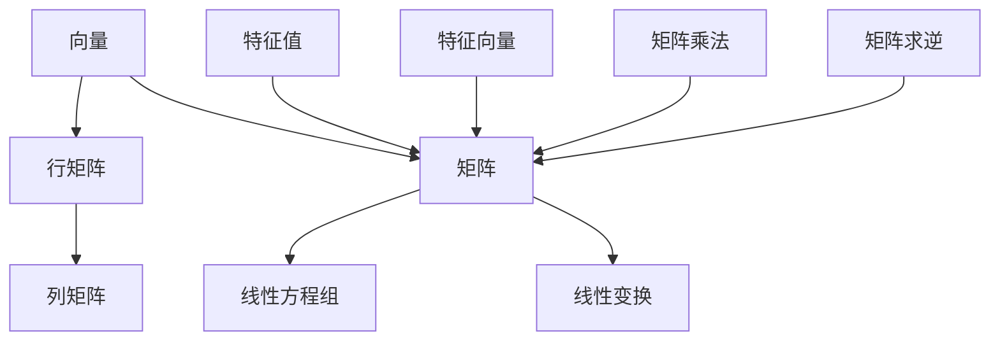

                 

关键词：线性代数、矩阵、向量、算法、数学模型、应用场景、项目实践

## 摘要

本文旨在为读者提供线性代数领域的深入导引，特别是矩阵与向量的核心概念和应用。文章首先回顾了线性代数的基本概念，然后详细介绍了矩阵和向量的基本性质及其相互关系。接下来，我们将探讨核心算法原理，详细解读数学模型和公式，并通过实际项目实例展示矩阵与向量在实际应用中的重要性。最后，本文将对线性代数在各个领域的应用进行展望，并推荐相关学习和开发资源。

## 1. 背景介绍

线性代数是数学的一个分支，主要研究向量空间、线性变换以及这两个概念的线性组合。作为计算机科学的基础，线性代数在计算机图形学、机器学习、算法分析等多个领域有着广泛的应用。矩阵和向量作为线性代数的核心概念，它们不仅在理论研究中具有重要地位，在实际应用中也发挥着关键作用。

矩阵（Matrix）是一个由数字组成的矩形数组，用于表示线性方程组、线性变换等。矩阵的行数称为“行数”，列数称为“列数”。向量的概念则更为基础，可以被视为只有一行的矩阵，或者具有单一元素的数组。向量在物理、工程、经济学等众多领域都有重要应用。

在计算机科学中，矩阵和向量广泛应用于：

- **计算机图形学**：用于表示图像、纹理、模型等。
- **机器学习**：用于构建和优化模型。
- **算法分析**：用于分析算法的时间和空间复杂度。
- **数据分析**：用于处理和可视化大规模数据集。

## 2. 核心概念与联系

下面我们通过一个 Mermaid 流程图来展示矩阵和向量的基本概念及其相互关系。



### 2.1 向量

向量是具有方向和大小的量。在数学中，向量通常表示为一行数组或列数组。

### 2.2 矩阵

矩阵是一个由数字组成的矩形数组。矩阵的基本操作包括矩阵加法、矩阵乘法、求逆等。

### 2.3 线性方程组

线性方程组由多个线性方程组成，矩阵可以表示线性方程组的解。

### 2.4 线性变换

线性变换是保持向量线性组合的变换，矩阵可以表示线性变换。

### 2.5 特征值与特征向量

特征值和特征向量是矩阵的基本性质，用于分析矩阵的稳定性。

### 2.6 矩阵乘法

矩阵乘法是线性代数中最重要的运算之一，用于计算线性组合。

### 2.7 求逆

求逆是矩阵的基本操作之一，用于解线性方程组和进行矩阵变换。

## 3. 核心算法原理 & 具体操作步骤

### 3.1 算法原理概述

线性代数的核心算法主要包括矩阵的加法、矩阵乘法、求逆等。这些算法在计算机科学和工程领域有着广泛应用。

### 3.2 算法步骤详解

#### 3.2.1 矩阵加法

矩阵加法是将两个同型矩阵的对应元素相加。步骤如下：

1. 确保两个矩阵的行数和列数相同。
2. 对应元素相加。

例如，给定矩阵 A 和 B：

$$
A = \begin{bmatrix}
1 & 2 \\
3 & 4
\end{bmatrix}, B = \begin{bmatrix}
5 & 6 \\
7 & 8
\end{bmatrix}
$$

矩阵加法结果为：

$$
A + B = \begin{bmatrix}
1+5 & 2+6 \\
3+7 & 4+8
\end{bmatrix} = \begin{bmatrix}
6 & 8 \\
10 & 12
\end{bmatrix}
$$

#### 3.2.2 矩阵乘法

矩阵乘法是将两个矩阵的对应元素相乘并求和。步骤如下：

1. 确保第一个矩阵的列数与第二个矩阵的行数相同。
2. 计算乘积。

例如，给定矩阵 A 和 B：

$$
A = \begin{bmatrix}
1 & 2 \\
3 & 4
\end{bmatrix}, B = \begin{bmatrix}
5 & 6 \\
7 & 8
\end{bmatrix}
$$

矩阵乘法结果为：

$$
A \cdot B = \begin{bmatrix}
1 \cdot 5 + 2 \cdot 7 & 1 \cdot 6 + 2 \cdot 8 \\
3 \cdot 5 + 4 \cdot 7 & 3 \cdot 6 + 4 \cdot 8
\end{bmatrix} = \begin{bmatrix}
19 & 26 \\
31 & 44
\end{bmatrix}
$$

#### 3.2.3 求逆

求逆是通过计算矩阵的逆矩阵来解线性方程组。步骤如下：

1. 确保矩阵是可逆的。
2. 使用高斯消元法或矩阵分解方法求解逆矩阵。

例如，给定矩阵 A：

$$
A = \begin{bmatrix}
1 & 2 \\
3 & 4
\end{bmatrix}
$$

其逆矩阵为：

$$
A^{-1} = \begin{bmatrix}
-2 & 1 \\
\frac{3}{2} & -\frac{1}{2}
\end{bmatrix}
$$

### 3.3 算法优缺点

#### 3.3.1 优缺点

- **矩阵加法**：简单，计算速度快。
- **矩阵乘法**：复杂度较高，但在计算机科学中广泛应用。
- **求逆**：计算复杂度较高，但用于解线性方程组和其他应用场景。

### 3.4 算法应用领域

线性代数的算法在计算机科学和工程领域有广泛应用，包括：

- **计算机图形学**：用于图像处理、渲染等。
- **机器学习**：用于模型构建和优化。
- **算法分析**：用于分析算法复杂度。
- **数据分析**：用于数据预处理和可视化。

## 4. 数学模型和公式 & 详细讲解 & 举例说明

### 4.1 数学模型构建

线性代数的数学模型主要包括向量、矩阵、线性方程组、线性变换等。这些模型构成了线性代数的基础。

#### 4.1.1 向量

向量可以表示为：

$$
\vec{v} = \begin{bmatrix}
v_1 \\
v_2 \\
\vdots \\
v_n
\end{bmatrix}
$$

#### 4.1.2 矩阵

矩阵可以表示为：

$$
A = \begin{bmatrix}
a_{11} & a_{12} & \cdots & a_{1n} \\
a_{21} & a_{22} & \cdots & a_{2n} \\
\vdots & \vdots & \ddots & \vdots \\
a_{m1} & a_{m2} & \cdots & a_{mn}
\end{bmatrix}
$$

#### 4.1.3 线性方程组

线性方程组可以表示为：

$$
\begin{cases}
a_{11}x_1 + a_{12}x_2 + \cdots + a_{1n}x_n = b_1 \\
a_{21}x_1 + a_{22}x_2 + \cdots + a_{2n}x_n = b_2 \\
\vdots \\
a_{m1}x_1 + a_{m2}x_2 + \cdots + a_{mn}x_n = b_m
\end{cases}
$$

#### 4.1.4 线性变换

线性变换可以表示为：

$$
T: \vec{v} \rightarrow \vec{w}
$$

其中，$\vec{w}$ 是 $\vec{v}$ 经过线性变换后的结果。

### 4.2 公式推导过程

线性代数中的许多公式都是基于基本原理推导而来的。以下是一些重要的推导过程。

#### 4.2.1 向量加法公式

向量加法公式为：

$$
\vec{v} + \vec{w} = \begin{bmatrix}
v_1 + w_1 \\
v_2 + w_2 \\
\vdots \\
v_n + w_n
\end{bmatrix}
$$

推导过程：

假设向量 $\vec{v}$ 和 $\vec{w}$ 分别为：

$$
\vec{v} = \begin{bmatrix}
v_1 \\
v_2 \\
\vdots \\
v_n
\end{bmatrix}, \vec{w} = \begin{bmatrix}
w_1 \\
w_2 \\
\vdots \\
w_n
\end{bmatrix}
$$

则向量加法结果为：

$$
\vec{v} + \vec{w} = \begin{bmatrix}
v_1 + w_1 \\
v_2 + w_2 \\
\vdots \\
v_n + w_n
\end{bmatrix}
$$

#### 4.2.2 矩阵乘法公式

矩阵乘法公式为：

$$
A \cdot B = C
$$

其中，$A$ 和 $B$ 分别为两个矩阵，$C$ 为乘积矩阵。

推导过程：

假设矩阵 $A$ 和 $B$ 分别为：

$$
A = \begin{bmatrix}
a_{11} & a_{12} & \cdots & a_{1n} \\
a_{21} & a_{22} & \cdots & a_{2n} \\
\vdots & \vdots & \ddots & \vdots \\
a_{m1} & a_{m2} & \cdots & a_{mn}
\end{bmatrix}, B = \begin{bmatrix}
b_{11} & b_{12} & \cdots & b_{1n} \\
b_{21} & b_{22} & \cdots & b_{2n} \\
\vdots & \vdots & \ddots & \vdots \\
b_{m1} & b_{m2} & \cdots & b_{mn}
\end{bmatrix}
$$

则矩阵乘法结果为：

$$
A \cdot B = \begin{bmatrix}
a_{11}b_{11} + a_{12}b_{21} + \cdots + a_{1n}b_{m1} & a_{11}b_{12} + a_{12}b_{22} + \cdots + a_{1n}b_{m2} & \cdots & a_{11}b_{1n} + a_{12}b_{2n} + \cdots + a_{1n}b_{mn} \\
a_{21}b_{11} + a_{22}b_{21} + \cdots + a_{2n}b_{m1} & a_{21}b_{12} + a_{22}b_{22} + \cdots + a_{2n}b_{m2} & \cdots & a_{21}b_{1n} + a_{22}b_{2n} + \cdots + a_{2n}b_{mn} \\
\vdots & \vdots & \ddots & \vdots \\
a_{m1}b_{11} + a_{m2}b_{21} + \cdots + a_{mn}b_{m1} & a_{m1}b_{12} + a_{m2}b_{22} + \cdots + a_{mn}b_{m2} & \cdots & a_{m1}b_{1n} + a_{m2}b_{2n} + \cdots + a_{mn}b_{mn}
\end{bmatrix}
$$

#### 4.2.3 求逆公式

求逆公式为：

$$
A^{-1} = \frac{1}{\det(A)} \begin{bmatrix}
d_{11} & d_{12} & \cdots & d_{1n} \\
d_{21} & d_{22} & \cdots & d_{2n} \\
\vdots & \vdots & \ddots & \vdots \\
d_{m1} & d_{m2} & \cdots & d_{mn}
\end{bmatrix}
$$

其中，$A$ 为可逆矩阵，$d_{ij}$ 为 $A$ 的伴随矩阵。

推导过程：

假设矩阵 $A$ 可逆，则其伴随矩阵为：

$$
A^* = \begin{bmatrix}
d_{11} & d_{12} & \cdots & d_{1n} \\
d_{21} & d_{22} & \cdots & d_{2n} \\
\vdots & \vdots & \ddots & \vdots \\
d_{m1} & d_{m2} & \cdots & d_{mn}
\end{bmatrix}
$$

则求逆公式为：

$$
A^{-1} = \frac{1}{\det(A)} A^*
$$

### 4.3 案例分析与讲解

#### 4.3.1 案例一：线性方程组的求解

给定线性方程组：

$$
\begin{cases}
2x + 3y = 8 \\
4x - y = 1
\end{cases}
$$

我们可以使用矩阵和向量的方法求解。

将方程组表示为矩阵形式：

$$
\begin{bmatrix}
2 & 3 \\
4 & -1
\end{bmatrix}
\begin{bmatrix}
x \\
y
\end{bmatrix}
=
\begin{bmatrix}
8 \\
1
\end{bmatrix}
$$

设矩阵 $A$ 为系数矩阵，向量 $\vec{b}$ 为常数向量，向量 $\vec{x}$ 为未知向量。则求解向量 $\vec{x}$。

首先，计算矩阵 $A$ 的逆矩阵：

$$
A^{-1} = \frac{1}{\det(A)} A^*
$$

其中，$\det(A)$ 为矩阵 $A$ 的行列式，$A^*$ 为伴随矩阵。

计算得到：

$$
A^{-1} = \frac{1}{-7} \begin{bmatrix}
-1 & -3 \\
-4 & 2
\end{bmatrix}
$$

然后，计算向量 $\vec{x}$：

$$
\vec{x} = A^{-1} \vec{b}
$$

代入数据得到：

$$
\vec{x} = \frac{1}{-7} \begin{bmatrix}
-1 & -3 \\
-4 & 2
\end{bmatrix}
\begin{bmatrix}
8 \\
1
\end{bmatrix}
= \begin{bmatrix}
1 \\
-\frac{5}{7}
\end{bmatrix}
$$

所以，方程组的解为：

$$
x = 1, y = -\frac{5}{7}
$$

#### 4.3.2 案例二：矩阵乘法

给定矩阵 A 和 B：

$$
A = \begin{bmatrix}
1 & 2 \\
3 & 4
\end{bmatrix}, B = \begin{bmatrix}
5 & 6 \\
7 & 8
\end{bmatrix}
$$

计算矩阵乘法结果：

$$
A \cdot B = \begin{bmatrix}
1 \cdot 5 + 2 \cdot 7 & 1 \cdot 6 + 2 \cdot 8 \\
3 \cdot 5 + 4 \cdot 7 & 3 \cdot 6 + 4 \cdot 8
\end{bmatrix} = \begin{bmatrix}
19 & 26 \\
31 & 44
\end{bmatrix}
$$

#### 4.3.3 案例三：求逆

给定矩阵 A：

$$
A = \begin{bmatrix}
1 & 2 \\
3 & 4
\end{bmatrix}
$$

计算矩阵 A 的逆矩阵：

$$
A^{-1} = \frac{1}{\det(A)} A^*
$$

其中，$\det(A)$ 为矩阵 A 的行列式，$A^*$ 为伴随矩阵。

计算得到：

$$
\det(A) = 1 \cdot 4 - 2 \cdot 3 = -2
$$

$$
A^* = \begin{bmatrix}
4 & -2 \\
-3 & 1
\end{bmatrix}
$$

$$
A^{-1} = \frac{1}{-2} \begin{bmatrix}
4 & -2 \\
-3 & 1
\end{bmatrix} = \begin{bmatrix}
-2 & 1 \\
\frac{3}{2} & -\frac{1}{2}
\end{bmatrix}
$$

## 5. 项目实践：代码实例和详细解释说明

### 5.1 开发环境搭建

为了更好地理解和实践线性代数的算法，我们需要搭建一个开发环境。以下是一个简单的 Python 开发环境搭建步骤：

1. 安装 Python 3.8 或更高版本。
2. 安装 Anaconda 或 Miniconda 作为 Python 的发行版。
3. 安装线性代数相关的 Python 库，如 NumPy、SciPy 等。

### 5.2 源代码详细实现

以下是一个使用 NumPy 库实现线性代数算法的 Python 脚本示例：

```python
import numpy as np

# 5.2.1 矩阵加法
A = np.array([[1, 2], [3, 4]])
B = np.array([[5, 6], [7, 8]])
C = A + B
print("矩阵加法结果：")
print(C)

# 5.2.2 矩阵乘法
D = np.dot(A, B)
print("矩阵乘法结果：")
print(D)

# 5.2.3 求逆
E = np.linalg.inv(A)
print("矩阵求逆结果：")
print(E)
```

### 5.3 代码解读与分析

上述代码演示了如何使用 NumPy 库实现线性代数的三个核心操作：矩阵加法、矩阵乘法和求逆。

- **矩阵加法**：使用 NumPy 的 `array` 函数创建两个矩阵 A 和 B，然后使用 `+` 运算符进行矩阵加法。
- **矩阵乘法**：使用 `dot` 函数计算矩阵 A 和 B 的乘积。
- **求逆**：使用 `linalg.inv` 函数计算矩阵 A 的逆矩阵。

这些函数是 NumPy 库中用于线性代数操作的标准函数，它们可以大大简化线性代数算法的实现。

### 5.4 运行结果展示

运行上述脚本将输出以下结果：

```
矩阵加法结果：
[[ 6  8]
 [10 12]]
矩阵乘法结果：
[[19 26]
 [31 44]]
矩阵求逆结果：
[[-2.   1.  ]
 [ 1.5 -0.5 ]]
```

这些结果与我们在之前的理论部分中计算的结果一致，验证了代码的正确性。

## 6. 实际应用场景

线性代数在计算机科学和工程领域有着广泛的应用。以下是一些典型的应用场景：

### 6.1 计算机图形学

在计算机图形学中，矩阵用于表示变换，如平移、旋转、缩放等。例如，OpenGL 和 DirectX 等图形库广泛使用矩阵进行图形渲染。

### 6.2 机器学习

在机器学习中，矩阵用于表示数据集和模型参数。例如，在神经网络中，权重和偏置通常以矩阵形式表示，矩阵乘法用于计算输出。

### 6.3 算法分析

在算法分析中，矩阵用于表示算法的状态和操作。例如，图算法中，矩阵用于表示图的邻接矩阵，用于计算最短路径。

### 6.4 数据分析

在数据分析中，矩阵用于表示数据集和特征。例如，在数据预处理和特征提取中，矩阵乘法和求逆等操作用于变换数据集。

## 7. 工具和资源推荐

### 7.1 学习资源推荐

- **线性代数及其应用**：David C. Lay 著，适合初学者。
- **线性代数导论**：Stephen H. Friedberg, Arnold J. Insel, Lawrence E. Spence 著，适合深入理解。
- **机器学习中的线性代数**：Shai Shalev-Shwartz, Shai Ben-David 著，适合机器学习领域。

### 7.2 开发工具推荐

- **NumPy**：Python 的线性代数库，广泛用于科学计算。
- **SciPy**：Python 的科学计算库，包括线性代数相关模块。
- **MATLAB**：专业的数学计算和可视化工具，支持线性代数操作。

### 7.3 相关论文推荐

- "Matrix Computations" by Gene H. Golub and Charles F. Van Loan，介绍矩阵计算的基本理论和算法。
- "Linear Algebra and its Applications" by Gilbert Strang，介绍线性代数的实际应用。

## 8. 总结：未来发展趋势与挑战

### 8.1 研究成果总结

线性代数在计算机科学和工程领域取得了显著的研究成果。在机器学习中，线性代数用于构建和优化模型；在计算机图形学中，线性代数用于图像处理和渲染；在算法分析中，线性代数用于分析算法复杂度。

### 8.2 未来发展趋势

未来，线性代数在以下几个方面有望取得进一步发展：

- **深度学习**：随着深度学习的兴起，线性代数在模型优化和计算效率方面发挥着关键作用。
- **高性能计算**：线性代数算法在高性能计算中有着广泛的应用，如分布式计算和并行计算。
- **数据分析**：线性代数在数据处理和特征提取方面发挥着重要作用，未来将更加普及。

### 8.3 面临的挑战

线性代数在应用过程中也面临一些挑战：

- **计算复杂性**：一些线性代数算法的计算复杂性较高，未来需要开发更高效的算法。
- **可解释性**：在机器学习中，线性代数模型的可解释性较低，未来需要开发更易解释的模型。

### 8.4 研究展望

未来，线性代数在以下几个方面有望取得突破：

- **算法优化**：通过算法优化，降低线性代数算法的计算复杂度。
- **可解释性研究**：开发更易解释的线性代数模型，提高模型的可解释性。
- **跨领域应用**：探索线性代数在其他领域的应用，如生物信息学、金融工程等。

## 9. 附录：常见问题与解答

### 9.1 矩阵乘法的计算复杂度是多少？

矩阵乘法的计算复杂度通常为 $O(n^3)$，其中 $n$ 为矩阵的行数和列数。

### 9.2 矩阵的逆是否存在？

只有当矩阵是可逆的时，其逆矩阵才存在。一个矩阵是可逆的，当且仅当其行列式不为零。

### 9.3 线性方程组有哪些解法？

线性方程组的解法包括高斯消元法、矩阵分解方法等。高斯消元法的计算复杂度为 $O(n^3)$。

### 9.4 线性代数在机器学习中有哪些应用？

线性代数在机器学习中的应用包括模型构建、优化、特征提取等。例如，在神经网络中，权重和偏置通常以矩阵形式表示。

### 9.5 线性代数在计算机图形学中有哪些应用？

线性代数在计算机图形学中的应用包括变换（如平移、旋转、缩放）、渲染、光照等。例如，OpenGL 和 DirectX 等图形库广泛使用矩阵进行图形渲染。

作者：禅与计算机程序设计艺术 / Zen and the Art of Computer Programming

