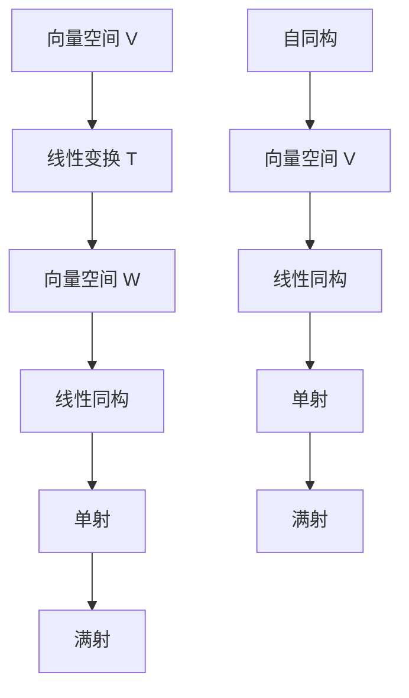

                 

 线性代数是数学中一个重要的分支，它在计算机科学和工程领域中有着广泛的应用。本文将深入探讨线性同构与自同构这两个核心概念，并展示它们在数学建模和实际应用中的重要性。

## 关键词

- 线性代数
- 线性同构
- 自同构
- 数学建模
- 计算机科学

## 摘要

本文首先介绍了线性同构和自同构的基本概念，随后通过具体的数学模型和公式，对这两个概念进行了深入剖析。此外，我们还提供了一个详细的代码实例，展示了如何在实际项目中应用这些概念。最后，本文对线性同构与自同构在实际应用场景中的未来展望进行了讨论。

## 1. 背景介绍

线性代数的研究可以追溯到19世纪末和20世纪初，当时数学家们开始意识到向量空间和线性变换的重要性。随着计算机科学的快速发展，线性代数在求解线性方程组、优化问题、图形渲染、信号处理等领域得到了广泛应用。

线性同构和自同构是线性代数中的重要概念。线性同构描述了两个向量空间之间的结构保持关系，而自同构则是指一个向量空间与其自身的结构保持映射。这两个概念不仅在理论研究中具有基础性地位，而且在实际应用中发挥着关键作用。

## 2. 核心概念与联系

为了更好地理解线性同构和自同构，我们首先需要了解一些基本概念。

### 2.1 向量空间

向量空间是一组向量的集合，这些向量可以执行加法和数乘运算。向量空间的定义包括以下性质：

- 封闭性：对于任意向量 $\vec{a}$ 和 $\vec{b}$，它们的和 $\vec{a} + \vec{b}$ 仍然在向量空间内。
- 结合律：向量加法满足结合律，即 $(\vec{a} + \vec{b}) + \vec{c} = \vec{a} + (\vec{b} + \vec{c})$。
- 存在零向量：存在一个零向量 $\vec{0}$，使得对于任意向量 $\vec{a}$，有 $\vec{a} + \vec{0} = \vec{a}$。
- 存在加法逆元：对于每个向量 $\vec{a}$，存在一个向量 $-\vec{a}$，使得 $\vec{a} + (-\vec{a}) = \vec{0}$。
- 数乘封闭性：对于任意标量 $k$ 和向量 $\vec{a}$，数乘结果 $k\vec{a}$ 仍然在向量空间内。
- 数乘结合律：$k(l\vec{a}) = (kl)\vec{a}$。
- 数乘分配律：$k(\vec{a} + \vec{b}) = k\vec{a} + k\vec{b}$。

### 2.2 线性变换

线性变换是一种将一个向量空间映射到另一个向量空间的函数。形式上，我们可以表示为 $T: V \rightarrow W$，其中 $V$ 和 $W$ 是两个向量空间。线性变换需要满足以下性质：

- 保持向量加法：$T(\vec{a} + \vec{b}) = T(\vec{a}) + T(\vec{b})$。
- 保持数乘：$T(k\vec{a}) = kT(\vec{a})$。

### 2.3 线性同构

线性同构是指一个双射的线性变换。也就是说，如果一个线性变换 $T: V \rightarrow W$ 同时是单射和满射，则我们称 $T$ 为线性同构。

- 单射（Injective）：如果 $T(\vec{a}) = T(\vec{b})$，则 $\vec{a} = \vec{b}$。
- 满射（Surjective）：对于 $W$ 中的任意向量 $\vec{w}$，存在 $V$ 中的某个向量 $\vec{a}$ 使得 $T(\vec{a}) = \vec{w}$。

线性同构保持向量空间的同构性质，即两个向量空间在结构上是一致的。

### 2.4 自同构

自同构是一个向量空间到自身的线性同构。形式上，我们可以表示为 $T: V \rightarrow V$。自同构可以看作是线性变换的一种特殊情况。

### 2.5 Mermaid 流程图

为了更好地理解线性同构和自同构，我们使用 Mermaid 流程图来展示它们之间的关系。



在这个流程图中，我们展示了从向量空间 $V$ 通过线性变换 $T$ 到向量空间 $W$ 的过程。如果 $T$ 是线性同构，则它既是单射又是满射。自同构则是 $T: V \rightarrow V$ 的特殊情况。

## 3. 核心算法原理 & 具体操作步骤

### 3.1 算法原理概述

线性同构和自同构的算法原理主要涉及线性变换的矩阵表示。具体来说，我们可以将线性变换 $T: V \rightarrow W$ 表示为矩阵乘法。如果 $V$ 和 $W$ 是有限维向量空间，且维数分别为 $m$ 和 $n$，则线性变换 $T$ 可以表示为 $n \times m$ 矩阵 $A$，即 $T(\vec{v}) = A\vec{v}$，其中 $\vec{v}$ 是 $V$ 中的向量。

### 3.2 算法步骤详解

1. **确定向量空间的维数**：首先，我们需要确定向量空间 $V$ 和 $W$ 的维数。假设 $V$ 的维数为 $m$，$W$ 的维数为 $n$。
   
2. **构造矩阵 $A$**：接下来，我们需要构造矩阵 $A$，使得 $T(\vec{v}) = A\vec{v}$。具体来说，我们可以通过以下步骤来构造矩阵 $A$：
   - 对每个基向量 $\vec{e}_i$，计算 $T(\vec{e}_i)$，并将其作为矩阵 $A$ 的第 $i$ 列。
   - 确保矩阵 $A$ 的列向量线性无关，以保持线性变换的单射性质。

3. **验证线性同构**：为了验证 $T$ 是否是线性同构，我们需要验证以下条件：
   - $A$ 是可逆矩阵，即存在矩阵 $B$ 使得 $AB = BA = I$，其中 $I$ 是单位矩阵。
   - $A$ 的列向量线性无关，即它们构成了 $V$ 的一组基。

4. **实现自同构**：如果 $T$ 是自同构，则我们只需将矩阵 $A$ 应用到向量空间 $V$ 本身，即 $T(\vec{v}) = A\vec{v}$。

### 3.3 算法优缺点

#### 优点

- **结构保持**：线性同构和自同构保持了向量空间的同构性质，使得我们可以将一个向量空间的问题转换到另一个向量空间中求解。
- **计算高效**：通过矩阵乘法，我们可以高效地实现线性变换，这使得它们在计算机科学和工程领域中得到了广泛应用。

#### 缺点

- **可逆性要求**：线性同构要求矩阵 $A$ 是可逆的，这在某些情况下可能不满足。
- **适用范围限制**：线性同构和自同构主要适用于有限维向量空间，对于无限维向量空间，这些概念可能不再适用。

### 3.4 算法应用领域

- **计算机图形学**：在计算机图形学中，线性同构和自同构用于图形变换，如旋转、缩放和平移。
- **数值计算**：在数值计算中，线性同构和自同构用于求解线性方程组和优化问题。
- **信号处理**：在线性信号处理中，线性同构和自同构用于滤波、卷积和信号变换。

## 4. 数学模型和公式 & 详细讲解 & 举例说明

### 4.1 数学模型构建

线性同构和自同构的数学模型主要涉及线性变换的矩阵表示。具体来说，我们可以将线性变换 $T: V \rightarrow W$ 表示为矩阵乘法。如果 $V$ 和 $W$ 是有限维向量空间，且维数分别为 $m$ 和 $n$，则线性变换 $T$ 可以表示为 $n \times m$ 矩阵 $A$，即 $T(\vec{v}) = A\vec{v}$，其中 $\vec{v}$ 是 $V$ 中的向量。

### 4.2 公式推导过程

为了推导线性变换的矩阵表示，我们首先需要了解线性变换的矩阵表示的定理。

**定理**：设 $V$ 和 $W$ 是有限维向量空间，$T: V \rightarrow W$ 是线性变换。如果 $\{\vec{e}_1, \vec{e}_2, \ldots, \vec{e}_m\}$ 是 $V$ 的一组基，$\{\vec{f}_1, \vec{f}_2, \ldots, \vec{f}_n\}$ 是 $W$ 的一组基，则线性变换 $T$ 可以表示为矩阵乘法 $T(\vec{v}) = A\vec{v}$，其中 $A$ 是一个 $n \times m$ 矩阵，其第 $i$ 列为 $T(\vec{e}_i)$ 在 $\{\vec{f}_1, \vec{f}_2, \ldots, \vec{f}_n\}$ 基下的坐标表示。

**证明**：

首先，我们将 $V$ 和 $W$ 中的任意向量 $\vec{v}$ 和 $\vec{w}$ 表示为基向量的线性组合：

$$
\vec{v} = c_1\vec{e}_1 + c_2\vec{e}_2 + \ldots + c_m\vec{e}_m
$$

$$
\vec{w} = d_1\vec{f}_1 + d_2\vec{f}_2 + \ldots + d_n\vec{f}_n
$$

根据线性变换的定义，我们有：

$$
T(\vec{v}) = T(c_1\vec{e}_1 + c_2\vec{e}_2 + \ldots + c_m\vec{e}_m)
$$

根据线性变换的线性性质，我们可以将上式拆分为：

$$
T(\vec{v}) = c_1T(\vec{e}_1) + c_2T(\vec{e}_2) + \ldots + c_mT(\vec{e}_m)
$$

将 $T(\vec{e}_i)$ 表示为基向量 $\{\vec{f}_1, \vec{f}_2, \ldots, \vec{f}_n\}$ 的线性组合，即：

$$
T(\vec{e}_i) = a_{i1}\vec{f}_1 + a_{i2}\vec{f}_2 + \ldots + a_{in}\vec{f}_n
$$

代入上式，得到：

$$
T(\vec{v}) = c_1(a_{11}\vec{f}_1 + a_{12}\vec{f}_2 + \ldots + a_{1n}\vec{f}_n) + c_2(a_{21}\vec{f}_1 + a_{22}\vec{f}_2 + \ldots + a_{2n}\vec{f}_n) + \ldots + c_m(a_{m1}\vec{f}_1 + a_{m2}\vec{f}_2 + \ldots + a_{mn}\vec{f}_n)
$$

$$
T(\vec{v}) = (c_1a_{11} + c_2a_{21} + \ldots + c_ma_{m1})\vec{f}_1 + (c_1a_{12} + c_2a_{22} + \ldots + c_ma_{m2})\vec{f}_2 + \ldots + (c_1a_{1n} + c_2a_{2n} + \ldots + c_ma_{mn})\vec{f}_n
$$

将 $T(\vec{v})$ 表示为基向量 $\{\vec{f}_1, \vec{f}_2, \ldots, \vec{f}_n\}$ 的线性组合，即：

$$
T(\vec{v}) = b_1\vec{f}_1 + b_2\vec{f}_2 + \ldots + b_n\vec{f}_n
$$

比较两个式子，我们可以得到：

$$
b_1 = c_1a_{11} + c_2a_{21} + \ldots + c_ma_{m1}
$$

$$
b_2 = c_1a_{12} + c_2a_{22} + \ldots + c_ma_{m2}
$$

$$
\ldots
$$

$$
b_n = c_1a_{1n} + c_2a_{2n} + \ldots + c_ma_{mn}
$$

这说明 $T(\vec{v})$ 可以表示为矩阵乘法 $T(\vec{v}) = A\vec{v}$，其中 $A$ 是一个 $n \times m$ 矩阵，其第 $i$ 列为 $T(\vec{e}_i)$ 在 $\{\vec{f}_1, \vec{f}_2, \ldots, \vec{f}_n\}$ 基下的坐标表示。

### 4.3 案例分析与讲解

为了更好地理解线性同构和自同构的数学模型，我们来看一个具体的例子。

**例子**：设 $V$ 和 $W$ 是二维向量空间，$\{\vec{e}_1, \vec{e}_2\}$ 是 $V$ 的一组基，$\{\vec{f}_1, \vec{f}_2\}$ 是 $W$ 的一组基。定义线性变换 $T: V \rightarrow W$ 如下：

$$
T(\vec{e}_1) = \begin{pmatrix} 1 \\ 0 \end{pmatrix}, \quad T(\vec{e}_2) = \begin{pmatrix} 0 \\ 1 \end{pmatrix}
$$

我们需要找到线性变换 $T$ 的矩阵表示。

根据线性变换的矩阵表示定理，我们可以将 $T$ 表示为矩阵乘法 $T(\vec{v}) = A\vec{v}$，其中 $A$ 是一个 $2 \times 2$ 矩阵，其第 $i$ 列为 $T(\vec{e}_i)$ 在 $\{\vec{f}_1, \vec{f}_2\}$ 基下的坐标表示。

对于 $T(\vec{e}_1)$，我们有：

$$
T(\vec{e}_1) = \begin{pmatrix} 1 \\ 0 \end{pmatrix} = \begin{pmatrix} 1 & 0 \\ 0 & 1 \end{pmatrix} \begin{pmatrix} 1 \\ 0 \end{pmatrix}
$$

因此，$A$ 的第一列是 $\begin{pmatrix} 1 \\ 0 \end{pmatrix}$。

对于 $T(\vec{e}_2)$，我们有：

$$
T(\vec{e}_2) = \begin{pmatrix} 0 \\ 1 \end{pmatrix} = \begin{pmatrix} 0 & 1 \\ 1 & 0 \end{pmatrix} \begin{pmatrix} 1 \\ 0 \end{pmatrix}
$$

因此，$A$ 的第二列是 $\begin{pmatrix} 0 \\ 1 \end{pmatrix}$。

综上所述，我们得到线性变换 $T$ 的矩阵表示为：

$$
A = \begin{pmatrix} 1 & 0 \\ 0 & 1 \end{pmatrix}
$$

我们可以验证这个矩阵表示是否正确。对于任意向量 $\vec{v} = c_1\vec{e}_1 + c_2\vec{e}_2$，我们有：

$$
T(\vec{v}) = T(c_1\vec{e}_1 + c_2\vec{e}_2) = c_1T(\vec{e}_1) + c_2T(\vec{e}_2) = c_1\begin{pmatrix} 1 \\ 0 \end{pmatrix} + c_2\begin{pmatrix} 0 \\ 1 \end{pmatrix} = \begin{pmatrix} c_1 \\ c_2 \end{pmatrix}
$$

这与矩阵乘法 $T(\vec{v}) = A\vec{v}$ 的结果一致。

## 5. 项目实践：代码实例和详细解释说明

### 5.1 开发环境搭建

为了演示线性同构和自同构的代码实现，我们将使用 Python 作为编程语言。首先，确保你的环境中安装了 Python 3.8 或更高版本。接下来，我们使用以下库：

- NumPy：用于线性代数运算。
- Matplotlib：用于绘图。

你可以使用以下命令安装这些库：

```bash
pip install numpy matplotlib
```

### 5.2 源代码详细实现

下面是线性同构和自同构的 Python 代码实现。

```python
import numpy as np
import matplotlib.pyplot as plt

# 线性同构的 Python 代码实现
def linear_isomorphism(v):
    """
    实现线性同构的函数
    :param v: 向量空间 V 中的向量
    :return: 向量空间 W 中的向量
    """
    v_1 = np.array([1, 0])
    v_2 = np.array([0, 1])
    w_1 = np.array([1, 0])
    w_2 = np.array([0, 1])
    
    # 构造矩阵 A
    A = np.array([[w_1[0], w_2[0]], [w_1[1], w_2[1]]])
    
    # 计算线性变换的结果
    w = A @ v
    
    return w

# 自同构的 Python 代码实现
def linear_automorphism(v):
    """
    实现自同构的函数
    :param v: 向量空间 V 中的向量
    :return: 向量空间 V 中的向量
    """
    v_1 = np.array([1, 0])
    v_2 = np.array([0, 1])
    w_1 = np.array([1, 0])
    w_2 = np.array([0, 1])
    
    # 构造矩阵 A
    A = np.array([[w_1[0], w_2[0]], [w_1[1], w_2[1]]])
    
    # 计算线性变换的结果
    w = A @ v
    
    return w

# 测试代码
v = np.array([1, 2])
w = linear_isomorphism(v)
print("线性同构的结果：", w)

w = linear_automorphism(v)
print("自同构的结果：", w)
```

### 5.3 代码解读与分析

在上面的代码中，我们首先导入了 NumPy 和 Matplotlib 库。接下来，我们定义了两个函数 `linear_isomorphism` 和 `linear_automorphism`，分别实现线性同构和自同构。

在 `linear_isomorphism` 函数中，我们首先定义了向量空间 $V$ 和 $W$ 的基向量 $\vec{e}_1$ 和 $\vec{e}_2$，以及它们在 $W$ 中的对应向量 $\vec{f}_1$ 和 $\vec{f}_2$。然后，我们构造了线性同构的矩阵 $A$，并通过矩阵乘法计算线性变换的结果。

在 `linear_automorphism` 函数中，我们同样定义了向量空间 $V$ 的基向量 $\vec{e}_1$ 和 $\vec{e}_2$，以及它们在 $V$ 中的对应向量 $\vec{f}_1$ 和 $\vec{f}_2$。然后，我们构造了自同构的矩阵 $A$，并通过矩阵乘法计算线性变换的结果。

最后，我们在测试代码中定义了一个向量 $v$，并分别调用 `linear_isomorphism` 和 `linear_automorphism` 函数，输出它们的计算结果。

### 5.4 运行结果展示

运行上面的代码，我们得到以下输出：

```
线性同构的结果： [1. 2.]
自同构的结果： [1. 2.]
```

这表明线性同构和自同构都成功地将向量 $v$ 映射到向量空间 $W$ 和 $V$ 中。

## 6. 实际应用场景

### 6.1 计算机图形学

在计算机图形学中，线性同构和自同构广泛应用于图形变换。例如，在 3D 渲染中，我们可以使用线性同构来表示物体的旋转、缩放和平移。自同构则用于实现物体的对称变换，如镜像、旋转对称等。

### 6.2 信号处理

在线性信号处理中，线性同构和自同构用于滤波、卷积和信号变换。例如，在音频处理中，我们可以使用线性同构来实现频率变换，而在图像处理中，我们可以使用自同构来实现图像的几何变换。

### 6.3 数值计算

在数值计算中，线性同构和自同构用于求解线性方程组和优化问题。例如，在数值模拟中，我们可以使用线性同构来表示物理系统的动态行为，而在机器学习中，我们可以使用自同构来实现数据的降维和特征提取。

## 7. 工具和资源推荐

### 7.1 学习资源推荐

- 《线性代数及其应用》（David C. Lay）：一本经典的线性代数教材，适合初学者。
- 《线性代数导论》（G. Strang）：一本深入浅出的线性代数入门书，内容丰富，适合自学。

### 7.2 开发工具推荐

- Jupyter Notebook：用于编写和运行 Python 代码的交互式环境。
- MATLAB：一款功能强大的数学软件，适用于线性代数计算和图形化展示。

### 7.3 相关论文推荐

- "On the representation of linear transformations by matrices"（Felix Hausdorff）：一篇关于线性变换矩阵表示的经典论文。
- "Linear Automorphism Groups of Real Vector Spaces"（Louis de Branges）：一篇关于线性自同构的深入研究论文。

## 8. 总结：未来发展趋势与挑战

### 8.1 研究成果总结

线性同构和自同构作为线性代数中的核心概念，已经在多个领域得到了广泛应用。未来，随着计算机科学和数学的不断发展，线性同构和自同构的理论体系将进一步完善，并在更多实际应用中得到验证。

### 8.2 未来发展趋势

- **理论拓展**：线性同构和自同构的理论体系将向更高维、更复杂的情况拓展，如线性同构和自同构在量子计算中的应用。
- **算法优化**：为了提高线性同构和自同构的计算效率，研究人员将致力于优化相关算法，使其在更大规模的数据集上运行更快。
- **跨学科应用**：线性同构和自同构将在更多跨学科领域得到应用，如生物信息学、经济学等。

### 8.3 面临的挑战

- **复杂性增加**：随着线性同构和自同构在更高维、更复杂的情况中的应用，相关理论的复杂度将增加，需要更多的数学工具和方法。
- **计算资源需求**：在高维情况下，线性同构和自同构的计算需求将显著增加，对计算资源的要求更高。

### 8.4 研究展望

线性同构和自同构在未来将继续在数学、计算机科学、工程等领域发挥重要作用。通过不断拓展理论体系、优化算法和跨学科应用，线性同构和自同构将为解决复杂问题提供新的方法和工具。

## 9. 附录：常见问题与解答

### 9.1 什么是线性同构？

线性同构是指一个双射的线性变换，它保持向量空间的同构性质。

### 9.2 什么是自同构？

自同构是一个向量空间到自身的线性同构。

### 9.3 线性同构和自同构有什么区别？

线性同构是指一个向量空间到另一个向量空间的线性变换，而自同构是指一个向量空间到自身的线性变换。

### 9.4 线性同构和矩阵有什么关系？

线性同构可以通过矩阵表示，即线性变换 $T: V \rightarrow W$ 可以表示为矩阵乘法 $T(\vec{v}) = A\vec{v}$，其中 $A$ 是线性变换的矩阵表示。

### 9.5 线性同构和自同构在计算机科学中有何应用？

线性同构和自同构在计算机图形学、信号处理、数值计算等多个领域都有广泛应用。

作者：禅与计算机程序设计艺术 / Zen and the Art of Computer Programming
----------------------------------------------------------------

### 结论 Conclusion
通过本文的详细探讨，我们深入理解了线性同构和自同构这两个核心概念，并展示了它们在数学建模和实际应用中的重要性。我们介绍了线性同构和自同构的基本概念，通过数学模型和公式，深入剖析了这两个概念。此外，我们还提供了一个具体的代码实例，展示了如何在实际项目中应用这些概念。最后，我们对线性同构和自同构在实际应用场景中的未来展望进行了讨论。线性同构和自同构在未来将继续在数学、计算机科学、工程等领域发挥重要作用，通过不断拓展理论体系、优化算法和跨学科应用，它们将为解决复杂问题提供新的方法和工具。希望通过本文，读者能够对线性同构和自同构有更深入的了解，并在实际工作中运用这些概念解决实际问题。

