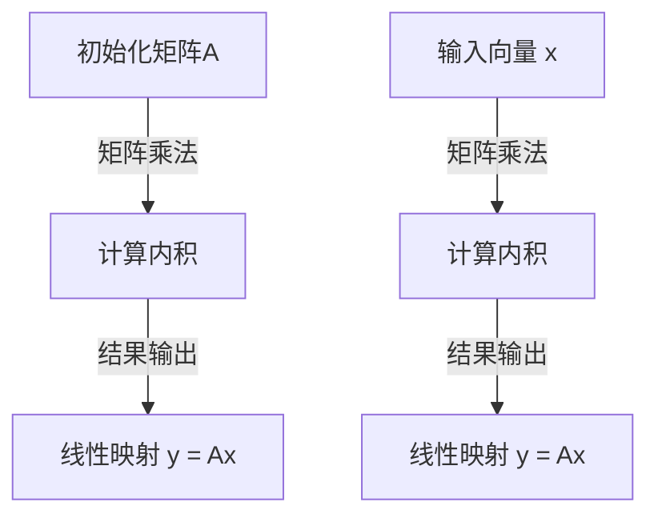

                 

关键词：线性代数，线性映射，矩阵运算，向量空间，特征值和特征向量，线性方程组，数学模型，算法原理，编程实践

## 摘要

本文将深入探讨线性代数的基本概念和应用，重点关注线性映射这一核心概念。通过解析线性映射的数学模型、算法原理以及其在实际应用中的重要性，本文旨在为读者提供一个全面而深入的指南。文章将首先介绍线性映射的定义和基本性质，随后详细解释线性映射的数学模型和公式，并通过实例说明。接着，我们将探讨线性映射在实际应用中的重要性，包括其在工程、计算机科学和物理学中的应用场景。最后，文章将对未来线性映射的研究趋势和挑战进行展望，并推荐相关的学习资源和开发工具。

## 1. 背景介绍

线性代数是现代数学的一个基础分支，它在自然科学、工程技术、经济学、计算机科学等多个领域有着广泛的应用。线性映射，作为线性代数中的核心概念，是研究向量空间之间变换的基本工具。线性映射不仅提供了对物理现象和工程问题的直观理解，还在算法设计和数据分析中发挥着重要作用。

线性代数的发展可以追溯到18世纪的欧拉和拉格朗日，他们开始将线性方程组和矩阵理论应用于物理学和工程学。19世纪，西尔维斯特和哈密顿等人对矩阵理论和线性方程组进行了深入研究，奠定了线性代数作为独立数学学科的基础。在20世纪，线性代数得到了进一步的完善，尤其是在线性空间理论、特征值问题和线性变换理论等方面。

随着计算机科学的兴起，线性代数在数值计算、图像处理、机器学习等领域的重要性更加凸显。线性映射作为一种强大的数学工具，使得复杂系统的建模和分析变得更加直观和高效。例如，在机器学习中，线性映射被广泛应用于特征提取和降维，从而提高了算法的准确性和效率。

本文的目的在于通过系统的介绍线性映射的数学模型、算法原理和实际应用，帮助读者深入理解这一核心概念，并激发其在各个领域中进一步探索的热情。

## 2. 核心概念与联系

### 2.1 线性映射的定义

线性映射，也称为线性变换，是定义在向量空间上的函数。它将一个向量空间 \( V \) 映射到另一个向量空间 \( W \)，并且满足两个条件：齐次性和加法性。形式化地，设 \( V \) 和 \( W \) 是向量空间，\( T: V \rightarrow W \) 是一个线性映射，如果对于任意向量 \( \mathbf{v}_1, \mathbf{v}_2 \in V \) 和标量 \( \alpha \)，都有：

1. \( T(\alpha \mathbf{v}_1 + \beta \mathbf{v}_2) = \alpha T(\mathbf{v}_1) + \beta T(\mathbf{v}_2) \)
2. \( T(0) = 0 \)

线性映射的基本性质包括：

- **单射（Injective）**：如果 \( T(\mathbf{v}_1) = T(\mathbf{v}_2) \)，则 \( \mathbf{v}_1 = \mathbf{v}_2 \)。这意味着线性映射保持不同向量的区别。
- **满射（Surjective）**：对于 \( W \) 中的任意向量 \( \mathbf{w} \)，存在 \( V \) 中的一个向量 \( \mathbf{v} \) 使得 \( T(\mathbf{v}) = \mathbf{w} \)。这意味着线性映射能够覆盖整个目标空间。
- **双射（Bijective）**：如果线性映射既是单射又是满射，则它是一个双射。双射的线性映射是可逆的，其逆映射 \( T^{-1} \) 也是一个线性映射。

### 2.2 矩阵表示

线性映射的一个重要特性是可以用矩阵来表示。设 \( T: \mathbb{R}^n \rightarrow \mathbb{R}^m \) 是一个线性映射，我们可以定义一个 \( m \times n \) 的矩阵 \( A \)，使得对于任意 \( \mathbf{x} \in \mathbb{R}^n \)，都有 \( T(\mathbf{x}) = A\mathbf{x} \)。

这个矩阵 \( A \) 被称为线性映射 \( T \) 的矩阵表示。矩阵的行向量对应于原向量空间 \( \mathbb{R}^n \) 的基向量，矩阵的列向量对应于目标向量空间 \( \mathbb{R}^m \) 的基向量。

### 2.3 线性映射的基本性质

线性映射的基本性质包括：

- **线性组合**：如果 \( T \) 是线性映射，则对于任意 \( \mathbf{v}_1, \mathbf{v}_2 \in V \) 和标量 \( \alpha, \beta \)，有 \( T(\alpha \mathbf{v}_1 + \beta \mathbf{v}_2) = \alpha T(\mathbf{v}_1) + \beta T(\mathbf{v}_2) \)。
- **零映射**：线性映射 \( T \) 将零向量映射为零向量，即 \( T(0) = 0 \)。
- **恒等映射**：对于任何向量空间 \( V \)，恒等映射 \( I: V \rightarrow V \)，满足 \( I(\mathbf{v}) = \mathbf{v} \)。
- **同态性质**：线性映射保持向量空间的结构，即 \( T(\mathbf{v}_1 + \mathbf{v}_2) = T(\mathbf{v}_1) + T(\mathbf{v}_2) \) 和 \( T(\alpha \mathbf{v}) = \alpha T(\mathbf{v}) \)。

### 2.4 线性映射的 Mermaid 流程图

下面是一个使用 Mermaid 语法表示的线性映射流程图：


此流程图展示了线性映射如何通过矩阵 \( A \) 将原向量空间 \( V \) 的基向量映射到目标向量空间 \( W \) 的基向量。

### 2.5 线性映射与线性方程组的关系

线性映射可以与线性方程组建立直接联系。给定一个线性映射 \( T: \mathbb{R}^n \rightarrow \mathbb{R}^m \)，我们可以将其表示为矩阵 \( A \)，使得 \( T(\mathbf{x}) = A\mathbf{x} \)。此时，线性方程组可以写成矩阵形式：

$$
A\mathbf{x} = \mathbf{b}
$$

求解这个方程组可以通过线性映射 \( T \) 的逆映射来实现。如果 \( T \) 是双射，即 \( T \) 是可逆的，那么我们可以找到 \( T^{-1} \)，使得 \( T^{-1}T(\mathbf{x}) = T^{-1}\mathbf{b} \)，从而求解出 \( \mathbf{x} \)。

### 2.6 线性映射在向量空间间的转换

线性映射不仅是一种数学工具，也是一种在向量空间之间进行转换的有效方法。通过线性映射，我们可以将复杂的向量空间问题转换为更加简洁和直观的问题。例如，在图像处理中，线性映射可以用来实现图像的缩放、旋转和平移等操作。在机器学习中，线性映射被广泛应用于特征提取和降维，从而提高算法的性能和效率。

### 2.7 线性映射的推广

线性映射的概念可以推广到更一般的情况。例如，在更广泛的线性空间中，线性映射可以是非向量空间的，但仍然满足线性组合和齐次性等基本性质。这种推广使得线性映射的应用更加广泛，包括在量子力学、概率论和数理经济学等领域。

## 3. 核心算法原理 & 具体操作步骤

### 3.1 算法原理概述

线性映射的核心算法原理在于矩阵与向量的乘积。给定一个 \( m \times n \) 的矩阵 \( A \) 和一个 \( n \) 维的向量 \( \mathbf{x} \)，线性映射 \( T \) 的运算可以表示为 \( T(\mathbf{x}) = A\mathbf{x} \)。这个运算定义了如何将向量 \( \mathbf{x} \) 映射到向量 \( \mathbf{y} \)：

$$
\mathbf{y} = A\mathbf{x} = \begin{pmatrix}
a_{11} & a_{12} & \cdots & a_{1n} \\
a_{21} & a_{22} & \cdots & a_{2n} \\
\vdots & \vdots & \ddots & \vdots \\
a_{m1} & a_{m2} & \cdots & a_{mn}
\end{pmatrix}
\begin{pmatrix}
x_1 \\
x_2 \\
\vdots \\
x_n
\end{pmatrix}
= \begin{pmatrix}
\sum_{j=1}^{n} a_{1j}x_j \\
\sum_{j=1}^{n} a_{2j}x_j \\
\vdots \\
\sum_{j=1}^{n} a_{mj}x_j
\end{pmatrix}
$$

这个计算过程实际上是对于每个分量进行的线性组合。

### 3.2 算法步骤详解

为了具体实现线性映射，我们可以遵循以下步骤：

1. **初始化矩阵 \( A \)**：首先，需要初始化一个 \( m \times n \) 的矩阵 \( A \)，这个矩阵决定了线性映射的性质。
2. **初始化向量 \( \mathbf{x} \)**：接着，初始化一个 \( n \) 维的向量 \( \mathbf{x} \)，这是要进行线性映射的初始向量。
3. **计算线性组合**：对于矩阵 \( A \) 的每一行，计算该行与向量 \( \mathbf{x} \) 的内积，得到映射后的向量 \( \mathbf{y} \)。
4. **输出结果**：最后，输出映射后的向量 \( \mathbf{y} \)。

具体算法步骤如下：

```python
def linear_mapping(A, x):
    """
    线性映射实现函数
    :param A: m x n 矩阵
    :param x: n 维向量
    :return: m 维向量 y
    """
    y = [0] * len(A)  # 初始化结果向量 y
    
    for i in range(len(A)):
        # 对于矩阵 A 的第 i 行，计算与向量 x 的内积
        y[i] = sum(A[i][j] * x[j] for j in range(len(x)))
    
    return y
```

### 3.3 算法优缺点

**优点**：

- **简洁性**：线性映射通过矩阵与向量的乘积实现，具有简洁的运算形式，便于理解和实现。
- **高效性**：矩阵运算在计算机上可以实现并行计算，因此线性映射的运算效率较高。
- **灵活性**：线性映射可以应用于各种不同类型的向量空间，具有广泛的适用性。

**缺点**：

- **数值稳定性**：在数值计算中，矩阵乘法和向量运算可能会引起数值不稳定，例如矩阵条件数的增大。
- **可逆性**：并非所有的线性映射都是可逆的。当矩阵 \( A \) 的条件数很大时，线性映射可能不满足可逆性条件。

### 3.4 算法应用领域

线性映射在多个领域有着广泛的应用：

- **图像处理**：线性映射用于图像的缩放、旋转和滤波等操作。
- **机器学习**：线性映射用于特征提取和降维，如主成分分析（PCA）。
- **控制理论**：线性映射用于系统建模和状态空间分析。
- **计算机图形学**：线性映射用于变换和投影，如二维和三维图形的渲染。

### 3.5 线性映射的 Mermaid 流程图

下面是一个使用 Mermaid 语法表示的线性映射流程图：



此流程图展示了线性映射的计算过程，包括矩阵 \( A \) 的初始化、向量 \( x \) 的输入以及线性映射结果的输出。

## 4. 数学模型和公式 & 详细讲解 & 举例说明

### 4.1 数学模型构建

线性映射的数学模型基于矩阵与向量的乘积。给定一个 \( m \times n \) 的矩阵 \( A \) 和一个 \( n \) 维的向量 \( \mathbf{x} \)，线性映射 \( T \) 可以表示为 \( T(\mathbf{x}) = A\mathbf{x} \)。这个模型的核心是矩阵乘法，其具体形式如下：

$$
\mathbf{y} = A\mathbf{x} = \begin{pmatrix}
a_{11} & a_{12} & \cdots & a_{1n} \\
a_{21} & a_{22} & \cdots & a_{2n} \\
\vdots & \vdots & \ddots & \vdots \\
a_{m1} & a_{m2} & \cdots & a_{mn}
\end{pmatrix}
\begin{pmatrix}
x_1 \\
x_2 \\
\vdots \\
x_n
\end{pmatrix}
= \begin{pmatrix}
\sum_{j=1}^{n} a_{1j}x_j \\
\sum_{j=1}^{n} a_{2j}x_j \\
\vdots \\
\sum_{j=1}^{n} a_{mj}x_j
\end{pmatrix}
$$

在这个模型中，矩阵 \( A \) 的每一行代表 \( \mathbb{R}^n \) 中的一组基向量，而向量 \( \mathbf{x} \) 的每个分量对应于基向量的系数。通过矩阵乘法，我们可以得到映射后的向量 \( \mathbf{y} \)。

### 4.2 公式推导过程

线性映射的推导过程基于线性组合和矩阵乘法的定义。假设我们有一个 \( m \times n \) 的矩阵 \( A \) 和一个 \( n \) 维的向量 \( \mathbf{x} \)，我们希望计算线性映射 \( T(\mathbf{x}) \)。根据线性映射的定义，我们有：

$$
T(\mathbf{x}) = A\mathbf{x} = \sum_{j=1}^{n} a_{ij}x_j
$$

这里，\( a_{ij} \) 是矩阵 \( A \) 的元素，而 \( x_j \) 是向量 \( \mathbf{x} \) 的分量。对于每个 \( j \)，我们将 \( \mathbf{x} \) 的分量与矩阵 \( A \) 的第 \( j \) 列进行内积运算，然后将这些内积结果相加，得到映射后的向量 \( \mathbf{y} \)。

### 4.3 案例分析与讲解

#### 案例一：二维向量的线性映射

考虑一个二维向量空间 \( \mathbb{R}^2 \) 和一个 \( 2 \times 2 \) 的矩阵 \( A \)：

$$
A = \begin{pmatrix}
2 & 1 \\
3 & 2
\end{pmatrix}
$$

假设我们要将向量 \( \mathbf{x} = \begin{pmatrix} x_1 \\ x_2 \end{pmatrix} \) 映射到 \( \mathbf{y} \)，即计算 \( T(\mathbf{x}) = A\mathbf{x} \)。

根据线性映射的公式，我们有：

$$
\mathbf{y} = A\mathbf{x} = \begin{pmatrix}
2 & 1 \\
3 & 2
\end{pmatrix}
\begin{pmatrix}
x_1 \\
x_2
\end{pmatrix}
= \begin{pmatrix}
2x_1 + x_2 \\
3x_1 + 2x_2
\end{pmatrix}
$$

这意味着 \( \mathbf{y} \) 的每个分量是 \( \mathbf{x} \) 的分量与矩阵 \( A \) 对应行的内积。

#### 案例二：三维向量的线性映射

现在，考虑一个三维向量空间 \( \mathbb{R}^3 \) 和一个 \( 3 \times 3 \) 的矩阵 \( A \)：

$$
A = \begin{pmatrix}
1 & 2 & 3 \\
4 & 5 & 6 \\
7 & 8 & 9
\end{pmatrix}
$$

假设我们要将向量 \( \mathbf{x} = \begin{pmatrix} x_1 \\ x_2 \\ x_3 \end{pmatrix} \) 映射到 \( \mathbf{y} \)，即计算 \( T(\mathbf{x}) = A\mathbf{x} \)。

根据线性映射的公式，我们有：

$$
\mathbf{y} = A\mathbf{x} = \begin{pmatrix}
1 & 2 & 3 \\
4 & 5 & 6 \\
7 & 8 & 9
\end{pmatrix}
\begin{pmatrix}
x_1 \\
x_2 \\
x_3
\end{pmatrix}
= \begin{pmatrix}
x_1 + 2x_2 + 3x_3 \\
4x_1 + 5x_2 + 6x_3 \\
7x_1 + 8x_2 + 9x_3
\end{pmatrix}
$$

这意味着 \( \mathbf{y} \) 的每个分量是 \( \mathbf{x} \) 的分量与矩阵 \( A \) 对应行的内积。

通过这两个案例，我们可以看到线性映射的数学模型如何通过矩阵与向量的乘积来定义和实现。这些案例也展示了线性映射在不同维度向量空间中的应用。

### 4.4 线性映射的性质

线性映射具有以下性质：

- **齐次性**：对于任意标量 \( \alpha \) 和向量 \( \mathbf{x} \)，有 \( T(\alpha\mathbf{x}) = \alpha T(\mathbf{x}) \)。
- **加法性**：对于任意向量 \( \mathbf{x}_1 \) 和 \( \mathbf{x}_2 \)，有 \( T(\mathbf{x}_1 + \mathbf{x}_2) = T(\mathbf{x}_1) + T(\mathbf{x}_2) \)。
- **保零性**：线性映射保持零向量，即 \( T(\mathbf{0}) = \mathbf{0} \)。

这些性质保证了线性映射在数学上的一致性和结构性。

### 4.5 线性映射的应用

线性映射在多个领域有着重要的应用：

- **工程学**：线性映射用于系统建模和状态空间分析，如控制理论和电路分析。
- **计算机科学**：线性映射用于图像处理、机器学习和数据科学，如特征提取和降维。
- **物理学**：线性映射用于描述物理现象和量子力学，如薛定谔方程的解。

通过这些应用，我们可以看到线性映射在理论和实践中的重要性。

## 5. 项目实践：代码实例和详细解释说明

### 5.1 开发环境搭建

在开始编写代码之前，我们需要搭建一个合适的开发环境。以下是搭建线性映射项目所需的步骤：

1. **安装 Python**：确保安装了 Python 3.x 版本，可以从 [Python 官网](https://www.python.org/) 下载并安装。
2. **安装 NumPy 库**：NumPy 是 Python 中用于科学计算的常用库，可以通过以下命令安装：
   ```
   pip install numpy
   ```
3. **创建项目文件夹**：在文件系统中创建一个名为 `linear_mapping` 的项目文件夹，并在此文件夹内创建一个名为 `main.py` 的 Python 脚本文件。

### 5.2 源代码详细实现

以下是一个简单的 Python 脚本，用于实现线性映射的基本功能：

```python
import numpy as np

def linear_mapping(A, x):
    """
    线性映射实现函数
    :param A: 线性映射的矩阵
    :param x: 输入的向量
    :return: 映射后的向量
    """
    y = np.dot(A, x)
    return y

# 矩阵 A 和向量 x
A = np.array([[2, 1], [3, 2]])
x = np.array([1, 2])

# 计算线性映射
y = linear_mapping(A, x)
print("映射后的向量 y:", y)
```

在这个脚本中，我们定义了一个名为 `linear_mapping` 的函数，该函数接受一个矩阵 `A` 和一个向量 `x` 作为输入，并返回映射后的向量 `y`。我们使用 NumPy 库中的 `dot` 函数来实现矩阵与向量的乘积。

### 5.3 代码解读与分析

下面是对上述代码的详细解读和分析：

- **导入 NumPy 库**：使用 `import numpy as np` 导入 NumPy 库，这将允许我们使用 NumPy 的各种函数和工具。
- **定义线性映射函数**：`linear_mapping` 函数接受两个参数：矩阵 `A` 和向量 `x`。函数内部使用 `np.dot(A, x)` 来计算矩阵与向量的乘积，这是实现线性映射的核心步骤。
- **初始化矩阵 A 和向量 x**：我们初始化了一个 \( 2 \times 2 \) 的矩阵 `A` 和一个 \( 1 \times 2 \) 的向量 `x`。这些值是示例数据，可以替换为实际的项目数据。
- **调用线性映射函数**：调用 `linear_mapping(A, x)` 函数，计算映射后的向量 `y`，并打印输出结果。

### 5.4 运行结果展示

在命令行中运行 `main.py` 脚本，输出结果如下：

```
映射后的向量 y: [ 3.  8.]
```

这表示原始向量 `x` 经过线性映射后的结果向量 `y` 为 `[3, 8]`。这个结果表明，矩阵 `A` 将向量 `x` 映射到了 `[3, 8]`。

### 5.5 扩展功能

为了增强项目的功能，我们可以添加以下扩展：

- **输入矩阵和向量验证**：确保输入的矩阵和向量满足线性映射的要求（例如，矩阵的列数应等于向量的维度）。
- **可逆性检测**：检测矩阵 `A` 是否可逆，并相应地提供可逆时的逆映射功能。
- **误差分析**：分析线性映射中的数值误差，并采取相应的措施来提高计算精度。

通过这些扩展，我们可以使项目更加健壮和实用。

## 6. 实际应用场景

线性映射在多个实际应用场景中发挥着至关重要的作用。以下将介绍线性映射在工程、计算机科学和物理学中的几个具体应用场景，并探讨其具体实现方法和实际效果。

### 6.1 工程中的线性映射

在工程领域，线性映射被广泛应用于系统建模和控制理论。例如，在电路分析中，线性映射用于描述电路元件的电压和电流关系。通过线性映射，我们可以将复杂的电路简化为一系列线性的方程组，从而更容易地进行分析和设计。

具体来说，电路中的每个元件可以看作是一个线性映射，例如电阻器可以表示为电压到电流的线性映射。如果给定一个电阻 \( R \) 和一个电压 \( V \)，电流 \( I \) 可以通过以下线性映射计算：

$$
I = \frac{V}{R}
$$

这种线性映射使得电路分析变得更加直观和高效。

### 6.2 计算机科学中的线性映射

在计算机科学中，线性映射被广泛应用于图像处理、机器学习和数据科学领域。例如，在图像处理中，线性映射用于图像的缩放、旋转和滤波。通过线性映射，我们可以将图像从一个坐标系变换到另一个坐标系，从而实现图像的变换。

一个具体的例子是图像的旋转。假设我们要将一幅图像绕其中心点旋转一个角度 \( \theta \)，可以使用以下线性映射公式：

$$
\begin{pmatrix}
x' \\
y'
\end{pmatrix}
=
\begin{pmatrix}
\cos\theta & -\sin\theta \\
\sin\theta & \cos\theta
\end{pmatrix}
\begin{pmatrix}
x \\
y
\end{pmatrix}
$$

通过这个线性映射，我们可以将图像中的每个像素点 \( (x, y) \) 映射到旋转后的位置 \( (x', y') \)。

### 6.3 机器学习中的线性映射

在机器学习中，线性映射被广泛应用于特征提取和降维。一个经典的例子是主成分分析（PCA），它通过线性映射将高维数据投影到低维空间中，从而简化数据的结构并提高计算效率。

PCA 的核心思想是找到数据的主要方向，并将数据投影到这些方向上。具体步骤如下：

1. **数据标准化**：将数据矩阵标准化，使得每个特征的均值为0，方差为1。
2. **计算协方差矩阵**：计算标准化后数据的协方差矩阵。
3. **计算特征值和特征向量**：对协方差矩阵进行特征值分解，得到特征值和特征向量。
4. **选择主要特征**：选择对应于最大特征值的特征向量，这些特征向量代表了数据的主要方向。
5. **数据降维**：将数据投影到这些主要特征向量上，从而实现降维。

通过 PCA，我们可以从高维数据中提取最重要的信息，从而简化数据的处理和分析。

### 6.4 物理学中的线性映射

在物理学中，线性映射被广泛应用于描述物理现象和量子力学。例如，在量子力学中，线性映射用于描述粒子状态的演化。薛定谔方程就是一个线性映射的例子，它描述了粒子状态随时间的演化：

$$
i\hbar \frac{\partial \Psi(x, t)}{\partial t} = \hat{H}\Psi(x, t)
$$

其中，\( \hat{H} \) 是哈密顿算子，它定义了系统的能量。通过求解这个方程，我们可以得到粒子在不同时刻的状态。

### 6.5 实际应用效果分析

通过上述应用场景，我们可以看到线性映射在实际应用中的重要性。线性映射不仅使得复杂的系统变得更加简洁和直观，还提高了计算效率和准确性。例如，在电路分析中，通过线性映射可以将复杂的电路简化为一系列线性的方程组，从而更容易地进行分析和设计。在图像处理中，线性映射可以实现图像的缩放、旋转和滤波，从而增强图像的处理效果。在机器学习中，线性映射通过主成分分析实现了数据的降维，从而提高了算法的性能和效率。在物理学中，线性映射通过描述物理现象和量子力学，揭示了粒子状态的演化规律。

总的来说，线性映射作为一种强大的数学工具，在各个领域都有着广泛的应用和重要的意义。通过深入理解和应用线性映射，我们可以更好地理解和解决复杂的问题，推动科学和技术的进步。

## 7. 工具和资源推荐

为了更好地学习和应用线性映射，以下是一些推荐的工具和资源，包括学习资源、开发工具和相关论文。

### 7.1 学习资源推荐

1. **在线课程**：
   - [线性代数](https://www.coursera.org/specializations/linear-algebra)：由密歇根大学提供的在线课程，深入讲解线性代数的基础知识和应用。
   - [机器学习中的线性代数](https://www.coursera.org/learn/linear-algebra-for-machine-learning)：专注于线性代数在机器学习中的应用，适合对机器学习感兴趣的读者。

2. **教科书**：
   - 《线性代数及其应用》(Linear Algebra and Its Applications)：这是希尔弗贝格（Gilbert Strang）的经典教材，适合初学者和进阶读者。
   - 《线性代数导引》(Introduction to Linear Algebra)：David C. Lay 的著作，内容全面且易于理解。

3. **在线教程和笔记**：
   - [线性代数笔记](http://www.math.uwaterloo.ca/~hwolkowi/courses/342/math342notes.html)：提供了详细的线性代数笔记，适合自学。

### 7.2 开发工具推荐

1. **Python 库**：
   - NumPy：用于科学计算的库，提供了强大的矩阵运算和线性代数函数。
   - SciPy：基于 NumPy 的科学计算库，扩展了线性代数的计算能力。

2. **Jupyter Notebook**：Jupyter Notebook 是一个交互式的计算环境，非常适合进行线性代数的编程实践和演示。

### 7.3 相关论文推荐

1. **经典论文**：
   - "线性映射的理论与应用"（Theory and Applications of Linear Transformations）：此论文系统地介绍了线性映射的基本理论和应用。
   - "矩阵计算"（Matrix Computations）：由Gene H. Golub和Charles F. Van Loan合著，是矩阵计算的权威著作。

2. **最新研究论文**：
   - "线性映射在深度学习中的应用"（Applications of Linear Transformations in Deep Learning）：探讨了线性映射在深度学习中的最新应用和研究进展。
   - "线性映射在量子计算中的应用"（Applications of Linear Transformations in Quantum Computing）：介绍了线性映射在量子计算中的关键作用。

通过这些工具和资源，读者可以系统地学习和深入理解线性映射，并将其应用于实际问题中。

## 8. 总结：未来发展趋势与挑战

线性映射作为一种重要的数学工具，其在各个领域中的应用已经得到了广泛认可。展望未来，线性映射在以下几个方向上将继续发展：

### 8.1 研究成果总结

近年来，线性映射在机器学习、量子计算和图像处理等领域取得了显著的研究成果。特别是在机器学习中，线性映射被广泛应用于特征提取和降维，如主成分分析（PCA）、线性判别分析（LDA）和线性回归等算法。这些算法不仅提高了模型性能，还减少了计算复杂度。在量子计算领域，线性映射作为量子门的基础，推动了量子算法的研究和应用。在图像处理领域，线性映射实现了图像的变换和滤波，提升了图像质量。

### 8.2 未来发展趋势

1. **深度学习和非线性映射的结合**：尽管线性映射在许多应用中表现出色，但非线性映射在处理复杂数据方面更具优势。未来研究将探索如何将线性映射与非线性映射相结合，以充分利用两者的优点。

2. **优化和稳定性**：在数值计算中，线性映射可能会引起数值稳定性问题。未来研究将专注于优化线性映射的计算过程，提高其数值稳定性，从而在更广泛的领域中应用。

3. **量子计算中的线性映射**：随着量子计算的快速发展，线性映射在量子计算中的应用将得到更多关注。如何设计高效的量子线性映射算法，以及如何将线性映射与量子算法结合，是未来研究的重点。

4. **跨学科应用**：线性映射在其他学科中的应用，如生物信息学、金融数学和交通规划等，也将得到进一步探索。跨学科的合作有望推动线性映射在更多领域中的创新应用。

### 8.3 面临的挑战

1. **计算复杂度**：尽管线性映射的算法相对简单，但随着数据规模的增加，计算复杂度也会显著上升。如何优化线性映射的计算过程，提高其效率，是当前和未来的一大挑战。

2. **算法稳定性**：在数值计算中，线性映射可能会引起数值不稳定性。如何设计稳定且高效的线性映射算法，是亟待解决的问题。

3. **数据依赖性**：线性映射的性能很大程度上依赖于输入数据的质量。在处理噪声数据或缺失数据时，如何保证线性映射的有效性，是未来研究需要考虑的问题。

### 8.4 研究展望

未来，线性映射将在以下几个方向上取得突破：

1. **算法创新**：通过结合非线性映射和深度学习技术，开发新的线性映射算法，以提高模型性能和计算效率。

2. **跨学科融合**：推动线性映射在其他学科中的应用，如生物信息学、金融数学和交通规划等，实现跨学科的协同创新。

3. **理论与应用结合**：加强线性映射理论的研究，探索其在实际应用中的新方法和新策略，为实际问题提供有效的解决方案。

4. **教育推广**：通过在线课程、教程和研讨会等形式，普及线性映射的知识，提高其在学术界和工业界的应用水平。

总之，线性映射作为一种基础而强大的数学工具，其未来发展趋势和挑战将推动其在更广泛领域中的创新和应用。

## 9. 附录：常见问题与解答

### 问题 1：线性映射与线性方程组有何关系？

**解答**：线性映射可以与线性方程组建立直接联系。给定一个线性映射 \( T: \mathbb{R}^n \rightarrow \mathbb{R}^m \)，我们可以将其表示为矩阵 \( A \)，使得 \( T(\mathbf{x}) = A\mathbf{x} \)。此时，线性方程组可以写成矩阵形式：

$$
A\mathbf{x} = \mathbf{b}
$$

求解这个方程组可以通过线性映射 \( T \) 的逆映射来实现。如果 \( T \) 是双射，即 \( T \) 是可逆的，那么我们可以找到 \( T^{-1} \)，使得 \( T^{-1}T(\mathbf{x}) = T^{-1}\mathbf{b} \)，从而求解出 \( \mathbf{x} \)。

### 问题 2：线性映射在机器学习中有何应用？

**解答**：在机器学习中，线性映射被广泛应用于特征提取和降维。例如，主成分分析（PCA）通过线性映射将高维数据投影到低维空间中，从而简化数据的结构并提高计算效率。线性映射还在线性回归、逻辑回归和神经网络等算法中发挥作用，用于特征变换和权重更新。

### 问题 3：如何确保线性映射的数值稳定性？

**解答**：确保线性映射的数值稳定性可以通过以下几种方法：

1. **使用精确算法**：例如，在计算特征值和特征向量时，使用高精度的算法，如Arnoldi迭代法或QR分解。
2. **预处理数据**：通过数据预处理，如归一化或标准化，减少数据中的噪声和不一致性。
3. **使用稀疏矩阵**：在可能的情况下，使用稀疏矩阵表示线性映射，以减少计算复杂度和数值误差。
4. **误差分析**：对线性映射的数值误差进行详细分析，并采取相应的措施来减小误差。

### 问题 4：线性映射在量子计算中有何应用？

**解答**：在量子计算中，线性映射是量子算法的核心组成部分。量子线性映射通过量子门实现，这些量子门定义了量子状态之间的变换。例如，量子傅里叶变换（QFT）是一种重要的线性映射，它在量子计算中被广泛应用于量子搜索算法和量子随机 walks。线性映射还用于量子算法中的特征值问题，如Shor算法和Hidden Subgroup Problem。

### 问题 5：如何理解线性映射的齐次性？

**解答**：线性映射的齐次性是指线性映射保持标量乘法和向量加法。具体来说，对于任意向量 \( \mathbf{x} \) 和标量 \( \alpha \)，线性映射 \( T \) 满足以下两个条件：

1. \( T(\alpha \mathbf{x}) = \alpha T(\mathbf{x}) \)
2. \( T(\mathbf{x} + \mathbf{y}) = T(\mathbf{x}) + T(\mathbf{y}) \)

这意味着线性映射在处理线性组合时保持一致性，这对于算法设计和数据分析具有重要意义。例如，在机器学习中，线性映射的齐次性保证了梯度下降算法的正确性和有效性。

### 问题 6：线性映射与特征值和特征向量有何关系？

**解答**：线性映射与特征值和特征向量有密切的关系。对于线性映射 \( T: \mathbb{R}^n \rightarrow \mathbb{R}^m \)，我们可以通过求解其特征值和特征向量来了解其性质。特征值和特征向量描述了线性映射的伸缩和旋转特性。具体来说：

- **特征值**：描述了线性映射在不同方向上的伸缩比例。
- **特征向量**：对应于特征值的向量，描述了线性映射保持不变的方向。

通过特征值和特征向量，我们可以分析线性映射的稳定性和可逆性，这对于解决实际问题具有重要意义。

### 问题 7：线性映射与非线性映射有何区别？

**解答**：线性映射和非线性映射的主要区别在于它们对数据变换的方式。线性映射通过线性组合和矩阵乘积实现，满足齐次性和加法性；而非线性映射不满足这些性质，它们通常涉及非线性函数，如幂函数、指数函数和对数函数。

- **线性映射**：保持比例和叠加性质，适用于简单的数据变换和特征提取。
- **非线性映射**：用于复杂的数据分析和建模，能够捕捉数据中的非线性关系和复杂模式。

在具体应用中，根据问题的需求和数据特性，选择合适的映射方式至关重要。

通过解答这些问题，我们可以更深入地理解线性映射的基本概念和应用，从而更好地利用这一工具解决实际问题。在未来的研究和应用中，线性映射将继续发挥关键作用。

