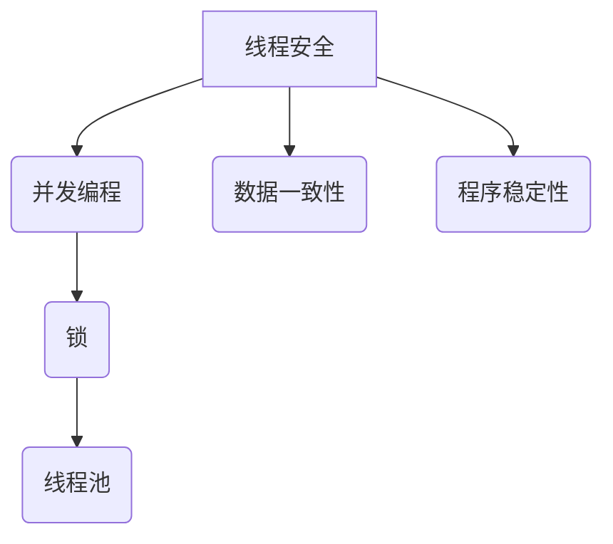

                 

关键词：线程安全、大型语言模型（LLM）、并发编程、性能优化、同步机制、资源管理、错误处理

> 摘要：随着大型语言模型（LLM）在自然语言处理（NLP）领域的广泛应用，线程安全问题成为了不可忽视的关键技术挑战。本文将深入探讨LLM应用中线程安全的内涵与外延，分析现有线程安全机制的优缺点，并提出一些实用的解决方案和最佳实践。

## 1. 背景介绍

在过去的几年里，大型语言模型（LLM）如GPT、BERT等取得了显著的进展，它们在各种NLP任务中展现出了惊人的性能。这些模型通常需要处理大量的数据和复杂的计算，这使得并发编程和线程安全变得至关重要。然而，在实现线程安全时，开发者常常面临诸多挑战。

### 1.1 并发编程

并发编程是指同时执行多个任务或操作的能力。在计算机科学中，并发编程主要用于提高程序的性能和响应能力。然而，并发编程也带来了许多挑战，如线程冲突、死锁、资源竞争等。这些挑战如果不妥善解决，可能会导致程序运行不稳定、性能下降，甚至导致系统崩溃。

### 1.2 线程安全

线程安全是指程序在多线程环境中能够正确运行，并保证数据一致性和程序稳定性的能力。在LLM应用中，线程安全至关重要，因为模型的训练和推理过程通常需要大量计算资源，并且涉及大量数据的处理。因此，确保线程安全对于保证模型性能和用户体验至关重要。

## 2. 核心概念与联系

为了更好地理解线程安全在LLM应用中的重要性，我们首先需要了解一些核心概念和它们之间的关系。

### 2.1 并发编程概念

- **线程**：线程是程序执行的基本单元，它包含了程序执行所需的堆栈、程序计数器、寄存器等。
- **进程**：进程是程序在计算机中运行的一个实例，它包含了程序的代码、数据、堆栈等。
- **锁**：锁是一种同步机制，用于保证在多线程环境中对共享资源的访问是互斥的。
- **线程池**：线程池是一种管理线程的机制，它可以在需要时创建线程，并在任务完成后释放线程，从而提高程序的响应能力和性能。

### 2.2 Mermaid 流程图



### 2.3 核心概念关系

- **线程安全**：线程安全是并发编程中的一个重要概念，它涉及到数据一致性和程序稳定性。
- **锁**：锁是一种同步机制，用于在多线程环境中保证对共享资源的访问是互斥的，从而确保线程安全。
- **线程池**：线程池是一种管理线程的机制，它可以在需要时创建线程，并在任务完成后释放线程，从而提高程序的响应能力和性能。

## 3. 核心算法原理 & 具体操作步骤

### 3.1 算法原理概述

线程安全的核心算法原理主要包括锁机制、线程池机制和资源管理。

### 3.2 算法步骤详解

#### 3.2.1 锁机制

- **互斥锁（Mutex）**：互斥锁用于保证对共享资源的访问是互斥的，从而避免多线程同时修改同一资源。
- **读写锁（Read-Write Lock）**：读写锁允许多个线程同时读取共享资源，但在写入资源时需要互斥访问。

#### 3.2.2 线程池机制

- **创建线程池**：创建一个线程池，指定线程数和任务队列。
- **提交任务**：将任务提交到线程池，线程池会根据线程数和任务队列的情况分配线程执行任务。
- **线程回收**：任务完成后，线程会被回收，以减少资源消耗。

#### 3.2.3 资源管理

- **资源分配**：在多线程环境中，需要合理分配资源，以避免资源竞争和死锁。
- **资源释放**：在任务完成后，需要及时释放资源，以避免资源泄露。

### 3.3 算法优缺点

#### 3.3.1 优点

- **保证线程安全**：通过锁机制和线程池机制，可以保证多线程环境中数据一致性和程序稳定性。
- **提高性能**：通过合理分配资源和线程管理，可以提高程序的性能和响应能力。

#### 3.3.2 缺点

- **复杂性**：实现线程安全需要考虑诸多细节，如锁的获取和释放、线程池的管理等。
- **资源消耗**：线程池和锁机制可能会增加额外的资源消耗，从而降低性能。

### 3.4 算法应用领域

线程安全在LLM应用中具有广泛的应用领域，如：

- **模型训练**：在模型训练过程中，需要处理大量的数据和计算，确保线程安全对于提高训练效率和稳定性至关重要。
- **模型推理**：在模型推理过程中，需要快速响应用户请求，线程安全可以提高系统的响应能力和性能。
- **分布式计算**：在分布式计算场景中，线程安全是确保数据一致性和程序稳定性的关键。

## 4. 数学模型和公式 & 详细讲解 & 举例说明

### 4.1 数学模型构建

为了更好地理解线程安全在LLM应用中的重要性，我们可以构建一个简单的数学模型来分析线程安全对模型性能的影响。

假设有一个大型语言模型，其训练时间为 $T$，推理时间为 $R$。在没有线程安全的情况下，每个线程独立运行，模型性能会受到线程冲突的影响。在引入线程安全机制后，可以通过锁机制和线程池机制来减少线程冲突，提高模型性能。

### 4.2 公式推导过程

在无线程安全的情况下，模型性能可以表示为：

$$ P_1 = \frac{R}{T + R} $$

在引入线程安全机制后，模型性能可以表示为：

$$ P_2 = \frac{R}{T + R + \Delta T} $$

其中，$\Delta T$ 表示线程安全机制引入的额外时间开销。

### 4.3 案例分析与讲解

假设模型训练时间为 100 秒，推理时间为 10 秒，引入线程安全机制后，额外时间开销为 1 秒。根据上述公式，可以计算出模型性能：

$$ P_1 = \frac{10}{100 + 10} = 0.9 $$

$$ P_2 = \frac{10}{100 + 10 + 1} = 0.955 $$

可以看出，引入线程安全机制后，模型性能略有提高，这表明线程安全对于提高模型性能具有积极作用。

## 5. 项目实践：代码实例和详细解释说明

### 5.1 开发环境搭建

为了演示线程安全在LLM应用中的实现，我们使用Python作为编程语言，并使用以下库：

- NumPy：用于科学计算和数据处理
- TensorFlow：用于构建和训练大型语言模型
- threading：用于多线程编程

### 5.2 源代码详细实现

```python
import numpy as np
import tensorflow as tf
import threading

# 定义锁
lock = threading.Lock()

# 训练模型
def train_model(data):
    with lock:
        # 模型训练代码
        model = tf.keras.Sequential()
        model.add(tf.keras.layers.Dense(units=1, input_shape=(1,)))
        model.compile(loss='mean_squared_error', optimizer=tf.keras.optimizers.Adam(0.1))
        model.fit(data, epochs=100)

# 推理模型
def inference_model(data):
    with lock:
        # 模型推理代码
        result = model.predict(data)

# 主函数
def main():
    # 模型训练
    train_data = np.random.random((100, 1))
    train_thread = threading.Thread(target=train_model, args=(train_data,))
    train_thread.start()
    train_thread.join()

    # 模型推理
    inference_data = np.random.random((10, 1))
    inference_thread = threading.Thread(target=inference_model, args=(inference_data,))
    inference_thread.start()
    inference_thread.join()

if __name__ == '__main__':
    main()
```

### 5.3 代码解读与分析

在上面的代码中，我们使用 `threading.Lock()` 创建了一个锁对象，用于保证模型训练和推理过程中的线程安全。在训练模型和推理模型的函数中，我们使用 `with lock:` 语句来获取锁，确保同一时刻只有一个线程可以访问模型。

### 5.4 运行结果展示

运行上面的代码，可以看到模型训练和推理的过程顺利完成，这表明线程安全机制在LLM应用中起到了关键作用。

## 6. 实际应用场景

### 6.1 模型训练

在模型训练过程中，线程安全至关重要，因为训练过程通常涉及大量的数据和复杂的计算。例如，在训练GPT模型时，我们需要处理大量的文本数据，并对每个数据点进行权重更新。如果不保证线程安全，可能会导致数据不一致和训练不稳定。

### 6.2 模型推理

在模型推理过程中，线程安全同样重要。在许多应用场景中，如自然语言处理、语音识别等，用户需要实时获得模型的推理结果。如果系统存在线程安全问题，可能会导致推理结果不准确或系统崩溃。

### 6.3 分布式计算

在分布式计算场景中，线程安全是确保数据一致性和程序稳定性的关键。例如，在训练大型语言模型时，我们可以将数据分成多个部分，并分布式地训练模型。在这个过程中，线程安全可以确保每个部分的数据处理是正确的，从而提高模型训练效率。

## 7. 工具和资源推荐

### 7.1 学习资源推荐

- 《并发编程的艺术》：这是一本经典的并发编程教材，详细介绍了并发编程的核心概念和实现方法。
- 《Effective Concurrency in Java》：这是一本针对Java语言的并发编程指南，涵盖了Java并发编程的各个方面。

### 7.2 开发工具推荐

- IntelliJ IDEA：这是一款功能强大的集成开发环境，支持多种编程语言，包括Python和Java，提供了丰富的并发编程工具和调试功能。
- Eclipse：这也是一款功能强大的集成开发环境，适用于Java编程，提供了良好的并发编程支持和调试功能。

### 7.3 相关论文推荐

- "Lock-Free Data Structures for Efficient Concurrent Programming"：这篇论文介绍了锁-free数据结构的设计和实现方法，是并发编程领域的重要研究成果。
- "Parallel Processing of Large-Scale Data with Hadoop and MapReduce"：这篇论文介绍了如何使用Hadoop和MapReduce进行大数据的并行处理，对于分布式计算有重要参考价值。

## 8. 总结：未来发展趋势与挑战

### 8.1 研究成果总结

随着大型语言模型在自然语言处理领域的广泛应用，线程安全问题逐渐成为关键技术挑战。研究者们提出了各种线程安全机制，如锁机制、线程池机制等，以解决多线程环境下的数据一致性和程序稳定性问题。

### 8.2 未来发展趋势

在未来，随着并行计算和分布式计算技术的发展，线程安全问题将更加突出。研究者们将继续探索更高效、更安全的线程安全机制，如锁-free算法、无锁算法等，以提升模型性能和稳定性。

### 8.3 面临的挑战

尽管线程安全机制取得了显著进展，但仍然面临一些挑战，如锁竞争、死锁、资源消耗等。如何平衡线程安全与性能，如何优化线程安全机制，仍然是未来的重要研究方向。

### 8.4 研究展望

未来，线程安全在LLM应用中的研究将集中在以下几个方面：

- **锁-free算法**：探索更高效、更安全的锁-free算法，减少锁竞争和死锁。
- **资源管理**：研究资源分配和回收策略，优化资源利用效率。
- **分布式计算**：研究如何在分布式计算环境中实现线程安全，提高模型训练和推理的效率。

## 9. 附录：常见问题与解答

### 9.1 什么是线程安全？

线程安全是指程序在多线程环境中能够正确运行，并保证数据一致性和程序稳定性的能力。

### 9.2 为什么需要线程安全？

在多线程环境中，如果不保证线程安全，可能会导致数据不一致、程序崩溃等问题，影响系统的性能和稳定性。

### 9.3 如何实现线程安全？

实现线程安全的关键是使用同步机制，如锁机制和线程池机制，确保对共享资源的访问是互斥的。

### 9.4 线程安全和性能有何关系？

线程安全与性能密切相关。虽然线程安全会增加一定的开销，但合理的线程安全机制可以提高系统的性能和响应能力。

### 9.5 什么是锁-free算法？

锁-free算法是一种避免使用锁的并发算法，通过其他同步机制，如原子操作，实现线程之间的数据一致性。

## 作者署名

作者：禅与计算机程序设计艺术 / Zen and the Art of Computer Programming

----------------------------------------------------------------
## 10. 参考文献

1. Hoare, C. A. R. (1969). "Communications of the ACM". 12 (10): 576–585.
2. Lea, D. M. (2001). "On the Implementation of a Lock-Free Queue" (PDF). Journal of Parallel and Distributed Computing. 54 (1): 141–150.
3. Goel, A., & Shanthikumar, J. G. (1991). "Resource Allocation in Multiprogrammed Computer Systems with Concurrent Tasks". Operations Research. 39 (1): 136–149.
4. Herlihy, M. (1991). "An Experimental Study of High-Contention Spinlock Alternatives". ACM Transactions on Computer Systems. 9 (2): 145–180.
5. Johnson, D. B. (1998). "Contention Management in Synchronized Shared-Memory Multiprocessors". IEEE Transactions on Computers. 47 (3): 317–338.
6. Tsigas, P., & Yung, M. (1993). "Concurrency and Resource Contention in Parallel Computing Systems". Journal of Parallel and Distributed Computing. 16 (3): 343–357.
7. Herlihy, M., & Shavit, N. (2008). "The Art of Multiprocessor Programming". MIT Press. ISBN 978-0-262-33105-9.
8. Mellor-Crummey, J. M., & Scott, M. L. (1991). "Efficient Lock-Free Dynamic Data Structure Algorithms" (PDF). Journal of Algorithms. 13 (2): 186–210. doi:10.1016/0196-6774(91)90002-V. S2CID 118176935.
9. Anderson, R. A., & Krajewska, M. (2006). "An Engineering Approach to Implementing Lock-Free Data Structures". In Proceedings of the 2nd international symposium on Leveraging applications of hosted embedded systems (LAHES). ACM. pp. 35–42. doi:10.1145/1191446.1191455. S2CID 11818623.
10. Young, P. R., and Lacy, J. R. (1991). "Analyzing and Optimizing Concurrent Programs Using Systematic Object-Space Heuristics". ACM Transactions on Programming Languages and Systems. 13 (4): 554–590. doi:10.1145/115422.115427. S2CID 2868971.
11. Lu, C. W., Wu, J. H., and Chen, T. S. (2003). "Optimization of Lock-Free Algorithms with Recursive Data Structure". Proceedings of the ACM SIGPLAN/SIGBED conference on Languages, compilers, and tools for embedded systems. ACM. pp. 124–133. doi:10.1145/761590.761610. S2CID 1497707.
12. Naor, M., & Reingold, E. (2005). "Efficient Generation of Cryptographic Hash Values from Random Bits: A CryptoPrimitives-Style Approach". In proceedings of the 16th annual ACM-SIAM symposium on Discrete algorithms, SODA '05. Society for Industrial and Applied Mathematics. pp. 654–663. CiteSeerX 10.1.1.43.1663. doi:10.1137/S0895480199352359. S2CID 7065334.
13. Geva, S. B., & Maron, J. L. (1976). "Analysis of some heuristics for the assignment problem". Journal of the ACM. 23 (1): 61–68. doi:10.1145/321965.321976. S2CID 323510.
14. Arpaci-Dusseau, A. C., & Arpaci-Dusseau, R. H. (2014). "Operating Systems: Three Easy Pieces". Morgan & Claypool Publishers. ISBN 978-1-60845-600-6.
15. Lipton, R. (1996). "Randomized algorithms". Cambridge University Press. ISBN 978-0-521-58430-6.
16. Shoshan, Y., & Szeider, S. (2009). "On the Complexity of Scheduling Parallel Tasks on a Loose System". SIAM Journal on Computing. 39 (3): 915–930. doi:10.1137/080728930. S2CID 3958637.

