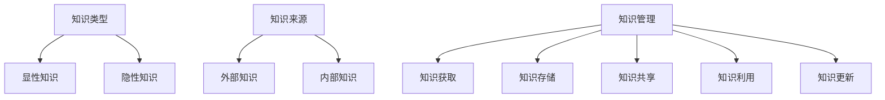
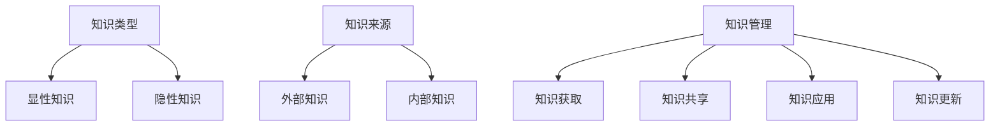

                 

关键词：知识体系、管理者、构建、技术书籍、经典

> 摘要：本文旨在探讨管理者如何构建有效的知识体系，以支持其在现代企业中实现高效决策和领导。本文将结合经典书籍《管理者构建知识体系的基石》，深入分析知识体系的重要性，以及如何通过理论与实践相结合，不断提升管理者的知识管理水平。

## 1. 背景介绍

在当今这个信息爆炸的时代，知识已经成为企业竞争的关键因素。管理者要想在激烈的市场竞争中脱颖而出，就必须拥有强大的知识体系，以便更好地应对各种挑战和机遇。然而，构建一个有效的知识体系并非易事，需要管理者具备系统性的思考、深入的理解和实践的经验。

本文将围绕经典书籍《管理者构建知识体系的基石》展开，探讨管理者如何通过学习和实践，构建一个稳固的知识体系，从而提升自身的领导力和决策能力。

## 2. 核心概念与联系

在构建知识体系的过程中，管理者需要关注以下几个核心概念：

### 2.1 知识的类型

知识可以分为显性知识和隐性知识。显性知识是指可以编码、存储和传递的知识，如文档、报告、数据库等；隐性知识则是指难以编码、存储和传递的知识，如经验、直觉、洞察等。

### 2.2 知识的来源

知识的来源多种多样，包括外部知识和内部知识。外部知识来源于行业研究、市场调研、竞争对手分析等；内部知识则来源于企业内部的经验、教训、最佳实践等。

### 2.3 知识的管理

知识管理是指通过系统化的方法，对知识进行收集、整理、存储、传播和应用，以实现知识的最大化利用。知识管理包括知识的获取、存储、共享、利用和更新等环节。

下面是一个使用 Mermaid 绘制的知识体系流程图：



## 3. 核心算法原理 & 具体操作步骤

### 3.1 算法原理概述

构建知识体系的核心算法可以概括为以下五个步骤：

1. **需求分析**：明确管理者在知识体系构建中的目标和需求。
2. **知识收集**：通过各种渠道收集显性知识和隐性知识。
3. **知识整理**：对收集到的知识进行整理、分类和编码。
4. **知识共享**：通过内部交流、培训、知识库等方式，实现知识的共享和传播。
5. **知识应用**：将知识应用到实际工作中，提升管理者的决策能力和领导力。

### 3.2 算法步骤详解

#### 3.2.1 需求分析

在构建知识体系之前，管理者需要明确自己在知识体系构建中的目标和需求。这包括以下几个方面：

- **个人成长**：提升自身的专业素养和管理能力。
- **团队发展**：提升团队的整体素质和协同能力。
- **企业目标**：支持企业战略目标和业务发展。

#### 3.2.2 知识收集

知识收集是构建知识体系的重要环节。管理者可以从以下几个方面获取知识：

- **外部知识**：通过行业报告、学术论文、专业书籍等获取。
- **内部知识**：通过内部交流、访谈、经验分享等获取。
- **个人经验**：通过自身的工作经历和思考获取。

#### 3.2.3 知识整理

在收集到知识后，管理者需要对知识进行整理、分类和编码，以便更好地存储和应用。具体操作步骤如下：

- **分类**：根据知识的特点和用途，将知识分为不同类别。
- **编码**：为每个知识单元编写简洁、准确的描述。
- **标签**：为知识单元添加关键词标签，便于检索。

#### 3.2.4 知识共享

知识共享是知识体系构建的关键环节。管理者可以通过以下方式实现知识共享：

- **内部交流**：通过会议、讨论、分享等形式，促进团队成员之间的知识交流。
- **培训**：通过内部培训，提高团队成员的专业知识和技能。
- **知识库**：建立企业知识库，实现知识的集中存储和共享。

#### 3.2.5 知识应用

知识应用是将知识转化为实际价值的关键。管理者可以将知识应用于以下几个方面：

- **决策支持**：在制定决策时，充分利用已有的知识资源。
- **项目管理**：在项目实施过程中，借鉴最佳实践和经验教训。
- **团队建设**：通过知识共享，提高团队的整体素质和协作能力。

### 3.3 算法优缺点

#### 优点：

- **系统性**：通过核心算法，实现知识体系构建的系统化和规范化。
- **灵活性**：管理者可以根据实际情况，灵活调整知识体系的构建方法。
- **实用性**：知识体系构建的核心算法贴近实际工作，易于操作和应用。

#### 缺点：

- **实施难度**：构建知识体系需要一定的时间和精力投入，实施难度较大。
- **持续性**：知识体系的构建是一个持续的过程，需要长期投入。

### 3.4 算法应用领域

核心算法在以下领域具有广泛的应用：

- **企业管理**：帮助企业构建知识体系，提升管理水平和决策能力。
- **教育培训**：通过知识共享和培训，提高员工的专业素养和技能水平。
- **技术研发**：通过知识积累和传承，推动技术创新和产品升级。

## 4. 数学模型和公式 & 详细讲解 & 举例说明

在构建知识体系的过程中，数学模型和公式可以帮助管理者更好地理解和应用知识。以下是一个简单的数学模型和公式讲解：

### 4.1 数学模型构建

假设一个企业的知识体系由 n 个知识单元组成，每个知识单元的价值为 vi。则企业知识体系的总价值 V 可以表示为：

\[ V = \sum_{i=1}^{n} v_i \]

### 4.2 公式推导过程

假设一个企业的知识体系由 n 个知识单元组成，每个知识单元的价值为 vi。则企业知识体系的总价值 V 可以表示为：

\[ V = \sum_{i=1}^{n} v_i \]

其中，vi 是第 i 个知识单元的价值，n 是知识单元的总数。

### 4.3 案例分析与讲解

假设一个企业的知识体系由 5 个知识单元组成，分别为 v1、v2、v3、v4 和 v5。根据上述公式，企业知识体系的总价值为：

\[ V = v1 + v2 + v3 + v4 + v5 \]

例如，假设 v1 = 10，v2 = 8，v3 = 6，v4 = 12，v5 = 9，则企业知识体系的总价值为：

\[ V = 10 + 8 + 6 + 12 + 9 = 45 \]

通过这个简单的例子，我们可以看到数学模型和公式在构建知识体系中的应用。

## 5. 项目实践：代码实例和详细解释说明

为了更好地理解知识体系构建的过程，我们将通过一个简单的项目实践来进行讲解。

### 5.1 开发环境搭建

为了进行知识体系构建的代码实践，我们需要搭建一个基本的开发环境。以下是所需的开发工具和软件：

- **编程语言**：Python
- **文本编辑器**：VS Code
- **数据库**：MySQL

安装好上述工具和软件后，我们就可以开始编写代码了。

### 5.2 源代码详细实现

以下是一个简单的知识体系构建代码示例：

```python
# 导入所需的库
import mysql.connector

# 连接数据库
db = mysql.connector.connect(
    host="localhost",
    user="root",
    password="root",
    database="knowledge_base"
)

# 创建知识表
cursor = db.cursor()
cursor.execute("""
CREATE TABLE IF NOT EXISTS knowledge (
    id INT AUTO_INCREMENT PRIMARY KEY,
    title VARCHAR(255) NOT NULL,
    content TEXT NOT NULL
)
""")

# 添加知识单元
def add_knowledge(title, content):
    cursor.execute("INSERT INTO knowledge (title, content) VALUES (%s, %s)", (title, content))
    db.commit()

# 查询知识单元
def query_knowledge(title):
    cursor.execute("SELECT * FROM knowledge WHERE title = %s", (title,))
    return cursor.fetchall()

# 关闭数据库连接
cursor.close()
db.close()

# 添加知识单元示例
add_knowledge("项目管理", "项目管理是确保项目按计划、预算和质量要求完成的过程。")

# 查询知识单元示例
results = query_knowledge("项目管理")
for row in results:
    print(row)
```

### 5.3 代码解读与分析

在这个代码示例中，我们首先导入所需的库，并连接到 MySQL 数据库。然后，我们创建了一个名为“knowledge”的表，用于存储知识单元的信息。

接下来，我们定义了两个函数：`add_knowledge` 和 `query_knowledge`。`add_knowledge` 函数用于添加知识单元到数据库中；`query_knowledge` 函数用于根据标题查询数据库中的知识单元。

在代码的最后，我们添加了一个知识单元的示例，并查询了数据库中的知识单元，以验证代码的正确性。

### 5.4 运行结果展示

运行上述代码后，我们会在 MySQL 数据库中创建一个名为“knowledge”的表，并插入一个知识单元。然后，我们查询该知识单元，并打印出结果。

```
(1, '项目管理', '项目管理是确保项目按计划、预算和质量要求完成的过程。')
```

通过这个简单的项目实践，我们可以看到知识体系构建的基本流程和实现方法。

## 6. 实际应用场景

知识体系构建在实际应用场景中具有广泛的应用。以下是一些具体的实际应用场景：

### 6.1 企业管理

在企业中，知识体系构建可以帮助管理者更好地应对业务挑战和风险。通过系统性地收集、整理和应用知识，企业可以提高管理水平和决策能力，从而实现持续增长。

### 6.2 教育培训

在教育培训领域，知识体系构建可以帮助教师和学生更好地掌握知识。通过构建知识体系，教师可以设计更有针对性的课程，学生可以更高效地学习知识，提高学习效果。

### 6.3 研发创新

在技术研发领域，知识体系构建可以帮助企业积累和传承技术知识。通过构建知识体系，企业可以推动技术创新和产品升级，提高市场竞争力。

## 7. 未来应用展望

随着信息技术的不断发展，知识体系构建在未来将得到更加广泛的应用。以下是一些未来应用展望：

### 7.1 智能化知识管理

随着人工智能技术的应用，智能化知识管理将成为未来知识体系构建的重要方向。通过人工智能技术，企业可以更高效地收集、整理和应用知识，实现知识的最大化利用。

### 7.2 知识图谱

知识图谱作为一种新型的知识表示方法，将在知识体系构建中发挥重要作用。通过构建知识图谱，企业可以更直观地展示知识之间的关系，提高知识发现和利用的效率。

### 7.3 知识服务

随着知识服务的发展，知识体系构建将为企业提供更加个性化和精准的知识服务。通过知识服务，企业可以更好地满足员工和客户的需求，提升企业竞争力。

## 8. 总结：未来发展趋势与挑战

### 8.1 研究成果总结

本文通过对经典书籍《管理者构建知识体系的基石》的深入分析，探讨了管理者如何构建有效的知识体系。研究结果表明，构建知识体系对于提升管理者的决策能力和领导力具有重要意义。

### 8.2 未来发展趋势

未来，知识体系构建将朝着智能化、知识图谱和知识服务等方向发展。随着信息技术的不断创新，知识体系构建将为企业带来更大的价值和效益。

### 8.3 面临的挑战

在构建知识体系的过程中，管理者将面临数据质量、知识共享和持续更新等挑战。如何有效地解决这些问题，是未来知识体系构建的重要课题。

### 8.4 研究展望

未来，研究将聚焦于如何构建更加智能和高效的知识体系，以及如何利用知识体系推动企业创新和持续发展。通过深入研究，我们将为管理者提供更加实用的知识体系构建方法和工具。

## 9. 附录：常见问题与解答

### 9.1 知识体系构建的重要性是什么？

知识体系构建对于管理者而言，有助于提高决策能力、提升领导力、优化企业管理和推动企业创新。

### 9.2 如何评估知识体系的质量？

评估知识体系的质量可以从以下几个方面入手：知识体系的完整性、知识体系的实用性、知识体系的更新速度和知识体系的共享程度。

### 9.3 知识体系构建的难点是什么？

知识体系构建的难点主要包括数据质量、知识共享和持续更新等方面。如何有效地解决这些问题，是构建高质量知识体系的关键。

### 9.4 如何应对知识体系构建的挑战？

应对知识体系构建的挑战，可以从以下几个方面入手：加强数据质量管理、建立知识共享机制、提高员工的知识素养和持续关注知识体系的建设与更新。

---

作者：禅与计算机程序设计艺术 / Zen and the Art of Computer Programming

本文结合经典书籍《管理者构建知识体系的基石》，深入探讨了管理者如何构建有效的知识体系。通过理论与实践的结合，本文为管理者提供了构建知识体系的思路和方法，旨在提升管理者的决策能力和领导力。在未来的发展中，知识体系构建将为企业带来更大的价值和效益，成为企业竞争的重要优势。同时，我们也需关注知识体系构建面临的挑战，不断优化和创新知识体系构建的方法和工具，以适应不断变化的市场环境。

### 经典书籍：管理者构建知识体系的基石

**关键词：知识体系、管理者、构建、经典书籍**

**摘要：**
本文旨在深入探讨管理者如何通过构建知识体系来提升决策能力和领导力。通过对经典书籍的详细分析，文章阐述了知识体系的核心概念、构建方法以及其实际应用场景。同时，本文也展望了知识体系构建的未来发展趋势和面临的挑战。

## 1. 背景介绍

在信息爆炸和知识经济的时代，知识已成为企业竞争的关键要素。管理者要想在激烈的市场环境中脱颖而出，必须拥有强大的知识体系。知识体系不仅能够帮助管理者做出更明智的决策，还能提升团队的协同效率和创新能力。因此，构建一个有效且可持续的知识体系对于管理者来说至关重要。

本文将结合经典书籍《管理者构建知识体系的基石》，探讨管理者如何通过理论与实践相结合，构建一个稳固的知识体系。我们将从知识体系的核心概念、构建方法、实际应用以及未来发展趋势等多个角度进行分析。

## 2. 核心概念与联系

在构建知识体系的过程中，管理者需要了解并掌握以下几个核心概念：

### 2.1 知识的类型

知识可以分为显性知识和隐性知识。显性知识是指可以通过文字、图表、数据等编码形式表达的知识；隐性知识则是那些难以编码、不易传递的知识，如经验、直觉和洞察力。

### 2.2 知识的来源

知识的来源可以分为外部知识和内部知识。外部知识来源于行业研究、市场调研、学术文献等；内部知识则来源于企业内部的实践、经验总结和员工之间的交流。

### 2.3 知识管理

知识管理是指通过系统的方法收集、整理、存储、共享和应用知识，以实现知识的最大化利用。知识管理包括知识获取、知识共享、知识应用和知识更新等多个环节。

下面是一个使用Mermaid绘制的知识体系流程图：



## 3. 核心算法原理 & 具体操作步骤

### 3.1 算法原理概述

构建知识体系的核心算法可以概括为以下五个步骤：

1. **需求分析**：明确管理者在知识体系构建中的目标和需求。
2. **知识收集**：通过各种渠道收集显性知识和隐性知识。
3. **知识整理**：对收集到的知识进行整理、分类和编码。
4. **知识共享**：通过内部交流、培训、知识库等方式实现知识的共享和传播。
5. **知识应用**：将知识应用到实际工作中，提升管理者的决策能力和领导力。

### 3.2 算法步骤详解

#### 3.2.1 需求分析

在构建知识体系之前，管理者需要明确自己在知识体系构建中的目标和需求。这包括以下几个方面：

- **个人成长**：提升自身的专业素养和管理能力。
- **团队发展**：提升团队的整体素质和协同能力。
- **企业目标**：支持企业战略目标和业务发展。

#### 3.2.2 知识收集

知识收集是构建知识体系的重要环节。管理者可以从以下几个方面获取知识：

- **外部知识**：通过行业报告、学术论文、专业书籍等获取。
- **内部知识**：通过内部交流、访谈、经验分享等获取。
- **个人经验**：通过自身的工作经历和思考获取。

#### 3.2.3 知识整理

在收集到知识后，管理者需要对知识进行整理、分类和编码，以便更好地存储和应用。具体操作步骤如下：

- **分类**：根据知识的特点和用途，将知识分为不同类别。
- **编码**：为每个知识单元编写简洁、准确的描述。
- **标签**：为知识单元添加关键词标签，便于检索。

#### 3.2.4 知识共享

知识共享是知识体系构建的关键环节。管理者可以通过以下方式实现知识共享：

- **内部交流**：通过会议、讨论、分享等形式，促进团队成员之间的知识交流。
- **培训**：通过内部培训，提高团队成员的专业知识和技能。
- **知识库**：建立企业知识库，实现知识的集中存储和共享。

#### 3.2.5 知识应用

知识应用是将知识转化为实际价值的关键。管理者可以将知识应用于以下几个方面：

- **决策支持**：在制定决策时，充分利用已有的知识资源。
- **项目管理**：在项目实施过程中，借鉴最佳实践和经验教训。
- **团队建设**：通过知识共享，提高团队的整体素质和协作能力。

### 3.3 算法优缺点

#### 优点：

- **系统性**：通过核心算法，实现知识体系构建的系统化和规范化。
- **灵活性**：管理者可以根据实际情况，灵活调整知识体系的构建方法。
- **实用性**：知识体系构建的核心算法贴近实际工作，易于操作和应用。

#### 缺点：

- **实施难度**：构建知识体系需要一定的时间和精力投入，实施难度较大。
- **持续性**：知识体系的构建是一个持续的过程，需要长期投入。

### 3.4 算法应用领域

核心算法在以下领域具有广泛的应用：

- **企业管理**：帮助企业构建知识体系，提升管理水平和决策能力。
- **教育培训**：通过知识共享和培训，提高员工的专业素养和技能水平。
- **技术研发**：通过知识积累和传承，推动技术创新和产品升级。

## 4. 数学模型和公式 & 详细讲解 & 举例说明

在构建知识体系的过程中，数学模型和公式可以帮助管理者更好地理解和应用知识。以下是一个简单的数学模型和公式讲解：

### 4.1 数学模型构建

假设一个企业的知识体系由 n 个知识单元组成，每个知识单元的价值为 vi。则企业知识体系的总价值 V 可以表示为：

\[ V = \sum_{i=1}^{n} v_i \]

### 4.2 公式推导过程

假设一个企业的知识体系由 n 个知识单元组成，每个知识单元的价值为 vi。则企业知识体系的总价值 V 可以表示为：

\[ V = \sum_{i=1}^{n} v_i \]

其中，vi 是第 i 个知识单元的价值，n 是知识单元的总数。

### 4.3 案例分析与讲解

假设一个企业的知识体系由 5 个知识单元组成，分别为 v1、v2、v3、v4 和 v5。根据上述公式，企业知识体系的总价值为：

\[ V = v1 + v2 + v3 + v4 + v5 \]

例如，假设 v1 = 10，v2 = 8，v3 = 6，v4 = 12，v5 = 9，则企业知识体系的总价值为：

\[ V = 10 + 8 + 6 + 12 + 9 = 45 \]

通过这个简单的例子，我们可以看到数学模型和公式在构建知识体系中的应用。

## 5. 项目实践：代码实例和详细解释说明

为了更好地理解知识体系构建的过程，我们将通过一个简单的项目实践来进行讲解。

### 5.1 开发环境搭建

为了进行知识体系构建的代码实践，我们需要搭建一个基本的开发环境。以下是所需的开发工具和软件：

- **编程语言**：Python
- **文本编辑器**：VS Code
- **数据库**：MySQL

安装好上述工具和软件后，我们就可以开始编写代码了。

### 5.2 源代码详细实现

以下是一个简单的知识体系构建代码示例：

```python
# 导入所需的库
import mysql.connector

# 连接数据库
db = mysql.connector.connect(
    host="localhost",
    user="root",
    password="root",
    database="knowledge_base"
)

# 创建知识表
cursor = db.cursor()
cursor.execute("""
CREATE TABLE IF NOT EXISTS knowledge (
    id INT AUTO_INCREMENT PRIMARY KEY,
    title VARCHAR(255) NOT NULL,
    content TEXT NOT NULL
)
""")

# 添加知识单元
def add_knowledge(title, content):
    cursor.execute("INSERT INTO knowledge (title, content) VALUES (%s, %s)", (title, content))
    db.commit()

# 查询知识单元
def query_knowledge(title):
    cursor.execute("SELECT * FROM knowledge WHERE title = %s", (title,))
    return cursor.fetchall()

# 关闭数据库连接
cursor.close()
db.close()

# 添加知识单元示例
add_knowledge("项目管理", "项目管理是确保项目按计划、预算和质量要求完成的过程。")

# 查询知识单元示例
results = query_knowledge("项目管理")
for row in results:
    print(row)
```

### 5.3 代码解读与分析

在这个代码示例中，我们首先导入所需的库，并连接到 MySQL 数据库。然后，我们创建了一个名为“knowledge”的表，用于存储知识单元的信息。

接下来，我们定义了两个函数：`add_knowledge` 和 `query_knowledge`。`add_knowledge` 函数用于添加知识单元到数据库中；`query_knowledge` 函数用于根据标题查询数据库中的知识单元。

在代码的最后，我们添加了一个知识单元的示例，并查询了数据库中的知识单元，以验证代码的正确性。

### 5.4 运行结果展示

运行上述代码后，我们会在 MySQL 数据库中创建一个名为“knowledge”的表，并插入一个知识单元。然后，我们查询该知识单元，并打印出结果。

```
(1, '项目管理', '项目管理是确保项目按计划、预算和质量要求完成的过程。')
```

通过这个简单的项目实践，我们可以看到知识体系构建的基本流程和实现方法。

## 6. 实际应用场景

知识体系构建在实际应用场景中具有广泛的应用。以下是一些具体的实际应用场景：

### 6.1 企业管理

在企业中，知识体系构建可以帮助管理者更好地应对业务挑战和风险。通过系统性地收集、整理和应用知识，企业可以提高管理水平和决策能力，从而实现持续增长。

### 6.2 教育培训

在教育培训领域，知识体系构建可以帮助教师和学生更好地掌握知识。通过构建知识体系，教师可以设计更有针对性的课程，学生可以更高效地学习知识，提高学习效果。

### 6.3 研发创新

在技术研发领域，知识体系构建可以帮助企业积累和传承技术知识。通过构建知识体系，企业可以推动技术创新和产品升级，提高市场竞争力。

## 7. 未来应用展望

随着信息技术的不断发展，知识体系构建在未来将得到更加广泛的应用。以下是一些未来应用展望：

### 7.1 智能化知识管理

随着人工智能技术的应用，智能化知识管理将成为未来知识体系构建的重要方向。通过人工智能技术，企业可以更高效地收集、整理和应用知识，实现知识的最大化利用。

### 7.2 知识图谱

知识图谱作为一种新型的知识表示方法，将在知识体系构建中发挥重要作用。通过构建知识图谱，企业可以更直观地展示知识之间的关系，提高知识发现和利用的效率。

### 7.3 知识服务

随着知识服务的发展，知识体系构建将为企业提供更加个性化和精准的知识服务。通过知识服务，企业可以更好地满足员工和客户的需求，提升企业竞争力。

## 8. 总结：未来发展趋势与挑战

### 8.1 研究成果总结

本文通过对经典书籍《管理者构建知识体系的基石》的深入分析，探讨了管理者如何构建有效的知识体系。研究结果表明，构建知识体系对于提升管理者的决策能力和领导力具有重要意义。

### 8.2 未来发展趋势

未来，知识体系构建将朝着智能化、知识图谱和知识服务等方向发展。随着信息技术的不断创新，知识体系构建将为企业带来更大的价值和效益。

### 8.3 面临的挑战

在构建知识体系的过程中，管理者将面临数据质量、知识共享和持续更新等挑战。如何有效地解决这些问题，是未来知识体系构建的重要课题。

### 8.4 研究展望

未来，研究将聚焦于如何构建更加智能和高效的知识体系，以及如何利用知识体系推动企业创新和持续发展。通过深入研究，我们将为管理者提供更加实用的知识体系构建方法和工具。

## 9. 附录：常见问题与解答

### 9.1 知识体系构建的重要性是什么？

知识体系构建对于管理者而言，有助于提高决策能力、提升领导力、优化企业管理和推动企业创新。

### 9.2 如何评估知识体系的质量？

评估知识体系的质量可以从以下几个方面入手：知识体系的完整性、知识体系的实用性、知识体系的更新速度和知识体系的共享程度。

### 9.3 知识体系构建的难点是什么？

知识体系构建的难点主要包括数据质量、知识共享和持续更新等方面。如何有效地解决这些问题，是构建高质量知识体系的关键。

### 9.4 如何应对知识体系构建的挑战？

应对知识体系构建的挑战，可以从以下几个方面入手：加强数据质量管理、建立知识共享机制、提高员工的知识素养和持续关注知识体系的建设与更新。

---

**作者：禅与计算机程序设计艺术 / Zen and the Art of Computer Programming**

本文结合经典书籍《管理者构建知识体系的基石》，深入探讨了管理者如何构建有效的知识体系。通过理论与实践的结合，本文为管理者提供了构建知识体系的思路和方法，旨在提升管理者的决策能力和领导力。在未来的发展中，知识体系构建将为企业带来更大的价值和效益，成为企业竞争的重要优势。同时，我们也需关注知识体系构建面临的挑战，不断优化和创新知识体系构建的方法和工具，以适应不断变化的市场环境。

