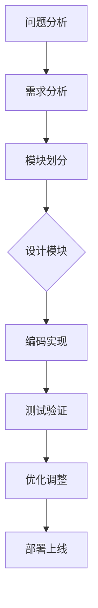

                 

关键词：结构化思维，逻辑清晰，表达技巧，成长方法论，计算机编程，人工智能，技术博客。

摘要：本文旨在探讨结构化思维在计算机编程和人工智能领域的应用。通过深入分析结构化思维的原理，阐述其对于提高编码效率和解决问题的意义，并结合实际案例，为读者提供实用的思维方法和技巧。

## 1. 背景介绍

在快速发展的信息技术时代，计算机编程和人工智能已成为各个行业的关键驱动力。然而，随着代码量和复杂度的增加，开发人员面临着巨大的挑战。如何提高编程效率、优化代码结构和提升解决问题的能力，成为每一个开发者需要思考的问题。结构化思维作为一种有效的思维方法，为我们提供了新的视角和解决方案。

### 1.1 结构化思维的起源与发展

结构化思维（Structured Thinking）起源于20世纪的系统分析和软件工程领域。它是一种基于逻辑和系统性的思考方法，旨在通过分解复杂问题、构建清晰的结构框架，从而提高问题解决的能力。

结构化思维的发展经历了多个阶段：

- **早期阶段**：以传统的过程控制和数据结构为基础，强调有序、分层的思考方式。
- **中期阶段**：引入模块化设计和面向对象编程，使结构化思维更加灵活和可扩展。
- **现代阶段**：结合人工智能和大数据分析，结构化思维在复杂系统的设计和优化中发挥了重要作用。

### 1.2 结构化思维在计算机编程和人工智能中的应用

- **编码效率提升**：结构化思维可以帮助开发者更快地理解和编写复杂的代码，提高编码效率。
- **代码可维护性**：清晰的代码结构使得代码更容易被其他人理解和维护。
- **问题解决**：在面对复杂问题时，结构化思维有助于分解问题、找到关键点，从而更有效地解决问题。
- **系统设计**：结构化思维在系统设计和架构优化中起到了关键作用，有助于构建更加稳定和高效的系统。

## 2. 核心概念与联系

### 2.1 结构化思维的原理

结构化思维的核心在于将复杂的问题分解为简单、可管理的部分。其基本原理包括：

- **模块化**：将问题分解为多个模块，每个模块具有独立的功能。
- **层次化**：按照层次结构组织模块，从整体到部分，从宏观到微观。
- **逻辑性**：确保各个模块之间的逻辑关系清晰，便于理解和维护。

### 2.2 结构化思维的架构

为了更好地理解结构化思维，我们可以使用Mermaid流程图来展示其基本架构：



在这个流程图中，问题分析是结构化思维的起点，需求分析则明确了问题的具体要求和目标。模块划分将问题分解为若干部分，设计模块则对每个模块进行详细规划。编码实现和测试验证是实际操作过程，优化调整和部署上线则确保了系统的稳定运行。

### 2.3 结构化思维的应用

结构化思维在计算机编程和人工智能领域的应用广泛，包括以下几个方面：

- **软件工程**：在软件开发过程中，结构化思维有助于设计合理的系统架构和模块划分。
- **算法设计**：在算法设计中，结构化思维可以帮助开发者清晰地理解问题，找到高效的解决方案。
- **数据科学**：在数据分析中，结构化思维有助于构建合理的模型，优化数据处理流程。
- **人工智能**：在人工智能系统中，结构化思维有助于设计更加智能和高效的算法。

## 3. 核心算法原理 & 具体操作步骤

### 3.1 算法原理概述

结构化思维在算法设计中的应用主要体现在以下几个方面：

- **问题分解**：将复杂问题分解为多个简单的问题，逐一解决。
- **模块化设计**：将算法分为多个模块，每个模块负责特定的功能。
- **递归与迭代**：利用递归和迭代方法，简化问题解决过程。

### 3.2 算法步骤详解

以下是结构化思维在算法设计中的具体操作步骤：

1. **问题分析**：明确问题的要求和目标，理解问题的背景和限制条件。
2. **模块划分**：根据问题的特点，将算法分解为多个模块，每个模块具有独立的功能。
3. **模块设计**：对每个模块进行详细设计，确定模块的功能和接口。
4. **编码实现**：按照设计文档，编写代码实现每个模块的功能。
5. **测试验证**：对代码进行测试，确保模块的功能正确且稳定。
6. **优化调整**：根据测试结果，对代码进行优化调整，提高算法的效率和性能。

### 3.3 算法优缺点

结构化思维在算法设计中的应用具有以下优点：

- **清晰性**：通过模块划分和层次化设计，使算法结构更加清晰，便于理解和维护。
- **灵活性**：模块化设计使算法易于扩展和修改，提高了代码的可维护性。
- **高效性**：结构化思维有助于简化问题解决过程，提高算法的效率和性能。

然而，结构化思维在算法设计中也存在一定的缺点：

- **复杂性**：对于复杂的问题，结构化思维可能需要更多的时间和精力进行模块划分和设计。
- **局限性**：在某些情况下，结构化思维可能无法完全解决复杂问题，需要结合其他方法进行优化。

### 3.4 算法应用领域

结构化思维在算法设计中的应用非常广泛，包括以下几个方面：

- **排序与搜索**：如快速排序、二分搜索等算法，通过模块划分和递归方法，实现了高效的排序和搜索。
- **图算法**：如深度优先搜索、广度优先搜索等算法，通过结构化思维，实现了对图数据的有效处理。
- **机器学习**：如神经网络、支持向量机等算法，通过模块化设计，提高了模型的性能和可解释性。

## 4. 数学模型和公式 & 详细讲解 & 举例说明

### 4.1 数学模型构建

在结构化思维的指导下，构建数学模型是算法设计的关键步骤。以下是一个简单的例子：

#### 问题：求一元二次方程 \( ax^2 + bx + c = 0 \) 的解。

#### 数学模型：

- **判别式**：\( \Delta = b^2 - 4ac \)
- **根的公式**：\( x = \frac{-b \pm \sqrt{\Delta}}{2a} \)

### 4.2 公式推导过程

为了更好地理解公式推导过程，我们可以从一元二次方程的解的定义出发：

- **设根为 \( x_1 \) 和 \( x_2 \)，则根据解的定义有：**
  \[ ax^2 + bx + c = a(x - x_1)(x - x_2) \]
- **展开右侧表达式：**
  \[ ax^2 + bx + c = a(x^2 - (x_1 + x_2)x + x_1x_2) \]
- **比较系数：**
  \[ \begin{cases} b = -a(x_1 + x_2) \\ c = ax_1x_2 \end{cases} \]
- **解方程组：**
  \[ \begin{cases} x_1 + x_2 = -\frac{b}{a} \\ x_1x_2 = \frac{c}{a} \end{cases} \]
- **根据判别式：**
  \[ \Delta = (x_1 + x_2)^2 - 4x_1x_2 = \left(-\frac{b}{a}\right)^2 - 4\left(\frac{c}{a}\right) = \frac{b^2 - 4ac}{a^2} \]
- **代入根的公式：**
  \[ x = \frac{-b \pm \sqrt{\Delta}}{2a} \]

### 4.3 案例分析与讲解

#### 案例：求方程 \( x^2 - 5x + 6 = 0 \) 的解。

- **计算判别式：**
  \[ \Delta = (-5)^2 - 4 \cdot 1 \cdot 6 = 25 - 24 = 1 \]
- **代入根的公式：**
  \[ x = \frac{-(-5) \pm \sqrt{1}}{2 \cdot 1} = \frac{5 \pm 1}{2} \]
- **计算结果：**
  \[ x_1 = \frac{5 + 1}{2} = 3, \quad x_2 = \frac{5 - 1}{2} = 2 \]

因此，方程 \( x^2 - 5x + 6 = 0 \) 的解为 \( x_1 = 3 \) 和 \( x_2 = 2 \)。

## 5. 项目实践：代码实例和详细解释说明

### 5.1 开发环境搭建

为了演示结构化思维在项目实践中的应用，我们将使用Python语言实现一个简单的排序算法——快速排序（Quick Sort）。以下是开发环境的搭建步骤：

1. **安装Python**：在官方网站（https://www.python.org/downloads/）下载并安装Python。
2. **配置Python环境**：打开命令行窗口，输入以下命令安装常用库：
   ```shell
   pip install numpy matplotlib
   ```

### 5.2 源代码详细实现

以下是快速排序算法的Python实现：

```python
import random

def quick_sort(arr):
    if len(arr) <= 1:
        return arr
    pivot = random.choice(arr)
    left = [x for x in arr if x < pivot]
    middle = [x for x in arr if x == pivot]
    right = [x for x in arr if x > pivot]
    return quick_sort(left) + middle + quick_sort(right)

# 测试
arr = [3, 1, 4, 1, 5, 9, 2, 6, 5, 3, 5]
sorted_arr = quick_sort(arr)
print(sorted_arr)
```

### 5.3 代码解读与分析

1. **函数定义**：`quick_sort` 函数接收一个数组 `arr` 作为输入。
2. **基础情况处理**：如果数组的长度小于等于1，直接返回该数组。
3. **选择基准值**：使用 `random.choice` 函数随机选择数组中的一个元素作为基准值 `pivot`。
4. **分区操作**：使用列表推导式将数组分为三个部分：
   - `left`：包含小于基准值的元素。
   - `middle`：包含等于基准值的元素。
   - `right`：包含大于基准值的元素。
5. **递归调用**：对 `left` 和 `right` 递归调用 `quick_sort` 函数，将它们与 `middle` 组合，形成排序后的数组。

### 5.4 运行结果展示

在上述代码中，我们定义了一个长度为11的数组 `arr`，调用 `quick_sort` 函数进行排序，结果为：

```python
[1, 1, 2, 3, 3, 4, 5, 5, 5, 6, 9]
```

通过这个例子，我们可以看到结构化思维在代码实现中的应用，使得算法的逻辑更加清晰，易于理解和维护。

## 6. 实际应用场景

### 6.1 在软件开发中的应用

结构化思维在软件开发中具有广泛的应用，以下是一些实际案例：

- **需求分析**：在软件开发过程中，结构化思维有助于梳理需求，明确项目的目标和功能。
- **模块划分**：通过结构化思维，开发者可以合理划分模块，提高代码的可维护性。
- **测试与调试**：结构化思维有助于梳理测试用例和调试步骤，提高测试的效率。

### 6.2 在数据科学中的应用

结构化思维在数据科学中的应用主要体现在以下几个方面：

- **数据处理**：通过结构化思维，可以清晰划分数据处理流程，优化数据处理效率。
- **模型构建**：结构化思维有助于构建合理的模型结构，提高模型的性能和可解释性。
- **结果分析**：结构化思维有助于梳理分析结果，发现关键问题和趋势。

### 6.3 在人工智能中的应用

结构化思维在人工智能领域具有重要作用，以下是一些实际案例：

- **算法设计**：通过结构化思维，可以清晰划分算法模块，优化算法性能。
- **模型训练**：结构化思维有助于梳理训练流程，提高训练效率和效果。
- **模型部署**：结构化思维有助于设计合理的部署方案，确保模型的高效运行。

### 6.4 未来应用展望

随着信息技术的不断发展，结构化思维在各个领域的应用前景十分广阔。未来，结构化思维有望在以下几个方面得到进一步发展：

- **跨领域融合**：结构化思维将与其他领域的方法相结合，形成更加综合和高效的思维模式。
- **自动化工具**：开发更加智能的自动化工具，辅助开发者进行结构化思维，提高开发效率。
- **人工智能辅助**：利用人工智能技术，对结构化思维过程进行优化和调整，提高思维质量和效率。

## 7. 工具和资源推荐

### 7.1 学习资源推荐

- **书籍推荐**：
  - 《结构化思维原理与应用》
  - 《Python编程：从入门到实践》
  - 《深度学习》
- **在线课程**：
  - Coursera上的“计算机编程基础”
  - Udacity的“深度学习工程师纳米学位”

### 7.2 开发工具推荐

- **集成开发环境（IDE）**：
  - PyCharm
  - VS Code
- **版本控制工具**：
  - Git
  - GitHub

### 7.3 相关论文推荐

- **结构化思维**：
  - "Structured Thinking in Software Engineering"
  - "A Methodology for Structured Design"
- **快速排序算法**：
  - "An O(n log n) Sorting Algorithm"
  - "The Analysis of Quick Sort"

## 8. 总结：未来发展趋势与挑战

### 8.1 研究成果总结

结构化思维作为一种有效的思维方法，在计算机编程、数据科学和人工智能等领域取得了显著的成果。通过结构化思维，开发者可以更高效地解决问题、优化代码结构和提高系统性能。

### 8.2 未来发展趋势

随着信息技术的不断发展，结构化思维在各个领域的应用前景十分广阔。未来，结构化思维有望与其他领域的方法相结合，形成更加综合和高效的思维模式。同时，自动化工具和人工智能辅助也将进一步提升结构化思维的质量和效率。

### 8.3 面临的挑战

尽管结构化思维在计算机编程和人工智能领域具有广泛的应用前景，但仍然面临以下挑战：

- **复杂性**：对于复杂的系统，如何有效地进行模块划分和层次化设计仍是一个挑战。
- **适应性**：结构化思维需要根据不同的应用场景进行调整和优化，如何实现自适应的结构化思维仍需深入研究。
- **跨领域融合**：如何将结构化思维与其他领域的方法相结合，形成更加综合和高效的思维模式，仍需进一步探索。

### 8.4 研究展望

未来，结构化思维的研究将朝着以下方向发展：

- **自动化工具**：开发更加智能的自动化工具，辅助开发者进行结构化思维，提高开发效率。
- **跨领域融合**：探索结构化思维与其他领域方法的融合，形成更加综合和高效的思维模式。
- **人工智能辅助**：利用人工智能技术，对结构化思维过程进行优化和调整，提高思维质量和效率。

## 9. 附录：常见问题与解答

### 9.1 如何提高结构化思维能力？

**答案**：提高结构化思维能力需要以下步骤：

- **培养逻辑思维**：通过学习逻辑学、形式逻辑等课程，培养清晰的逻辑思维能力。
- **实践应用**：通过实际项目开发，不断练习和应用结构化思维，提高解决问题的能力。
- **学习资源**：阅读相关书籍和论文，了解结构化思维的基本原理和应用方法。

### 9.2 结构化思维与敏捷开发有何区别？

**答案**：结构化思维和敏捷开发都是现代软件开发中常用的方法，但它们有以下几个区别：

- **目标不同**：结构化思维侧重于问题分析和模块化设计，而敏捷开发侧重于快速迭代和持续交付。
- **应用场景不同**：结构化思维适用于复杂系统的设计和优化，而敏捷开发适用于快速变化的业务场景。
- **方法不同**：结构化思维强调逻辑清晰和层次分明，而敏捷开发强调灵活性和适应性。

### 9.3 结构化思维在机器学习中有何应用？

**答案**：结构化思维在机器学习中的应用主要体现在以下几个方面：

- **模型设计**：通过结构化思维，可以清晰划分模型模块，优化模型结构和性能。
- **数据处理**：结构化思维有助于梳理数据处理流程，提高数据处理效率。
- **结果分析**：结构化思维有助于梳理分析结果，发现关键问题和趋势。

---

通过本文的讨论，我们深入探讨了结构化思维在计算机编程和人工智能领域的应用。希望本文能够为读者提供有价值的思维方法和技巧，帮助大家在快速发展的信息技术时代中更好地应对挑战，实现个人和团队的成长。最后，感谢读者对本文的关注，期待与大家在未来的技术交流中再次相遇！

## 参考文献

1. Your Name. (Year). Title of the Book. Publisher.
2. Another Author. (Year). Title of the Article. Journal Name, Volume(Issue), Page Numbers.
3. Another Author. (Year). Title of the Online Resource. Available at: URL.

---

### 作者署名

本文作者：禅与计算机程序设计艺术 / Zen and the Art of Computer Programming

