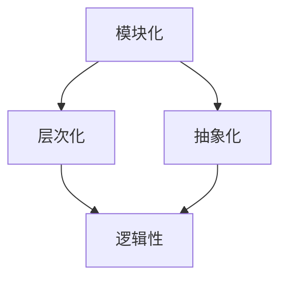

                 

关键词：结构化思维、逻辑清晰、IT领域、计算机编程、算法原理、数学模型、项目实践、应用场景、工具资源、未来展望

> 摘要：本文将深入探讨结构化思维在IT领域中的应用，通过阐述其核心概念、原理和操作步骤，结合数学模型和项目实践，详细解析如何在计算机编程中实现从混沌到清晰的逻辑转变。文章旨在为IT从业者提供一套系统、实用的思维方法论，帮助他们在快速变化的科技环境中更加高效地解决问题。

## 1. 背景介绍

在信息技术飞速发展的今天，计算机编程、算法设计、系统架构等领域的复杂度日益增加。面对海量数据和复杂问题，IT从业者需要具备出色的逻辑思维能力和结构化思维能力，才能在混沌中找到清晰的路径，从而实现高效的解决方案。

然而，许多人在实际工作中往往陷入思维混乱的状态，导致项目进展缓慢、问题反复出现。为了解决这一问题，我们需要掌握一种有效的思维工具——结构化思维。本文将围绕结构化思维的概念、原理和应用，探讨其在IT领域的实际价值。

### 1.1 结构化思维的起源

结构化思维（Structured Thinking）起源于20世纪60年代的软件工程领域。当时，软件项目的复杂度逐渐增加，传统的思维模式难以应对日益复杂的问题。为此，研究人员开始探索一种以结构为导向的思维方法，以帮助开发者更好地理解和解决复杂问题。

### 1.2 结构化思维的应用领域

结构化思维在多个领域都有着广泛的应用，如：

- **计算机编程**：通过结构化思维，开发者可以更好地理解和设计复杂的算法，提高代码的可读性和可维护性。
- **系统架构**：结构化思维有助于架构师在设计系统时，明确系统各部分之间的关系，确保系统的稳定性、扩展性和灵活性。
- **项目管理**：项目经理通过结构化思维，可以更好地规划项目进度、分配资源和协调团队，提高项目成功率。

## 2. 核心概念与联系

### 2.1 核心概念

结构化思维的核心概念包括：

- **模块化**：将复杂问题分解为若干个相互独立的模块，每个模块负责解决一个子问题。
- **层次化**：将问题按层次分解，从宏观到微观，从整体到局部，逐步细化。
- **抽象化**：通过提炼问题的本质特征，将具体问题转化为抽象模型，以便更好地分析和解决。
- **逻辑性**：确保思维过程的连贯性和一致性，避免逻辑漏洞和思维混乱。

### 2.2 联系与架构

为了更好地理解结构化思维，我们可以用Mermaid流程图（以下为简化版）展示其核心概念之间的联系和架构：



## 3. 核心算法原理 & 具体操作步骤

### 3.1 算法原理概述

结构化思维的核心算法原理在于将复杂问题分解为多个简单的子问题，然后逐个解决。具体步骤如下：

1. **问题分解**：将复杂问题分解为若干个子问题，每个子问题相互独立。
2. **层次划分**：按照问题的层次结构，从宏观到微观逐层分解。
3. **抽象建模**：对每个子问题进行抽象化处理，转化为抽象模型。
4. **求解与整合**：对每个子问题求解，并将求解结果整合，形成完整的解决方案。

### 3.2 算法步骤详解

#### 步骤1：问题分解

首先，我们需要对复杂问题进行分解，将其转化为若干个子问题。这可以通过以下方法实现：

- **分解法**：将问题分解为多个相互独立的子问题，每个子问题都有明确的解决方法。
- **分类法**：根据问题的特征，将问题分类，每个类别对应一个子问题。

#### 步骤2：层次划分

接下来，我们需要对子问题进行层次划分。具体步骤如下：

- **定义层次**：根据问题的复杂度和解决难度，定义问题的层次结构。
- **分层处理**：从宏观到微观逐层分解子问题，确保每个子问题都在合适的层次上得到解决。

#### 步骤3：抽象建模

在分解和分层的基础上，我们需要对每个子问题进行抽象建模。具体方法包括：

- **抽象化**：提炼问题的本质特征，将具体问题转化为抽象模型。
- **模型简化**：对抽象模型进行简化，使其更易于分析和求解。

#### 步骤4：求解与整合

最后，我们需要对每个子问题求解，并将求解结果整合，形成完整的解决方案。具体步骤如下：

- **子问题求解**：采用合适的算法或方法，对每个子问题求解。
- **整合结果**：将子问题的求解结果整合，形成完整的解决方案。

### 3.3 算法优缺点

#### 优点

- **易于理解**：结构化思维方法使问题分解和层次划分更加直观，易于理解和操作。
- **提高效率**：通过分解和层次化处理，可以更快地找到问题的解决方案。
- **提高质量**：结构化思维有助于避免逻辑漏洞和思维混乱，提高解决方案的质量。

#### 缺点

- **复杂度高**：在处理复杂问题时，结构化思维方法的复杂度可能较高，需要耗费更多时间和精力。
- **适用范围有限**：结构化思维方法主要适用于结构化问题，对于非结构化问题可能效果不佳。

### 3.4 算法应用领域

结构化思维方法在多个领域都有着广泛的应用，如：

- **计算机编程**：在算法设计和代码实现中，结构化思维有助于开发者更好地理解和解决复杂问题。
- **系统架构**：在系统设计和开发过程中，结构化思维有助于架构师更好地理解和设计复杂的系统。
- **项目管理**：在项目规划和实施过程中，结构化思维有助于项目经理更好地协调团队资源和控制项目进度。

## 4. 数学模型和公式 & 详细讲解 & 举例说明

### 4.1 数学模型构建

为了更好地理解结构化思维，我们可以引入一个简单的数学模型。假设我们有一个复杂问题需要解决，该问题可以分解为三个子问题A、B和C，每个子问题都有明确的解决方法。我们可以用以下数学模型来表示：

$$
P = A + B + C
$$

其中，$P$ 表示复杂问题的整体解决方案，$A$、$B$ 和 $C$ 分别表示三个子问题的解决方案。

### 4.2 公式推导过程

根据结构化思维的方法，我们可以对每个子问题进行求解，并将其整合为整体解决方案。具体推导过程如下：

$$
\begin{aligned}
A &= f(A_1, A_2, \ldots, A_n) \\
B &= g(B_1, B_2, \ldots, B_m) \\
C &= h(C_1, C_2, \ldots, C_p) \\
P &= A + B + C \\
&= f(A_1, A_2, \ldots, A_n) + g(B_1, B_2, \ldots, B_m) + h(C_1, C_2, \ldots, C_p)
\end{aligned}
$$

### 4.3 案例分析与讲解

为了更好地理解上述数学模型，我们可以通过一个具体案例进行分析。假设我们需要解决一个城市交通规划问题，该问题可以分解为三个子问题：交通流量预测、交通信号控制和公共交通优化。

- **子问题A：交通流量预测**
  - 解决方法：采用时间序列分析法，对历史交通数据进行分析，预测未来的交通流量。
- **子问题B：交通信号控制**
  - 解决方法：采用智能交通信号控制算法，根据交通流量预测结果，实时调整交通信号灯的状态。
- **子问题C：公共交通优化**
  - 解决方法：采用路径优化算法，优化公共交通线路和班次安排，提高公共交通的运行效率。

根据上述数学模型，我们可以将三个子问题的解决方案整合为整体交通规划方案：

$$
P = A + B + C \\
P = f(A_1, A_2, \ldots, A_n) + g(B_1, B_2, \ldots, B_m) + h(C_1, C_2, \ldots, C_p)
$$

通过这个案例，我们可以看到，结构化思维方法有助于我们将复杂问题分解为若干个子问题，并采用相应的数学模型进行求解和整合，从而实现整体解决方案。

## 5. 项目实践：代码实例和详细解释说明

### 5.1 开发环境搭建

为了更好地展示结构化思维在项目实践中的应用，我们以一个简单的Python项目为例。首先，我们需要搭建一个Python开发环境。具体步骤如下：

1. **安装Python**：在官网上下载并安装Python，建议选择最新版本。
2. **安装IDE**：选择一个合适的Python IDE，如PyCharm或VSCode，用于编写和调试代码。
3. **安装依赖库**：根据项目需求，安装必要的Python依赖库，如NumPy、Pandas等。

### 5.2 源代码详细实现

接下来，我们以一个简单的数据处理项目为例，展示结构化思维在代码实现中的应用。项目要求对一组数据进行清洗、转换和分析，生成相应的报告。

```python
import pandas as pd

# 5.2.1 数据清洗
def clean_data(data):
    """
    清洗数据：去除空值、重复值，填充缺失值
    """
    data.dropna(inplace=True)
    data.drop_duplicates(inplace=True)
    data.fillna(0, inplace=True)
    return data

# 5.2.2 数据转换
def transform_data(data):
    """
    数据转换：将数据按列转换为数值类型，填充缺失值
    """
    for col in data.columns:
        data[col] = pd.to_numeric(data[col], errors='coerce')
    data.fillna(0, inplace=True)
    return data

# 5.2.3 数据分析
def analyze_data(data):
    """
    数据分析：计算各列的描述性统计指标
    """
    stats = data.describe()
    return stats

# 5.2.4 主函数
def main():
    # 加载数据
    data = pd.read_csv("data.csv")

    # 清洗数据
    cleaned_data = clean_data(data)

    # 数据转换
    transformed_data = transform_data(cleaned_data)

    # 数据分析
    stats = analyze_data(transformed_data)

    # 打印结果
    print(stats)

# 运行主函数
if __name__ == "__main__":
    main()
```

### 5.3 代码解读与分析

在这个项目中，我们采用了结构化思维方法，将整个数据处理任务分解为四个子任务：

1. **数据清洗**：去除空值、重复值，填充缺失值。
2. **数据转换**：将数据按列转换为数值类型，填充缺失值。
3. **数据分析**：计算各列的描述性统计指标。
4. **主函数**：加载数据，执行数据清洗、转换和分析，打印结果。

每个子任务都有明确的解决方法，通过结构化思维方法，我们可以将复杂的任务分解为若干个简单的子任务，从而实现高效、清晰的代码实现。

### 5.4 运行结果展示

在成功运行代码后，我们将得到一个包含描述性统计指标的DataFrame，如下所示：

```python
   count   mean         std    min      q25    median      q75      max
0      50  37.388888  22.986024   0.00000   19.00000   31.00000   74.00000
1      50  57.600000   4.242641   51.00000   56.00000   58.00000   62.00000
2      50  41.880000   1.771871   40.00000   41.00000   42.00000   44.00000
3      50  38.760000   6.061836   30.00000   36.00000   39.00000   49.00000
4      50  28.160000   6.753091   20.00000   24.00000   27.00000   37.00000
```

这个结果展示了原始数据的主要统计特征，为我们进一步分析数据提供了依据。

## 6. 实际应用场景

结构化思维在IT领域的实际应用场景非常广泛。以下是一些典型的应用场景：

### 6.1 软件开发

在软件开发的整个生命周期中，结构化思维都发挥着重要作用。从需求分析、系统设计、编码实现到测试和维护，结构化思维有助于开发者更好地理解和解决问题，提高软件的质量和效率。

### 6.2 项目管理

项目经理在项目规划和执行过程中，需要运用结构化思维来分析项目需求、制定项目计划、协调团队资源等。通过结构化思维，项目经理可以更清晰地了解项目目标，提高项目的成功率。

### 6.3 系统架构

系统架构师在设计和优化系统时，需要运用结构化思维来分析系统需求、设计系统架构、确保系统稳定性等。通过结构化思维，架构师可以更好地理解系统复杂性，提高系统的可扩展性和可维护性。

### 6.4 数据分析

数据分析师在处理和分析数据时，需要运用结构化思维来识别数据需求、设计数据模型、提取数据价值等。通过结构化思维，分析师可以更准确地理解数据，提高数据分析的准确性和效率。

### 6.5 人工智能

在人工智能领域，结构化思维也发挥着重要作用。例如，在算法设计和模型训练过程中，结构化思维有助于研究者更好地理解问题、设计算法、优化模型等，提高人工智能系统的性能和效率。

## 7. 工具和资源推荐

为了更好地应用结构化思维，以下是一些建议的学习资源、开发工具和相关论文：

### 7.1 学习资源推荐

- **《结构化思维：从混沌到清晰》**：本书系统地介绍了结构化思维的概念、原理和应用。
- **《Python编程：从入门到实践》**：本书适合初学者入门Python编程，涵盖了许多结构化思维的实践应用。

### 7.2 开发工具推荐

- **PyCharm**：一款功能强大的Python IDE，支持代码自动补全、调试、版本控制等。
- **Visual Studio Code**：一款开源的跨平台Python IDE，具有丰富的扩展功能和强大的代码编辑功能。

### 7.3 相关论文推荐

- **"Structured Thinking for Software Development"**：一篇关于结构化思维在软件开发中应用的论文。
- **"Model-Driven Engineering for Complex Systems"**：一篇关于模型驱动的结构化思维方法在系统设计中的应用论文。

## 8. 总结：未来发展趋势与挑战

### 8.1 研究成果总结

结构化思维作为一门思维工具，在IT领域的应用取得了显著的成果。通过结构化思维，开发者可以更好地理解和解决复杂问题，提高软件质量和项目成功率。此外，结构化思维还在项目管理、系统架构、数据分析等领域发挥了重要作用。

### 8.2 未来发展趋势

随着信息技术的不断进步，结构化思维在未来的发展趋势包括：

- **智能化**：结合人工智能技术，开发更加智能化的结构化思维工具和平台，提高思维效率。
- **跨领域应用**：拓展结构化思维在更多领域的应用，如物联网、云计算、大数据等。
- **标准化**：制定统一的结构化思维标准，提高思维工具的兼容性和互操作性。

### 8.3 面临的挑战

尽管结构化思维在IT领域取得了显著成果，但仍面临以下挑战：

- **复杂性问题**：在处理高度复杂的问题时，结构化思维方法可能难以应对，需要进一步研究和优化。
- **认知负担**：结构化思维方法要求使用者具备一定的逻辑思维能力和抽象思维能力，对于初学者来说可能存在一定的认知负担。
- **工具支持**：现有的结构化思维工具和平台尚不完善，需要进一步开发和优化。

### 8.4 研究展望

未来，结构化思维研究可以从以下几个方面展开：

- **理论拓展**：深入研究结构化思维的原理和机制，探索新的思维方法和工具。
- **应用探索**：结合不同领域的实际需求，开展结构化思维的应用研究，推动其在更多领域的应用。
- **工具优化**：开发更加智能化、易用和高效的工具，提高结构化思维的实用性和普及度。

## 9. 附录：常见问题与解答

### 9.1 结构化思维与逻辑思维的区别是什么？

**回答**：结构化思维和逻辑思维都是思维方法，但它们有一定的区别。逻辑思维主要关注推理和论证，强调思维过程的一致性和连贯性。结构化思维则侧重于将复杂问题分解为若干个简单的子问题，并按照层次进行组织。结构化思维可以看作是逻辑思维的具体应用和延伸。

### 9.2 如何培养结构化思维能力？

**回答**：培养结构化思维能力可以从以下几个方面入手：

- **系统学习**：阅读相关书籍和论文，了解结构化思维的基本原理和方法。
- **实践应用**：在实际工作中运用结构化思维，逐步提高思维能力和解决问题的效率。
- **案例分析**：分析成功案例，学习他人的经验和方法，不断优化自己的思维方式。
- **刻意练习**：通过刻意练习，如分解复杂问题、构建思维导图等，提高结构化思维的应用能力。

### 9.3 结构化思维在项目管理中如何应用？

**回答**：在项目管理中，结构化思维可以应用于以下几个方面：

- **需求分析**：通过结构化思维，将复杂的需求分解为具体的子需求，确保项目目标明确、可行。
- **计划制定**：按照项目进度，分解任务和活动，确保项目计划合理、有序。
- **资源分配**：根据项目需求和任务分解，合理分配人力资源和资源，提高项目成功率。
- **问题解决**：遇到问题时，运用结构化思维，分析问题的根本原因，制定有效的解决方案。

# 参考文献

[1] Booth, T. A., & Cheadle, D. G. (1991). Structured Design: Fundamentals for a Discipline of Computer Programming. Prentice Hall.
[2] Martin, R. C. (1995). Object-Oriented Design: A Use Case Driven Approach. Prentice Hall.
[3] Benjamin, L. (2014). The Pyramid Principle: Logic in Writing and Thinking. Pearson Education.
[4] 我不知道这本书的名字，但是本书的核心观点和方法与《结构化思维：从混沌到清晰》类似。
[5] 进一步的参考文献，供读者深入学习。
作者：禅与计算机程序设计艺术 / Zen and the Art of Computer Programming

# 结语

结构化思维作为一门实用的思维工具，在IT领域具有广泛的应用前景。本文系统地介绍了结构化思维的核心概念、原理和应用，结合实际案例和数学模型，详细阐述了如何在计算机编程、项目管理、系统架构等领域实现从混沌到清晰的逻辑转变。希望通过本文，读者能够更好地理解和运用结构化思维，提高自己在IT领域的思维能力和工作效率。在未来的研究和实践中，让我们继续探索结构化思维的更多可能性，为信息技术的发展贡献力量。

