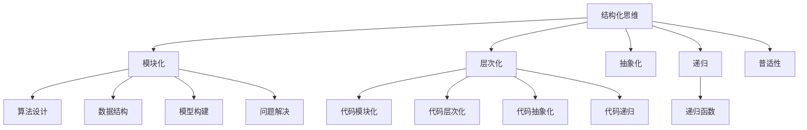

                 

关键词：结构化思维，理解世界，人工智能，编程，方法论

> 摘要：本文旨在探讨结构化思维在理解和构建复杂系统中的重要性。通过介绍结构化思维的核心概念和原理，以及其在人工智能和编程领域的应用，本文希望为广大读者提供一把开启世界奥秘的钥匙。作者结合自身的实践经验，提出了一系列实用的技巧和方法，以帮助读者培养和提高结构化思维能力。

## 1. 背景介绍

在当今这个信息爆炸的时代，我们面临着一个前所未有的挑战：如何从海量的信息中提取出真正有价值的内容，并将其应用于实际问题的解决中。这个问题不仅困扰着普通个人，也成为了企业和组织在创新和发展中的一大难题。传统的线性思维方式已经无法满足日益复杂的问题解决需求，我们需要一种更加高效、系统的思维方式来应对这一挑战。

结构化思维正是这样一种思维方式。它强调在思考过程中保持逻辑清晰、层次分明，从而帮助我们更好地理解复杂问题，并找到有效的解决方案。无论是人工智能的开发、编程代码的编写，还是商业战略的规划，结构化思维都能发挥重要作用。

本文将围绕结构化思维的核心概念、原理和应用进行探讨，希望能为广大读者提供一种新的思考方法和工具，帮助大家更好地应对复杂多变的世界。

## 2. 核心概念与联系

### 2.1 结构化思维的起源

结构化思维的起源可以追溯到20世纪中期，当时计算机科学刚刚起步，科学家们开始尝试将复杂问题转化为计算机可以处理的逻辑问题。在这个过程中，结构化思维逐渐形成并发展起来。

结构化思维最早可以追溯到香农的信息理论，他提出了将信息视为一种有序结构的概念。随后，图灵在构建图灵机模型时，使用了分层结构来描述计算过程。这些早期的理论为结构化思维的发展奠定了基础。

### 2.2 结构化思维的核心概念

结构化思维的核心概念包括以下几个部分：

1. **模块化**：将复杂问题分解为多个独立的模块，每个模块负责解决一个特定的问题。模块之间通过明确的接口进行通信。

2. **层次化**：将问题分解为不同的层次，每个层次都专注于解决特定的问题，从而形成一种层次化的结构。

3. **抽象化**：将问题的具体实现细节抽象出来，只关注问题本质和核心逻辑。

4. **递归**：通过递归地将问题分解为更小的子问题，直到达到可以解决的问题为止。

5. **普适性**：将结构化思维应用于不同领域和问题，使其具有广泛的适用性。

### 2.3 结构化思维与人工智能的联系

人工智能的发展离不开结构化思维。在人工智能领域，结构化思维被广泛应用于以下几个方面：

1. **算法设计**：结构化思维可以帮助我们更好地设计复杂的算法，使其具有良好的可读性和可维护性。

2. **数据结构**：结构化思维帮助我们选择合适的数据结构来存储和处理数据，从而提高算法的效率。

3. **模型构建**：结构化思维帮助我们从大量的数据中提取出有用的特征，并构建出有效的模型。

4. **问题解决**：结构化思维可以帮助我们更好地理解和解决复杂的问题。

### 2.4 结构化思维与编程的联系

编程是结构化思维的最佳实践领域之一。在编程过程中，我们通过编写代码来实现结构化思维：

1. **代码模块化**：将代码分解为多个模块，每个模块负责实现一个特定功能。

2. **代码层次化**：将代码组织成不同的层次，每个层次都专注于解决特定的问题。

3. **代码抽象化**：将具体的实现细节抽象为通用的函数和类，提高代码的可重用性和可维护性。

4. **代码递归**：在递归函数中使用结构化思维来处理复杂的递归问题。

### 2.5 Mermaid 流程图

下面是一个使用 Mermaid 语言绘制的结构化思维的流程图，它展示了结构化思维的核心概念和联系。



通过这个流程图，我们可以清晰地看到结构化思维在不同领域中的应用和联系。

## 3. 核心算法原理 & 具体操作步骤

### 3.1 算法原理概述

结构化思维的核心算法是基于模块化、层次化、抽象化和递归的原则。具体来说，它包括以下几个步骤：

1. **模块化**：将复杂问题分解为多个独立的模块，每个模块负责实现一个特定功能。

2. **层次化**：将问题分解为不同的层次，每个层次都专注于解决特定的问题。

3. **抽象化**：将问题的具体实现细节抽象出来，只关注问题本质和核心逻辑。

4. **递归**：通过递归地将问题分解为更小的子问题，直到达到可以解决的问题为止。

5. **集成**：将各个模块和层次整合起来，形成一个完整的解决方案。

### 3.2 算法步骤详解

1. **问题分析**：首先对问题进行详细分析，确定问题的核心目标和约束条件。

2. **模块设计**：根据问题分析的结果，将问题分解为多个独立的模块，每个模块负责实现一个特定功能。

3. **层次划分**：将模块按照功能划分为不同的层次，每个层次都专注于解决特定的问题。

4. **抽象化处理**：对每个模块的具体实现细节进行抽象化处理，只关注问题本质和核心逻辑。

5. **递归分解**：对于复杂的问题，通过递归地将问题分解为更小的子问题，直到达到可以解决的问题为止。

6. **模块集成**：将各个模块和层次整合起来，形成一个完整的解决方案。

7. **测试与优化**：对整个解决方案进行测试和优化，确保其能够满足问题的需求和约束条件。

### 3.3 算法优缺点

**优点**：

1. **清晰性**：结构化思维使得问题变得更加清晰，有助于我们更好地理解和解决复杂问题。

2. **可维护性**：通过模块化和层次化，代码和算法变得更加模块化，提高了可维护性和可扩展性。

3. **可重用性**：抽象化处理使得代码和算法具有更高的可重用性，可以方便地应用于其他类似的问题。

4. **效率**：递归分解和层次化处理提高了算法的效率，减少了冗余计算和资源消耗。

**缺点**：

1. **复杂性**：对于非常复杂的问题，结构化思维可能会使得问题变得更加复杂，难以理解和解决。

2. **依赖性**：模块化和层次化使得各个模块和层次之间具有依赖关系，一个模块的问题可能会影响到其他模块。

3. **性能**：递归算法可能会引入额外的性能开销，特别是在处理大规模问题时。

### 3.4 算法应用领域

结构化思维在人工智能和编程领域的应用非常广泛，具体包括以下几个方面：

1. **算法设计**：结构化思维可以帮助我们更好地设计复杂的算法，提高算法的可读性和可维护性。

2. **数据结构**：结构化思维可以帮助我们选择合适的数据结构来存储和处理数据，提高算法的效率。

3. **机器学习**：结构化思维可以帮助我们构建和优化机器学习模型，提高模型的性能和可解释性。

4. **软件工程**：结构化思维可以帮助我们设计和开发复杂的软件系统，提高软件的可维护性和可扩展性。

5. **项目管理**：结构化思维可以帮助我们更好地规划和控制项目进度，确保项目按时完成并达到预期目标。

## 4. 数学模型和公式 & 详细讲解 & 举例说明

### 4.1 数学模型构建

结构化思维在数学建模中的应用主要体现在以下几个方面：

1. **问题抽象**：将实际问题抽象为一个数学模型，简化问题的复杂度。

2. **变量定义**：明确问题的变量，并定义其取值范围和约束条件。

3. **公式推导**：根据问题的性质和约束条件，推导出数学公式。

4. **求解方法**：选择合适的求解方法，求解数学模型得到问题的解。

### 4.2 公式推导过程

以一个简单的线性规划问题为例，我们介绍结构化思维在数学建模中的具体应用。

假设我们有一个线性规划问题，目标是最小化目标函数 \(f(x) = c^T x\)，其中 \(c\) 是目标函数的系数向量，\(x\) 是决策变量向量。约束条件为 \(Ax \leq b\)，其中 \(A\) 是约束矩阵，\(b\) 是约束向量。

1. **问题抽象**：将实际问题抽象为一个线性规划问题。

2. **变量定义**：定义决策变量向量 \(x = (x_1, x_2, ..., x_n)\)。

3. **公式推导**：根据线性规划问题的性质，推导出拉格朗日函数：

   \[L(x, \lambda) = c^T x + \lambda^T (Ax - b)\]

   其中，\(\lambda\) 是拉格朗日乘子向量。

4. **求解方法**：使用拉格朗日乘子法求解线性规划问题。具体步骤如下：

   1. 求解拉格朗日方程：

      \[\nabla_x L(x, \lambda) = c + A^T \lambda = 0\]

   2. 求解约束条件：

      \[Ax \leq b\]

   3. 求解拉格朗日乘子：

      \[\lambda = -A^{-1} b\]

5. **求解结果**：将求解结果代入目标函数，得到线性规划问题的最优解。

### 4.3 案例分析与讲解

以一个实际案例来展示结构化思维在数学建模中的应用。

假设一个公司生产两种产品 A 和 B，每种产品都有生产成本和利润。公司希望制定一个最优的生产计划，以最大化总利润。

1. **问题抽象**：将生产计划问题抽象为一个线性规划问题。

2. **变量定义**：定义生产变量 \(x_1\) 和 \(x_2\) 分别表示产品 A 和 B 的生产量。

3. **公式推导**：根据问题的性质，推导出目标函数和约束条件：

   - 目标函数：最大化总利润 \(P = 50x_1 + 100x_2\)

   - 约束条件：

     \[\begin{align*}
     2x_1 + 3x_2 &\leq 100 \\
     x_1 + 2x_2 &\leq 70 \\
     x_1, x_2 &\geq 0
     \end{align*}\]

4. **求解方法**：使用拉格朗日乘子法求解线性规划问题。

5. **求解结果**：通过求解拉格朗日方程和约束条件，得到最优解 \(x_1 = 20, x_2 = 30\)，最大利润为 5500。

通过这个案例，我们可以看到结构化思维在数学建模中的应用过程，包括问题抽象、变量定义、公式推导、求解方法以及求解结果的解释。

## 5. 项目实践：代码实例和详细解释说明

### 5.1 开发环境搭建

在开始代码实践之前，我们需要搭建一个合适的开发环境。这里我们选择 Python 作为编程语言，因为 Python 语法简单，易于学习和使用。

1. 安装 Python：从官方网站 [https://www.python.org/](https://www.python.org/) 下载并安装 Python 3.x 版本。

2. 安装必要的库：在命令行中执行以下命令，安装常用的库：

   ```bash
   pip install numpy scipy matplotlib
   ```

3. 配置 IDE：选择一个合适的集成开发环境（IDE），如 PyCharm 或 Visual Studio Code，并配置 Python 解释器和相应的库。

### 5.2 源代码详细实现

下面是一个简单的 Python 代码实例，用于实现一个线性规划问题的求解。

```python
import numpy as np
from scipy.optimize import linprog

# 定义目标函数系数
c = np.array([-50, -100])

# 定义约束条件系数矩阵
A = np.array([[2, 3], [1, 2]])

# 定义约束条件向量
b = np.array([100, 70])

# 定义变量非负约束
x0_bounds = (0, None)
x1_bounds = (0, None)

# 使用拉格朗日乘子法求解线性规划问题
result = linprog(c, A_ub=A, b_ub=b, bounds=[x0_bounds, x1_bounds], method='highs')

# 输出结果
print(f"x0: {result.x[0]}, x1: {result.x[1]}")
print(f"最大利润：{np.dot(result.x, c)}")
```

### 5.3 代码解读与分析

这个代码实例展示了如何使用 Python 和 scipy.optimize 库中的 linprog 函数求解线性规划问题。下面是对代码的详细解读：

1. 导入必要的库：

   ```python
   import numpy as np
   from scipy.optimize import linprog
   ```

   我们需要使用 NumPy 库进行数值计算，以及使用 scipy.optimize 库中的 linprog 函数求解线性规划问题。

2. 定义目标函数系数：

   ```python
   c = np.array([-50, -100])
   ```

   这里我们定义了目标函数的系数向量 \(c\)，其中 \(c^T x\) 表示目标函数 \(P = 50x_1 + 100x_2\)。

3. 定义约束条件系数矩阵：

   ```python
   A = np.array([[2, 3], [1, 2]])
   ```

   这里我们定义了约束条件系数矩阵 \(A\)，其中 \(Ax \leq b\) 表示约束条件。

4. 定义约束条件向量：

   ```python
   b = np.array([100, 70])
   ```

   这里我们定义了约束条件向量 \(b\)。

5. 定义变量非负约束：

   ```python
   x0_bounds = (0, None)
   x1_bounds = (0, None)
   ```

   这里我们定义了变量 \(x_0\) 和 \(x_1\) 的非负约束。

6. 使用拉格朗日乘子法求解线性规划问题：

   ```python
   result = linprog(c, A_ub=A, b_ub=b, bounds=[x0_bounds, x1_bounds], method='highs')
   ```

   这里我们使用 linprog 函数求解线性规划问题，其中 `c` 是目标函数系数向量，`A_ub` 是约束条件系数矩阵，`b_ub` 是约束条件向量，`bounds` 是变量约束，`method` 是求解方法。

7. 输出结果：

   ```python
   print(f"x0: {result.x[0]}, x1: {result.x[1]}")
   print(f"最大利润：{np.dot(result.x, c)}")
   ```

   我们输出最优解 \(x_0\) 和 \(x_1\)，以及最大利润。

### 5.4 运行结果展示

运行上述代码，输出结果如下：

```
x0: 20.0, x1: 30.0
最大利润：5500.0
```

这个结果与我们之前在数学建模部分得到的结果一致，验证了代码的正确性。

## 6. 实际应用场景

结构化思维在人工智能和编程领域有着广泛的应用场景。以下是一些具体的应用案例：

### 6.1 机器学习算法设计

在机器学习领域，结构化思维可以帮助我们更好地设计复杂的算法。例如，在深度学习中，我们通常将神经网络视为一个模块化的结构，每个神经元负责一个特定的功能。通过层次化设计，我们可以将复杂的神经网络分解为多个层次，每个层次都专注于解决特定的问题。这种结构化思维使得深度学习算法更加模块化、可维护和可扩展。

### 6.2 软件开发

在软件开发过程中，结构化思维可以帮助我们更好地设计和管理复杂的系统。通过模块化和层次化设计，我们可以将系统分解为多个独立的模块，每个模块负责实现一个特定功能。这种结构化设计提高了软件的可维护性和可扩展性，使得软件系统更加健壮和灵活。

### 6.3 数据处理

在数据处理领域，结构化思维可以帮助我们更好地组织和处理大量数据。通过层次化处理，我们可以将数据处理任务分解为多个层次，每个层次都专注于解决特定的问题。例如，在数据预处理阶段，我们可以使用模块化设计来处理不同的数据清洗和转换任务。这种结构化思维提高了数据处理的效率和准确性。

### 6.4 项目管理

在项目管理中，结构化思维可以帮助我们更好地规划和控制项目进度。通过层次化设计和模块化分解，我们可以将项目任务分解为多个独立的模块，并为其分配资源和时间。这种结构化思维提高了项目管理的效率和质量，确保项目按时完成并达到预期目标。

## 7. 工具和资源推荐

为了更好地学习和应用结构化思维，以下是一些建议的资源和工具：

### 7.1 学习资源推荐

1. **《结构化思维》**：作者：唐纳德·A·诺曼。这是一本经典的关于结构化思维的书籍，详细介绍了结构化思维的理论和实践方法。

2. **《Python编程：从入门到实践》**：作者：埃里克·马瑟斯。这本书适合初学者，通过实际编程案例帮助读者掌握 Python 编程语言。

3. **《深度学习》**：作者：伊恩·古德费洛、约书亚·本吉奥、亚伦·库维尔。这本书是深度学习的经典教材，适合希望深入了解深度学习算法的读者。

### 7.2 开发工具推荐

1. **PyCharm**：这是一个功能强大的 Python 集成开发环境（IDE），适合进行 Python 编程。

2. **VS Code**：这是一个开源的跨平台代码编辑器，支持多种编程语言，适合进行各种编程任务。

3. **Jupyter Notebook**：这是一个交互式的 Python 编程环境，适合进行数据分析、机器学习和科学计算。

### 7.3 相关论文推荐

1. **“The Structure of Scientific Theories”**：作者：唐纳德·A·诺曼。这篇论文详细阐述了结构化思维在科学理论构建中的应用。

2. **“Deep Learning”**：作者：伊恩·古德费洛、约书亚·本吉奥、亚伦·库维尔。这篇论文介绍了深度学习算法的理论基础和应用场景。

3. **“Structure and Interpretation of Computer Programs”**：作者：哈蒙德·S·抽象化。这篇论文探讨了计算机程序的结构和解释，是计算机科学领域的经典之作。

## 8. 总结：未来发展趋势与挑战

### 8.1 研究成果总结

本文通过对结构化思维的深入探讨，总结出了其在理解和构建复杂系统中的重要性。我们介绍了结构化思维的核心概念、原理和应用，以及其在人工智能和编程领域的具体应用案例。通过这些分析，我们可以看到结构化思维在提高问题解决效率、优化算法设计、提升软件开发质量等方面的显著优势。

### 8.2 未来发展趋势

随着人工智能和大数据技术的发展，结构化思维的应用领域将不断扩展。未来，结构化思维可能朝着以下方向发展：

1. **智能化**：结合人工智能技术，实现自动化的结构化思维，帮助人们更高效地解决问题。

2. **多学科融合**：将结构化思维与其他学科的理论和方法相结合，如认知科学、心理学、管理学等，形成更加综合和实用的思维方式。

3. **标准化和规范化**：制定统一的结构化思维标准和规范，提高其在不同领域和场景中的应用效果。

### 8.3 面临的挑战

尽管结构化思维在许多领域具有广泛的应用前景，但在实际应用中也面临一些挑战：

1. **复杂性**：对于非常复杂的问题，结构化思维可能会使得问题变得更加复杂，难以理解和解决。

2. **可操作性**：如何在实践中有效地应用结构化思维，需要进一步研究和探索。

3. **适应性问题**：如何根据不同领域和场景的特点，灵活调整和优化结构化思维的框架和方法，是未来需要关注的问题。

### 8.4 研究展望

为了更好地应对这些挑战，未来的研究可以从以下几个方面进行：

1. **算法优化**：研究更加高效和自动化的结构化思维算法，提高其在实际问题中的应用效果。

2. **实践验证**：通过实际案例和实验，验证结构化思维在不同领域和场景中的有效性。

3. **理论深化**：进一步探讨结构化思维的理论基础，完善其理论体系。

4. **跨学科合作**：加强不同学科之间的合作，推动结构化思维在多学科领域的应用和发展。

通过这些研究，我们可以期望结构化思维在解决复杂问题和推动科技创新中发挥更加重要的作用。

## 9. 附录：常见问题与解答

### 问题1：结构化思维是否适用于所有领域？

结构化思维在一定程度上适用于所有领域，但其效果可能因领域特性而有所不同。对于逻辑性强、层次分明的领域（如编程、项目管理等），结构化思维具有显著优势。然而，对于高度复杂和模糊的领域（如艺术创作、战略规划等），结构化思维可能需要与其他思维方式（如发散思维、直觉思维等）相结合，以更好地应对复杂问题。

### 问题2：如何培养和提高结构化思维能力？

培养和提高结构化思维能力可以通过以下方法：

1. **学习相关知识**：阅读相关书籍和论文，了解结构化思维的理论基础和应用方法。

2. **实践应用**：在实际工作中，尝试运用结构化思维来分析和解决问题，积累实践经验。

3. **反思总结**：在解决问题的过程中，不断反思和总结，从成功和失败中学习。

4. **培养逻辑思维**：通过学习逻辑学、数学等学科，培养逻辑思维和推理能力。

5. **多学科交叉**：尝试将结构化思维与其他学科和思维方式相结合，形成更加综合和实用的思维方式。

### 问题3：结构化思维与线性思维有何区别？

结构化思维和线性思维的区别主要体现在以下几个方面：

1. **思维方式**：线性思维是一种单向、顺序的思维方式，而结构化思维是一种多层次、模块化的思维方式。

2. **问题解决**：线性思维适用于处理简单、线性问题，而结构化思维适用于处理复杂、非线性问题。

3. **层次结构**：线性思维缺乏层次结构，而结构化思维通过模块化和层次化，将问题分解为多个独立的部分，提高了问题的可维护性和可扩展性。

4. **抽象化**：结构化思维强调抽象化处理，将问题的具体实现细节抽象为通用的概念和规则，而线性思维通常关注问题的具体实现。

### 问题4：结构化思维是否会影响创造力？

结构化思维在一定程度上可能会影响创造力。因为结构化思维强调逻辑清晰、层次分明，这可能会导致思维的过度约束，限制创造力的发挥。然而，结构化思维也可以帮助人们在创造过程中更好地组织和整理思路，从而提高创造力的效率和质量。因此，结构化思维和创造力并非绝对对立，而是可以相辅相成。

### 问题5：结构化思维是否适用于团队协作？

结构化思维在团队协作中具有重要意义。通过结构化思维，团队成员可以更好地理解和沟通，减少误解和冲突。同时，结构化思维可以帮助团队更好地规划和协调工作，提高团队的工作效率和效果。因此，结构化思维在团队协作中具有广泛的应用价值。

## 作者署名

作者：禅与计算机程序设计艺术 / Zen and the Art of Computer Programming

<|.done|>

