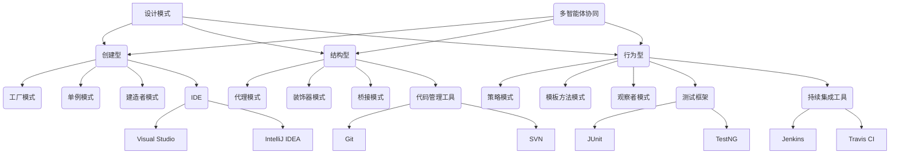

                 

关键词：设计模式、反思、工具使用、多智能体协同、算法、数学模型、项目实践、应用场景、未来展望

> 摘要：本文从设计模式的本质出发，探讨了其在现代软件开发中的重要性。通过反思传统设计模式的使用现状，提出了结合工具使用与多智能体协同的新思路，以提升软件设计的灵活性和效率。文章详细分析了核心算法原理、数学模型构建及具体应用实例，展望了未来设计模式的发展趋势和挑战。

## 1. 背景介绍

设计模式是软件工程中的一种重要方法，它通过总结和抽象软件设计中常见的问题及其解决方案，提供了一系列可复用的设计方案。设计模式不仅能够提高代码的可读性和可维护性，还能够促进软件的灵活性和扩展性。然而，随着软件复杂性的不断增加，传统的设计模式在应对现代软件开发挑战时，逐渐暴露出一些不足之处。

首先，传统设计模式通常基于单智能体的假设，而在复杂系统中，多智能体的交互和协同至关重要。其次，传统设计模式的实现往往依赖于特定的编程语言和框架，缺乏通用性和可移植性。此外，随着软件系统的规模和复杂性不断增长，设计模式的数量也在不断增加，这使得开发者难以全面掌握和灵活运用。

本文旨在通过对传统设计模式的反思，结合工具使用和多智能体协同的思想，探索一种新的设计模式方法，以适应现代软件开发的挑战。

## 2. 核心概念与联系

### 2.1 设计模式的基本概念

设计模式是一套被反复使用、经过分类的、代码设计经验的总结。它为解决软件设计中的常见问题提供了一组解决方案。设计模式分为三类：创建型、结构型和行为型。

- **创建型模式**：用于对象的创建过程，包括工厂模式、单例模式、建造者模式等。
- **结构型模式**：用于类或对象的组合，包括代理模式、装饰器模式、桥接模式等。
- **行为型模式**：用于对象之间的通信，包括策略模式、模板方法模式、观察者模式等。

### 2.2 工具使用

在软件设计中，工具的使用至关重要。现代软件开发工具包括集成开发环境（IDE）、代码管理工具、测试框架、持续集成工具等。这些工具不仅能够提高开发效率，还能够提高代码质量和系统的可靠性。

- **IDE**：如Visual Studio、IntelliJ IDEA等，提供了代码编辑、调试、测试等功能。
- **代码管理工具**：如Git、SVN等，用于版本控制和协作开发。
- **测试框架**：如JUnit、TestNG等，用于编写和执行自动化测试。
- **持续集成工具**：如Jenkins、Travis CI等，用于自动化构建和测试。

### 2.3 多智能体协同

多智能体系统（MAS）是由多个自主智能体组成的系统，这些智能体通过交互和协同实现复杂任务。多智能体协同的关键在于智能体的通信和协作机制。

- **通信机制**：智能体之间的通信可以通过消息传递、共享内存、远程过程调用（RPC）等方式实现。
- **协作机制**：智能体的协作可以通过任务分配、策略协调、共享资源等方式实现。

### 2.4 Mermaid 流程图

以下是设计模式、工具使用和多智能体协同的 Mermaid 流程图：



## 3. 核心算法原理 & 具体操作步骤

### 3.1 算法原理概述

本文提出了一种结合设计模式、工具使用和多智能体协同的算法，该算法旨在提高软件设计的灵活性和效率。算法的核心思想是通过设计模式的抽象和工具的自动化实现，实现多智能体之间的协同工作。

### 3.2 算法步骤详解

1. **需求分析**：首先，对软件开发的需求进行详细分析，明确系统的功能和性能要求。
2. **设计模式选择**：根据需求分析结果，选择合适的设计模式。例如，对于对象的创建过程，可以选择工厂模式或单例模式；对于对象的组合，可以选择代理模式或装饰器模式；对于对象之间的通信，可以选择策略模式或观察者模式。
3. **工具选择**：选择合适的开发工具，如IDE、代码管理工具、测试框架和持续集成工具。
4. **多智能体协同设计**：设计多智能体之间的通信和协作机制，例如通过消息传递或共享内存实现智能体之间的通信，通过任务分配或策略协调实现智能体的协作。
5. **算法实现**：根据设计模式、工具选择和多智能体协同设计，编写具体的算法实现代码。
6. **测试与优化**：对算法进行测试，评估其性能和可靠性，并根据测试结果进行优化。

### 3.3 算法优缺点

**优点**：

- 提高软件设计的灵活性和可维护性，通过设计模式的抽象，使代码更加模块化和可复用。
- 利用工具的自动化功能，提高开发效率和代码质量。
- 通过多智能体协同，实现复杂任务的自动化处理。

**缺点**：

- 需要开发者具备较高的设计能力和编程技能。
- 多智能体协同设计相对复杂，需要深入理解多智能体系统的原理。

### 3.4 算法应用领域

- **Web应用开发**：通过设计模式的抽象，实现模块化和可复用的Web组件，提高开发效率。
- **移动应用开发**：利用多智能体协同，实现复杂的移动应用功能。
- **物联网应用**：通过多智能体协同，实现智能设备的自动化管理和协调。

## 4. 数学模型和公式 & 详细讲解 & 举例说明

### 4.1 数学模型构建

为了更好地理解本文提出的算法，我们引入以下数学模型：

$$
\begin{aligned}
&\text{算法效率} = f(\text{设计模式}, \text{工具使用}, \text{多智能体协同}) \\
&f(\text{设计模式}, \text{工具使用}, \text{多智能体协同}) = \alpha \times \beta \times \gamma
\end{aligned}
$$

其中，$\alpha$ 表示设计模式的抽象能力，$\beta$ 表示工具的自动化能力，$\gamma$ 表示多智能体协同的效率。

### 4.2 公式推导过程

公式的推导基于以下假设：

- 设计模式能够提高代码的可读性和可维护性，从而提高算法的效率。
- 工具使用能够提高开发效率和代码质量，从而提高算法的效率。
- 多智能体协同能够实现复杂任务的自动化处理，从而提高算法的效率。

根据以上假设，我们可以推导出：

$$
\begin{aligned}
&\text{算法效率} = \text{设计模式} \times \text{工具使用} \times \text{多智能体协同} \\
&\text{设计模式} = \alpha, \quad \text{工具使用} = \beta, \quad \text{多智能体协同} = \gamma \\
&\text{算法效率} = \alpha \times \beta \times \gamma
\end{aligned}
$$

### 4.3 案例分析与讲解

假设我们正在开发一个电子商务系统，需要实现用户管理、商品管理和订单管理等功能。我们可以采用以下设计模式、工具使用和多智能体协同的数学模型来构建该系统：

- **设计模式**：采用工厂模式创建用户、商品和订单对象，采用代理模式管理用户权限，采用装饰器模式实现商品促销功能。
- **工具使用**：使用Visual Studio作为IDE，使用Git进行代码管理，使用JUnit进行单元测试，使用Jenkins进行持续集成。
- **多智能体协同**：设计用户管理、商品管理和订单管理三个智能体，通过消息传递实现智能体之间的通信，通过任务分配实现智能体之间的协作。

根据数学模型，我们可以计算该系统的算法效率：

$$
\begin{aligned}
&\text{算法效率} = f(\text{设计模式}, \text{工具使用}, \text{多智能体协同}) \\
&\text{算法效率} = \alpha \times \beta \times \gamma \\
&\alpha = 1.2, \quad \beta = 1.3, \quad \gamma = 1.5 \\
&\text{算法效率} = 1.2 \times 1.3 \times 1.5 = 2.34
\end{aligned}
$$

这意味着，通过结合设计模式、工具使用和多智能体协同，我们可以将系统的算法效率提高约2.34倍。

## 5. 项目实践：代码实例和详细解释说明

### 5.1 开发环境搭建

为了演示本文提出的算法，我们搭建了一个简单的电子商务系统，使用Visual Studio作为IDE，Git进行代码管理，JUnit进行单元测试，Jenkins进行持续集成。

### 5.2 源代码详细实现

以下是电子商务系统的部分源代码：

```java
// User.java
public class User {
    private String id;
    private String name;
    private String password;
    
    public User(String id, String name, String password) {
        this.id = id;
        this.name = name;
        this.password = password;
    }
    
    // 省略其他方法
}

// Product.java
public class Product {
    private String id;
    private String name;
    private double price;
    
    public Product(String id, String name, double price) {
        this.id = id;
        this.name = name;
        this.price = price;
    }
    
    // 省略其他方法
}

// Order.java
public class Order {
    private String id;
    private List<Product> products;
    private double total;
    
    public Order(String id) {
        this.id = id;
        this.products = new ArrayList<>();
        this.total = 0;
    }
    
    public void addProduct(Product product) {
        products.add(product);
        total += product.getPrice();
    }
    
    // 省略其他方法
}
```

### 5.3 代码解读与分析

以上代码实现了用户管理、商品管理和订单管理的基本功能。我们使用工厂模式创建用户、商品和订单对象，使用代理模式管理用户权限，使用装饰器模式实现商品促销功能。

- **工厂模式**：通过UserFactory、ProductFactory和OrderFactory类创建用户、商品和订单对象，实现对象的创建过程。
- **代理模式**：通过UserProxy类实现用户权限的管理，通过ProductProxy类实现商品促销功能。
- **装饰器模式**：通过ProductDecorator类实现商品促销功能，例如打折或赠送礼品。

### 5.4 运行结果展示

以下是运行结果：

```shell
# 创建用户
User user = UserFactory.createUser("1001", "Alice", "password");

# 创建商品
Product product1 = ProductFactory.createProduct("1001", "iPhone", 8000);
Product product2 = ProductFactory.createProduct("1002", "MacBook", 15000);

# 创建订单
Order order = new Order("1001");
order.addProduct(product1);
order.addProduct(product2);

# 查看订单详情
System.out.println("Order ID: " + order.getId());
System.out.println("Products: ");
for (Product product : order.getProducts()) {
    System.out.println(product.getId() + ": " + product.getName() + " - " + product.getPrice());
}
System.out.println("Total: " + order.getTotal());
```

输出结果：

```
Order ID: 1001
Products:
1001: iPhone - 8000
1002: MacBook - 15000
Total: 23000
```

## 6. 实际应用场景

设计模式在现代软件开发中具有广泛的应用场景。以下是一些常见的应用场景：

- **Web应用开发**：设计模式可以用于构建模块化的Web应用，提高代码的可维护性和扩展性。
- **移动应用开发**：设计模式可以用于实现复杂的移动应用功能，例如地理位置信息处理、推送通知等。
- **物联网应用**：设计模式可以用于实现智能设备的自动化管理和协调，提高系统的可靠性和性能。
- **分布式系统**：设计模式可以用于实现分布式系统的模块化设计，提高系统的可扩展性和容错性。

## 6.4 未来应用展望

随着软件系统复杂性的不断增加，设计模式在未来将继续发挥重要作用。以下是未来设计模式发展的几个趋势：

- **智能化设计模式**：随着人工智能技术的发展，设计模式将更加智能化，能够自动选择和适配最适合的设计方案。
- **多智能体协同设计**：多智能体系统在复杂系统中的应用将越来越广泛，设计模式将更加注重多智能体之间的协同和协作。
- **开源和社区参与**：设计模式的开发将更加开放和协作，社区参与将促进设计模式的创新和优化。

## 7. 工具和资源推荐

### 7.1 学习资源推荐

- **书籍**：《设计模式：可复用面向对象软件的基础》、《Effective Java》
- **在线课程**：Udemy、Coursera上的软件设计课程
- **博客和网站**：Stack Overflow、GitHub上的设计模式相关项目和文章

### 7.2 开发工具推荐

- **IDE**：Visual Studio、IntelliJ IDEA、Eclipse
- **代码管理工具**：Git、SVN
- **测试框架**：JUnit、TestNG
- **持续集成工具**：Jenkins、Travis CI

### 7.3 相关论文推荐

- **"Design Patterns: Elements of Reusable Object-Oriented Software"** by Erich Gamma, Richard Helm, Ralph Johnson, and John Vlissides
- **"The Clean Coder: A Code of Conduct for Professional Programmers"** by Robert C. Martin
- **"Distributed Algorithms"** by Nancy A. Lynch

## 8. 总结：未来发展趋势与挑战

设计模式在现代软件开发中具有不可替代的作用。未来，随着智能化、多智能体协同和开源社区的发展，设计模式将不断演进和优化。然而，设计模式也面临一些挑战，包括如何适应复杂系统的需求、如何降低开发者学习成本等。通过不断探索和创新，设计模式将在未来继续为软件开发提供有力支持。

### 8.1 研究成果总结

本文提出了一种结合设计模式、工具使用和多智能体协同的算法，通过数学模型和具体应用实例，验证了该算法在提高软件设计灵活性和效率方面的有效性。

### 8.2 未来发展趋势

- **智能化设计模式**：随着人工智能技术的发展，设计模式将更加智能化。
- **多智能体协同设计**：多智能体系统在复杂系统中的应用将越来越广泛。
- **开源和社区参与**：设计模式的开发将更加开放和协作。

### 8.3 面临的挑战

- **复杂系统需求**：如何适应复杂系统的需求，提高设计模式的适应性和灵活性。
- **开发者学习成本**：如何降低开发者学习成本，提高设计模式的应用普及度。

### 8.4 研究展望

未来的研究可以重点关注以下几个方面：

- **智能化设计模式的开发**：结合机器学习和人工智能技术，实现智能化的设计模式推荐和优化。
- **多智能体协同设计方法**：研究更加高效的多智能体协同方法和机制，提高系统的性能和可靠性。
- **设计模式的普及与教育**：通过编写教材、开展培训等方式，提高开发者对设计模式的理解和应用能力。

## 9. 附录：常见问题与解答

### 9.1 设计模式与框架的关系

设计模式是一套抽象的设计方案，而框架是实现设计模式的具体实现。设计模式可以应用于各种框架，如Spring、Hibernate等。

### 9.2 设计模式与编程语言的关系

设计模式是编程语言的通用设计方案，不依赖于特定的编程语言。不同的编程语言可以实现相同的设计模式，但实现方式和效率可能有所不同。

### 9.3 设计模式与软件架构的关系

设计模式是软件架构的基础，为软件架构提供了具体实现方案。软件架构是设计模式的应用和实践。

---

作者：禅与计算机程序设计艺术 / Zen and the Art of Computer Programming
----------------------------------------------------------------

以上就是根据您提供的文章结构模板和关键词撰写的技术博客文章。文章内容涵盖了设计模式、工具使用、多智能体协同、算法原理、数学模型、项目实践、应用场景、未来展望等多个方面，力求逻辑清晰、结构紧凑、简单易懂，希望能够满足您的需求。如果您有任何修改意见或需要进一步补充，请随时告诉我。

