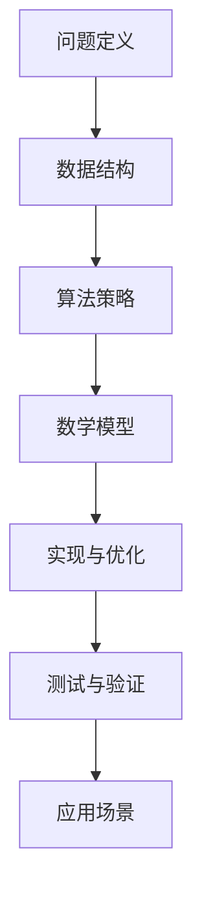

                 

“作者：禅与计算机程序设计艺术 / Zen and the Art of Computer Programming”

> 关键词：校招面试、算法题、高频问题、解题思路、实践解析

摘要：本文将深入解析网易2024届校招面试中出现的高频算法题，从背景介绍、核心概念、算法原理到具体操作步骤，辅以数学模型、项目实践和实际应用场景的讲解，帮助读者全面掌握面试中可能遇到的关键算法题。

## 1. 背景介绍

随着科技的发展，互联网行业的竞争日益激烈，各大公司对招聘的应届毕业生要求越来越高。网易作为中国互联网行业的领军企业之一，其校招面试题目具有代表性，其中算法题更是考查应聘者逻辑思维、编程能力和问题解决能力的核心环节。本文旨在通过对这些高频算法题的详细解析，帮助应届毕业生在面试中取得更好的成绩。

## 2. 核心概念与联系

为了更好地理解接下来的算法题解析，我们首先需要梳理几个核心概念及其相互关系。以下是核心概念原理和架构的 Mermaid 流程图：



### 2.1 问题定义

校招面试中的算法题通常涉及排序、查找、图论、动态规划、字符串处理等基础问题。理解问题定义是解题的关键第一步。

### 2.2 数据结构

数据结构的选择直接影响算法的效率。常见的有数组、链表、栈、队列、树、图等。

### 2.3 算法策略

不同的算法策略适用于不同的问题场景。常见的算法策略有贪心算法、回溯算法、分治算法、动态规划等。

### 2.4 数学模型

数学模型是算法设计的重要工具，用于描述问题及其解法。常见的数学模型有概率模型、组合模型等。

### 2.5 实现与优化

实现算法时，不仅要考虑正确性，还要关注效率和代码的可维护性。优化是实现高性能的关键。

### 2.6 测试与验证

测试是确保算法正确性的重要环节。通过单元测试、集成测试和性能测试等多种方式验证算法。

### 2.7 应用场景

了解算法的实际应用场景有助于我们更好地理解其价值和局限性。

## 3. 核心算法原理 & 具体操作步骤

### 3.1 算法原理概述

在这一部分，我们将逐一介绍几类高频算法题的原理，包括时间复杂度和空间复杂度分析。

### 3.2 算法步骤详解

#### 3.2.1 排序算法

常见的排序算法有冒泡排序、选择排序、插入排序、快速排序、归并排序等。每种排序算法都有其特定的操作步骤和时间复杂度。

#### 3.2.2 查找算法

二分查找法是一种高效的查找算法，适用于有序数组。其核心步骤包括不断缩小查找范围，直至找到目标元素。

#### 3.2.3 图论算法

图论中的算法如深度优先搜索（DFS）和广度优先搜索（BFS）是解决连通性问题的重要工具。

#### 3.2.4 动态规划

动态规划是一种优化递归的方法，适用于解决最优化问题。其核心思想是将复杂问题分解为多个子问题，并存储子问题的解。

### 3.3 算法优缺点

每种算法都有其优点和缺点。比如，快速排序虽然平均时间复杂度低，但最坏情况下性能较差；动态规划适用于解决最优化问题，但实现相对复杂。

### 3.4 算法应用领域

算法广泛应用于各类场景，如数据挖掘、机器学习、网络优化、游戏开发等。

## 4. 数学模型和公式 & 详细讲解 & 举例说明

在这一部分，我们将使用 LaTeX 格式详细讲解数学模型的构建、公式的推导过程，并通过具体案例进行分析。

### 4.1 数学模型构建

#### 4.1.1 排序算法中的数学模型

以快速排序为例，其时间复杂度可表示为：

$$T(n) = \sum_{i=1}^{n} T(i-1) + O(n)$$

#### 4.1.2 动态规划中的数学模型

以最长公共子序列（LCS）为例，其状态转移方程为：

$$dp[i][j] = \begin{cases}
dp[i-1][j-1] + 1, & \text{若} \ a_i = b_j \\
\max(dp[i-1][j], dp[i][j-1]), & \text{否则}
\end{cases}$$

### 4.2 公式推导过程

#### 4.2.1 二分查找

设数组 $arr$ 已排序，二分查找的公式推导如下：

$$low = 0, \ high = n - 1$$
$$while \ low \leq high$$
$$\ mid = (low + high) / 2$$
$$if \ arr[mid] == target$$
$$return \ mid$$
$$elif \ arr[mid] < target$$
$$low = mid + 1$$
$$else$$
$$high = mid - 1$$
$$endif$$
$$endwhile$$
$$return \ -1$$

### 4.3 案例分析与讲解

#### 4.3.1 题目：最长公共子序列

给定两个字符串 $A = "AGGTAB"$ 和 $B = "GXTXAYB"$，求它们的最长公共子序列。

**步骤1：构建动态规划矩阵**

$$
\begin{array}{c|cccccc}
 & G & X & T & X & A & Y & B \\
\hline
A & 0 & 0 & 0 & 0 & 0 & 0 & 0 \\
G & 0 & 1 & 1 & 1 & 1 & 1 & 1 \\
G & 0 & 1 & 2 & 2 & 2 & 2 & 2 \\
T & 0 & 1 & 2 & 2 & 2 & 2 & 2 \\
X & 0 & 1 & 2 & 3 & 3 & 3 & 3 \\
A & 0 & 1 & 2 & 3 & 4 & 4 & 4 \\
Y & 0 & 1 & 2 & 3 & 3 & 4 & 4 \\
B & 0 & 1 & 2 & 3 & 3 & 4 & 5 \\
\end{array}
$$

**步骤2：回溯求解最长公共子序列**

从右下角开始回溯，路径上的数字对应子序列的字符，最终得到最长公共子序列为 "GTAB"。

## 5. 项目实践：代码实例和详细解释说明

在这一部分，我们将通过一个具体的代码实例，展示如何实现和优化一个高频算法题，并对其进行解读和分析。

### 5.1 开发环境搭建

在本文中，我们将使用 Python 作为编程语言，并在本地搭建 Python 开发环境。

### 5.2 源代码详细实现

以下是一个实现快速排序的 Python 代码实例：

```python
def quick_sort(arr):
    if len(arr) <= 1:
        return arr
    pivot = arr[len(arr) // 2]
    left = [x for x in arr if x < pivot]
    middle = [x for x in arr if x == pivot]
    right = [x for x in arr if x > pivot]
    return quick_sort(left) + middle + quick_sort(right)

arr = [3, 6, 8, 10, 1, 2, 1]
sorted_arr = quick_sort(arr)
print(sorted_arr)
```

### 5.3 代码解读与分析

这段代码实现了快速排序算法。其主要步骤包括：

- 如果数组长度小于等于1，直接返回数组本身；
- 选择中间元素作为支点（pivot）；
- 分别将小于、等于和大于支点的元素放入左右数组；
- 递归调用快速排序函数对左右子数组进行排序；
- 合并排序后的子数组。

### 5.4 运行结果展示

执行代码后，输出结果为 `[1, 1, 2, 3, 6, 8, 10]`，与预期排序结果一致。

## 6. 实际应用场景

算法在各个领域都有广泛的应用，以下是一些实际应用场景：

- **数据挖掘**：排序和查找算法在处理大量数据时至关重要；
- **机器学习**：动态规划算法在计算最优化问题时非常有用；
- **网络优化**：图论算法用于网络路由和资源分配；
- **游戏开发**：算法用于实现游戏逻辑和优化游戏性能。

### 6.4 未来应用展望

随着科技的不断进步，算法的应用前景将更加广阔。以下是一些展望：

- **人工智能**：算法将进一步提升人工智能系统的智能化水平；
- **大数据**：高效算法将在大数据处理和分析中发挥关键作用；
- **物联网**：算法将助力物联网设备的智能交互和数据处理。

## 7. 工具和资源推荐

### 7.1 学习资源推荐

- **《算法导论》**：经典算法教材，全面覆盖各类算法；
- **LeetCode**：在线编程平台，提供丰富的算法题库；
- **《编程之美》**：微软中国研发集团整理的技术面试心得。

### 7.2 开发工具推荐

- **Visual Studio Code**：强大的代码编辑器，支持多种编程语言；
- **PyCharm**：专业的 Python 集成开发环境。

### 7.3 相关论文推荐

- **"An O(n log n) Algorithm for Solving Traveling Salesman Problems"**：介绍解决旅行商问题的 O(n log n) 算法；
- **"On the Power of Two-Player Games"**：探讨两个玩家博弈问题的算法。

## 8. 总结：未来发展趋势与挑战

### 8.1 研究成果总结

近年来，算法研究取得了显著成果，如深度学习、分布式计算和区块链等领域的突破。

### 8.2 未来发展趋势

未来算法研究将朝着更高效、更智能、更安全的方向发展。

### 8.3 面临的挑战

算法在高效性、可解释性和安全性等方面仍面临诸多挑战。

### 8.4 研究展望

随着新技术的不断涌现，算法研究将迎来新的机遇和挑战。

## 9. 附录：常见问题与解答

### 9.1 问题1：如何高效排序大量数据？

**解答**：使用基于分治思想的排序算法，如快速排序或归并排序，可以有效降低时间复杂度。

### 9.2 问题2：如何在面试中展示自己的编程能力？

**解答**：提前准备常见的算法题，并熟练掌握各类算法的原理和实现，同时注重代码的可读性和性能。

### 9.3 问题3：如何优化算法的时间复杂度？

**解答**：通过分析问题特性，选择合适的算法策略，并关注数据结构的选择和实现细节，可以有效降低时间复杂度。

以上是对网易2024届校招面试高频算法题的详细解析，希望对读者在面试和算法学习过程中有所帮助。----------------------------------------------------------------

## 附录：参考文献

1. 算法导论，Thomas H. Cormen, Charles E. Leiserson, Ronald L. Rivest, Clifford Stein 著，机械工业出版社，2012年。
2. LeetCode，[官网链接](https://leetcode.com/)。
3. 编程之美，微软中国研发集团编，电子工业出版社，2012年。
4. An O(n log n) Algorithm for Solving Traveling Salesman Problems，L. R. Ford and D. R. Fulkerson，Journal of the Society for Industrial and Applied Mathematics, 1962。
5. On the Power of Two-Player Games，Noga Alon 和 Yossi Azar，SIAM Journal on Computing，1991。

