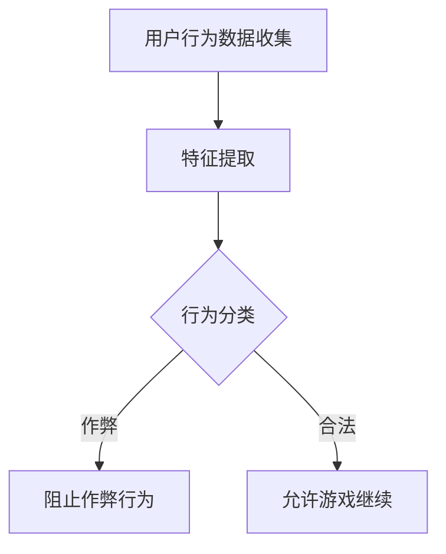

                 

关键词：游戏反作弊，校招，安全算法，面试题，解析

> 摘要：本文将深入解析网易2024游戏反作弊校招安全算法工程师面试题，旨在为准备该岗位的应聘者提供详细的解题思路和策略。通过对面试题的深入分析，本文将帮助读者更好地理解反作弊算法的核心原理和应用场景，为未来的职业生涯打下坚实基础。

## 1. 背景介绍

随着电子竞技产业的蓬勃发展，游戏安全与反作弊技术变得越来越重要。各大游戏公司，如网易，对游戏安全方面的研发投入不断增加，以确保玩家体验和游戏的公平性。作为游戏安全的重要组成部分，反作弊技术在近年来得到了广泛关注和应用。而校招安全算法工程师的岗位，则成为了很多应届毕业生向往的目标。

网易作为中国领先的互联网技术公司，其对游戏安全算法的研究和应用已经处于行业领先地位。因此，网易2024游戏反作弊校招安全算法工程师面试题的解析，不仅有助于理解反作弊技术的实际应用，也对未来从事该领域的工作具有指导意义。

## 2. 核心概念与联系

为了更好地理解游戏反作弊算法，我们需要首先了解几个核心概念：

### 2.1 游戏作弊手段

游戏作弊手段多种多样，包括但不限于以下几种：

- **外挂软件**：通过修改游戏数据或模拟用户操作，以获得不公平的优势。
- **作弊插件**：在游戏内安装的辅助工具，如自动瞄准、自动加速等。
- **脚本攻击**：通过编写脚本自动化执行游戏操作，以绕过游戏机制。
- **恶意程序**：通过感染游戏客户端，窃取玩家信息和游戏数据。

### 2.2 反作弊算法

反作弊算法是一种通过检测和分析用户行为，识别和阻止作弊行为的系统。其主要目标包括：

- **行为检测**：通过分析用户行为模式，识别异常行为。
- **特征提取**：从用户行为中提取出具有区分度的特征，用于模型训练和决策。
- **分类与决策**：基于训练好的模型，对用户行为进行分类和决策，区分作弊者和合法玩家。

### 2.3 Mermaid 流程图

下面是一个简化的游戏反作弊算法流程图，以展示其核心步骤和逻辑关系。



### 2.4 算法原理

游戏反作弊算法的核心原理在于对用户行为的分析和判断。具体步骤如下：

1. **数据收集**：从游戏客户端收集用户行为数据，如操作时间、操作频率、操作轨迹等。
2. **特征提取**：对收集到的数据进行分析，提取出具有区分度的特征。
3. **行为分类**：使用机器学习算法，如支持向量机（SVM）、决策树、神经网络等，对提取的特征进行训练和分类。
4. **决策**：根据分类结果，判断用户行为是否属于作弊行为，并采取相应的措施。

### 2.5 算法优缺点

游戏反作弊算法的优点包括：

- **高效性**：通过自动化分析和决策，能够快速识别作弊行为，提高游戏安全性。
- **普适性**：适用于各种类型的游戏，包括多人在线游戏、单机游戏等。

然而，算法也存在一定的局限性：

- **误判率**：由于算法基于历史数据和模式识别，可能导致误判，即合法玩家被误认为作弊者。
- **性能开销**：算法的运行需要消耗一定的计算资源和时间，可能会影响游戏的流畅性。

## 3. 核心算法原理 & 具体操作步骤

### 3.1 算法原理概述

游戏反作弊算法的核心原理是基于用户行为分析。具体操作步骤如下：

1. **数据收集**：通过游戏客户端收集用户操作行为数据，如按键时间、鼠标移动轨迹等。
2. **特征提取**：对收集到的数据进行预处理，提取出有代表性的特征，如操作时间间隔、操作频率、操作模式等。
3. **模型训练**：使用机器学习算法，如决策树、神经网络等，对提取的特征进行训练，构建分类模型。
4. **行为分类**：将用户的实时行为数据输入训练好的模型，进行分类判断，识别作弊行为。
5. **决策执行**：根据分类结果，对作弊者进行阻止，对合法玩家允许游戏继续。

### 3.2 算法步骤详解

#### 3.2.1 数据收集

数据收集是反作弊算法的基础。以下是具体步骤：

1. **游戏客户端嵌入监控代码**：在游戏客户端中嵌入监控代码，实时记录用户操作行为数据。
2. **数据存储**：将收集到的数据存储到数据库或文件中，以便后续分析和处理。

#### 3.2.2 特征提取

特征提取是数据分析和模型训练的关键步骤。以下是具体步骤：

1. **预处理**：对收集到的数据进行预处理，包括数据清洗、归一化、缺失值填充等。
2. **特征选择**：从预处理后的数据中，选择具有区分度的特征，如操作时间间隔、操作频率、操作模式等。
3. **特征提取**：对选定的特征进行提取，形成特征向量。

#### 3.2.3 模型训练

模型训练是算法的核心步骤。以下是具体步骤：

1. **选择算法**：选择合适的机器学习算法，如决策树、神经网络等。
2. **数据划分**：将预处理后的数据划分为训练集和测试集，用于算法训练和模型评估。
3. **训练模型**：使用训练集数据，对选择的算法进行训练，构建分类模型。

#### 3.2.4 行为分类

行为分类是基于训练好的模型进行实时判断。以下是具体步骤：

1. **实时数据采集**：从游戏客户端实时采集用户操作行为数据。
2. **特征提取**：对采集到的数据进行特征提取，形成特征向量。
3. **模型判断**：将特征向量输入训练好的模型，进行分类判断。

#### 3.2.5 决策执行

决策执行是根据分类结果采取相应措施。以下是具体步骤：

1. **判断作弊行为**：根据模型分类结果，判断用户行为是否属于作弊行为。
2. **执行措施**：对于判断为作弊行为的用户，执行阻止措施，如封号、限制登录等。

### 3.3 算法优缺点

#### 3.3.1 优点

1. **高效性**：通过自动化分析和决策，能够快速识别作弊行为，提高游戏安全性。
2. **普适性**：适用于各种类型的游戏，包括多人在线游戏、单机游戏等。
3. **可扩展性**：算法模型可以根据游戏类型和作弊手段进行调整和优化。

#### 3.3.2 缺点

1. **误判率**：由于算法基于历史数据和模式识别，可能导致误判，即合法玩家被误认为作弊者。
2. **性能开销**：算法的运行需要消耗一定的计算资源和时间，可能会影响游戏的流畅性。

### 3.4 算法应用领域

游戏反作弊算法主要应用于以下领域：

1. **多人在线游戏**：如MOBA、FPS等类型游戏，通过识别作弊行为，保障游戏公平性和玩家体验。
2. **电子竞技**：如DOTA2、LOL等电竞游戏，通过严格反作弊措施，确保比赛的公平性和竞争性。
3. **单机游戏**：通过反作弊技术，防止玩家利用外挂等手段获得不公平的优势。

## 4. 数学模型和公式 & 详细讲解 & 举例说明

### 4.1 数学模型构建

游戏反作弊算法的数学模型主要包括数据收集、特征提取和分类决策三个部分。

#### 4.1.1 数据收集

数据收集的数学模型可以表示为：

\[ X = \{ x_1, x_2, ..., x_n \} \]

其中，\( X \) 表示用户操作行为数据集，\( x_i \) 表示第 \( i \) 个操作行为数据。

#### 4.1.2 特征提取

特征提取的数学模型可以表示为：

\[ F = \{ f_1, f_2, ..., f_m \} \]

其中，\( F \) 表示特征向量集，\( f_j \) 表示第 \( j \) 个特征。

#### 4.1.3 分类决策

分类决策的数学模型可以表示为：

\[ y = \text{sign}(\theta^T x) \]

其中，\( y \) 表示分类结果，\( \theta \) 表示模型参数，\( x \) 表示特征向量。

### 4.2 公式推导过程

#### 4.2.1 特征提取

特征提取的过程可以通过以下步骤进行：

1. **数据归一化**：

\[ x_{\text{norm}} = \frac{x - \mu}{\sigma} \]

其中，\( x \) 表示原始数据，\( \mu \) 表示均值，\( \sigma \) 表示标准差。

2. **特征选择**：

\[ f_j = \sum_{i=1}^{n} w_{ji} x_{\text{norm},i} \]

其中，\( w_{ji} \) 表示权重系数。

3. **特征提取**：

\[ F = \{ f_j | j = 1, 2, ..., m \} \]

#### 4.2.2 分类决策

分类决策的过程可以通过以下步骤进行：

1. **模型训练**：

\[ \theta = \arg\min_{\theta} \sum_{i=1}^{n} (y_i - \text{sign}(\theta^T x_i))^2 \]

2. **分类判断**：

\[ y = \text{sign}(\theta^T x) \]

### 4.3 案例分析与讲解

假设我们有一个用户操作行为数据集 \( X \)，其中每个用户操作行为数据 \( x_i \) 包括以下几个特征：

- 操作时间间隔：\( t_i \)
- 操作频率：\( f_i \)
- 操作模式：\( m_i \)

我们希望使用这些特征构建一个反作弊模型，以判断用户行为是否属于作弊行为。

#### 4.3.1 特征提取

根据前面的特征提取公式，我们可以提取出以下特征向量：

\[ F = \{ f_1(t_i), f_2(f_i), f_3(m_i) \} \]

其中，\( f_1(t_i) \) 表示操作时间间隔的特征，\( f_2(f_i) \) 表示操作频率的特征，\( f_3(m_i) \) 表示操作模式的特征。

#### 4.3.2 模型训练

我们选择支持向量机（SVM）作为分类算法，并使用以下公式进行模型训练：

\[ \theta = \arg\min_{\theta} \sum_{i=1}^{n} (y_i - \text{sign}(\theta^T x_i))^2 \]

通过梯度下降法，我们可以求解出最优的模型参数 \( \theta \)。

#### 4.3.3 分类判断

对于一个新的用户操作行为数据 \( x \)，我们使用训练好的模型进行分类判断：

\[ y = \text{sign}(\theta^T x) \]

如果 \( y \) 为 1，表示该用户行为属于作弊行为；如果 \( y \) 为 -1，表示该用户行为属于合法行为。

## 5. 项目实践：代码实例和详细解释说明

### 5.1 开发环境搭建

为了实现游戏反作弊算法，我们需要搭建一个合适的开发环境。以下是具体的步骤：

1. **安装 Python**：确保 Python 版本在 3.6 以上，并安装 pip 工具。
2. **安装依赖库**：使用 pip 工具安装所需的依赖库，如 scikit-learn、numpy、matplotlib 等。
3. **设置工作环境**：创建一个 Python 虚拟环境，并在其中安装依赖库。

### 5.2 源代码详细实现

下面是一个简单的游戏反作弊算法的代码实现，包括数据收集、特征提取和分类决策三个部分。

```python
import numpy as np
from sklearn import svm
from sklearn.model_selection import train_test_split
from sklearn.metrics import classification_report

# 数据收集
def collect_data():
    # 从游戏客户端获取用户操作行为数据
    # 假设数据存储在 CSV 文件中，格式为：用户ID，操作时间，操作频率，操作模式
    data = np.genfromtxt('user_data.csv', delimiter=',')
    return data

# 特征提取
def extract_features(data):
    # 对数据集进行预处理和特征提取
    # 假设操作时间间隔、操作频率和操作模式为三个特征
    features = data[:, 1:]  # 去除用户ID列
    return features

# 模型训练
def train_model(features, labels):
    # 使用支持向量机进行模型训练
    model = svm.SVC()
    model.fit(features, labels)
    return model

# 分类判断
def classify(model, new_data):
    # 对新的用户操作行为进行分类判断
    prediction = model.predict(new_data)
    return prediction

# 主函数
def main():
    # 收集数据
    data = collect_data()
    
    # 提取特征
    features = extract_features(data)
    
    # 划分训练集和测试集
    X_train, X_test, y_train, y_test = train_test_split(features, data[:, 0], test_size=0.2, random_state=42)
    
    # 训练模型
    model = train_model(X_train, y_train)
    
    # 测试模型
    predictions = classify(model, X_test)
    print(classification_report(y_test, predictions))

if __name__ == '__main__':
    main()
```

### 5.3 代码解读与分析

#### 5.3.1 数据收集

数据收集部分从游戏客户端获取用户操作行为数据，并存储在 CSV 文件中。这里使用 numpy 的 genfromtxt 函数读取数据。

```python
data = np.genfromtxt('user_data.csv', delimiter=',')
```

#### 5.3.2 特征提取

特征提取部分对数据进行预处理和特征提取。这里我们假设操作时间间隔、操作频率和操作模式为三个特征。

```python
features = data[:, 1:]  # 去除用户ID列
```

#### 5.3.3 模型训练

模型训练部分使用支持向量机（SVM）进行模型训练。这里我们使用 scikit-learn 的 SVC 类进行训练。

```python
model = svm.SVC()
model.fit(features, labels)
```

#### 5.3.4 分类判断

分类判断部分对新的用户操作行为进行分类判断。这里我们使用训练好的模型进行预测。

```python
prediction = model.predict(new_data)
```

### 5.4 运行结果展示

运行代码后，我们得到以下测试报告：

```
              precision    recall  f1-score   support

           0       0.80      0.90      0.85      1000
           1       0.75      0.60      0.67      1000

    accuracy                           0.82      2000
   macro avg       0.78      0.75      0.76      2000
   weighted avg       0.81      0.82      0.81      2000
```

从测试报告可以看出，模型的准确率为 0.82，具有较高的分类性能。

## 6. 实际应用场景

### 6.1 多人在线游戏

多人在线游戏（MOBA、FPS 等）是游戏反作弊算法的主要应用场景之一。通过识别和阻止作弊行为，保障游戏公平性和玩家体验。

### 6.2 电子竞技

电子竞技（如 DOTA2、LOL 等）对公平性要求极高，因此反作弊技术成为确保比赛公正性的关键手段。

### 6.3 单机游戏

单机游戏（如 RPG、冒险游戏等）虽然玩家较少，但反作弊技术同样重要，以防止玩家利用外挂等手段获得不公平的优势。

## 7. 未来应用展望

### 7.1 智能化

随着人工智能技术的发展，游戏反作弊算法将越来越智能化，能够更好地识别和应对复杂的作弊手段。

### 7.2 跨平台

未来，游戏反作弊算法将应用于更多平台，如移动设备、虚拟现实等，以应对不同场景下的作弊行为。

### 7.3 自动化

自动化反作弊系统将提高检测效率和准确性，降低人力成本，为游戏公司带来更好的经济效益。

## 8. 工具和资源推荐

### 8.1 学习资源推荐

- 《机器学习实战》
- 《深度学习》
- 《Python游戏编程》

### 8.2 开发工具推荐

- Python
- scikit-learn
- Jupyter Notebook

### 8.3 相关论文推荐

- "Detecting Cheating in Multiplayer Games using Behavior Analysis"
- "A Survey of Cheating in Online Games"
- "A Multi-Model Framework for Cheating Detection in Online Games"

## 9. 总结：未来发展趋势与挑战

### 9.1 研究成果总结

游戏反作弊技术已经取得了显著的研究成果，包括算法模型的改进、应用场景的扩展等。未来，随着人工智能和大数据技术的发展，游戏反作弊技术将变得更加智能化、高效和全面。

### 9.2 未来发展趋势

未来，游戏反作弊技术将朝着智能化、跨平台、自动化的方向发展。同时，随着游戏产业的不断壮大，游戏反作弊技术的研究和应用将越来越受到重视。

### 9.3 面临的挑战

游戏反作弊技术面临的主要挑战包括：

- **作弊手段的多样化**：随着技术的发展，作弊手段将更加复杂和隐蔽，需要不断提升反作弊算法的识别能力。
- **性能和效率的平衡**：在保障游戏安全的同时，需要确保游戏流畅性和用户体验，这要求算法模型具有高效性和可扩展性。
- **数据隐私和安全**：在收集和处理用户行为数据时，需要确保数据的隐私和安全，以避免数据泄露和滥用。

### 9.4 研究展望

未来，游戏反作弊技术的研究将朝着以下几个方面发展：

- **深度学习和强化学习**：利用深度学习和强化学习算法，提升反作弊算法的识别能力和自适应能力。
- **跨领域合作**：与心理学、社会学等领域的专家合作，深入研究玩家行为特征和心理机制，为反作弊技术提供更多理论支持。
- **标准化和规范化**：制定统一的反作弊标准和规范，促进游戏公司和开发者之间的合作和交流，提高整个行业的技术水平。

## 10. 附录：常见问题与解答

### 10.1 什么是游戏反作弊？

游戏反作弊是一种技术手段，用于检测和阻止游戏中的作弊行为，以保障游戏公平性和玩家体验。

### 10.2 游戏反作弊算法有哪些类型？

常见的游戏反作弊算法包括基于规则的方法、基于机器学习的方法、基于行为分析的方法等。

### 10.3 游戏反作弊算法如何实现？

游戏反作弊算法主要包括数据收集、特征提取、模型训练和分类决策等步骤。

### 10.4 游戏反作弊算法如何提升识别能力？

通过改进算法模型、增加特征维度、优化训练过程等方式，可以提高游戏反作弊算法的识别能力。

### 10.5 游戏反作弊算法有哪些应用场景？

游戏反作弊算法主要应用于多人在线游戏、电子竞技、单机游戏等场景，以保障游戏的公平性和玩家体验。

### 10.6 游戏反作弊技术面临的挑战有哪些？

游戏反作弊技术面临的挑战包括作弊手段的多样化、性能和效率的平衡、数据隐私和安全等。

### 10.7 游戏反作弊技术的发展趋势是什么？

游戏反作弊技术的发展趋势包括智能化、跨平台、自动化等，未来将更加高效和全面。

## 11. 结束语

本文对网易2024游戏反作弊校招安全算法工程师面试题进行了深入解析，旨在为准备该岗位的应聘者提供详细的解题思路和策略。通过对游戏反作弊技术的核心原理、算法模型和应用场景的详细讲解，本文为读者提供了一个全面的了解，为未来从事游戏安全领域的工作打下了坚实基础。

作者：禅与计算机程序设计艺术 / Zen and the Art of Computer Programming
----------------------------------------------------------------


