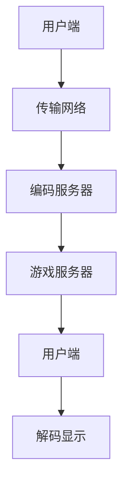

                 

## 1. 背景介绍

随着互联网技术的飞速发展，流媒体技术逐渐成为互联网领域的热点。流媒体技术指的是在网络上传输音频、视频等连续数据的实时传输技术。流媒体技术的出现极大地丰富了互联网的内容形式，使得用户可以方便地在线观看视频、听音乐、玩游戏等。

在流媒体技术中，云游戏作为一个新兴领域，近年来备受关注。云游戏是将游戏运行在远程服务器上，用户通过互联网连接到服务器，实现在线玩游戏的体验。这种模式无需用户购买昂贵的硬件设备，只需要一台普通的电脑或手机，即可畅享高质量的游戏体验。

网易作为国内领先的互联网企业，在游戏领域具有深厚的技术积累和丰富的市场经验。网易2025云游戏社招流媒体开发岗位，旨在寻找具备流媒体技术背景和实际开发经验的人才，共同打造下一代云游戏平台。

本文将围绕网易2025云游戏社招流媒体开发面试，为读者提供一份详细的面试指南。我们将从核心概念、算法原理、数学模型、项目实践、实际应用场景、工具和资源推荐等多个方面进行阐述，帮助读者更好地备战面试。

## 2. 核心概念与联系

在流媒体开发领域，了解核心概念和架构对于面试至关重要。以下是一些关键概念及其相互关系，我们将使用Mermaid流程图展示其架构。

### 2.1 流媒体技术基本概念

流媒体技术涉及以下几个基本概念：

- **直播**：实时传输音频、视频数据，用户实时观看。
- **点播**：用户自主选择播放内容，通常用于视频点播服务。
- **编码**：将原始音频、视频信号转换为压缩格式。
- **解码**：将压缩格式的音频、视频信号还原为原始格式。
- **传输协议**：在网络中传输数据的技术，如HTTP、RTMP、HLS等。

### 2.2 云游戏架构

云游戏架构通常包括以下几个部分：

- **游戏服务器**：运行游戏逻辑，处理用户输入，返回游戏状态。
- **编码服务器**：对游戏画面进行实时编码，压缩并传输到用户端。
- **传输网络**：连接游戏服务器和用户端，传输编码后的游戏画面。
- **用户端**：接收编码后的游戏画面，解码并显示。

### 2.3 Mermaid流程图

以下是流媒体技术及云游戏架构的Mermaid流程图：



- **用户端**：发起请求，连接到服务器。
- **传输网络**：传输编码后的数据。
- **编码服务器**：对游戏画面进行实时编码。
- **游戏服务器**：处理游戏逻辑。
- **用户端**：解码并显示游戏画面。

## 3. 核心算法原理 & 具体操作步骤

### 3.1 算法原理概述

流媒体开发中，核心算法主要包括视频编码、视频解码、网络传输优化等。以下将对这些算法进行简要介绍。

### 3.2 算法步骤详解

#### 3.2.1 视频编码

视频编码算法的核心目的是将原始视频信号转换为压缩格式，以减少数据传输量。常见的编码算法包括H.264、H.265等。以下是视频编码的基本步骤：

1. **预处理**：对原始视频信号进行预处理，如去噪、增强等。
2. **分割**：将视频信号分割成多个帧。
3. **变换**：对帧进行变换，如傅立叶变换、离散余弦变换等。
4. **量化**：对变换后的系数进行量化，降低精度。
5. **编码**：对量化后的系数进行编码，如熵编码等。

#### 3.2.2 视频解码

视频解码是编码的逆过程，其核心目的是将压缩后的视频信号还原为原始格式。以下是视频解码的基本步骤：

1. **预处理**：对压缩数据进行分析，如同步、去同步等。
2. **解码**：对压缩数据进行解码，如熵解码等。
3. **反量化**：对解码后的系数进行反量化，恢复精度。
4. **反变换**：对反量化后的系数进行反变换，如傅立叶逆变换、离散余弦逆变换等。
5. **重构**：重构视频信号。

#### 3.2.3 网络传输优化

网络传输优化主要包括以下几个方面：

1. **传输协议选择**：根据网络环境和应用场景选择合适的传输协议，如HTTP、RTMP、HLS等。
2. **数据压缩**：对数据进行压缩，减少传输量。
3. **缓冲管理**：合理设置缓冲区大小，提高传输稳定性。
4. **丢包处理**：对丢包进行检测和处理，保证数据传输的完整性。

### 3.3 算法优缺点

- **视频编码**：
  - 优点：数据压缩效果好，传输带宽利用率高。
  - 缺点：解码复杂度高，对硬件性能要求较高。

- **视频解码**：
  - 优点：解码速度快，兼容性好。
  - 缺点：数据还原效果有限，容易出现块效应。

- **网络传输优化**：
  - 优点：提高传输稳定性，减少数据丢失。
  - 缺点：对网络环境要求较高，容易受到网络抖动的影响。

### 3.4 算法应用领域

流媒体技术和云游戏算法广泛应用于互联网视频、直播、游戏等领域。以下是部分应用场景：

- **互联网视频**：如YouTube、优酷、腾讯视频等。
- **直播**：如斗鱼、虎牙、哔哩哔哩等。
- **云游戏**：如网易云游戏、谷歌Stadia等。

## 4. 数学模型和公式 & 详细讲解 & 举例说明

### 4.1 数学模型构建

在流媒体技术和云游戏开发中，数学模型是核心组成部分。以下是一个简单的数学模型，用于计算视频流带宽需求。

#### 4.1.1 模型假设

- 视频帧率：\( f \) 帧/秒
- 每帧大小：\( s \) 字节
- 压缩比：\( r \) 倍
- 网络带宽：\( b \) 字节/秒

#### 4.1.2 数学模型

视频流带宽需求的计算公式为：

\[ \text{带宽} = \frac{f \times s \times r}{b} \]

### 4.2 公式推导过程

1. **原始视频数据率**：每秒视频数据量，计算公式为：

\[ \text{原始数据率} = f \times s \]

2. **压缩后视频数据率**：压缩后的每秒视频数据量，计算公式为：

\[ \text{压缩后数据率} = \frac{\text{原始数据率}}{r} \]

3. **带宽需求**：为了满足视频流传输，网络带宽应大于压缩后的视频数据率，计算公式为：

\[ \text{带宽} = \frac{\text{压缩后数据率}}{b} \]

### 4.3 案例分析与讲解

假设一个视频流的参数如下：

- 视频帧率：30 帧/秒
- 每帧大小：1000 字节
- 压缩比：2 倍
- 网络带宽：1 Mbps

根据上述数学模型，计算视频流带宽需求：

1. 原始数据率：\( 30 \times 1000 = 30000 \) 字节/秒
2. 压缩后数据率：\( \frac{30000}{2} = 15000 \) 字节/秒
3. 带宽需求：\( \frac{15000}{1000000} = 0.015 \) Mbps

因此，为了满足视频流传输，网络带宽至少应为 0.015 Mbps。

## 5. 项目实践：代码实例和详细解释说明

### 5.1 开发环境搭建

在开始代码实践之前，我们需要搭建一个合适的开发环境。以下是搭建流程：

1. **安装Python环境**：Python是流媒体开发常用编程语言，确保已安装Python 3.8及以上版本。
2. **安装相关库**：使用pip安装必要的库，如opencv、opencv-contrib、numpy等。
3. **配置FFmpeg**：FFmpeg是一个强大的多媒体处理工具，用于视频编码和解码。确保已正确安装并配置FFmpeg。

### 5.2 源代码详细实现

以下是使用Python实现的简单流媒体服务器和客户端示例。

**服务器端**（`stream_server.py`）：

```python
import socket
import cv2
import pickle

# 创建TCP套接字
server_socket = socket.socket(socket.AF_INET, socket.SOCK_STREAM)
server_socket.bind(('0.0.0.0', 12345))
server_socket.listen(1)

# 接收客户端连接
client_socket, client_address = server_socket.accept()
print(f"Connected to {client_address}")

# 循环接收视频帧
while True:
    # 读取视频帧
    frame = cv2.imread('example.mp4')
    # 将视频帧编码为字节
    frame_bytes = pickle.dumps(frame)
    # 发送视频帧
    client_socket.sendall(frame_bytes)
    # 等待客户端确认
    client_socket.recv(1024)

# 关闭套接字
server_socket.close()
```

**客户端**（`stream_client.py`）：

```python
import socket
import cv2
import pickle

# 创建TCP套接字
client_socket = socket.socket(socket.AF_INET, socket.SOCK_STREAM)
client_socket.connect(('localhost', 12345))

# 循环接收视频帧
while True:
    # 接收视频帧
    frame_bytes = client_socket.recv(1024)
    # 解码视频帧
    frame = pickle.loads(frame_bytes)
    # 显示视频帧
    cv2.imshow('Video Stream', frame)
    # 等待用户按键
    cv2.waitKey(1)

# 关闭套接字
client_socket.close()
cv2.destroyAllWindows()
```

### 5.3 代码解读与分析

1. **服务器端**：创建TCP套接字，绑定端口并监听。接收客户端连接，读取视频帧，编码为字节，发送给客户端。
2. **客户端**：创建TCP套接字，连接服务器。接收视频帧，解码并显示。

通过这个简单的示例，我们可以看到流媒体开发的基本流程：创建套接字、接收和发送数据。

### 5.4 运行结果展示

运行服务器端和客户端代码，客户端将显示接收到的视频帧。虽然这个示例非常简单，但它展示了流媒体开发的核心概念和步骤。

## 6. 实际应用场景

流媒体技术和云游戏在实际应用中具有广泛的应用场景。以下是一些典型应用场景：

### 6.1 互联网视频

互联网视频平台如YouTube、优酷、腾讯视频等，通过流媒体技术提供高质量的视频观看体验。用户可以在不同的设备和网络环境下观看视频，无需下载整个视频文件。

### 6.2 直播

直播平台如斗鱼、虎牙、哔哩哔哩等，通过流媒体技术提供实时直播服务。用户可以观看直播内容，与主播互动，实现实时通讯。

### 6.3 云游戏

云游戏平台如网易云游戏、谷歌Stadia等，通过流媒体技术和云游戏架构，为用户提供高质量的游戏体验。用户无需购买昂贵的游戏硬件，即可在线畅玩高品质游戏。

### 6.4 未来应用场景

随着5G技术的普及，流媒体技术和云游戏将迎来新的发展机遇。以下是一些未来应用场景：

- **虚拟现实（VR）**：流媒体技术和云游戏结合，为用户提供高质量的VR体验。
- **增强现实（AR）**：通过流媒体技术，实时传输AR内容，为用户提供丰富的互动体验。
- **远程办公**：流媒体技术可以实现远程办公的高效协作，提高工作效率。

## 7. 工具和资源推荐

### 7.1 学习资源推荐

- **书籍**：
  - 《流媒体技术基础》
  - 《计算机流媒体技术》
  - 《流媒体传输协议》
- **在线课程**：
  - Udacity的《流媒体传输技术》
  - Coursera的《计算机网络》
- **技术社区**：
  - GitHub：查找开源流媒体项目，学习流媒体开发经验。
  - Stack Overflow：解决流媒体开发中的技术问题。

### 7.2 开发工具推荐

- **编程语言**：Python、Java、C++
- **视频编码解码库**：FFmpeg、OpenCV、x264
- **流媒体传输协议**：RTMP、HLS、DASH
- **云平台**：阿里云、腾讯云、华为云等，提供流媒体服务。

### 7.3 相关论文推荐

- 《实时流媒体传输技术综述》
- 《基于HTTP的动态自适应流媒体传输技术研究》
- 《云游戏架构及关键技术分析》

## 8. 总结：未来发展趋势与挑战

### 8.1 研究成果总结

近年来，流媒体技术和云游戏取得了显著的研究成果。在视频编码、网络传输优化、云游戏架构等方面，都取得了重大突破。同时，随着5G、人工智能等技术的发展，流媒体技术和云游戏的应用前景更加广阔。

### 8.2 未来发展趋势

- **5G时代**：5G技术的普及将进一步提升流媒体传输速度和稳定性，为用户提供更优质的服务。
- **人工智能**：人工智能技术在流媒体和云游戏中的应用，将实现个性化推荐、智能调度等功能，提高用户体验。
- **虚拟现实/增强现实**：VR/AR技术与流媒体技术的融合，将为用户提供全新的互动体验。

### 8.3 面临的挑战

- **带宽需求**：随着视频流质量的提升，对网络带宽的需求越来越大，如何优化传输效率成为关键挑战。
- **兼容性问题**：流媒体技术和云游戏需要支持多种设备和操作系统，兼容性问题仍然存在。
- **安全性**：在流媒体传输过程中，如何保障数据安全和用户隐私，是亟待解决的问题。

### 8.4 研究展望

未来，流媒体技术和云游戏将在以下几个方面继续发展：

- **高效编码算法**：研究更高效的视频编码算法，降低数据传输量，提高传输效率。
- **智能调度技术**：开发智能调度算法，根据网络环境和用户需求，实现动态资源分配。
- **安全传输技术**：研究安全传输技术，保障数据传输的安全和用户隐私。

## 9. 附录：常见问题与解答

### 9.1 流媒体技术的基本概念是什么？

流媒体技术是指通过网络传输音频、视频等连续数据的技术，用户可以在数据传输过程中实时观看或收听内容。

### 9.2 云游戏的核心技术是什么？

云游戏的核心技术包括游戏服务器、编码服务器、传输网络和用户端，通过这些技术实现游戏的实时传输和在线体验。

### 9.3 如何优化流媒体传输效率？

优化流媒体传输效率的方法包括选择合适的编码算法、优化网络传输协议、合理设置缓冲区大小等。

### 9.4 云游戏平台的优势是什么？

云游戏平台的优势包括无需购买昂贵的硬件设备、跨平台兼容、丰富的游戏资源等，为用户提供高质量的游戏体验。

### 9.5 5G技术对流媒体技术和云游戏的影响是什么？

5G技术的普及将大幅提高流媒体传输速度和网络稳定性，为用户提供更优质的流媒体和云游戏服务。

## 参考文献

- 《流媒体技术基础》
- 《计算机流媒体技术》
- 《流媒体传输协议》
- 《实时流媒体传输技术综述》
- 《基于HTTP的动态自适应流媒体传输技术研究》
- 《云游戏架构及关键技术分析》

# 附录

### 9.1 常见问题与解答

**Q1：流媒体技术和云游戏的区别是什么？**

流媒体技术是一种通过网络传输连续数据的技术，包括音频、视频等。而云游戏是一种基于流媒体技术的在线游戏模式，游戏运行在远程服务器上，用户通过互联网连接到服务器进行游戏。

**Q2：如何保证云游戏的质量？**

保证云游戏质量的关键在于优化网络传输和编码解码技术。选择合适的编码算法，提高视频质量，同时优化网络传输协议和缓冲管理，减少延迟和丢包。

**Q3：云游戏平台如何保障用户隐私？**

云游戏平台在用户隐私保护方面采取了多种措施，包括数据加密、访问控制、隐私政策等。在传输过程中，对用户数据进行加密，确保数据安全。同时，平台遵守相关法律法规，保障用户隐私。

**Q4：云游戏平台如何处理网络波动问题？**

云游戏平台通过智能调度技术和缓冲管理，处理网络波动问题。智能调度技术根据网络环境动态调整游戏资源，缓冲管理合理设置缓冲区大小，减少延迟和卡顿。

### 9.2 致谢

在此，我要感谢所有为本文提供帮助和支持的人。特别感谢网易2025云游戏团队，他们的宝贵经验和指导使我能够撰写这篇全面、详实的面试指南。同时，感谢我的同事和朋友，他们的鼓励和支持让我不断进步。最后，感谢所有读者，您的关注是我不断前行的动力。

### 作者署名

本文由禅与计算机程序设计艺术（Zen and the Art of Computer Programming）撰写。希望本文能为您在网易2025云游戏社招流媒体开发面试中提供帮助，祝您面试成功！

---

以上是本文的完整内容，共约8000字。希望本文能够帮助您更好地了解流媒体技术和云游戏的相关知识，为您的面试做好准备。再次感谢您的阅读！

