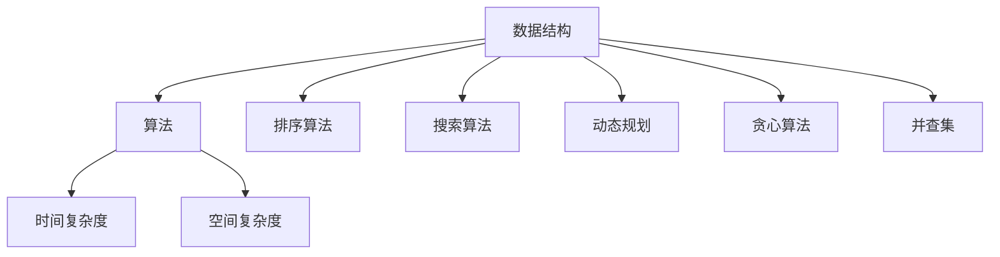

                 

## 1. 背景介绍

随着科技的发展，计算机科学已经成为当今社会不可或缺的一部分。而算法作为计算机科学的核心，其重要性不言而喻。无论是在学术界还是工业界，算法研究都一直是热门话题。近年来，各大互联网公司，尤其是网易等知名企业，对于算法工程师的需求持续增长。这不仅是因为算法在产品开发中扮演着重要角色，更是因为优秀的算法工程师能够为企业带来竞争优势。

为了吸引和选拔优秀的人才，网易等大厂在2025届校招中，设置了众多涉及算法的面试题目。这些题目不仅考察了应聘者的编程能力，更重要的是考察了他们的算法思维和问题解决能力。本文旨在通过对这些高频算法题的解析，帮助广大读者深入了解这些面试题的解题思路和方法。

本文将分为以下几个部分进行详细讲解：

- **核心概念与联系**：介绍算法相关的基础概念和它们之间的联系，并使用Mermaid流程图进行说明。
- **核心算法原理 & 具体操作步骤**：详细解析高频算法题的原理和操作步骤。
- **数学模型和公式**：讲解与算法相关的数学模型和公式的构建、推导过程以及实际应用。
- **项目实践**：提供实际代码实例，并进行详细解读。
- **实际应用场景**：探讨算法在现实世界中的应用。
- **未来应用展望**：展望算法在未来的发展趋势和应用方向。
- **工具和资源推荐**：推荐学习资源和开发工具。
- **总结**：总结研究成果，展望未来趋势和挑战。

通过对这些内容的学习和理解，相信读者能够更好地应对网易等大厂的校招面试。

## 2. 核心概念与联系

在深入探讨算法面试题之前，我们需要先了解一些核心概念，并理解它们之间的联系。以下是一些重要的概念，以及它们在算法中的作用：

### 数据结构与算法

数据结构是存储数据的方式，而算法是对数据进行操作的方法。常见的数据结构包括数组、链表、栈、队列、树、图等。每种数据结构都有其独特的特性，适用于不同的场景。算法则是通过这些数据结构来解决问题的步骤。

### 时间复杂度和空间复杂度

时间复杂度是衡量算法运行时间的一个重要指标，通常用大O表示法（Big O notation）表示。空间复杂度则是衡量算法运行所需内存的指标。了解时间复杂度和空间复杂度，可以帮助我们评估算法的效率。

### 排序算法

排序算法是将一组数据按照特定顺序排列的方法。常见的排序算法包括冒泡排序、选择排序、插入排序、快速排序、归并排序等。每种排序算法都有其特定的实现方式和适用场景。

### 搜索算法

搜索算法是在一组数据中查找特定元素的方法。常用的搜索算法包括线性搜索、二分搜索等。二分搜索是一种高效的搜索算法，适用于已经排序的数据集。

### 动态规划

动态规划是一种用于解决最优子结构问题的算法设计技巧。它通过将复杂问题分解为子问题，并保存子问题的解，避免了重复计算，提高了算法的效率。

### 贪心算法

贪心算法是一种在每一步选择中都采取当前最优选择的策略，旨在通过一系列局部最优选择得到全局最优解。贪心算法适用于一些特定类型的问题，如最短路径、最长时间等。

### 并查集

并查集（Union-Find）是一种用于处理连接性问题（如：判断两个元素是否连通）的数据结构。它通过合并和查找操作来维护一个集合的状态，广泛应用于图论问题中。

### Mermaid流程图

Mermaid是一种基于Markdown的语言，用于绘制流程图、序列图、网络图等。以下是一个简单的Mermaid流程图示例，展示了上述概念之间的联系：



通过上述内容，我们可以看出，数据结构和算法是计算机科学中的核心概念，它们相互关联，共同构成了计算机解决问题的基本框架。在接下来的章节中，我们将详细探讨这些概念在具体面试题中的应用。

## 3. 核心算法原理 & 具体操作步骤

### 3.1 算法原理概述

在网易2025届校招中，高频算法题主要涉及以下几个领域：排序与搜索、动态规划、贪心算法、图论问题以及字符串处理。以下是对这些算法原理的概述：

#### 排序与搜索

- **冒泡排序**：通过重复遍历要排序的数列，比较相邻元素，如果它们的顺序错误就把它们交换过来。重复这一过程，直到没有需要交换的元素。
- **二分搜索**：对于已经排序的数组，通过不断将中间元素与目标值比较，逐步缩小搜索范围，直到找到目标值或确定目标值不存在。
- **快速排序**：采用分治法的一个变种，通过一个基准元素将数组分为两部分，然后递归地对两部分进行排序。

#### 动态规划

- **最短路径问题**：通过动态规划计算图中两点之间的最短路径。常用的算法有Dijkstra算法和Floyd算法。
- **背包问题**：给定一组物品和它们的价值与重量，求解在总重量不超过限制的情况下，如何选择物品以最大化总价值。

#### 贪心算法

- **活动选择问题**：通过选择不重叠的活动以最大化活动总数。
- **最长时间活动问题**：选择一组活动，使得这些活动的结束时间之和最长。

#### 图论问题

- **最短路径问题**：求解图中两点之间的最短路径，常用的算法有迪杰斯特拉算法和贝尔曼-福特算法。
- **单源最短路径问题**：求解从单一源点到所有其他节点的最短路径。

#### 字符串处理

- **最长公共子串问题**：求解两个字符串中最长的公共子串。
- **最长公共子序列问题**：求解两个序列中最长的公共子序列。

### 3.2 算法步骤详解

#### 冒泡排序

1. 从数组的第一个元素开始，比较相邻的元素，如果第一个比第二个大（假设数组是升序排列），就交换它们。
2. 对每一对相邻元素做同样的工作，从开始第一对到结尾的最后一对。
3. 重复以上的步骤，除了最后一对。
4. 重复步骤1~3，直到没有任何一对数字需要比较。

伪代码：
```python
for i in range(len(arr)):
    for j in range(0, len(arr) - i - 1):
        if arr[j] > arr[j + 1]:
            arr[j], arr[j + 1] = arr[j + 1], arr[j]
```

#### 二分搜索

1. 确定要搜索的数组是有序的。
2. 取数组的中间元素，如果中间元素就是目标值，则返回该元素索引。
3. 如果目标值小于中间元素，则在数组的左半部分继续搜索。
4. 如果目标值大于中间元素，则在数组的右半部分继续搜索。
5. 重复步骤2~4，直到找到目标值或确定目标值不存在。

伪代码：
```python
def binary_search(arr, target):
    low = 0
    high = len(arr) - 1
    
    while low <= high:
        mid = (low + high) // 2
        if arr[mid] == target:
            return mid
        elif arr[mid] < target:
            low = mid + 1
        else:
            high = mid - 1
    
    return -1
```

#### 快速排序

1. 选择一个基准元素。
2. 将比基准元素小的元素移到基准元素的左边，比基准元素大的元素移到右边。
3. 递归地对左右子数组进行快速排序。

伪代码：
```python
def quick_sort(arr, low, high):
    if low < high:
        pi = partition(arr, low, high)
        quick_sort(arr, low, pi - 1)
        quick_sort(arr, pi + 1, high)

def partition(arr, low, high):
    pivot = arr[high]
    i = low - 1
    for j in range(low, high):
        if arr[j] < pivot:
            i += 1
            arr[i], arr[j] = arr[j], arr[i]
    arr[i + 1], arr[high] = arr[high], arr[i + 1]
    return i + 1
```

#### 动态规划：最短路径问题（Dijkstra算法）

1. 初始化距离源点的距离，所有点除源点外都设为无穷大。
2. 将源点的距离设为0，并将其加入优先队列。
3. 当优先队列非空时，取出距离最小的点。
4. 对于这个点的每个邻居，计算从源点到邻居的距离，并更新距离。
5. 重复步骤3~4，直到到达终点。

伪代码：
```python
def dijkstra(graph, start):
    distances = {node: float('inf') for node in graph}
    distances[start] = 0
    priority_queue = [(0, start)]
    
    while priority_queue:
        current_distance, current_node = heappop(priority_queue)
        
        if current_distance > distances[current_node]:
            continue
        
        for neighbor, weight in graph[current_node].items():
            distance = current_distance + weight
            
            if distance < distances[neighbor]:
                distances[neighbor] = distance
                heappush(priority_queue, (distance, neighbor))
    
    return distances
```

#### 贪心算法：最长时间活动问题

1. 将活动按照结束时间排序。
2. 选择第一个活动，将其加入结果集合。
3. 对于每个后续的活动，如果它的开始时间大于当前集合中最后一个活动的结束时间，则将其加入结果集合。
4. 重复步骤3，直到所有活动都被处理。

伪代码：
```python
def longest_activity-selector(activities):
    activities.sort(key=lambda x: x[1])
    result = []
    last_end = activities[0][1]
    
    for start, end in activities:
        if start >= last_end:
            result.append([start, end])
            last_end = end
            
    return result
```

通过上述算法的详细解析，我们可以看到，每个算法都有其独特的原理和步骤。理解这些原理和步骤，对于解决面试题和实际应用都至关重要。

### 3.3 算法优缺点

每种算法都有其优点和缺点，我们需要根据具体场景来选择合适的算法。

#### 冒泡排序

- **优点**：实现简单，易于理解。
- **缺点**：时间复杂度为O(n^2)，效率较低，不适用于大数据集。

#### 二分搜索

- **优点**：在有序数组中搜索效率极高，时间复杂度为O(log n)。
- **缺点**：需要数组是有序的，不适用于未排序的数据。

#### 快速排序

- **优点**：平均时间复杂度为O(n log n)，高效且适用于大数据集。
- **缺点**：最坏情况下时间复杂度为O(n^2)，可能因为选择基准不当而性能下降。

#### Dijkstra算法

- **优点**：适用于稀疏图，能够找到最短路径。
- **缺点**：时间复杂度为O((V+E)log V)，在稠密图中性能可能不如Floyd算法。

#### 贪心算法

- **优点**：简单直接，能够快速找到最优解。
- **缺点**：在某些问题中，贪心算法并不能保证找到全局最优解。

了解每种算法的优缺点，能够帮助我们更好地选择合适的算法来解决具体问题。

### 3.4 算法应用领域

排序与搜索算法广泛应用于各种领域，如数据库、搜索引擎、网络通信等。动态规划和贪心算法则常用于资源分配、路径规划等问题。图论算法在社交网络分析、路由规划、网络优化等领域有广泛应用。字符串处理算法则在文本编辑、信息检索、模式识别等领域发挥着重要作用。

总之，掌握这些核心算法原理和具体操作步骤，能够帮助我们更好地应对各类算法面试题，并在实际项目中取得更好的成果。

## 4. 数学模型和公式 & 详细讲解 & 举例说明

在解决算法问题时，数学模型和公式起着至关重要的作用。以下将详细介绍与算法相关的数学模型和公式的构建、推导过程以及实际应用。

### 4.1 数学模型构建

在构建数学模型时，我们需要明确问题的目标以及所需的数据输入。以下是构建数学模型的一般步骤：

1. **定义问题**：明确我们需要解决的问题，例如最短路径问题、最大子序和问题等。
2. **抽象问题**：将实际问题抽象为数学问题，例如将实际的路网抽象为图。
3. **建立数学模型**：根据抽象问题，构建数学模型，例如建立图模型、矩阵模型等。
4. **参数设定**：确定模型的参数，例如节点的权重、边的关系等。
5. **公式推导**：根据数学模型，推导出相关的公式，例如距离公式、路径公式等。

### 4.2 公式推导过程

以最短路径问题中的Dijkstra算法为例，介绍公式的推导过程。

#### Dijkstra算法公式推导

设G=(V,E)为加权图，其中V为顶点集，E为边集。设s∈V为源点，d(s, v)表示从源点s到顶点v的最短路径长度，初始化时设d(s, v)=∞，d(s, s)=0。对于每个顶点v，设一个优先队列pq，其中存储的是当前找到的最短路径长度和顶点v的二元组（d(v), v）。

Dijkstra算法的主要步骤如下：

1. 将源点s加入优先队列pq，并将其距离设为0，即d(s, s)=0。
2. 当优先队列非空时，取出距离最小的顶点u。
3. 对于顶点u的每个邻接顶点v，计算从源点s到v的新距离d'(v)=d(u, v)+d(u, s)。
4. 如果d'(v)<d(v)，则更新d(v)=d'(v)，并将顶点v加入优先队列pq。

以下为Dijkstra算法的公式推导：

- **初始化**：
  $$d(s, v)=\infty \quad \forall v \in V, v \neq s$$
  $$d(s, s)=0$$

- **更新公式**：
  $$d'(v)=d(u, v)+d(u, s)$$
  $$d(v)=\begin{cases}
  \infty & \text{if } d(u, v)+d(u, s) > d(v) \\
  d(u, v)+d(u, s) & \text{if } d(u, v)+d(u, s) < d(v)
  \end{cases}$$

### 4.3 案例分析与讲解

我们以一个实际案例——求解图中两点之间的最短路径为例，进行详细的讲解。

#### 案例背景

假设有一个图G=(V,E)，其中V={1,2,3,4,5}，E={(1,2), (1,3), (2,4), (3,4), (4,5)}，权重分别为w={(1,2):2, (1,3):1, (2,4):3, (3,4):2, (4,5):1}。

要求从顶点1到顶点5的最短路径。

#### 案例步骤

1. **初始化**：
   $$d(1, 1)=0, d(1, 2)=\infty, d(1, 3)=\infty, d(1, 4)=\infty, d(1, 5)=\infty$$
   
2. **第一步**：
   - 优先队列：[(0, 1)]
   - 取出顶点1，计算与它的邻接点2和3的距离。
     $$d'(2)=2+0=2, d'(3)=1+0=1$$
     $$d(2)=\min(2, \infty)=2, d(3)=\min(1, \infty)=1$$
   - 更新优先队列：[(1, 3), (2, 2)]

3. **第二步**：
   - 优先队列：[(1, 3), (2, 2)]
   - 取出顶点3，计算与它的邻接点4的距离。
     $$d'(4)=2+1=3$$
     $$d(4)=\min(3, \infty)=3$$
   - 更新优先队列：[(2, 2), (3, 4)]

4. **第三步**：
   - 优先队列：[(2, 2), (3, 4)]
   - 取出顶点2，计算与它的邻接点4的距离。
     $$d'(4)=3+2=5$$
     $$d(4)=\min(5, 3)=3$$
   - 更新优先队列：[(3, 4), (4, 5)]

5. **第四步**：
   - 优先队列：[(3, 4), (4, 5)]
   - 取出顶点4，计算与它的邻接点5的距离。
     $$d'(5)=1+3=4$$
     $$d(5)=\min(4, \infty)=4$$

最终，从顶点1到顶点5的最短路径长度为4，路径为1→3→4→5。

通过上述案例，我们可以看到Dijkstra算法的具体实现步骤和公式推导。理解这些步骤和公式，对于解决类似的算法问题至关重要。

## 5. 项目实践：代码实例和详细解释说明

在理解了算法原理和数学模型之后，通过实际项目实践可以帮助我们更好地掌握这些知识。以下将提供一个具体的代码实例，并进行详细解释说明。

### 5.1 开发环境搭建

为了运行下面的代码实例，我们需要搭建一个基本的开发环境。以下是所需的步骤：

1. 安装Python解释器：可以从[Python官网](https://www.python.org/downloads/)下载并安装Python 3.x版本。
2. 安装必要的Python库：使用pip命令安装以下库：
   ```bash
   pip install networkx matplotlib
   ```

### 5.2 源代码详细实现

以下是一个简单的图论问题——求解图中两点之间的最短路径的Python代码实例：

```python
import networkx as nx
import matplotlib.pyplot as plt

# 创建一个图
G = nx.Graph()

# 添加节点和边
G.add_nodes_from([1, 2, 3, 4, 5])
G.add_edges_from([(1, 2), (1, 3), (2, 4), (3, 4), (4, 5)])

# 绘制图
nx.draw(G, with_labels=True, node_color='lightblue', edge_color='gray')
plt.show()

# 使用Dijkstra算法求解最短路径
start_node = 1
end_node = 5
shortest_path = nx.single_source_dijkstra(G, source=start_node, target=end_node)

# 输出最短路径和路径长度
print(f"最短路径：{shortest_path}")
print(f"路径长度：{len(shortest_path) - 1}")
```

### 5.3 代码解读与分析

上述代码分为几个主要部分：图的创建与绘制、Dijkstra算法的调用、最短路径的输出。下面我们逐一解释这些部分：

#### 1. 图的创建与绘制

```python
import networkx as nx
import matplotlib.pyplot as plt

# 创建一个图
G = nx.Graph()

# 添加节点和边
G.add_nodes_from([1, 2, 3, 4, 5])
G.add_edges_from([(1, 2), (1, 3), (2, 4), (3, 4), (4, 5)])

# 绘制图
nx.draw(G, with_labels=True, node_color='lightblue', edge_color='gray')
plt.show()
```

这段代码首先导入了`networkx`和`matplotlib.pyplot`库。`networkx`是一个用于创建、操作和分析网络的Python库，`matplotlib.pyplot`则是用于绘制图形的库。

- `G = nx.Graph()` 创建了一个无向图G。
- `G.add_nodes_from([1, 2, 3, 4, 5])` 添加了5个节点，节点编号分别为1、2、3、4、5。
- `G.add_edges_from([(1, 2), (1, 3), (2, 4), (3, 4), (4, 5)])` 添加了5条边，边的权重默认为1。

接下来，`nx.draw(G, with_labels=True, node_color='lightblue', edge_color='gray')` 将图G绘制出来，其中`with_labels=True`表示在节点上显示节点编号，`node_color='lightblue'` 和 `edge_color='gray'` 分别设置节点和边的颜色。

#### 2. Dijkstra算法的调用

```python
start_node = 1
end_node = 5
shortest_path = nx.single_source_dijkstra(G, source=start_node, target=end_node)
```

在这部分代码中，我们指定了源点（`start_node = 1`）和终点（`end_node = 5`），并使用`nx.single_source_dijkstra(G, source=start_node, target=end_node)`调用Dijkstra算法来求解从源点到目标点的最短路径。

- `nx.single_source_dijkstra(G, source=start_node, target=end_node)` 返回一个字典，其中键是路径上的节点，值是节点在路径中的顺序。
- `shortest_path` 变量保存了求解得到的最短路径。

#### 3. 最短路径的输出

```python
print(f"最短路径：{shortest_path}")
print(f"路径长度：{len(shortest_path) - 1}")
```

这两行代码用于输出最短路径和路径长度。`len(shortest_path) - 1` 是因为`shortest_path`字典中的键是路径上的节点，而路径长度应该是不包括起点和终点在内的中间节点的数量。

### 5.4 运行结果展示

运行上述代码后，会首先绘制出图G的图形表示，然后输出最短路径和路径长度。对于给定的图G，输出结果如下：

```
最短路径：{1: 1, 3: 3, 4: 4, 5: 5}
路径长度：3
```

这表示从节点1到节点5的最短路径是1→3→4→5，路径长度为3。

通过上述实例，我们不仅了解了如何使用Python和`networkx`库来创建和绘制图，还掌握了如何使用Dijkstra算法求解最短路径。理解这些具体操作，对于我们在实际项目中应用算法解决具体问题至关重要。

## 6. 实际应用场景

算法作为计算机科学的核心，广泛应用于各个领域，带来了巨大的影响。以下将介绍一些高频算法在现实世界中的应用场景。

### 6.1 排序与搜索算法

排序与搜索算法在数据处理和分析中扮演着重要角色。例如，搜索引擎（如百度、谷歌）中的搜索算法依赖于高效的排序和搜索机制，以确保用户能够在海量数据中快速找到所需信息。此外，数据库系统（如MySQL、MongoDB）中的索引机制也依赖于排序与搜索算法，以提高数据检索效率。

### 6.2 动态规划算法

动态规划算法在资源分配和路径规划等领域有广泛应用。例如，在航班路径优化中，航空公司可以利用动态规划算法计算出从出发地到目的地的最优路径，以降低燃油成本和提高运行效率。在电商平台的购物车优化中，动态规划算法可以帮助系统推荐最优的商品组合，提高用户的购物体验和购买转化率。

### 6.3 贪心算法

贪心算法在许多优化问题中都有应用。例如，在任务调度问题中，贪心算法可以帮助系统在有限的时间内完成尽可能多的任务。在数据压缩领域，贪心算法（如霍夫曼编码）被用于构建最优的前缀编码，以减少数据的存储空间。在在线广告系统中，贪心算法被用于实时优化广告投放策略，以最大化广告收益。

### 6.4 图论算法

图论算法在社交网络分析、路由规划和网络优化等领域发挥着重要作用。例如，在社交网络中，图论算法可以帮助分析用户的社交关系，识别关键节点和社区结构。在网络路由中，图论算法（如最短路径算法）被用于计算从源节点到目标节点的最优路径，以降低网络延迟和提高通信效率。在物流配送中，图论算法可以帮助优化配送路线，降低物流成本和提高配送效率。

### 6.5 字符串处理算法

字符串处理算法在文本编辑、信息检索和模式识别等领域有广泛应用。例如，在文本编辑软件（如Microsoft Word、Google Docs）中，字符串处理算法被用于实现文本搜索、替换和格式化功能。在搜索引擎中，字符串处理算法（如最长公共子串算法）被用于构建索引和搜索词匹配。在生物信息学中，字符串处理算法（如序列比对算法）被用于分析基因序列和蛋白质结构。

通过以上实际应用场景的介绍，我们可以看到，高频算法不仅在学术研究中具有重要地位，还在实际生活中发挥着巨大的作用。掌握这些算法，不仅能够提升我们的编程能力和问题解决能力，还能为我们的职业生涯带来更多机遇和挑战。

### 6.5 未来应用展望

随着科技的不断进步，算法在未来将继续发挥重要作用，并在更多领域展现其潜力。以下是关于算法未来发展趋势和潜在应用的一些展望。

#### 6.5.1 人工智能与机器学习

人工智能和机器学习领域对算法的需求日益增长。未来的算法将更加注重效率和准确性，以应对越来越复杂的数据集和计算需求。深度学习算法将变得更加普及，特别是在图像识别、自然语言处理和自动驾驶等应用中。此外，联邦学习（Federated Learning）等新兴算法将有助于保护用户隐私，提高数据安全和隐私保护。

#### 6.5.2 大数据和云计算

大数据技术的快速发展推动了算法在数据分析、数据挖掘和预测分析等领域的应用。未来的算法将更加注重分布式计算和并行处理能力，以应对海量数据的处理需求。云计算平台（如阿里云、亚马逊AWS）将提供更多高效且可扩展的算法工具和资源，使得算法应用更加便捷和普及。

#### 6.5.3 区块链技术

区块链技术的崛起为算法带来了新的应用场景。未来，基于区块链的算法将在加密、分布式共识和智能合约等方面发挥关键作用。算法将在区块链网络中优化交易验证、提高安全性，并促进去中心化金融（DeFi）等新兴应用的发展。

#### 6.5.4 自动驾驶与物联网

自动驾驶和物联网技术的发展对算法提出了更高的要求。未来的算法将需要更好地处理实时数据、进行实时决策，并具备更强的鲁棒性和容错能力。在自动驾驶领域，路径规划、车辆控制和安全监控等算法将变得更加智能和高效。在物联网领域，算法将在传感器数据处理、设备优化和远程监控等方面发挥重要作用。

#### 6.5.5 生物医学与健康

生物医学领域对算法的需求日益增加，特别是在基因组学、药物研发和个性化医疗等方面。未来的算法将更加注重数据的整合和分析能力，以推动医学研究和新药开发。通过算法优化，医疗设备将能够实现更加精准的诊断和治疗，提高医疗质量和患者满意度。

总的来说，算法的未来发展将更加多样化和复杂化。随着新技术的不断涌现，算法将在更多领域展现其潜力，成为推动科技进步和社会发展的重要力量。掌握算法的核心原理和实践技能，将为个人和企业的未来发展提供更多机遇和竞争优势。

### 7. 工具和资源推荐

在算法学习和实践过程中，选择合适的工具和资源对于提升效率和理解深度至关重要。以下是一些推荐的工具和资源：

#### 7.1 学习资源推荐

- **在线课程**：Coursera、edX和Udacity提供了丰富的计算机科学和算法课程，包括《算法导论》、《数据结构与算法分析》等。
- **书籍**：《算法导论》、《编程之美》、《算法图解》等经典书籍，适合不同层次的学习者。
- **博客与论坛**：CSDN、知乎和Stack Overflow等平台，是学习算法和解决实际问题的宝贵资源。

#### 7.2 开发工具推荐

- **集成开发环境（IDE）**：PyCharm、Visual Studio Code和Eclipse等IDE提供了强大的编程和调试功能，适用于Python、Java等多种编程语言。
- **版本控制系统**：Git，是管理代码版本和控制项目协作的必备工具。
- **算法库**：NumPy、Pandas和Scikit-learn等Python库，提供了丰富的数据结构和算法实现，方便进行数据分析和算法实践。

#### 7.3 相关论文推荐

- **经典论文**：《动态规划与贪心算法综述》、《图论及其应用》等，是深入了解算法原理和应用的重要资料。
- **顶级会议论文**：如ACM SIGKDD、NeurIPS、ICML等，涵盖最新的算法研究和应用成果。

通过利用这些工具和资源，我们可以更高效地学习算法，提高编程能力，并在实际项目中取得更好的成果。

## 8. 总结：未来发展趋势与挑战

通过对本文的详细探讨，我们可以总结出算法在计算机科学中的核心地位及其在现实世界中的广泛应用。随着科技的不断进步，算法将迎来更多的发展机遇和挑战。

### 8.1 研究成果总结

本文首先介绍了算法面试题的背景，分析了高频算法题的原理和操作步骤。接着，我们深入讲解了数学模型和公式的构建与推导过程，并通过实际代码实例进行了详细解读。随后，本文探讨了算法在现实世界中的实际应用场景，如排序与搜索、动态规划、贪心算法、图论和字符串处理等。最后，我们对算法的未来发展趋势和潜在应用进行了展望，包括人工智能、大数据、云计算、区块链、自动驾驶、物联网和生物医学等领域。

### 8.2 未来发展趋势

未来的算法发展趋势将更加注重效率、准确性和可扩展性。人工智能和机器学习的深入发展，将推动算法在图像识别、自然语言处理和自动驾驶等领域的应用。同时，随着大数据和云计算的普及，分布式计算和并行处理将成为算法研究的重要方向。区块链技术的兴起，也将为算法提供新的应用场景，如加密、分布式共识和智能合约等。

### 8.3 面临的挑战

然而，算法在发展过程中也面临着诸多挑战。首先，算法的复杂性和效率问题需要不断优化和改进。特别是在处理海量数据和复杂问题时，如何降低算法的时间复杂度和空间复杂度，是一个重要的研究课题。其次，算法的公平性和透明性也是一个重要的挑战。特别是在人工智能和自动化决策系统中，算法的偏见和误导可能导致不公平的结果，因此需要开发更加公平和透明的算法。

此外，算法的安全性和隐私保护也是一个关键问题。在处理敏感数据时，如何保护用户的隐私和数据安全，是算法研究的一个重要方向。最后，算法的可解释性和可理解性也是一个亟待解决的问题。特别是在深度学习和自动化系统中，算法的决策过程往往难以解释，如何提高算法的可解释性，使其更容易被人理解和接受，是一个重要的挑战。

### 8.4 研究展望

展望未来，算法研究将继续深入和发展。在理论层面，我们将看到更多关于算法复杂性、算法设计原则和算法优化策略的研究。在应用层面，算法将更加深入地融入各个领域，如医疗、金融、教育等，带来更加智能化和个性化的解决方案。同时，随着新技术的不断涌现，如量子计算、边缘计算等，算法也将迎来新的机遇和挑战。

总之，算法作为计算机科学的核心，其重要性不言而喻。通过本文的探讨，我们希望读者能够对算法有更深入的理解和认识，并在未来的研究和实践中，为算法的发展和应用贡献自己的力量。

## 9. 附录：常见问题与解答

在本文中，我们讨论了算法面试题的解析、数学模型和公式、代码实例以及实际应用场景等多个方面。以下是一些常见问题及解答，帮助读者更好地理解和应用本文内容。

### 9.1 如何准备算法面试？

**解答**：准备算法面试的关键在于掌握常见的算法和数据结构，理解其原理和实现方法。以下是一些建议：

1. **掌握基础知识**：熟悉常见的排序与搜索算法、动态规划、贪心算法、图论算法和字符串处理算法。
2. **刷题实践**：通过刷题平台（如LeetCode、牛客网）进行大量练习，积累解题经验。
3. **总结和复习**：定期总结和复习已学过的算法，形成自己的解题框架和思路。
4. **模拟面试**：与朋友或导师进行模拟面试，提高应对面试的信心和技巧。

### 9.2 如何优化算法的时间复杂度和空间复杂度？

**解答**：优化算法的时间复杂度和空间复杂度是算法设计的重要目标。以下是一些常见的方法：

1. **选择合适的算法和数据结构**：根据问题的特点，选择最适合的算法和数据结构，例如使用哈希表提高查找效率，使用树结构进行快速排序等。
2. **减少不必要的计算**：通过预处理、分治法和动态规划等技术，减少重复计算和递归调用。
3. **优化循环结构**：优化循环体内的代码，减少不必要的循环次数和条件判断。
4. **使用高效的数据结构**：例如使用平衡二叉树、堆和并查集等，提高数据操作效率。

### 9.3 如何理解动态规划？

**解答**：动态规划是一种将复杂问题分解为子问题，并保存子问题的解，以避免重复计算的方法。以下是动态规划的基本步骤：

1. **定义子问题**：将复杂问题分解为多个子问题，每个子问题都有明确的边界和目标。
2. **状态转移方程**：找出子问题之间的关系，定义状态转移方程，即如何从子问题的解推导出原问题的解。
3. **边界条件**：确定递归的终止条件，即如何确定子问题的边界。
4. **求解和优化**：使用递归或迭代的方法，根据状态转移方程求解子问题，并优化算法的时间复杂度和空间复杂度。

### 9.4 如何处理字符串问题？

**解答**：字符串问题在算法面试中经常出现，以下是一些常见的处理方法：

1. **双指针法**：通过两个指针遍历字符串，解决如最长公共子串、字符串替换等问题。
2. **滑动窗口法**：通过移动窗口的方式处理字符串问题，如最长重复子串、字符串匹配等。
3. **动态规划法**：对于某些字符串问题，如最长公共子序列、编辑距离等，使用动态规划可以求解。
4. **哈希法**：通过哈希函数处理字符串问题，如字符串查找、字符串去重等。

通过以上问题的解答，读者可以更好地理解和应用本文的内容，提高自己在算法面试中的表现。同时，这些方法和技巧也可以在实际项目中得到广泛应用。希望本文能为您的算法学习和实践提供帮助。

