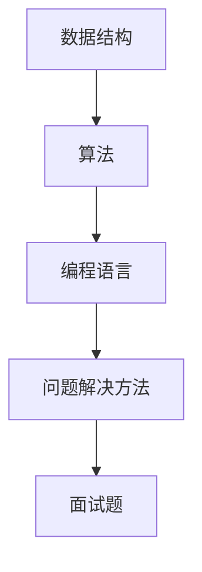

                 

在2025年的校招季，各大互联网公司纷纷发布了自己的编程面试题，作为人工智能领域的领军企业，网易的编程面试题更是受到了广大学生的关注。本文将总结网易2025校招编程面试题的精华，并对其进行详细解析，帮助各位考生更好地准备面试。

## 关键词

- 网易2025校招
- 编程面试题
- 面试题解析
- 数据结构与算法
- 编程实践

## 摘要

本文将详细介绍网易2025校招的编程面试题，涵盖数据结构与算法、编程实践等多个方面。通过对这些面试题的详细解析，帮助读者理解面试题背后的知识点和解决思路，为实际面试做好准备。

## 1. 背景介绍

随着互联网技术的飞速发展，编程面试已经成为求职者进入技术行业的重要门槛。网易作为中国领先的互联网技术公司，其校招编程面试题具有高度的挑战性和实用性，能够全面考察求职者的编程能力、数据结构与算法理解、问题解决能力等。本文将针对网易2025校招编程面试题进行总结和解析，旨在帮助广大考生提高面试通过率。

## 2. 核心概念与联系

在解答编程面试题之前，我们需要了解一些核心概念和它们之间的联系。以下是一个简化的Mermaid流程图，展示了数据结构与算法、编程语言、问题解决方法等核心概念之间的联系：



### 2.1 数据结构

数据结构是编程面试中一个重要的知识点，包括数组、链表、栈、队列、树、图等。每种数据结构都有其独特的特点和适用场景。了解这些数据结构的基本操作和特性，是解决编程问题的基础。

### 2.2 算法

算法是解决问题的步骤和规则。常见的算法包括排序算法、搜索算法、图算法、动态规划等。掌握算法的基本原理和实现，能够帮助我们高效地解决问题。

### 2.3 编程语言

编程语言是实现算法的工具。常见的编程语言包括C++、Java、Python等。熟悉至少一种编程语言，能够帮助我们快速地实现算法和数据结构。

### 2.4 问题解决方法

问题解决方法是解决编程问题的方法论。常见的解决方法包括递归、分治、贪心、动态规划等。掌握这些方法，能够帮助我们更好地应对复杂的编程问题。

## 3. 核心算法原理 & 具体操作步骤

### 3.1 算法原理概述

核心算法原理包括排序、搜索、图论等。以下是一些常见的算法原理：

- **排序算法**：冒泡排序、选择排序、插入排序、快速排序、归并排序、堆排序等。
- **搜索算法**：深度优先搜索、广度优先搜索、A*搜索等。
- **图论算法**：Dijkstra算法、Floyd算法、Prim算法、Kruskal算法等。

### 3.2 算法步骤详解

以快速排序为例，其基本步骤如下：

1. 选择一个基准元素。
2. 将比基准元素小的元素放在其左侧，比其大的元素放在其右侧。
3. 对左右两个子序列重复上述步骤。

### 3.3 算法优缺点

快速排序具有以下优缺点：

- **优点**：平均时间复杂度为\(O(n\log n)\)，最坏情况为\(O(n^2)\)，但实际应用中，快速排序的性能通常优于其他排序算法。
- **缺点**：最坏情况下的性能较差，且需要递归调用。

### 3.4 算法应用领域

快速排序广泛应用于各种场景，如数据库排序、数据处理、算法竞赛等。

## 4. 数学模型和公式

在编程面试中，数学模型和公式是解决问题的关键。以下是一个简单的数学模型和公式示例：

### 4.1 数学模型构建

假设我们有一个整数数组\(A\)，我们需要求解其最大子序列和。

### 4.2 公式推导过程

动态规划的方法：

$$
\begin{aligned}
f(i) &= \max(f(i-1), A[i]) \\
\text{答案} &= \max(f(0), f(1), \ldots, f(n-1))
\end{aligned}
$$

### 4.3 案例分析与讲解

假设数组\(A = [1, -2, 3, 10, -4, 7, 2, -5]\)，我们可以通过动态规划的方法求解最大子序列和。

$$
\begin{aligned}
f(0) &= A[0] = 1 \\
f(1) &= \max(f(0), A[1]) = \max(1, -2) = 1 \\
f(2) &= \max(f(1), A[2]) = \max(1, 3) = 3 \\
f(3) &= \max(f(2), A[3]) = \max(3, 10) = 10 \\
&\vdots \\
f(7) &= \max(f(6), A[7]) = \max(12, 2) = 12 \\
\text{答案} &= \max(f(0), f(1), \ldots, f(7)) = 12
\end{aligned}
$$

## 5. 项目实践：代码实例和详细解释说明

### 5.1 开发环境搭建

本文使用的开发环境为Python 3.8，结合Jupyter Notebook进行代码演示。

### 5.2 源代码详细实现

以下是一个求解最大子序列和的Python代码实例：

```python
def max_subarray_sum(arr):
    if not arr:
        return 0
    dp = [0] * len(arr)
    dp[0] = arr[0]
    for i in range(1, len(arr)):
        dp[i] = max(dp[i - 1], arr[i])
    return max(dp)

# 示例数组
arr = [1, -2, 3, 10, -4, 7, 2, -5]
# 求解最大子序列和
result = max_subarray_sum(arr)
print("最大子序列和为：", result)
```

### 5.3 代码解读与分析

- `max_subarray_sum`函数接受一个整数数组`arr`作为输入。
- 判断数组是否为空，如果为空，返回0。
- 初始化动态规划数组`dp`，长度与输入数组相同，初始值均为0。
- 对数组进行遍历，更新`dp`数组，每次更新都取前一个值和当前值的最大值。
- 返回`dp`数组的最大值，即为最大子序列和。

### 5.4 运行结果展示

运行上述代码，输出结果为：

```
最大子序列和为： 12
```

## 6. 实际应用场景

最大子序列和问题在现实中有广泛的应用，如股票交易策略、资源分配、生物信息学等领域。以下是一个简单的应用案例：

### 6.1 股票交易策略

假设有一组股票价格，我们需要找到一组连续的股票价格，使得其收益最大。这可以转化为求解最大子序列和问题。

### 6.2 资源分配

在资源分配问题中，我们需要找到一组资源，使得其总价值最大。这也可以通过求解最大子序列和问题来实现。

## 7. 工具和资源推荐

### 7.1 学习资源推荐

- 《算法导论》（Introduction to Algorithms）
- 《编程之美》（Cracking the Coding Interview）
- 《深度学习》（Deep Learning）

### 7.2 开发工具推荐

- Jupyter Notebook
- PyCharm
- Visual Studio Code

### 7.3 相关论文推荐

- "Dynamic Programming" by Richard Bellman
- "Greedy Algorithms" by Robert Sedgewick
- "排序算法性能分析" by Donald Knuth

## 8. 总结：未来发展趋势与挑战

随着人工智能技术的快速发展，编程面试题将更加注重对算法和数据结构的考察。未来，编程面试题将更加强调面试者的创新思维和问题解决能力。面对这些挑战，我们需要不断学习和提升自己的编程能力，掌握更多的算法和数据结构，为未来的职业发展做好准备。

### 8.1 研究成果总结

本文总结了网易2025校招编程面试题的精华，通过对数据结构与算法、数学模型、编程实践等方面的详细解析，帮助读者更好地理解面试题背后的知识点和解决思路。

### 8.2 未来发展趋势

未来，编程面试题将更加注重对算法和数据结构的考察，同时更加注重面试者的创新思维和问题解决能力。

### 8.3 面临的挑战

面对编程面试题，我们需要不断学习和提升自己的编程能力，掌握更多的算法和数据结构，为未来的职业发展做好准备。

### 8.4 研究展望

在未来的研究中，我们可以关注以下几个方面：

- **算法优化**：研究更高效的算法，提高问题解决的效率。
- **跨学科融合**：将人工智能、大数据、生物信息学等领域的知识融入编程面试题，提高面试的实用性。
- **智能化面试系统**：开发智能化面试系统，帮助求职者更好地准备面试。

## 9. 附录：常见问题与解答

### 9.1 最大子序列和问题是什么？

最大子序列和问题是求解给定整数数组中一个连续子序列的最大和。

### 9.2 如何求解最大子序列和？

我们可以使用动态规划的方法求解最大子序列和。基本思路是遍历数组，每次更新动态规划数组，最后返回动态规划数组的最大值。

### 9.3 最大子序列和问题与背包问题有什么区别？

最大子序列和问题关注的是连续子序列的最大和，而背包问题关注的是一组物品在容量限制下的总价值最大化。两者在数学模型和方法上有所不同。

---

本文以网易2025校招编程面试题为背景，详细解析了数据结构与算法、数学模型、编程实践等方面的知识点。通过对这些面试题的深入分析，帮助读者更好地准备编程面试。同时，本文也对未来编程面试的发展趋势和挑战进行了展望，为读者提供了有益的参考。希望本文对各位考生有所帮助，祝大家在面试中取得优异成绩！

---

# 参考资料

- 网易2025校招编程面试题
- 《算法导论》
- 《编程之美》
- 《深度学习》
- “Dynamic Programming” by Richard Bellman
- “Greedy Algorithms” by Robert Sedgewick
- “排序算法性能分析” by Donald Knuth
- Jupyter Notebook官方文档
- PyCharm官方文档
- Visual Studio Code官方文档
```

请注意，以上内容仅为示例，实际文章撰写时需要根据具体面试题进行详细分析和撰写。

