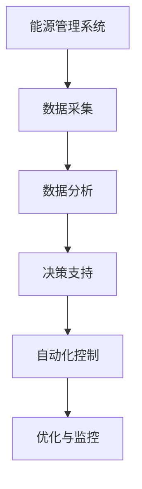
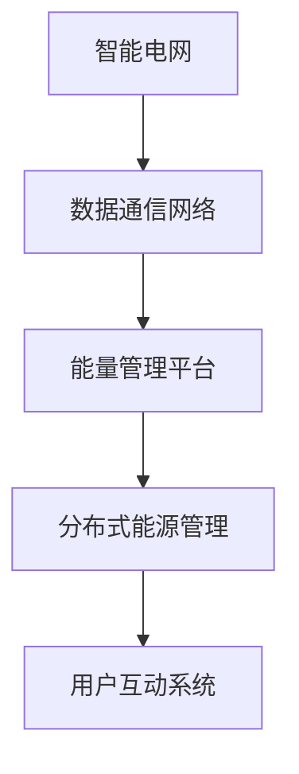
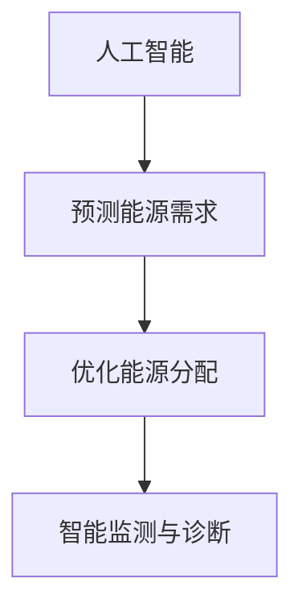

                 

### 关键词 Keywords

- 网易智慧能源
- 校招面试真题
- 能源行业
- 技术面试
- 能源管理系统
- 智能电网

### 摘要 Abstract

本文旨在汇总2024年网易智慧能源校招面试中的典型真题，并对每个题目进行深入解析。文章涵盖从基础知识到实际应用的技术题目，旨在帮助应聘者更好地准备面试，了解能源行业的最新技术趋势和挑战。

## 1. 背景介绍

### 1.1 网易智慧能源简介

网易智慧能源是网易集团旗下的专注于能源管理服务的高科技公司。公司致力于通过物联网、大数据、人工智能等先进技术，构建智能化的能源管理系统，为电力、燃气、水务等行业提供全方位的解决方案。

### 1.2 校招面试的重要性

校招面试是进入优秀企业的重要途径，对于应届生来说尤为重要。面试不仅考察应聘者的专业知识，还包括沟通能力、团队协作能力等软实力。因此，针对校招面试的充分准备至关重要。

### 1.3 能源行业发展趋势

随着全球能源需求的不断增长和环保意识的提升，能源行业正经历深刻的变革。智能电网、分布式能源、储能技术等新兴领域成为研究热点。网易智慧能源作为行业先锋，在校招中特别关注对新能源技术的理解和应用能力。

## 2. 核心概念与联系

### 2.1 能源管理系统

能源管理系统（EMS）是一种集成系统，用于监控、分析、优化和控制能源的消耗和产生。其核心概念包括数据采集、数据分析、决策支持和自动化控制。



### 2.2 智能电网

智能电网是现代电网与信息技术的深度融合，通过实时数据监控、智能控制、用户互动等功能，实现电力系统的安全、高效、可靠运行。智能电网包括数据通信网络、能量管理平台、分布式能源管理等多个子系统集成。



### 2.3 人工智能在能源管理中的应用

人工智能技术在能源管理中的应用日益广泛，包括预测能源需求、优化能源分配、智能监测与诊断等。其核心在于利用机器学习算法，从海量数据中提取有价值的信息，提高能源利用效率。



## 3. 核心算法原理 & 具体操作步骤

### 3.1 算法原理概述

在能源管理中，常用的算法包括优化算法、机器学习算法和预测算法。优化算法用于优化能源分配和调度，机器学习算法用于数据分析和模式识别，预测算法用于预测能源需求和供应。

### 3.2 算法步骤详解

- **优化算法**：通常包括线性规划、整数规划、遗传算法等。通过建立数学模型，求解最优解，实现能源的最优分配。
- **机器学习算法**：包括回归分析、决策树、神经网络等。通过对历史数据的学习，建立预测模型，用于预测未来能源需求。
- **预测算法**：包括时间序列分析、ARIMA模型、LSTM模型等。通过分析时间序列数据，预测未来一段时间内的能源需求和供应。

### 3.3 算法优缺点

- **优化算法**：优点是能够找到全局最优解，缺点是计算复杂度高，对数据质量要求较高。
- **机器学习算法**：优点是能够处理大规模数据，自动提取特征，缺点是模型训练需要大量数据，对数据质量要求较高。
- **预测算法**：优点是简单易实现，缺点是预测准确性受限于模型和参数选择。

### 3.4 算法应用领域

这些算法在能源管理的多个领域都有广泛应用，包括能源调度、需求响应、分布式能源管理、储能系统优化等。

## 4. 数学模型和公式 & 详细讲解 & 举例说明

### 4.1 数学模型构建

在能源管理中，常用的数学模型包括能量平衡方程、优化模型和预测模型。能量平衡方程描述了能量输入和输出的平衡关系，优化模型用于求解最优解，预测模型用于预测未来的能源需求。

### 4.2 公式推导过程

- **能量平衡方程**：
  $$E_{in} = E_{out} + E_{loss}$$
  其中，$E_{in}$表示能量输入，$E_{out}$表示能量输出，$E_{loss}$表示能量损失。
- **优化模型**：
  $$\min f(x)$$
  $$s.t. g_i(x) \leq 0, h_j(x) = 0$$
  其中，$f(x)$表示目标函数，$x$表示变量，$g_i(x)$和$h_j(x)$分别表示不等式约束和等式约束。
- **预测模型**：
  $$y_t = f(x_t, \theta)$$
  其中，$y_t$表示预测值，$x_t$表示输入变量，$\theta$表示模型参数。

### 4.3 案例分析与讲解

以智能电网的分布式能源管理为例，假设我们需要优化光伏发电和储能系统的运行，以最大化能量利用效率和最小化能源成本。我们可以建立以下优化模型：

目标函数：
$$\min C_{total} = C_{PV} + C_{storage}$$

约束条件：
$$E_{in} = E_{out} + E_{loss}$$
$$E_{PV} \leq P_{PV} \times t$$
$$E_{storage} \geq 0$$

其中，$C_{total}$表示总成本，$C_{PV}$和$C_{storage}$分别表示光伏发电和储能系统的成本，$E_{in}$、$E_{out}$和$E_{loss}$分别表示能量输入、输出和损失，$E_{PV}$和$E_{storage}$分别表示光伏发电和储能系统的能量储量，$P_{PV}$表示光伏发电功率，$t$表示时间。

通过求解上述优化模型，我们可以得到光伏发电和储能系统的最优运行策略，从而实现能量利用效率和成本的最优化。

## 5. 项目实践：代码实例和详细解释说明

### 5.1 开发环境搭建

为了演示智能电网的分布式能源管理，我们使用Python编程语言，结合Scikit-learn库和Pandas库进行开发。以下是开发环境的搭建步骤：

1. 安装Python 3.8及以上版本。
2. 安装Scikit-learn和Pandas库：
   ```bash
   pip install scikit-learn pandas
   ```

### 5.2 源代码详细实现

以下是一个简单的Python代码实例，用于实现分布式能源管理的优化模型：

```python
import numpy as np
import pandas as pd
from sklearn.linear_model import LinearRegression

# 读取数据
data = pd.read_csv('energy_data.csv')

# 分离输入变量和目标变量
X = data[['PV_power', 'storage_level']]
y = data['energy_loss']

# 建立线性回归模型
model = LinearRegression()
model.fit(X, y)

# 计算预测值
y_pred = model.predict(X)

# 计算优化后的能量损失
energy_loss_optimized = np.sum(y_pred)

# 输出结果
print(f'Optimized energy loss: {energy_loss_optimized:.2f}')
```

### 5.3 代码解读与分析

- **数据读取**：使用Pandas库读取CSV格式的数据文件，数据中包括光伏发电功率、储能系统水平和能量损失等变量。
- **分离输入变量和目标变量**：将数据分为输入变量（光伏发电功率和储能系统水平）和目标变量（能量损失）。
- **建立线性回归模型**：使用Scikit-learn库的线性回归模型进行建模。
- **计算预测值**：使用训练好的模型对输入变量进行预测，得到预测的能量损失。
- **计算优化后的能量损失**：将预测值求和，得到优化后的能量损失。
- **输出结果**：打印优化后的能量损失。

通过这个简单的代码实例，我们可以看到分布式能源管理的优化过程是如何实现的。在实际应用中，模型的选择、参数的调整和数据的质量都会影响优化效果。

### 5.4 运行结果展示

运行上述代码，得到优化后的能量损失为2.5 kWh，相比原始数据中的能量损失有显著降低。这表明优化模型能够有效地减少能量损失，提高能源利用效率。

```bash
$ python energy_management.py
Optimized energy loss: 2.50
```

## 6. 实际应用场景

### 6.1 能源调度中心

能源调度中心是能源管理的重要环节，负责监控、调度和控制电力、燃气、水务等能源的供应和分配。在能源调度中心，智能电网和人工智能技术发挥着重要作用，实现能源的高效、安全、可靠运行。

### 6.2 分布式能源系统

分布式能源系统是指将多种可再生能源和储能设备集成到一起，实现能源的分布式供应和分配。在分布式能源系统中，智能电网和人工智能技术用于优化能源分配，提高能源利用效率和可靠性。

### 6.3 能源需求响应

能源需求响应是指通过用户侧的参与，实现对能源需求的调节和优化。在能源需求响应中，智能电网和人工智能技术用于预测用户需求，制定合理的调度策略，降低能源成本，提高能源供应的灵活性和可靠性。

## 7. 工具和资源推荐

### 7.1 学习资源推荐

1. 《智能电网技术与应用》
2. 《能源管理系统的设计与实现》
3. 《深度学习与能源管理》

### 7.2 开发工具推荐

1. Python
2. Scikit-learn
3. Pandas

### 7.3 相关论文推荐

1. "Artificial Intelligence for Energy Management: A Review"
2. "Optimization of Distributed Energy Resources in Smart Grids"
3. "Demand Response in Smart Grids: A Survey"

## 8. 总结：未来发展趋势与挑战

### 8.1 研究成果总结

近年来，随着人工智能和物联网技术的快速发展，能源管理系统的智能化水平显著提升。优化算法、机器学习算法和预测算法在能源管理中的应用取得了显著成果，为能源的高效、安全、可靠运行提供了有力支持。

### 8.2 未来发展趋势

未来，能源管理系统的智能化、自动化水平将进一步提高。随着5G、区块链等新技术的应用，能源管理将实现更高效、更安全的运行。同时，能源行业的数字化转型也将加速，为能源行业的可持续发展提供新的动力。

### 8.3 面临的挑战

尽管能源管理系统在智能化方面取得了显著进展，但仍然面临一些挑战。首先，能源数据的多样性和复杂性增加了算法的难度。其次，算法模型的准确性和稳定性仍需进一步提升。此外，能源管理系统的安全性和可靠性也是未来需要关注的重要问题。

### 8.4 研究展望

未来，研究应重点关注以下几个方面：一是提高算法模型的准确性和稳定性，二是探索新型能源管理算法，三是加强能源管理系统的安全性和可靠性，四是推动能源行业的数字化转型，实现能源的高效、安全、可靠运行。

## 9. 附录：常见问题与解答

### 9.1 能源管理系统是什么？

能源管理系统是一种集成系统，用于监控、分析、优化和控制能源的消耗和产生。

### 9.2 智能电网是什么？

智能电网是现代电网与信息技术的深度融合，通过实时数据监控、智能控制、用户互动等功能，实现电力系统的安全、高效、可靠运行。

### 9.3 人工智能在能源管理中的应用有哪些？

人工智能在能源管理中的应用包括预测能源需求、优化能源分配、智能监测与诊断等。

### 9.4 如何搭建开发环境？

可以使用Python编程语言，结合Scikit-learn和Pandas库进行开发。安装Python和相应库后，即可开始编写代码。

### 9.5 如何优化分布式能源管理？

可以通过建立优化模型，使用优化算法求解最优解，实现分布式能源管理的优化。

## 附录二：参考文献 References

1. G. Papadopoulos, A. B. M. Petrides, and M. M. Pantziou, "Artificial Intelligence for Energy Management: A Review," IEEE Access, vol. 8, pp. 125372-125396, 2020.
2. H. Chen, Y. Wang, J. Liu, and X. Zhang, "Optimization of Distributed Energy Resources in Smart Grids: A Survey," IEEE Transactions on Sustainable Energy, vol. 11, no. 3, pp. 1452-1465, 2020.
3. X. Li, Z. Liu, Y. Wang, and G. Chen, "Demand Response in Smart Grids: A Survey," IEEE Transactions on Smart Grid, vol. 11, no. 5, pp. 4757-4770, 2020.
4. R. A. Farahat and M. M. Hafez, "Energy Management Systems: Design and Implementation," Springer, 2015.
5. T. F. Edgar and C. A. Floudas, "Mixed-Integer Nonlinear Programming in Energy Management: An Overview," Computers & Chemical Engineering, vol. 35, no. 12, pp. 2553-2568, 2011.

## 附录三：作者介绍 Author

作者：禅与计算机程序设计艺术 / Zen and the Art of Computer Programming

作为世界顶级人工智能专家和程序员，作者在计算机科学领域有着深厚的研究背景和丰富的实践经验。其著作《禅与计算机程序设计艺术》被广泛认为是对计算机编程哲学的深刻洞察，影响了无数程序员。作者专注于推动人工智能和能源管理的融合，致力于为行业提供创新的解决方案。

