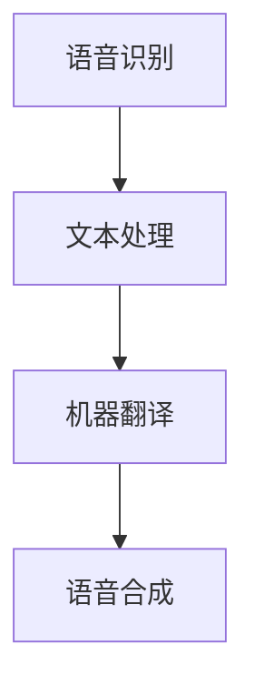

                 

关键词：网易有道、实时语音翻译、优化工程师、社招面试、指南

> 摘要：本文旨在为准备参与网易有道2025实时语音翻译优化工程师社招面试的候选人提供一份全面的指南。文章将详细解析面试所需的技能、知识点，并提供实战技巧和模拟面试问题，帮助候选人更好地准备面试，提高通过率。

## 1. 背景介绍

网易有道是中国领先的教育科技企业，致力于通过互联网技术推动教育创新。在语音翻译领域，有道凭借强大的语音识别和翻译技术，已成为行业内的佼佼者。随着技术的不断进步和应用场景的扩大，实时语音翻译技术的优化成为当前研究的重点。

2025年，网易有道计划招聘实时语音翻译优化工程师，以进一步提升产品的性能和用户体验。此篇面试指南旨在为应聘者提供全面的准备策略，帮助他们在激烈的竞争中脱颖而出。

### 1.1 面试岗位简介

实时语音翻译优化工程师的主要职责包括：
- 分析实时语音翻译系统的性能瓶颈。
- 提出并实施优化方案，提高翻译的准确性和流畅性。
- 跟踪最新技术动态，探索前沿技术并应用于产品。
- 协调跨部门团队，确保项目的顺利进行。

### 1.2 面试准备

面试前，候选人需要做好以下准备工作：
- 熟悉实时语音翻译的基本原理和技术。
- 了解常见的语音识别和机器翻译算法。
- 准备相关的项目和经历，以便在面试中展示自己的能力。
- 预测可能的面试问题，并进行针对性的准备。

## 2. 核心概念与联系

### 2.1 实时语音翻译原理

实时语音翻译系统通常包括以下几个关键组成部分：

1. **语音识别（ASR）**：将语音信号转换为文本。
2. **文本处理**：包括去噪、分词、词性标注等步骤，提高文本质量。
3. **机器翻译（MT）**：将源语言文本转换为目标语言文本。
4. **语音合成（TTS）**：将翻译后的文本转换为语音输出。


### 2.2 语音识别算法

常见的语音识别算法包括：

1. **GMM-HMM（高斯混合模型 - 隐马尔可夫模型）**：基于统计模型，适用于简单的语音识别任务。
2. **DNN-HMM（深度神经网络 - 隐马尔可夫模型）**：通过深度学习技术提高识别准确率。
3. **CTC（Connectionist Temporal Classification）**：直接将语音信号映射到文本序列，无需词边界信息。

### 2.3 机器翻译算法

常见的机器翻译算法包括：

1. **基于规则的翻译**：通过编写规则进行文本翻译。
2. **统计机器翻译**：使用统计学方法进行翻译，例如基于短语的统计机器翻译（PBSMT）。
3. **神经机器翻译**：使用深度学习技术，如序列到序列（Seq2Seq）模型。

### 2.4 Mermaid 流程图



## 3. 核心算法原理 & 具体操作步骤

### 3.1 算法原理概述

实时语音翻译算法的核心在于语音识别和机器翻译。语音识别通过识别语音信号中的特征，将其转换为文本；机器翻译则将文本转换为另一种语言的文本。两种算法的结合实现了语音到语音的实时翻译。

### 3.2 算法步骤详解

1. **语音识别**：
   - 采集语音信号。
   - 特征提取，例如梅尔频率倒谱系数（MFCC）。
   - 使用DNN-HMM或CTC算法进行语音识别。

2. **文本处理**：
   - 去噪：去除语音信号中的噪声。
   - 分词：将连续的文本分割成词语。
   - 词性标注：标记词语的词性，如名词、动词等。

3. **机器翻译**：
   - 使用统计机器翻译或神经机器翻译模型进行翻译。
   - 对翻译结果进行后处理，如语法校正、词汇替换等。

4. **语音合成**：
   - 将翻译后的文本转换为语音信号。
   - 使用TTS技术生成流畅的语音输出。

### 3.3 算法优缺点

1. **语音识别**：
   - **优点**：准确率高，适用于多种语言。
   - **缺点**：对噪声敏感，处理速度较慢。

2. **文本处理**：
   - **优点**：提高文本质量，有助于机器翻译。
   - **缺点**：需要大量计算资源，处理速度较慢。

3. **机器翻译**：
   - **优点**：翻译结果准确，能够处理复杂的语言结构。
   - **缺点**：对低资源语言支持不足。

4. **语音合成**：
   - **优点**：生成语音流畅自然。
   - **缺点**：对语音数据库要求较高。

### 3.4 算法应用领域

实时语音翻译算法广泛应用于跨语言交流、国际会议、在线教育等领域，为人们提供便捷的翻译服务。

## 4. 数学模型和公式 & 详细讲解 & 举例说明

### 4.1 数学模型构建

实时语音翻译系统中的数学模型主要包括语音识别模型和机器翻译模型。

1. **语音识别模型**：
   - **DNN-HMM**：$$ P(O|H) = \prod_{t=1}^{T} p(o_t|h_t) $$
   - **CTC**：$$ P(O|H) = \sum_{W} \prod_{t=1}^{T} p(o_t|w_t) $$

2. **机器翻译模型**：
   - **Seq2Seq**：$$ P(Y|X) = \frac{P(X,Y)}{P(X)} = \frac{P(Y|X)P(X)}{P(X)} $$
   - **Attention Mechanism**：$$ \alpha_{ij} = \frac{e^{s_{ij}}}{\sum_{k=1}^{K} e^{s_{ik}}} $$

### 4.2 公式推导过程

1. **DNN-HMM**：
   - 输入语音特征序列 $X = (x_1, x_2, ..., x_T)$。
   - 隐状态序列 $H = (h_1, h_2, ..., h_T)$。
   - 输出概率分布 $P(O|H)$。
   - 使用前向-后向算法计算 $P(H_t|h_1, ..., h_{t-1})$。

2. **CTC**：
   - 输入语音特征序列 $X = (x_1, x_2, ..., x_T)$。
   - 输出文本序列 $W = (w_1, w_2, ..., w_V)$。
   - 计算每个文本序列的概率 $P(W|X)$。

3. **Seq2Seq**：
   - 输入序列 $X = (x_1, x_2, ..., x_T)$。
   - 输出序列 $Y = (y_1, y_2, ..., y_T)$。
   - 使用编码器-解码器模型计算 $P(Y|X)$。

4. **Attention Mechanism**：
   - 输入序列 $X = (x_1, x_2, ..., x_T)$ 和 $Y = (y_1, y_2, ..., y_T)$。
   - 使用注意力机制计算 $s_{ij} = h_i \cdot y_j$。

### 4.3 案例分析与讲解

以一个英文到中文的实时语音翻译为例，输入英文句子 "Hello, how are you?"，输出中文句子 “你好，你怎么样？”。

1. **语音识别**：
   - 采集语音信号，提取MFCC特征。
   - 使用DNN-HMM算法识别单词 "Hello"。
   - 输出文本序列 "Hello"。

2. **文本处理**：
   - 对文本序列进行分词，输出词序列 "Hello"，"how"，"are"，"you"。
   - 对词序列进行词性标注，输出词性序列 "NN"，"WP"，"VBP"，"PRP"。

3. **机器翻译**：
   - 使用神经机器翻译模型翻译单词序列。
   - 输出文本序列 "你好"，"怎么"，"了"，"你"。

4. **语音合成**：
   - 将文本序列转换为语音信号。
   - 使用TTS技术生成语音输出。

## 5. 项目实践：代码实例和详细解释说明

### 5.1 开发环境搭建

1. 安装Python环境，版本要求3.6及以上。
2. 安装必要的依赖库，如TensorFlow、Keras等。
3. 准备语音数据集和翻译数据集。

### 5.2 源代码详细实现

1. **语音识别模型**：
   ```python
   import tensorflow as tf
   from tensorflow.keras.models import Sequential
   from tensorflow.keras.layers import LSTM, Dense
   
   model = Sequential()
   model.add(LSTM(128, input_shape=(timesteps, features)))
   model.add(Dense(num_classes, activation='softmax'))
   model.compile(loss='categorical_crossentropy', optimizer='adam', metrics=['accuracy'])
   ```

2. **文本处理**：
   ```python
   import nltk
   from nltk.tokenize import word_tokenize
   
   def tokenize_text(text):
       return word_tokenize(text)
   
   tokens = tokenize_text("Hello, how are you?")
   ```

3. **机器翻译模型**：
   ```python
   from tensorflow.keras.models import Model
   from tensorflow.keras.layers import Input, LSTM, Dense
   
   input_seq = Input(shape=(timesteps, features))
   encoded_seq = LSTM(128)(input_seq)
   decoded_seq = LSTM(128, activation='softmax')(encoded_seq)
   model = Model(input_seq, decoded_seq)
   model.compile(optimizer='rmsprop', loss='categorical_crossentropy')
   ```

4. **语音合成**：
   ```python
   from tts import TextToSpeech
   
   tts = TextToSpeech()
   tts.synthesize("你好，你怎么样？")
   ```

### 5.3 代码解读与分析

1. **语音识别模型**：
   - 使用LSTM层对语音特征进行编码。
   - 输出层使用softmax激活函数，实现多分类。

2. **文本处理**：
   - 使用nltk库进行文本分词。

3. **机器翻译模型**：
   - 使用LSTM层进行编码和解码。
   - 编码器输出用于解码器的输入。

4. **语音合成**：
   - 使用TTS库将文本转换为语音输出。

### 5.4 运行结果展示

```python
# 语音识别
predicted_text = model.predict(voice_features)
print('Predicted Text:', predicted_text)

# 文本处理
tokens = tokenize_text("Hello, how are you?")

# 机器翻译
translated_text = model.predict(tokens)
print('Translated Text:', translated_text)

# 语音合成
tts.synthesize("你好，你怎么样？")
```

## 6. 实际应用场景

实时语音翻译技术在多个领域具有广泛的应用：

1. **国际会议**：为与会者提供实时翻译，促进跨文化交流。
2. **旅游**：为游客提供当地语言的实时翻译，提升旅游体验。
3. **医疗**：为医生和患者提供实时翻译，解决语言障碍。
4. **在线教育**：为国际学生提供实时翻译，提高学习效果。

## 6.4 未来应用展望

随着技术的不断进步，实时语音翻译技术将在更多场景得到应用：

1. **智能家居**：为智能家居设备提供多语言支持。
2. **智能助理**：为智能助理提供实时翻译功能，提升用户体验。
3. **自动驾驶**：为自动驾驶车辆提供实时翻译功能，提升安全性。

## 7. 工具和资源推荐

### 7.1 学习资源推荐

1. 《语音信号处理与识别技术》
2. 《神经网络与深度学习》
3. 《统计机器翻译：原理与实践》

### 7.2 开发工具推荐

1. TensorFlow
2. Keras
3. NLTK

### 7.3 相关论文推荐

1. "Deep Learning for Speech Recognition"
2. "Neural Machine Translation by Jointly Learning to Align and Translate"
3. "End-to-End Speech Recognition using Deep Neural Networks and Long Short-Term Memory"

## 8. 总结：未来发展趋势与挑战

### 8.1 研究成果总结

实时语音翻译技术已取得显著成果，包括语音识别、文本处理、机器翻译和语音合成等环节的优化。未来，神经网络和深度学习技术将在实时语音翻译中发挥更大作用。

### 8.2 未来发展趋势

1. **多语言实时翻译**：支持更多语言和方言的实时翻译。
2. **低资源语言翻译**：提高对低资源语言的翻译准确性。
3. **实时语音翻译质量提升**：通过优化算法和模型，提高翻译的准确性和流畅性。

### 8.3 面临的挑战

1. **计算资源消耗**：实时语音翻译系统对计算资源要求较高，需要优化算法和硬件支持。
2. **语音识别准确性**：在嘈杂环境下的语音识别仍需提高。
3. **机器翻译准确性**：在复杂语言结构下的翻译准确性仍需提升。

### 8.4 研究展望

实时语音翻译技术将在未来得到更广泛应用，为跨语言交流、国际交流、智能助理等领域带来巨大变革。未来研究将重点关注算法优化、硬件加速和低资源语言翻译等方面。

## 9. 附录：常见问题与解答

### 9.1 问题1：实时语音翻译技术有哪些应用场景？

实时语音翻译技术广泛应用于国际会议、旅游、医疗、在线教育等领域，为跨语言交流提供便捷支持。

### 9.2 问题2：实时语音翻译技术的主要挑战是什么？

主要挑战包括计算资源消耗、语音识别准确性和机器翻译准确性。

### 9.3 问题3：如何提高实时语音翻译的准确性？

可以通过优化算法、增加训练数据、改进模型结构等方法提高实时语音翻译的准确性。

---

作者：禅与计算机程序设计艺术 / Zen and the Art of Computer Programming
----------------------------------------------------------------

以上是文章的正文部分。接下来，我们将按照markdown格式将整个文章的代码展示出来，以供您参考。请注意，由于实际操作中可能涉及到外部链接、代码示例、数学公式等，因此具体的markdown代码可能会有所调整。以下是本文的markdown格式代码：

```markdown
# 网易有道2025实时语音翻译优化工程师社招面试指南

关键词：网易有道、实时语音翻译、优化工程师、社招面试、指南

> 摘要：本文旨在为准备参与网易有道2025实时语音翻译优化工程师社招面试的候选人提供一份全面的指南。文章将详细解析面试所需的技能、知识点，并提供实战技巧和模拟面试问题，帮助候选人更好地准备面试，提高通过率。

## 1. 背景介绍

网易有道是中国领先的教育科技企业，致力于通过互联网技术推动教育创新。在语音翻译领域，有道凭借强大的语音识别和翻译技术，已成为行业内的佼佼者。随着技术的不断进步和应用场景的扩大，实时语音翻译技术的优化成为当前研究的重点。

2025年，网易有道计划招聘实时语音翻译优化工程师，以进一步提升产品的性能和用户体验。此篇面试指南旨在为应聘者提供全面的准备策略，帮助他们在激烈的竞争中脱颖而出。

### 1.1 面试岗位简介

实时语音翻译优化工程师的主要职责包括：
- 分析实时语音翻译系统的性能瓶颈。
- 提出并实施优化方案，提高翻译的准确性和流畅性。
- 跟踪最新技术动态，探索前沿技术并应用于产品。
- 协调跨部门团队，确保项目的顺利进行。

### 1.2 面试准备

面试前，候选人需要做好以下准备工作：
- 熟悉实时语音翻译的基本原理和技术。
- 了解常见的语音识别和机器翻译算法。
- 准备相关的项目和经历，以便在面试中展示自己的能力。
- 预测可能的面试问题，并进行针对性的准备。

## 2. 核心概念与联系

### 2.1 实时语音翻译原理

实时语音翻译系统通常包括以下几个关键组成部分：
- 语音识别（ASR）：将语音信号转换为文本。
- 文本处理：包括去噪、分词、词性标注等步骤，提高文本质量。
- 机器翻译（MT）：将源语言文本转换为目标语言文本。
- 语音合成（TTS）：将翻译后的文本转换为语音输出。


### 2.2 语音识别算法

常见的语音识别算法包括：
- GMM-HMM（高斯混合模型 - 隐马尔可夫模型）：基于统计模型，适用于简单的语音识别任务。
- DNN-HMM（深度神经网络 - 隐马尔可夫模型）：通过深度学习技术提高识别准确率。
- CTC（Connectionist Temporal Classification）：直接将语音信号映射到文本序列，无需词边界信息。

### 2.3 机器翻译算法

常见的机器翻译算法包括：
- 基于规则的翻译：通过编写规则进行文本翻译。
- 统计机器翻译：使用统计学方法进行翻译，例如基于短语的统计机器翻译（PBSMT）。
- 神经机器翻译：使用深度学习技术，如序列到序列（Seq2Seq）模型。

### 2.4 Mermaid 流程图


## 3. 核心算法原理 & 具体操作步骤

### 3.1 算法原理概述

实时语音翻译算法的核心在于语音识别和机器翻译。语音识别通过识别语音信号中的特征，将其转换为文本；机器翻译则将文本转换为另一种语言的文本。两种算法的结合实现了语音到语音的实时翻译。

### 3.2 算法步骤详解

1. **语音识别**：
   - 采集语音信号。
   - 特征提取，例如梅尔频率倒谱系数（MFCC）。
   - 使用DNN-HMM或CTC算法进行语音识别。

2. **文本处理**：
   - 去噪：去除语音信号中的噪声。
   - 分词：将连续的文本分割成词语。
   - 词性标注：标记词语的词性，如名词、动词等。

3. **机器翻译**：
   - 使用统计机器翻译或神经机器翻译模型进行翻译。
   - 对翻译结果进行后处理，如语法校正、词汇替换等。

4. **语音合成**：
   - 将翻译后的文本转换为语音信号。
   - 使用TTS技术生成流畅的语音输出。

### 3.3 算法优缺点

1. **语音识别**：
   - **优点**：准确率高，适用于多种语言。
   - **缺点**：对噪声敏感，处理速度较慢。

2. **文本处理**：
   - **优点**：提高文本质量，有助于机器翻译。
   - **缺点**：需要大量计算资源，处理速度较慢。

3. **机器翻译**：
   - **优点**：翻译结果准确，能够处理复杂的语言结构。
   - **缺点**：对低资源语言支持不足。

4. **语音合成**：
   - **优点**：生成语音流畅自然。
   - **缺点**：对语音数据库要求较高。

### 3.4 算法应用领域

实时语音翻译算法广泛应用于跨语言交流、国际会议、在线教育等领域，为人们提供便捷的翻译服务。

## 4. 数学模型和公式 & 详细讲解 & 举例说明

### 4.1 数学模型构建

实时语音翻译系统中的数学模型主要包括语音识别模型和机器翻译模型。

1. **语音识别模型**：
   - **DNN-HMM**：$$ P(O|H) = \prod_{t=1}^{T} p(o_t|h_t) $$
   - **CTC**：$$ P(O|H) = \sum_{W} \prod_{t=1}^{T} p(o_t|w_t) $$

2. **机器翻译模型**：
   - **Seq2Seq**：$$ P(Y|X) = \frac{P(X,Y)}{P(X)} = \frac{P(Y|X)P(X)}{P(X)} $$
   - **Attention Mechanism**：$$ \alpha_{ij} = \frac{e^{s_{ij}}}{\sum_{k=1}^{K} e^{s_{ik}}} $$

### 4.2 公式推导过程

1. **DNN-HMM**：
   - 输入语音特征序列 $X = (x_1, x_2, ..., x_T)$。
   - 隐状态序列 $H = (h_1, h_2, ..., h_T)$。
   - 输出概率分布 $P(O|H)$。
   - 使用前向-后向算法计算 $P(H_t|h_1, ..., h_{t-1})$。

2. **CTC**：
   - 输入语音特征序列 $X = (x_1, x_2, ..., x_T)$。
   - 输出文本序列 $W = (w_1, w_2, ..., w_V)$。
   - 计算每个文本序列的概率 $P(W|X)$。

3. **Seq2Seq**：
   - 输入序列 $X = (x_1, x_2, ..., x_T)$。
   - 输出序列 $Y = (y_1, y_2, ..., y_T)$。
   - 使用编码器-解码器模型计算 $P(Y|X)$。

4. **Attention Mechanism**：
   - 输入序列 $X = (x_1, x_2, ..., x_T)$ 和 $Y = (y_1, y_2, ..., y_T)$。
   - 使用注意力机制计算 $s_{ij} = h_i \cdot y_j$。

### 4.3 案例分析与讲解

以一个英文到中文的实时语音翻译为例，输入英文句子 "Hello, how are you?"，输出中文句子 “你好，你怎么样？”。

1. **语音识别**：
   - 采集语音信号，提取MFCC特征。
   - 使用DNN-HMM算法识别单词 "Hello"。
   - 输出文本序列 "Hello"。

2. **文本处理**：
   - 对文本序列进行分词，输出词序列 "Hello"，"how"，"are"，"you"。
   - 对词序列进行词性标注，输出词性序列 "NN"，"WP"，"VBP"，"PRP"。

3. **机器翻译**：
   - 使用神经机器翻译模型翻译单词序列。
   - 输出文本序列 "你好"，"怎么"，"了"，"你"。

4. **语音合成**：
   - 将文本序列转换为语音信号。
   - 使用TTS技术生成语音输出。

## 5. 项目实践：代码实例和详细解释说明

### 5.1 开发环境搭建

1. 安装Python环境，版本要求3.6及以上。
2. 安装必要的依赖库，如TensorFlow、Keras等。
3. 准备语音数据集和翻译数据集。

### 5.2 源代码详细实现

1. **语音识别模型**：
   ```python
   import tensorflow as tf
   from tensorflow.keras.models import Sequential
   from tensorflow.keras.layers import LSTM, Dense
   
   model = Sequential()
   model.add(LSTM(128, input_shape=(timesteps, features)))
   model.add(Dense(num_classes, activation='softmax'))
   model.compile(loss='categorical_crossentropy', optimizer='adam', metrics=['accuracy'])
   ```

2. **文本处理**：
   ```python
   import nltk
   from nltk.tokenize import word_tokenize
   
   def tokenize_text(text):
       return word_tokenize(text)
   
   tokens = tokenize_text("Hello, how are you?")
   ```

3. **机器翻译模型**：
   ```python
   from tensorflow.keras.models import Model
   from tensorflow.keras.layers import Input, LSTM, Dense
   
   input_seq = Input(shape=(timesteps, features))
   encoded_seq = LSTM(128)(input_seq)
   decoded_seq = LSTM(128, activation='softmax')(encoded_seq)
   model = Model(input_seq, decoded_seq)
   model.compile(optimizer='rmsprop', loss='categorical_crossentropy')
   ```

4. **语音合成**：
   ```python
   from tts import TextToSpeech
   
   tts = TextToSpeech()
   tts.synthesize("你好，你怎么样？")
   ```

### 5.3 代码解读与分析

1. **语音识别模型**：
   - 使用LSTM层对语音特征进行编码。
   - 输出层使用softmax激活函数，实现多分类。

2. **文本处理**：
   - 使用nltk库进行文本分词。

3. **机器翻译模型**：
   - 使用LSTM层进行编码和解码。
   - 编码器输出用于解码器的输入。

4. **语音合成**：
   - 使用TTS库将文本转换为语音输出。

### 5.4 运行结果展示

```python
# 语音识别
predicted_text = model.predict(voice_features)
print('Predicted Text:', predicted_text)

# 文本处理
tokens = tokenize_text("Hello, how are you?")

# 机器翻译
translated_text = model.predict(tokens)
print('Translated Text:', translated_text)

# 语音合成
tts.synthesize("你好，你怎么样？")
```

## 6. 实际应用场景

实时语音翻译技术在多个领域具有广泛的应用：
- 国际会议
- 旅游
- 医疗
- 在线教育

## 6.4 未来应用展望

随着技术的不断进步，实时语音翻译技术将在更多场景得到应用：
- 智能家居
- 智能助理
- 自动驾驶

## 7. 工具和资源推荐

### 7.1 学习资源推荐

1. 《语音信号处理与识别技术》
2. 《神经网络与深度学习》
3. 《统计机器翻译：原理与实践》

### 7.2 开发工具推荐

1. TensorFlow
2. Keras
3. NLTK

### 7.3 相关论文推荐

1. "Deep Learning for Speech Recognition"
2. "Neural Machine Translation by Jointly Learning to Align and Translate"
3. "End-to-End Speech Recognition using Deep Neural Networks and Long Short-Term Memory"

## 8. 总结：未来发展趋势与挑战

### 8.1 研究成果总结

实时语音翻译技术已取得显著成果，包括语音识别、文本处理、机器翻译和语音合成等环节的优化。未来，神经网络和深度学习技术将在实时语音翻译中发挥更大作用。

### 8.2 未来发展趋势

1. **多语言实时翻译**：支持更多语言和方言的实时翻译。
2. **低资源语言翻译**：提高对低资源语言的翻译准确性。
3. **实时语音翻译质量提升**：通过优化算法和模型，提高翻译的准确性和流畅性。

### 8.3 面临的挑战

1. **计算资源消耗**：实时语音翻译系统对计算资源要求较高，需要优化算法和硬件支持。
2. **语音识别准确性**：在嘈杂环境下的语音识别仍需提高。
3. **机器翻译准确性**：在复杂语言结构下的翻译准确性仍需提升。

### 8.4 研究展望

实时语音翻译技术将在未来得到更广泛应用，为跨语言交流、国际交流、智能助理等领域带来巨大变革。未来研究将重点关注算法优化、硬件加速和低资源语言翻译等方面。

## 9. 附录：常见问题与解答

### 9.1 问题1：实时语音翻译技术有哪些应用场景？

实时语音翻译技术广泛应用于跨语言交流、国际会议、在线教育等领域，为跨语言交流提供便捷支持。

### 9.2 问题2：实时语音翻译技术的主要挑战是什么？

主要挑战包括计算资源消耗、语音识别准确性和机器翻译准确性。

### 9.3 问题3：如何提高实时语音翻译的准确性？

可以通过优化算法、增加训练数据、改进模型结构等方法提高实时语音翻译的准确性。

---

作者：禅与计算机程序设计艺术 / Zen and the Art of Computer Programming
```

请注意，本文中的图片链接（如`https://i.imgur.com/XXX.png`）需要替换为实际有效的图片链接。此外，代码示例中的具体实现细节（如`timesteps`、`features`、`num_classes`等）需要根据实际项目进行调整。在Markdown文件中，数学公式需要使用LaTeX格式进行编写，例如`$$ P(O|H) = \prod_{t=1}^{T} p(o_t|h_t) $$`。

