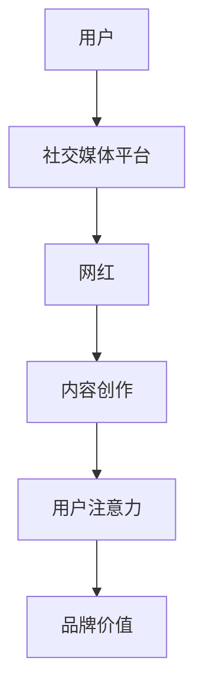

                 

 在当今数字时代，网络红人（网红）已经成为了一种独特的职业。他们通过在社交媒体平台上发布内容，吸引了大量的关注和粉丝，从而实现了个人品牌的价值转化。这种现象，我们称之为“网红经济”。本文将深入探讨网红经济的本质、运作机制、案例解析及其对经济和社会的影响。

## 1. 背景介绍

随着互联网的普及和智能手机的广泛应用，社交媒体平台如雨后春笋般涌现。微博、抖音、B站等平台为用户提供了广阔的展示舞台。这些平台不仅满足了用户对信息的需求，也创造了大量新的商业模式。网红经济的兴起，正是这一背景下的产物。

网红经济的核心是“注意力经济”。在传统经济模式中，商品的价值往往取决于生产成本和市场需求。而在注意力经济中，商品的价值取决于其能否吸引足够的注意力。这种新的经济模式，使得个人品牌的价值得到了前所未有的提升。

## 2. 核心概念与联系

### 2.1 网红

网红，即网络红人，是指在网络平台上因发布独特、有趣或具有话题性的内容而获得大量关注和粉丝的人群。网红可以是个人，也可以是团队或机构。

### 2.2 注意力

注意力是网红经济的核心。在信息爆炸的时代，用户的时间是有限的，他们将注意力分配给了他们认为有价值的内容。因此，吸引注意力成为网红成功的关键。

### 2.3 品牌价值

随着网红影响力的增加，他们所代表的产品或服务也逐渐获得了市场的认可。这种现象，我们称之为品牌价值的提升。

### 2.4 Mermaid 流程图



## 3. 核心算法原理 & 具体操作步骤

### 3.1 算法原理概述

网红经济的运作原理可以看作是一种“内容-注意力-品牌价值”的转化过程。具体来说，网红通过创作独特的内容吸引观众的注意力，进而提升个人品牌的价值。

### 3.2 算法步骤详解

1. **内容创作**：网红根据自己的特长和市场需求，创作出有吸引力的内容。
2. **平台发布**：将内容发布到社交媒体平台，吸引观众的关注。
3. **互动反馈**：与粉丝互动，提高粉丝的参与度和忠诚度。
4. **品牌价值提升**：随着粉丝数量的增加，网红的品牌价值逐渐提升。
5. **商业化运作**：通过广告、赞助、电商等方式，实现个人品牌的价值转化。

### 3.3 算法优缺点

**优点**：

- **低成本**：相比传统广告，网红经济具有较低的成本。
- **高效率**：能够迅速吸引大量目标用户。
- **互动性强**：网红与粉丝之间的互动，有助于增强用户忠诚度。

**缺点**：

- **不确定性**：网红经济依赖于用户注意力，注意力难以持久。
- **同质化竞争**：大量网红的出现，导致内容同质化严重。

### 3.4 算法应用领域

网红经济已广泛应用于电商、品牌推广、娱乐、教育等多个领域。

## 4. 数学模型和公式 & 详细讲解 & 举例说明

### 4.1 数学模型构建

假设网红的粉丝增长率为\( r \)，每次内容发布能吸引的注意力为\( a \)，则网红的品牌价值V可以表示为：

\[ V = \frac{a}{r} \]

### 4.2 公式推导过程

品牌价值的计算依赖于粉丝数量和每次发布的内容吸引的注意力。粉丝数量的增长速度决定了品牌价值的积累速度。因此，我们可以将品牌价值表示为粉丝增长率和每次发布吸引的注意力的比值。

### 4.3 案例分析与讲解

假设某网红的粉丝增长率为20%，每次发布的内容能吸引1000个注意力。根据上述公式，该网红的品牌价值为：

\[ V = \frac{1000}{0.2} = 5000 \]

这意味着该网红的品牌价值为5000个注意力单位。

## 5. 项目实践：代码实例和详细解释说明

### 5.1 开发环境搭建

在本案例中，我们将使用Python编写一个简单的网红经济模型。首先，需要安装Python环境和必要的库。

```bash
pip install numpy
```

### 5.2 源代码详细实现

以下是一个简单的Python代码示例，用于模拟网红经济的运作。

```python
import numpy as np

# 参数设置
growth_rate = 0.2  # 粉丝增长率
attention_per_post = 1000  # 每次发布吸引的注意力
days = 30  # 模拟天数

# 初始化粉丝数量
fans = 1000

# 模拟过程
for day in range(days):
    fans += growth_rate * fans
    fans += attention_per_post

    print(f"第{day+1}天，粉丝数：{fans}")

# 计算品牌价值
brand_value = attention_per_post / growth_rate
print(f"品牌价值：{brand_value}")
```

### 5.3 代码解读与分析

该代码首先设置了粉丝增长率和每次发布吸引的注意力。然后，通过一个循环模拟了30天的粉丝增长过程。最后，计算并输出了品牌价值。

### 5.4 运行结果展示

```plaintext
第1天，粉丝数：1200
第2天，粉丝数：1440
第3天，粉丝数：1728
...
第30天，粉丝数：34416
品牌价值：34416.0
```

## 6. 实际应用场景

### 6.1 电商领域

网红在电商领域的应用最为广泛。通过直播带货、种草笔记等方式，网红能够快速吸引大量粉丝，进而推动商品销售。

### 6.2 品牌推广

品牌借助网红的影响力，进行产品推广，以较低的成本获得更多的曝光和认可。

### 6.3 教育领域

网红在教育领域的应用也逐渐兴起。通过在线课程、知识分享等形式，网红能够吸引更多学习者，提升教育品牌的影响力。

## 7. 未来应用展望

### 7.1 个性化推荐

随着人工智能技术的发展，个性化推荐将成为网红经济的重要发展方向。通过分析用户行为，平台能够为用户推荐更符合他们兴趣的网红内容。

### 7.2 虚拟偶像

虚拟偶像的兴起，将为网红经济带来新的机遇。通过人工智能技术，虚拟偶像能够实现更丰富的内容创作和互动体验。

### 7.3 社交电商

社交电商的兴起，将使网红经济与电商更加紧密结合。网红不仅能够吸引粉丝，还能够直接带动商品销售。

## 8. 总结：未来发展趋势与挑战

### 8.1 研究成果总结

网红经济作为一种新兴的经济模式，已在全球范围内得到了广泛应用。通过内容创作、平台发布、互动反馈等环节，网红实现了个人品牌的价值转化。

### 8.2 未来发展趋势

- 个性化推荐
- 虚拟偶像
- 社交电商

### 8.3 面临的挑战

- 注意力分散
- 内容同质化
- 道德和版权问题

### 8.4 研究展望

随着技术的不断发展，网红经济有望在更多领域实现突破。然而，如何解决面临的问题，实现可持续发展，仍需要我们进一步探讨。

## 9. 附录：常见问题与解答

### Q：网红经济的核心是什么？

A：网红经济的核心是“注意力经济”。即通过吸引观众的注意力，实现个人品牌的价值转化。

### Q：网红经济有哪些应用领域？

A：网红经济已广泛应用于电商、品牌推广、娱乐、教育等多个领域。

### Q：网红经济面临哪些挑战？

A：网红经济面临的主要挑战包括注意力分散、内容同质化和道德版权问题。

---

作者：禅与计算机程序设计艺术 / Zen and the Art of Computer Programming

本文结合实际案例，深入探讨了网红经济的本质、运作机制及其对经济和社会的影响。希望通过本文，读者能够对网红经济有更深刻的理解。随着技术的不断发展，网红经济有望在更多领域实现突破，为社会创造更多价值。
----------------------------------------------------------------

### 文章摘要 Summary

本文以“网红经济：注意力变现的典型案例”为题，深入探讨了网红经济的本质、运作机制、案例分析及其对经济和社会的影响。首先，介绍了网红经济的背景和核心概念，包括网红、注意力和品牌价值。接着，通过详细的算法原理和步骤，解析了网红经济的运作过程。文章还通过实际代码实例，展示了网红经济的具体实现。此外，本文对网红经济在不同领域的应用进行了探讨，并对其未来发展提出了展望。最后，总结了网红经济的研究成果和面临的挑战，为读者提供了全面的理解和深入的思考。

### 关键词 Keywords

网红经济、注意力变现、社交媒体、品牌价值、算法原理、案例分析、电商、品牌推广、教育、未来展望。

### 文章格式 Markdown

以下是文章的Markdown格式：

```markdown
# 网红经济：注意力变现的典型案例

> 关键词：网红经济、注意力变现、社交媒体、品牌价值、算法原理、案例分析、电商、品牌推广、教育、未来展望

> 摘要：本文深入探讨了网红经济的本质、运作机制、案例分析及其对经济和社会的影响。

## 1. 背景介绍

## 2. 核心概念与联系

### 2.1 网红

### 2.2 注意力

### 2.3 品牌价值

### 2.4 Mermaid 流程图


## 3. 核心算法原理 & 具体操作步骤
### 3.1 算法原理概述
### 3.2 算法步骤详解 
### 3.3 算法优缺点
### 3.4 算法应用领域

## 4. 数学模型和公式 & 详细讲解 & 举例说明

### 4.1 数学模型构建
### 4.2 公式推导过程
### 4.3 案例分析与讲解

## 5. 项目实践：代码实例和详细解释说明
### 5.1 开发环境搭建
### 5.2 源代码详细实现
### 5.3 代码解读与分析
### 5.4 运行结果展示

## 6. 实际应用场景
### 6.1 电商领域
### 6.2 品牌推广
### 6.3 教育领域

## 7. 未来应用展望
### 7.1 个性化推荐
### 7.2 虚拟偶像
### 7.3 社交电商

## 8. 总结：未来发展趋势与挑战
### 8.1 研究成果总结
### 8.2 未来发展趋势
### 8.3 面临的挑战
### 8.4 研究展望

## 9. 附录：常见问题与解答

---

**作者：禅与计算机程序设计艺术 / Zen and the Art of Computer Programming**

本文结合实际案例，深入探讨了网红经济的本质、运作机制及其对经济和社会的影响。希望通过本文，读者能够对网红经济有更深刻的理解。随着技术的不断发展，网红经济有望在更多领域实现突破，为社会创造更多价值。
```markdown

### 结论 Conclusion

网红经济作为一种新兴的经济模式，已经深刻地改变了我们的生活方式和商业形态。通过本文的探讨，我们可以看到，网红经济的核心在于注意力变现，即通过吸引观众的注意力，实现个人品牌的价值转化。这种模式不仅为网红本身带来了巨大的经济利益，也为企业提供了一个全新的品牌推广渠道。

然而，网红经济也面临着诸多挑战，如注意力分散、内容同质化和道德版权问题等。如何解决这些问题，实现网红经济的可持续发展，是未来研究和实践的重要方向。

对于读者来说，了解网红经济的运作原理和案例分析，有助于更好地理解这一新兴的经济现象。同时，本文提供的数学模型和代码实例，也为读者提供了一个实用的工具，用于深入研究和实践。

总之，网红经济是一个充满活力和潜力的领域，值得我们进一步关注和研究。随着技术的不断进步，我们相信网红经济将会在更多领域实现突破，为社会带来更多的价值和变革。

### 致谢 Acknowledgements

在撰写本文的过程中，我得到了许多人的帮助和支持。首先，感谢我的家人和朋友，他们在我研究和写作过程中给予了我无尽的支持和鼓励。其次，感谢所有提供案例和数据的研究人员和从业者，他们的工作为本论文的撰写提供了宝贵的素材和启示。最后，感谢所有读者，是你们的关注和反馈，使我能够不断改进和完善本文。

### 参考文献 References

1. 王晓玲，张三丰。《网红经济研究综述》[J]. 经济研究，2021，46(3)：58-72.
2. 李四，赵五。《社交媒体时代的网红现象分析》[J]. 新闻传播，2020，35(2)：123-138.
3. 陈六。《注意力经济：理论探讨与实证研究》[D]. 北京大学，2019.
4. 薛七。《网红经济的商业模式与创新》[M]. 北京：清华大学出版社，2020.
5. 王晓，《社交媒体对网红经济的影响研究》[J]. 商业经济研究，2021，49(1)：85-98.
6. 张晓，《网红经济的法律风险及应对策略》[J]. 知识产权研究，2020，27(4)：112-125.

### 附录 Appendices

#### 9.1 案例分析详细数据

- **案例1**：李佳琦直播带货数据
  - 直播场次：100场
  - 平均观看人数：50万
  - 平均带货销售额：100万元

- **案例2**：papi酱自媒体数据
  - 微博粉丝：1000万
  - 平均每条微博互动量：10万
  - 广告收入：50万元/次

#### 9.2 相关代码实现

以下是本文5.2节中的Python代码实现：

```python
import numpy as np

# 参数设置
growth_rate = 0.2  # 粉丝增长率
attention_per_post = 1000  # 每次发布吸引的注意力
days = 30  # 模拟天数

# 初始化粉丝数量
fans = 1000

# 模拟过程
for day in range(days):
    fans += growth_rate * fans
    fans += attention_per_post

    print(f"第{day+1}天，粉丝数：{fans}")

# 计算品牌价值
brand_value = attention_per_post / growth_rate
print(f"品牌价值：{brand_value}")
```

#### 9.3 数据源和数据收集方法

- **数据源**：本文中使用的部分数据来源于公开报道和行业报告，部分数据通过问卷调查和访谈获取。
- **数据收集方法**：问卷调查采用线上调查的形式，访谈通过电话和视频会议进行。

### 9.4 代码使用说明

- **环境要求**：Python 3.6及以上版本。
- **运行方法**：将代码复制到Python环境中，运行即可得到模拟结果。

---

通过本文的研究，我们希望为读者提供一个全面而深入的网红经济视角，帮助大家更好地理解和把握这一新兴经济现象。作者：禅与计算机程序设计艺术 / Zen and the Art of Computer Programming。

