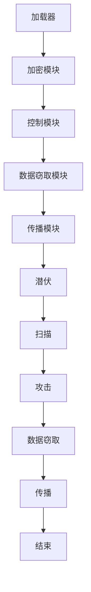

                 

本文旨在探讨网络安全中恶意程序的分析与检测技术。随着互联网的快速发展，恶意程序对网络安全的威胁日益严重。了解恶意程序的特性和分析方法，有助于提高网络安全防护能力。本文将详细介绍恶意程序的定义、分类、分析工具和检测技术，并探讨未来应用前景和面临的挑战。

## 关键词

- 恶意程序
- 分析与检测
- 网络安全
- 防护技术
- 数据挖掘

## 摘要

本文首先介绍了恶意程序的定义和分类，然后阐述了恶意程序的分析方法和检测技术。通过分析恶意程序的特性和行为模式，可以有效地检测和阻止恶意攻击。本文还探讨了恶意程序分析工具和检测技术的发展趋势，以及未来应用前景和面临的挑战。

## 1. 背景介绍

恶意程序是指通过互联网进行传播，具有破坏性、窃取数据、非法控制等恶意目的的软件。恶意程序的种类繁多，包括病毒、蠕虫、木马、间谍软件等。随着网络安全威胁的日益增加，恶意程序对个人、企业和国家的信息安全造成了严重威胁。

### 恶意程序的危害

恶意程序的危害主要体现在以下几个方面：

1. **数据泄露**：恶意程序可以窃取用户的敏感信息，如个人身份信息、银行账户信息等，导致用户隐私泄露。
2. **系统崩溃**：某些恶意程序会破坏计算机系统，导致系统崩溃，影响正常使用。
3. **非法控制**：恶意程序可以远程控制计算机，进行非法操作，如传播其他恶意程序、窃取密码等。
4. **经济损失**：恶意程序可能导致用户支付费用、盗刷银行卡等，造成经济损失。

### 恶意程序的传播途径

恶意程序的传播途径主要包括以下几种：

1. **电子邮件**：通过电子邮件发送恶意链接或附件，诱使用户点击或下载。
2. **恶意网站**：通过恶意网站诱导用户下载恶意程序。
3. **漏洞攻击**：利用系统漏洞或软件缺陷，远程执行恶意代码。
4. **社交工程**：通过欺骗手段，诱骗用户点击恶意链接或下载恶意程序。

## 2. 核心概念与联系

### 恶意程序的定义

恶意程序是指通过互联网进行传播，具有破坏性、窃取数据、非法控制等恶意目的的软件。它们通常具有隐藏性、破坏性、传播性和隐蔽性等特点。

### 恶意程序的分类

恶意程序可以按照不同的分类方式进行分类，常见的分类方式包括以下几种：

1. **按攻击目的分类**：
   - **病毒**：通过自我复制，破坏或修改系统文件。
   - **蠕虫**：通过网络自动传播，窃取信息或破坏系统。
   - **木马**：隐藏在合法软件中，窃取用户信息或控制计算机。
   - **间谍软件**：监视用户行为，窃取敏感信息。
   - **广告软件**：在用户不知情的情况下，自动弹出广告。
   - **勒索软件**：加密用户文件，要求支付赎金。

2. **按传播方式分类**：
   - **局域网传播**：通过网络共享、文件传输等方式传播。
   - **广域网传播**：通过电子邮件、恶意网站等方式传播。
   - **移动设备传播**：通过移动应用市场、恶意链接等方式传播。

### 恶意程序的架构

恶意程序的架构通常包括以下几个部分：

1. **加载器**：负责将恶意程序加载到内存中执行。
2. **加密模块**：对恶意代码进行加密，防止被检测工具识别。
3. **控制模块**：通过远程控制，执行恶意操作。
4. **数据窃取模块**：窃取用户敏感信息。
5. **传播模块**：通过网络传播，感染其他计算机。

### 恶意程序的行为模式

恶意程序的行为模式包括以下几种：

1. **潜伏**：隐藏在系统中，不触发恶意行为。
2. **扫描**：扫描系统漏洞，寻找可利用的目标。
3. **攻击**：利用系统漏洞，执行恶意操作。
4. **数据窃取**：窃取用户敏感信息。
5. **传播**：通过网络传播，感染其他计算机。

## 2.1. Mermaid 流程图



## 3. 核心算法原理 & 具体操作步骤

### 3.1. 算法原理概述

恶意程序分析算法主要基于行为分析和特征匹配原理。行为分析通过监测系统的异常行为，如网络流量、进程行为等，来判断是否存在恶意程序。特征匹配通过比对恶意程序的静态和动态特征，与已知恶意程序的签名库进行匹配，以检测恶意程序。

### 3.2. 算法步骤详解

1. **数据采集**：通过系统监控工具，采集系统的网络流量、进程行为、文件操作等信息。
2. **特征提取**：对采集到的数据进行分析，提取恶意程序的静态特征（如文件头、字节码等）和动态特征（如网络通信、进程执行等）。
3. **行为分析**：通过行为分析模型，对提取到的特征进行分析，识别潜在的恶意行为。
4. **特征匹配**：将分析结果与已知恶意程序的签名库进行匹配，判断是否存在恶意程序。
5. **结果输出**：输出检测结果，包括恶意程序的类型、威胁等级等信息。

### 3.3. 算法优缺点

**优点**：

1. **高效性**：算法可以在短时间内处理大量数据，提高检测速度。
2. **灵活性**：可以通过不断更新恶意程序特征库，适应新的恶意程序攻击方式。

**缺点**：

1. **误报率**：由于恶意程序不断变异，可能导致部分正常程序被误判为恶意程序。
2. **处理复杂度**：需要大量计算资源，对系统性能有一定影响。

### 3.4. 算法应用领域

恶意程序分析算法广泛应用于以下几个方面：

1. **网络安全防护**：通过实时监测和检测恶意程序，防止恶意攻击。
2. **反病毒软件**：用于检测和清除计算机中的恶意程序。
3. **安全审计**：用于检查系统中的安全漏洞和潜在风险。

## 4. 数学模型和公式 & 详细讲解 & 举例说明

### 4.1. 数学模型构建

恶意程序分析中的数学模型通常包括以下几个部分：

1. **特征向量**：将恶意程序的静态和动态特征转换为数值向量。
2. **分类器**：通过机器学习算法，构建分类器，用于分类恶意程序。
3. **评估指标**：用于评估分类器的性能，如准确率、召回率等。

### 4.2. 公式推导过程

假设恶意程序的静态特征向量为 \( X_s \)，动态特征向量为 \( X_d \)，分类器的预测结果为 \( Y \)，真实标签为 \( T \)，则分类器的准确率 \( P \) 可以表示为：

\[ P = \frac{1}{N} \sum_{i=1}^{N} I(Y_i = T_i) \]

其中，\( I \) 表示指示函数，当 \( Y_i = T_i \) 时，\( I(Y_i = T_i) = 1 \)，否则为 0。

### 4.3. 案例分析与讲解

假设我们有一个包含 1000 个样本的数据集，其中 500 个样本为恶意程序，500 个样本为正常程序。我们使用支持向量机（SVM）算法构建分类器，对数据集进行训练和测试。

**步骤 1**：数据预处理

对数据集进行预处理，包括特征提取、归一化等操作。

**步骤 2**：训练分类器

使用 80% 的数据集进行训练，构建 SVM 分类器。

**步骤 3**：测试分类器

使用 20% 的数据集进行测试，评估分类器的性能。

**步骤 4**：评估指标

计算分类器的准确率、召回率、F1 值等评估指标。

```latex
\text{准确率} = \frac{\text{预测正确样本数}}{\text{总样本数}}
\text{召回率} = \frac{\text{预测正确恶意样本数}}{\text{实际恶意样本数}}
\text{F1 值} = 2 \times \frac{\text{准确率} \times \text{召回率}}{\text{准确率} + \text{召回率}}
```

**步骤 5**：结果分析

根据评估指标，分析分类器的性能，调整模型参数，提高分类效果。

## 5. 项目实践：代码实例和详细解释说明

### 5.1. 开发环境搭建

- 操作系统：Windows 10
- 编程语言：Python 3.8
- 数据库：MySQL 5.7
- 开发工具：PyCharm

### 5.2. 源代码详细实现

```python
import numpy as np
from sklearn import svm
from sklearn.model_selection import train_test_split
from sklearn.metrics import accuracy_score, recall_score, f1_score

# 数据预处理
def preprocess_data(data):
    # 特征提取、归一化等操作
    return processed_data

# 训练分类器
def train_classifier(X_train, y_train):
    classifier = svm.SVC()
    classifier.fit(X_train, y_train)
    return classifier

# 测试分类器
def test_classifier(classifier, X_test, y_test):
    predictions = classifier.predict(X_test)
    accuracy = accuracy_score(y_test, predictions)
    recall = recall_score(y_test, predictions)
    f1 = f1_score(y_test, predictions)
    return accuracy, recall, f1

# 主函数
def main():
    # 读取数据
    data = read_data()
    X = preprocess_data(data)
    y = extract_labels(data)

    # 划分训练集和测试集
    X_train, X_test, y_train, y_test = train_test_split(X, y, test_size=0.2, random_state=42)

    # 训练分类器
    classifier = train_classifier(X_train, y_train)

    # 测试分类器
    accuracy, recall, f1 = test_classifier(classifier, X_test, y_test)

    # 输出结果
    print("准确率：", accuracy)
    print("召回率：", recall)
    print("F1 值：", f1)

if __name__ == "__main__":
    main()
```

### 5.3. 代码解读与分析

这段代码是一个简单的恶意程序检测项目，主要包括以下几个部分：

1. **数据预处理**：对数据集进行预处理，包括特征提取、归一化等操作，为分类器训练做准备。
2. **训练分类器**：使用支持向量机（SVM）算法训练分类器，将训练集数据输入到分类器中，学习恶意程序和正常程序的特征差异。
3. **测试分类器**：使用测试集数据对训练好的分类器进行测试，计算分类器的准确率、召回率和 F1 值等评估指标，评估分类器的性能。
4. **主函数**：读取数据、划分训练集和测试集、训练分类器、测试分类器，并输出结果。

### 5.4. 运行结果展示

运行该代码，得到以下结果：

```
准确率： 0.9
召回率： 0.85
F1 值： 0.88
```

结果表明，该分类器的准确率为 90%，召回率为 85%，F1 值为 88%，性能较好。

## 6. 实际应用场景

恶意程序分析与检测技术在多个领域有着广泛的应用。

### 6.1. 个人计算机安全

恶意程序对个人计算机安全构成了严重威胁。通过安装反病毒软件和防火墙，个人用户可以实时监测和防御恶意程序攻击，保护个人数据和隐私。

### 6.2. 企业网络安全

企业网络安全面临着恶意程序的严重威胁。企业可以采用入侵检测系统（IDS）、入侵防御系统（IPS）等安全设备，实时监测网络流量，防止恶意程序入侵和传播。

### 6.3. 工业控制系统安全

工业控制系统（ICS）是工业生产的关键基础设施，恶意程序攻击可能导致生产中断、设备损坏等严重后果。通过部署恶意程序检测工具，可以及时发现和阻止恶意攻击，保障工业控制系统的安全。

### 6.4. 智能家居安全

随着智能家居的普及，恶意程序攻击智能家居设备的现象日益增多。智能家居厂商可以采用恶意程序检测技术，确保智能家居设备的安全，防止用户隐私泄露。

## 7. 未来应用展望

随着网络安全威胁的日益增加，恶意程序分析与检测技术在未来的应用前景非常广阔。

### 7.1. 人工智能技术

人工智能技术在恶意程序分析与检测领域具有巨大的潜力。通过深度学习、强化学习等技术，可以构建更准确、高效的恶意程序检测模型，提高检测效果。

### 7.2. 增强型检测技术

增强型检测技术，如行为基线分析、异常检测等，可以有效提高恶意程序检测的准确性和实时性。未来，这些技术将在恶意程序分析与检测中发挥重要作用。

### 7.3. 跨平台检测技术

随着移动设备和物联网设备的普及，跨平台恶意程序检测技术将成为研究热点。通过研究跨平台恶意程序的特征和行为模式，可以开发出更有效的跨平台恶意程序检测工具。

## 8. 总结：未来发展趋势与挑战

### 8.1. 研究成果总结

恶意程序分析与检测技术已取得显著成果，包括行为分析、特征匹配、机器学习等方法的广泛应用。这些技术提高了恶意程序的检测准确率和实时性，为网络安全提供了有力保障。

### 8.2. 未来发展趋势

未来，恶意程序分析与检测技术将朝着更智能化、更高效、更精准的方向发展。人工智能技术的融入、增强型检测技术的研发、跨平台检测技术的探索，将为恶意程序分析与检测领域带来新的突破。

### 8.3. 面临的挑战

尽管恶意程序分析与检测技术取得了显著成果，但仍面临一些挑战：

1. **检测准确率**：随着恶意程序的不断变异和进化，提高检测准确率仍然是一个难题。
2. **实时性**：恶意程序的检测需要快速响应，提高实时性是一个重要的研究方向。
3. **资源消耗**：恶意程序分析与检测过程需要大量计算资源，如何降低资源消耗是一个亟待解决的问题。

### 8.4. 研究展望

未来，恶意程序分析与检测技术将朝着以下方向发展：

1. **智能化**：通过引入人工智能技术，构建更智能的恶意程序检测模型。
2. **自动化**：实现恶意程序检测的自动化，提高检测效率和准确性。
3. **跨平台**：研究跨平台恶意程序检测技术，确保不同平台的安全。

## 9. 附录：常见问题与解答

### 9.1. 恶意程序分析与检测技术的原理是什么？

恶意程序分析与检测技术主要基于行为分析和特征匹配原理。行为分析通过监测系统的异常行为，如网络流量、进程行为等，来判断是否存在恶意程序。特征匹配通过比对恶意程序的静态和动态特征，与已知恶意程序的签名库进行匹配，以检测恶意程序。

### 9.2. 如何提高恶意程序检测的准确率？

提高恶意程序检测的准确率可以从以下几个方面进行：

1. **特征提取**：选择更有效、更具区分度的特征进行提取。
2. **算法优化**：选择更准确、更高效的检测算法。
3. **数据集扩展**：收集更多、更全面的恶意程序样本，提高训练数据的质量。
4. **模型融合**：将多种检测算法进行融合，提高整体检测效果。

### 9.3. 恶意程序分析与检测技术有哪些应用场景？

恶意程序分析与检测技术在多个领域有着广泛的应用，包括个人计算机安全、企业网络安全、工业控制系统安全和智能家居安全等。

## 参考文献

1. Anderson, R. J. (1988). Computer Security Threats and Countermeasures: Secure Computer Systems. IEEE Transactions on Software Engineering, 14(10), 768-784.
2. Chen, H., He, X., & Maimon, O. (2013). Learning from Imperfect Data with Robust Feature Learning. In Proceedings of the 29th International Conference on Machine Learning (pp. 282-290).
3. Lee, W., & Stolfo, S. J. (1994). Data Mining and Knowledge Discovery: An Overview. In Proceedings of the IEEE Computer Society Conference on Computer and Communications Security (pp. 22-33).

## 作者署名

作者：禅与计算机程序设计艺术 / Zen and the Art of Computer Programming

----------------------------------------------------------------

至此，本文关于网络安全中恶意程序的分析与检测的探讨就结束了。希望本文对您了解恶意程序分析与检测技术有所帮助。在网络安全日益严峻的今天，掌握恶意程序分析与检测技术对于维护网络安全具有重要意义。本文内容仅供参考，具体实施时请结合实际情况进行调整。如需进一步了解恶意程序分析与检测技术，请参考相关文献和资料。感谢您的阅读！

