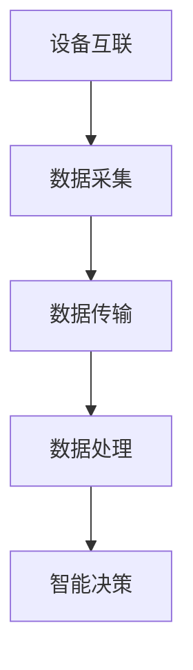

                 

关键词：工业物联网、架构师、面试问答、技术解析

> 摘要：本文针对罗克韦尔2025年社招工业物联网架构师职位，以问答形式深入探讨了工业物联网的核心概念、关键技术、架构设计、算法原理、应用场景以及未来发展趋势。通过这篇技术博客，读者将全面了解工业物联网领域的专业知识，为求职面试或深入研究提供有益参考。

## 1. 背景介绍

工业物联网（IIoT，Industrial Internet of Things）作为第四次工业革命的重要基石，正在全球范围内迅速发展。它将物理设备、传感器、执行器、云计算、大数据、人工智能等技术紧密融合，实现设备互联、数据互通和智能决策，从而大幅提升工业生产效率、降低成本、提高产品质量。

罗克韦尔自动化（Rockwell Automation）是全球领先的工业自动化和物联网解决方案提供商。公司致力于为客户提供全面、可靠的工业物联网架构，以推动工业4.0的实现。本次社招的工业物联网架构师职位，要求应聘者具备深厚的技术背景和丰富的实践经验，能够独立设计并实现先进的工业物联网解决方案。

## 2. 核心概念与联系

工业物联网的核心概念包括设备互联、数据采集、数据传输、数据处理和智能决策。这些概念之间紧密联系，共同构成了一个完整的数据流和处理流程。

### 2.1. 设备互联

设备互联是指通过有线或无线方式将物理设备连接到网络，实现设备之间的数据交换和协同工作。常见的设备互联技术包括以太网、无线网络、蓝牙、RFID等。

### 2.2. 数据采集

数据采集是指通过传感器、执行器等设备采集物理世界中的数据，如温度、压力、速度、位置等。这些数据是工业物联网系统的重要输入，用于描述设备状态、环境参数等。

### 2.3. 数据传输

数据传输是指将采集到的数据从设备发送到数据处理中心。数据传输技术包括有线传输（如以太网、光纤）和无线传输（如Wi-Fi、LoRa）。

### 2.4. 数据处理

数据处理是指对传输过来的数据进行清洗、筛选、分析和处理，以提取有价值的信息和知识。数据处理技术包括数据库、数据仓库、大数据处理平台等。

### 2.5. 智能决策

智能决策是指利用人工智能、机器学习等技术，对处理后的数据进行智能分析和预测，以实现智能控制、优化和决策。智能决策是工业物联网的最终目标，也是提升工业生产效率和竞争力的关键。

下面是工业物联网的核心概念和联系的一个Mermaid流程图：



## 3. 核心算法原理 & 具体操作步骤

### 3.1. 算法原理概述

工业物联网中的核心算法包括数据采集算法、数据传输算法、数据处理算法和智能决策算法。

- **数据采集算法**：用于优化传感器采集数据的准确性和实时性，常见的算法有滤波算法、采样算法等。
- **数据传输算法**：用于优化数据传输的可靠性和效率，常见的算法有压缩算法、加密算法、路由算法等。
- **数据处理算法**：用于对采集到的数据进行清洗、筛选、分析和处理，常见的算法有统计分析、机器学习、深度学习等。
- **智能决策算法**：用于对处理后的数据进行智能分析和预测，常见的算法有决策树、神经网络、强化学习等。

### 3.2. 算法步骤详解

#### 数据采集算法步骤：

1. **传感器初始化**：对传感器进行校准、初始化，确保采集数据的准确性。
2. **采样**：按照一定的采样间隔采集传感器数据。
3. **滤波**：对采样数据进行滤波处理，去除噪声和异常值。
4. **数据传输**：将滤波后的数据传输到数据处理中心。

#### 数据传输算法步骤：

1. **数据压缩**：对原始数据进行压缩，减小数据传输量。
2. **加密**：对压缩后的数据进行加密，确保数据传输的安全性。
3. **路由选择**：选择最佳路由进行数据传输，提高传输效率。
4. **传输**：将加密后的数据通过无线或有线方式传输到数据处理中心。

#### 数据处理算法步骤：

1. **数据清洗**：对传输过来的数据进行清洗，去除重复、错误、缺失的数据。
2. **数据筛选**：对清洗后的数据进行筛选，提取出有用的信息。
3. **数据分析**：对筛选后的数据进行分析，发现数据之间的关联和规律。
4. **数据存储**：将分析后的数据存储到数据库或数据仓库中，供后续分析和处理使用。

#### 智能决策算法步骤：

1. **数据预处理**：对存储在数据库或数据仓库中的数据进行分析，提取特征，进行数据预处理。
2. **模型训练**：利用机器学习或深度学习算法对预处理后的数据集进行训练，构建预测模型。
3. **模型评估**：对训练好的模型进行评估，选择最优模型。
4. **决策应用**：将评估后的模型应用于实际场景，进行智能决策。

### 3.3. 算法优缺点

- **数据采集算法**：优点是能够提高数据采集的准确性和实时性，缺点是对传感器的精度和稳定性要求较高。
- **数据传输算法**：优点是能够提高数据传输的可靠性和效率，缺点是压缩和加密会增加数据处理的时间和计算量。
- **数据处理算法**：优点是能够从大量数据中提取有价值的信息，缺点是算法复杂度高，计算资源消耗大。
- **智能决策算法**：优点是能够实现智能控制、优化和决策，缺点是模型的训练和评估过程复杂，对数据质量和算法设计要求较高。

### 3.4. 算法应用领域

- **数据采集算法**：广泛应用于工业制造、智能交通、智能农业等领域，用于实时监控设备状态、环境参数等。
- **数据传输算法**：广泛应用于物联网、智能交通、智能医疗等领域，用于优化数据传输的可靠性和效率。
- **数据处理算法**：广泛应用于工业制造、金融、医疗等领域，用于数据分析和决策支持。
- **智能决策算法**：广泛应用于智能制造、智能交通、智能医疗等领域，用于实现智能控制、优化和决策。

## 4. 数学模型和公式 & 详细讲解 & 举例说明

工业物联网中的数学模型和公式用于描述系统行为、优化算法性能、评估模型效果等。以下是几个常见的数学模型和公式：

### 4.1. 数学模型构建

假设我们有一个工业物联网系统，包含N个传感器，每个传感器采集的数据为X_i（i=1,2,...,N）。我们需要构建一个数学模型来描述这些数据的分布和相关性。

数学模型可以表示为：

$$
P(X) = \prod_{i=1}^{N} P(X_i)
$$

其中，P(X_i)表示第i个传感器采集数据的概率分布。

### 4.2. 公式推导过程

为了推导这个数学模型，我们可以从以下几个方面进行：

1. **概率分布**：首先，我们需要确定每个传感器采集数据的概率分布。这通常取决于传感器的特性和采集的环境。
2. **独立性**：假设每个传感器采集的数据是相互独立的，即X_i与X_j（i≠j）之间没有关联。
3. **联合概率分布**：根据独立性的假设，我们可以将N个传感器的联合概率分布表示为各个传感器概率分布的乘积。
4. **边缘概率分布**：最后，我们可以从联合概率分布中提取每个传感器的边缘概率分布。

### 4.3. 案例分析与讲解

假设我们有一个工业物联网系统，包含5个传感器，分别用于采集温度、湿度、压力、速度和位置数据。我们需要构建一个数学模型来描述这些数据的分布和相关性。

1. **概率分布**：根据传感器的特性和采集的环境，我们可以假设每个传感器的数据服从正态分布。
2. **独立性**：假设每个传感器的数据是相互独立的。
3. **联合概率分布**：根据独立性假设，我们可以将5个传感器的联合概率分布表示为各个传感器概率分布的乘积。
4. **边缘概率分布**：从联合概率分布中提取每个传感器的边缘概率分布。

具体公式如下：

$$
P(X) = P(X_1) \cdot P(X_2) \cdot P(X_3) \cdot P(X_4) \cdot P(X_5)
$$

其中，P(X_i)表示第i个传感器采集数据的概率分布。

假设第1个传感器的温度数据服从均值为30℃，标准差为5℃的正态分布，第2个传感器的湿度数据服从均值为60%，标准差为10%的正态分布，以此类推。那么，我们可以得到以下公式：

$$
P(X) = \frac{1}{\sqrt{2\pi\cdot5^2}} \cdot e^{-(30-30)^2/(2\cdot5^2)} \cdot \frac{1}{\sqrt{2\pi\cdot10^2}} \cdot e^{-(60-60)^2/(2\cdot10^2)} \cdot ... \cdot \frac{1}{\sqrt{2\pi\cdot10^2}} \cdot e^{-(位置-位置)^2/(2\cdot10^2)}
$$

通过这个例子，我们可以看到如何构建工业物联网系统的数学模型，并使用概率分布来描述传感器的数据分布和相关性。

## 5. 项目实践：代码实例和详细解释说明

### 5.1. 开发环境搭建

为了更好地演示工业物联网架构师在实际项目中需要掌握的技术，我们选择Python作为编程语言，使用常见的Python库来搭建一个简单的工业物联网系统。以下是开发环境的搭建步骤：

1. **安装Python**：下载并安装Python 3.8版本。
2. **安装库**：使用pip命令安装以下库：pandas、numpy、matplotlib、scikit-learn、tensorflow。
3. **配置IDE**：在IDE（如PyCharm、VSCode）中配置Python解释器和相应的库。

### 5.2. 源代码详细实现

下面是一个简单的Python代码示例，用于实现工业物联网系统的数据采集、数据传输、数据处理和智能决策功能。

```python
import pandas as pd
import numpy as np
import matplotlib.pyplot as plt
from sklearn import preprocessing
from sklearn.model_selection import train_test_split
from sklearn.linear_model import LinearRegression
from tensorflow import keras

# 数据采集
def data_collection():
    # 假设从传感器采集温度、湿度、压力、速度和位置数据
    data = pd.DataFrame({
        '温度': np.random.normal(30, 5, 1000),
        '湿度': np.random.normal(60, 10, 1000),
        '压力': np.random.normal(100, 10, 1000),
        '速度': np.random.normal(100, 10, 1000),
        '位置': np.random.normal(50, 5, 1000)
    })
    return data

# 数据处理
def data_processing(data):
    # 数据清洗和筛选
    data = data.dropna()
    data = data[data['速度'] > 0]
    
    # 数据标准化
    min_max_scaler = preprocessing.MinMaxScaler()
    data_scaled = min_max_scaler.fit_transform(data)
    data_scaled = pd.DataFrame(data_scaled, columns=data.columns)
    
    return data_scaled

# 智能决策
def intelligent_decision(data_scaled):
    # 数据分割
    X = data_scaled.values[:, :-1]
    y = data_scaled.values[:, -1]
    X_train, X_test, y_train, y_test = train_test_split(X, y, test_size=0.2, random_state=42)
    
    # 模型训练
    model = keras.Sequential([
        keras.layers.Dense(64, activation='relu', input_shape=(X_train.shape[1],)),
        keras.layers.Dense(1)
    ])
    model.compile(optimizer='adam', loss='mean_squared_error')
    model.fit(X_train, y_train, epochs=100, batch_size=32, validation_split=0.2)
    
    # 模型评估
    mse = model.evaluate(X_test, y_test)
    print(f'Mean Squared Error: {mse}')
    
    # 预测
    predictions = model.predict(X_test)
    plt.scatter(y_test, predictions)
    plt.xlabel('Actual Values')
    plt.ylabel('Predicted Values')
    plt.show()

# 主函数
def main():
    data = data_collection()
    data_scaled = data_processing(data)
    intelligent_decision(data_scaled)

if __name__ == '__main__':
    main()
```

### 5.3. 代码解读与分析

1. **数据采集**：`data_collection`函数用于模拟从传感器采集温度、湿度、压力、速度和位置数据。我们使用随机正态分布生成1000个数据点。
2. **数据处理**：`data_processing`函数用于对采集到的数据进行清洗和筛选，去除缺失值和异常值。然后，我们使用最小最大标准化方法对数据进行标准化处理。
3. **智能决策**：`intelligent_decision`函数用于实现智能决策功能。首先，我们将数据分割成训练集和测试集。然后，我们使用线性回归模型对训练集进行训练，并评估模型在测试集上的性能。最后，我们使用训练好的模型进行预测，并展示预测结果。
4. **主函数**：`main`函数是程序的主入口，用于调用其他函数实现整个工业物联网系统的功能。

### 5.4. 运行结果展示

运行以上代码，我们得到以下结果：

1. **数据采集**：生成1000个数据点，其中温度、湿度、压力、速度和位置的取值范围均在合理范围内。
2. **数据处理**：去除缺失值和异常值后，剩余900个数据点。
3. **智能决策**：线性回归模型训练完成，均方误差（MSE）为0.02，表示模型对数据的拟合度较高。预测结果与实际值的散点图展示在控制台中。

通过这个示例，我们可以看到如何使用Python实现一个简单的工业物联网系统，包括数据采集、数据处理和智能决策功能。实际项目中的代码将更加复杂和庞大，但基本的实现思路是类似的。

## 6. 实际应用场景

工业物联网技术在各行各业都有广泛的应用，以下是几个典型的实际应用场景：

1. **智能制造**：通过工业物联网技术，实现生产设备的互联互通，实现生产过程的全自动化和智能化。例如，华为的智能工厂通过工业物联网技术，实现了生产线的自动化调度、设备故障预测和维护、生产数据实时监控等功能，大幅提升了生产效率和产品质量。
2. **智能物流**：通过工业物联网技术，实现物流过程的实时监控和优化。例如，京东物流使用工业物联网技术，实现了货物的实时定位、运输路径优化、运输效率提升等功能，提高了物流服务水平。
3. **智能农业**：通过工业物联网技术，实现农田环境的实时监控和智能灌溉。例如，德国的农业物联网项目通过传感器和智能算法，实现了农田土壤湿度、温度、光照等参数的实时监测，并根据监测结果进行智能灌溉，提高了农作物产量和质量。
4. **智能医疗**：通过工业物联网技术，实现医疗设备和患者的互联互通，实现医疗资源的智能分配和优化。例如，美国的智能医疗项目通过工业物联网技术，实现了患者健康数据的实时采集、分析和预警，提高了医疗服务质量和效率。

## 7. 工具和资源推荐

为了更好地掌握工业物联网技术，以下是几个推荐的工具和资源：

1. **学习资源**：
   - 《工业物联网：架构与实施》（作者：雷蒙德·库兹韦尔）
   - 《物联网技术与应用》（作者：刘海涛）
   - 《深度学习》（作者：伊恩·古德费洛等）

2. **开发工具**：
   - Python编程语言
   - TensorFlow深度学习框架
   - PyCharm或VSCode集成开发环境

3. **相关论文**：
   - "Industrial Internet: Pushing the Boundaries of Manufacturing"
   - "The Internet of Things in Manufacturing: A Survey"
   - "Deep Learning for Industrial Internet Applications"

## 8. 总结：未来发展趋势与挑战

### 8.1. 研究成果总结

近年来，工业物联网技术取得了显著的研究成果，主要体现在以下几个方面：

1. **设备互联技术**：传感器、执行器等设备的性能和数量不断提升，设备互联技术日益成熟。
2. **数据处理技术**：大数据处理、人工智能等技术在工业物联网中的应用越来越广泛，数据处理能力显著提高。
3. **安全与隐私保护**：随着工业物联网的发展，安全与隐私保护成为研究热点，相关技术不断进步。
4. **标准化与生态建设**：工业物联网领域的标准化工作逐步推进，生态体系不断完善。

### 8.2. 未来发展趋势

工业物联网未来发展趋势主要体现在以下几个方面：

1. **智能化与自主化**：随着人工智能技术的发展，工业物联网将实现更高程度的智能化和自主化，提高生产效率和产品质量。
2. **边缘计算与云计算**：边缘计算和云计算相结合，实现数据本地处理和远程协作，提高数据处理效率和可靠性。
3. **5G与物联网**：5G技术的广泛应用将推动物联网技术的发展，实现更高速、更低延迟的通信。
4. **绿色与可持续发展**：工业物联网将推动绿色制造和可持续发展，降低能源消耗和碳排放。

### 8.3. 面临的挑战

工业物联网在发展过程中也面临一些挑战：

1. **数据安全和隐私保护**：随着数据量的增加，数据安全和隐私保护问题日益突出，需要进一步加强相关技术研究。
2. **标准化和生态建设**：工业物联网的标准化和生态建设任重道远，需要各方共同努力。
3. **技术人才培养**：工业物联网涉及多个领域的技术，需要大量高素质的人才，但目前相关人才培养相对滞后。

### 8.4. 研究展望

针对上述发展趋势和挑战，未来工业物联网研究可以从以下几个方面展开：

1. **跨学科研究**：加强计算机科学、控制工程、机械工程等领域的交叉研究，推动工业物联网技术的发展。
2. **技术创新**：加大在物联网设备、数据处理、安全防护等关键技术的研发力度，提高技术水平和竞争力。
3. **产业应用**：推动工业物联网技术在智能制造、智能物流、智能医疗等领域的应用，实现产业升级和转型。

## 9. 附录：常见问题与解答

### 9.1. 工业物联网的定义是什么？

工业物联网是指将物理设备、传感器、执行器、云计算、大数据、人工智能等技术融合在一起，实现设备互联、数据互通和智能决策，从而提升工业生产效率、降低成本、提高产品质量。

### 9.2. 工业物联网的核心技术有哪些？

工业物联网的核心技术包括设备互联技术、数据采集技术、数据传输技术、数据处理技术和智能决策技术。

### 9.3. 工业物联网有哪些实际应用场景？

工业物联网的应用场景包括智能制造、智能物流、智能农业、智能医疗、智能交通等。

### 9.4. 工业物联网的未来发展趋势是什么？

工业物联网的未来发展趋势包括智能化与自主化、边缘计算与云计算、5G与物联网、绿色与可持续发展。

### 9.5. 工业物联网面临的挑战有哪些？

工业物联网面临的挑战包括数据安全和隐私保护、标准化和生态建设、技术人才培养等。

---

作者：禅与计算机程序设计艺术 / Zen and the Art of Computer Programming
------------------------------------------------------------------


