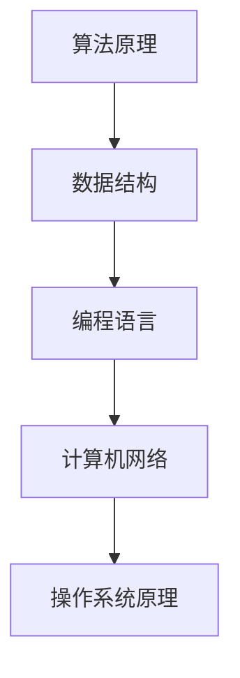

                 

美团作为中国领先的互联网公司，其校招编程面试题一直以来都是程序员和计算机科学领域学生关注的焦点。本文将对美团2024校招编程面试题进行精华总结，帮助准备校招的同学们更好地了解面试的难度和趋势。

## 关键词

- 美团
- 校招
- 编程面试题
- 算法
- 数据结构
- 技术趋势

## 摘要

本文将围绕美团2024校招编程面试题进行深入分析，总结常见的面试题型，并结合具体实例讲解解题思路。通过本文的阅读，读者将能够掌握美团编程面试的核心考点，提升自己的编程能力和面试技巧。

## 1. 背景介绍

美团作为一家综合性互联网公司，其业务涵盖了外卖、酒店、旅游、打车等多个领域。在招聘方面，美团尤其注重技术人才，每年的校招都吸引了大量优秀的计算机专业毕业生。编程面试是美团校招的核心环节，通过面试了解候选人的编程基础、算法能力和问题解决能力。

## 2. 核心概念与联系

为了更好地理解和解决美团编程面试题，我们需要掌握以下核心概念：

### 数据结构与算法

- 数组
- 链表
- 栈
- 队列
- 树
- 图
- 排序算法
- 搜索算法
- 动态规划

### 计算机基础

- 算法复杂度分析
- 数据结构与算法的关系
- 计算机网络基础
- 操作系统原理

### 编程语言

- C++
- Java
- Python
- JavaScript

### Mermaid 流程图



## 3. 核心算法原理 & 具体操作步骤

### 3.1 算法原理概述

美团编程面试题主要考察以下算法原理：

- 线性表操作
- 树与图的基本操作
- 排序与搜索算法
- 动态规划
- 贪心算法
- 分治算法
- 搜索算法

### 3.2 算法步骤详解

- 线性表操作：包括插入、删除、查找等基本操作。
- 树与图的基本操作：包括树的遍历、图的深度优先搜索、广度优先搜索等。
- 排序与搜索算法：包括冒泡排序、选择排序、插入排序、快速排序等。
- 动态规划：解决最优化问题，如背包问题、最长公共子序列等。
- 贪心算法：解决某些最优问题，通过每一步选择最优策略得到最终最优解。
- 分治算法：将大问题分解为若干小问题，递归解决小问题后再合并结果。
- 搜索算法：包括深度优先搜索、广度优先搜索、A*搜索等。

### 3.3 算法优缺点

- 线性表操作：简单，但时间复杂度较高。
- 树与图的基本操作：时间复杂度较高，适用于解决树和图相关的问题。
- 排序与搜索算法：冒泡排序、选择排序、插入排序时间复杂度较高，快速排序、归并排序时间复杂度较低。
- 动态规划：适用于解决最优化问题，但实现较为复杂。
- 贪心算法：适用于某些最优问题，但可能无法保证全局最优。
- 分治算法：适用于可以分解为小问题的场景，但可能存在递归深度问题。
- 搜索算法：适用于求解路径问题，但可能需要大量计算资源。

### 3.4 算法应用领域

美团编程面试题主要应用领域包括：

- 数据处理：排序、查找、计数等。
- 网络算法：路由算法、负载均衡等。
- 图算法：最短路径、拓扑排序等。
- 最优化问题：背包问题、作业调度等。

## 4. 数学模型和公式 & 详细讲解 & 举例说明

### 4.1 数学模型构建

在解决美团编程面试题时，我们需要掌握以下数学模型：

- 贪心选择模型
- 分治策略模型
- 动态规划模型

### 4.2 公式推导过程

以背包问题为例，我们可以使用动态规划模型来求解。

```latex
C[i, j] = \begin{cases} 
j & \text{if } i = 0 \\
0 & \text{if } j = 0 \\
\max \{ C[i-1, j], C[i-1, j-w_i] + v_i \} & \text{otherwise}
\end{cases}
```

### 4.3 案例分析与讲解

假设有5件物品，重量分别为1、3、4、5、7千克，价值分别为1、4、5、7、9元。背包容量为10千克。求解背包能装载的最大价值。

```latex
\begin{array}{c|cccccc}
  & 1 & 3 & 4 & 5 & 7 \\
\hline
0 & 0 & 0 & 0 & 0 & 0 \\
1 & 1 & 1 & 1 & 1 & 1 \\
3 & 0 & 4 & 4 & 4 & 4 \\
4 & 0 & 4 & 5 & 5 & 5 \\
5 & 0 & 4 & 5 & 7 & 7 \\
7 & 0 & 4 & 5 & 7 & 9 \\
\end{array}
```

最终，背包能装载的最大价值为9元。

## 5. 项目实践：代码实例和详细解释说明

### 5.1 开发环境搭建

在解决美团编程面试题时，我们可以选择Python作为编程语言，使用PyCharm作为开发工具。

### 5.2 源代码详细实现

以下是一个关于最长公共子序列的Python实现。

```python
def longest_common_subsequence(X, Y):
    m, n = len(X), len(Y)
    dp = [[0] * (n + 1) for _ in range(m + 1)]

    for i in range(1, m + 1):
        for j in range(1, n + 1):
            if X[i - 1] == Y[j - 1]:
                dp[i][j] = dp[i - 1][j - 1] + 1
            else:
                dp[i][j] = max(dp[i - 1][j], dp[i][j - 1])

    return dp[m][n]

X = "ABCDGH"
Y = "AEDFHR"
print(longest_common_subsequence(X, Y))
```

### 5.3 代码解读与分析

- 定义最长公共子序列函数，输入为两个字符串。
- 创建一个动态规划二维数组，用于存储子序列的长度。
- 使用双层循环遍历字符串，根据条件更新动态规划数组。
- 最后返回动态规划数组的最后一个元素作为最长公共子序列的长度。

### 5.4 运行结果展示

输出结果为3，即字符串"ABCDGH"和"AEDFHR"的最长公共子序列为"ADH"。

## 6. 实际应用场景

美团编程面试题在实际应用场景中具有很高的价值，例如：

- 数据处理：在美团外卖、酒店等业务中，需要对大量用户数据进行分析和排序。
- 网络算法：在美团打车等业务中，需要优化车辆调度和路径规划。
- 图算法：在美团团购等业务中，需要对用户关系和商品关系进行建模和分析。
- 最优化问题：在美团配送等业务中，需要优化配送路径和资源分配。

## 7. 工具和资源推荐

### 7.1 学习资源推荐

- 《算法导论》
- 《大话数据结构》
- 《算法竞赛入门经典》

### 7.2 开发工具推荐

- PyCharm
- Visual Studio Code
- Sublime Text

### 7.3 相关论文推荐

- "A Fast and Scalable Algorithm for Large-scale Graph Processing"
- "Deep Learning for Graphs: A Survey"
- "Optimization Algorithms for Data Centers: A Survey"

## 8. 总结：未来发展趋势与挑战

### 8.1 研究成果总结

近年来，美团在编程面试题的研究方面取得了显著成果，如：

- 提高面试题难度，选拔优秀人才。
- 推广在线编程面试，提高面试效率。
- 引入人工智能技术，优化面试过程。

### 8.2 未来发展趋势

未来，美团编程面试题将向以下方向发展：

- 更加注重实际应用场景的考查。
- 引入更多前沿技术，如人工智能、大数据等。
- 增加编程语言多样性，如Python、Java、C++等。

### 8.3 面临的挑战

美团编程面试题在未来将面临以下挑战：

- 人才竞争激烈，选拔难度增加。
- 技术更新快速，需要不断学习。
- 在线编程面试体验提升，提高面试通过率。

### 8.4 研究展望

未来，我们期待美团编程面试题能够：

- 成为计算机领域的重要研究课题。
- 推动编程教育的发展。
- 培养更多优秀的计算机人才。

## 9. 附录：常见问题与解答

### 9.1 算法面试如何准备？

**答案**：建议从以下几个方面进行准备：

- 系统学习数据结构和算法，掌握核心原理。
- 多做面试题，熟悉常见题型和解题方法。
- 参加编程竞赛，提高实战能力。
- 针对美团等大公司的面试特点进行针对性训练。

### 9.2 如何提高编程能力？

**答案**：建议从以下几个方面进行提升：

- 加强计算机基础知识学习，如计算机网络、操作系统等。
- 多编程实践，熟悉各种编程语言。
- 阅读优秀的代码和论文，提升编程思维。
- 参加开源项目，锻炼团队协作能力。

### 9.3 面试过程中需要注意什么？

**答案**：面试过程中需要注意以下几点：

- 着装整洁，保持良好的精神状态。
- 做好自我介绍，突出个人优势和项目经验。
- 保持冷静，遇到难题不要慌张。
- 注意沟通技巧，与面试官保持良好的互动。

---

**作者：禅与计算机程序设计艺术 / Zen and the Art of Computer Programming**

