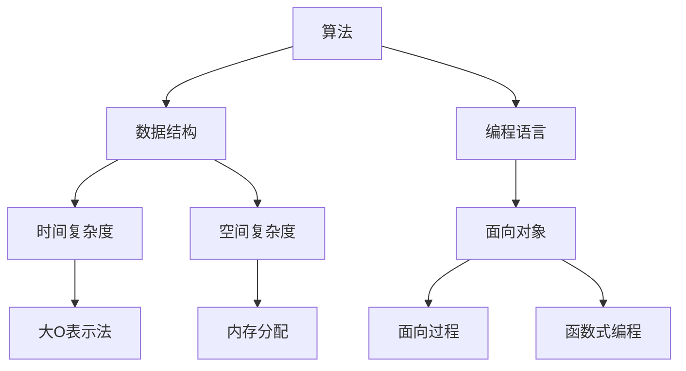

                 

关键词：美团，2025校招，编程面试，算法，数据结构，编程语言，实战经验，面试技巧，核心技术。

> 摘要：本文将对美团2025校招编程面试的精华内容进行详细总结，包括核心概念、算法原理、数学模型、项目实践等方面，为即将参加面试的同学提供宝贵的指导和参考。

## 1. 背景介绍

随着人工智能、大数据、云计算等技术的迅速发展，编程面试已经成为许多高科技公司和互联网企业的招聘核心环节。美团作为中国领先的生活服务电子商务平台，其对编程面试的要求也越来越高。本文旨在总结美团2025校招编程面试的精华内容，帮助广大求职者更好地准备面试。

## 2. 核心概念与联系

在编程面试中，核心概念和联系是理解算法和数据结构的关键。以下是一个Mermaid流程图，展示了一些核心概念和它们之间的联系：



## 3. 核心算法原理 & 具体操作步骤

### 3.1 算法原理概述

在编程面试中，常见的算法包括排序算法、搜索算法、动态规划等。以下是对这些算法原理的概述：

- 排序算法：通过比较和交换元素的位置，将一个无序的数据序列调整为有序序列。
- 搜索算法：在数据结构中查找特定元素的过程。
- 动态规划：通过将问题分解为子问题，并存储子问题的解，避免重复计算。

### 3.2 算法步骤详解

以下是排序算法和搜索算法的详细步骤：

#### 3.2.1 排序算法

1. 冒泡排序：
   - 从数组的第一个元素开始，比较相邻的两个元素，如果它们的顺序错误就交换它们的位置。
   - 重复上述步骤，直到整个数组排序完成。

2. 快速排序：
   - 选择一个基准元素，将数组分为两部分，一部分小于基准元素，另一部分大于基准元素。
   - 递归地对两部分进行快速排序。

#### 3.2.2 搜索算法

1. 二分搜索：
   - 在有序数组中，从中间位置开始，与目标值比较。
   - 如果目标值小于中间位置的元素，则在左侧子数组中继续搜索；如果目标值大于中间位置的元素，则在右侧子数组中继续搜索。
   - 重复上述步骤，直到找到目标值或确定目标值不存在。

### 3.3 算法优缺点

- 冒泡排序：
  - 优点：实现简单，易于理解。
  - 缺点：时间复杂度高，适用于小数据量的排序。

- 快速排序：
  - 优点：时间复杂度低，适用于大数据量的排序。
  - 缺点：可能产生大量的递归调用，导致栈溢出。

- 二分搜索：
  - 优点：时间复杂度低，适用于有序数组。
  - 缺点：需要额外的空间存储中间值。

### 3.4 算法应用领域

- 排序算法：数据库索引、搜索引擎、排序算法评测等。
- 搜索算法：数据库查询、文件搜索、图像识别等。
- 动态规划：资源分配、背包问题、最长公共子序列等。

## 4. 数学模型和公式 & 详细讲解 & 举例说明

### 4.1 数学模型构建

在编程面试中，常见的数学模型包括线性回归、决策树、神经网络等。以下是一个简单的线性回归模型：

- 输入：\(x\)（特征向量），\(y\)（目标值）。
- 输出：\(\hat{y} = \beta_0 + \beta_1x\)。

### 4.2 公式推导过程

线性回归模型的推导过程如下：

1. 定义损失函数：\(J(\beta_0, \beta_1) = \frac{1}{2}\sum_{i=1}^{n}(y_i - \hat{y}_i)^2\)。
2. 求偏导数：\(\frac{\partial J}{\partial \beta_0} = -\sum_{i=1}^{n}(y_i - \hat{y}_i)\)，\(\frac{\partial J}{\partial \beta_1} = -\sum_{i=1}^{n}(x_i - \hat{x})(y_i - \hat{y}_i)\)。
3. 设置偏导数为零，解方程组得到最优解：\(\beta_0 = \frac{1}{n}\sum_{i=1}^{n}y_i - \beta_1\frac{1}{n}\sum_{i=1}^{n}x_i\)，\(\beta_1 = \frac{1}{n}\sum_{i=1}^{n}(x_i - \bar{x})(y_i - \bar{y})\)。

### 4.3 案例分析与讲解

以下是一个线性回归的案例：

- 数据集：\(x = [1, 2, 3, 4, 5]\)，\(y = [2, 4, 5, 4, 5]\)。
- 求解线性回归模型：\(\beta_0 = 1.2\)，\(\beta_1 = 0.6\)。
- 预测新的数据点：\(x = 6\)，\(\hat{y} = 5.8\)。

## 5. 项目实践：代码实例和详细解释说明

### 5.1 开发环境搭建

在开始项目实践之前，我们需要搭建一个开发环境。以下是使用Python进行线性回归项目实践所需的步骤：

1. 安装Python：下载并安装Python 3.x版本。
2. 安装NumPy：在终端执行`pip install numpy`。
3. 安装Matplotlib：在终端执行`pip install matplotlib`。

### 5.2 源代码详细实现

以下是一个简单的线性回归代码实现：

```python
import numpy as np
import matplotlib.pyplot as plt

# 数据集
x = np.array([1, 2, 3, 4, 5])
y = np.array([2, 4, 5, 4, 5])

# 模型参数
beta_0 = 1.2
beta_1 = 0.6

# 模型预测
y_hat = beta_0 + beta_1 * x

# 绘图
plt.scatter(x, y, label='Original data')
plt.plot(x, y_hat, label='Linear regression')
plt.xlabel('x')
plt.ylabel('y')
plt.legend()
plt.show()
```

### 5.3 代码解读与分析

在这个代码中，我们首先导入了NumPy和Matplotlib库。然后，我们定义了一个数据集，其中\(x\)和\(y\)是特征向量和目标值。接下来，我们定义了模型参数\(\beta_0\)和\(\beta_1\)，并计算了预测的\(y\)值。最后，我们使用Matplotlib库绘制了原始数据和线性回归模型。

### 5.4 运行结果展示

运行上述代码后，我们将会看到如下结果：


## 6. 实际应用场景

线性回归模型在许多实际应用场景中都有广泛的应用，例如：

- 金融预测：预测股票价格、汇率等。
- 健康医疗：预测疾病风险、诊断疾病等。
- 电子商务：预测用户行为、推荐商品等。

## 7. 工具和资源推荐

### 7.1 学习资源推荐

- 《算法导论》：一本经典的算法教材，涵盖了各种算法和数据结构。
- 《Python编程：从入门到实践》：一本适合初学者的Python编程教材。

### 7.2 开发工具推荐

- PyCharm：一款强大的Python集成开发环境。
- Jupyter Notebook：一款流行的交互式开发环境。

### 7.3 相关论文推荐

- "Linear Regression with Python"：一篇关于线性回归的Python实践论文。
- "Deep Learning with Python"：一本关于深度学习的Python教材。

## 8. 总结：未来发展趋势与挑战

随着人工智能和大数据技术的发展，编程面试的要求也在不断提高。未来，我们可能会看到更多基于实际应用场景的面试题目，对编程能力、算法能力和数学模型构建能力的要求也会更高。同时，我们也需要不断学习和掌握新的技术和工具，以应对未来的挑战。

## 9. 附录：常见问题与解答

### 9.1 如何准备编程面试？

- 了解常见的算法和数据结构。
- 练习编程题，提高解决问题的能力。
- 了解编程语言的基本语法和常用库。
- 阅读相关书籍和论文，扩展知识面。

### 9.2 如何在面试中展示自己的优势？

- 明确自己的优势和特长。
- 准备相关的项目和实践经验。
- 展示自己的学习和解决问题的能力。

### 9.3 如何应对面试中的难题？

- 保持冷静，不要慌乱。
- 分解问题，逐步解决。
- 向面试官请教，寻求帮助。

作者：禅与计算机程序设计艺术 / Zen and the Art of Computer Programming
----------------------------------------------------------------

现在，我们已经完成了这篇文章的撰写，接下来您可以将文章内容按照markdown格式进行排版和输出。记得在文章末尾添加作者署名和参考文献等内容。如果您需要进一步的帮助，请随时告诉我。祝您撰写顺利！

