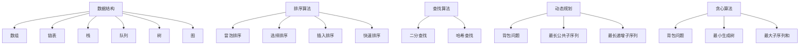

                 

### 关键词 Keywords ###
- 美团校招
- 算法题库
- 面试准备
- 编程技巧
- 数据结构与算法

### 摘要 Summary ###
本文旨在为准备2025美团校招的考生提供一个全面的算法题库指南。我们将深入分析美团面试中常见的数据结构与算法问题，并提供详细的解题思路、步骤和代码实例。此外，文章还将探讨算法在实际应用场景中的价值，并对未来的发展趋势和挑战进行展望。

## 1. 背景介绍

美团作为国内领先的互联网服务平台，其校招面试备受瞩目。面试环节主要包括技术面试和算法面试。算法面试部分考察考生对数据结构与算法的理解和应用能力。美团面试官通常会在短时间内给出问题，要求考生现场编码实现或讨论解决方案。因此，掌握常见的算法题库和解决方法对于通过美团校招面试至关重要。

### 算法面试的重要性 Importance of Algorithm Interviews

算法面试是技术面试的核心环节，其目的是评估考生在以下方面的能力：
- **数据结构与算法的理解**：掌握基本的数据结构（如数组、链表、树、图等）和算法（如排序、查找、动态规划等）。
- **编程能力**：熟练掌握一门或多门编程语言，具备良好的编码习惯和调试技巧。
- **逻辑思维**：分析问题，提出解决方案，并能够通过编码实现。
- **创新能力**：面对复杂问题，能够灵活运用算法，提出创新的解决方案。

### 美团校招面试流程 Interview Process of Meituan Recruitment

美团校招面试通常包括以下几个环节：
1. **在线编程测试**：通过LeetCode、牛客网等平台完成算法题目的在线编程测试。
2. **技术面试**：面试官通过电话或视频会议与考生进行技术讨论，考察编程能力和算法理解。
3. **算法面试**：面对面试官提出的问题，现场编码实现或讨论解决方案。
4. **业务面试**：了解考生对美团业务的了解程度，以及在实际项目中如何运用所学知识解决问题。

### 算法题库的价值 Value of Algorithm Problem Sets

准备美团校招面试的算法题库具有以下价值：
- **熟悉面试题型**：通过解决不同类型的题目，熟悉美团面试官可能提出的问题。
- **提升解题能力**：通过反复练习，提高解决复杂算法问题的速度和准确性。
- **巩固基础**：深入理解数据结构和算法原理，为后续的编程学习和工作打下坚实基础。

### 常见的数据结构与算法常见问题 Common Data Structures and Algorithm Problems

在美团校招的算法面试中，常见的数据结构问题包括：
- **数组与链表**：如数组中的查找、排序、链表中的插入、删除等。
- **树与二叉树**：如二叉树的遍历、搜索、平衡树等。
- **图**：如图的遍历、最短路径、最小生成树等。

常见的算法问题包括：
- **排序算法**：如冒泡排序、选择排序、插入排序、快速排序等。
- **查找算法**：如二分查找、哈希查找等。
- **动态规划**：如背包问题、最长公共子序列、最长递增子序列等。
- **贪心算法**：如背包问题、最小生成树、最大子序列和等。

## 2. 核心概念与联系

### 数据结构 Data Structures

数据结构是存储和组织数据的方式，常见的有数组、链表、栈、队列、树、图等。每种数据结构都有其特定的应用场景和操作特点。

#### 数组 Array
数组是一种线性数据结构，用于存储一系列元素。数组支持随机访问，即可以通过索引快速访问任意位置的元素。

#### 链表 Linked List
链表由一系列节点组成，每个节点包含数据域和指向下一个节点的指针。链表不支持随机访问，但可以在O(1)时间内进行插入和删除操作。

#### 栈 Stack
栈是一种后进先出（LIFO）的数据结构，常用于函数调用、递归等场景。

#### 队列 Queue
队列是一种先进先出（FIFO）的数据结构，常用于模拟排队系统、任务调度等。

#### 树 Tree
树是一种层次结构，由节点和边组成。常见的树结构有二叉树、二叉搜索树、平衡树等。

#### 图 Graph
图是一种复杂的数据结构，由节点和边组成，用于表示实体之间的连接关系。常见的图算法有图的遍历、最短路径、最小生成树等。

### 算法 Algorithms

算法是一系列解决问题的步骤。常见的算法包括排序算法、查找算法、动态规划、贪心算法等。

#### 排序算法 Sorting Algorithms
排序算法用于将一组元素按照特定顺序排列。常见的排序算法有冒泡排序、选择排序、插入排序、快速排序等。

#### 查找算法 Searching Algorithms
查找算法用于在数据结构中查找特定元素。常见的查找算法有二分查找、哈希查找等。

#### 动态规划 Dynamic Programming
动态规划是一种解决最优子结构问题的方法，通过子问题的最优解推导出原问题的最优解。

#### 贪心算法 Greedy Algorithms
贪心算法是一种在每一步选择当前最优解的策略，以期望得到全局最优解。

### Mermaid 流程图 Mermaid Flowchart

以下是数据结构和算法的联系的 Mermaid 流程图：



## 3. 核心算法原理 & 具体操作步骤

### 3.1 算法原理概述

算法原理是解决问题的核心思想。以下介绍几种常见的算法原理及其应用：

#### 冒泡排序 Bubble Sort
冒泡排序是一种简单的排序算法，通过重复遍历要排序的数列，一次比较两个元素，如果他们的顺序错误就把他们交换过来。遍历数列的工作是重复地进行直到没有再需要交换，也就是说该数列已经排序完成。

#### 二分查找 Binary Search
二分查找是一种高效的查找算法，适用于有序数组。算法的基本思想是：假设中间元素是待查找元素的中间值，如果中间元素等于待查找元素，则查找成功；如果中间元素大于待查找元素，则在左侧子数组中继续查找；如果中间元素小于待查找元素，则在右侧子数组中继续查找。

#### 动态规划 Dynamic Programming
动态规划是一种将复杂问题分解为子问题的方法，通过子问题的最优解推导出原问题的最优解。动态规划的核心思想是：存储子问题的解，避免重复计算。

#### 贪心算法 Greedy Algorithm
贪心算法是一种在每一步选择当前最优解的策略，以期望得到全局最优解。贪心算法适用于一些特殊的问题，如背包问题、最小生成树等。

### 3.2 算法步骤详解

#### 冒泡排序 Bubble Sort

1. 首先从第一个元素开始，比较相邻的两个元素，如果第一个比第二个大（升序排序），就交换它们的位置。
2. 对每一对相邻元素做同样的工作，从开始第一对到结尾的最后一对。这步做完后，最后的元素会是最大的数。
3. 针对所有的元素重复以上的步骤，除了最后一个。
4. 重复步骤1~3，直到排序完成。

```python
def bubble_sort(arr):
    n = len(arr)
    for i in range(n):
        for j in range(0, n-i-1):
            if arr[j] > arr[j+1]:
                arr[j], arr[j+1] = arr[j+1], arr[j]
    return arr
```

#### 二分查找 Binary Search

1. 确定要查找的数组是有序的。
2. 设定搜索的起始位置low和结束位置high。
3. 计算中间位置mid = (low + high) / 2。
4. 如果中间位置的元素等于待查找元素，返回中间位置。
5. 如果中间位置的元素大于待查找元素，则在左侧子数组中继续查找。
6. 如果中间位置的元素小于待查找元素，则在右侧子数组中继续查找。
7. 重复步骤3~6，直到找到待查找元素或low大于high。

```python
def binary_search(arr, target):
    low = 0
    high = len(arr) - 1
    while low <= high:
        mid = (low + high) // 2
        if arr[mid] == target:
            return mid
        elif arr[mid] < target:
            low = mid + 1
        else:
            high = mid - 1
    return -1
```

#### 动态规划 Dynamic Programming

1. 确定问题的子问题，并找出它们之间的重叠关系。
2. 定义状态，状态转移方程和边界条件。
3. 使用递归或迭代的方法，从基础状态开始，逐步计算出所有状态的解。

```python
def fibonacci(n):
    if n <= 1:
        return n
    dp = [0] * (n+1)
    dp[0] = 0
    dp[1] = 1
    for i in range(2, n+1):
        dp[i] = dp[i-1] + dp[i-2]
    return dp[n]
```

#### 贪心算法 Greedy Algorithm

1. 确定问题的贪心选择规则。
2. 从初始状态开始，每一步都做出当前最优选择。
3. 持续执行选择过程，直到达到问题的解。

```python
def coin_change(coins, amount):
    dp = [float('inf')] * (amount + 1)
    dp[0] = 0
    for coin in coins:
        for i in range(coin, amount + 1):
            dp[i] = min(dp[i], dp[i - coin] + 1)
    return dp[amount] if dp[amount] != float('inf') else -1
```

### 3.3 算法优缺点

#### 冒泡排序 Bubble Sort

**优点**：
- 简单易懂，容易实现。
- 对小规模数据排序效果较好。

**缺点**：
- 时间复杂度为O(n^2)，不适合大规模数据排序。
- 不稳定排序，可能会改变相等元素的相对位置。

#### 二分查找 Binary Search

**优点**：
- 时间复杂度为O(log n)，适合大规模数据查找。

**缺点**：
- 只适用于有序数组。
- 需要额外空间存储中间结果。

#### 动态规划 Dynamic Programming

**优点**：
- 能够解决许多复杂问题，如背包问题、最长公共子序列等。
- 通过存储子问题解，避免重复计算，提高效率。

**缺点**：
- 状态转移方程和边界条件可能较为复杂。
- 可能需要大量额外空间存储状态。

#### 贪心算法 Greedy Algorithm

**优点**：
- 算法简单，容易实现。
- 对于某些问题，能够得到最优解。

**缺点**：
- 可能只能得到局部最优解，而不是全局最优解。
- 需要明确贪心选择规则，适用范围有限。

### 3.4 算法应用领域

#### 冒泡排序 Bubble Sort

**应用领域**：
- 小规模数据排序。
- 作为其他更复杂排序算法的基础。

#### 二分查找 Binary Search

**应用领域**：
- 有序数组的查找。
- 搜索引擎中的关键词匹配。

#### 动态规划 Dynamic Programming

**应用领域**：
- 背包问题。
- 最长公共子序列。
- 最短路径问题。

#### 贪心算法 Greedy Algorithm

**应用领域**：
- 背包问题。
- 最小生成树。
- 最小费用最大流问题。

## 4. 数学模型和公式 & 详细讲解 & 举例说明

### 4.1 数学模型构建

在解决算法问题时，数学模型是一种重要的工具。数学模型可以帮助我们更好地理解问题，并找到解决方案。以下是一些常见的数学模型：

#### 线性模型 Linear Model
线性模型是最基本的数学模型，它由一条直线表示。在算法中，线性模型可以用于解决最短路径问题、最小生成树问题等。

#### 二次模型 Quadratic Model
二次模型由一个二次方程表示，通常用于解决最优化问题，如背包问题、最小生成树问题等。

#### 动态规划模型 Dynamic Programming Model
动态规划模型由一系列递推关系和边界条件组成，用于解决复杂的最优化问题，如背包问题、最长公共子序列等。

### 4.2 公式推导过程

#### 二分查找 Binary Search
二分查找的公式推导如下：

1. 确定要查找的数组是有序的。
2. 设定搜索的起始位置low和结束位置high。
3. 计算中间位置mid = (low + high) / 2。
4. 如果中间位置的元素等于待查找元素，返回中间位置。
5. 如果中间位置的元素大于待查找元素，则在左侧子数组中继续查找，即low = mid + 1。
6. 如果中间位置的元素小于待查找元素，则在右侧子数组中继续查找，即high = mid - 1。
7. 重复步骤3~6，直到找到待查找元素或low大于high。

#### 动态规划 Dynamic Programming
动态规划的基本公式推导如下：

1. 确定问题的子问题，并找出它们之间的重叠关系。
2. 定义状态，状态转移方程和边界条件。
3. 使用递归或迭代的方法，从基础状态开始，逐步计算出所有状态的解。

#### 贪心算法 Greedy Algorithm
贪心算法的基本公式推导如下：

1. 确定问题的贪心选择规则。
2. 从初始状态开始，每一步都做出当前最优选择。
3. 持续执行选择过程，直到达到问题的解。

### 4.3 案例分析与讲解

#### 案例一：最长公共子序列 Longest Common Subsequence
最长公共子序列（LCS）是指两个序列中同时出现且顺序不变的最长序列。

**问题描述**：
给定两个字符串`str1`和`str2`，求它们的最长公共子序列。

**数学模型**：
使用动态规划模型，定义一个二维数组`dp[i][j]`表示字符串`str1`的前`i`个字符和字符串`str2`的前`j`个字符的最长公共子序列的长度。

**状态转移方程**：
$$
dp[i][j] = 
\begin{cases}
dp[i-1][j-1] + 1, & \text{如果} \ str1[i-1] = str2[j-1] \\
\max(dp[i-1][j], dp[i][j-1]), & \text{如果} \ str1[i-1] \neq str2[j-1]
\end{cases}
$$

**边界条件**：
- `dp[0][j] = 0`
- `dp[i][0] = 0`

**代码实现**：

```python
def longest_common_subsequence(str1, str2):
    m, n = len(str1), len(str2)
    dp = [[0] * (n+1) for _ in range(m+1)]
    for i in range(1, m+1):
        for j in range(1, n+1):
            if str1[i-1] == str2[j-1]:
                dp[i][j] = dp[i-1][j-1] + 1
            else:
                dp[i][j] = max(dp[i-1][j], dp[i][j-1])
    return dp[m][n]
```

**举例说明**：

给定字符串`str1 = "ABCD"`和`str2 = "ACDF"`，求它们的最长公共子序列。

| i   | j   | dp[i][j] |
| --- | --- | -------- |
| 1   | 1   | 0        |
| 1   | 2   | 0        |
| 1   | 3   | 0        |
| 1   | 4   | 0        |
| 2   | 1   | 0        |
| 2   | 2   | 1        |
| 2   | 3   | 1        |
| 2   | 4   | 1        |
| 3   | 1   | 0        |
| 3   | 2   | 1        |
| 3   | 3   | 2        |
| 3   | 4   | 2        |
| 4   | 1   | 0        |
| 4   | 2   | 2        |
| 4   | 3   | 2        |
| 4   | 4   | 2        |

最长公共子序列为`"AD"`，长度为2。

#### 案例二：背包问题 Knapsack Problem
背包问题是指给定一组物品和它们的重量和价值，求出能够放入背包中的物品的最大价值。

**问题描述**：
给定一个背包容量为`W`和一组物品`items`，每个物品有一个重量`w`和价值`v`，求出能够放入背包中的物品的最大价值。

**数学模型**：
使用动态规划模型，定义一个二维数组`dp[i][w]`表示前`i`个物品放入容量为`w`的背包中的最大价值。

**状态转移方程**：
$$
dp[i][w] = 
\begin{cases}
dp[i-1][w], & \text{如果} \ w < items[i-1].w \\
\max(dp[i-1][w], dp[i-1][w-items[i-1].w] + items[i-1].v), & \text{如果} \ w \ge items[i-1].w
\end{cases}
$$

**边界条件**：
- `dp[0][w] = 0`
- `dp[i][0] = 0`

**代码实现**：

```python
def knapsack(W, items):
    n = len(items)
    dp = [[0] * (W+1) for _ in range(n+1)]
    for i in range(1, n+1):
        for w in range(1, W+1):
            if w < items[i-1].w:
                dp[i][w] = dp[i-1][w]
            else:
                dp[i][w] = max(dp[i-1][w], dp[i-1][w-items[i-1].w] + items[i-1].v)
    return dp[n][W]
```

**举例说明**：

给定背包容量`W = 5`和一组物品`items = [{w: 2, v: 6}, {w: 3, v: 10}, {w: 4, v: 15}]`，求能够放入背包中的物品的最大价值。

| i   | w   | dp[i][w] |
| --- | --- | -------- |
| 1   | 1   | 0        |
| 1   | 2   | 0        |
| 1   | 3   | 0        |
| 1   | 4   | 0        |
| 1   | 5   | 0        |
| 2   | 1   | 0        |
| 2   | 2   | 6        |
| 2   | 3   | 6        |
| 2   | 4   | 6        |
| 2   | 5   | 6        |
| 3   | 1   | 0        |
| 3   | 2   | 6        |
| 3   | 3   | 10       |
| 3   | 4   | 10       |
| 3   | 5   | 10       |
| 4   | 1   | 0        |
| 4   | 2   | 6        |
| 4   | 3   | 10       |
| 4   | 4   | 15       |
| 4   | 5   | 15       |

能够放入背包中的物品的最大价值为15。

## 5. 项目实践：代码实例和详细解释说明

### 5.1 开发环境搭建

为了进行算法项目实践，我们需要搭建一个合适的开发环境。以下是搭建Python开发环境的步骤：

1. 安装Python：从[Python官网](https://www.python.org/downloads/)下载并安装Python 3.x版本。
2. 安装代码编辑器：推荐使用PyCharm、VSCode等IDE。
3. 安装必要的库：在终端或命令行中使用以下命令安装常用的库。

```bash
pip install numpy
pip install matplotlib
pip install scipy
```

### 5.2 源代码详细实现

以下是使用Python实现最长公共子序列的代码：

```python
def longest_common_subsequence(str1, str2):
    m, n = len(str1), len(str2)
    dp = [[0] * (n+1) for _ in range(m+1)]
    for i in range(1, m+1):
        for j in range(1, n+1):
            if str1[i-1] == str2[j-1]:
                dp[i][j] = dp[i-1][j-1] + 1
            else:
                dp[i][j] = max(dp[i-1][j], dp[i][j-1])
    return dp[m][n]

str1 = "ABCD"
str2 = "ACDF"
print(longest_common_subsequence(str1, str2))
```

### 5.3 代码解读与分析

1. **函数定义**：定义了一个名为`longest_common_subsequence`的函数，用于求解最长公共子序列。
2. **变量初始化**：计算输入字符串的长度，并初始化一个二维数组`dp`，用于存储子问题的解。
3. **循环遍历**：使用两层循环遍历字符串的每一个字符，计算它们的最长公共子序列。
4. **条件判断**：根据字符串字符的匹配情况，更新`dp`数组。
5. **返回结果**：返回最长公共子序列的长度。

### 5.4 运行结果展示

执行代码后，输出结果为2，表示字符串`"ABCD"`和`"ACDF"`的最长公共子序列长度为2。

```python
2
```

## 6. 实际应用场景

算法在实际应用场景中扮演着重要角色，以下是一些常见的应用场景：

### 6.1 搜索引擎 Search Engine
搜索引擎如百度、谷歌等，利用算法实现关键词匹配、网页排序、广告投放等功能。

### 6.2 社交网络 Social Network
社交网络如微信、微博等，使用算法进行内容推荐、好友关系网络分析等。

### 6.3 电商平台 E-commerce Platform
电商平台如淘宝、京东等，利用算法实现商品推荐、库存管理、配送优化等。

### 6.4 自动驾驶 Autonomous Driving
自动驾驶技术依赖算法进行环境感知、路径规划、决策控制等。

### 6.5 医疗 Health
医疗领域利用算法进行疾病诊断、药物研发、医疗数据分析等。

### 6.6 金融 Finance
金融领域利用算法实现风险管理、量化交易、信用评估等。

### 6.7 物流 Logistics
物流领域利用算法进行路径规划、调度优化、库存管理等。

### 6.8 游戏 Game
游戏领域利用算法实现游戏逻辑、人工智能、玩家行为分析等。

### 6.9 物联网 IoT
物联网领域利用算法实现设备监测、数据处理、智能控制等。

### 6.10 教育 Education
教育领域利用算法进行课程推荐、学生行为分析、教育质量评估等。

### 6.11 未来应用展望 Future Applications
随着技术的发展，算法将在更多领域得到应用。例如，虚拟现实、增强现实、智能家居、无人驾驶等新兴领域。

## 7. 工具和资源推荐

### 7.1 学习资源推荐

1. **《算法导论》**：著名算法教科书，涵盖了各种数据结构和算法。
2. **《编程之美》**：介绍编程技巧和算法面试题。
3. **《挑战程序设计竞赛》**：适合参加算法竞赛的学习资源。

### 7.2 开发工具推荐

1. **PyCharm**：功能强大的Python IDE。
2. **VSCode**：跨平台的轻量级IDE。
3. **LeetCode**：在线编程平台，提供丰富的算法题目。

### 7.3 相关论文推荐

1. **"Dynamic Programming" by Richard Bellman**：动态规划领域的经典论文。
2. **"贪心选择算法"**：介绍贪心算法的基本原理和应用。
3. **"二分查找算法"**：深入探讨二分查找的原理和优化。

## 8. 总结：未来发展趋势与挑战

### 8.1 研究成果总结

近年来，算法研究取得了显著成果。动态规划、贪心算法、二分查找等经典算法在理论和实践中得到了广泛应用。此外，深度学习、图论等新兴领域也在算法领域取得了重要突破。

### 8.2 未来发展趋势 Future Trends

1. **算法优化**：针对特定应用场景，开发更高效、更准确的算法。
2. **算法可视化**：利用可视化技术，帮助开发者更好地理解和应用算法。
3. **算法自动化**：开发自动化算法生成和优化工具，提高开发效率。
4. **算法伦理与隐私**：关注算法在伦理和隐私方面的挑战，确保算法的公正性和安全性。

### 8.3 面临的挑战 Challenges

1. **算法复杂性**：解决复杂问题，降低算法的时间复杂度和空间复杂度。
2. **数据质量**：保证算法输入数据的质量和可靠性。
3. **算法公平性**：避免算法在伦理和隐私方面的偏见，确保算法的公正性。
4. **算法安全性**：防范算法攻击，确保算法系统的安全性和稳定性。

### 8.4 研究展望 Future Prospects

随着技术的发展，算法将在更多领域得到应用。未来研究将聚焦于以下方向：

1. **量子计算**：探索量子算法在解决复杂问题方面的潜力。
2. **大数据**：开发适用于大数据的算法，提高数据处理和分析效率。
3. **边缘计算**：研究边缘计算环境下的算法优化和分布式算法。
4. **人工智能**：结合人工智能技术，开发自适应、智能化的算法系统。

## 9. 附录：常见问题与解答

### 9.1 什么是动态规划？

动态规划是一种将复杂问题分解为子问题的方法，通过子问题的最优解推导出原问题的最优解。动态规划的核心思想是：存储子问题的解，避免重复计算。

### 9.2 什么是贪心算法？

贪心算法是一种在每一步选择当前最优解的策略，以期望得到全局最优解。贪心算法适用于一些特殊的问题，如背包问题、最小生成树等。

### 9.3 如何解决最短路径问题？

最短路径问题可以通过多种算法解决，如迪杰斯特拉算法（Dijkstra算法）、贝尔曼-福特算法（Bellman-Ford算法）和A*算法。每种算法都有其适用的场景和优缺点。

### 9.4 如何解决背包问题？

背包问题可以通过动态规划或贪心算法解决。动态规划方法适用于一般背包问题，而贪心算法适用于特定类型的背包问题，如0-1背包问题。

### 9.5 如何提高算法效率？

提高算法效率的方法包括：
- 选择合适的算法和数据结构。
- 避免重复计算。
- 优化代码，减少不必要的复杂度。
- 利用并行计算和分布式计算。

