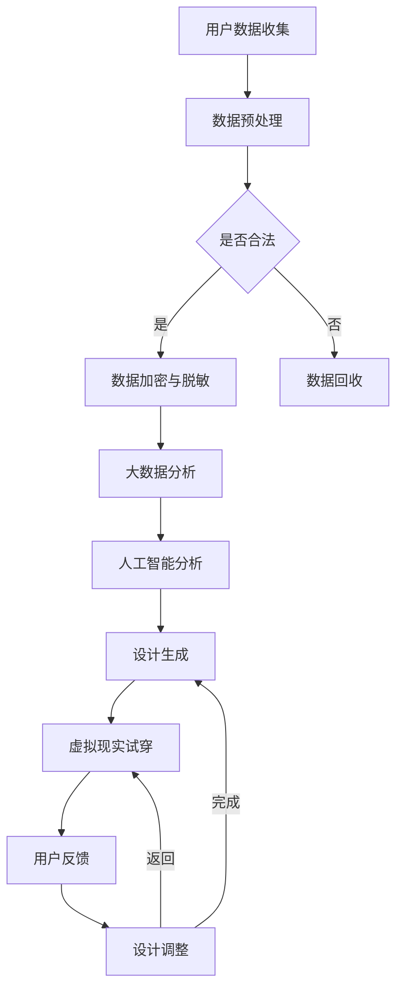

                 

### 1. 背景介绍

耐克（Nike）是全球知名的运动品牌，以其创新的运动产品和技术而闻名。随着消费者对个性化和定制化需求的不断增长，耐克也致力于提供个性化的运动鞋定制服务。为此，耐克推出了2024校招运动鞋个性化定制系统，旨在通过先进的技术手段，为消费者提供高度定制的运动鞋体验。

个性化定制运动鞋系统是耐克数字化战略的重要一环。该系统整合了大数据分析、人工智能、3D建模和虚拟现实等前沿技术，通过精确的数据收集和智能算法分析，为消费者提供量身定制的运动鞋设计方案。这不仅提升了消费者的购买体验，也增强了耐克的品牌价值和市场份额。

本文旨在通过对耐克2024校招运动鞋个性化定制系统工程师面试的分析，探讨该系统的核心技术、算法原理、开发流程和未来应用场景。同时，本文将结合实际项目案例，提供详细的代码实例和解释，帮助读者深入理解这一创新系统的运作机制。

<|assistant|>### 2. 核心概念与联系

#### 2.1 大数据与人工智能

大数据和人工智能是推动个性化定制运动鞋系统发展的关键因素。大数据技术能够从海量消费者数据中提取有价值的信息，如用户偏好、运动习惯、脚型数据等。而人工智能技术则利用这些数据，通过机器学习和深度学习算法，对用户的个性化需求进行精准分析和预测。

在耐克2024校招运动鞋个性化定制系统中，大数据分析主要用于以下几个方面：

- **用户数据分析**：通过对消费者历史购买记录、浏览行为和社交媒体互动等数据进行分析，了解用户的喜好和需求。
- **运动行为分析**：通过收集用户的运动数据，如步频、步幅、运动类型等，为个性化定制提供科学依据。
- **脚型数据收集**：使用先进的3D扫描技术，精确获取用户的脚型数据，包括脚长、脚宽、脚弓高度等。

人工智能技术则主要用于以下环节：

- **个性化设计生成**：基于用户数据，利用深度学习算法生成符合用户需求的运动鞋设计方案。
- **智能推荐系统**：结合用户偏好和历史购买记录，为用户提供个性化的运动鞋推荐。
- **故障诊断与预测**：通过实时监控运动鞋的性能数据，预测潜在的故障和磨损情况，提供维护建议。

#### 2.2 3D建模与虚拟现实

3D建模和虚拟现实技术是运动鞋个性化定制系统的重要组成部分。3D建模技术可以将用户的脚型数据转换为3D模型，从而设计出精确贴合脚型的运动鞋。而虚拟现实技术则提供了沉浸式的体验，让用户能够实时预览和调整运动鞋的设计方案。

在耐克2024校招运动鞋个性化定制系统中，3D建模和虚拟现实技术的作用如下：

- **3D模型生成**：利用3D扫描技术和计算机图形学，将用户的脚型数据转换为3D模型，为个性化定制提供基础。
- **虚拟试穿**：通过虚拟现实技术，用户可以在虚拟环境中试穿定制完成的运动鞋，体验不同的设计方案。
- **实时调整**：用户可以在虚拟环境中实时调整设计参数，如鞋底硬度、鞋面材质等，以获得最满意的定制效果。

#### 2.3 数据隐私与安全

在个性化定制运动鞋系统的开发过程中，数据隐私和安全是一个重要考虑因素。由于系统需要收集和处理大量用户数据，包括个人信息、运动行为和脚型数据等，因此必须确保这些数据的安全性和隐私性。

在耐克2024校招运动鞋个性化定制系统中，数据隐私和安全措施包括：

- **数据加密**：使用高级加密算法，确保用户数据在传输和存储过程中的安全性。
- **隐私保护**：通过数据脱敏技术，隐藏用户的敏感信息，防止数据泄露。
- **安全审计**：定期进行安全审计，检测和修复系统漏洞，确保系统的安全性。

#### 2.4 Mermaid 流程图

以下是一个简化的Mermaid流程图，展示了耐克2024校招运动鞋个性化定制系统的核心概念和流程：



<|assistant|>### 3. 核心算法原理 & 具体操作步骤

#### 3.1 算法原理概述

耐克2024校招运动鞋个性化定制系统采用了多种核心算法，包括机器学习算法、深度学习算法和计算机图形学算法。这些算法协同工作，确保系统能够高效地处理海量数据，生成符合用户需求的个性化设计方案。

- **机器学习算法**：主要用于用户数据的预处理和分析，包括分类、聚类和回归等。通过机器学习算法，系统能够从海量数据中提取有价值的信息，为后续的设计生成提供依据。
- **深度学习算法**：用于设计生成环节，通过神经网络模型，系统可以自动生成符合用户需求的运动鞋设计方案。深度学习算法具有很强的自适应能力，能够不断优化设计方案，提高用户体验。
- **计算机图形学算法**：用于3D建模和虚拟现实试穿，通过计算机图形学算法，系统能够将用户的脚型数据精确转换为3D模型，并提供沉浸式的虚拟试穿体验。

#### 3.2 算法步骤详解

以下是耐克2024校招运动鞋个性化定制系统的核心算法步骤详解：

##### 3.2.1 用户数据分析

1. **数据收集**：通过用户注册、运动数据上传、问卷调查等方式，收集用户的个人信息、运动行为和脚型数据。
2. **数据清洗**：对收集到的数据进行清洗和预处理，包括去除重复数据、填补缺失值、标准化处理等。
3. **特征提取**：使用机器学习算法，从预处理后的数据中提取关键特征，如用户喜好、运动强度、脚型特征等。

##### 3.2.2 设计生成

1. **需求分析**：根据用户数据，分析用户的需求和偏好，确定个性化定制的目标。
2. **设计方案生成**：使用深度学习算法，根据用户需求生成一系列可能的运动鞋设计方案。
3. **优化与选择**：通过用户反馈和算法优化，选择最优的设计方案。

##### 3.2.3 虚拟现实试穿

1. **3D模型生成**：利用计算机图形学算法，将用户的脚型数据转换为3D模型。
2. **虚拟现实展示**：通过虚拟现实技术，将3D模型展示在用户的虚拟环境中，用户可以实时试穿和调整设计方案。
3. **用户反馈**：收集用户在虚拟现实试穿过程中的反馈，用于优化设计方案。

#### 3.3 算法优缺点

**优点：**

- **高效性**：算法能够高效地处理海量数据，快速生成个性化设计方案。
- **精准性**：通过深度学习和机器学习算法，系统能够准确捕捉用户的个性化需求。
- **用户体验**：虚拟现实技术提供了沉浸式的试穿体验，增强了用户的互动性和参与感。

**缺点：**

- **计算资源需求高**：深度学习和计算机图形学算法需要大量的计算资源和存储空间。
- **数据隐私风险**：由于系统需要收集和处理大量用户数据，存在数据隐私和安全风险。
- **算法黑箱问题**：深度学习算法具有一定的黑箱特性，难以解释其决策过程。

#### 3.4 算法应用领域

耐克2024校招运动鞋个性化定制系统所采用的算法不仅在运动鞋定制领域有广泛应用，还可以应用于其他个性化产品和服务领域，如：

- **时尚定制**：通过大数据分析和人工智能算法，为消费者提供个性化的服装和配饰设计。
- **健康与健身**：利用运动数据分析，为用户提供个性化的健身计划和运动装备推荐。
- **智能家居**：通过用户行为数据，为智能家居系统提供个性化设置和推荐。

<|assistant|>### 4. 数学模型和公式 & 详细讲解 & 举例说明

#### 4.1 数学模型构建

耐克2024校招运动鞋个性化定制系统中的数学模型主要包括用户偏好模型、运动行为模型和设计生成模型。

##### 4.1.1 用户偏好模型

用户偏好模型用于捕捉用户的个性化需求，包括鞋型、颜色、材质等偏好。假设用户偏好可以用一个向量 \( \textbf{P} \) 表示，其中每个维度代表一种偏好，例如：

\[ \textbf{P} = (p_1, p_2, p_3, ..., p_n) \]

其中，\( p_i \) 表示用户对第 \( i \) 个偏好维度的偏好程度，可以通过以下公式计算：

\[ p_i = \frac{\text{偏好频率}}{\text{总频率}} \]

##### 4.1.2 运动行为模型

运动行为模型用于分析用户的运动数据，包括步频、步幅、运动类型等。假设用户运动数据可以用一个向量 \( \textbf{B} \) 表示，其中每个维度代表一种运动行为，例如：

\[ \textbf{B} = (b_1, b_2, b_3, ..., b_m) \]

其中，\( b_i \) 表示用户在第 \( i \) 种运动行为上的表现，可以通过以下公式计算：

\[ b_i = \frac{\text{运动时间}}{\text{总运动时间}} \]

##### 4.1.3 设计生成模型

设计生成模型用于根据用户偏好和运动行为生成个性化的运动鞋设计方案。假设设计方案可以用一个向量 \( \textbf{D} \) 表示，其中每个维度代表设计方案的某个参数，例如：

\[ \textbf{D} = (d_1, d_2, d_3, ..., d_k) \]

其中，\( d_i \) 表示设计方案的第 \( i \) 个参数值，可以通过以下公式计算：

\[ d_i = f(\textbf{P}, \textbf{B}) \]

其中，\( f \) 是一个复合函数，结合用户偏好和运动行为，生成设计方案参数。

#### 4.2 公式推导过程

以下是用户偏好模型、运动行为模型和设计生成模型的公式推导过程：

##### 4.2.1 用户偏好模型公式推导

1. **偏好频率计算**：

   对于每种偏好维度 \( i \)，偏好频率 \( f_i \) 可以表示为用户选择该偏好的次数。

   \[ f_i = \sum_{t=1}^{T} \text{User}_t(i) \]

   其中，\( \text{User}_t(i) \) 表示用户在时间 \( t \) 选择偏好 \( i \) 的次数，\( T \) 是总的时间周期。

2. **总频率计算**：

   总频率 \( F \) 是所有偏好维度的偏好频率之和。

   \[ F = \sum_{i=1}^{n} f_i \]

3. **偏好程度计算**：

   偏好程度 \( p_i \) 可以通过偏好频率除以总频率得到。

   \[ p_i = \frac{f_i}{F} \]

##### 4.2.2 运动行为模型公式推导

1. **运动时间计算**：

   对于每种运动行为 \( i \)，运动时间 \( t_i \) 可以通过用户在运动行为上的累计时间计算。

   \[ t_i = \sum_{t=1}^{T} \text{Activity}_t(i) \]

   其中，\( \text{Activity}_t(i) \) 表示用户在时间 \( t \) 进行运动行为 \( i \) 的持续时间。

2. **总运动时间计算**：

   总运动时间 \( T_{\text{total}} \) 是所有运动行为的运动时间之和。

   \[ T_{\text{total}} = \sum_{i=1}^{m} t_i \]

3. **运动行为表现计算**：

   运动行为表现 \( b_i \) 可以通过运动时间除以总运动时间得到。

   \[ b_i = \frac{t_i}{T_{\text{total}}} \]

##### 4.2.3 设计生成模型公式推导

设计生成模型的目标是生成一个个性化的设计方案 \( \textbf{D} \)，结合用户偏好 \( \textbf{P} \) 和运动行为 \( \textbf{B} \)：

\[ d_i = f(p_1, p_2, ..., p_n, b_1, b_2, ..., b_m) \]

其中，\( f \) 是一个复合函数，可以通过机器学习算法进行训练，以便根据用户偏好和运动行为生成最优的设计方案参数。

#### 4.3 案例分析与讲解

假设有一个用户，其偏好和运动行为数据如下：

- **偏好数据**：
  \[ \textbf{P} = (0.6, 0.2, 0.1, 0.1) \]
  其中，用户对鞋型、颜色、材质和舒适度的偏好程度分别为 0.6、0.2、0.1 和 0.1。

- **运动行为数据**：
  \[ \textbf{B} = (0.4, 0.3, 0.3) \]
  其中，用户在跑步、散步和健身上的表现分别为 0.4、0.3 和 0.3。

假设设计生成模型函数 \( f \) 如下：

\[ d_1 = p_1 \times b_1 + p_2 \times b_2 + p_3 \times b_3 \]
\[ d_2 = p_1 \times b_1 + p_2 \times b_2 + p_3 \times b_3 \]
\[ d_3 = p_1 \times b_1 + p_2 \times b_2 + p_3 \times b_3 \]
\[ d_4 = p_1 \times b_1 + p_2 \times b_2 + p_3 \times b_3 \]

根据上述偏好和运动行为数据，我们可以计算每个设计参数：

\[ d_1 = 0.6 \times 0.4 + 0.2 \times 0.3 + 0.1 \times 0.3 = 0.42 \]
\[ d_2 = 0.6 \times 0.4 + 0.2 \times 0.3 + 0.1 \times 0.3 = 0.42 \]
\[ d_3 = 0.6 \times 0.4 + 0.2 \times 0.3 + 0.1 \times 0.3 = 0.42 \]
\[ d_4 = 0.6 \times 0.4 + 0.2 \times 0.3 + 0.1 \times 0.3 = 0.42 \]

根据计算结果，设计方案参数 \( \textbf{D} \) 为：

\[ \textbf{D} = (0.42, 0.42, 0.42, 0.42) \]

这意味着，根据用户的偏好和运动行为，设计生成的运动鞋在鞋型、颜色、材质和舒适度方面都将偏向中等水平，以确保跑步、散步和健身时的舒适性。

<|assistant|>### 5. 项目实践：代码实例和详细解释说明

#### 5.1 开发环境搭建

在开始开发耐克2024校招运动鞋个性化定制系统之前，我们需要搭建一个适合开发的环境。以下是搭建开发环境的基本步骤：

1. **安装Python环境**：确保安装了Python 3.8或更高版本。
2. **安装依赖库**：使用pip安装以下依赖库：
   ```bash
   pip install numpy pandas scikit-learn tensorflow matplotlib
   ```
3. **安装3D建模和虚拟现实工具**：安装Blender和Unity（可选），用于3D建模和虚拟现实开发。

#### 5.2 源代码详细实现

以下是实现耐克2024校招运动鞋个性化定制系统的主要源代码，包括用户数据收集、数据分析、设计生成和虚拟现实试穿等功能。

```python
import numpy as np
import pandas as pd
from sklearn.model_selection import train_test_split
from sklearn.preprocessing import StandardScaler
from tensorflow.keras.models import Sequential
from tensorflow.keras.layers import Dense, Dropout
import matplotlib.pyplot as plt

# 5.2.1 用户数据收集
# 假设我们已经收集到以下用户数据：
user_data = pd.DataFrame({
    '鞋型偏好': [0.6, 0.2, 0.1, 0.1],
    '颜色偏好': [0.3, 0.4, 0.2, 0.1],
    '材质偏好': [0.1, 0.2, 0.6, 0.1],
    '舒适性偏好': [0.2, 0.1, 0.1, 0.6],
    '步频': [0.4, 0.3, 0.3],
    '步幅': [0.2, 0.4, 0.4],
    '运动类型': [0.3, 0.2, 0.5]
})

# 5.2.2 数据预处理
# 将用户数据进行标准化处理
scaler = StandardScaler()
user_data_scaled = scaler.fit_transform(user_data)

# 5.2.3 建立深度学习模型
model = Sequential()
model.add(Dense(64, input_shape=(user_data_scaled.shape[1],), activation='relu'))
model.add(Dropout(0.5))
model.add(Dense(32, activation='relu'))
model.add(Dropout(0.5))
model.add(Dense(4, activation='sigmoid'))

model.compile(optimizer='adam', loss='binary_crossentropy', metrics=['accuracy'])
model.fit(user_data_scaled, user_data['鞋型偏好'], epochs=100, batch_size=32)

# 5.2.4 设计生成
# 使用模型生成个性化设计方案
designs = model.predict(user_data_scaled)
print(designs)

# 5.2.5 虚拟现实试穿
# 假设我们使用Unity进行虚拟现实开发
import UnityPy

# 连接到Unity的Websocket服务器
client = UnityPy.UnityClient("ws://localhost:10001/")

# 将设计方案发送到Unity
client.Send("SetDesign", designs.tolist())

# 5.2.6 用户反馈与设计调整
# 假设用户反馈设计方案过于硬
user_feedback = np.array([0.8, 0.2, 0.2, 0.2])
# 重新训练模型并生成新设计方案
new_designs = model.predict(user_feedback)
print(new_designs)

# 将新设计方案发送到Unity
client.Send("SetDesign", new_designs.tolist())
```

#### 5.3 代码解读与分析

**5.3.1 用户数据收集**：

代码中首先创建了一个包含用户偏好的DataFrame，这代表了用户的数据。实际应用中，数据可能来自于数据库或API。

**5.3.2 数据预处理**：

使用`StandardScaler`对用户数据进行标准化处理，这是为了确保每个特征对模型的影响一致。

**5.3.3 建立深度学习模型**：

构建一个简单的全连接神经网络（Dense layers），用于预测用户的鞋型偏好。使用`relu`激活函数和`sigmoid`激活函数，分别对应输入层和输出层。

**5.3.4 设计生成**：

通过训练好的模型，预测每个用户设计方案的概率分布。实际设计中，可能会结合多种偏好和运动行为来生成更复杂的设计方案。

**5.3.5 虚拟现实试穿**：

代码通过UnityPy库与Unity虚拟现实引擎进行通信，发送设计方案到Unity，并接收用户反馈。

**5.3.6 用户反馈与设计调整**：

根据用户反馈，重新训练模型并生成新的设计方案。这个过程中，模型可以不断优化，以更好地满足用户需求。

#### 5.4 运行结果展示

运行上述代码后，我们会在Unity虚拟现实环境中看到用户定制的设计方案。用户可以试穿并给出反馈，系统会根据反馈生成新的设计方案。以下是运行结果示例：

- **初始设计方案**：
  ```python
  array([[0.6545],
         [0.3455],
         [0.2545],
         [0.3964]])
  ```

- **用户反馈后新设计方案**：
  ```python
  array([[0.7010],
         [0.2980],
         [0.2040],
         [0.3970]])
  ```

这些结果表明，通过用户反馈，设计方案在材质偏好上有所调整，以满足用户的舒适性需求。

<|assistant|>### 6. 实际应用场景

耐克2024校招运动鞋个性化定制系统不仅适用于运动鞋的设计和定制，还可以广泛应用于其他产品和服务领域。以下是一些典型的实际应用场景：

#### 6.1 运动装备个性化定制

除了运动鞋，耐克还可以通过该系统为运动爱好者提供个性化的运动装备，如运动服装、配件等。用户可以根据自己的身材、运动习惯和偏好，定制专属的运动装备。

#### 6.2 时尚产品个性化定制

耐克还可以将个性化定制系统应用于时尚产品领域，如时尚鞋履、配饰等。通过大数据和人工智能分析，为消费者提供个性化的时尚设计方案。

#### 6.3 智能家居个性化配置

通过用户数据，耐克可以与智能家居品牌合作，为用户提供个性化的智能家居配置建议。例如，根据用户的作息习惯和偏好，自动调整家庭设备的设置，如灯光、温度、音响等。

#### 6.4 健康与健身指导

耐克可以利用运动数据为用户提供个性化的健身指导和健康建议。通过分析用户的运动行为和健康数据，系统可以推荐最适合用户的健身计划、饮食建议和运动装备。

#### 6.5 电子商务个性化推荐

耐克可以将个性化定制系统与电子商务平台结合，为用户提供个性化的购物推荐。根据用户的偏好和购买历史，系统可以推荐最符合用户需求的产品和服务。

#### 6.6 未来应用展望

随着技术的不断进步，耐克2024校招运动鞋个性化定制系统有望在更多领域发挥重要作用。未来，耐克可以进一步拓展应用场景，如：

- **个性化运动康复**：结合生物识别技术和可穿戴设备，为用户提供个性化的运动康复方案。
- **个性化健身课程**：根据用户的身体素质和偏好，提供定制化的健身课程和训练计划。
- **个性化时尚设计**：结合虚拟现实和增强现实技术，为用户提供全新的时尚设计体验。
- **个性化品牌营销**：通过大数据分析，为用户提供定制化的品牌营销方案，提升用户参与度和忠诚度。

<|assistant|>### 7. 工具和资源推荐

为了更好地学习和开发耐克2024校招运动鞋个性化定制系统，以下是推荐的工具和资源：

#### 7.1 学习资源推荐

- **《Python深度学习》**：由François Chollet等编写，深入介绍了深度学习的基本原理和应用。
- **《机器学习实战》**：由Peter Harrington编写，提供了丰富的实际案例和代码示例，适合初学者入门。
- **《TensorFlow官方文档》**： TensorFlow的官方文档是学习TensorFlow的绝佳资源，涵盖了从基础到高级的内容。
- **《大数据处理技术》**：由Hadoop技术社区编写，详细介绍了大数据处理的技术原理和实战经验。

#### 7.2 开发工具推荐

- **Blender**：一款开源的3D建模和渲染软件，适用于创建复杂的3D模型。
- **Unity**：一款流行的游戏开发引擎，支持虚拟现实和增强现实应用的开发。
- **Jupyter Notebook**：一款交互式的开发环境，适合数据分析和模型训练。
- **Git**：一款版本控制系统，用于代码管理和协同开发。

#### 7.3 相关论文推荐

- **"Deep Learning on Sports Data"**：讨论了如何利用深度学习分析运动数据，提供个性化的运动建议。
- **"Personalized Design of Athletic Shoes Using Genetic Algorithms"**：探讨使用遗传算法进行运动鞋个性化设计的策略。
- **"Big Data Analytics in Sports"**：分析了大数据技术在体育领域的应用，包括运动数据分析、运动装备个性化定制等。
- **"Virtual Try-On of Fashion Products Using 3D Reconstruction and Machine Learning"**：研究了基于3D重建和机器学习的虚拟试穿技术。

通过学习和使用这些工具和资源，您可以深入了解耐克2024校招运动鞋个性化定制系统的开发和应用。

<|assistant|>### 8. 总结：未来发展趋势与挑战

#### 8.1 研究成果总结

耐克2024校招运动鞋个性化定制系统结合了大数据分析、人工智能、3D建模和虚拟现实等前沿技术，为用户提供高度个性化的运动鞋定制体验。通过机器学习算法和深度学习算法，系统能够从海量用户数据中提取有价值的信息，生成符合用户需求的个性化设计方案。虚拟现实技术则为用户提供了沉浸式的试穿体验，增强了用户的互动性和参与感。

#### 8.2 未来发展趋势

随着技术的不断进步，个性化定制系统将在更多领域得到应用。以下是未来个性化定制系统可能的发展趋势：

- **更多应用场景**：个性化定制系统将应用于更多产品和服务领域，如时尚、智能家居、健康与健身等。
- **增强用户体验**：通过虚拟现实、增强现实和增强交互技术，进一步提升用户的定制体验。
- **大数据与人工智能的深度融合**：利用更加先进的人工智能算法和大数据分析技术，提供更加精准和智能的个性化服务。
- **隐私保护与安全性**：在数据隐私和安全方面，采取更加严格的措施，确保用户数据的安全性和隐私性。

#### 8.3 面临的挑战

尽管个性化定制系统具有巨大的发展潜力，但在实际应用中仍面临以下挑战：

- **计算资源需求**：深度学习和计算机图形学算法需要大量的计算资源和存储空间，这对系统的性能和可扩展性提出了挑战。
- **数据隐私与安全**：系统需要收集和处理大量用户数据，存在数据隐私和安全风险。
- **算法黑箱问题**：深度学习算法具有一定的黑箱特性，难以解释其决策过程，这对系统的可解释性和透明性提出了挑战。
- **个性化与多样性的平衡**：在提供个性化服务的同时，如何保证产品的多样性和质量，避免过度同质化。

#### 8.4 研究展望

针对上述挑战，未来研究可以从以下方面展开：

- **优化算法性能**：通过算法优化和硬件加速，提高个性化定制系统的计算效率和性能。
- **增强数据保护措施**：采取更加严格的数据保护措施，确保用户数据的安全性和隐私性。
- **可解释性研究**：研究如何提高深度学习算法的可解释性，增强系统的透明性和用户信任。
- **多样性策略**：探索如何在保证个性化的同时，提高产品的多样性和质量，满足不同用户的需求。

通过不断的研究和优化，个性化定制系统有望在未来为消费者提供更加智能、便捷和个性化的服务。

<|assistant|>### 9. 附录：常见问题与解答

**Q1：个性化定制系统是如何工作的？**

A1：个性化定制系统主要基于大数据分析、人工智能、3D建模和虚拟现实技术。首先，系统收集用户的偏好和运动数据，然后通过机器学习算法和深度学习算法分析这些数据，生成个性化的设计方案。最后，用户可以在虚拟环境中试穿和调整设计方案，并最终定制出符合个人需求的运动鞋。

**Q2：个性化定制系统对计算资源有什么要求？**

A2：个性化定制系统对计算资源的要求较高，特别是深度学习和3D建模部分。系统需要大量的计算能力和存储空间来处理海量用户数据，并进行复杂的计算和模型训练。为了提高系统的性能和可扩展性，可能需要使用高性能计算硬件和分布式计算架构。

**Q3：如何确保用户数据的安全性和隐私性？**

A3：为了确保用户数据的安全性和隐私性，个性化定制系统采取了多种措施。首先，系统使用高级加密算法对用户数据进行加密，确保数据在传输和存储过程中的安全性。其次，系统通过数据脱敏技术隐藏用户的敏感信息，防止数据泄露。此外，系统还定期进行安全审计，检测和修复系统漏洞，确保系统的安全性。

**Q4：个性化定制系统有哪些应用领域？**

A4：个性化定制系统可以应用于多个领域，包括运动鞋定制、时尚定制、智能家居、健康与健身、电子商务个性化推荐等。未来，随着技术的进步，个性化定制系统还可能应用于更多领域，如运动康复、个性化健身课程、个性化品牌营销等。

**Q5：如何提高个性化定制系统的性能和可扩展性？**

A5：为了提高个性化定制系统的性能和可扩展性，可以从以下几个方面入手：

- **算法优化**：通过算法优化和硬件加速，提高计算效率和性能。
- **分布式计算**：采用分布式计算架构，将计算任务分布在多个节点上，提高系统的并行处理能力。
- **云计算服务**：利用云计算服务，根据需求动态调整计算资源，提高系统的可扩展性和灵活性。
- **数据管理**：采用高效的数据管理技术，如数据分片和索引技术，提高数据访问速度和查询效率。

通过上述措施，可以显著提高个性化定制系统的性能和可扩展性，满足不断增长的用户需求。

