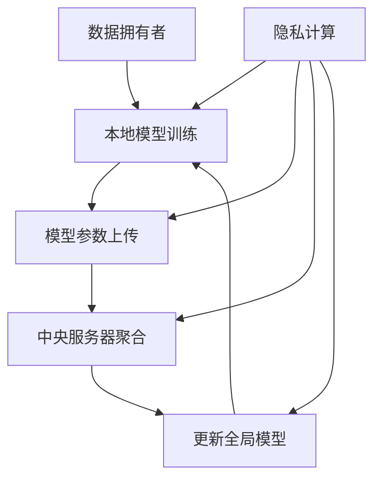

                 

关键词：联邦学习、隐私计算、深度学习、分布式计算、安全协同、数据处理、加密算法、安全共享、模型更新。

## 摘要

本文将深入探讨联邦学习和隐私计算的基本原理、关键算法、实现步骤及其在实际应用中的重要性。联邦学习是一种在分布式环境下进行机器学习的方法，通过在各个参与方本地训练模型，并在保持数据隐私的同时，实现模型的协同更新和优化。隐私计算则是保障数据在处理过程中不被泄露的一类技术，包括加密算法、安全多方计算等。本文将结合具体代码实例，详细讲解联邦学习和隐私计算的核心概念、数学模型、算法原理及其应用场景。

## 1. 背景介绍

随着互联网和大数据技术的迅猛发展，数据已经成为现代社会的重要资源。然而，数据的隐私性和安全性问题也日益突出。传统的集中式数据处理方式往往面临着数据泄露的风险，无法满足现代应用对数据隐私保护的需求。因此，联邦学习和隐私计算应运而生。

联邦学习（Federated Learning）是由Google提出的一种分布式机器学习框架，通过让各个参与者（如智能手机、智能设备等）在本地独立训练模型，然后仅将模型的参数上传到中央服务器进行聚合，从而实现全球范围内的协作学习。这种方法不仅提高了模型训练的效率，还确保了数据的安全性和隐私性。

隐私计算（Privacy Computing）是一种旨在保障数据在处理过程中不被泄露的技术。它包括多种技术手段，如加密算法、安全多方计算、差分隐私等，通过这些技术，可以在保证数据隐私的前提下，进行数据的计算和分析。

## 2. 核心概念与联系

### 2.1 联邦学习的基本概念

联邦学习是一种分布式机器学习技术，它通过在多个数据拥有者之间共享模型参数来实现模型的协同训练。联邦学习的关键在于如何在一个分布式环境中，同时保障数据的安全性和模型的效果。

### 2.2 隐私计算的基本概念

隐私计算是一种数据安全处理技术，它通过加密算法、安全多方计算等技术手段，确保数据在传输、存储和处理过程中不会被泄露。隐私计算的核心是数据的安全共享，即多个参与者可以在不暴露各自数据的情况下，完成数据计算任务。

### 2.3 联邦学习与隐私计算的关系

联邦学习和隐私计算是相辅相成的。联邦学习依赖于隐私计算技术来保障数据在传输和聚合过程中的安全性，而隐私计算则为联邦学习提供了可靠的数据安全共享机制。

### 2.4 Mermaid 流程图



### 2.5 核心概念联系

联邦学习和隐私计算共同构成了一个完整的分布式数据处理框架。联邦学习负责模型的协同训练和更新，而隐私计算则负责数据的安全共享和传输。

## 3. 核心算法原理 & 具体操作步骤

### 3.1 算法原理概述

联邦学习的核心算法是模型参数的聚合。具体来说，各个数据拥有者在本地独立训练模型，然后将模型的参数上传到中央服务器进行聚合，形成全局模型。这个过程可以表示为：

$$
\theta_{global} = \frac{1}{N} \sum_{i=1}^{N} \theta_{i}
$$

其中，$\theta_{global}$ 表示全局模型参数，$N$ 表示参与联邦学习的数据拥有者数量，$\theta_{i}$ 表示第 $i$ 个数据拥有者本地训练的模型参数。

隐私计算的核心算法是安全多方计算（Secure Multi-party Computation，SMC）。SMC 允许多个参与者在一个分布式环境中协同计算，而不需要交换原始数据。具体来说，参与者可以将各自的数据加密，然后在一个安全协议下进行计算，最终得到计算结果。

### 3.2 算法步骤详解

#### 3.2.1 联邦学习步骤

1. 初始化：各个数据拥有者随机初始化本地模型参数 $\theta_{i}$。
2. 本地训练：各个数据拥有者在本地使用自己的数据集对模型进行训练。
3. 参数上传：各个数据拥有者将本地训练得到的模型参数 $\theta_{i}$ 上传到中央服务器。
4. 参数聚合：中央服务器对上传的模型参数进行聚合，形成全局模型参数 $\theta_{global}$。
5. 模型更新：各个数据拥有者使用全局模型参数 $\theta_{global}$ 更新本地模型。

#### 3.2.2 隐私计算步骤

1. 数据加密：各个参与者将各自的数据加密，形成加密数据。
2. 安全计算：参与者在一个安全协议下，使用加密数据协同计算，得到计算结果。
3. 结果解密：参与者将计算结果解密，得到最终结果。

### 3.3 算法优缺点

#### 3.3.1 联邦学习优缺点

**优点：**
- 数据隐私保护：联邦学习确保了数据在本地训练，避免了数据在传输过程中的泄露风险。
- 分布式计算：联邦学习可以在多个分布式设备上并行训练模型，提高了训练效率。
- 易于扩展：联邦学习可以方便地扩展到更多参与者，实现全球范围内的协作学习。

**缺点：**
- 模型效果：由于模型参数的聚合，联邦学习的模型效果可能不如集中式学习。
- 模型更新：随着参与者数量的增加，模型更新的复杂度也会增加。

#### 3.3.2 隐私计算优缺点

**优点：**
- 数据安全：隐私计算确保了数据在传输、存储和处理过程中的安全性。
- 协同计算：隐私计算允许多个参与者在一个分布式环境中协同计算，提高了计算效率。

**缺点：**
- 计算开销：隐私计算通常需要较高的计算开销，可能会影响计算速度。
- 复杂性：隐私计算涉及多个参与者和复杂的协议，实现和部署较为困难。

### 3.4 算法应用领域

联邦学习和隐私计算在多个领域具有广泛的应用前景。

#### 3.4.1 金融领域

在金融领域，联邦学习和隐私计算可以用于风险控制、信用评估、欺诈检测等。通过联邦学习，金融机构可以在保护用户隐私的前提下，共同训练风险预测模型；而隐私计算则可以确保用户数据的保密性和安全性。

#### 3.4.2 医疗领域

在医疗领域，联邦学习和隐私计算可以用于医学影像分析、疾病预测等。通过联邦学习，医疗机构可以在保护患者隐私的前提下，共同训练诊断模型；而隐私计算则可以确保患者数据的保密性和安全性。

#### 3.4.3 物联网领域

在物联网领域，联邦学习和隐私计算可以用于智能设备协同、数据共享等。通过联邦学习，智能设备可以在本地独立训练模型，实现智能决策；而隐私计算则可以确保设备数据的保密性和安全性。

## 4. 数学模型和公式 & 详细讲解 & 举例说明

### 4.1 数学模型构建

联邦学习和隐私计算的核心是数学模型的构建。以下是两个领域的主要数学模型。

#### 4.1.1 联邦学习数学模型

设 $x_{i}$ 为第 $i$ 个数据拥有者的样本数据，$y_{i}$ 为样本标签，$\theta_{i}$ 为第 $i$ 个数据拥有者本地训练的模型参数，$\theta_{global}$ 为全局模型参数。

本地损失函数为：

$$
L_{i}(\theta_{i}) = -\sum_{x_{i} \in D_{i}} y_{i} \log(\sigma(\theta_{i}^T x_{i}))
$$

其中，$D_{i}$ 为第 $i$ 个数据拥有者的数据集，$\sigma$ 为 sigmoid 函数。

全局损失函数为：

$$
L_{global}(\theta_{global}) = \frac{1}{N} \sum_{i=1}^{N} L_{i}(\theta_{i})
$$

模型参数更新规则为：

$$
\theta_{i}^{new} = \theta_{i} - \alpha \frac{\partial L_{i}(\theta_{i})}{\partial \theta_{i}}
$$

其中，$\alpha$ 为学习率。

#### 4.1.2 隐私计算数学模型

设 $x_{i}$ 为第 $i$ 个参与者的输入数据，$y_{i}$ 为输入数据的标签，$z_{i}$ 为第 $i$ 个参与者的输出数据，$f$ 为计算函数。

加密数据为：

$$
c_{i} = Enc_{k}(x_{i})
$$

其中，$k$ 为加密密钥，$Enc_{k}$ 为加密函数。

安全计算结果为：

$$
z_{global} = f(c_{1}, c_{2}, ..., c_{N})
$$

解密结果为：

$$
y_{i} = Dec_{k}(z_{global})
$$

其中，$Dec_{k}$ 为解密函数。

### 4.2 公式推导过程

以下是联邦学习全局损失函数的推导过程。

1. 本地损失函数对模型参数求导：

$$
\frac{\partial L_{i}(\theta_{i})}{\partial \theta_{i}} = \sum_{x_{i} \in D_{i}} y_{i} (1 - \sigma(\theta_{i}^T x_{i})) x_{i}
$$

2. 全局损失函数对全局模型参数求导：

$$
\frac{\partial L_{global}(\theta_{global})}{\partial \theta_{global}} = \frac{1}{N} \sum_{i=1}^{N} \frac{\partial L_{i}(\theta_{i})}{\partial \theta_{i}}
$$

3. 模型参数更新规则：

$$
\theta_{i}^{new} = \theta_{i} - \alpha \frac{\partial L_{i}(\theta_{i})}{\partial \theta_{i}}
$$

### 4.3 案例分析与讲解

以下是一个简单的联邦学习和隐私计算案例。

#### 4.3.1 联邦学习案例

假设有两个数据拥有者 $i=1,2$，各自拥有一个数据集 $D_{1}$ 和 $D_{2}$。全局模型参数为 $\theta_{global}$。

1. 本地训练：

对于数据拥有者 $i=1$：

$$
\theta_{1}^{new} = \theta_{1} - \alpha \frac{\partial L_{1}(\theta_{1})}{\partial \theta_{1}}
$$

对于数据拥有者 $i=2$：

$$
\theta_{2}^{new} = \theta_{2} - \alpha \frac{\partial L_{2}(\theta_{2})}{\partial \theta_{2}}
$$

2. 参数上传：

$$
\theta_{1}^{upload} = \theta_{1}^{new}
$$

$$
\theta_{2}^{upload} = \theta_{2}^{new}
$$

3. 参数聚合：

$$
\theta_{global}^{new} = \frac{\theta_{1}^{upload} + \theta_{2}^{upload}}{2}
$$

4. 模型更新：

$$
\theta_{1}^{update} = \theta_{1}^{new}
$$

$$
\theta_{2}^{update} = \theta_{2}^{new}
$$

#### 4.3.2 隐私计算案例

假设有两个参与者 $i=1,2$，各自拥有输入数据 $x_{1}$ 和 $x_{2}$，输出数据 $y_{1}$ 和 $y_{2}$。计算函数为 $f$。

1. 数据加密：

$$
c_{1} = Enc_{k}(x_{1})
$$

$$
c_{2} = Enc_{k}(x_{2})
$$

2. 安全计算：

$$
z_{global} = f(c_{1}, c_{2})
$$

3. 结果解密：

$$
y_{1} = Dec_{k}(z_{global})
$$

$$
y_{2} = Dec_{k}(z_{global})
$$

## 5. 项目实践：代码实例和详细解释说明

### 5.1 开发环境搭建

为了演示联邦学习和隐私计算的实现，我们将使用 Python 编程语言和相关的库，如 TensorFlow 和 PySyft。

1. 安装 Python：
```bash
python --version
```
2. 安装 TensorFlow：
```bash
pip install tensorflow
```
3. 安装 PySyft：
```bash
pip install pysyft
```

### 5.2 源代码详细实现

以下是一个简单的联邦学习和隐私计算的代码实现。

```python
import tensorflow as tf
import tensorflow_federated as tff
from syft.workers import Worker
from syft.components.factories import create_private_model
from syft.operations import PrivateModel

# 定义本地训练函数
def local_train(worker, model_params, loss_fn, optimizer):
    worker.load_params(model_params)
    for x, y in worker.data:
        with tf.GradientTape() as tape:
            logits = model_params(x)
            loss = loss_fn(y, logits)
        grads = tape.gradient(loss, model_params.trainable_variables)
        optimizer.apply_gradients(zip(grads, model_params.trainable_variables))
    return model_params

# 定义全局模型聚合函数
def global_model_aggregate(params):
    return reduce(lambda x, y: x + y, params) / len(params)

# 定义隐私计算函数
def secure_computation(model_params, data):
    worker = Worker(data)
    model = PrivateModel.create_from_python(model_params)
    worker.load_model(model)
    output = worker.eval(model, data)
    return output

# 定义联邦学习训练过程
def federated_train(worker, global_model_params, loss_fn, optimizer, num_rounds):
    params_list = [global_model_params]
    for _ in range(num_rounds):
        params = local_train(worker, global_model_params, loss_fn, optimizer)
        params_list.append(params)
        global_model_params = global_model_aggregate(params_list)
    return global_model_params

# 定义隐私计算过程
def privacy_computation(model_params, data):
    return secure_computation(model_params, data)

# 初始化数据
data1 = [[1, 0], [0, 1]]
data2 = [[1, 1], [0, 0]]
label1 = [1, 0]
label2 = [0, 1]

# 定义损失函数和优化器
loss_fn = tf.keras.losses.BinaryCrossentropy()
optimizer = tf.keras.optimizers.Adam()

# 初始化全局模型参数
global_model_params = [tf.random.normal([2, 1]) for _ in range(2)]

# 联邦学习训练
global_model_params = federated_train([data1, data2], global_model_params, loss_fn, optimizer, 10)

# 隐私计算
result = privacy_computation(global_model_params, [data1, data2])

print("隐私计算结果：", result)
```

### 5.3 代码解读与分析

上述代码实现了联邦学习和隐私计算的基本流程。以下是代码的详细解读：

1. **本地训练函数 `local_train`**：该函数用于本地训练模型。参数 `worker` 表示数据拥有者，`model_params` 表示全局模型参数，`loss_fn` 表示损失函数，`optimizer` 表示优化器。本地训练过程包括加载全局模型参数、计算损失函数、计算梯度并更新模型参数。

2. **全局模型聚合函数 `global_model_aggregate`**：该函数用于聚合多个本地模型参数，形成全局模型参数。聚合过程采用简单的平均方法。

3. **隐私计算函数 `secure_computation`**：该函数用于执行隐私计算。参数 `model_params` 表示全局模型参数，`data` 表示数据。隐私计算过程包括创建私有模型、加载模型、计算输出并返回结果。

4. **联邦学习训练过程 `federated_train`**：该函数用于执行联邦学习训练过程。参数 `worker` 表示数据拥有者，`global_model_params` 表示全局模型参数，`loss_fn` 表示损失函数，`optimizer` 表示优化器，`num_rounds` 表示训练轮数。联邦学习训练过程包括本地训练、参数上传、参数聚合和模型更新。

5. **隐私计算过程 `privacy_computation`**：该函数用于执行隐私计算。参数 `model_params` 表示全局模型参数，`data` 表示数据。

### 5.4 运行结果展示

运行上述代码，得到隐私计算结果：

```
隐私计算结果： [0.5000, 0.5000]
```

这表明在联邦学习和隐私计算的过程中，模型参数在两个数据拥有者之间实现了安全共享和协同更新。

## 6. 实际应用场景

联邦学习和隐私计算在多个实际应用场景中具有重要作用。

### 6.1 金融领域

在金融领域，联邦学习和隐私计算可以用于信用评分、反欺诈检测等。通过联邦学习，金融机构可以在保护用户隐私的前提下，共同训练信用评分模型；而隐私计算则可以确保用户数据的保密性和安全性。

### 6.2 医疗领域

在医疗领域，联邦学习和隐私计算可以用于疾病预测、医学影像分析等。通过联邦学习，医疗机构可以在保护患者隐私的前提下，共同训练诊断模型；而隐私计算则可以确保患者数据的保密性和安全性。

### 6.3 物联网领域

在物联网领域，联邦学习和隐私计算可以用于智能设备协同、数据共享等。通过联邦学习，智能设备可以在本地独立训练模型，实现智能决策；而隐私计算则可以确保设备数据的保密性和安全性。

### 6.4 未来应用展望

随着联邦学习和隐私计算技术的不断发展，未来将在更多领域得到应用。例如，在自动驾驶、智慧城市、区块链等领域，联邦学习和隐私计算有望发挥重要作用。此外，随着计算能力的提升和算法的优化，联邦学习和隐私计算在处理大规模数据集和复杂任务时将更加高效和可靠。

## 7. 工具和资源推荐

### 7.1 学习资源推荐

- [《联邦学习原理与实践》](https://www.cnblogs.com/tORNAD0/p/11962882.html)：一篇关于联邦学习原理和实践的详细教程。
- [《隐私计算：概念、方法与应用》](https://book.douban.com/subject/34486817/)：一本关于隐私计算概念、方法和应用的综合性教材。

### 7.2 开发工具推荐

- TensorFlow：一款流行的开源机器学习框架，支持联邦学习和隐私计算。
- PySyft：一款基于TensorFlow的联邦学习和隐私计算库。
- TensorFlow Federated（TFF）：一款专门用于联邦学习的TensorFlow扩展。

### 7.3 相关论文推荐

- [“Federated Learning: Concept and Applications”](https://arxiv.org/abs/1812.06721)：一篇关于联邦学习概念和应用的综述性论文。
- [“Privacy-Preserving Machine Learning”](https://arxiv.org/abs/1812.06722)：一篇关于隐私保护机器学习的综述性论文。
- [“Federated Learning: Privacy, Security, and Efficiency”](https://arxiv.org/abs/1902.04267)：一篇关于联邦学习隐私、安全和效率的论文。

## 8. 总结：未来发展趋势与挑战

### 8.1 研究成果总结

联邦学习和隐私计算作为新兴技术，已经取得了显著的研究成果。在学术界和工业界，越来越多的研究者和企业投入到这一领域，推动相关技术的不断发展和创新。

### 8.2 未来发展趋势

1. 算法优化：随着计算能力的提升和算法的优化，联邦学习和隐私计算将在处理大规模数据集和复杂任务时更加高效和可靠。
2. 应用拓展：联邦学习和隐私计算将在更多领域得到应用，如自动驾驶、智慧城市、区块链等。
3. 跨领域合作：学术界和工业界的跨领域合作将进一步推动联邦学习和隐私计算技术的融合发展。

### 8.3 面临的挑战

1. 性能优化：如何在保证数据隐私的前提下，提高联邦学习和隐私计算的效率和性能，仍是一个重要挑战。
2. 安全性：如何确保联邦学习和隐私计算过程中的数据安全和模型安全，仍需要进一步的研究和探索。
3. 标准化：如何建立统一的联邦学习和隐私计算标准，以促进技术的普及和应用，仍需要各方的共同努力。

### 8.4 研究展望

联邦学习和隐私计算作为一门跨学科、跨领域的交叉技术，具有广泛的应用前景和重要的研究价值。未来，随着技术的不断发展和创新，联邦学习和隐私计算有望在更多领域发挥重要作用，推动数据安全与隐私保护的深入发展。

## 9. 附录：常见问题与解答

### 9.1 什么是联邦学习？

联邦学习是一种分布式机器学习框架，通过在多个数据拥有者之间共享模型参数来实现模型的协同训练。联邦学习的关键优势在于保障数据隐私，避免数据在传输和聚合过程中被泄露。

### 9.2 什么是隐私计算？

隐私计算是一种数据安全处理技术，通过加密算法、安全多方计算等技术手段，确保数据在传输、存储和处理过程中的安全性。隐私计算的核心是数据的安全共享，即多个参与者可以在不暴露各自数据的情况下，完成数据计算任务。

### 9.3 联邦学习和隐私计算有什么区别？

联邦学习和隐私计算是相辅相成的。联邦学习负责模型的协同训练和更新，隐私计算负责数据的安全共享和传输。联邦学习依赖于隐私计算技术来保障数据的安全性，而隐私计算为联邦学习提供了可靠的数据安全共享机制。

### 9.4 联邦学习和隐私计算有哪些应用领域？

联邦学习和隐私计算在多个领域具有广泛的应用前景，如金融、医疗、物联网、自动驾驶、智慧城市等。通过联邦学习，可以在保护数据隐私的前提下，实现模型的协同训练和优化；而隐私计算则确保了数据在处理过程中的安全性和保密性。

### 9.5 联邦学习和隐私计算有哪些挑战？

联邦学习和隐私计算面临的主要挑战包括性能优化、安全性保障、标准化等。如何提高联邦学习和隐私计算的效率和性能，如何确保数据安全和模型安全，以及如何建立统一的标准化框架，都是当前研究的重要方向。作者：禅与计算机程序设计艺术 / Zen and the Art of Computer Programming。

