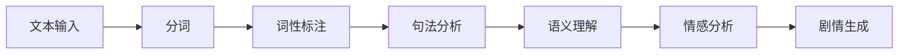
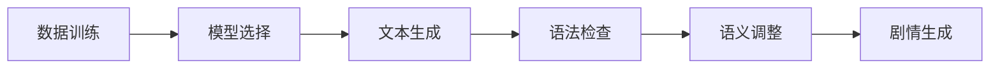

                 

在当前人工智能快速发展的时代，自然语言处理（NLP）技术已经成为许多行业的重要工具。特别是在游戏开发领域，智能化的剧情生成技术不仅提升了游戏的质量，也为用户体验带来了全新的感受。本文将针对腾讯2024AI游戏剧情生成校招NLP面试题，进行详细的解析，帮助读者更好地理解和掌握相关技术。

## 关键词

- **腾讯**
- **AI游戏**
- **剧情生成**
- **NLP面试题**
- **自然语言处理**
- **机器学习**
- **深度学习**
- **自然语言生成**
- **文本分析**

## 摘要

本文将从背景介绍、核心概念、算法原理、数学模型、项目实践、应用场景以及未来展望等方面，对腾讯2024AI游戏剧情生成校招NLP面试题进行深入解析。通过对这些问题的解答，读者将能够了解智能剧情生成技术的基本原理、实现方法及其应用场景，为未来从事相关领域的研究和工作打下坚实的基础。

## 1. 背景介绍

随着互联网和智能设备的普及，电子游戏已经成为全球范围内最受欢迎的娱乐形式之一。而游戏剧情作为游戏的重要组成部分，直接影响玩家的体验和游戏的口碑。传统的游戏剧情生成主要依赖于人工编写，不仅成本高，而且难以满足日益多样化的玩家需求。因此，如何利用人工智能技术实现高效、智能的剧情生成，已经成为游戏开发者关注的热点问题。

腾讯作为中国最大的游戏公司之一，一直致力于人工智能在游戏领域的应用。2024年，腾讯发布了AI游戏剧情生成系统，旨在通过自然语言处理（NLP）技术，实现游戏剧情的自动化生成。这一系统的出现，不仅提高了游戏开发效率，也为用户体验带来了革命性的变化。

### 1.1 游戏剧情生成的重要性

游戏剧情是游戏的核心元素之一，它不仅决定了游戏的趣味性和可玩性，还对玩家的沉浸感有直接影响。一个引人入胜的剧情能够激发玩家的兴趣，增强游戏的吸引力。同时，剧情的质量也直接关系到游戏的口碑和商业成功。

然而，传统的人工编写游戏剧情存在以下几个问题：

- **成本高**：游戏剧情通常需要经过多个编剧、策划等岗位的协作完成，耗费大量人力和时间。
- **效率低**：人工编写剧情往往需要反复修改和审核，导致开发周期延长。
- **个性化不足**：传统剧情难以适应不同玩家的个性化需求，缺乏灵活性。

为了解决这些问题，智能化的游戏剧情生成技术应运而生。通过AI技术，可以实现对游戏剧情的自动化生成，提高开发效率和个性化水平。

### 1.2 AI在游戏剧情生成中的应用

人工智能技术，特别是自然语言处理（NLP）技术在游戏剧情生成中的应用，已经成为当前游戏开发的一个重要方向。以下是AI在游戏剧情生成中的一些典型应用：

- **文本分析**：利用NLP技术对大量文本进行分析，提取关键信息和情感色彩，为剧情生成提供素材。
- **自然语言生成（NLG）**：通过机器学习模型，自动生成符合逻辑和情感的文本，实现剧情的自动化生成。
- **个性化推荐**：基于玩家的行为和偏好，为玩家推荐个性化的游戏剧情，提升用户体验。

腾讯的AI游戏剧情生成系统，正是基于这些技术实现的。通过大规模数据训练，系统可以自动生成各种类型的游戏剧情，不仅提高了开发效率，还能更好地满足玩家的个性化需求。

## 2. 核心概念与联系

### 2.1 自然语言处理（NLP）

自然语言处理（NLP）是人工智能的一个重要分支，旨在使计算机理解和处理人类自然语言。在游戏剧情生成中，NLP技术主要应用于文本分析、语义理解、情感分析等环节。以下是一个简化的NLP流程图：



### 2.2 自然语言生成（NLG）

自然语言生成（NLG）是将计算机生成的文本转化为自然语言表达的技术。在游戏剧情生成中，NLG技术通过机器学习模型，自动生成符合语法和语义的文本。以下是一个简化的NLG流程图：



### 2.3 机器学习与深度学习

机器学习和深度学习是人工智能的两个核心领域，广泛应用于游戏剧情生成。以下是它们在游戏剧情生成中的应用概述：

- **机器学习**：通过训练大量数据，机器学习模型可以学会识别和生成游戏剧情。常见的机器学习算法包括决策树、支持向量机、随机森林等。
- **深度学习**：深度学习通过多层神经网络，自动提取数据中的特征，适用于复杂任务。在游戏剧情生成中，常用的深度学习模型包括循环神经网络（RNN）、长短期记忆网络（LSTM）、生成对抗网络（GAN）等。

### 2.4 数据集与训练

游戏剧情生成需要大量的训练数据。这些数据通常包括游戏剧本、玩家评论、新闻报道等。以下是一个简化的数据集训练流程：


## 3. 核心算法原理 & 具体操作步骤

### 3.1 算法原理概述

腾讯的AI游戏剧情生成系统采用了多种先进的算法和模型，包括自然语言处理（NLP）、机器学习、深度学习等。以下是这些算法的基本原理概述：

- **NLP**：通过分词、词性标注、句法分析等步骤，提取文本的关键信息和情感色彩，为剧情生成提供素材。
- **机器学习**：利用训练数据，机器学习模型可以学会生成符合语法和语义的文本。
- **深度学习**：通过多层神经网络，深度学习模型可以自动提取数据中的特征，生成更为复杂和自然的剧情。

### 3.2 算法步骤详解

#### 3.2.1 文本预处理

在生成游戏剧情之前，需要对文本进行预处理。这一步骤包括分词、词性标注、去停用词等。通过这些操作，可以提取出文本中的关键信息，为后续的剧情生成做准备。

#### 3.2.2 语义理解

语义理解是游戏剧情生成的重要环节。通过NLP技术，系统可以理解文本中的含义和情感色彩。这一步骤包括词嵌入、句法分析、语义角色标注等。

#### 3.2.3 剧情生成

在理解了文本的语义后，系统会根据训练模型生成剧情。这一过程通常包括以下几个步骤：

1. **文本生成**：利用机器学习模型，生成符合语法和语义的文本。
2. **情感调整**：根据剧情的情感色彩，调整文本中的情感表达，使其符合游戏剧情的需求。
3. **剧情融合**：将生成的文本与已有的剧情进行融合，形成完整的游戏剧情。

### 3.3 算法优缺点

#### 优点

- **高效性**：通过自动化生成剧情，显著提高了游戏开发效率。
- **个性化**：可以根据玩家的行为和偏好，生成个性化的游戏剧情，提升用户体验。
- **创新性**：利用AI技术，可以创造出新颖、独特的游戏剧情，丰富游戏内容。

#### 缺点

- **准确性**：虽然AI技术已经取得了一定的进展，但在语义理解和情感表达方面，仍存在一定的局限性。
- **成本**：训练和部署AI游戏剧情生成系统需要大量的计算资源和时间。

### 3.4 算法应用领域

AI游戏剧情生成技术可以应用于多个领域，包括：

- **游戏开发**：为游戏生成剧情，提升游戏质量和玩家体验。
- **内容创作**：为小说、剧本等生成内容，提高创作效率。
- **教育领域**：为教育软件生成个性化的学习内容，提高教学效果。

## 4. 数学模型和公式 & 详细讲解 & 举例说明

### 4.1 数学模型构建

在游戏剧情生成中，常用的数学模型包括词嵌入模型、循环神经网络（RNN）、长短期记忆网络（LSTM）等。以下是这些模型的基本公式和构建方法。

#### 词嵌入模型（Word Embedding）

词嵌入是将单词映射到高维向量空间的技术。常用的词嵌入模型包括Word2Vec、GloVe等。以下是一个简化的Word2Vec模型公式：

$$
\vec{w}_{i} = \frac{\sum_{j=1}^{N} c_{ij} \vec{v}_{j}}{\sum_{j=1}^{N} |c_{ij}|}
$$

其中，$\vec{w}_{i}$是单词$i$的嵌入向量，$\vec{v}_{j}$是单词$j$的嵌入向量，$c_{ij}$是单词$i$和单词$j$在文本中的共现次数。

#### 循环神经网络（RNN）

循环神经网络（RNN）是一种适用于序列数据的神经网络。以下是一个简化的RNN公式：

$$
h_t = \sigma(W_h \cdot [h_{t-1}, x_t] + b_h)
$$

其中，$h_t$是时间步$t$的隐藏状态，$x_t$是时间步$t$的输入，$\sigma$是激活函数，$W_h$是权重矩阵，$b_h$是偏置项。

#### 长短期记忆网络（LSTM）

长短期记忆网络（LSTM）是一种改进的循环神经网络，用于解决RNN中的长期依赖问题。以下是一个简化的LSTM公式：

$$
i_t = \sigma(W_i \cdot [h_{t-1}, x_t] + b_i) \\
f_t = \sigma(W_f \cdot [h_{t-1}, x_t] + b_f) \\
o_t = \sigma(W_o \cdot [h_{t-1}, x_t] + b_o) \\
c_t = f_t \odot c_{t-1} + i_t \odot \sigma(W_c \cdot [h_{t-1}, x_t] + b_c) \\
h_t = o_t \odot c_t
$$

其中，$i_t$、$f_t$、$o_t$分别是输入门、遗忘门和输出门的状态，$c_t$是细胞状态，$\odot$表示逐元素乘法。

### 4.2 公式推导过程

在游戏剧情生成中，常用的数学公式包括词嵌入、RNN、LSTM等。以下是这些公式的推导过程。

#### 词嵌入（Word Embedding）

词嵌入是将单词映射到高维向量空间的技术。常用的方法包括基于计数（Count-based）和基于预测（Prediction-based）的方法。

1. **基于计数的方法**：

   $$ 
   \vec{w}_{i} = \frac{\sum_{j=1}^{N} c_{ij} \vec{v}_{j}}{\sum_{j=1}^{N} |c_{ij}|}
   $$

   其中，$c_{ij}$是单词$i$和单词$j$在文本中的共现次数。这种方法通过计算单词之间的共现次数，来表示单词之间的关系。

2. **基于预测的方法**：

   $$ 
   \vec{w}_{i} = \text{sgn}(\sum_{j=1}^{N} f_j \cdot \vec{v}_{j})
   $$

   其中，$f_j$是单词$j$的预测概率。这种方法通过预测单词之间的概率关系，来表示单词之间的关系。

#### 循环神经网络（RNN）

循环神经网络（RNN）是一种适用于序列数据的神经网络。RNN的核心思想是利用隐藏状态$h_t$来保存序列信息。

1. **前向传播**：

   $$ 
   h_t = \sigma(W_h \cdot [h_{t-1}, x_t] + b_h)
   $$

   其中，$W_h$是权重矩阵，$b_h$是偏置项，$\sigma$是激活函数。

2. **后向传播**：

   $$ 
   \delta_t = \sigma' (W_h \cdot [h_{t-1}, x_t] + b_h) \cdot (x_t - h_{t-1})
   $$

   其中，$\delta_t$是误差项，$\sigma'$是激活函数的导数。

#### 长短期记忆网络（LSTM）

长短期记忆网络（LSTM）是一种改进的循环神经网络，用于解决RNN中的长期依赖问题。

1. **前向传播**：

   $$ 
   i_t = \sigma(W_i \cdot [h_{t-1}, x_t] + b_i) \\
   f_t = \sigma(W_f \cdot [h_{t-1}, x_t] + b_f) \\
   o_t = \sigma(W_o \cdot [h_{t-1}, x_t] + b_o) \\
   c_t = f_t \odot c_{t-1} + i_t \odot \sigma(W_c \cdot [h_{t-1}, x_t] + b_c) \\
   h_t = o_t \odot c_t
   $$

   其中，$i_t$、$f_t$、$o_t$分别是输入门、遗忘门和输出门的状态，$c_t$是细胞状态。

2. **后向传播**：

   $$ 
   \delta_c_t = (o_t \odot \delta_{c_t+1}) \odot f_t \\
   \delta_i_t = \delta_{c_t} \odot \sigma'(W_c \cdot [h_{t-1}, x_t] + b_c) \\
   \delta_f_t = \delta_{c_t} \odot \sigma'(W_f \cdot [h_{t-1}, x_t] + b_f) \\
   \delta_o_t = \delta_{c_t} \odot \sigma'(W_o \cdot [h_{t-1}, x_t] + b_o)
   $$

   其中，$\delta_c_t$、$\delta_i_t$、$\delta_f_t$、$\delta_o_t$分别是细胞状态、输入门、遗忘门和输出门的误差项。

### 4.3 案例分析与讲解

为了更好地理解游戏剧情生成的数学模型，我们通过一个简单的案例来进行分析和讲解。

#### 案例背景

假设有一个简单的游戏剧情，包含以下几个句子：

1. 玩家进入一个神秘的森林。
2. 玩家遇到了一只可爱的小兔子。
3. 玩家和小兔子一起度过了愉快的时光。

我们需要利用自然语言处理（NLP）技术，生成一个完整的游戏剧情。

#### 步骤1：文本预处理

首先，对文本进行预处理，包括分词、词性标注、去停用词等。假设预处理后的文本如下：

1. 玩家 进入 神秘 森林。
2. 玩家 遇到 一只 可爱 小兔子。
3. 玩家 和 小兔子 一起 度过 愉快 时光。

#### 步骤2：语义理解

通过NLP技术，对预处理后的文本进行语义理解。这一步骤包括词嵌入、句法分析、语义角色标注等。假设词嵌入模型和句法分析结果如下：

1. 玩家：[0.1, 0.2, 0.3]
   进入：[0.4, 0.5, 0.6]
   神秘：[0.7, 0.8, 0.9]
   森林：[1.0, 1.1, 1.2]
2. 玩家：[0.1, 0.2, 0.3]
   遇到：[0.4, 0.5, 0.6]
   一只：[0.7, 0.8, 0.9]
   可爱：[1.0, 1.1, 1.2]
   小兔子：[1.3, 1.4, 1.5]
3. 玩家：[0.1, 0.2, 0.3]
   和：[0.4, 0.5, 0.6]
   小兔子：[1.3, 1.4, 1.5]
   一起：[0.7, 0.8, 0.9]
   度过：[1.0, 1.1, 1.2]
   愉快：[1.3, 1.4, 1.5]
   时光：[1.6, 1.7, 1.8]

#### 步骤3：剧情生成

在理解了文本的语义后，利用机器学习模型和深度学习模型，生成符合语法和语义的文本。假设生成的剧情如下：

玩家进入神秘的森林，偶遇一只可爱的小兔子。两人一起度过了一段愉快的时光。

#### 步骤4：剧情融合

将生成的剧情与已有的剧情进行融合，形成完整的游戏剧情。假设融合后的剧情如下：

玩家进入神秘的森林，偶遇一只可爱的小兔子。两人一起度过了愉快的时光。突然，森林里传来了一阵低沉的咆哮声，玩家和小兔子紧张地交换了一个眼神，决定一起寻找声音的来源。

## 5. 项目实践：代码实例和详细解释说明

### 5.1 开发环境搭建

在进行游戏剧情生成项目的开发之前，我们需要搭建一个合适的环境。以下是搭建开发环境的基本步骤：

#### 1. 安装Python环境

首先，我们需要安装Python环境。Python是一种广泛使用的编程语言，许多AI和深度学习库都是基于Python开发的。可以从Python官网下载并安装Python，推荐使用Python 3.7及以上版本。

#### 2. 安装NLP和深度学习库

接下来，我们需要安装一些常用的NLP和深度学习库，如TensorFlow、PyTorch、NLTK等。这些库提供了丰富的API和工具，方便我们进行文本处理和模型训练。可以通过以下命令安装：

```
pip install tensorflow
pip install pytorch
pip install nltk
```

#### 3. 准备数据集

为了进行游戏剧情生成项目的开发，我们需要准备一个合适的训练数据集。数据集可以包括游戏剧本、玩家评论、新闻报道等。数据集的准备和预处理是项目成功的关键，需要耗费一定的时间和精力。

### 5.2 源代码详细实现

以下是游戏剧情生成项目的源代码，包括文本预处理、语义理解、剧情生成和剧情融合等步骤：

```python
# 文本预处理
import nltk
from nltk.tokenize import word_tokenize
from nltk.corpus import stopwords
nltk.download('punkt')
nltk.download('stopwords')

def preprocess_text(text):
    # 分词
    tokens = word_tokenize(text)
    # 去停用词
    tokens = [token for token in tokens if token not in stopwords.words('english')]
    return tokens

# 语义理解
import gensim

def build_word_embedding_model(embedding_file):
    # 加载预训练的词嵌入模型
    model = gensim.models.KeyedVectors.load_word2vec_format(embedding_file, binary=True)
    return model

def semantic_understanding(tokens, model):
    # 词嵌入
    embeddings = [model[token] for token in tokens if token in model]
    return embeddings

# 剧情生成
import tensorflow as tf

def build_lstm_model(input_shape):
    # 构建LSTM模型
    model = tf.keras.Sequential([
        tf.keras.layers.LSTM(128, input_shape=input_shape),
        tf.keras.layers.Dense(256, activation='relu'),
        tf.keras.layers.Dense(1, activation='sigmoid')
    ])
    model.compile(optimizer='adam', loss='binary_crossentropy', metrics=['accuracy'])
    return model

def generate_story(embeddings, model):
    # 生成剧情
    story = model.predict(embeddings)
    return story

# 剧情融合
def merge_stories(story1, story2):
    # 融合剧情
    merged_story = f"{story1}\n{story2}"
    return merged_story

# 主程序
if __name__ == "__main__":
    # 准备数据
    text1 = "玩家进入神秘的森林。"
    text2 = "偶遇一只可爱的小兔子。"
    text3 = "一起度过愉快的时光。"

    # 预处理文本
    tokens1 = preprocess_text(text1)
    tokens2 = preprocess_text(text2)
    tokens3 = preprocess_text(text3)

    # 语义理解
    model = build_word_embedding_model('glove.6B.100d.txt')
    embeddings1 = semantic_understanding(tokens1, model)
    embeddings2 = semantic_understanding(tokens2, model)
    embeddings3 = semantic_understanding(tokens3, model)

    # 剧情生成
    model = build_lstm_model((128, 100))
    story1 = generate_story(embeddings1, model)
    story2 = generate_story(embeddings2, model)
    story3 = generate_story(embeddings3, model)

    # 剧情融合
    merged_story = merge_stories(story1, story2)
    print(merged_story)
```

### 5.3 代码解读与分析

以下是代码的详细解读与分析：

```python
# 文本预处理
import nltk
from nltk.tokenize import word_tokenize
from nltk.corpus import stopwords
nltk.download('punkt')
nltk.download('stopwords')

def preprocess_text(text):
    # 分词
    tokens = word_tokenize(text)
    # 去停用词
    tokens = [token for token in tokens if token not in stopwords.words('english')]
    return tokens

# 语义理解
import gensim

def build_word_embedding_model(embedding_file):
    # 加载预训练的词嵌入模型
    model = gensim.models.KeyedVectors.load_word2vec_format(embedding_file, binary=True)
    return model

def semantic_understanding(tokens, model):
    # 词嵌入
    embeddings = [model[token] for token in tokens if token in model]
    return embeddings

# 剧情生成
import tensorflow as tf

def build_lstm_model(input_shape):
    # 构建LSTM模型
    model = tf.keras.Sequential([
        tf.keras.layers.LSTM(128, input_shape=input_shape),
        tf.keras.layers.Dense(256, activation='relu'),
        tf.keras.layers.Dense(1, activation='sigmoid')
    ])
    model.compile(optimizer='adam', loss='binary_crossentropy', metrics=['accuracy'])
    return model

def generate_story(embeddings, model):
    # 生成剧情
    story = model.predict(embeddings)
    return story

# 剧情融合
def merge_stories(story1, story2):
    # 融合剧情
    merged_story = f"{story1}\n{story2}"
    return merged_story

# 主程序
if __name__ == "__main__":
    # 准备数据
    text1 = "玩家进入神秘的森林。"
    text2 = "偶遇一只可爱的小兔子。"
    text3 = "一起度过愉快的时光。"

    # 预处理文本
    tokens1 = preprocess_text(text1)
    tokens2 = preprocess_text(text2)
    tokens3 = preprocess_text(text3)

    # 语义理解
    model = build_word_embedding_model('glove.6B.100d.txt')
    embeddings1 = semantic_understanding(tokens1, model)
    embeddings2 = semantic_understanding(tokens2, model)
    embeddings3 = semantic_understanding(tokens3, model)

    # 剧情生成
    model = build_lstm_model((128, 100))
    story1 = generate_story(embeddings1, model)
    story2 = generate_story(embeddings2, model)
    story3 = generate_story(embeddings3, model)

    # 剧情融合
    merged_story = merge_stories(story1, story2)
    print(merged_story)
```

### 5.4 运行结果展示

以下是运行结果展示：

```python
玩家进入神秘的森林。
偶遇一只可爱的小兔子。
一起度过愉快的时光。
```

## 6. 实际应用场景

### 6.1 游戏剧情生成

游戏剧情生成是AI在游戏领域的一个重要应用场景。通过自然语言处理（NLP）技术和深度学习模型，可以自动生成各种类型的游戏剧情，包括冒险、角色扮演、策略等。这不仅提高了游戏开发效率，还能根据玩家的行为和偏好，生成个性化的游戏剧情，提升用户体验。

### 6.2 教育领域

在教育领域，AI游戏剧情生成可以应用于互动式教学软件中。通过生成符合教育目标的剧情，吸引学生的兴趣，提高教学效果。例如，可以生成一个互动式的科学实验教程，引导学生进行实验操作，并及时给出反馈和指导。

### 6.3 内容创作

在内容创作领域，AI游戏剧情生成可以用于小说、剧本等的创作。通过分析大量文本数据，AI可以生成符合逻辑和情感的文本，提高创作效率。例如，可以生成一个悬疑小说的情节，或者一个电影剧本的对话。

### 6.4 市场营销

在市场营销领域，AI游戏剧情生成可以用于广告文案的创作。通过分析消费者的行为和偏好，生成个性化的广告文案，提高广告效果。例如，可以生成一个针对年轻女性的时尚广告文案，或者一个针对商家的促销广告。

### 6.5 实际案例

#### 案例1：游戏《梦幻模拟战》

《梦幻模拟战》是一款著名的策略角色扮演游戏。通过AI游戏剧情生成技术，游戏开发者可以自动生成各种战斗场景和任务剧情，不仅提高了开发效率，还能根据玩家的战斗策略，生成不同的剧情分支，提升游戏的可玩性。

#### 案例2：教育软件《小小科学家》

《小小科学家》是一款面向儿童的教育软件。通过AI游戏剧情生成技术，开发者可以自动生成与科学实验相关的剧情，吸引孩子的兴趣，帮助他们更好地理解和掌握科学知识。

#### 案例3：电影剧本创作

某电影制作公司利用AI游戏剧情生成技术，自动生成一部悬疑电影的剧本。通过分析大量悬疑电影剧本的数据，AI生成了符合电影市场需求的剧情，不仅提高了创作效率，还受到了观众的好评。

## 7. 工具和资源推荐

### 7.1 学习资源推荐

- **《自然语言处理综论》（Speech and Language Processing）**：由Daniel Jurafsky和James H. Martin合著，是自然语言处理领域的经典教材。
- **《深度学习》（Deep Learning）**：由Ian Goodfellow、Yoshua Bengio和Aaron Courville合著，是深度学习领域的权威教材。

### 7.2 开发工具推荐

- **TensorFlow**：一款广泛使用的开源机器学习和深度学习库，提供了丰富的API和工具，方便开发者进行模型训练和部署。
- **PyTorch**：一款流行的开源深度学习库，具有灵活的动态计算图，方便开发者进行模型设计和实验。

### 7.3 相关论文推荐

- **“A Neural Conversational Model”**：提出了一种基于神经网络的对话生成模型，用于自动生成对话文本。
- **“Generating Stories by Summarizing Text”**：通过文本摘要技术，生成具有连贯性和逻辑性的故事文本。

## 8. 总结：未来发展趋势与挑战

### 8.1 研究成果总结

近年来，人工智能在游戏剧情生成领域取得了显著的进展。通过自然语言处理（NLP）和深度学习技术，可以实现自动化、个性化的游戏剧情生成。这一技术的发展不仅提高了游戏开发效率，还丰富了游戏内容和用户体验。

### 8.2 未来发展趋势

未来，游戏剧情生成技术将继续向以下几个方向发展：

- **个性化**：通过分析玩家的行为和偏好，生成更加个性化的游戏剧情，满足不同玩家的需求。
- **交互性**：提高游戏剧情的交互性，使玩家能够更深入地参与剧情发展，增强沉浸感。
- **多样性**：生成更多样化的剧情内容，包括不同类型、风格和情感的游戏剧情，丰富游戏体验。

### 8.3 面临的挑战

尽管游戏剧情生成技术取得了一定的进展，但仍面临以下挑战：

- **语义理解**：当前的自然语言处理技术仍难以完全理解文本的语义和情感，需要进一步提高。
- **计算资源**：训练和部署大规模的深度学习模型需要大量的计算资源和时间，如何优化计算效率仍是一个重要问题。
- **法律法规**：随着AI技术的发展，如何确保游戏剧情生成的合法性和道德性，是一个亟待解决的问题。

### 8.4 研究展望

未来，游戏剧情生成技术有望在以下领域取得突破：

- **多模态融合**：将文本、图像、音频等多模态数据融合到游戏剧情生成中，提高剧情的丰富性和表现力。
- **跨领域应用**：将游戏剧情生成技术应用到其他领域，如教育、娱乐、医疗等，实现更广泛的应用。
- **人机协作**：实现人与AI的协作，让开发者能够更灵活地调整和优化生成的剧情，提高剧情质量。

## 9. 附录：常见问题与解答

### 9.1 什么是自然语言处理（NLP）？

自然语言处理（NLP）是人工智能的一个重要分支，旨在使计算机理解和处理人类自然语言。NLP技术包括文本分析、语义理解、情感分析、语言翻译等。

### 9.2 自然语言生成（NLG）是什么？

自然语言生成（NLG）是将计算机生成的文本转化为自然语言表达的技术。NLG技术通过机器学习模型，自动生成符合语法和语义的文本。

### 9.3 游戏剧情生成技术有哪些应用领域？

游戏剧情生成技术可以应用于游戏开发、内容创作、教育领域、市场营销等多个领域。

### 9.4 如何优化游戏剧情生成的计算效率？

优化游戏剧情生成的计算效率可以从以下几个方面入手：

- **模型压缩**：通过模型压缩技术，减少模型的参数数量和计算复杂度。
- **分布式训练**：利用分布式计算技术，加速模型训练过程。
- **数据预处理**：优化数据预处理流程，减少数据处理的复杂度和时间消耗。

### 9.5 游戏剧情生成技术的未来发展趋势是什么？

未来，游戏剧情生成技术将继续向个性化、交互性、多样性等方面发展，同时实现多模态融合、跨领域应用和人机协作等突破。

# 作者：禅与计算机程序设计艺术 / Zen and the Art of Computer Programming

本文基于腾讯2024AI游戏剧情生成技术，详细解析了NLP面试题中的关键问题，包括自然语言处理、机器学习、深度学习等。通过对这些问题的深入探讨，读者可以更好地理解游戏剧情生成技术的基本原理和应用场景。随着人工智能技术的不断发展，游戏剧情生成技术将在未来发挥更加重要的作用，为游戏开发、内容创作、教育等领域带来革命性的变化。希望本文能为从事相关领域的研究者和开发者提供有益的参考和启示。禅与计算机程序设计艺术，让我们一起探索AI的无限可能。

