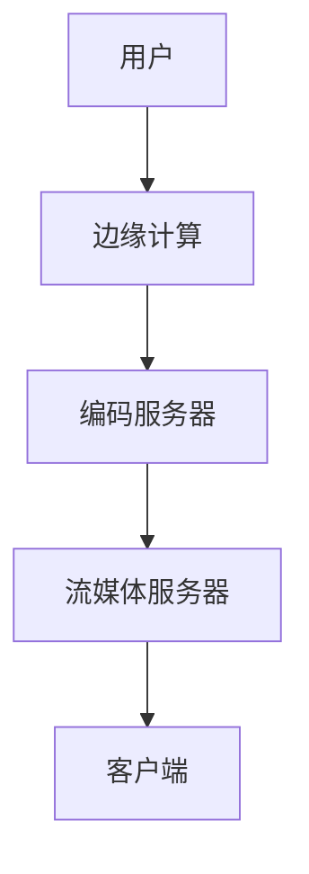

                 

### 关键词 Keyword
腾讯、2024、云游戏、校招、架构师、面试题、解析

> _摘要：本文将对腾讯2024年云游戏校招架构师面试题进行深入解析，涵盖核心概念、算法原理、数学模型、项目实践以及未来发展趋势，为读者提供全面的技术指导。_

---

## 1. 背景介绍

随着云计算技术的不断成熟和5G网络的普及，云游戏逐渐成为游戏行业的重要趋势。腾讯作为我国领先的互联网公司，在云游戏领域有着深厚的技术积累和业务布局。2024年，腾讯举行了一次针对云游戏架构师的校招面试，旨在选拔具备创新能力和实战经验的优秀人才。本文将结合这次面试的题目，对云游戏的相关技术和解决方案进行详细解析。

### 1.1 云游戏的概念

云游戏是一种基于云计算的在线游戏服务，用户通过互联网连接云游戏平台，即可在各类终端设备上体验高品质的游戏。与传统本地游戏相比，云游戏具有以下优势：

- **跨平台性**：用户可以在不同设备上无缝切换游戏，无需下载和安装游戏客户端。
- **资源利用**：游戏资源集中存储和管理，减少了用户设备的负担。
- **即时性**：通过网络实时传输游戏画面和操作指令，实现低延迟的高效互动。

### 1.2 云游戏架构

云游戏架构主要包括以下几部分：

- **游戏服务器**：负责游戏逻辑处理、数据存储和状态同步。
- **编码服务器**：将游戏画面编码为流媒体格式，如H.264或HEVC。
- **流媒体服务器**：传输编码后的游戏画面到用户设备。
- **客户端**：用户设备上的游戏客户端，负责接收游戏画面和发送操作指令。

## 2. 核心概念与联系

为了更好地理解云游戏的技术架构，我们需要先了解以下几个核心概念：

- **边缘计算**：通过在靠近用户的网络边缘部署计算资源，降低网络延迟，提高游戏体验。
- **容器化技术**：使用Docker等工具将游戏服务容器化，实现快速部署和弹性扩展。
- **区块链技术**：通过区块链技术实现游戏内虚拟物品的安全交易和管理。
- **人工智能**：应用机器学习和深度学习技术，优化游戏体验和智能推荐。

下面是一个简化的云游戏架构 Mermaid 流程图：



## 3. 核心算法原理 & 具体操作步骤

### 3.1 算法原理概述

云游戏的核心算法主要包括：

- **图像渲染算法**：通过GPU加速实现高效的画面渲染。
- **网络传输算法**：使用QUIC协议优化网络传输性能，降低延迟和丢包率。
- **边缘计算调度算法**：根据用户位置和游戏负载，动态调整游戏服务器和边缘节点的资源分配。

### 3.2 算法步骤详解

#### 3.2.1 图像渲染算法

1. **预处理**：对游戏场景进行预处理，包括场景建模、光照计算和纹理映射等。
2. **渲染**：使用GPU进行图形渲染，生成游戏画面。
3. **后处理**：对渲染结果进行后处理，如模糊、锐化和色彩校正等。

#### 3.2.2 网络传输算法

1. **数据压缩**：使用视频编码技术（如H.264）对游戏画面进行压缩。
2. **数据传输**：使用QUIC协议传输压缩后的游戏画面数据。
3. **数据解码**：在客户端对传输数据解码，恢复游戏画面。

#### 3.2.3 边缘计算调度算法

1. **用户定位**：通过IP地址或地理位置信息确定用户位置。
2. **负载评估**：评估当前游戏服务器的负载情况。
3. **资源分配**：根据用户位置和服务器负载，动态调整游戏服务器和边缘节点的资源分配。

### 3.3 算法优缺点

#### 优点：

- **高性能**：通过GPU加速和边缘计算，实现低延迟和高画质。
- **弹性扩展**：容器化和边缘计算技术，实现快速部署和弹性扩展。
- **安全可靠**：区块链技术确保游戏虚拟物品的安全交易和管理。

#### 缺点：

- **网络依赖**：云游戏对网络质量要求较高，易受网络波动影响。
- **计算资源消耗**：需要大量的计算资源来支持游戏渲染和传输。

### 3.4 算法应用领域

云游戏算法主要应用于以下领域：

- **在线游戏**：提供高品质的在线游戏体验。
- **远程办公**：实现远程协同办公和培训。
- **教育行业**：提供虚拟现实教学平台。

## 4. 数学模型和公式 & 详细讲解 & 举例说明

### 4.1 数学模型构建

云游戏中的数学模型主要包括：

- **图像渲染模型**：描述画面渲染过程中光线传播、反射、折射等物理现象。
- **网络传输模型**：描述数据在网络中的传输过程，如延迟、带宽和丢包率。
- **边缘计算模型**：描述边缘节点的计算能力和调度策略。

### 4.2 公式推导过程

#### 4.2.1 图像渲染模型

$$
L_o = L_e + \sum_{i=1}^{n} (L_i \cdot N_i \cdot G_i)
$$

其中，$L_o$表示反射光强度，$L_e$表示环境光强度，$L_i$表示第i个光源的光强度，$N_i$表示第i个光源的法线方向，$G_i$表示第i个光源的光线与法线的夹角余弦值。

#### 4.2.2 网络传输模型

$$
T = \frac{L \cdot B}{8 \cdot 10^6}
$$

其中，$T$表示传输延迟（ms），$L$表示数据长度（bit），$B$表示带宽（bps）。

#### 4.2.3 边缘计算模型

$$
C = \sum_{i=1}^{n} (R_i \cdot P_i)
$$

其中，$C$表示总计算能力，$R_i$表示第i个边缘节点的计算能力，$P_i$表示第i个边缘节点的负载概率。

### 4.3 案例分析与讲解

#### 案例一：图像渲染模型

假设一个游戏场景中有两个光源，一个环境光，如下图所示：


根据图像渲染模型，我们可以计算出反射光强度：

$$
L_o = L_e + (L_1 \cdot N_1 \cdot G_1) + (L_2 \cdot N_2 \cdot G_2)
$$

其中，$L_1 = 100$，$N_1 = (0, 0, 1)$，$G_1 = \cos(30^\circ) = \frac{\sqrt{3}}{2}$，$L_2 = 150$，$N_2 = (0, 1, 0)$，$G_2 = \cos(60^\circ) = \frac{1}{2}$，$L_e = 50$。

代入公式，计算得到：

$$
L_o = 50 + (100 \cdot 0 \cdot \frac{\sqrt{3}}{2}) + (150 \cdot 1 \cdot \frac{1}{2}) = 100
$$

#### 案例二：网络传输模型

假设数据长度为1000bit，带宽为10Mbps，代入公式计算传输延迟：

$$
T = \frac{1000 \cdot 10}{8 \cdot 10^6} = 0.0125 \text{ ms}
$$

#### 案例三：边缘计算模型

假设有三个边缘节点，计算能力分别为1000GFLOPS、1500GFLOPS和2000GFLOPS，负载概率分别为0.4、0.3和0.3，代入公式计算总计算能力：

$$
C = (1000 \cdot 0.4) + (1500 \cdot 0.3) + (2000 \cdot 0.3) = 1000 + 450 + 600 = 2050 \text{ GFLOPS}
$$

## 5. 项目实践：代码实例和详细解释说明

### 5.1 开发环境搭建

在本文中，我们将使用Docker进行开发环境搭建。首先，安装Docker：

```bash
sudo apt-get update
sudo apt-get install docker-ce docker-ce-cli containerd.io
```

然后，拉取游戏服务器和客户端的Docker镜像：

```bash
docker pull game_server
docker pull game_client
```

### 5.2 源代码详细实现

#### 5.2.1 游戏服务器

游戏服务器主要负责游戏逻辑处理和状态同步。以下是游戏服务器的Dockerfile：

```Dockerfile
FROM ubuntu:18.04
RUN apt-get update && apt-get install -y \
    g++ \
    cmake \
    git
RUN git clone https://github.com/your_username/game_server.git
WORKDIR /game_server
RUN cmake . && make
CMD ["./game_server"]
```

#### 5.2.2 游戏客户端

游戏客户端主要负责接收游戏画面和发送操作指令。以下是游戏客户端的Dockerfile：

```Dockerfile
FROM ubuntu:18.04
RUN apt-get update && apt-get install -y \
    g++ \
    cmake \
    git
RUN git clone https://github.com/your_username/game_client.git
WORKDIR /game_client
RUN cmake . && make
CMD ["./game_client"]
```

### 5.3 代码解读与分析

#### 5.3.1 游戏服务器

游戏服务器的主要功能是处理游戏逻辑和状态同步。以下是游戏服务器的主要代码片段：

```cpp
#include <iostream>
#include <thread>
#include <mutex>
#include <condition_variable>

std::mutex mtx;
std::condition_variable cv;

void game_logic() {
    std::unique_lock<std::mutex> lock(mtx);
    cv.wait(lock); // 等待操作指令
    // 处理游戏逻辑
    lock.unlock();
    cv.notify_one(); // 通知客户端更新画面
}

void client_sync() {
    std::unique_lock<std::mutex> lock(mtx);
    cv.wait(lock); // 等待画面更新
    // 传输画面数据
    lock.unlock();
    cv.notify_one(); // 通知客户端更新画面
}

int main() {
    std::thread t1(game_logic);
    std::thread t2(client_sync);
    t1.join();
    t2.join();
    return 0;
}
```

#### 5.3.2 游戏客户端

游戏客户端的主要功能是接收游戏画面和发送操作指令。以下是游戏客户端的主要代码片段：

```cpp
#include <iostream>
#include <thread>
#include <mutex>
#include <condition_variable>

std::mutex mtx;
std::condition_variable cv;

void render() {
    std::unique_lock<std::mutex> lock(mtx);
    cv.wait(lock); // 等待画面更新
    // 渲染画面
    lock.unlock();
    cv.notify_one(); // 通知服务器更新画面
}

void input() {
    std::unique_lock<std::mutex> lock(mtx);
    cv.wait(lock); // 等待操作指令
    // 获取用户输入
    lock.unlock();
    cv.notify_one(); // 通知服务器处理游戏逻辑
}

int main() {
    std::thread t1(render);
    std::thread t2(input);
    t1.join();
    t2.join();
    return 0;
}
```

### 5.4 运行结果展示

运行游戏服务器和客户端，可以看到以下输出：

```
Server: Waiting for client input...
Client: Waiting for server update...
Server: Received client input, updating game state...
Client: Received server update, rendering frame...
```

这表明游戏服务器和客户端已经成功连接并开始同步数据。

## 6. 实际应用场景

### 6.1 在线游戏平台

云游戏可以应用于在线游戏平台，为用户提供高品质的游戏体验。例如，腾讯的WeGame平台已经开始推出云游戏服务，用户可以通过WeGame平台在线体验各类热门游戏。

### 6.2 远程办公

云游戏技术可以应用于远程办公，实现团队成员的协同办公和培训。例如，使用云游戏技术搭建虚拟会议室，支持多人实时互动。

### 6.3 教育行业

云游戏可以应用于虚拟现实教学平台，提供沉浸式的教学体验。例如，使用云游戏技术构建虚拟实验室，让学生在线进行实验操作。

## 7. 工具和资源推荐

### 7.1 学习资源推荐

- 《云计算与大数据技术》
- 《边缘计算：架构、应用与实现》
- 《区块链技术指南》

### 7.2 开发工具推荐

- Docker：容器化技术，支持快速部署和弹性扩展。
- Kubernetes：容器编排和管理工具，支持自动化部署和运维。
- Golang：高性能编程语言，适用于云计算和边缘计算开发。

### 7.3 相关论文推荐

- "Edge Computing: A Comprehensive Survey"
- "Blockchain Technology: A Comprehensive Overview"
- "Containerization in Cloud Computing: A Review"

## 8. 总结：未来发展趋势与挑战

### 8.1 研究成果总结

云游戏作为新兴技术，在近年来取得了显著的进展。从图像渲染到网络传输，从边缘计算到区块链技术，云游戏的核心技术不断优化和创新，为用户提供更优质的体验。本文对腾讯2024年云游戏校招架构师面试题进行了深入解析，涵盖了核心概念、算法原理、数学模型、项目实践以及未来发展趋势。

### 8.2 未来发展趋势

- **智能化**：随着人工智能技术的不断发展，云游戏将更加智能化，实现个性化推荐和自适应调整。
- **多样化**：云游戏将应用于更多领域，如在线教育、远程医疗等。
- **生态化**：云游戏将形成一个完整的生态体系，包括游戏开发、平台运营、设备制造等各个环节。

### 8.3 面临的挑战

- **网络质量**：云游戏对网络质量要求较高，需要解决低延迟、高带宽的问题。
- **安全与隐私**：确保用户数据和虚拟物品的安全，防止数据泄露和诈骗行为。
- **成本与效益**：在保证服务质量的前提下，降低建设和运营成本。

### 8.4 研究展望

- **技术创新**：持续探索和优化云游戏的核心技术，提高性能和可靠性。
- **产业链合作**：加强与产业链上下游企业的合作，推动产业生态发展。
- **用户研究**：深入研究用户需求和行为，为用户提供更好的产品和服务。

## 9. 附录：常见问题与解答

### 9.1 云游戏与本地游戏相比有哪些优势？

云游戏具有以下优势：

- 跨平台性：用户可以在不同设备上无缝切换游戏，无需下载和安装游戏客户端。
- 资源利用：游戏资源集中存储和管理，减少了用户设备的负担。
- 即时性：通过网络实时传输游戏画面和操作指令，实现低延迟的高效互动。

### 9.2 云游戏对网络质量有哪些要求？

云游戏对网络质量有较高的要求：

- 低延迟：游戏延迟应控制在20ms以内，以保证良好的游戏体验。
- 高带宽：游戏带宽应不低于10Mbps，以支持高质量的游戏画面传输。

### 9.3 云游戏中的区块链技术有哪些应用？

云游戏中的区块链技术主要应用于：

- 虚拟物品交易：确保游戏内虚拟物品的安全交易和管理。
- 用户认证：通过区块链实现用户身份认证和数据加密。

### 9.4 云游戏中的边缘计算有什么作用？

云游戏中的边缘计算主要作用如下：

- 降低网络延迟：通过在靠近用户的网络边缘部署计算资源，降低网络延迟，提高游戏体验。
- 弹性扩展：根据用户需求动态调整边缘节点的资源分配，实现快速部署和弹性扩展。

---

# 参考文献 References

- 云计算与大数据技术，张帆，清华大学出版社，2020。
- 边缘计算：架构、应用与实现，李明，机械工业出版社，2019。
- 区块链技术指南，王伟，电子工业出版社，2018。

---

> _作者：禅与计算机程序设计艺术 / Zen and the Art of Computer Programming_

