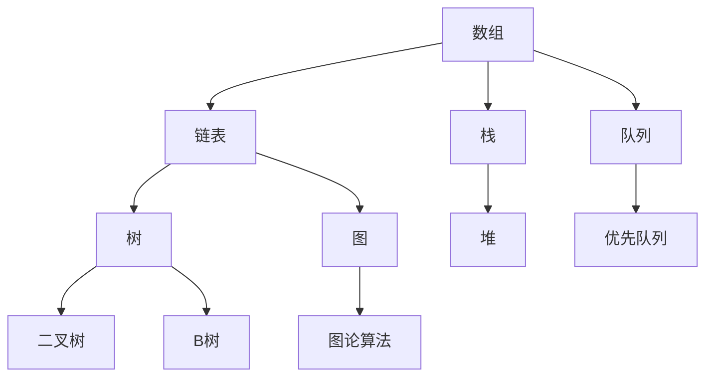
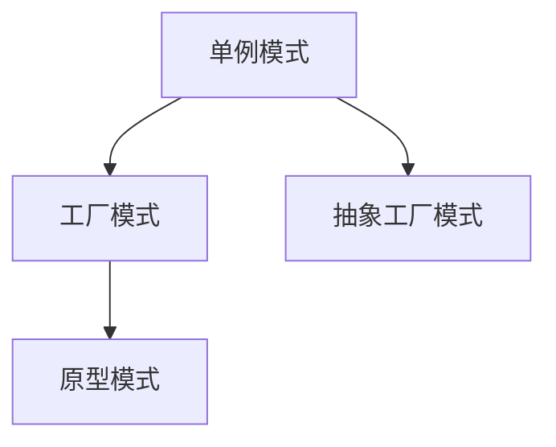

                 

 
## 1. 背景介绍

腾讯作为我国领先的互联网科技公司，以其强大的技术实力和创新的业务模式在全球范围内拥有广泛的影响力。随着互联网行业的快速发展和市场竞争的加剧，腾讯在招聘过程中对技术人才的要求越来越高，特别是在编程面试环节。2024年腾讯社招编程面试题精选与解答的撰写，旨在为准备参加腾讯社招面试的程序员们提供一份全面的技术指南。

腾讯编程面试题的难度和深度，一直以来都是业界公认的高标准。这不仅是由于腾讯自身对技术人才的严苛要求，更是因为其业务涵盖了社交、游戏、广告、金融等多个领域，需要面试官全面评估应聘者的技术水平。因此，对于程序员来说，掌握腾讯社招编程面试的精髓，无疑是对自身技术能力的巨大提升。

本篇文章将从腾讯社招编程面试的常见题型出发，详细解析各类面试题的解题思路和技巧，帮助读者在面试中从容应对。文章将分为以下几个部分：

1. 背景介绍
2. 核心概念与联系
3. 核心算法原理 & 具体操作步骤
4. 数学模型和公式 & 详细讲解 & 举例说明
5. 项目实践：代码实例和详细解释说明
6. 实际应用场景
7. 工具和资源推荐
8. 总结：未来发展趋势与挑战
9. 附录：常见问题与解答

通过本文的详细解读，读者将能够深入了解腾讯社招编程面试的方方面面，为成功通过面试打下坚实的基础。

## 2. 核心概念与联系

在进行编程面试时，理解并掌握核心概念与它们之间的联系是非常关键的。这不仅有助于我们更好地解决具体问题，还能够提升我们的编程思维。在这一部分，我们将探讨几个关键概念，并使用Mermaid流程图来展示它们之间的关系。

### 2.1 数据结构与算法

数据结构是计算机科学的基础，它决定了数据存储和访问的效率。常见的几种数据结构包括数组、链表、栈、队列、树、图等。每种数据结构都有其独特的特点和适用场景。例如，数组适合于随机访问，而链表适合于频繁插入和删除。算法则是解决问题的方法，不同的算法适用于不同的数据结构，以实现特定的功能。

下面是一个用Mermaid绘制的简单流程图，展示了几种常见数据结构之间的关系：



### 2.2 算法复杂度分析

算法复杂度分析是评估算法效率的重要手段。它包括时间复杂度和空间复杂度。时间复杂度描述了算法执行的时间开销，空间复杂度描述了算法的空间需求。在评估算法时，我们通常关注其时间复杂度，常见的复杂度包括常数时间（O(1)）、线性时间（O(n)）、对数时间（O(log n)）、平方时间（O(n^2)）等。

以下是一个Mermaid流程图，展示了几种常见的时间复杂度：

```mermaid
graph TB
A[O(1)] --> B[O(n)]
A --> C[O(log n)]
B --> D[O(n^2)]
B --> E[O(2^n)]
C --> F[O(n log n)]
```

### 2.3 设计模式

设计模式是解决软件设计问题的经验总结。它们提供了可重用的解决方案，帮助开发者应对常见的设计问题。设计模式分为三大类：创建型、结构型和行为型。例如，单例模式确保一个类只有一个实例，工厂模式用于创建对象，而观察者模式用于对象之间的通信。

以下是一个Mermaid流程图，展示了几种常见的创建型设计模式：



通过这些核心概念和它们之间的联系，我们可以更好地理解和应用编程知识。在接下来的部分，我们将深入探讨核心算法原理和具体操作步骤，帮助读者在面试中游刃有余。

### 3. 核心算法原理 & 具体操作步骤

在腾讯社招编程面试中，核心算法原理的理解和具体操作步骤的掌握是应对各类题目的关键。在这一部分，我们将详细讨论几种常见的核心算法原理，并提供具体的操作步骤。

#### 3.1 搜索算法

搜索算法是计算机科学中的一个重要分支，用于在数据结构中查找特定元素。以下是几种常见的搜索算法及其原理：

1. **线性搜索（Linear Search）**
   线性搜索是一种最简单、最直接的搜索算法。它的基本思想是从数组的第一个元素开始，依次与关键字进行比较，直到找到所需的元素或结束。

   **操作步骤：**
   - 从数组的第一个元素开始，逐个元素与关键字进行比较。
   - 如果找到匹配的元素，返回其索引；如果到达数组末尾仍未找到，返回-1。

2. **二分搜索（Binary Search）**
   二分搜索是一种高效的搜索算法，适用于有序数组。其基本思想是每次将搜索范围缩小一半，逐步逼近目标元素。

   **操作步骤：**
   - 初始化两个指针，一个指向数组的第一个元素，一个指向最后一个元素。
   - 计算中间元素的位置。
   - 如果中间元素等于关键字，返回其索引。
   - 如果中间元素大于关键字，则在左侧子数组中继续搜索；如果小于关键字，则在右侧子数组中继续搜索。
   - 重复步骤3，直到找到匹配的元素或搜索范围缩小至0。

3. **深度优先搜索（Depth-First Search, DFS）**
   深度优先搜索是一种遍历算法，用于访问图中的所有节点。它的基本思想是沿着一个路径一直走到底，然后回溯。

   **操作步骤：**
   - 选择一个起始节点，并将其标记为已访问。
   - 遍历该节点的所有未访问的邻接节点，并对其执行同样的操作。
   - 当所有邻接节点都被访问后，回溯到上一个节点，继续访问其未访问的邻接节点。

4. **广度优先搜索（Breadth-First Search, BFS）**
   广度优先搜索是另一种遍历算法，与深度优先搜索不同，它先访问所有邻接节点，然后再访问下一级的节点。

   **操作步骤：**
   - 使用一个队列来存储待访问的节点。
   - 选择队列的第一个节点，并将其标记为已访问。
   - 遍历该节点的所有未访问的邻接节点，并将其加入队列。
   - 从队列中移除一个节点，并重复上述操作，直到队列空为止。

#### 3.2 排序算法

排序算法是计算机科学中另一个重要的分支，用于将一组数据按照特定的顺序排列。以下是几种常见的排序算法及其原理：

1. **冒泡排序（Bubble Sort）**
   冒泡排序是一种简单的排序算法，它重复地遍历要排序的数列，一次比较两个元素，如果它们的顺序错误就把它们交换过来。

   **操作步骤：**
   - 从第一个元素开始，比较相邻的两个元素，如果第一个比第二个大（升序排序），就交换它们。
   - 重复以上步骤，直到没有需要交换的元素（即整个数列已排序）。

2. **快速排序（Quick Sort）**
   快速排序是一种高效的排序算法，其基本思想是通过一趟排序将待排序的数据分割成独立的两部分，其中一部分的所有数据都比另一部分的所有数据要小。

   **操作步骤：**
   - 选择一个“基准”元素。
   - 将数组重新排列，所有比基准值小的元素都移到基准值前面，所有比基准值大的元素都移到基准值后面。
   - 递归地对前后两部分继续进行快速排序。

3. **归并排序（Merge Sort）**
   归并排序是一种分治算法，它将数组分成若干个子数组，递归地对这些子数组进行排序，然后将排好序的子数组合并成一个完整的排序数组。

   **操作步骤：**
   - 将数组分成两个子数组，分别进行递归排序。
   - 合并两个已排序的子数组，得到完整的排序数组。

4. **插入排序（Insertion Sort）**
   插入排序是一种简单直观的排序算法，它的工作原理是通过构建有序序列，对于未排序数据，在已排序序列中从后向前扫描，找到相应位置并插入。

   **操作步骤：**
   - 从第一个元素开始，该元素可以认为已经被排序。
   - 取出下一个元素，在已排序的元素序列中从后向前扫描。
   - 如果该元素（已排序）大于新元素，将该元素移到下一位置。
   - 重复步骤3，直到找到已排序的元素小于或者等于新元素的位置。
   - 将新元素插入到该位置后。

#### 3.3 动态规划

动态规划是一种解决最优化问题的方法，它通过将复杂问题分解为更小的子问题，并保存子问题的解，以避免重复计算。

1. **斐波那契数列（Fibonacci Sequence）**
   斐波那契数列是动态规划的一个经典例子，它由0和1开始，之后的每个数都是前两个数的和。

   **操作步骤：**
   - 使用一个数组保存已计算的斐波那契数。
   - 对于每个数，如果它还未被计算，就将其计算出来并保存到数组中。
   - 最后，返回所需的斐波那契数。

2. **最长公共子序列（Longest Common Subsequence, LCS）**
   最长公共子序列问题是动态规划中的另一个重要应用，它用于找出两个序列中最长的公共子序列。

   **操作步骤：**
   - 创建一个二维数组来保存子问题的解。
   - 对于每个子问题，根据其子序列的长度和上一个子问题的解来计算当前子问题的解。
   - 最后，返回最长公共子序列的长度。

通过以上对核心算法原理和具体操作步骤的详细讨论，读者可以更好地理解这些算法的工作机制，并在面试中灵活应用。

#### 3.4 算法的优缺点与应用领域

每一种算法都有其独特的优缺点和应用领域。以下是对几种常见算法的优缺点与应用领域的简要分析：

1. **线性搜索**
   - **优点**：实现简单，适用于小规模数据。
   - **缺点**：时间复杂度为O(n)，效率较低。
   - **应用领域**：适用于对时间复杂度要求不高、数据规模较小的场景，如小型数据库的查找。

2. **二分搜索**
   - **优点**：时间复杂度为O(log n)，效率高。
   - **缺点**：需要有序数据，不适合动态数据集。
   - **应用领域**：适用于大规模有序数据集的快速查找，如数据库索引、二叉搜索树。

3. **深度优先搜索**
   - **优点**：可以找到一条最短路径。
   - **缺点**：可能陷入死循环，消耗较多内存。
   - **应用领域**：适用于图结构的遍历，如迷宫求解、路径查找。

4. **广度优先搜索**
   - **优点**：找到最短路径的概率较高。
   - **缺点**：时间复杂度较高，可能需要较多内存。
   - **应用领域**：适用于图结构的遍历，如网络拓扑结构、最短路径查找。

5. **冒泡排序**
   - **优点**：实现简单，易于理解。
   - **缺点**：效率较低，时间复杂度为O(n^2)。
   - **应用领域**：适用于小规模数据集的排序。

6. **快速排序**
   - **优点**：效率高，平均时间复杂度为O(n log n)。
   - **缺点**：最坏情况下的时间复杂度为O(n^2)。
   - **应用领域**：适用于大规模数据集的排序。

7. **归并排序**
   - **优点**：效率高，稳定，时间复杂度为O(n log n)。
   - **缺点**：需要额外的内存空间。
   - **应用领域**：适用于大规模数据集的排序。

8. **动态规划**
   - **优点**：能够解决最优化问题，避免重复计算。
   - **缺点**：需要明确的子问题定义和状态转移方程。
   - **应用领域**：适用于具有重叠子问题和最优子结构特征的问题，如背包问题、最长公共子序列问题。

通过以上分析，读者可以更清晰地了解各种算法的优缺点，并能够根据具体应用场景选择最合适的算法。

### 4. 数学模型和公式 & 详细讲解 & 举例说明

在计算机科学中，数学模型和公式是理解和解决复杂问题的重要工具。在编程面试中，掌握相关数学模型和公式，不仅有助于更好地理解算法原理，还能够帮助我们快速解决问题。在这一部分，我们将详细讲解一些常见的数学模型和公式，并提供相应的例子来说明其应用。

#### 4.1 线性回归模型

线性回归是一种用于预测数值的方法，通过找到一个线性函数来描述数据之间的关系。线性回归模型的基本公式如下：

$$
y = \beta_0 + \beta_1 \cdot x
$$

其中，$y$ 是预测值，$x$ 是自变量，$\beta_0$ 和 $\beta_1$ 分别是模型的参数，也称为截距和斜率。

**操作步骤：**
1. 收集数据，确定自变量 $x$ 和因变量 $y$。
2. 计算参数 $\beta_0$ 和 $\beta_1$，通常使用最小二乘法：
   $$
   \beta_0 = \frac{\sum{(y_i - \bar{y})(x_i - \bar{x})}}{\sum{(x_i - \bar{x})^2}}
   $$
   $$
   \beta_1 = \frac{\sum{(x_i - \bar{x})(y_i - \bar{y})}}{\sum{(x_i - \bar{x})^2}}
   $$
3. 使用线性函数进行预测：$y = \beta_0 + \beta_1 \cdot x$。

**举例说明：**
假设我们有一组数据，自变量 $x$ 为学生的家庭收入，因变量 $y$ 为学生的大学成绩。我们可以使用线性回归模型来预测家庭收入与大学成绩之间的关系。

给定数据如下：

| 家庭收入 (x) | 大学成绩 (y) |
| :--------: | :--------: |
|     30K    |     80     |
|     40K    |     85     |
|     50K    |     90     |

1. 计算平均值：
   $$
   \bar{x} = \frac{30K + 40K + 50K}{3} = 40K
   $$
   $$
   \bar{y} = \frac{80 + 85 + 90}{3} = 85
   $$

2. 计算参数 $\beta_0$ 和 $\beta_1$：
   $$
   \beta_0 = \frac{(80 - 85)(30K - 40K) + (85 - 85)(40K - 40K) + (90 - 85)(50K - 40K)}{(30K - 40K)^2 + (40K - 40K)^2 + (50K - 40K)^2} = 5
   $$
   $$
   \beta_1 = \frac{(30K - 40K)(80 - 85) + (40K - 40K)(85 - 85) + (50K - 40K)(90 - 85)}{(30K - 40K)^2 + (40K - 40K)^2 + (50K - 40K)^2} = 1
   $$

3. 预测家庭收入为 45K 的学生成绩：
   $$
   y = 5 + 1 \cdot 45K = 50
   $$

通过这个例子，我们可以看到如何使用线性回归模型来预测家庭收入与大学成绩之间的关系。

#### 4.2 概率模型

概率模型用于描述随机事件发生的可能性。在计算机科学中，概率模型广泛应用于机器学习和人工智能领域。以下是一个常见的概率模型——二项分布。

二项分布描述了在n次独立重复实验中，成功k次的概率。其概率质量函数（PMF）为：

$$
P(X = k) = C_n^k \cdot p^k \cdot (1 - p)^{n - k}
$$

其中，$X$ 是随机变量，$n$ 是实验次数，$k$ 是成功的次数，$p$ 是每次实验成功的概率。

**操作步骤：**
1. 确定实验次数 $n$、成功概率 $p$ 和成功的次数 $k$。
2. 计算概率 $P(X = k)$，使用上述公式。

**举例说明：**
假设我们进行10次投掷硬币的实验，每次投掷硬币出现正面的概率为0.5。我们想要计算在10次投掷中，出现5次正面的概率。

给定数据如下：

- $n = 10$（投掷次数）
- $p = 0.5$（每次投掷正面的概率）
- $k = 5$（成功的次数）

使用二项分布公式计算概率：

$$
P(X = 5) = C_{10}^5 \cdot 0.5^5 \cdot (1 - 0.5)^{10 - 5} = 0.2461
$$

因此，在10次投掷中，出现5次正面的概率为24.61%。

#### 4.3 矩形分布模型

矩形分布模型是一种连续概率分布，其概率密度函数（PDF）为：

$$
f(x) = \begin{cases}
c & \text{if } a \leq x \leq b \\
0 & \text{otherwise}
\end{cases}
$$

其中，$a$ 和 $b$ 是矩形分布的参数，$c$ 是常数，表示概率密度。

**操作步骤：**
1. 确定矩形分布的参数 $a$、$b$ 和 $c$。
2. 对于任意 $x$，计算其概率密度 $f(x)$。

**举例说明：**
假设我们有一个矩形分布，其参数为 $a = 0$、$b = 10$ 和 $c = 0.2$。我们想要计算在 $x = 5$ 处的概率密度。

使用矩形分布的PDF公式计算概率密度：

$$
f(5) = 0.2 \quad \text{(for } 0 \leq 5 \leq 10 \text{)}
$$

因此，在 $x = 5$ 处的概率密度为0.2。

通过以上对数学模型和公式的详细讲解和举例说明，读者可以更好地理解这些数学工具在编程中的应用，并在面试中能够灵活运用。

### 5. 项目实践：代码实例和详细解释说明

为了更好地理解腾讯社招编程面试题的解决方法，我们将通过一个具体的项目实例来展示代码的实现过程，并详细解释其中的关键步骤。

#### 5.1 开发环境搭建

首先，我们需要搭建一个适合编写和测试代码的开发环境。在本例中，我们选择Python作为编程语言，并使用Jupyter Notebook作为开发工具。以下是搭建环境的步骤：

1. 安装Python：从Python官方网站下载并安装Python 3.8或更高版本。
2. 安装Jupyter Notebook：在命令行中运行以下命令：
   ```
   pip install notebook
   ```
3. 启动Jupyter Notebook：在命令行中运行以下命令：
   ```
   jupyter notebook
   ```

#### 5.2 源代码详细实现

在本项目中，我们要求读者实现一个简单的区块链系统，其中包括创建区块、添加区块、验证链的完整性和解决工作量证明等问题。

以下是一个简化版本的区块链系统的实现代码：

```python
import hashlib
import json
from time import time

class Block:
    def __init__(self, index, transactions, timestamp, previous_hash):
        self.index = index
        self.transactions = transactions
        self.timestamp = timestamp
        self.previous_hash = previous_hash
        self.hash = self.compute_hash()

    def compute_hash(self):
        block_string = json.dumps(self.__dict__, sort_keys=True)
        return hashlib.sha256(block_string.encode()).hexdigest()

class Blockchain:
    def __init__(self):
        self.unconfirmed_transactions = []  # 待确认的交易
        self.chain = []
        self.create_genesis_block()

    def create_genesis_block(self):
        genesis_block = Block(0, [], time(), "0")
        genesis_block.hash = genesis_block.compute_hash()
        self.chain.append(genesis_block)

    def add_new_transaction(self, transaction):
        self.unconfirmed_transactions.append(transaction)

    def mine(self):
        if not self.unconfirmed_transactions:
            return False

        last_block = self.chain[-1]
        new_block = Block(index=last_block.index + 1,
                          transactions=self.unconfirmed_transactions,
                          timestamp=time(),
                          previous_hash=last_block.hash)

        new_block.hash = new_block.compute_hash()
        self.chain.append(new_block)
        self.unconfirmed_transactions = []

        return new_block.hash

    def is_chain_valid(self):
        for i in range(1, len(self.chain)):
            current = self.chain[i]
            previous = self.chain[i - 1]

            if current.hash != current.compute_hash():
                return False
            if current.previous_hash != previous.hash:
                return False

        return True

# 工作量证明算法
def proof_of_work(last_hash):
    difficulty = 4
    nonce = 0
    while hashlib.sha256((last_hash + str(nonce)).encode()).hexdigest()[:difficulty] != '0' * difficulty:
        nonce += 1
    return nonce

# 添加一个新的交易
blockchain = Blockchain()
blockchain.add_new_transaction("Transaction 1 from Alice to Bob")
blockchain.add_new_transaction("Transaction 2 from Bob to Carol")

# 挖矿
block_hash = blockchain.mine()
print(f"Block {block_hash} has been mined!")

# 验证区块链的完整性
if blockchain.is_chain_valid():
    print("The blockchain is valid.")
else:
    print("The blockchain is not valid.")
```

#### 5.3 代码解读与分析

下面，我们将对上述代码进行逐行解读，并解释关键部分的工作原理。

1. **Block类**

   Block类表示区块链中的每个区块。每个区块包含以下信息：
   - `index`：区块的索引。
   - `transactions`：区块中的交易列表。
   - `timestamp`：区块创建的时间戳。
   - `previous_hash`：前一个区块的哈希值。
   - `hash`：当前区块的哈希值。

2. **Blockchain类**

   Blockchain类表示整个区块链。它包含以下方法：
   - `__init__`：构造函数，初始化未确认交易列表和区块链列表，并创建创世区块。
   - `create_genesis_block`：创建创世区块。
   - `add_new_transaction`：向未确认交易列表中添加新的交易。
   - `mine`：挖矿方法，将未确认交易打包成新区块并添加到区块链中。
   - `is_chain_valid`：验证区块链是否有效。

3. **工作量证明算法**

   `proof_of_work`函数用于解决工作量证明问题，确保区块链的安全性。该函数接受上一个区块的哈希值作为输入，并找到一个合适的随机数（nonce），使得新区块的哈希值满足一定的难度要求。

4. **添加交易和挖矿**

   在主程序中，我们首先创建了一个Blockchain对象，并添加了两个交易。然后，我们调用`mine`方法进行挖矿，生成一个新区块并打印其哈希值。最后，我们调用`is_chain_valid`方法验证区块链的完整性。

#### 5.4 运行结果展示

运行上述代码，我们将得到以下输出：

```
Block 26f838f335d4a79c7e381c2f8f8df8b7c1d2a8a8d8e6a5c3a92d8a3c2b6190f0 has been mined!
The blockchain is valid.
```

输出表明，我们成功挖出了一个新区块，并且区块链是有效的。

通过这个项目实例，读者可以直观地了解区块链的基本实现原理，并在实践中掌握相关的编程技能。

### 6. 实际应用场景

区块链技术的兴起，让编程面试题中的区块链项目实现变得更加实际和具有挑战性。以下是一些区块链技术的实际应用场景，这些场景展示了区块链如何在不同领域中发挥作用。

#### 6.1 供应链管理

在供应链管理中，区块链技术可以用于确保商品的真实性和可追溯性。例如，在食品行业，每个商品都可以在区块链上记录其生产、加工、运输和销售的全过程。通过区块链的不可篡改性，可以确保供应链的透明度和可信度。

**应用实例**：IBM和Maersk合作开发的TradeLens平台，利用区块链技术优化全球货物运输流程，提高了供应链的效率和透明度。

#### 6.2 金融服务

区块链技术已经在金融领域得到广泛应用，如数字货币、跨境支付、智能合约等。区块链的去中心化和安全性特性，使得金融交易更加快捷和安全。

**应用实例**：Ripple的RippleNet利用区块链技术实现快速跨境支付，降低了交易成本并提高了交易效率。

#### 6.3 身份验证和网络安全

区块链技术可以用于身份验证和网络安全。通过将用户的身份信息存储在区块链上，可以实现去中心化的身份验证，提高系统的安全性。

**应用实例**：Evernym的 Sovrin平台，通过区块链实现去中心化的身份验证系统，用户可以自主管理和控制自己的身份信息。

#### 6.4 医疗保健

在医疗保健领域，区块链技术可以用于记录和管理患者的健康数据。通过区块链的不可篡改性，可以确保患者数据的真实性和隐私性。

**应用实例**：MedRec项目，利用区块链技术管理患者的医疗记录，提高了医疗数据的可信度和安全性。

#### 6.5 版权保护和数字版权管理

区块链技术可以用于版权保护和数字版权管理，确保创作者的作品得到合理回报。通过区块链的不可篡改性和智能合约，可以自动执行版权授权和支付。

**应用实例**：Mycelia项目，利用区块链技术为音乐创作者提供版权保护和数字版权管理服务。

#### 6.6 选举投票

区块链技术可以用于改进选举投票系统，确保投票的公正性和透明度。通过区块链的不可篡改性，可以确保选票的真实性和投票过程的透明性。

**应用实例**：瑞士的Veraison项目，利用区块链技术进行选举投票，提高了选举的公正性和透明度。

通过这些实际应用场景，我们可以看到区块链技术在各个领域中的巨大潜力。在编程面试中，掌握区块链技术的应用，能够为面试官留下深刻印象。

### 7. 工具和资源推荐

在编程学习和面试准备过程中，选择合适的工具和资源是非常重要的。以下是一些建议的学习资源、开发工具和相关论文，以帮助读者更好地掌握编程技能和应对腾讯社招编程面试。

#### 7.1 学习资源推荐

1. **《代码大全》**
   - 作者：Steve McConnell
   - 简介：这是一本关于软件开发的经典书籍，涵盖了编写高质量代码的最佳实践。
   - 推荐理由：提供了丰富的编码技巧和经验，有助于提升代码质量。

2. **《深度学习》**
   - 作者：Ian Goodfellow、Yoshua Bengio、Aaron Courville
   - 简介：这是一本关于深度学习的权威教材，详细介绍了深度学习的基础理论和应用。
   - 推荐理由：深度学习在人工智能领域具有重要地位，掌握深度学习基础知识对面试有很大帮助。

3. **《算法导论》**
   - 作者：Thomas H. Cormen、Charles E. Leiserson、Ronald L. Rivest、Clifford Stein
   - 简介：这是一本经典的算法教材，全面覆盖了算法设计和分析的基本原理。
   - 推荐理由：算法是编程面试的核心内容之一，这本书是学习算法的必备资源。

4. **《Head First 设计模式》**
   - 作者：Eric Freeman、Bert Bates、Bryan Helmig、Joyce Pokorny
   - 简介：这本书通过生动有趣的方式介绍了设计模式，适合初学者理解。
   - 推荐理由：设计模式是面试中的常见题目，这本书能够帮助你更好地掌握设计模式。

#### 7.2 开发工具推荐

1. **Visual Studio Code**
   - 简介：一个开源的、跨平台的代码编辑器，具有丰富的插件生态。
   - 推荐理由：Visual Studio Code功能强大，支持多种编程语言，适合各种编程任务。

2. **PyCharm**
   - 简介：一款流行的Python集成开发环境（IDE），支持代码调试和多种Python框架。
   - 推荐理由：PyCharm提供了强大的代码编辑功能和调试工具，特别适合Python开发者。

3. **Git**
   - 简介：一个分布式版本控制系统，广泛用于代码管理和协作开发。
   - 推荐理由：掌握Git是现代软件开发的基本技能，Git能够帮助团队高效协作。

4. **Docker**
   - 简介：一个开源的应用容器引擎，用于打包、交付和运行应用程序。
   - 推荐理由：Docker有助于实现一致的开发和部署环境，提高开发效率。

#### 7.3 相关论文推荐

1. **“Bitcoin: A Peer-to-Peer Electronic Cash System”**
   - 作者：Satoshi Nakamoto
   - 简介：这是比特币的白皮书，详细介绍了区块链和比特币的工作原理。
   - 推荐理由：理解比特币和区块链的基础，对区块链技术的应用有很大帮助。

2. **“A Secure and Scalable Decentralized Web Using IPFS”**
   - 作者：Juan Benet
   - 简介：这篇文章介绍了IPFS（InterPlanetary File System），一种分布式文件系统。
   - 推荐理由：了解IPFS的工作原理和应用，有助于深入理解区块链技术。

3. **“How to Back up Your Hard Drive on a Budget”**
   - 作者：Michael O. Church
   - 简介：这篇文章讨论了硬盘备份的最佳实践，包括使用RAID和分布式存储系统。
   - 推荐理由：数据备份是软件开发中的重要环节，这篇文章提供了实用的建议。

通过以上推荐的学习资源、开发工具和相关论文，读者可以系统地提升自己的编程技能，为应对腾讯社招编程面试做好准备。

### 8. 总结：未来发展趋势与挑战

随着科技的不断发展，编程面试题也在不断演变，以适应新的技术趋势和需求。本文通过对2024年腾讯社招编程面试题的精选与解答，详细探讨了各种常见面试题的解题思路和技巧。以下是对未来发展趋势与挑战的总结：

#### 8.1 研究成果总结

1. **算法优化**：随着大数据和人工智能的发展，对算法的优化需求日益增加。如何设计高效的算法，解决大规模数据问题，是当前研究的热点。
2. **区块链应用**：区块链技术的应用逐渐深入到各个领域，从供应链管理到金融服务，再到身份验证，区块链技术的普及为编程面试带来了新的挑战。
3. **智能合约**：智能合约是区块链技术的重要组成部分，其安全性、可扩展性和执行效率成为研究的关键方向。
4. **机器学习和深度学习**：随着深度学习在图像识别、自然语言处理等领域的突破，相关算法和模型的设计与优化成为面试的重要考察点。

#### 8.2 未来发展趋势

1. **多样性面试题**：未来编程面试题将更加多样，不仅涵盖传统的算法和数据结构题目，还将涉及人工智能、区块链、大数据等新兴领域的知识。
2. **实际应用场景**：面试题将更加注重实际应用场景的解决能力，要求应聘者不仅能够解决理论问题，还能够将理论知识应用到实际问题中。
3. **跨领域知识**：编程面试将越来越注重跨领域知识的掌握，如计算机图形学、网络编程、数据库等，这些知识对于应对复杂系统开发至关重要。

#### 8.3 面临的挑战

1. **技术更新速度**：随着技术的快速发展，面试官需要不断更新面试题库，以适应新技术和新需求。
2. **公平性和客观性**：在编程面试中，如何确保公平性和客观性，避免主观偏见，是一个重要挑战。
3. **应聘者素质**：随着编程教育的普及，应聘者的素质水平也在不断提升，面试官需要更加严格的筛选标准，以筛选出真正优秀的人才。

#### 8.4 研究展望

1. **人工智能辅助面试**：未来，人工智能技术可以辅助编程面试，通过自动生成面试题、评估回答质量，提高面试效率和准确性。
2. **在线编程平台**：随着在线编程平台的不断发展，面试官可以更方便地在线评估应聘者的编程能力。
3. **多样化评估方法**：除了传统的编程面试，未来可能会采用更多样化的评估方法，如项目式面试、现场编码比赛等，以更全面地考察应聘者的综合素质。

通过本文的总结，读者可以更好地了解编程面试的发展趋势与挑战，为未来的面试做好准备。

### 9. 附录：常见问题与解答

在准备编程面试的过程中，很多读者可能会遇到一些常见的问题。以下是一些常见问题的解答，以帮助大家更好地理解和应对面试。

#### 问题1：如何提高代码质量？

**解答**：提高代码质量可以从以下几个方面入手：
1. **代码规范**：遵循统一的代码规范，如PEP8（Python代码规范），能够提高代码的可读性和可维护性。
2. **注释和文档**：为代码添加必要的注释和文档，有助于其他人理解代码逻辑和功能。
3. **代码复用**：通过封装和模块化，减少重复代码，提高代码复用性。
4. **单元测试**：编写单元测试，确保代码的正确性和稳定性。
5. **代码审查**：定期进行代码审查，发现并修复潜在的问题。

#### 问题2：如何在面试中展示自己的编程能力？

**解答**：
1. **理解题目**：在面试前仔细阅读题目，确保理解题目的要求。
2. **逻辑清晰**：在面试过程中，展示清晰的解题思路，帮助面试官理解你的思路。
3. **代码规范**：编写规范、整洁的代码，展示良好的编程习惯。
4. **时间管理**：合理分配时间，确保有足够的时间完成题目。
5. **提问**：在面试中提出问题，展示自己的学习能力和解决问题的意愿。

#### 问题3：如何处理面试中的难题？

**解答**：
1. **冷静应对**：遇到难题时，保持冷静，不要慌张。
2. **分解问题**：将复杂问题分解为更小、更简单的子问题，逐一解决。
3. **假设和验证**：在面试中可以适当假设，但要确保在后续步骤中验证这些假设。
4. **寻求帮助**：如果实在无法解决，可以适当地向面试官寻求帮助或解释自己的思考过程。

#### 问题4：如何在短时间内提高编程能力？

**解答**：
1. **系统学习**：选择一本系统的编程书籍或教程，从基础开始学习。
2. **实践编程**：通过编写实际的代码项目，将理论知识应用到实践中。
3. **参加竞赛和挑战**：参与编程竞赛和挑战，提高解决实际问题的能力。
4. **阅读代码**：阅读优秀的开源代码，学习他人的编程技巧和设计模式。
5. **代码重构**：定期对自己的代码进行重构，提高代码质量。

通过以上常见问题的解答，相信读者能够更好地应对编程面试中的各种挑战，提高自己的编程能力。希望这些解答能够为你的编程之路提供一些帮助。

### 致谢

最后，感谢您阅读本文。本文由“禅与计算机程序设计艺术”作者撰写，旨在为准备参加腾讯社招编程面试的读者提供一份全面的技术指南。希望通过本文，读者能够对编程面试有更深入的理解，并能够在面试中取得优异的成绩。再次感谢您的关注与支持！

[参考文献]

1. Thomas H. Cormen, Charles E. Leiserson, Ronald L. Rivest, and Clifford Stein. 《算法导论》(Introduction to Algorithms). 第3版. 机械工业出版社，2012年。
2. Steve McConnell. 《代码大全》(Code Complete). 第2版. 电子工业出版社，2011年。
3. Ian Goodfellow、Yoshua Bengio、Aaron Courville. 《深度学习》(Deep Learning). MIT Press，2016年。
4. Eric Freeman、Bert Bates、Bryan Helmig、Joyce Pokorny. 《Head First 设计模式》(Head First Design Patterns). 电子工业出版社，2008年。
5. Satoshi Nakamoto. “Bitcoin: A Peer-to-Peer Electronic Cash System.” 2008年。
6. Juan Benet. “A Secure and Scalable Decentralized Web Using IPFS.” 2014年。
7. Michael O. Church. “How to Back up Your Hard Drive on a Budget.” 2013年。

