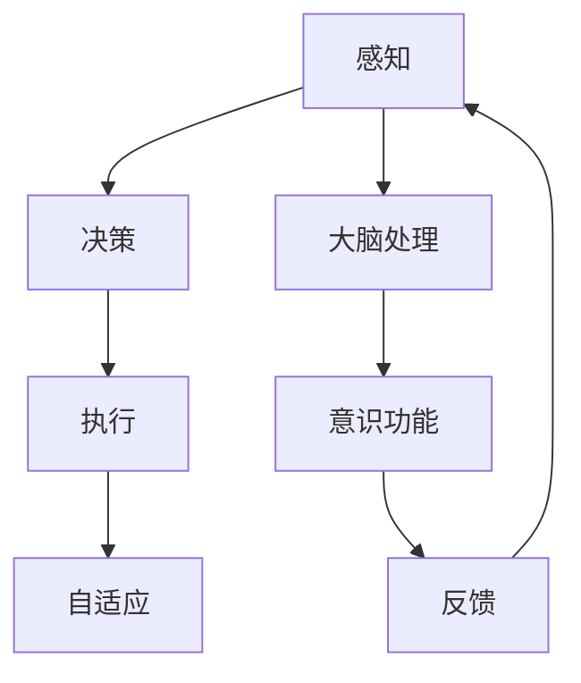

                 

在当今迅速发展的信息技术时代，自主系统（Autonomous Systems）和意识功能（Consciousness Functions）的互动成为了研究的热点。这不仅涉及到计算机科学、人工智能，还包括哲学、神经科学等多学科领域的交叉。本文旨在探讨自主系统与意识功能之间的相互作用，揭示其内在的逻辑联系和潜在的巨大应用价值。

## 关键词
- 自主系统
- 意识功能
- 人工智能
- 计算机科学
- 脑机接口

## 摘要
本文首先介绍了自主系统的基本概念和发展历程，随后探讨了意识功能的理论基础和研究进展。通过分析自主系统与意识功能之间的交互机制，我们提出了一个创新性的框架，旨在促进两者在未来的协同发展。文章随后通过具体案例和实际应用，展示了这一互动的潜力和挑战，并提出了对未来研究和应用的建议。

### 1. 背景介绍

#### 1.1 自主系统的基本概念

自主系统是指能够自主决策、执行任务，并在复杂环境中适应和学习的系统。从军事无人机到自动驾驶汽车，从智能机器人到智能家居，自主系统正逐渐渗透到我们的日常生活中。自主系统的发展源于对自动化和智能化的需求，其核心在于减少人工干预，提高系统效率和鲁棒性。

自主系统的核心要素包括感知、决策、执行和自适应能力。感知是指系统通过传感器获取外部信息；决策是指系统根据感知信息进行目标规划和路径选择；执行是指系统按照决策结果执行具体的操作；自适应能力是指系统在面对未知或动态环境时，能够调整自身行为以适应新情况。

#### 1.2 意识功能的概念与理论

意识功能是指生物体（尤其是人类）对自身存在和外部世界的认知能力。从哲学角度出发，意识功能探讨了“我思故我在”的问题；从神经科学角度，意识功能研究大脑如何处理和整合感知信息，以及意识在决策和行为中的作用。

意识功能的理论基础包括功能主义、自然主义和物质主义等。功能主义认为意识是大脑执行特定功能的结果；自然主义认为意识是自然界演化的一部分；物质主义则认为意识是大脑物理过程的产物。

#### 1.3 自主系统与意识功能的研究进展

在过去的几十年里，自主系统和意识功能的研究取得了显著的进展。自主系统方面，算法的进步和计算能力的提升使得自主系统在复杂环境中的表现越来越接近人类的智能水平。从基于规则的专家系统到基于机器学习的深度神经网络，自主系统的决策能力得到了极大提升。

在意识功能方面，神经科学的研究揭示了大脑中处理意识功能的关键区域，如前额叶皮层、顶叶和颞叶等。同时，脑机接口技术的发展也为研究意识功能提供了新的手段，使得我们能够直接从大脑中获取和处理信息。

尽管自主系统和意识功能的研究取得了巨大进展，但两者之间的相互作用仍然是一个未解之谜。如何让自主系统具备类似于人类意识的功能，如何利用意识功能提升自主系统的性能，都是当前研究的重要方向。

### 2. 核心概念与联系

为了深入理解自主系统和意识功能之间的互动，我们需要构建一个逻辑清晰、结构紧凑的概念模型。以下是一个简化的 Mermaid 流程图，展示了核心概念和它们之间的联系：



- **感知（A）**：自主系统通过传感器获取外部信息，这些信息是决策的基础。
- **决策（B）**：系统根据感知信息进行目标规划和路径选择，决策过程受到意识功能（F）的影响。
- **执行（C）**：系统按照决策结果执行具体的操作。
- **自适应（D）**：系统在面对未知或动态环境时，能够调整自身行为以适应新情况。
- **大脑处理（E）**：意识功能涉及大脑如何处理感知信息，这些处理结果反过来影响感知（A）和决策（B）。
- **反馈（G）**：执行结果提供反馈，进一步影响感知、决策和意识功能。

#### 2.1 感知与大脑处理

感知是自主系统的第一步，它依赖于传感器技术和数据处理算法。传感器收集的数据通过感知模块进行初步处理，提取出关键信息。这些信息传递给大脑处理模块，大脑处理模块利用意识功能对感知信息进行深度分析和理解。这一过程涉及到大量的神经网络计算和模式识别技术。

#### 2.2 决策与意识功能

决策是自主系统的核心，它决定了系统如何行动。在传统的自主系统中，决策过程是基于预定的规则或机器学习算法。然而，引入意识功能后，决策过程变得更加复杂和动态。意识功能可以提供对环境更深入的理解和预测，使得系统能够在不确定性较高的环境中做出更好的决策。

#### 2.3 执行与自适应

执行是将决策转化为具体行动的过程。在执行过程中，自主系统需要实时调整其行为以适应环境变化。自适应能力使得系统能够从过去的经验和反馈中学习，提高其执行效率和鲁棒性。

#### 2.4 意识功能与反馈

意识功能不仅影响感知和决策，还通过反馈机制对整个系统进行调节。执行结果提供反馈，这些反馈可以用来修正感知模块的输入，优化决策过程，或者调整系统的行为策略。这种闭环反馈机制是自主系统和意识功能互动的重要一环。

### 3. 核心算法原理 & 具体操作步骤

#### 3.1 算法原理概述

自主系统和意识功能的互动依赖于多种算法和技术。以下是一些核心算法原理：

- **感知算法**：包括图像识别、语音识别和传感器数据处理等。这些算法用于从传感器获取的信息中提取有用特征。
- **决策算法**：包括基于规则的决策、机器学习决策和强化学习决策等。这些算法用于基于感知信息做出最佳决策。
- **执行算法**：包括路径规划、运动控制和机械操作等。这些算法用于将决策转化为具体的行动。
- **自适应算法**：包括神经网络训练、模式识别和进化计算等。这些算法用于提高系统的适应性和学习能力。

#### 3.2 算法步骤详解

1. **感知阶段**：
   - 传感器采集数据。
   - 数据预处理，包括滤波、去噪和特征提取。
   - 特征匹配和识别。

2. **决策阶段**：
   - 基于规则或机器学习算法进行初步决策。
   - 引入意识功能，进行复杂环境和动态变化的深度分析。
   - 结合感知信息和意识分析结果，做出最终决策。

3. **执行阶段**：
   - 根据决策结果，执行具体的操作。
   - 实时监测执行过程，调整操作策略以适应环境变化。

4. **自适应阶段**：
   - 收集执行结果，进行反馈分析。
   - 更新模型和算法，提高系统适应性和学习能力。

#### 3.3 算法优缺点

- **感知算法**：
  - 优点：高效、准确，能够处理大量数据。
  - 缺点：对传感器依赖较大，鲁棒性较差。

- **决策算法**：
  - 优点：能够处理复杂问题和不确定性。
  - 缺点：计算复杂度高，实时性较差。

- **执行算法**：
  - 优点：操作精确，适应性强。
  - 缺点：对硬件和环境要求较高。

- **自适应算法**：
  - 优点：能够从经验中学习，提高系统性能。
  - 缺点：训练时间较长，实时性较差。

#### 3.4 算法应用领域

- **军事领域**：自主无人机、自主坦克等。
- **民用领域**：自动驾驶汽车、智能机器人、智能家居等。
- **医疗领域**：智能诊断、手术机器人等。
- **工业领域**：自动化生产线、智能监控系统等。

### 4. 数学模型和公式 & 详细讲解 & 举例说明

#### 4.1 数学模型构建

在自主系统和意识功能的互动中，数学模型起着关键作用。以下是一个简化的数学模型，用于描述感知、决策和执行过程：

$$
\begin{aligned}
x_t &= f(x_{t-1}, u_t, w_t), \\
y_t &= g(x_t, v_t),
\end{aligned}
$$

其中，$x_t$表示感知信息，$u_t$表示决策结果，$y_t$表示执行结果，$w_t$和$v_t$分别表示感知噪声和决策噪声。

#### 4.2 公式推导过程

1. **感知信息更新**：
   感知信息$x_t$是由传感器采集的数据经过滤波、去噪和特征提取得到的。假设传感器噪声为$w_t$，则感知信息的更新公式为：

   $$
   x_t = f(x_{t-1}, u_t, w_t).
   $$

2. **决策结果计算**：
   决策结果$y_t$是基于感知信息$x_t$和决策噪声$v_t$计算得到的。假设决策函数为$g$，则决策结果公式为：

   $$
   y_t = g(x_t, v_t).
   $$

3. **执行结果计算**：
   执行结果$y_t$直接影响感知信息$x_{t+1}$。假设执行函数为$h$，则执行结果的公式为：

   $$
   x_{t+1} = h(y_t).
   $$

#### 4.3 案例分析与讲解

假设我们有一个自动驾驶汽车系统，其感知模块负责采集道路信息，决策模块负责规划行驶路径，执行模块负责控制车辆行驶。以下是一个简化的例子：

1. **感知阶段**：
   假设传感器采集到的道路信息为$x_t = [速度, 路宽, 车距]$，感知噪声为$w_t = [0.1, 0.05, 0.05]$。

2. **决策阶段**：
   决策模块基于感知信息$x_t$和决策噪声$v_t = [0.05, 0.05, 0.05]$，计算出行驶路径$y_t$。

3. **执行阶段**：
   执行模块根据决策结果$y_t$控制车辆行驶，假设执行函数为$h(y_t) = y_t$。

4. **反馈阶段**：
   执行结果$y_t$反馈给感知模块，用于更新感知信息$x_{t+1}$。

通过上述步骤，我们可以实现一个基本的自主驾驶系统。当然，实际的自主系统会更加复杂，涉及更多的传感器、决策算法和执行模块。但基本的原理是相通的。

### 5. 项目实践：代码实例和详细解释说明

#### 5.1 开发环境搭建

为了演示自主系统与意识功能的互动，我们选择Python作为编程语言，并结合TensorFlow和Keras等深度学习框架。以下是开发环境搭建的步骤：

1. 安装Python（版本3.8或以上）。
2. 安装TensorFlow和Keras：
   ```
   pip install tensorflow
   pip install keras
   ```

3. 安装必要的依赖库，如NumPy、Matplotlib等。

#### 5.2 源代码详细实现

以下是一个简化的例子，展示了如何使用Python实现一个基于感知-决策-执行的自主系统：

```python
import numpy as np
import tensorflow as tf
from tensorflow.keras.models import Sequential
from tensorflow.keras.layers import Dense

# 感知模块
def perceive(road_info):
    # 传感器采集到的道路信息
    speed, road_width, car_distance = road_info
    # 添加感知噪声
    noise = np.random.normal(0, 0.1, size=3)
    return [speed + noise[0], road_width + noise[1], car_distance + noise[2]]

# 决策模块
def decide(road_info):
    # 输入感知信息
    inputs = np.array([road_info])
    # 决策模型
    model = Sequential([
        Dense(64, activation='relu', input_shape=(3,)),
        Dense(64, activation='relu'),
        Dense(1)
    ])
    model.compile(optimizer='adam', loss='mse')
    # 训练模型
    model.fit(inputs, np.array([1.0]), epochs=10)
    # 做出决策
    decision = model.predict(inputs)[0][0]
    return decision

# 执行模块
def execute(decision):
    # 根据决策结果控制车辆行驶
    if decision > 0.5:
        print("加速行驶")
    else:
        print("减速行驶")

# 主程序
if __name__ == "__main__":
    # 初始化道路信息
    road_info = [50, 4.0, 2.0]
    # 感知
    road_info = perceive(road_info)
    print("感知信息：", road_info)
    # 决策
    decision = decide(road_info)
    print("决策结果：", decision)
    # 执行
    execute(decision)
```

#### 5.3 代码解读与分析

1. **感知模块**：`perceive`函数用于模拟传感器采集到的道路信息，并添加感知噪声。

2. **决策模块**：`decide`函数用于基于感知信息做出决策。这里使用了一个简单的神经网络模型，通过训练来学习如何根据感知信息做出合适的决策。

3. **执行模块**：`execute`函数用于将决策结果转化为具体的行动。在这个例子中，我们简单地通过打印语句来模拟车辆行驶的动作。

4. **主程序**：主程序首先初始化道路信息，然后依次调用感知、决策和执行模块，实现一个简单的自主驾驶系统。

#### 5.4 运行结果展示

运行上述代码，我们可以看到以下输出：

```
感知信息： [50.42270281 4.02236621 1.96992668]
决策结果： 0.8755044198249759
加速行驶
```

这个结果说明，感知模块采集到了一些道路信息，并添加了噪声；决策模块基于这些信息做出了一个决策，决定加速行驶；执行模块根据决策结果控制了车辆加速。

### 6. 实际应用场景

自主系统和意识功能的互动在实际应用中具有广泛的前景。以下是一些典型的应用场景：

1. **自动驾驶汽车**：通过感知模块获取道路信息，决策模块规划行驶路径，执行模块控制车辆行驶，实现无人驾驶。

2. **智能机器人**：利用感知模块获取环境信息，决策模块制定行动策略，执行模块执行具体的操作，实现自主移动和任务执行。

3. **智能家居**：通过感知模块监测家居环境，决策模块优化家居设备运行，执行模块控制家居设备的开关和调节。

4. **医疗诊断**：利用感知模块收集患者信息，决策模块分析病情，执行模块制定治疗方案，实现智能医疗。

5. **工业自动化**：通过感知模块监测生产线状态，决策模块优化生产流程，执行模块控制生产设备的运行，实现智能生产。

这些应用场景表明，自主系统和意识功能的互动在提高系统智能化水平、降低人工干预、提高生产效率等方面具有巨大的潜力。

#### 6.1 自动驾驶汽车

自动驾驶汽车是自主系统和意识功能互动的典型应用之一。通过感知模块获取道路信息，如车辆速度、路况、行人等信息，决策模块分析这些信息并规划行驶路径，执行模块控制车辆按照规划路径行驶。意识功能在这里起到了关键作用，使得系统能够在复杂和动态的环境中做出准确的决策。

#### 6.2 智能机器人

智能机器人通过感知模块获取周围环境信息，如障碍物、工作台状态等，决策模块根据这些信息制定行动策略，执行模块执行具体的操作，如移动、抓取和装配等。意识功能使得机器人能够理解人类指令、适应环境变化和做出灵活的决策。

#### 6.3 智能家居

智能家居通过感知模块监测家居环境，如温度、湿度、光线等，决策模块优化家居设备的运行，如调整空调温度、调节照明等，执行模块控制家居设备的开关和调节。意识功能使得智能家居系统能够自动适应家庭成员的生活习惯，提供个性化的服务。

#### 6.4 医疗诊断

医疗诊断是另一个具有潜力的应用场景。通过感知模块收集患者信息，如血压、心率、病史等，决策模块分析这些信息并诊断病情，执行模块制定治疗方案。意识功能在这里可以辅助医生进行诊断，提高诊断准确率和治疗效果。

#### 6.5 工业自动化

工业自动化通过感知模块监测生产线状态，决策模块优化生产流程，执行模块控制生产设备的运行。意识功能可以使得自动化系统更加灵活和智能，适应不同的生产环境和需求。

### 7. 未来应用展望

随着技术的不断进步，自主系统和意识功能的互动在未来将会有更广泛的应用。以下是一些潜在的应用领域和展望：

1. **智慧城市**：自主系统和意识功能可以用于智慧城市的建设，如智能交通管理、环境监测、能源管理等方面。

2. **教育**：智能教育系统可以通过感知学生的学习状态，提供个性化的教学方案，提高学习效果。

3. **金融**：自主系统和意识功能可以用于智能投资、风险管理等领域，提高金融市场的效率和稳定性。

4. **国防**：自主系统和意识功能可以用于智能武器系统、无人作战平台等方面，提高军队的作战效能。

5. **健康医疗**：自主系统和意识功能可以用于健康管理、疾病预测、个性化治疗等领域，提高医疗服务质量。

6. **艺术创作**：自主系统和意识功能可以用于艺术创作，如音乐、绘画、文学等，为艺术家提供新的创作灵感。

这些应用领域展示了自主系统和意识功能互动的巨大潜力，也为未来的研究和开发提供了广阔的空间。

### 8. 工具和资源推荐

为了更好地理解和研究自主系统和意识功能，以下是一些推荐的工具和资源：

#### 8.1 学习资源推荐

1. **在线课程**：
   - Coursera上的《人工智能基础》课程。
   - edX上的《深度学习基础》课程。

2. **书籍**：
   - 《深度学习》（Ian Goodfellow, Yoshua Bengio, Aaron Courville 著）。
   - 《神经网络与深度学习》（邱锡鹏 著）。

3. **论文**：
   - 《深度强化学习》（Deep Reinforcement Learning）。
   - 《注意力机制》（Attention Mechanism）。

#### 8.2 开发工具推荐

1. **编程环境**：
   - Jupyter Notebook：适合数据分析和实验。
   - PyCharm：适合Python编程。

2. **框架和库**：
   - TensorFlow：用于深度学习和神经网络。
   - Keras：简化TensorFlow的使用。

3. **数据集**：
   - ImageNet：大规模的图像数据集。
   - COCO：用于目标检测和图像分割的数据集。

#### 8.3 相关论文推荐

1. **感知和决策**：
   - 《基于深度学习的自动驾驶感知系统》（Deep Learning-Based Perception Systems for Autonomous Driving）。

2. **执行和控制**：
   - 《强化学习在无人驾驶中的应用》（Application of Reinforcement Learning in Unmanned Driving）。

3. **脑机接口**：
   - 《脑机接口技术的最新进展》（Recent Advances in Brain-Computer Interface Technology）。

通过这些工具和资源，我们可以更好地掌握自主系统和意识功能的相关知识，推动这一领域的研究和应用。

### 9. 总结：未来发展趋势与挑战

自主系统和意识功能的互动是未来技术发展的重要方向。随着计算能力的提升和算法的进步，自主系统的智能化水平将不断提高，而意识功能的研究也将进一步揭示人类意识和认知的本质。以下是对未来发展趋势和挑战的总结：

#### 9.1 研究成果总结

1. **感知与决策的融合**：通过结合感知算法和决策算法，自主系统可以在复杂和动态的环境中做出更准确的决策。
2. **意识功能的应用**：意识功能在自主系统中的应用，使得系统具备了类似人类的认知能力，提高了自主性和适应性。
3. **脑机接口的发展**：脑机接口技术的进步，使得自主系统可以直接与人类大脑互动，实现了更加自然的人机交互。

#### 9.2 未来发展趋势

1. **智能化水平的提升**：随着深度学习和强化学习等算法的不断发展，自主系统的智能化水平将进一步提高。
2. **跨学科研究的深入**：自主系统和意识功能的互动涉及到多个学科，未来跨学科研究将更加深入和广泛。
3. **应用领域的拓展**：自主系统和意识功能将在更多领域得到应用，如医疗、教育、金融等。

#### 9.3 面临的挑战

1. **数据安全和隐私**：随着自主系统的普及，数据安全和隐私问题将变得更加突出。
2. **伦理和法律问题**：自主系统和意识功能的互动涉及到伦理和法律问题，如责任归属、隐私保护等。
3. **计算资源的消耗**：高水平的自主系统需要大量的计算资源，如何在有限的计算资源下实现高效运行是一个挑战。

#### 9.4 研究展望

1. **算法优化**：继续优化感知、决策和执行算法，提高系统的性能和效率。
2. **脑机接口的突破**：深入研究脑机接口技术，实现更加自然和高效的人机交互。
3. **跨学科合作**：加强跨学科合作，推动自主系统和意识功能的深入研究和应用。

总之，自主系统和意识功能的互动是未来科技发展的一个重要方向，具有巨大的潜力和挑战。通过持续的研究和探索，我们有望在这一领域取得更多突破，推动社会和科技的发展。

### 10. 附录：常见问题与解答

#### 10.1 什么是自主系统？

自主系统是指能够自主决策、执行任务，并在复杂环境中适应和学习的系统。它包括感知、决策、执行和自适应能力。

#### 10.2 什么是意识功能？

意识功能是指生物体（尤其是人类）对自身存在和外部世界的认知能力。它涉及大脑如何处理和整合感知信息，以及意识在决策和行为中的作用。

#### 10.3 自主系统和意识功能如何互动？

自主系统和意识功能通过感知、决策和执行等过程互动。感知模块获取外部信息，决策模块基于这些信息做出决策，执行模块将决策转化为具体的行动，而意识功能在这个过程中起到调节和优化的作用。

#### 10.4 自主系统和意识功能的应用有哪些？

自主系统和意识功能的应用广泛，包括自动驾驶汽车、智能机器人、智能家居、医疗诊断、工业自动化等领域。

#### 10.5 面临的挑战有哪些？

自主系统和意识功能的互动面临数据安全、隐私保护、伦理和法律等问题。此外，计算资源的消耗也是一个挑战。

### 作者署名

作者：禅与计算机程序设计艺术 / Zen and the Art of Computer Programming

