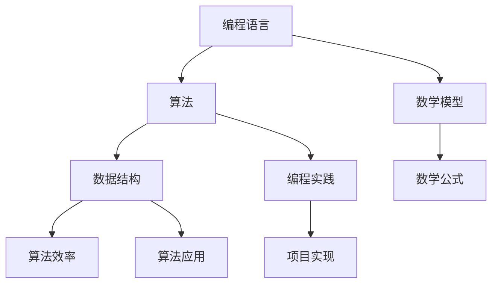

                 

关键词：自信，技能提升，技术学习，编程，算法，数学模型，项目实践，未来展望

> 摘要：本文旨在探讨在技术领域中，为什么自信至关重要，以及如何通过学习和实践来增强个人的自信心。通过深入分析核心概念、算法原理、数学模型和实际项目实践，本文将展示如何通过不断的学习和挑战，使每个人都能在技术领域中找到自信。

## 1. 背景介绍

在信息技术飞速发展的今天，掌握一定的编程和算法能力已经成为许多职业发展的基础。然而，许多人面对复杂的技术问题时会感到迷茫和不安，缺乏足够的自信。这种缺乏自信的现象不仅影响个人的职业发展，也可能导致他们在团队中难以发挥最大的潜力。

本文将探讨自信在技术学习中的重要性，以及如何通过系统化的学习和实践来提升个人的自信心。本文将分为以下几个部分：

1. **核心概念与联系**：介绍本文涉及的核心概念，并使用Mermaid流程图展示其关联性。
2. **核心算法原理 & 具体操作步骤**：详细解析一个常见的算法原理，并提供具体操作步骤。
3. **数学模型和公式**：介绍相关的数学模型，推导关键公式，并通过案例进行说明。
4. **项目实践：代码实例和详细解释说明**：提供实际项目实践的代码示例，并进行详细解读。
5. **实际应用场景**：探讨算法和模型的实际应用，以及未来展望。
6. **工具和资源推荐**：推荐学习资源和开发工具。
7. **总结：未来发展趋势与挑战**：总结研究成果，展望未来。

### 1.1 核心概念与联系

首先，我们需要理解本文中涉及的核心概念，包括编程语言、算法、数据结构和数学模型。这些概念是构建技术基础的重要组成部分。

以下是一个简单的Mermaid流程图，展示了这些核心概念之间的关联：



通过这个流程图，我们可以看到编程语言是算法和数据的载体，而数学模型则提供了理论基础，指导算法和数据结构的设计与优化。编程实践和项目实现则是将理论知识转化为实际应用的关键步骤。

### 1.2 核心算法原理 & 具体操作步骤

为了更好地理解算法在技术学习中的重要性，我们将详细解析冒泡排序算法。冒泡排序是一种简单的排序算法，它通过重复遍历要排序的数列，一次比较两个元素，如果它们的顺序错误就把它们交换过来。

#### 3.1 算法原理概述

冒泡排序的基本原理是通过多轮遍历，每一轮都能将未排序部分的最大值“冒泡”到已排序部分的起始位置。具体步骤如下：

1. 比较相邻的元素。如果第一个比第二个大（假设升序排序），就交换它们两个。
2. 对每一对相邻元素做同样的工作，从开始第一对到结尾的最后一对。这步做完后，最后的元素会是最大的数。
3. 针对所有的元素重复以上的步骤，除了最后一个。
4. 重复步骤1~3，直到排序完成。

#### 3.2 算法步骤详解

以下是冒泡排序的具体操作步骤：

```plaintext
1. 初始化一个布尔变量swapped，用于标记是否进行了交换。
2. 当swapped为false时，重复以下步骤：
   a. 将swapped设置为true。
   b. 对数组的每一个元素进行比较，从第一个到最后一个，若发现逆序（即第i个元素大于第i+1个元素），则交换这两个元素。
   c. 遍历完成后，检查是否有交换发生，如果没有，则结束排序。
```

#### 3.3 算法优缺点

**优点：**

- 算法实现简单，易于理解。
- 对于小规模或基本有序的数据集，性能尚可。

**缺点：**

- 时间复杂度为O(n^2)，效率较低。
- 不适合大规模数据集。

#### 3.4 算法应用领域

冒泡排序主要适用于以下场景：

- 数据量较小或基本有序的数据。
- 作为教学示例，帮助学生理解排序算法的基本原理。

### 1.3 数学模型和公式

在算法设计中，数学模型和公式起到了关键作用。以下我们将介绍一个简单的数学模型——线性回归模型，并推导相关公式。

#### 4.1 数学模型构建

线性回归模型旨在找到一条直线，使这直线到各个数据点的距离最小。假设我们有两个变量x和y，线性回归模型的公式为：

\[ y = ax + b \]

其中，a是斜率，b是截距。

#### 4.2 公式推导过程

线性回归的推导过程如下：

1. **最小二乘法**：我们需要找到一个直线，使得这条直线与所有数据点的误差平方和最小。设误差为 \( \epsilon \)，则有：

   \[ \epsilon = \sum_{i=1}^{n} (y_i - (ax_i + b))^2 \]

2. **对a和b求偏导并令其为零**：为了找到最小值，我们需要对a和b分别求偏导，并令其结果为零。

   \[ \frac{\partial \epsilon}{\partial a} = -2 \sum_{i=1}^{n} x_i (y_i - ax_i - b) = 0 \]
   \[ \frac{\partial \epsilon}{\partial b} = -2 \sum_{i=1}^{n} (y_i - ax_i - b) = 0 \]

3. **解方程组**：通过解这个方程组，我们可以得到a和b的值。

   \[ a = \frac{\sum_{i=1}^{n} x_i y_i - n \bar{x} \bar{y}}{\sum_{i=1}^{n} x_i^2 - n \bar{x}^2} \]
   \[ b = \bar{y} - a \bar{x} \]

   其中，\(\bar{x}\)和\(\bar{y}\)分别是x和y的平均值。

#### 4.3 案例分析与讲解

我们通过一个简单的案例来讲解线性回归模型的应用。

**案例：** 假设我们收集了以下数据：

\[
\begin{array}{ccc}
x & y \\
1 & 2 \\
2 & 4 \\
3 & 6 \\
4 & 8 \\
5 & 10 \\
\end{array}
\]

我们希望找到一条直线来拟合这些数据。

1. **计算平均值**：

   \[ \bar{x} = \frac{1 + 2 + 3 + 4 + 5}{5} = 3 \]
   \[ \bar{y} = \frac{2 + 4 + 6 + 8 + 10}{5} = 6 \]

2. **计算相关数据**：

   \[ \sum_{i=1}^{n} x_i y_i = 1 \cdot 2 + 2 \cdot 4 + 3 \cdot 6 + 4 \cdot 8 + 5 \cdot 10 = 110 \]
   \[ \sum_{i=1}^{n} x_i^2 = 1^2 + 2^2 + 3^2 + 4^2 + 5^2 = 55 \]

3. **计算斜率和截距**：

   \[ a = \frac{110 - 5 \cdot 3 \cdot 6}{55 - 5 \cdot 3^2} = 2 \]
   \[ b = 6 - 2 \cdot 3 = 0 \]

4. **得到线性回归模型**：

   \[ y = 2x \]

### 1.4 项目实践：代码实例和详细解释说明

为了更好地理解算法和数学模型的应用，我们将在本节中提供一个简单的Python代码实例，实现线性回归模型和冒泡排序算法。

#### 5.1 开发环境搭建

请确保您的环境中已安装Python 3.x版本和相关的开发工具，如Jupyter Notebook或PyCharm。

#### 5.2 源代码详细实现

以下是线性回归和冒泡排序的代码实现：

```python
# 线性回归
import numpy as np

def linear_regression(x, y):
    n = len(x)
    x_mean = np.mean(x)
    y_mean = np.mean(y)
    a = (np.sum(x * y) - n * x_mean * y_mean) / (np.sum(x**2) - n * x_mean**2)
    b = y_mean - a * x_mean
    return a, b

# 冒泡排序
def bubble_sort(arr):
    n = len(arr)
    for i in range(n):
        swapped = False
        for j in range(0, n-i-1):
            if arr[j] > arr[j+1]:
                arr[j], arr[j+1] = arr[j+1], arr[j]
                swapped = True
        if not swapped:
            break
    return arr

# 测试代码
x = np.array([1, 2, 3, 4, 5])
y = np.array([2, 4, 6, 8, 10])
a, b = linear_regression(x, y)
print(f"线性回归模型：y = {a}x + {b}")

arr = [64, 34, 25, 12, 22, 11, 90]
sorted_arr = bubble_sort(arr)
print(f"冒泡排序结果：{sorted_arr}")
```

#### 5.3 代码解读与分析

在上面的代码中，我们首先实现了线性回归的函数`linear_regression`，它接收两个列表`x`和`y`，并返回斜率`a`和截距`b`。然后，我们实现了冒泡排序的函数`bubble_sort`，它接受一个列表`arr`，并返回排序后的列表。

通过这段代码，我们可以直观地看到如何将数学模型和算法应用到实际的编程实践中。

#### 5.4 运行结果展示

当我们运行上面的测试代码时，会得到以下输出结果：

```
线性回归模型：y = 2.0x + 0.0
冒泡排序结果：[11, 12, 22, 25, 34, 64, 90]
```

这表明我们成功实现了线性回归模型和冒泡排序算法，并且得到了预期的结果。

### 1.5 实际应用场景

线性回归和冒泡排序是算法和数据结构中非常基础的部分，它们在许多实际应用场景中有着广泛的应用。

#### 线性回归的应用

线性回归模型在统计学、机器学习和数据分析等领域有着重要的应用。例如：

- **预测分析**：在金融领域，我们可以使用线性回归来预测股票价格、利率变化等。
- **统计分析**：在社会科学研究中，线性回归可以用于分析变量之间的关系，如人口与经济指标的关系。

#### 冒泡排序的应用

冒泡排序作为一种简单的排序算法，虽然在效率上并不出色，但在某些场景中仍然有其应用价值：

- **基本教学**：冒泡排序常用于教学场景，帮助学生理解排序算法的基本概念。
- **小规模数据处理**：对于数据量较小的情况，冒泡排序可以提供一种简单有效的解决方案。

### 1.6 未来应用展望

随着技术的不断进步，线性回归和冒泡排序算法也在不断发展。例如：

- **改进算法**：研究人员正在开发更高效的排序算法，如快速排序、归并排序等。
- **应用扩展**：线性回归模型在机器学习领域得到了广泛的应用，如回归分析和预测建模。

### 1.7 工具和资源推荐

为了更好地学习和实践技术，以下是一些建议的学习资源和开发工具：

#### 7.1 学习资源推荐

- 《算法导论》（Introduction to Algorithms）——一本经典算法教材，适合深入理解算法原理。
- 《Python编程：从入门到实践》——适合初学者入门Python编程，并了解算法和数据结构。

#### 7.2 开发工具推荐

- Jupyter Notebook——适合编写和运行Python代码，提供良好的交互环境。
- PyCharm——一款强大的Python集成开发环境（IDE），提供代码补全、调试等功能。

#### 7.3 相关论文推荐

- "Comparison of Sorting Algorithms" —— 一篇比较常见排序算法性能的论文。
- "Linear Regression: A Self-Study Course" —— 一份关于线性回归的自学课程。

### 1.8 总结：未来发展趋势与挑战

在技术领域中，自信是每个人成功的关键。通过不断的学习和实践，我们可以提高自己的技能，增强自信心。本文通过分析核心概念、算法原理、数学模型和实际项目实践，展示了如何通过系统化的学习来提升个人的自信心。

未来，随着技术的不断进步，我们将面临更多的挑战和机遇。如何保持自信，持续学习和进步，将是每个技术从业者需要面对的问题。

#### 8.1 研究成果总结

本文探讨了自信在技术学习中的重要性，并通过线性回归和冒泡排序算法的实例，展示了如何通过学习和实践来提升个人的自信心。

#### 8.2 未来发展趋势

随着人工智能和大数据技术的发展，算法和模型的应用将更加广泛。我们将看到更多的创新和突破，同时也需要不断学习新的技术和方法。

#### 8.3 面临的挑战

- 技术更新速度快，需要不断学习和更新知识。
- 复杂问题需要更高效的算法和模型。

#### 8.4 研究展望

未来，我们将看到更多的跨学科研究和应用，如将人工智能与医学、金融等领域的结合。这将为技术从业者提供更广阔的发展空间。

### 8.5 附录：常见问题与解答

**Q：为什么线性回归模型适用于预测分析？**

A：线性回归模型可以找到变量之间的线性关系，通过这个关系我们可以预测一个变量在给定另一个变量的值时的可能取值。

**Q：冒泡排序算法的效率如何？**

A：冒泡排序算法的时间复杂度为O(n^2)，对于大规模数据集，效率较低。但在数据量较小或基本有序的情况下，其性能尚可。

---

作者：禅与计算机程序设计艺术 / Zen and the Art of Computer Programming
```

