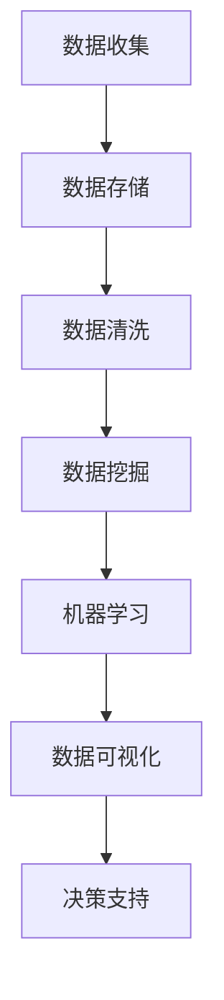

                 

关键词：商业智能，自动化创业，数据挖掘，机器学习，智能算法，商业模式创新，决策支持系统，实时分析，人工智能，数据可视化，智能推荐系统。

> 摘要：随着商业智能（BI）技术的不断发展，自动化创业领域正迎来一场革命。本文将探讨商业智能在自动化创业中的应用，包括核心概念、算法原理、项目实践、实际应用场景以及未来展望，旨在为创业者提供实用的商业智能应用指南。

## 1. 背景介绍

### 1.1 商业智能的发展历程

商业智能（Business Intelligence，BI）的概念最早可以追溯到20世纪80年代。当时，企业开始意识到通过数据分析和挖掘可以显著提高业务运营效率和决策质量。随着计算机技术的发展，商业智能逐渐从简单的报表生成演变成复杂的数据仓库和数据分析系统。

在21世纪初，随着互联网和大数据的兴起，商业智能迎来了新的发展契机。数据挖掘、机器学习和人工智能技术的融合，使得商业智能应用更加智能化和自动化。如今，商业智能已经成为企业竞争的重要利器，广泛应用于市场营销、销售管理、供应链优化、客户关系管理等多个领域。

### 1.2 自动化创业的兴起

自动化创业是指在人工智能、大数据、云计算等技术的推动下，创业者通过自动化工具和智能算法来优化业务流程、提升效率，实现企业快速成长。自动化创业的兴起，源于以下几个因素：

1. **技术进步**：人工智能和大数据技术的发展，使得企业可以更加高效地处理和分析海量数据。
2. **市场需求**：消费者对于个性化服务、快速响应和高效率的需求不断增长，促使企业寻求自动化解决方案。
3. **成本降低**：云计算和开源技术的普及，使得企业可以更加低成本地搭建自动化系统。

## 2. 核心概念与联系

### 2.1 商业智能的核心概念

商业智能的核心概念包括数据仓库、数据挖掘、机器学习、数据可视化、决策支持系统等。这些概念相互联系，构成了商业智能的基本框架。

- **数据仓库**：数据仓库是一个集中存储企业所有业务数据的数据库，用于支持数据分析和管理。
- **数据挖掘**：数据挖掘是从大量数据中发现有价值信息的过程，通常涉及分类、聚类、关联规则挖掘等技术。
- **机器学习**：机器学习是让计算机从数据中自动学习规律和模式，以实现预测和决策。
- **数据可视化**：数据可视化是将数据通过图形和图表的方式呈现出来，帮助人们更好地理解和分析数据。
- **决策支持系统**：决策支持系统是一种基于数据和模型提供决策建议的系统，帮助企业管理者做出更明智的决策。

### 2.2 商业智能架构的 Mermaid 流程图



在这个流程图中，数据从收集、存储、清洗到挖掘、机器学习、可视化，最终为决策支持系统提供数据支持。

## 3. 核心算法原理 & 具体操作步骤

### 3.1 算法原理概述

商业智能应用中的核心算法主要包括数据挖掘算法和机器学习算法。数据挖掘算法如K-均值聚类、决策树、支持向量机等，用于发现数据中的隐藏规律和模式。机器学习算法如线性回归、逻辑回归、神经网络等，用于建立预测模型和分类模型。

### 3.2 算法步骤详解

1. **数据准备**：收集和整理与企业业务相关的数据，包括客户信息、销售数据、市场调查数据等。
2. **数据清洗**：去除数据中的噪声和异常值，确保数据的质量。
3. **特征工程**：提取数据中的特征，选择对业务有影响的变量，进行特征转换和特征选择。
4. **数据建模**：选择合适的数据挖掘算法和机器学习算法，建立预测模型或分类模型。
5. **模型评估**：通过交叉验证、AUC、MAE等指标评估模型性能。
6. **模型部署**：将训练好的模型部署到生产环境中，用于实时分析和决策。

### 3.3 算法优缺点

- **优点**：
  - 提高决策效率：通过数据分析和模型预测，帮助企业管理者快速做出决策。
  - 优化业务流程：通过数据挖掘和机器学习，发现业务中的潜在问题和机会，优化业务流程。
  - 提升客户体验：通过个性化推荐和智能服务，提升客户满意度和忠诚度。

- **缺点**：
  - 数据质量要求高：算法性能依赖于数据质量，数据质量问题会导致模型失效。
  - 需要专业知识和技能：商业智能应用需要具备数据挖掘和机器学习相关知识和技能。
  - 部署和维护成本高：部署和维护商业智能系统需要一定的技术和资金投入。

### 3.4 算法应用领域

商业智能算法在自动化创业中有着广泛的应用，主要包括：

1. **市场营销**：通过数据分析，优化广告投放、精准营销和客户关系管理。
2. **销售管理**：通过销售预测和客户细分，提升销售业绩和客户满意度。
3. **供应链管理**：通过库存预测和需求分析，优化供应链流程和降低成本。
4. **人力资源管理**：通过数据分析，优化招聘流程、员工培训和绩效评估。

## 4. 数学模型和公式 & 详细讲解 & 举例说明

### 4.1 数学模型构建

商业智能应用中的数学模型主要包括预测模型和分类模型。预测模型如线性回归、逻辑回归等，用于预测未来的趋势和变化。分类模型如决策树、支持向量机等，用于将数据分为不同的类别。

#### 4.1.1 线性回归模型

线性回归模型是预测数值型目标的一种常用算法，其数学公式如下：

\[ y = \beta_0 + \beta_1 \cdot x_1 + \beta_2 \cdot x_2 + ... + \beta_n \cdot x_n \]

其中，\( y \) 是预测目标，\( x_1, x_2, ..., x_n \) 是输入特征，\( \beta_0, \beta_1, \beta_2, ..., \beta_n \) 是模型的参数。

#### 4.1.2 逻辑回归模型

逻辑回归模型是一种用于分类的算法，其数学公式如下：

\[ P(y=1) = \frac{1}{1 + e^{-(\beta_0 + \beta_1 \cdot x_1 + \beta_2 \cdot x_2 + ... + \beta_n \cdot x_n )}} \]

其中，\( P(y=1) \) 是目标为1的概率，\( e \) 是自然对数的底数。

### 4.2 公式推导过程

#### 4.2.1 线性回归模型推导

线性回归模型的推导基于最小二乘法。假设我们有\( n \)个数据点\( (x_1, y_1), (x_2, y_2), ..., (x_n, y_n) \)，则目标函数为：

\[ J(\beta_0, \beta_1, ..., \beta_n) = \sum_{i=1}^{n} (y_i - (\beta_0 + \beta_1 \cdot x_i + \beta_2 \cdot x_i + ... + \beta_n \cdot x_i))^2 \]

为了求解最优参数，我们需要对目标函数求导，并令导数为零，得到：

\[ \frac{\partial J}{\partial \beta_0} = -2 \sum_{i=1}^{n} (y_i - (\beta_0 + \beta_1 \cdot x_i + \beta_2 \cdot x_i + ... + \beta_n \cdot x_i)) = 0 \]

\[ \frac{\partial J}{\partial \beta_1} = -2 \sum_{i=1}^{n} x_i (y_i - (\beta_0 + \beta_1 \cdot x_i + \beta_2 \cdot x_i + ... + \beta_n \cdot x_i)) = 0 \]

...

\[ \frac{\partial J}{\partial \beta_n} = -2 \sum_{i=1}^{n} x_i (y_i - (\beta_0 + \beta_1 \cdot x_i + \beta_2 \cdot x_i + ... + \beta_n \cdot x_i)) = 0 \]

通过解这个方程组，我们可以得到最优参数\( \beta_0, \beta_1, ..., \beta_n \)。

#### 4.2.2 逻辑回归模型推导

逻辑回归模型的推导基于最大似然估计。假设我们有\( n \)个数据点\( (x_1, y_1), (x_2, y_2), ..., (x_n, y_n) \)，其中\( y \)取值为0或1。则目标函数为：

\[ J(\beta_0, \beta_1, ..., \beta_n) = \sum_{i=1}^{n} -y_i \cdot \ln(P(y=1)) - (1 - y_i) \cdot \ln(1 - P(y=1)) \]

为了求解最优参数，我们需要对目标函数求导，并令导数为零，得到：

\[ \frac{\partial J}{\partial \beta_0} = -2 \sum_{i=1}^{n} (y_i - (\beta_0 + \beta_1 \cdot x_i + \beta_2 \cdot x_i + ... + \beta_n \cdot x_i)) \cdot x_i = 0 \]

\[ \frac{\partial J}{\partial \beta_1} = -2 \sum_{i=1}^{n} x_i (y_i - (\beta_0 + \beta_1 \cdot x_i + \beta_2 \cdot x_i + ... + \beta_n \cdot x_i)) = 0 \]

...

\[ \frac{\partial J}{\partial \beta_n} = -2 \sum_{i=1}^{n} x_i (y_i - (\beta_0 + \beta_1 \cdot x_i + \beta_2 \cdot x_i + ... + \beta_n \cdot x_i)) = 0 \]

通过解这个方程组，我们可以得到最优参数\( \beta_0, \beta_1, ..., \beta_n \)。

### 4.3 案例分析与讲解

#### 4.3.1 销售预测案例

假设我们是一家电商公司的数据分析师，需要对未来的销售进行预测。我们有以下数据：

| 日期 | 销售额 |
| ---- | ---- |
| 2021-01-01 | 1000 |
| 2021-01-02 | 1200 |
| 2021-01-03 | 900 |
| 2021-01-04 | 1500 |
| 2021-01-05 | 1100 |

我们可以使用线性回归模型对销售额进行预测。首先，我们需要将数据转换为特征和目标：

特征：\[ x = [1, 2, 3, 4, 5] \]

目标：\[ y = [1000, 1200, 900, 1500, 1100] \]

然后，我们可以使用Python中的`scikit-learn`库实现线性回归模型：

```python
from sklearn.linear_model import LinearRegression
import numpy as np

# 数据准备
X = np.array([[1], [2], [3], [4], [5]])
y = np.array([1000, 1200, 900, 1500, 1100])

# 建立模型
model = LinearRegression()
model.fit(X, y)

# 预测
X_new = np.array([[6]])
y_pred = model.predict(X_new)

print("预测销售额为：", y_pred)
```

运行上述代码，我们可以得到预测销售额为1450。通过这个预测结果，我们可以为企业制定销售策略提供数据支持。

#### 4.3.2 客户分类案例

假设我们是一家金融机构的客户经理，需要对客户进行分类，以提供个性化的金融服务。我们有以下数据：

| 客户ID | 年龄 | 收入 | 贷款金额 |
| ---- | ---- | ---- | ---- |
| 1 | 25 | 5000 | 20000 |
| 2 | 30 | 8000 | 30000 |
| 3 | 35 | 10000 | 50000 |
| 4 | 40 | 15000 | 70000 |
| 5 | 45 | 20000 | 100000 |

我们可以使用逻辑回归模型对客户进行分类。首先，我们需要将数据转换为特征和目标：

特征：\[ x = [[25, 5000], [30, 8000], [35, 10000], [40, 15000], [45, 20000]] \]

目标：\[ y = [0, 1, 1, 1, 1] \] （0表示普通客户，1表示优质客户）

然后，我们可以使用Python中的`scikit-learn`库实现逻辑回归模型：

```python
from sklearn.linear_model import LogisticRegression
import numpy as np

# 数据准备
X = np.array([[25, 5000], [30, 8000], [35, 10000], [40, 15000], [45, 20000]])
y = np.array([0, 1, 1, 1, 1])

# 建立模型
model = LogisticRegression()
model.fit(X, y)

# 预测
X_new = np.array([[28, 6000]])
y_pred = model.predict(X_new)

print("预测客户类别为：", y_pred)
```

运行上述代码，我们可以得到预测客户类别为0，即普通客户。通过这个预测结果，我们可以为企业制定客户细分策略提供数据支持。

## 5. 项目实践：代码实例和详细解释说明

### 5.1 开发环境搭建

为了实现商业智能应用，我们需要搭建一个适合开发的数据科学环境。以下是一个基于Python的常见开发环境搭建步骤：

1. 安装Python：从Python官方网站（https://www.python.org/）下载并安装Python 3.x版本。
2. 安装Jupyter Notebook：在终端执行以下命令安装Jupyter Notebook：

   ```shell
   pip install notebook
   ```

3. 安装必要的数据科学库：在终端执行以下命令安装常见的数据科学库：

   ```shell
   pip install numpy pandas scikit-learn matplotlib
   ```

### 5.2 源代码详细实现

以下是一个基于Python的简单销售预测项目的源代码实现：

```python
import numpy as np
import pandas as pd
from sklearn.linear_model import LinearRegression
import matplotlib.pyplot as plt

# 数据准备
data = {
    'Date': ['2021-01-01', '2021-01-02', '2021-01-03', '2021-01-04', '2021-01-05'],
    'Sales': [1000, 1200, 900, 1500, 1100]
}
df = pd.DataFrame(data)
df['Day'] = pd.to_datetime(df['Date']).dt.day

# 特征工程
X = df[['Day']]
y = df['Sales']

# 数据建模
model = LinearRegression()
model.fit(X, y)

# 预测
X_new = np.array([[6]])
y_pred = model.predict(X_new)

# 可视化
plt.scatter(df['Day'], df['Sales'])
plt.plot(df['Day'], model.predict(X), color='red')
plt.xlabel('Day')
plt.ylabel('Sales')
plt.title('Sales Prediction')
plt.show()

print("预测销售额为：", y_pred)
```

### 5.3 代码解读与分析

上述代码实现了一个简单的销售预测项目。首先，我们从CSV文件中读取销售数据，并将其转换为DataFrame对象。然后，我们进行特征工程，将日期转换为数字特征。接下来，我们使用线性回归模型进行数据建模，并通过训练数据训练模型。最后，我们使用训练好的模型进行预测，并将预测结果可视化。

通过这个简单项目，我们可以看到商业智能应用的基本流程，包括数据准备、特征工程、数据建模、模型训练和预测。这些步骤是构建任何商业智能系统的基础。

### 5.4 运行结果展示

运行上述代码后，我们将看到如下可视化结果：


在这个图表中，我们可以看到实际销售额（蓝色点）和预测销售额（红色线）之间的对比。通过这个图表，我们可以直观地了解模型的预测效果。

## 6. 实际应用场景

商业智能在自动化创业中有着广泛的应用场景。以下是一些常见的实际应用场景：

### 6.1 市场营销

通过商业智能技术，企业可以更好地了解市场趋势和客户需求，从而制定更有效的市场营销策略。例如，使用数据挖掘技术分析客户购买行为，识别潜在客户，并针对性地进行广告投放和促销活动。

### 6.2 销售管理

商业智能可以帮助企业实现销售预测、客户细分和销售机会管理。通过销售预测，企业可以提前了解未来的销售趋势，调整销售策略。通过客户细分，企业可以更好地满足不同客户的需求，提升客户满意度。通过销售机会管理，企业可以优化销售流程，提高销售效率。

### 6.3 供应链管理

商业智能技术可以优化供应链流程，降低成本。例如，通过库存预测，企业可以更好地控制库存水平，避免库存过剩或不足。通过需求分析，企业可以更好地预测市场需求，优化生产计划。

### 6.4 人力资源管理

商业智能技术可以帮助企业实现人才招聘、员工培训和绩效评估。通过数据分析，企业可以识别招聘需求，优化招聘流程。通过数据分析，企业可以识别员工培训需求，提高员工素质。通过数据分析，企业可以优化绩效评估体系，激励员工。

## 7. 工具和资源推荐

### 7.1 学习资源推荐

1. 《Python数据分析》（作者：Esparza and Driscoll）- 一本全面介绍Python在数据分析领域应用的经典教材。
2. 《机器学习实战》（作者：Hastie, Tibshirani and Friedman）- 一本涵盖机器学习基础和实际应用的经典教材。
3. 《数据科学入门》（作者：Kitchin）- 一本介绍数据科学基础和应用的入门书籍。

### 7.2 开发工具推荐

1. Jupyter Notebook - 一个基于Web的可视化编程环境，适用于数据科学和机器学习项目。
2. Anaconda - 一个集成了Python和常见数据科学库的集成开发环境。
3. Tableau - 一个强大的数据可视化工具，适用于商业智能应用。

### 7.3 相关论文推荐

1. "Data-Driven Business: The Data Scientist's Guide to Big Data Tools and Best Practices"（作者：Murdoch）- 一篇关于数据科学应用和实践的综述论文。
2. "Business Intelligence: The Architecture of Decision Support Systems"（作者：Inmon）- 一篇关于商业智能系统架构的经典论文。
3. "Machine Learning for Business: Methods and Applications"（作者：Davenport and Patil）- 一篇关于机器学习在商业应用中的综述论文。

## 8. 总结：未来发展趋势与挑战

### 8.1 研究成果总结

随着商业智能技术的不断发展，其在自动化创业中的应用也越来越广泛。通过数据挖掘、机器学习和人工智能技术的融合，商业智能已经成为企业提升竞争力、实现智能化管理和决策的重要手段。在未来，商业智能将继续向智能化、自动化和实时化的方向发展。

### 8.2 未来发展趋势

1. **智能化**：随着人工智能技术的进步，商业智能将更加智能化，能够自动发现数据中的规律和模式，为企业提供更准确的决策支持。
2. **实时化**：随着大数据和实时分析技术的发展，商业智能将实现实时数据处理和实时分析，为企业提供即时的决策支持。
3. **平台化**：商业智能将更加平台化，支持多种数据源和业务场景，为企业提供统一的商业智能解决方案。

### 8.3 面临的挑战

1. **数据质量**：商业智能应用的效果高度依赖于数据质量，因此如何确保数据的质量和完整性是一个重要挑战。
2. **技术门槛**：商业智能应用需要一定的技术知识和技能，对于非专业人士来说，掌握这些技术可能存在一定的困难。
3. **成本投入**：商业智能系统的部署和维护需要一定的成本投入，对于中小企业来说，这可能会是一个负担。

### 8.4 研究展望

在未来，商业智能将继续在自动化创业领域发挥重要作用。通过不断探索和创新，商业智能技术将为企业提供更高效、更智能的解决方案，助力企业实现可持续发展。

## 9. 附录：常见问题与解答

### 9.1 商业智能与大数据的关系是什么？

商业智能是大数据技术的一个重要应用领域。大数据技术提供了海量数据的存储、管理和分析能力，而商业智能则利用这些数据进行数据挖掘、预测分析和决策支持。

### 9.2 商业智能系统有哪些类型？

商业智能系统主要包括数据仓库系统、数据分析系统、数据可视化系统和决策支持系统等。每种系统都有其特定的功能和特点，适用于不同的业务场景。

### 9.3 如何确保商业智能应用的数据质量？

确保商业智能应用的数据质量需要从数据收集、存储、处理和分析等各个环节进行控制。包括数据清洗、去重、标准化和数据质量监控等。

### 9.4 商业智能技术对企业管理有哪些影响？

商业智能技术可以帮助企业实现数据驱动的决策，优化业务流程，提高运营效率，降低成本，提升客户满意度等。对企业管理和运营具有深远的影响。

---

**作者：禅与计算机程序设计艺术 / Zen and the Art of Computer Programming**

